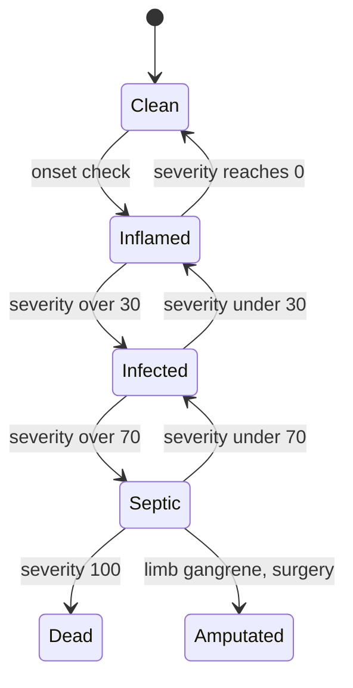
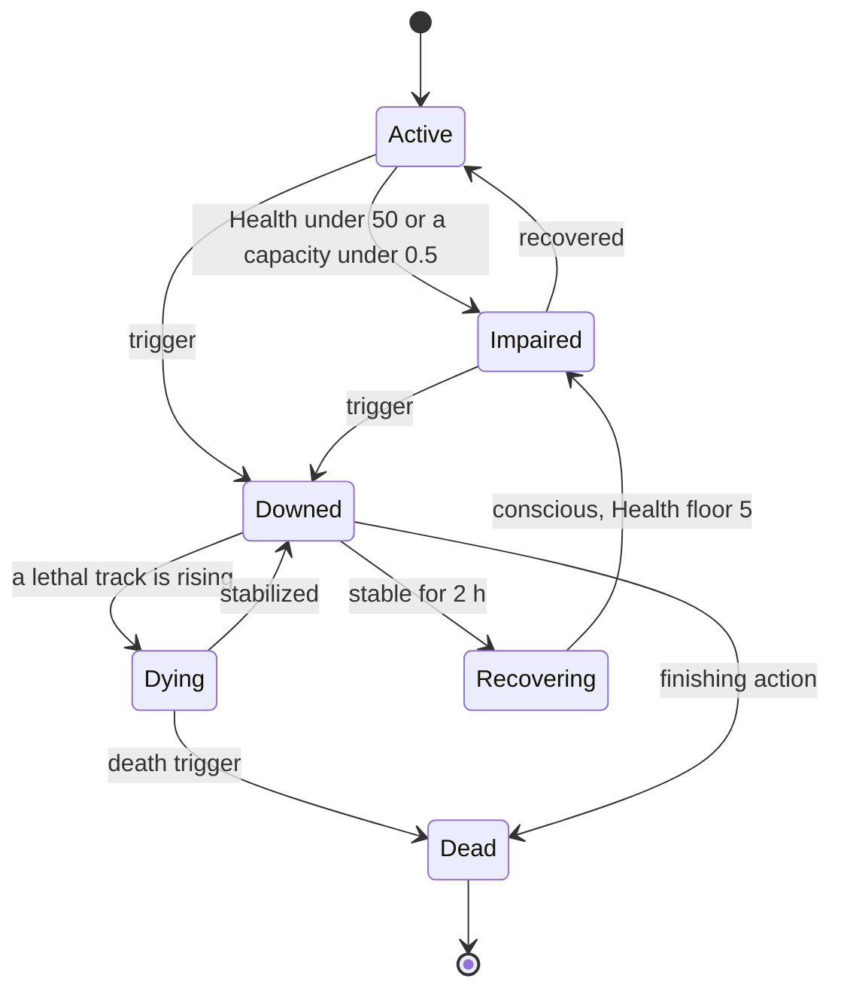

# 11 — Survival

> **Status:** Draft v0.1 · revised for canon v0.3 (decision points) · **Owner doc for:** physical needs (Satiety, Hydration, Energy, Warmth) and Stamina use, health, injuries, bleeding, infection, disease & contagion, poisoning, exposure, food values, nutrition & spoilage, water safety, sleep, encumbrance, swimming & falling, early shelter performance, incapacitation & death, the Landfall scenario · **Depends on:** [01-canon](../01-canon.md), [10-world-and-setting](10-world-and-setting.md), [12-skills-and-professions](12-skills-and-professions.md), [13-crafting-and-minigames](13-crafting-and-minigames.md), [14-technology-and-buildings](14-technology-and-buildings.md), [15-economy-and-trade](15-economy-and-trade.md), [16-social-systems](16-social-systems.md), [17-governance-and-law](17-governance-and-law.md), [18-conflict-and-warfare](18-conflict-and-warfare.md), [19-player-experience](19-player-experience.md), [20-architecture](../tech/20-architecture.md), [21-npc-ai](../tech/21-npc-ai.md), [22-llm-integration](../tech/22-llm-integration.md)

Survival is FeudalSim's first teacher and its longest-running pressure. In Era 0 it decides who lives
to see a hamlet. In Era 4 it decides whether a besieged town surrenders. Every rule here applies
identically to the player and to every NPC (canon tenet 2). The only exception is the player-only
Forgiving difficulty, which belongs to [19](19-player-experience.md).

## Table of contents

1. [Principles & time scales](#1-principles--time-scales)
2. [Physical needs](#2-physical-needs)
3. [Stamina vs. Energy; sleep](#3-stamina-vs-energy-sleep)
4. [Health model](#4-health-model)
5. [Injuries, bleeding, infection & healing](#5-injuries-bleeding-infection--healing)
6. [Conditions](#6-conditions)
7. [Disease & contagion](#7-disease--contagion)
8. [Poisoning & misidentification](#8-poisoning--misidentification)
9. [Temperature & exposure](#9-temperature--exposure)
10. [Food, nutrition & spoilage](#10-food-nutrition--spoilage)
11. [Water](#11-water)
12. [Encumbrance, swimming, falling, accidents](#12-encumbrance-swimming-falling-accidents)
13. [Early shelter](#13-early-shelter)
14. [Incapacitation & death](#14-incapacitation--death)
15. [The Landfall scenario](#15-the-landfall-scenario)
16. [From Landfall to the first Winter](#16-from-landfall-to-the-first-winter)
17. [Early group dynamics: conflict seeds](#17-early-group-dynamics-conflict-seeds)
18. [NPC parity & interfaces](#18-npc-parity--interfaces)
19. [Simulation LOD & Interludes](#19-simulation-lod--interludes)
20. [LLM / Jev touchpoints](#20-llm--jev-touchpoints)
21. [Tuning knobs](#21-tuning-knobs)
22. [Failure modes & exploits](#22-failure-modes--exploits)
23. [Validation & headless tests](#23-validation--headless-tests)
24. [Milestones](#24-milestones)
- [Open questions](#open-questions)
- [Proposed canon additions](#proposed-canon-additions)

---

## 1. Principles & time scales

- **Time-scale policy** ([10](10-world-and-setting.md) §1.2, proposed canon). *Clock-scale*
  processes (hunger, thirst, sleep, bleeding, warmth) run 1:1 in game hours. *Calendar-scale*
  processes (healing, illness course, starvation, preserved-food shelf life) are divided by
  **K ≈ 11.4**, with a 1-game-day floor for anything a person must respond to. This makes a fracture
  heal in about 4 days instead of 6 weeks, so it fits an 8-day season.
- **Rates** are per **game hour** (75 real s at the default 30-minute day). Embodied quantities
  (stamina, breath, combat) are in real seconds ([20](../tech/20-architecture.md) §5.1).
- **Scales:** needs, Blood, condition severities and Stamina run 0–100. Health is 0–100, derived
  (§4).
- **Food unit (proposed canon):** **1 Satiety point (Sat) = 25 kcal.** **1 ration = 100 Sat**, one
  adult's moderate-work day, about 1 kg of bread or about 0.9 kg of field provisions. This matches
  [15](15-economy-and-trade.md)'s ration-day (≈ 3f) and [18](18-conflict-and-warfare.md)'s ≈ 1 kg
  soldier ration.
- **Parity:** NPCs never cheat on needs. Their AI ([21](../tech/21-npc-ai.md)) reads the same
  values and uses the same satisfier actions.

---

## 2. Physical needs

All needs run 0–100, where 100 is fully satisfied. Activity level comes from the action's intensity
tag (`rest | light | moderate | heavy`, assigned by [13](13-crafting-and-minigames.md) for work and
here for movement; jogging counts as moderate, sprinting, swimming and fighting as heavy).

### 2.1 Decay rates (per game hour)

| Activity | Examples | Satiety | Hydration | Energy (awake) |
|----------|----------|---------|-----------|----------------|
| Sleep | Asleep | −3.0 | −2.0 | + (sleep, §3.2) |
| Rest | Sitting, talking, riding a cart | −3.5 | −3.0 | −3.0 |
| Light | Walking, cooking, most bench crafts, tending fires | −4.0 | −3.5 | −3.5 |
| Moderate | Jogging, farming, gathering, building, carrying while burdened | −4.8 | −4.5 | −4.2 |
| Heavy | Felling, mining, smithing, sprinting, swimming, combat, overloaded | −6.5 | −6.5 | −5.5 |

**Standard moderate day** (8 h sleep, 2 h rest, 4 h light, 10 h moderate): **Satiety −95**
(0.95 ration ≈ 2,375 kcal), **Hydration −81** (≈ 2.0 L), **Energy −62 while awake**.

| Modifier | Satiety | Hydration | Energy |
|----------|---------|-----------|--------|
| Child 0–3 / 4–13 | ×0.5 / ×0.7 | ×0.6 / ×0.8 | — |
| Youth / Elder | ×0.9 / ×0.85 | — / — | — / ×1.1 |
| Pregnant / nursing ([16](16-social-systems.md)) | ×1.15 / ×1.25 | ×1.1 / ×1.3 | ×1.1 / — |
| Endurance ([12](12-skills-and-professions.md)) | — | — | ×(1.25 − 0.05·END) |
| Cold / Freezing (§9) | ×1.25 / ×1.4 | — | ×1.1 |
| Air > 22 °C / heat stress | — | ×1.3 / ×1.6 | ×1.1 |
| Fever (any disease) / the Flux | ×1.1 / — | ×1.3 / ×3.0 | ×1.3 / ×1.3 |
| Salt-heavy diet (> 30% of the day's Sat from salted food) | — | ×1.2 | — |
| Recovering from starvation (§6.1) | ×1.15 | — | — |
| Overwork: each labor hour beyond 10 in a game day (13's rule) | — | — | ×1.5 |
| 100 Stamina spent ([18](18-conflict-and-warfare.md)) | — | — | −1 per 100 |

### 2.2 Thresholds & effects

The critical tiers match [21](../tech/21-npc-ai.md) §5.1 (P1 escalation at Satiety < 20,
Hydration < 20, Energy < 12, Warmth < 25). "TempMod" is [12](12-skills-and-professions.md)'s
temporary attribute modifier. "Mood" values are **inputs suggested to 21**, which owns mood.

| Need | Tier | Range | Effects |
|------|------|-------|---------|
| **Satiety** | Sated | 70–100 | Eating is capped at 100; the surplus is wasted |
| | Peckish | 40–69 | — |
| | Hungry | 20–39 | Work speed ×0.95; Stamina regen ×0.9; mood −3 |
| | Ravenous | 1–19 | Work ×0.8; Max Stamina ×0.85; TempMod STR −1; Anger gain ×1.5; willing to eat stale or unknown food |
| | Empty | 0 | **Starvation** accrues (§6.1) |
| **Hydration** | Fine | 60–100 | — |
| | Thirsty | 40–59 | Mood −2 |
| | Parched | 20–39 | Work ×0.9; Energy decay ×1.2; Pain +5 (headache) |
| | Dehydrating | 1–19 | Work ×0.7; TempMod PER −1; **Dehydration** accrues 2/h |
| | Empty | 0 | Dehydration accrues 5/h (+2 if Heavy activity or heat) |
| **Energy** | Rested | 50–100 | — |
| | Tired | 25–49 | Work ×0.9; minigame tolerance ×0.9 ([13](13-crafting-and-minigames.md)) |
| | Exhausted | 12–24 | Work ×0.75; Max Stamina and regen ×0.75 ([18](18-conflict-and-warfare.md)); accident ×2 (§12.4); TempMod DEX −1, PER −1; mood −5 |
| | Collapsing | 1–11 | Involuntary sleep check each hour, `p = (12 − E)/12`, unless in combat or danger; TempMod DEX −2, PER −2, INT −1 |
| | Spent | 0 | Collapses asleep wherever they are (exposure risk) |
| **Warmth** | see §9.4 | | |

### 2.3 Death timelines (nothing taken in; from fully satisfied)

| Deprivation | Path | Typical time to death |
|-------------|------|-----------------------|
| **Water** | Hydration 100 → 19 in ≈ 25 h; Dehydration 0 → 100 over ≈ 23 h more | **≈ 2 game days** |
| **Food** | Satiety 100 → 0 in ≈ 1 day; Starvation 0 → 100 over ≈ 5 days at rest | **≈ 6 game days** (≈ 60–70 real days ÷ K) |
| **Cold** (naked, 0 °C, open ground) | Warmth 80 → 0 in ≈ 6 h; Hypothermia 0 → 100 in ≈ 4–5 h | **≈ 10–11 h** |
| **Cold** (homeland clothes soaked, ≈ 1 °C, wind 3, no fire, no shelter, asleep from dusk) | Clothes dry slowly (§9.3); Freezing by ≈ 02:00, when the cold wakes them. If they stay inert: Hypothermia ≈ 50 by dawn, Downed ≈ 1 h after sunrise | **Survivable for a healthy adult who wakes and moves, huddles or builds a windbreak; lethal to an inert elder or child** (heat loss ×1.25) |
| **Arterial bleed**, untreated | Blood −40/h | **Downed ≈ 1.6 h, dead ≈ 2.5 h** (≈ 3 real min) |
| **Drowning** | Breath 30 + 2·END real s, then 10 s to unconscious, then 60 s | ≈ 1.5–2 real min |

---

## 3. Stamina vs. Energy; sleep

### 3.1 Two pools, two time scales

- **Stamina** is a seconds-scale exertion pool. Its formula belongs to
  [18](18-conflict-and-warfare.md) §2.3 (`Max = 50 + 5·END + 0.2·Athletics`, regen 15/s after 1 s),
  and this doc adopts it as the single stamina pool for all activity. Non-combat drains owned here:
  sprint 8/s; jump 10; climb 5/s; swim §12.2; lifting more than 50% of capacity 2/s; tool swings
  as set by 13. Modifiers: Exhausted ×0.75 (max and regen); Ravenous ×0.85 max; Blood < 80 ×0.85
  and < 60 ×0.6 max; Burdened drain ×1.25; Cold/Freezing regen ×0.7; torso capacity (§4.3) scales
  regen.
- **Energy** is the day-scale need for sleep. It drains with wakefulness and work (§2.1), plus 1 per
  100 Stamina spent.
- At LOD1+ Stamina is not simulated. Its effect is folded into the activity tier's rates.

*Implemented (M2-05b):* `StaminaSystem` runs each step for LOD0 rows (`Survival/StaminaRules.cs`). It applies 18 §2.3
max and regen, ×0.75 Exhausted (Energy < 25), ×0.85 Ravenous max, ×0.7 regen when Cold or worse, and ×0.9 regen when
Hungry. A sprint costs 8/s, and an empty pool is Winded for 1.5 s (no sprint). Every 100 spent costs 1 Energy. The
client reports the player's gait with each move (10 §12.1: Shift jogs at 4.0 m/s, Ctrl sprints at 6.5 m/s while the
sim allows it). The gait also sets the player's activity tier, so needs and exposure use the same rules as for NPCs:
walk light, jog moderate, sprint heavy, standing still rest. Jump, climb, lift and swim drains wait for those actions.
NPCs don't sprint yet (flee and combat are M2's).

### 3.2 Sleep

`Energy gain per hour asleep = 8.5 × bedding × warmthF × disturbance`

| Bedding | Factor | | Warmth while asleep | warmthF |
|---------|--------|-|---------------------|---------|
| Bare ground | 0.55 | | ≥ 60 | 1.0 |
| Cloak or bedroll on ground | 0.70 | | 40–59 | 0.8 |
| Bough / bracken bed | 0.85 | | 25–39 | 0.5 (wakes repeatedly) |
| Straw pallet | 0.95 | | < 25 | 0.2, and wakes when Warmth < 20 |
| Bed (frame + mattress + blanket) | 1.00 | | | |
| Good bed (feather) | 1.15 | | | |

**Disturbance** multipliers: Pain ≥ 50 ×0.7; fever ×0.8; Safety < 30 ×0.8 ([21](../tech/21-npc-ai.md));
crowding below 4 m² per sleeper ×0.9; watch duty interrupts.

*Example:* 8 h in a bed at Warmth 70 gives +68, which restores the standard day's −62. 8 h on bare
ground at Warmth 45 gives `8.5 × 0.55 × 0.8 × 8 = +30`. Two such nights in a row leave a settler
Exhausted by the second afternoon. That pressure is what drives people to build shelters and beds.

**Naps:** up to 2 h, ×0.8 rate. **Bedding warmth** is counted as insulation while asleep (§9.2).
**Sleeping (time skip)** for the player follows canon §6. Interludes require a **qualifying bed**:
bough bed or better, inside a shelter with rain-block ≥ 0.9 and an insulation bonus ≥ 5 °C (hut tier,
§13), which the player owns or has household rights to.

---

## 4. Health model

### 4.1 Decision: discrete injuries on six regions + a derived Health score

**Rejected:** (a) a single HP bar, which cannot express a broken leg, infection or a limp; (b) full
per-organ simulation, which is opaque and costly at 1,500 people. **Chosen:** each person holds
**Injury records** on six regions (`Head, Torso, ArmL, ArmR, LegL, LegR`, matching
[18](18-conflict-and-warfare.md)'s `BodyRegion`), plus **Blood** (0–100), **Pain**, a **Bruise pool**
and **Conditions** (§6). **Health** (0–100) is derived from these each tick. It is the canon "health"
whose zero means *downed*.

```
Health = clamp(100 − Bruise − Σ injury.severity − 0.8·(100 − Blood) − ConditionLoad, 0, 100)
ConditionLoad = Σ condition.severity × w   (w: hypothermia 0.6, dehydration 0.5, starvation 0.3,
                                            infection 0.5, disease stage 0.2–0.6, heat stress 0.5)
```

**Consistency with [18](18-conflict-and-warfare.md):** a combat hit of `effective` damage lowers
Health by exactly `effective` at impact. Hits < 8 go to the **Bruise pool** (no record; it recovers
10 per game hour). Hits ≥ 8 create an injury whose **initial severity = effective**. Severity tiers
are 18's: **Minor 8–19 · Moderate 20–34 · Severe 35–54 · Critical ≥ 55**.

### 4.2 Injury record

```csharp
public sealed record Injury(long Id, BodyRegion Region, InjuryType Type, float Severity /*0–100*/,
    float BleedRate /*Blood per game hour*/, float Contamination /*0–1*/, InfectionState Infection,
    float InfectionSev, TreatmentFlags Treated /*bandaged, cleaned, stitched, splinted, set…*/,
    float TreatQuality /*0–1 from 13's TreatmentResult*/, bool Open, bool Arterial,
    long CreatedAt, string SourceEventId);
public enum InjuryType { Cut, Puncture, Bruise, Fracture, Burn, Frostbite, Concussion, Internal }
```

Type mapping from trauma: **cut** damage → Cut. **Pierce** → Puncture; on the Torso at Severe or
worse, 50% also add an Internal injury. **Blunt** → Bruise, or Fracture on a limb with
`p = clamp((sev − 25)/30, 0, 0.9)`, or Concussion on the Head with p 0.4 at ≥ 20 (plus 18's knockout
rule: 10%). Animal bites arrive through 18 as cut/pierce with an `animal` source (contamination 0.8).

### 4.3 Capacities & penalties

`capacity(region) = clamp(1 − Σ sev × impair(type, treatment)/100, 0, 1)`. The impair factors are:
cut 0.6, puncture 0.7, bruise 0.3, burn 0.6, frostbite 0.5, concussion 1.0 (head),
fracture 1.5 unsplinted / 0.6 splinted.

| Capacity | From | Drives |
|----------|------|--------|
| Manipulation (per arm) | ArmL, ArmR | Craft precision and work rate ([13](13-crafting-and-minigames.md)); weapon use |
| Mobility | min(LegL, LegR) | Move speed (an unsplinted leg fracture means crawling at 0.5 m/s); carrying |
| Consciousness / Perception | Head | Perception radius; knockout checks; minigame precision |
| Breathing | Torso | Stamina regen |

**`GetCombatPenalties`** (the [18](18-conflict-and-warfare.md) interface; queried at 1 Hz and on any
change):

| Field | Formula |
|-------|---------|
| `AttackSpeedMult` | 0.5 + 0.5·Manip(weapon arm) |
| `DamageMult` | 0.6 + 0.4·Manip(weapon arm) |
| `MoveSpeedMult` | 0.3 + 0.7·Mobility × bloodF (Blood < 60: ×0.8) |
| `StaminaRegenMult` | (0.5 + 0.5·Breathing) × (Blood < 60 ? 0.6 : 1) |
| `PerceptionMod` | −3·(1 − Head) |
| `CanUseTwoHanded` | min(ManipL, ManipR) ≥ 0.6 |

**Pain** = `Σ sev × painF(type) × (1 − analgesia)`, clamped 0–100. painF: cut 0.5, puncture 0.6,
fracture 1.0 (0.5 splinted), burn 0.9, frostbite 0.3, concussion 0.4, bruise 0.4; Inflamed infection
adds +10. **Skill-check modifier = −Pain/5**, clamped to [−20, 0] ([12](12-skills-and-professions.md)).
Willow bark gives analgesia 0.3 for 6 h; strong ale 0.15 (with intoxication, §6.5). At Pain ≥ 70,
work ×0.7.

### 4.4 Worked example

A settler takes a wolf bite to the left leg (pierce, effective 26, Moderate) and a scratch to the arm
(5 → Bruise). Health = 100 − 5 − 26 − 0 = **69**. The bite bleeds at 5/h. Unbandaged for 2 h
(clotting ×0.75 per hour, so 5 + 3.75 lost), Blood falls to ≈ 91:
Health = 100 − 0 (Bruise recovered) − 26 − 0.8·8.75 = **67**.
Mobility = 1 − 26·0.7/100 = 0.82, so move speed ×0.87. Contamination 0.8 (animal), so infection is
likely unless the wound is cleaned (§5.3).

---

## 5. Injuries, bleeding, infection & healing

### 5.1 Injury catalog

| Type | Common sources | Bleed (by tier: Minor / Moderate / Severe / Critical) | Open wound? | Base heal days (sev 50, treated, rested) | Treatment that matters | Permanent risk |
|------|---------------|------------------------------------------------------|-------------|------------------------------------------|------------------------|----------------|
| Cut | Blades, tools, falls on rock, claws | 1 / 4 / 10 / 25 per h (25% of Critical limb cuts are **arterial**: 40/h) | Yes | 1.5 | Bandage, clean, stitch (≥ 35) | Scar; Severe/Critical arm cut: tendon damage 10% (DEX −1) |
| Puncture | Arrows, spears, tusks, bites, stakes | 1 / 5 / 12 / 30 | Yes | 2.5 | Extract the object first; clean; pack | Scar; Torso: Internal |
| Bruise | Blunt, falls | 0 | No | 0.5 | Rest, cold compress | — |
| Fracture | Falls, blunt weapons, falling trees, kicks | 0 (compound if sev ≥ 55 with p 0.3: +8/h, open) | Only if compound | 4.0 | **Set** (`surgery`) and **splint** (`wound_dressing`) within 12 h | **Malunion** (§5.5) |
| Burn | Fire, hot metal, cauldron, cautery | 0 | Yes if ≥ 20 | 2.0 | Cool water within 10 game min (−20% sev); clean dressing; honey | Scar; Critical hand burn: contracture (DEX −1) |
| Frostbite | Exposure (§9.5) | 0 | Yes if necrotic | 2.0 | Slow rewarming (warm water or body heat, not fire), keep dry | Necrosis at ≥ 55 → digit loss |
| Concussion | Head blows, falls, knockout | 0 | No | 1.0 | Rest; a second blow before healed: sev ×2 | Repeated (3+ in life): INT −1 |
| Internal | Torso puncture, heavy blunt, falls | Hidden 3–8 per h | No | 3.0 | Rest; diagnosed only by Healing ≥ 40; `surgery` halves the rate | Chronic Pain +5 |

### 5.2 Bleeding

- **Blood** runs 0–100. Effects: < 80 Max Stamina ×0.85; < 60 work ×0.6 and fainting on exertion
  (p 0.1/h); **< 35 Downed**; **0 dead**.
- **Natural clotting:** Minor stops after 1 h. Moderate decays ×0.75 per h. Severe decays ×0.9 per h
  (about 100 Blood in total if left alone, which is potentially fatal over a day). Critical and
  arterial bleeds do not decay.
- **Treatment** (quality `q` from [13](13-crafting-and-minigames.md)'s `TreatmentResult`):

| Action | Know-how / skill ([12](12-skills-and-professions.md)) | Supplies | Effect on bleeding |
|--------|-----------------------------------------------|----------|--------------------|
| Pressure (anyone) | — | Hands | While held: rate ×0.5 |
| Bandage | `wound_dressing` (Healing 5) | Linen, wool or moss | Minor/Moderate stop; Severe ×(0.4 − 0.3q); Critical ×(0.7 − 0.4q) |
| Tourniquet (limb) | `wound_dressing` | Cord + stick | Stops any limb bleed, arterial included. After 2 h, 10%/h chance of limb necrosis (→ amputation) |
| Stitch | `wound_dressing`, Healing ≥ 20 | Needle, gut or linen thread | Stops Severe/Critical cuts; heal ×1.3; scar chance −50% |
| Cautery | Healing ≥ 25 | Hot iron or blade (salvaged iron is precious) | Stops any bleed; resets infection to Clean; adds a Burn (sev 20) |

- **Regeneration:** +0.8 Blood/h when not bleeding, Hydration ≥ 40 and Satiety ≥ 30 (×1.5 at bed
  rest). Losing 65 Blood therefore takes ≈ 3.4 game days to recover, which is calendar-scale
  consistent (§1).

### 5.3 Infection

**Open wounds** (cuts, punctures, burns ≥ 20, compound fractures, necrotic frostbite) carry a
**contamination** `c` set at creation and an infection track.

| Source | c₀ | | Cleaning | Multiplier on c |
|--------|----|-|----------|-----------------|
| Clean blade | 0.2 | | Boiled water | ×(1 − 0.7q) |
| Tool, wood, earth, battlefield, arrow | 0.5 | | Wine or vinegar | ×0.6 |
| Animal bite or claw | 0.8 | | Honey dressing | ×0.5 (also infection progression −2 per slot) |
| Burn | 0.3 | | Yarrow / plantain / ramsons poultice | ×0.75 / 0.8 / 0.85 ([10](10-world-and-setting.md) §7.3) |

**Onset check** every 6 game hours while the wound is open:
`p = base(type) × c × susceptibility`. The base is cut 0.06, puncture 0.10, burn 0.08,
compound 0.12. **Susceptibility** = 1.0 × (Underfed 1.2 · Malnourished 1.5 · Starving 2.0) ×
(elder 1.3) × (Cold 1.2) × (Scurvy ≥ 60: 1.5).

*Check:* an untreated bite (c = 0.8) gets p = 0.08 per slot. Over the ~10 slots it stays open,
**≈ 57%** become infected. Cleaned with boiled water (q 0.7) and dressed with honey, c falls to 0.12
and the rate to **≈ 11%**.



**Progression** per 6 h: `ΔI = +16 − (2 + 0.8·END + 2·[bed rest] − 3·[Malnourished+]) − treatment ± N(0, 3)`,
with treatment = poultice 2 + 4q, honey 2, and nursing 2. Untreated (END 5) that is about +8 per
slot: **Infected in ~1 day, Septic in ~2.2 days, dead in ~3 days**. Treated with a good poultice
(q 0.8) it is about +1 per slot: the wound stalls and resolves as the injury heals. **Lancing**
(Healing ≥ 20) gives −15 at once. **Amputation** (`surgery`, Healing ≥ 40, a saw or knife, cautery)
stops limb gangrene, with survival `0.7 + 0.25q`, ×0.7 if Starving. [12](12-skills-and-professions.md)'s
*Physician* perk applies its "treated mortality −30%" as virulence ×0.7 and death-roll ×0.7.

**Effects:** Inflamed Pain +10, healing ×0.5. Infected: fever (§2.1), healing 0, TempMod END −1.
Septic: work ×0.3, **Downed at ≥ 90**.

### 5.4 Healing

Each day, severity falls by `(50 / baseDays) × M`, where

`M = rest × nutrition × treatment × age × endurance × infection × scurvy × warmth`

| Factor | Values |
|--------|--------|
| rest | Bed rest 1.4 · light work 1.0 · normal work 0.75 · heavy work 0.5 |
| nutrition | Fed 1.0 · Underfed 0.75 · Malnourished 0.5 · Starving 0.2 |
| treatment | Untreated 0.6 · treated `0.6 + 0.6q` (0.6–1.2) |
| age | Child 1.25 · adult 1.0 · elder 0.7 |
| endurance | 0.8 + 0.04·END |
| infection | Clean 1 · Inflamed 0.5 · Infected or Septic 0 |
| scurvy, warmth | Scurvy ≥ 60: 0.5 · Cold or worse: 0.8 |

*Example:* a Severe arm cut (sev 50) stitched by a Journeyman (q 0.7 → 1.02), on light work, fed, adult,
END 6 (1.04): M = 1.06, so it closes in **1.4 days**. Untreated and on normal work:
M = 0.6 × 0.75 × 1.04 = 0.47, so **3.2 days**, with about four times the infection exposure.

### 5.5 Scars & permanent effects

These are written to [12](12-skills-and-professions.md)'s `InjuryMod` (0…−4) and tagged for
[16](16-social-systems.md).

| Outcome | Trigger | Effect |
|---------|---------|--------|
| Scar (visible tag) | Cut/puncture/burn ≥ 35 (×0.5 if stitched) | Appearance tag. Brannoch culture reads it as Courage +; others neutral or slightly negative |
| Malunion | Fracture not set within 12 h: p 0.6. Set: `p = max(0.05, 0.6·(1 − q))` | Arm: Manipulation −15% permanent, DEX −1. Leg: limp, Mobility −15%, END −1 |
| Ruined knee | Critical leg fracture or puncture at the joint, 30% | END −2 (12's example) |
| Lost finger(s) | Critical hand cut, necrotic frostbite, crush | One finger DEX −1; ≥ 2 fingers DEX −2 (12) |
| Lost eye | Critical head cut/puncture, 20% | PER −2; archery penalty per [18](18-conflict-and-warfare.md) |
| Amputation | Gangrene, crush, tourniquet necrosis | Hand: DEX −3 and one-handed. Leg: Mobility ×0.5 with a crutch/peg (14 craft) |
| Chronic pain | Any Critical injury, 25% | Pain +10 in Cold or Wet weather (the "old wound aches before rain" belief is true here) |
| General | Any Critical injury | 40% chance of one of the above, beyond the specific triggers |

---

## 6. Conditions

A **condition** is a tracked severity 0–100 with a progression rule, effects at thresholds, and
(for most) death at 100. It is stored in [20](../tech/20-architecture.md)'s condition list. Disease
(§7) and poisoning (§8) are conditions too.

### 6.1 Starvation (hunger debt)

While Satiety = 0, each hour's unmet demand accrues: **`S += 0.25 × (that hour's Satiety demand)`**,
with children ×1.3 and elders ×1.2. Recovery: when Satiety ≥ 60, `S −= 0.25/h`, and Satiety decays
×1.15 (the body rebuilding).

| Tier | S | Effects |
|------|---|---------|
| Underfed | 25 | TempMod STR −1; healing ×0.75; infection susceptibility ×1.2; mood −5 |
| Malnourished | 50 | STR −1, END −1; work ×0.8; healing ×0.5; susceptibility ×1.5; conception per [16](16-social-systems.md); **children: ≥ 4 days at this tier costs −1 Potential in STR or END** (stunting, written to 12) |
| Starving | 75 | STR −2, END −2, INT −1; work ×0.5; healing ×0.2; susceptibility ×2 |
| Collapse | 90 | Downed (§14) |
| Death | 100 | — |

**Famine curves** (adult, standard day unless noted):

| Intake | Daily S gain | Underfed | Malnourished | Starving | Death |
|--------|--------------|----------|--------------|----------|-------|
| None (resting, ~80 Sat demand) | +20 | day 2.3 | day 3.5 | day 4.8 | ≈ day 6 |
| ½ ration | +12 | day 3 | day 5 | day 7 | ≈ day 9.5 |
| ¾ ration | +6 | day 5 | **day 9** (a season) | day 13.5 | ≈ day 18 |
| ¾ ration in Winter (often in the Cold tier, ≈ 107 Sat demand) | +8–9 | day 4 | day 6.5 | day 9 | ≈ day 12 |

The design intent is that **¾ rations get you through a Winter hungry, while ½ rations kill the weak
by the spring hunger gap.**

### 6.2 Dehydration

Accrues per §2.2. Recovery is −10/h once Hydration ≥ 40. Effects: at 30, Pain +10 and work ×0.8;
at 60, TempMod END −1, INT −1, work ×0.5; at **85 Downed**; at **100 dead**.

### 6.3 Nutrition deficiencies

| Condition | Accrues when (rolling 6 days) | Rate | Effects |
|-----------|------------------------------|------|---------|
| **Scurvy** | Fresh foods < 5% of Sat | +8/day (−15/day once Fresh ≥ 10%) | 30: Energy decay ×1.2. 60: healing ×0.5, old scars reopen (Minor bleed 1/h), susceptibility ×1.5. 90: tooth loss (permanent appearance tag), Downed on exertion |
| **Wasting** | Protein < 5% of Sat | +6/day (−12/day once ≥ 10%) | 30: TempMod STR −1. 60: STR −2, healing ×0.8 |

Real scurvy appears after 1–3 months without fresh food, which is about 6 game days. The famous
late-winter sickness happens here.

### 6.4 Heat stress & frostbite

**Heat stress** begins when the thermal sum C > 34 (§9.1) for 2 h: +10/h while C > 34, −20/h when
C < 28. At 50, heat exhaustion: work ×0.5 and Hydration ×1.6. At 90 heatstroke: Downed. At 100,
death. In this climate it needs armor or heavy work in a Hot year. Frostbite is described in §9.5.

### 6.5 Intoxication

`I` (0–1) is the input [18](18-conflict-and-warfare.md) uses in its confrontation function.

| Drink | Units per litre |
|-------|-----------------|
| Small ale | 1 |
| Strong ale | 2.5 |
| Mead | 4 |

`I += units × 0.12 × (70 / body kg)`, decaying 0.08/h. Effects: I > 0.3 tipsy (effective
Volatility +10, PER −1). I > 0.6 drunk (DEX −2, PER −2, stumbling, warmth *feels* fine: Cold-tier
mood penalty suppressed while actual loss continues). I > 0.9 blackout (Unconscious, which is a
real exposure risk). Drunkard withdrawal belongs to [19](19-player-experience.md) and
[21](../tech/21-npc-ai.md).

---

## 7. Disease & contagion

### 7.1 Disease definition (content)

```yaml
id: disease.flux
name: "the Flux"                     # dysentery
routes: [water, food, contact]
incubation_h: [8, 16]
stages:
  - { id: onset,    hours: [6, 12],  contagious: 0.5, effects: { hydration_decay: 2.0, work: 0.6 } }
  - { id: acute,    hours: [18, 36], contagious: 1.0, effects: { hydration_decay: 3.0, satiety_absorb: 0.5, work: 0.2, condition_load: 0.4 } }
  - { id: recovery, hours: [12, 24], contagious: 0.3, effects: { work: 0.8 } }
grave_branch: { base: 0.02, mult: { child: 3, elder: 2.5, malnourished: 2, starving: 4 } }   # plus deaths via Dehydration
treatment: { fluids: { dehydration_rate: 0.5 }, herb.meadowsweet: { work: +0.1 } }
immunity_days: 4
first_milestone: M2
```

### 7.2 Disease catalog

| Disease | Route | Incubation / course | Case fatality (untreated → nursed) | High-risk | Immunity | Source of cases | M |
|---------|-------|---------------------|-----------------------------------|-----------|----------|-----------------|---|
| **The Flux** (dysentery) | Water, food, contact | 0.5 d / 1–2 d | 2% direct + dehydration deaths → ~0.5% with fluids | Children ×3, elders ×2.5, malnourished | 4 days | Contaminated water (§11), a sick cook, latrines upstream | M2 |
| **Food poisoning** | Spoiled, raw or undercooked food | 2–6 h / 6–12 h | ≈ 0 (0.5% for children and elders) | — | None | §10.4; 13's `flaw.undercooked` | M2 |
| **Wound fever** | Wound infection | §5.3 | §5.3 | Malnourished | — | Injuries | M2 |
| **Winter cough** (grippe) | Airborne, close quarters | 0.5–1 d / 1–2 d | 0.3%; **lung fever** complication p 0.08 (elders ×3, malnourished ×2, Cold nights ×1.5, under-2s ×2) with CFR 25% → 15% | Elders, infants | 2 years | Introduced each Winter with p 0.35 (+0.3 if a ship called that year) | M3 |
| **Ague** (marsh fever) | Environmental, not person-to-person | Bouts every 2 days for the season | 0.5% (children ×3) | Wetland dwellers | Partial (p ×0.5 next year) | Sleeping within 300 m of Wetland, Summer to Autumn 4: per night `p = 0.015 × (1 − 0.5·rainBlock)` | M3 |
| **Camp fever** (typhus-like, lice) | Shared bedding, crowding, dirt | 1–2 d / 2–3 d | 15% → 10% (malnourished ×2) | The crowded and unwashed | Long | Crowding < 4 m²/resident with Sanitation < 40 ([14](14-technology-and-buildings.md)); army camps and sieges (exposure from [18](18-conflict-and-warfare.md)) | M4 |
| **Spotted fever** (measles-like) | Airborne, very contagious | 1 d / 2 d | Children 5% (malnourished ×3); adults 1% | **Farstrand-born children** (90% of homeland-born adults are immune) | Lifelong | Immigrant ships (p 0.15 each, [10](10-world-and-setting.md) §14.3) | M4 |
| **The Grey Death** (plague) | Fleas from ship rats into stores and bedding; 20% of cases turn pneumonic (airborne) | 1–2 d / 1–3 d | Bubonic 40% → 30%; pneumonic 90% | Everyone | Lifelong | The last ship (p 0.35) or a late ship (p 0.10) | M5 |
| Fire-sickness (ergot) | Eating damp-stored rye | Chronic | Gangrene in limbs; hallucination (irrational acts per [21](../tech/21-npc-ai.md)) | — | — | Rye only arrives with Brannoch or immigrants; Wet years | M5, optional |

Childbed fever is the §5.3 infection model applied to childbirth, triggered by
[16](16-social-systems.md) §11.7.

### 7.3 Contagion model

**LOD0/LOD1 (individual, per game hour).** For each infectious person *i* and susceptible person *j*
sharing a context,

`p = 1 − exp(−β_d × w_ctx × inf_i × sus_j × Δt_h)`

| Context | w_ctx |
|---------|-------|
| Same sleeping room at night | 1.0 × `(6 / max(2, m² per sleeper))^0.5` (Crowding from 14) |
| Same dwelling by day | 0.6 |
| Working together (same task site) | 0.4 |
| Conversation ≥ 10 game min | 0.3 |
| **Caregiving** | 1.5 (×0.5 with `herbal_remedies`) |
| Outdoors within 3 m | 0.15 |
| Shared pot / meal (Flux, food) | 0.2 |

| Disease | β_d |
|---------|-----|
| Winter cough | 0.06 |
| Camp fever | 0.03 |
| Spotted fever | 0.12 |
| Plague (pneumonic) | 0.10 |
| Flux (contact) | 0.005 |

`sus_j` = 1 × the susceptibility in §5.3 × (1 − immunity). `inf_i` = the stage's contagiousness.

**LOD2 (household SEIR, hourly):**
`λ_h = β(w_home·I_h/N_h + w_comm·I_s/N_s)`, with `w_home` 1.0 and `w_comm` 0.15 (0.05 when the
settlement has under 30 people). **LOD3 (settlement SEIR with household correction, daily)**,
calibrated to match LOD1 attack rates within ±20% ([16](16-social-systems.md) has the same
requirement).

**Quarantine.** Any person can self-isolate. NPCs do so when they hold the folk belief "the cough
passes by breath" (an Ember homeland belief, [16](16-social-systems.md)) and their Warmth or Family
value is high. A leader can order isolation of the sick into a sick-house or their own hut
([17](17-governance-and-law.md) decides authority and compliance). An isolated person's contexts
drop to caregiving only, so carers bear the risk. That creates a real moral cost and a
conflict seed: who nurses the plague-stricken?

### 7.4 Sanitation & outbreaks

[14](14-technology-and-buildings.md) supplies **Sanitation** (0–100) and a **Contaminated** flag per
water source. This doc turns them into incidence:

- **Water contamination** `c_src` (§11.1) gains +0.25 if Contaminated, +0.2 per active Flux case
  using a latrine upslope or upstream, and +0.3 for 3 days after a carcass or corpse falls in.
- **Background Flux** per person per day: `0.002 × (1 + (60 − Sanitation)/30)` when Sanitation < 60.
- **Army camps** ([18](18-conflict-and-warfare.md) §9.5): 18's daily outbreak probability picks
  Flux (70%) or Camp fever (30%), seeding 1–3 cases into the camp's contact model.

---

## 8. Poisoning & misidentification

### 8.1 Toxins

| Toxin | Source ([10](10-world-and-setting.md) §7.3) | Onset | Course & effect | Untreated CFR | Treatment |
|-------|-----------------------------------|-------|-----------------|---------------|-----------|
| Death cap | Mistaken for field mushroom (Autumn) | **8–12 h (false calm)** | Liver failure over 1–2 d | 40% | Emetic within 4 h → 10%; later, fluids and nursing → 30% |
| Hemlock / **water hemlock** | Mistaken for wild carrot / valerian root | 0.5–2 h | Seizures, paralysis | 50% / 70% | Emetic within 1 h halves it |
| Deadly nightshade | Berries (children) | 1–3 h | Delirium | 15% (children 40%) | Emetic |
| Fly agaric | Deliberate or mistaken | 1 h | Hallucination 4–8 h (Volatility +40 effective, irrational acts) | 1% | Rest |
| Foxglove | Mistaken for comfrey | 2–6 h | Heart failure | 20% | — |
| Lily of the valley | Mistaken for ramsons | 1–2 h | Heart | 10% | — |
| Yew | Seeds and foliage | 1–2 h | Heart | 30% (people); 60% (goats; [13](13-crafting-and-minigames.md) husbandry) | — |
| Shellfish toxin | Summer bloom (p 0.3/yr) | 0.5 h | Paralysis | 10% | — |

**Dose:** severity = `100 × amount / lethalDose`. Below 100 the CFR scales down; above 100 it
approaches the listed figure. **A poisoned ingredient in a shared pot poisons everyone who eats
from it.** One hemlock root in the communal pottage is a mass-casualty event and an accusation
engine ([16](16-social-systems.md): was it an accident?).

### 8.2 Misidentification

Foraged items have a **true identity** and a **label** (what the gatherer believes it is). The ID
check fires once per gathering trip, and only when the patch has a look-alike nearby (worldgen
co-occurrence 10–30%):

`p_correct = clamp(0.6 + 0.004·Foraging + 0.1·[wild_food_lore] + 0.15·[holds a true belief about this species] + 0.02·(PER − 5) − confusability, 0.5, 0.995)`

On failure the stack is labeled as the look-alike. **Second chances:** anyone inspecting the item
(the cook before cooking, the healer before making a remedy) re-checks with their own skill and
corrects the label on success. The cook is the last line of defense. An average forager poisons
someone about once per 50 trips that pass through look-alike country. An expert almost never does.
Knowledge that "the white-flowered carrot by the stream is death" spreads as a **belief** and
lowers everyone's risk ([12](12-skills-and-professions.md) §8.2: local lore is belief, not know-how).

---

## 9. Temperature & exposure

### 9.1 Thermal balance

```
T_amb   = T_air(cell, hour)                                   // 10 §6.2 (interior temp if indoors, §13)
        − windChill                                           // 0.6 × max(0, wind − 2) × (1 − windBlock), cap 8 °C
        + fireBonus                                           // campfire: ≤1.5 m +10 · ≤3 m +6 · ≤4 m +3 (14: r 4 m); ×1.3 in front of a lean-to
Ins_eff = Σ slots Ins_item × m(Q) × (1 − (1 − wetRet_item) × Wetness/100)    // m(Q) = 0.85 + 0.003·Q (13)
        (+ bedding insulation while asleep)
C       = T_amb + Ins_eff + activityHeat                      // sleep −2 · rest 0 · light +2 · moderate +4 · heavy +7
```

**Warmth dynamics** (per game hour):

- **C ≥ 18, near a fire, or after a hot meal/drink:** Warmth rises toward 100 at +10/h.
- **14 ≤ C ≤ 30:** Warmth drifts toward 80 at ±6/h.
- **C < 14:** Warmth falls by `1.0 × (14 − C)` per hour (children and elders ×1.25).
- **C > 30:** hydration ×1.3; heat stress (§6.4) if C > 34.

A hot meal gives +5 Warmth (+10 for a hot pottage in Winter). A hot drink gives +4.

**Immersion** (swimming, capsizing, falling through ice) replaces the air formula:
`C = T_water − 6 + 0.2·Ins`, and cold loss is ×3. In 8 °C spring sea water a clothed swimmer loses
about −20 Warmth/h. Water temperatures come from [10](10-world-and-setting.md) §6.2.

### 9.2 Clothing & bedding

| Item | Slot | Ins (°C) | Wet retention | Rain resist | Source |
|------|------|----------|---------------|-------------|--------|
| Linen shirt / shift | Torso | 1 | 0.2 | 0 | Homeland; T1 |
| Wool tunic / kirtle | Torso | 4 | 0.6 | 0.1 | Homeland; T1 |
| Wool hose / trousers | Legs | 2 | 0.6 | 0.1 | Homeland; T1 |
| Leather turnshoes | Feet | 1 | 0.4 | 0.3 | Homeland; T1 |
| Wool cloak | Cloak | 3 | 0.6 | 0.3 | Homeland; T1 |
| Wool hood | Head | 1.5 | 0.6 | 0.2 | Homeland; T1 |
| Wool mittens | Hands | 1 | 0.5 | 0 | T1 |
| Hide jerkin | Torso | 3 | 0.5 | 0.5 | T0 |
| **Fur cloak** (deer, wolf, bear) | Cloak | 7 | 0.5 | 0.5 | T0 (hunting + `hide_curing`) |
| Fur hat / fur-lined boots | Head / Feet | 2.5 / 3 | 0.5 | 0.4 | T0 |
| Oiled or waxed cloak | Cloak | 2 | 0.7 | 0.8 | T1 |
| Sailcloth poncho | Cloak | 1 | 0.3 | 0.7 | Salvage |
| Grass or bark wrap | Any | 1 | 0.2 | 0.2 | Improvised |
| Gambeson ([18](18-conflict-and-warfare.md)) | Torso | 6 | 0.4 | 0.2 | T2 (hot in Summer) |
| Bedding while asleep: cloak +3 · wool blanket +6 · fur +9 · bracken bed (ground insulation) +3 | — | — | — | — | — |

The **homeland kit** (shirt, tunic, hose, shoes, cloak, hood) gives **Ins 12.5**. The **winter kit**
target is **Ins ≥ 18** (swap in a fur cloak, add mittens and a fur hat). That means about one large
hide or pelt per person before Winter, which makes it a real Autumn objective.

### 9.3 Wetness

Wetness runs 0–100 per person, and wading wets the legs only.

**Gains per hour:**

| Source | Wetness |
|--------|---------|
| Drizzle | 8 |
| Rain | 20 |
| Storm | 35 |
| Sleet | 25 |
| Snow (on warm clothes) | 4 |
| Sweat (Heavy activity with C > 24) | +6 |

Precipitation gains are multiplied by `(1 − cloak rain resist) × (1 − shelter rainBlock)`.
Immersion sets Wetness to **100**. Wading ≤ 0.5 m sets it to 30, and 0.5–0.9 m to 60.

**Drying per hour (not in rain):** `4 + 0.4·max(0, T_air) + 0.8·wind`, plus +20 within 3 m of a
fire, or +12 inside a heated building. Wool soaked by surf dries by a campfire in about 3 h.
Temperate cold kills through **wet + wind**. The model is built around that.

### 9.4 Warmth tiers

| Tier | Warmth | Effects |
|------|--------|---------|
| Comfortable | 60–100 | — |
| Chilly | 40–59 | Mood −2 |
| Cold | 25–39 | Shivering: Satiety ×1.25; minigame tolerance ×0.9; TempMod DEX −1; Stamina regen ×0.7 |
| Freezing | 1–24 | **Hypothermia** accrues `(25 − Warmth)/2.5` per hour; TempMod DEX −2; sleep warmthF 0.2 |
| Exposed | 0 | Hypothermia `+8 + 0.75·max(0, 14 − C)` per hour (naked at 0 °C: +18.5/h) |

**Hypothermia** recovers −15/h once Warmth ≥ 40. At ≥ 50: confusion (INT −1, PER −1; getting-lost
chance ×2 per [10](10-world-and-setting.md) §10). At ≥ 80: **Downed** (unconscious). At **100: dead**.

### 9.5 Frostbite

If `T_air − windChill < −5 °C`, the hands (or feet) slot Ins is < 2, and Warmth < 40, then
hands/feet gain a Frostbite injury at **+6 severity per hour** (the face at < −12 °C). Wet feet
count as Ins 0. Rewarming must be gradual: warming at a fire at < 1 m adds a Burn (sev 10). Necrosis
at ≥ 55 leads to digit loss (§5.5). It is rare at sea level and common on highland expeditions in
Winter.


### 9.6 Implementation notes (M2-05a)

`Sim/Survival/Exposure.cs` holds the §9.1–9.4 rules as pure functions; `ExposureSystem` applies them per person in the
camp. Clothing is content (`content/items/wear.yaml`, a `wear` block per item); each person has a `Worn` record
(one item per slot) and a `Body` record (Wetness, Hypothermia), both saved and hashed. The scenario's `camp:` block
carries the shelter (Landfall: `sailcloth_shelter`), the bed's ground insulation, the elevation and coast flag, and the
kit everyone lands in, the player included. Hypothermia raises an event at 50 and 80; being Downed at 80 and dying at 100
are handled by §14's `HealthSystem` (M2-06a). Frostbite (§9.5) is an injury, so it is M2-06's too. Choices the rules left open (Q8):

- A **shirt or shift** sits in its own *Under* slot beneath the tunic, so the homeland kit fills six slots (Ins 12.5).
- A **worn cloak counts once**. The §9.2 bedding row "cloak +3" is a spare cloak used as a blanket. The camp's bough bed
  gives only its ground insulation (+3).
- **"Near a fire"** in the §9.1 warmth rule means within 3 m of a lit fire (the +6 ring and closer).
- **Out of the rain** includes a shelter with rainBlock ≥ 0.9, which dries as if dry. Lower blocks only scale the gain.
- **Drying uses the felt wind** (wind × (1 − windBlock)).
- **Immersion adds activity heat**. §9.1's −20/h in 8 °C sea comes out for a soaked, clothed swimmer at moderate effort.
- **Hot meals and drinks** (+5/+4 Warmth) wait for cooking (13).

The camp sweep (100 seeds × 30 days from Spring 1) stays comfortable: mean Warmth 94, no agent-hours below 40 over the
year's mean. A 32-day run shows the dip in Winter: Winter 5–6 mean 54, minimum 34, 2% of agent-hours Cold.
The camp is provisioned (a fire lit 100% of the time, sailcloth shelters, bough beds, dry kit), so exposure only
bites when Landfall's S3 state (Wetness 50–100, Warmth 55–70) and the wreck work arrive (M2's Landfall beats).

---

## 10. Food, nutrition & spoilage

### 10.1 The demand anchor (for [13](13-crafting-and-minigames.md) and [15](15-economy-and-trade.md))

| Quantity | Value |
|----------|-------|
| 1 Sat | 25 kcal |
| 1 ration | 100 Sat; 1 adult moderate day |
| Adult demand per day | Rest day ≈ 75 · moderate ≈ 95 · heavy ≈ 115 Sat (+25% in Cold) |
| **Annual need per person** | 32 days × ≈ 95 = **≈ 3,040 Sat ≈ 30 rations ≈ 22 kg grain-equivalent** |
| 24-person colony (20 adults, 4 children) | ≈ 2,170 Sat/day; **240 rations ≈ 11 days** at full ration |

**Calibration rule (proposed canon):** item food values are **realistic** (a kg of bread is 100
Sat, a deer is about 2,000 Sat). But a game year is only 32 days of eating. Therefore **per-area and
per-year production rates** (crop yields per ha per year, pasture capacity, fishery output) **must
be calibrated to this anchor, not to real-world annual yields.** If they are not, one hectare feeds
24 people for a year, land never becomes scarce, and famine is impossible by construction. Target:
in Era 2–3 a settlement needs about **0.3–0.5 ha of arable land per person** (plus pasture and
woods), so land pressure (canon tenet 5) is real. [13](13-crafting-and-minigames.md) owns the yield
numbers. §23 (T-FOOD-03) is the shared check.

### 10.2 Food items

Values assume normal preparation. Group weights feed §10.3. Shelf life is in game days at 10 °C in an
open store (§10.4).

| Food | Unit | Sat | Hyd | Group | Shelf (days) | Notes |
|------|------|-----|-----|-------|--------------|-------|
| Ship's biscuit (hardtack) | 1 kg | 140 | — | Staple | 64 (dry) | Pests if damp |
| Bread | 1 kg | 100 | — | Staple | 3 | Q from 13 |
| Grain (barley, oats, wheat) | 1 kg | 140 | — | Staple | 96 sealed / 24 sack | Raw ×0.5 and gut upset; cooked as pottage, porridge or bread |
| Flour / oatmeal | 1 kg | 140 | — | Staple | 16 | — |
| Dried peas / beans | 1 kg | 136 | — | Protein .6 / Staple .4 | 64 | Raw: ×0.3 and sick |
| Hazelnuts (shelled) | 1 kg | 250 | — | Protein .5 / Staple .5 | 32 | — |
| Acorn meal (leached) | 1 kg | 150 | — | Staple | 32 | Unleached ×0.5 and sick; leaching takes 1 day |
| Fresh venison / goat | 1 kg | 52 | — | Protein | **1** (2 below 5 °C) | Raw: ×0.85, food-poisoning p 0.08 |
| Fresh boar / pork | 1 kg | 76 | — | Protein | 1 | — |
| Fresh fish (lean / oily) | 1 kg | 40 / 70 | — | Protein | **1** (0.5 above 15 °C) | — |
| Shellfish (shelled) | 1 kg | 34 | — | Protein | 0.5 | Summer toxin risk (§8) |
| Eggs | each | 3.6 | — | Protein | 2 | — |
| Goat milk | 1 L | 27 | 30 | Protein | 0.5 (1 below 5 °C) | — |
| Smoked meat / fish | 1 kg | 90 / 80 | — | Protein | 7 / 6 | 13: smoking takes 1 day |
| Dried meat / **stockfish** | 1 kg | 150 / 120 | — | Protein | 24 / **64** | Stockfish needs cold dry wind (Spring) |
| Salted meat / fish (barrel) | 1 kg | 80 / 70 | — | Protein | **32** | Needs ≈ 0.15 kg salt per kg; 13: cure takes 2 days |
| Salt pork (provisions) | 1 kg | 100 | — | Protein | 32 | — |
| Soft / hard cheese | 1 kg | 120 / 160 | — | Protein | 1 / 16–32 (13) | — |
| Butter, lard, tallow-fat | 1 kg | 290 | — | Staple | 16 | — |
| Greens (nettle, ramsons, sorrel, seaweed) | 1 kg | 16 | — | Fresh | 1 | Seaweed dried: 32 |
| Roots (wild carrot, parsnip, turnip) | 1 kg | 14–30 | — | Fresh | 3 (**cellar 15**) | Hemlock risk (§8) |
| Cabbage | 1 kg | 10 | — | Fresh | 4 (cellar 12) | — |
| Berries / crab apples | 1 kg | 20 | — | Fresh | 1 / 6 (cool store 12) | — |
| Dried berries / apple rings | 1 kg | 100 | — | Fresh (half credit) | 32 | — |
| Mushrooms | 1 kg | 10 | — | Fresh | 1 | Death-cap risk |
| Honey | 1 kg | 120 | — | Staple | ∞ | Also medicine |
| Bark bread (famine food) | 1 kg | 60 | — | Staple | 16 | Sat ×0.7 if > 30% of the diet |
| Small ale / strong ale | 1 L | 12 / 20 | 35 / 25 | Staple | 4 (13: sours from day 6) | 1 / 2.5 intoxication units |

**Cooking benefits:** it makes raw-penalized foods full value, removes the raw-meat poisoning risk
(unless 13's `flaw.undercooked`), lets pottage mix groups (variety), and its meal **Q** (13) sets the
meal's mood/Comfort step. Hot meals warm (§9.1).

### 10.3 Nutrition: three groups, kept simple

Each person keeps a rolling 6-day share of Satiety intake by group: **Staple, Protein, Fresh**.

| Groups with ≥ 15% share | Diet | Comfort input to [21](../tech/21-npc-ai.md) (food quality/variety 0–15) | Other |
|-------------------------|------|----------------------------------------------------------------------|-------|
| 3 | Varied | 10 + up to 5 from meal Q | Healing ×1.1 |
| 2 | Plain | 6 + Q step | — |
| 1 | Monotonous | 3 | Mood −3 |

The deficiency conditions (Scurvy, Wasting) are in §6.3. That is the whole nutrition model.
**Rationale:** three groups make foraging greens, root cellars, dried fruit and fishing matter
without per-vitamin bookkeeping. NPC food choice prefers the group they lack (21).

### 10.4 Spoilage

Each stack has a **freshness** F from 1 to 0, evaluated lazily on access using its container
bucket's hourly temperature record ([20](../tech/20-architecture.md)):

```
dF/day = (1 / shelfLife) × tempF × containerF / qualityF
tempF      = clamp(2^((T − 10)/10), 0.25, 3)       ; frozen (T ≤ −2 °C): 0.05
qualityF   = 0.7 + 0.006·Q                          ; 13's preservation quality
```

| State | F | Effect |
|-------|---|--------|
| Fresh | > 0.6 | Full value |
| Stale | 0.2–0.6 | Sat ×0.9; meal Q −10; meat and fish carry food-poisoning p 0.02 |
| Spoiled | ≤ 0.2 | Meat and fish: poisoning p 0.35. Others inedible except to the Ravenous (Sat ×0.5, p 0.15) |
| Rotten | 0 | Discarded. A rotting heap within 30 m of water counts as a Contaminated source ([14](14-technology-and-buildings.md)) |

**Stores** ([14](14-technology-and-buildings.md) buildings) affect spoilage:

| Store | containerF | Pest loss (grain, flour, biscuit) |
|-------|------------|----------------------------------|
| Open pile or sack | 1.0 | 0.3%/day |
| Basket | 1.0 | 0.15%/day |
| Sealed pottery (T1) | 0.6 | 0 |
| `storage_pit` | grain ×1.5 (damp), roots ×0.7 | 0 (animal-proof) |
| `raised_cache` | 1.0 | ×0.3 |
| `granary` | 0.5 | ×0.3 |
| Root cellar (T1, if 14 adds it; held at 5 °C) | roots ×0.4 | — |

Pest loss is ×3 when ship rats are present (proposed fauna) and ×0.5 with a cat.

**Preservation methods:**

| Method | Needs | Process (13) | Result |
|--------|-------|--------------|--------|
| Smoking | `smoke_drying`, a rack or smokehouse, fuel | 1 day | Shelf 6–7 days. Good for a season, not a Winter |
| Air or wind drying | Dry weather; stockfish needs Spring wind | 2–3 days | Shelf 24–64 days |
| Salting | `salt_curing`, **salt (0.15 kg per kg)**, a barrel | 2 days | Shelf 32 days. Salt making ([10](10-world-and-setting.md) §5.1) becomes the Autumn bottleneck |
| Cheese making | `dairying` | 8+ days | Hard cheese 16–32 days |
| Sealed pottery | `pit_firing` | — | containerF 0.6, pest-proof |
| Root cellaring | Building (14) | — | Roots ×0.4 rate |
| Natural freezing | Winter < −2 °C | — | Near-halt. Midwinter slaughter is historically right |

Why this matters: the harvest comes in Autumn 1–6, and food must last to roughly Spring 4 of the next
year, **14–20 game days**. Only salted, dried and grain-stored food spans that gap. Smoking alone
does not.

### 10.5 Famine dynamics & rationing

- **FoodDays** = spoilage-projected store Sat ÷ daily demand. It is a sim truth. People hold
  **beliefs** about it: the custodian's report, with accuracy `±(40 − 0.4·Stewardship)%`, believed
  according to Trust ([16](16-social-systems.md)).
- **Rationing** is a store policy: `{level: full | ¾ | ½ | ⅓, rule: equal | by_work | by_rank | need_first}`.
  `by_work` gives heavy workers ×1.2 and idlers ×0.8. `by_rank` gives the heir's household and
  officers ×1.25. `need_first` guarantees children, the sick and pregnant women a full ration first.
  Rationing is set by whoever controls the store, or through a [17](17-governance-and-law.md)
  proposal (`set_rations` is proposed; `divide_stores` already exists).
- **Value mapping of positions** (an input to 17's support model):

| Rule | Who prefers it |
|------|---------------|
| Equal | Fairness |
| By work | Diligence, Wealth |
| By rank | Tradition, Status, Loyalty to the heir |
| Need first | Family, Warmth, Faith |

- **Pressure ladder:**

| FoodDays (believed) | Pressure |
|---------------------|----------|
| < 8 | Safety target −25 ([21](../tech/21-npc-ai.md)); hoarding and theft dispositions rise (§17) |
| < 4 | A rationing proposal becomes very likely; fishing, foraging and hunting jobs ×2 priority |
| < 2 | "Eat the seed grain?" becomes a live proposal; famine foods (bark, acorns) unlock in AI options |

- **Seed grain** is a store tag. Eating it requires the custodian's action or theft. It creates a
  shared memory ("the winter we ate the seed") with salience 80 ([16](16-social-systems.md)).

---

## 11. Water

### 11.1 Sources & contamination

| Source ([10](10-world-and-setting.md) §3.5) | Base c_src | Notes |
|---------------------------------------|-----------|-------|
| Spring | 0.00 | Year-round |
| Rainwater (barrel, catchment) | 0.00 | — |
| Well (14) | 0.01 | `stone_well` ×0.5 |
| Stream (catchment < 2 km², nothing upstream) | 0.02 | — |
| River | 0.04 | — |
| Lake | 0.05 | — |
| Marsh pool | 0.30 | Plus ague country |
| Brackish (estuary) / sea | Undrinkable | +5 Hydration then −15 over 1 h (net −10); nausea |

Modifiers are in §7.4: Contaminated sources, upstream cases, carcasses. Livestock penned within
100 m upstream add +0.1.

**Per drink (0.5 L):** Flux exposure `p = c_src × 0.04`. Boiled water ×0.02. Ale ×0.1. Settlers carry
the true folk belief "bad water brings the flux". Whether they bother to boil depends on Diligence,
fuel and pots ([21](../tech/21-npc-ai.md)).

### 11.2 Drinking & carrying

- **Drink:** +40 Hydration per litre. Drinking from a source takes 0.25 L per game minute.
- **Containers:** waterskin 1 L; wooden bucket 10 L; cask 40 L; pottery jar 10 L (T1).
- **Boiling** needs a fire and a fire-safe pot: the salvaged copper kettle, 20 L (proposed salvage),
  pit-fired pottery (T1), or **stone boiling** in a wooden or hide vessel (T0, about 1 game hour per
  10 L of fuel and labor).
- **The Landfall water problem:** one kettle among 24 people means boiling is a scarce service. Who
  gets boiled water, the sick or everyone, is a decision.

---

## 12. Encumbrance, swimming, falling, accidents

### 12.1 Encumbrance

**Capacity** `C = 20 + 4·STR kg` ([12](12-skills-and-professions.md); Porter perk ×1.25).

Carry aids:

| Aid | Effect |
|-----|--------|
| Basket | +5 kg |
| Pack frame (hazel) | +12 kg |
| Yoke | Two 10 L buckets counted at half weight |
| Travois | Drags 40 kg at speed ×0.8 |
| Handcart, sled, pack animal | [10](10-world-and-setting.md) §12.1 |

| Load ratio r | State | Effects |
|--------------|-------|---------|
| ≤ 0.5 | Free | — |
| 0.5–1.0 | Burdened | Speeds ×0.85 (sprint ×0.7); stamina drain ×1.25; movement counts one activity tier higher |
| 1.0–1.5 | Overloaded | Walk only (0.9 m/s); Heavy activity; Energy ×1.3 |
| > 1.5 | Immobile | Can drag up to 2.5·C at 0.3 m/s |

**Carrying a person** (60–80 kg) overloads almost anyone alone. Options are a two-person carry, a
stretcher (2 poles + a cloak, 2 carriers) or a travois. A rescue is a cooperative act.

### 12.2 Swimming & drowning (Athletics)

- **Depth bands** follow [10](10-world-and-setting.md) §12.4. Swimming starts beyond 1.2 m.
- **Swim speed** = `1.0 × (0.6 + Athletics/250)` m/s.
- **Stamina drain** = `3/s + 6/s × r + 2/s per m/s of current`. Persons with Athletics < 10 flounder,
  draining ×2. Floating (Athletics ≥ 20) regains 3/s in calm water.
- **Sinking:** r > 0.6 or armor load > 0.5 ([18](18-conflict-and-warfare.md)) means the person
  cannot stay afloat and must drop their load.
- **Breath:** `30 + 2·END` real seconds when submerged, or when stamina hits 0 in deep water. At
  breath 0 they fall unconscious after 10 s and die after 60 s more. A rescuer who lands them in
  time revives them with `p = 0.5 + 0.004·Healing`.
- **Cold water** uses the immersion rule (§9.1).
- **At LOD1+**, routes avoid swimming. A failed ford crossing ([10](10-world-and-setting.md) §12.4)
  rolls "swept": `p_drown = 0.15 × (1 − Athletics/100) × depthF`.
- **Who can swim:** homeland farmers carry Athletics 5–20 ([12](12-skills-and-professions.md) common
  skills), so about a third of settlers are poor swimmers. Crew and fishers are good ones.

### 12.3 Falling

Effective height = `h − Athletics/25` (controlled landings only), plus 1 m per 0.25 load ratio,
minus 2 m when landing in snow ≥ 30 cm. Landing in water ≥ 2 m deep counts as `h − 12`.

| Effective height | Outcome (blunt trauma to legs, then torso and head) |
|------------------|------------------------------------------------------|
| < 2 m | None |
| 2–4 m | 30%: leg Bruise or sprain, sev 10–30 |
| 4–7 m | 50%: leg Fracture sev 40–70; Bruises |
| 7–12 m | 80%: Fracture(s) sev 50–80; Concussion 40%; Internal 30% |
| 12–20 m | As above + **40% fatal** |
| > 20 m | **90% fatal** |

Non-combat fatal trauma (falls, crushing by a tree or rockfall) is the only instant death outside
drowning (canon §12).

### 12.4 Work accidents ([13](13-crafting-and-minigames.md) interface)

Tasks declare a `risk_class`. 13 emits `AccidentRoll(task, person, hours)`. This doc resolves it:

`p/hour = base × (1 + 1.5·(1 − skill/100)) × fatigue × intox × weather × toolF`

| Term | Values |
|------|--------|
| base | low 0.0005 · medium 0.0015 · **high 0.004** (felling, mining, roofing, smithing) |
| fatigue | Exhausted ×2 · Collapsing ×3 · overwork ×1.5 |
| intox | I > 0.3: ×2 |
| weather | Storm ×1.5 |

Severity bands: 70% Minor, 25% Moderate, 5% Severe+. The type comes from the task's accident table
(felling: crushed leg or fracture; smithing: burn; mining: rockfall fracture or concussion; butchery:
hand cut).

*Example:* an expert feller (skill 70), rested: 0.0058/h, so about one mostly minor accident per 22
working days. A novice, Exhausted, felling for 4 h: about 7% that afternoon.

---

## 13. Early shelter

Buildings, labor and materials are [14](14-technology-and-buildings.md)'s. This doc owns **what
shelter does to a body**.

| Shelter (14 id) | windBlock | rainBlock | Insulation bonus (°C) | Hearth | Interlude bed qualifies? |
|-----------------|-----------|-----------|----------------------|--------|-------------------------|
| Open ground | 0 | 0 | 0 | — | No |
| Improvised windbreak (an action: 15 game-min, brush) | 0.5 | 0 | +1 | — | No |
| `sailcloth_shelter` | 0.8 | 0.9 | +2 | No (fire at the mouth) | No |
| `lean_to` | 0.7 | 0.6 | +3 (fire bonus ×1.3 in front) | — | No |
| `hut` | 0.95 | 0.95 | +6 | Yes | **Yes** |
| `longhouse` | 0.95 | 0.95 | +5 | Yes (counts as 2 hearths) | **Yes** |
| T1+ dwellings | ≥ 0.95 | ≥ 0.95 | Per 14 | Yes | Yes |

**Interior temperature:**

```
T_in = T_out + insulationBonus
     + Σhearths 10·min(1, 30/floor_m²)
     + min(4, 0.5·occupants·20/floor_m²)
```

- A `hut` (20 m², 4 people, fire lit) runs T_out **+18 °C**.
- A `longhouse` (108 m², 20 people) runs **+12.4 °C**.
- At −3 °C outside, a longhouse sleeper in the homeland kit with a blanket has
  C = 9.4 + 12.5 + 6 − 2 = 25.9: **comfortable**.

**Fuel:** campfire 2.5 kg/h. Hearth 1.5 kg/h lit, 0.8 kg/h banked. A Winter hearth-day is **≈ 29 kg**,
a Summer cooking day ≈ 6 kg. In an unsheltered Storm, fires go out (20%/h; [10](10-world-and-setting.md)
§6.6).

---

## 14. Incapacitation & death



| | Rule |
|---|------|
| **Downed triggers** | Health ≤ 0; Blood < 35; knockout ([18](18-conflict-and-warfare.md)); Hypothermia ≥ 80; Dehydration ≥ 85; Starvation ≥ 90; Infection ≥ 90; Heat stress ≥ 90; drowning unconsciousness |
| **Downed** | Crawl 0.5 m/s, plead or yield (18). Needs still decay. Warmth uses `rest` heat, and lying in the open on wet ground counts as Wetness +10/h |
| **Dying** | Downed, and bleeding > 0 or any lethal condition rising. Visible to perceivers, so NPC rescue utility rises ([21](../tech/21-npc-ai.md): relationship, Warmth, Courage) |
| **Stabilize** | Stop the bleeding, warm, rehydrate, or carry to shelter |
| **Death triggers** | Blood 0; any condition 100; drowning timer; fatal fall or crush (§12.3); finishing action (18); execution ([17](17-governance-and-law.md)) |
| **After death** | A body entity: burial and grief ([16](16-social-systems.md)). A body in water adds contamination (§7.4). An unburied body after 2 days lowers Sanitation and Safety |

**Canon §12 holds:** there is no instant combat death. Downed persons die only from finishing blows,
untreated wounds or environmental lethality. **Forgiving mode** is player-only and owned by
[19](19-player-experience.md): the death trigger converts to a "spared" outcome with consequences.
NPCs never receive it. That is the one deliberate parity exception.

Explicit causes here are subtracted from [16](16-social-systems.md) §12.2's background mortality
during calibration.

*Implemented (M2-06a):*
- **Data:** `Sim/Health` holds the §4.2 injury records (`InjuryStore`, saved and hashed) and per-person `Vitals`
  (Blood, Bruise, Pain, Health, the §14 state and its cause).
- **Trauma:** `HealthRules.Trauma` is the §4.1–4.2 entry point that 18 will call. Scenario and dev use the
  `InflictTrauma` command; a request from the player is rejected.
- **`HealthSystem`:** runs per due row (after Exposure). It applies bleeding with clotting by the whole hour, Blood
  regeneration, the §5.4 daily healing, the Bruise pool, Pain and Health, then the §14 states. Downed is triggered at
  Health ≤ 0, Blood < 35 or Hypothermia ≥ 80. It turns Dying while bleeding or Freezing. After 2 h stable with no
  trigger left, the person comes round at Health ≥ 5. Death comes at Blood 0 or Hypothermia 100.
- **Bodies:** the dead keep their row as their body. The tier schedule skips it, so no system integrates it. The down
  take no action, join no conversation and witness nothing; their needs still decay, warmth uses rest heat, and lying
  in the open in the wet adds Wetness +10/h.
- **Stamina:** uses the §4.3 Breathing and Blood multipliers.
- **Client:** lays the down and the dead flat. A downed player crawls at 0.5 m/s, and a dead one doesn't move.
- **Not yet (M2-06b):** infection, treatment, scars and permanent effects (wounds start Clean and untreated, ×0.6).
- **Other conditions:** drowning, falls, dehydration, starvation and heat stress arrive with their own items.
- **Gaps in the rules:** Internal's pain and impairment factors, which the §4.3 lists leave out (taken as a
  puncture's 0.6 / 0.7). Rest for healing is the activity tier (sleep or rest 1.4, light 1.0, moderate 0.75,
  heavy 0.5). Nutrition comes from Satiety (0 → 0.2, under 20 → 0.75) until §6.3's nutrition states exist.

**Finding (Q9):** an arterial bleed is a Critical cut (severity ≥ 55), so Health ≤ 0 fires before Blood < 35: the
person is Downed at ≈ 1.4 h, not §2.3's ≈ 1.6 h. Death at ≈ 2.5 h is as written.

---

## 15. The Landfall scenario

### 15.1 Design goals

1. **The first hour teaches through people.** There is no tutorial narrator; NPCs teach
   ([19](19-player-experience.md) §9 owns delivery).
2. **Minimal scripting, robust to anything.** Five scripted elements (§15.2). Everything else is
   condition-triggered and runs whether or not the player is present.
3. **Real stakes, survivable by a passive colony.** NPCs survive on their own (§15.7). The player's
   help changes how well, not whether.
4. **Plant every seed early:** contested authority, property, hunger, illness, iron scarcity, a
   grave, a grudge.

**Clock note:** at the 30-minute day, **Day 1 is real minutes 0–30.** [19](19-player-experience.md)
§9.1's "first hour" table spans Day 1 and Day 2 under this clock (see Proposed canon additions).

### 15.2 The scripted set (five elements)

| # | Scripted element | Why it must be scripted |
|---|------------------|------------------------|
| S1 | **Opening tableau**, Y0 Spring 1, 05:30. The *Wending Star* lies aground on the reef 150–300 m out ([10](10-world-and-setting.md) §3.9). The player wades in 0.8–1.2 m of surf among the last group. **Within the first game hour the lord's boat overturns 30–60 m away. The bosun hauls the lord out dead.** The manifest's other 1–3 dead are placed in the surf or on the strand | The canon drowning, and the inciting image |
| S2 | **The heir has the Charter Chest** (the Charter, the seal ring, the coin: 2,880f per [15](15-economy-and-trade.md) §10.2), which came ashore in the overturned boat | Canon §5.3 |
| S3 | **Initial state.** Wetness 50–100; Warmth 55–70; Satiety 60–75; Hydration 60; Energy 55 (a storm night); 2–4 injured (one Moderate to Severe, e.g. a fractured forearm or deep scalp cut, and 1–3 Minor); 4 goats in the surf (2 make it ashore alone, 2 need help); hens crated on deck; wreck cargo placed per §15.4 | A deterministic starting point |
| S4 | **Weather lock, first 36 h:** Storm → Rain (06–12) → Cloudy (12–18) → **Clear, cold night** (beach −2 to +2 °C) → Cloudy morning → Drizzle on Day 2 afternoon. **Tide phase:** low water ≈ 09:30 and ≈ 21:55 on Day 1, then ≈ 10:20 on Day 2 | The first night must be cold; the first salvage window must be in daylight |
| S5 | **Wreck guarantees:** no section is lost before Day 3 06:00; all sections are gone by Spring 8 24:00 | A fair but finite salvage window |

### 15.3 What came ashore & what is in the wreck

Canonical salvage per canon §5.3 and [15](15-economy-and-trade.md) §10.2. Items marked **[P]** are
proposals.

| Item | Quantity | Where at 05:30 | Custody (15) |
|------|----------|----------------|--------------|
| Iron felling axes | 3 | Forward hold (tool crate) | Common Store, heir as custodian |
| Iron knives | 4 | Tool crate | ← |
| Saw | 1 | Tool crate | ← |
| Hammer | 1 | Tool crate | ← |
| Seed grain | 60 kg (barley 30, wheat 15, oats 10, peas 5 **[P split]**) | Forward hold, tarred sacks | ← |
| Goats | 4 (3 does, 1 buck) | In the surf | ← |
| Hens | 8 | Crate on deck | ← |
| Cloth | 20 ells | Aft cabin | ← |
| Rope | 15 × 10 m | Deck | ← |
| **Provisions** | **≈ 240 rations** (§15.5) | Forward and main holds | ← |
| Charter Chest | Charter, seal ring, coin | Ashore with the heir | Heir |
| Sailcloth **[P]** | 4 units (enough for 4 `sailcloth_shelter`s) | Deck and rigging, lost if the deck section goes | Disputed (salvor custom) |
| Copper kettle, 20 L **[P]** | 1 | Galley (aft) | Common Store |
| Fire steels **[P]** | 2, on persons (the cook and the woodsman) | Personal | Personal |
| Buckets 6, empty casks 4 **[P]** | — | Main hold | Common Store |
| Healer's chest **[P]** (needles, gut, linen, salves) | 1 | Aft cabin | The healer (personal) |
| The steward's ledger **[P]**; Ember scripture | 1 each | Aft cabin | Steward / priest |
| Ship's timbers, nails and bolts **[P]** | 40–120 kg of scrap iron when broken up | The hull | Disputed ([15](15-economy-and-trade.md)) |

### 15.4 The wreck: access & breakup

| Section | Access | Contents |
|---------|--------|----------|
| Deck | Any tide except Storm; rope climb | Hens, rope, sailcloth |
| Aft cabin and galley | Any tide; climb (Athletics ≥ 10) | Cloth, kettle, healer's chest, ledger, scripture, the lord's effects |
| Forward hold | Low water ±3 h; waist-deep wading + hatch | **Tool crate**, seed grain, biscuit, peas, oatmeal |
| Main hold | Low water ±1.5 h; chest-deep cold water (immersion §9.1); crates need 2 people + rope | Salt pork, cheese, ale casks, dried fish, buckets, casks |
| Hull | After the holds are empty; axe and hammer work | Timbers, scrap iron |

**Breakup** (after S5's guarantee): each Storm hour removes a section with p = 0.06 (deck),
0.04 (cabins), 0.05 (holds). Each Rain hour with wind ≥ 8 m/s gives p = 0.01. A lost section's
lots are 40% sunk and 60% **flotsam**, spread along the downdrift coast over the next 1–3 days
([10](10-world-and-setting.md) §9). The hull's remains become a "timbers and scrap" site until
Summer 4.

### 15.5 Provisions (≈ 240 rations ≈ 24,000 Sat)

| Item | Quantity | Sat |
|------|----------|-----|
| Ship's biscuit | 80 kg | 11,200 |
| Dried peas | 25 kg | 3,400 |
| Salt pork | 30 kg | 3,000 |
| Oatmeal | 15 kg | 2,100 |
| Ale | 150 L | 1,800 (+ hydration) |
| Hard cheese | 8 kg | 1,280 |
| Dried fish | 10 kg | 1,200 |
| **Total** | | **23,980 ≈ 11 colony-days at full ration** (canon "~10 days") |

Eating the 60 kg of seed grain would add about 8,400 Sat (≈ 4 days). That is the classic dilemma,
made explicit.

### 15.6 Day 1–3 beats (condition-triggered)

Each beat lists the trigger, the systems that make it happen with **no scripting**, what happens if
the player is absent or ignores it, and who teaches. "Typical" times are for a passive player.

| # | Beat (typical time) | Trigger | Systems doing the work | If the player is absent | Taught by |
|---|---------------------|---------|-----------------------|------------------------|-----------|
| B1 | **Ashore** (05:30–07:00) | S1 | Swimming/drowning (§12.2); NPC rescue utility (21) for anyone flagged Dying or struggling | Nearest capable NPCs rescue. A poor swimmer or a goat may drown (≈ 15% of seeds lose someone here). Witnesses remember who helped and who didn't ([16](16-social-systems.md)) | The chaos; shouting crew |
| B2 | **The drowned lord** (06:00–07:30) | S1/S2 | Grief and Fear appraisal (21); 17's co-op form begins; the heir's Charter claim | The heir, steward and sergeant argue within earshot. The first quick-intent moment if the player is near ([19](19-player-experience.md)) | Heir, bosun |
| B3 | **Head count & first orders** (07:30) | ≥ 80% of survivors ashore, or 07:30 | The highest-Leadership adult (usually the sergeant) or the heir posts the task board ([21](../tech/21-npc-ai.md) §10.5): fire, salvage, goats, the injured, search the strand | Happens without the player; the player is assigned a task they may refuse | Sergeant / heir |
| B4 | **First fire** (≈ 08:00–09:00) | Mean Warmth < 60 and no fire within 50 m of the gathering | `fire_making` (U know-how); fire steels on two persons; wet driftwood needs birch bark or dry grass (§9.3 drying) | The cook or woodsman lights it, usually by 09:00 | Player's ship tie or a background-matched mentor (19) |
| B5 | **Salvage at low water** (08:00–11:30) | Tide phase; section accessible | Wreck access (§15.4); immersion cold; encumbrance; value conflicts (heir's household → cabin; others → food and tools) | NPCs empty the forward hold by noon in ~95% of seeds | **Bosun** gives orders (a refusable request) |
| B6 | **Triage** (09:00–14:00) | Injured persons present | Healing treatment (§5); the healer requests clean water, linen, yarrow | The healer works alone. Worse q means higher infection odds for B16 | Healer ("hold his arm still") |
| B7 | **Water** (≈ 10:00) | ≥ 50% have Hydration < 60 | The guaranteed stream ≤ 400 m; someone drinks brackish water and gets nauseous; "boil it" competes for the one kettle (§11.2) | The stream is found by a woodsman or child within 2 h | Healer, woodsman |
| B8 | **Shelter before dark** (12:00–17:00) | Sunset − 5 h, and fewer sheltered places than people | `sailcloth_shelter` and `lean_to` (14); 12 sailcloth places + lean-tos | ≥ 90% of seeds shelter everyone, or seat them at the fire, by sunset | Carpenter, the player's tie |
| B9 | **First meal: who eats first?** (17:30) | The evening meal routine (21 §10.5 communal meals) | The custodian distributes; the default rule is `equal`; **a real hungry child** (lowest Satiety) asks someone for food (`fed_me_hungry`, 16) | The steward serves; children are fed by parents | Cook; the hungry child |
| B10 | **First night** (18:00–06:00) | Night | −2 to +2 °C clear night (S4); watch rota (21 P2); wolves howl if a pack's territory lies within 3 km, else owls; Fear | Elders and children placed badly reach Cold/Freezing by dawn. Typically no deaths, but frightened people | Sergeant (the watch) |
| B11 | **"Who owns the salvage?"** (Day 2) | Seeded dispute ([15](15-economy-and-trade.md) §10.2), resolved at a gathering ([17](17-governance-and-law.md)) | 15 and 17 own it. This doc frames the stakes with FoodDays, the store and the tools | It resolves without the player | — |
| B12 | **Rations** (Day 2 meals) | A custodian exists and FoodDays is believed < 14 | §10.5 rationing; positions by values | Default: the steward proposes ¾ and equal. Arguments by value | Steward |
| B13 | **The burial** (Day 2) | Bodies recovered | Ember rite ([16](16-social-systems.md)); the grave becomes a POI and naming candidate ([10](10-world-and-setting.md) §11) | The priest leads | Priest |
| B14 | **First scouting** (Day 2–3) | Camp-site score < the terrace candidate, or FoodDays < 10 | Exploration and knowledge ([10](10-world-and-setting.md) §10); a party of 2–4; the player is invited if Familiarity ≥ 20 with the leader | The party goes without the player; reports spread as beliefs | Woodsman, sergeant |
| B15 | **Moving camp** (Day 3–5) | Scout report of a better site, or a storm surge on the beach | A gathering proposal (17): beach (wreck, flint, surge risk) vs. river terrace (water, wood, soil) | It is decided by support. Some stay to finish the salvage | — |
| B16 | **First infection / first death risk** (Day 2–5) | Wound infection (§5.3) | Healing, herbs and foraging; triage dilemmas | ≈ 25–35% of seeds see a wound turn Infected; ≈ 8% see a death by Day 8 | Healer asks for yarrow (foraging) |
| B17 | **First theft** (Day 2–6) | Desperation and opportunity (§17.3) | 16 detection, 17 justice | ≈ 40% of seeds see a store theft in Spring. A Drunkard plus an ale cask is the classic case | — |
| B18 | **First hunt and fish** (Day 2–4) | Hunting/Fishing jobs | Naive fauna ([10](10-world-and-setting.md) §8.4) gives early success; snares; estuary fishing | The hunter and bosun bring in food. The colony may grow overconfident | Woodsman, bosun |

**How beats are nudged without scripts:** the *Landfall Director* only raises the utility of
specific camp jobs (fire, water, shelter, salvage) by up to +0.3 for up to 4 game hours when a
trigger has gone unmet, and posts conversation topics. It never moves anyone, spawns anything or
forces an outcome. If the player kills the heir, burns the Charter or eats the seed grain, the
systems simply respond.

### 15.7 Autonomous survival (no player input)

NPCs run [21](../tech/21-npc-ai.md)'s Landfall routine (communal dawn muster, task board, communal
meals, shared shelters, a night watch). This doc's `CampNeeds` generator posts and prioritizes
survival jobs from sim state:

| Job | Priority rises when |
|-----|---------------------|
| Water haul | Mean Hydration < 60 or carried water < 1 L per person |
| Firewood | Fuel stock < 1 night (≈ 25 kg per fire) |
| Tend fire | Fire burning and night |
| Shelter | Sheltered places < people |
| Salvage | Low water and the wreck accessible |
| Forage / fish / snares | FoodDays < 10 |
| Hunt | FoodDays < 8, or meat < 20% of intake |
| Care for the sick | Untreated injured or sick |
| Cook | Meal times |
| Watch | Night |
| Preserve | Fresh meat or fish > 1 day of consumption |

### 15.8 Landfall tuning targets (headless, player absent)

These are compatible with [21](../tech/21-npc-ai.md) §19 (seed survival ≥ 90%).

| ID | Metric | Target |
|----|--------|--------|
| L1 | Settlement exists at Y1 Spring 1 with ≥ 50% of founding households | ≥ 95% of seeds |
| L2 | ≥ 18 of 24 alive at Y1 Spring 1 | ≥ 80% of seeds |
| L3 | Deaths in Y0 | Mean 1.5–3.5; P(0) 15–35%; P(≥ 8) ≤ 3% |
| L4 | Starvation deaths | 0–8 per 100 persons in Y0 (21) |
| L5 | Someone Underfed during Winter | ≥ 70% of seeds (hardship must be real) |
| L6 | Salvage | ≥ 85% of provisions and 100% of tools recovered in ≥ 95% of seeds |
| L7 | Everyone sheltered or at a fire by Day 1 sunset | ≥ 90% of seeds |
| L8 | A competent scripted player bot | Cuts mean Y0 deaths by ≥ 40% vs. passive |
| L9 | A harmful player bot (eats the seed, hoards, refuses work) | The colony still meets L1 in ≥ 80% of seeds |

---

## 16. From Landfall to the first Winter

| Season | Survival goals | Systemic pressures | Typical events |
|--------|---------------|--------------------|----------------|
| **Spring** (days 1–8) | Salvage; camp; water; first huts; **sow the seed** before its window closes ([13](13-crafting-and-minigames.md)); greens | Provisions run out around Spring 8 to Summer 2 at full ration (later under ¾); short days early, long days late; cold nights | Lean days; the Flux from a bad water choice; first injuries from felling; the first pottery attempts; a late frost |
| **Summer** (9–16) | Huts for all; hunting and fishing routines; foraging; flax; explore to the hills | Heat (rare); ague near marshes; work-shirking grievances ([15](15-economy-and-trade.md) §10.3) | Herring shoals; deer calving (easy hunting falls off as naivety decays); a bear raid on stores; first contacts with clay and copper |
| **Autumn** (17–24) | **Harvest; salt making; preserve; firewood; furs for winter kit; root storage** | Short days; the salmon run (a labor spike); death caps in the woods; gales finish the wreck | The great preserve; slaughter decisions (goats: milk vs. meat); an argument about readiness; geese arrive |
| **Winter** (25–32) | Survive | Cold and snow; 8-hour days; the winter cough; wolves bolder (depredation, [10](10-world-and-setting.md) §8.5); scurvy if no Fresh store; the hunger gap | Rationing; theft; a death among the weak if the colony is poorly prepared; Hearthday Winter 8 |

### 16.1 Winter readiness (an interface, not the era rule)

**Era criteria belong to [14](14-technology-and-buildings.md).** This doc provides
**WinterReadiness** (0–1) as a settlement metric, evaluated daily from Autumn 1:

```
WR = (f_food · f_fuel · f_shelter · f_clothing)^(1/4), each f = min(1, actual/target)
food:     spoilage-projected FoodDays to Y+1 Spring 4 vs. target 12 + days remaining in Winter
fuel:     firewood kg vs. 29 kg × hearths × Winter days (fuel gathered during Winter counts at 50%)
shelter:  sleepers in hut tier or better / population  (lean-to and sailcloth count 0.3)
clothing: people with Ins ≥ 18 available / population × 1.25 (target 80%)
```

NPCs perceive WR through beliefs (the steward's tally; Stewardship sets accuracy). It raises Autumn
job priorities, Safety pressure and political talk ("we won't last the winter under her"), an input
to [17](17-governance-and-law.md) legitimacy. Expected Y0 deaths fall sharply above WR 0.8 (§23,
T-WIN-01).

---

## 17. Early group dynamics: conflict seeds

### 17.1 Shared stores vs. hoarding

Era 0 custom: the Common Store, equal rations, and personal keeping of what you gather for yourself
([15](15-economy-and-trade.md) §10.3). This doc supplies the disposition to hoard. Each day a person
may divert their personal gathering from the store with

`p = 0.05 + 0.3·(1 − Trust_custodian/100) + 0.2·[FoodDays belief < 8] + traits`

where Greedy adds +0.15, Paranoid +0.1, Charitable −0.15, and Family ≥ 70 with hungry dependents
+0.1. Hoarding is a fact, not a crime, until a rule makes it one (17). Discovered hoards create
grievance memories ([16](16-social-systems.md)).

### 17.2 Rationing disputes

The positions come from values (§10.5). A dispute arises when FoodDays < 8 and support is split (no
rule above 50%). Each meal under a rule a person opposes adds a small grievance (−1 Opinion of the
custodian per day, capped at −15). Ration changes are among the strongest Era 0 legitimacy events
([17](17-governance-and-law.md)).

### 17.3 Theft of food

The **Desperation** input goes to [21](../tech/21-npc-ai.md) (theft is a ⚡ satisfier there):

`D = 0.4·(1 − Satiety/100) + 0.3·Starvation/100 + 0.2·mean dependent hunger + 0.1·max(0, 1 − FoodDays/8)`

Theft is considered when `D > 0.5 + 0.2·[Honest] − 0.15·[Greedy] + 0.1·[Charitable]`, or in any
state for a Drunkard near an ale cask with I < 0.3. Detection and witnesses belong to
[16](16-social-systems.md). Justice belongs to [17](17-governance-and-law.md).

### 17.4 The sick, the weak & the burden

- **Care costs labor.** A Downed or Infected person needs about 2 carer-hours per day. Carers'
  exposure follows §7.3.
- **Burden appraisal** (an input proposed to 16): non-contributors drawing a full ration accrue
  "burden" opinion from Diligent, Wealth-valuing peers. Warmth, Family, Faith and kin cancel it.
- **Self-sacrifice:** an elder or parent with Family ≥ 70 or Warmth ≥ 70 cuts their own ration to ¾
  when FoodDays < 6 and their dependents are hungry. This is an emergent poignant act, remembered
  with salience 70.
- **Triage dilemmas:** one kettle, one healer, one dose of honey, two patients. The sim forces a
  choice, and every choice has witnesses.
- **The seed grain** (§10.5) and **the goats** (milk now vs. meat now vs. breeding stock) are the
  colony's first investment arguments.

---

## 18. NPC parity & interfaces

Every person (player included) runs the same `SurvivalModel`. NPC choice belongs to
[21](../tech/21-npc-ai.md). This doc only supplies state, rates and satisfiers.

```csharp
public interface ISurvivalModel {
  NeedsView GetNeeds(long personId);               // values, tiers, current decay/h per need in context (21 §5.1)
  IReadOnlyList<Satisfier> GetSatisfiers(long personId); // action, need, gain, preconditions (table below)
  HealthView GetHealth(long personId);             // Health, Blood, Pain, capacities, injuries, conditions (observable vs hidden)
  CombatPenalties GetCombatPenalties(long personId);                       // 18
  WorkModifiers GetWorkModifiers(long personId);   // speed, precision, Manipulation, Mobility, accident mult (13)
  SkillMods GetSkillMods(long personId);           // Pain modifier, TempMods (12)
  InjuryOutcome ApplyTrauma(long personId, BodyRegion r, DamageType t, float effective, long gameMinute); // 18
  void ApplyAccident(long personId, AccidentSpec s);                       // 13
  TreatResult Treat(long healerId, long patientId, TreatAction a, TreatmentResult q); // 13 supplies q
  void Consume(long personId, ItemStack food, float kg);  void Drink(long personId, WaterRef src, float liters);
}
```

| Satisfier | Need | Gain |
|-----------|------|------|
| Eat (meal or snack) | Satiety | Food Sat (§10.2); meal ≈ 10–20 game min |
| Drink | Hydration | +40/L; 0.25 L per game minute |
| Sleep / nap | Energy | §3.2 |
| Warm at a fire / go indoors | Warmth | §9.1 |
| Dress warmer / change into dry clothes | Warmth | Insulation change |
| Hot meal or drink | Warmth | +4 to +10 |
| Build or tend a fire | Warmth | Fire bonus |
| Seek treatment / self-treat | Health | §5 |
| Rest | Energy, healing | Healing rest factor |

**Observability:** conditions carry symptoms ("coughing", "limping", "flushed"). Hidden truths
(internal bleeding, early infection, a death cap eaten 3 hours ago) are revealed only by diagnosis
(Healing, [12](12-skills-and-professions.md)). NPC behavior uses what the person *perceives* about
themselves (they feel hungry; they do not know they are poisoned).

---

## 19. Simulation LOD & Interludes

| System | LOD0 (1 Hz needs; real-time stamina) | LOD1 (1 Hz) | LOD2 (hourly) | LOD3 / Interlude (daily) |
|--------|--------------------------------------|-------------|---------------|--------------------------|
| Needs | Continuous by current activity | Task-level activity | Schedule activity per hour; meals as events | Daily totals by day plan; eats from household/settlement stores; tiers from daily means |
| Stamina | Simulated | Folded into the activity tier | — | — |
| Warmth / wetness | Position-exact (fire radius, shelter) | Building or outdoor cell | Indoor/outdoor per schedule hour | Indoor hours × interior temp + outdoor hours × weather. Hypothermia only rolled for people lacking shelter, fuel or clothing |
| Injuries & bleeding | Full | Full; treatment at task granularity | Hourly bleed and heal | Daily heal; acute bleeds resolved at once (stabilized or dead, by a carer-skill roll) |
| Infection | 6 h checks | ← | ← | Daily aggregated roll |
| Disease | Individual contacts | Contexts = building/workplace | Household SEIR | Settlement SEIR |
| Spoilage | Lazy per stack (hourly container buckets) | ← | ← | Per store, daily |
| Accidents | Per task hour | ← | Statistical per task-hour | Daily per profession |

**Interludes** (canon §6.1): the player follows standing orders under the same rules. The
survival-related interrupts are: the player's needs or health enter a critical tier (Satiety < 20,
Hydration < 20, Warmth < 25, Energy < 12, Health < 30, Blood < 60, any condition ≥ 50); a household
member is Dying; an outbreak with ≥ 3 cases in the player's settlement; FoodDays < 4 in the player's
settlement.

---

## 20. LLM / Jev touchpoints

| Touchpoint | Trigger | Sim supplies | Model output | Bound | Fallback |
|------------|---------|-------------|--------------|-------|----------|
| Need and condition barks | A tier change or symptom onset | Perceived state, place, relationships | A line ("My feet have gone numb") | Voices perceived state only | Templates per tier |
| Healer's diagnosis | A Treat or diagnosis action | Diagnosis *result* (true conditions found / uncertain) | Explanation in character | Cannot reveal what the check didn't find | Templates |
| The hungry child and other requests for food | Need P1 near a holder of food | Need, relationship | A plea | An NPC's plea to another NPC is decided by 21's utility (policy) | Templates |
| **The player asks someone to share food** | Player request in conversation | Holder's own food, Satiety, FoodDays belief, dependents, relationship | The holder's **choice** (LLM, in the reply) and its line | Decision point: `share_meal` (one meal, 33 Sat, from the holder's personal food; eligible only if they hold it) · `share_half` (half the food they carry, in whole 33-Sat meals) · `point_to_store` (sends you to the custodian) · `refuse`. `p_i` from 21's utility for giving (need gap, Warmth, Charitable/Greedy, Opinion, kin, own dependents' hunger). Stakes low. Executed as an inventory transfer; 16 applies `fed_me_hungry` | Policy samples `p_i` |
| **Asking the custodian for more than the ration** | Player request | Store policy (§10.5), FoodDays belief, the request's reason | The custodian's **choice** | Decision point: `grant_extra` (one extra meal from the store; eligible only if the rule is `need_first` or the custodian holds discretion, and believed FoodDays ≥ 4) · `refer_to_council` (tables the case in [17](17-governance-and-law.md)) · `refuse`. `p_i` from the custodian's values (§10.5 mapping), Trust, the asker's need. Stakes low. Executed by the store rules (§10.5) | Policy samples `p_i` |
| Rationing and Landfall speeches | Gatherings (17) | Positions from values, FoodDays belief | Speech, and each attendee's **position** | Each attendee's stance on the tabled rule is a decision point (`support` · `oppose` · `abstain`; `p_i` from the value mapping in §10.5 and 17's support model; menu width per canon §13.4). In a gathering the player attends, the LLM decides for the speakers whose lines it writes; the policy decides for everyone else and for gatherings off-screen. 17 tallies; the adopted `{level, rule}` is executed by the store policy (§10.5) | Policy; intent menu |
| Player claims ("I'm sick", "this water is bad") | Player text | **Untrusted** text | The fast decider classifies the claim type → a belief claim (16) | Listeners weigh it by Trust; claims can be lies | Dialogue menu |
| Chronicle of hardship | Season or Interlude end | Deaths, famines, outbreaks from the log | Prose | Facts from the log | Templates |

Characters may *decide* to share food, grant or refuse an extra meal, or back a rationing rule (above),
and the stores and rationing rules carry the choice out. No model decides an infection, a death, a
diagnosis, or how much food a ration holds.

---

## 21. Tuning knobs

| Knob | Default | Range | Moves |
|------|---------|-------|-------|
| `needs.satiety_rates` | §2.1 | ±30% | Food pressure everywhere |
| `starvation.k` | 0.25 | 0.15–0.4 | Famine lethality |
| `thermal.cold_coeff` | 1.0 | 0.6–1.5 | Exposure lethality |
| `hypo.exposed_base` / `per_degree` | 8 / 0.75 | 4–15 / 0.4–1.2 | Night-death risk |
| `bleed.critical` | 25/h | 15–40 | Bleed-out time ([18](18-conflict-and-warfare.md) pacing) |
| `infection.virulence` | 16 per 6 h | 10–24 | Wound deaths |
| `disease.grippe_intro` | 0.35 per Winter | 0–0.8 | Winter mortality |
| `heal.base_days` | §5.1 | ×0.5–2 | Downtime length |
| `spoil.tempF_base` | 2 per 10 °C | 1.5–3 | Preservation pressure |
| `provisions.rations` | 240 | 120–400 | Landfall difficulty |
| `wreck.breakup` | §15.4 | ×0.5–2 | Salvage urgency |
| `landfall.director_boost` | +0.3 | 0–0.5 | NPC competence floor |
| `forage.id_confusability` | 0.1–0.2 | 0–0.3 | Poisoning frequency |

---

## 22. Failure modes & exploits

| Risk | Mitigation |
|------|------------|
| A passive colony dies at Landfall (an AI deadlock: nobody lights the fire) | Director utility boosts; `fire_making` is universal; test L1/L7 |
| The colony is too comfortable (famine impossible) | The demand anchor + yield calibration rule (§10.1); test T-FOOD-03 |
| Player overeats to "bank" food | Satiety is capped at 100; surplus is wasted; Starvation recovery costs extra food |
| Player sleeps through hunger in Interludes | Critical-need interrupts (§19) |
| Cheese-ing healing with repeated treatments | Each treatment applies once per injury per stage; herbs are consumed |
| Fire-camping forever (never cold, never working) | Fuel cost; 21's Purpose and Comfort; peers' opinions ([16](16-social-systems.md)) |
| Downed-farming NPC rescuers (repeated recklessness) | Rescuers' Opinion of the person drops each rescue ("reckless"); Forgiving costs belong to [19](19-player-experience.md) |
| Swimming to the wreck at high tide | Allowed, but cold water, current and breath are real dangers |
| Abusing spoilage to grief NPCs (dumping rot in a well) | It is a real crime ([17](17-governance-and-law.md)); the contamination is real; witnesses ([16](16-social-systems.md)) |
| Disease wipes out a settlement in M3 tests | CFRs capped; quarantine; immunity; LOD3 calibration (±20%) |
| A death spiral (hunger → no work → more hunger) | Foraging and fishing are cheap fallback jobs; NPCs reduce activity tier when Malnourished; famine foods unlock |
| Encumbrance micro-tedium | Carry aids early; NPC porters; [19](19-player-experience.md) batch UX |

---

## 23. Validation & headless tests

| ID | Test | Pass |
|----|------|------|
| T-NEEDS-01 | Integrate the standard day | Satiety −95 ±3; Hydration −81 ±3; Energy −62 ±3 |
| T-STARVE-01 | No food / ½ / ¾ ration | Death at day 5.5–6.5 / 8.5–10.5 / survives 8 days with S 40–55 |
| T-DEHY-01 | No water, standard-day schedule / continuous moderate | Death at 44–52 / 38–44 game h |
| T-THERM-01 | Naked adult, 0 °C, wind 2, open, resting | Warmth 0 in 5–7 h; death within 12 h |
| T-THERM-02 | Homeland kit, soaked, 2 °C, campfire at 2 m | Warmth stable ≥ 60 within 3 h |
| T-THERM-04 | Homeland kit, soaked at dusk, ≈ 1 °C, wind 3, no fire or shelter, inert | Freezing by 7–9 h; Downed at 12–14 h. With wake-and-act AI enabled: ≥ 95% of healthy adults survive the night |
| T-THERM-03 | Longhouse, −3 °C outside, blanket | Sleeper's Warmth ≥ 60 all night |
| T-BLEED-01 | Arterial bleed untreated | Downed at 1.4–1.8 h; dead ≤ 2.6 h |
| T-HEAL-01 | Severe cut, stitched by a Journeyman | Healed in 1.2–1.8 days |
| T-INF-01 | 1,000 untreated bites / cleaned + honey | Infected 50–65% / 8–15% |
| T-DIS-01 | Winter cough in 24 people sharing a longhouse | Attack rate 40–70%; deaths 0–2. With isolation of each case at symptom onset: ≤ 30% |
| T-DIS-02 | LOD3 vs. LOD1 epidemic curves | Attack rate and deaths within ±20% |
| T-SPOIL-01 | Venison at 10 °C / 0 °C / −5 °C | Spoiled at day 0.9–1.1 / not before day 2 / not before day 20 |
| T-FOOD-03 | 13's yields vs. the §10.1 anchor | A 150-person Era 2 village needs 0.3–0.5 ha arable per person to stay fed in 80% of years |
| T-WIN-01 | 1,000 seeds, WR at Winter 1 vs. Y0 Winter deaths | Mean deaths with WR ≥ 0.8 are ≤ 40% of those with WR < 0.5 |
| T-LAND-01…09 | §15.8 L1–L9 over 1,000 seeds | All bands met |
| T-PAR-01 | Swap the player for an NPC controller with the same state | Identical rules output (only the decision source differs) |
| T-DET-01 | Same seed | Identical event-log hash at Y1 Spring 1 |

---

## 24. Milestones

| Feature | Milestone |
|---------|-----------|
| Satiety, Hydration, Energy (rates and tiers); eating, drinking, sleeping; basic food items; communal store consumption | **M1** (drives NPC behavior in the Talking Camp) |
| Warmth, wetness, clothing, fire, T0 shelters; Stamina use; Health/injury/bleeding/infection; treatment interface; the Flux; food poisoning; misidentification; spoilage (fresh, smoked, dried); water contamination and boiling; encumbrance; swimming and drowning; falling; accidents; incapacitation; **the Landfall scenario (Day 1–8)** with L1–L9 tests | **M2** |
| Winter, snow, frostbite, the winter cough, ague, nutrition groups (Scurvy, Wasting), salting and cellars, famine and rationing policy, WinterReadiness, the full Y0 arc, permanent injuries | **M3** |
| LOD2/LOD3 aggregate survival; SEIR at scale; camp fever; spotted fever; Interlude interrupts | **M4** |
| The Grey Death and quarantine with governance; fire-sickness (optional); 500-person settlements | **M5** |
| Battlefield wound load; army camp disease; siege starvation | **M6** |
| Balance across 10,000 seeds | **M7** |

---

## Open questions

1. **Hunger visibility:** should the player see exact need numbers, or only diegetic cues and coarse
   bars? This is [19](19-player-experience.md)'s call, but it affects how readable starvation
   timelines are.
2. **Pregnancy and childbirth risks:** [16](16-social-systems.md) owns the events. Should this doc
   own a fuller maternal-health model (hemorrhage, obstructed labor) beyond childbed fever?
3. **Mental health:** grief, trauma and despair as conditions with physical effects (appetite,
   sleep)? They currently live only in [21](../tech/21-npc-ai.md)'s emotions.
4. **Cannibalism / desperate acts** in deep famine: model or exclude? (Recommendation: exclude from
   v1. Mention in the Chronicle only as rumor.)
5. **Root cellar and sick-house** as explicit [14](14-technology-and-buildings.md) buildings?
   Referenced here as assumed.
6. **Disabled persons' roles:** should permanent injuries open specific professions or perks (e.g.
   a one-legged steward), rather than only penalties?
7. **Q7: the soaked-kit anchor (§2.3).** By §9.1–9.4 the soaked homeland kit asleep from dusk at ≈ 1 °C, wind 3, reaches
   Freezing near 22:00, not ≈ 02:00, and Hypothermia ≈ 74 at dawn, not ≈ 50 (wet wool keeps 6.9 of 12.5; drying is
   ≈ 6.8/h). The conclusion holds: survivable only if they wake and move. Should the prose change, or the rules (for
   example a slower soaked-wool loss)? (M2-05a; 31 D40.)
8. **Q8: exposure modelling choices** (§9.6): the Under slot, the cloak counted once, near a fire = 3 m, rainBlock ≥ 0.9 as
   dry, felt wind for drying, and activity heat in immersion. All are applied (reversible); confirm or override.
9. **Q9: the arterial-bleed anchor (§2.3).** By §4.1 a Critical arterial cut downs its victim on Health ≤ 0 at
   ≈ 1.4 h, before Blood < 35 (≈ 1.6 h). Should §2.3 say 1.4 h, or should severity count less toward Health while it
   bleeds? (M2-06a; 31 D41.)

## Proposed canon additions

> **Status (canon v0.2):** accepted items have been folded into [01-canon](../01-canon.md) (see its change log). Items not reflected there remain proposals for the owner to decide.

1. **Food unit:** 1 Sat = 25 kcal; **1 ration = 100 Sat** (one adult moderate day ≈ 1 kg bread);
   **annual need ≈ 3,040 Sat per person**. Item values are realistic. **Per-area and per-year yields
   must be calibrated to this anchor**, targeting 0.3–0.5 ha arable per person in Era 2–3.
2. **Time-scale policy** (shared with [10](10-world-and-setting.md)): clock-scale 1:1; calendar-scale
   ÷ 11.4 with a 1-day floor.
3. **Health model:** six body regions matching [18](18-conflict-and-warfare.md)'s `BodyRegion`;
   injuries with severity tiers 8/20/35/55; derived Health 0–100; Blood 0–100 (Downed < 35); Bruise
   pool for hits < 8.
4. **Need tiers and death timelines:** about 2 days without water; about 6 days without food;
   critical tiers match [21](../tech/21-npc-ai.md) §5.1.
5. **Landfall salvage additions** (proposals beyond canon §5.3 and [15](15-economy-and-trade.md)
   §10.2): 4 sailcloth units; a 20 L copper kettle; 2 personal fire steels; buckets and casks; the
   healer's chest; the steward's ledger; ship's scrap iron (40–120 kg) from breaking up the hull.
   Seed grain split: barley 30, wheat 15, oats 10, peas 5 kg.
6. **Provisions composition** totalling ≈ 240 rations (§15.5).
7. **Landfall timing:** start at Y0 Spring 1 05:30; low water ≈ 09:30; the lord drowns in the first
   game hour. **Conflict:** [19](19-player-experience.md) §9.1's real-minute column assumes a slower
   clock. Its "first hour" spans Day 1–2 at the 30-minute day, so its fire-and-shelter and first-meal
   beats should be re-timed to Day 1 real minutes ≈ 11–25.
8. **Diseases (named):** the Flux, the Winter Cough, Ague, Camp Fever, Spotted Fever, the **Grey
   Death** (plague, ship-borne, tied to the Silence), Fire-sickness (optional).
9. **Interlude bed:** a bough bed or better in a shelter with rain-block ≥ 0.9 and insulation ≥ 5 °C
   (hut tier or better).
10. **A `set_rations` proposal type** {level, rule} for [17](17-governance-and-law.md)'s catalog.
11. **Swimming, climbing and breath-holding resolve through Athletics.** No new skill is needed
    (consistent with the canon 28).
12. **Food decision points** (canon v0.3, §20): asking someone to share food (`share_meal · share_half
    · point_to_store · refuse`) and asking the custodian for extra (`grant_extra · refer_to_council ·
    refuse`); amounts are fixed in meals (new constant: 1 meal = 33 Sat; `grant_extra` = one meal,
    only under `need_first` or custodial discretion with believed FoodDays ≥ 4), and the stores and
    rationing rules execute them.
