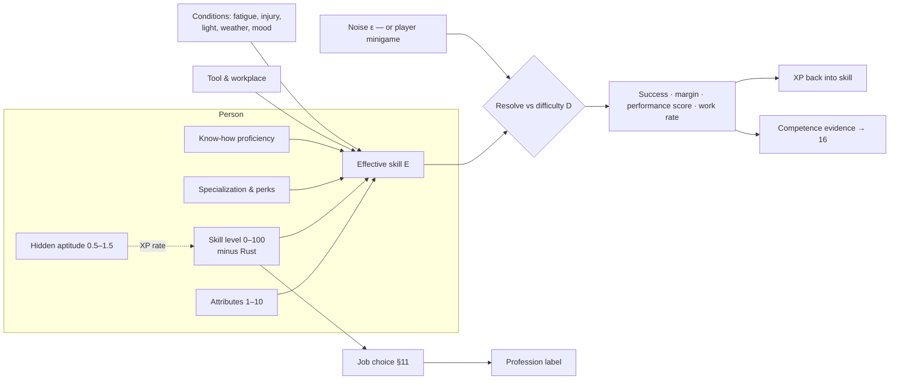
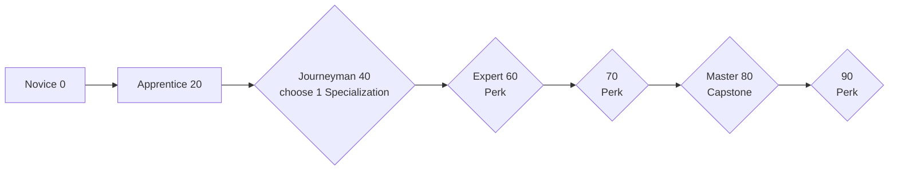
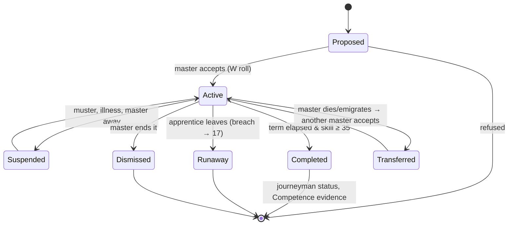

# 12 — Skills & Professions

> **Status:** Draft v0.1 · **Owner doc for:** attributes, skills, XP & learning, aptitude, skill checks (the shared resolution function), specializations & perks, know-how, teaching & apprenticeship, professions, job choice & labor allocation · **Depends on:** [01-canon](../01-canon.md), [11-survival](11-survival.md), [13-crafting-and-minigames](13-crafting-and-minigames.md), [15-economy-and-trade](15-economy-and-trade.md), [16-social-systems](16-social-systems.md), [17-governance-and-law](17-governance-and-law.md), [21-npc-ai](../tech/21-npc-ai.md), [22-llm-integration](../tech/22-llm-integration.md)

The vision asks for "a more or less identical skill tree for both players and the AI villagers" and
says that "as people build their skills they should gravitate towards certain jobs and
responsibilities in the town." This document is the machine that does both. One capability model,
one learning model and one resolution function serve every person in the world — the player
included. Professions are not classes; they are *labels the society applies* to what a person
reliably does.

## Table of contents

1. [Design goals](#1-design-goals)
2. [The capability model at a glance](#2-the-capability-model-at-a-glance)
3. [Attributes](#3-attributes)
4. [Skills](#4-skills)
5. [XP and learning](#5-xp-and-learning)
6. [Skill checks — the shared resolution function](#6-skill-checks--the-shared-resolution-function)
7. [The tree: specializations and perks](#7-the-tree-specializations-and-perks)
8. [Know-how](#8-know-how)
9. [Teaching and apprenticeship](#9-teaching-and-apprenticeship)
10. [Professions](#10-professions)
11. [Job choice and labor allocation](#11-job-choice-and-labor-allocation)
12. [Competence reputation (interface)](#12-competence-reputation-interface)
13. [Guilds (Era 3+, sketch)](#13-guilds-era-3-sketch)
14. [LLM / Jev touchpoints](#14-llm--jev-touchpoints)
15. [Simulation LOD and Interludes](#15-simulation-lod-and-interludes)
16. [Data schemas](#16-data-schemas)
17. [Tuning knobs](#17-tuning-knobs)
18. [Failure modes and exploits](#18-failure-modes-and-exploits)
19. [Validation with headless runs](#19-validation-with-headless-runs)
20. [Milestone map](#20-milestone-map)
21. [Open questions](#open-questions)
22. [Proposed canon additions](#proposed-canon-additions)

---

## 1. Design goals

| # | Goal | Consequence in this doc |
|---|------|------------------------|
| G1 | **Parity** (tenet 2, pillar P6) | Every formula takes a `PersonId`, never "player" vs "NPC". The only player-specific element is that a minigame may replace the noise term of a check (§6.5) inside a bounded window. |
| G2 | **Learn by doing** | XP comes from time spent on real work, scaled by how hard that work was for *you*. No skill points to spend, no XP bought with coin. |
| G3 | **Specialists emerge** | Learning rates, aptitude, demand signals and family trades push people into distinct roles; a society of 24 generalists becomes a village of farmers, smiths, brewers and stewards without anyone scripting it. |
| G4 | **Knowledge lives in people** (tenet 6) | Know-how is a discrete thing a person holds. It can be taught, hoarded, written down, and lost when its holders die. |
| G5 | **Readable for players, cheap for the sim** | Five named tiers, one curve, one check function. Every rate has an LOD3 closed form for Interludes. |
| G6 | **Plateaus are economic** | Routine work teaches little. A smith only becomes a master if someone needs hard things made — expertise follows demand. |

---

## 2. The capability model at a glance



Everything a person does that matters for outcomes goes through `Resolve()` (§6). Systems that own
outcomes (crafting quality in 13, combat in 18, haggling in 15, treatment in 11) call it with their
own difficulty and modifiers and interpret its outputs.

---

## 3. Attributes

Canon §10.1: **Strength, Endurance, Dexterity, Perception, Intellect, Charisma**, 1–10, average 5,
changing slowly with use, injury and age.

### 3.1 What each attribute does

Attributes enter skill checks through per-skill weights (§4.2). Each point above or below 5 is worth
**±3 effective skill points**, weighted. Attributes also expose *hooks* to other systems; this doc
supplies the value, the owning doc defines the magnitude.

| Attribute | Main skills supported | Hooks exported (owner) | Suggested default |
|-----------|----------------------|------------------------|-------------------|
| **Strength** | Woodcutting, Mining, Masonry, Smithing, Melee | Carry capacity ([11](11-survival.md)); melee damage ([18](18-conflict-and-warfare.md)) | carry = 20 + 4·STR kg |
| **Endurance** | Farming, Woodcutting, Athletics, Metallurgy | Energy drain, cold/disease resistance, max health ([11](11-survival.md)); march fatigue ([18](18-conflict-and-warfare.md)) | energy drain × (1.25 − 0.05·END) |
| **Dexterity** | Most crafts, Archery, Stealth, Healing | Minigame tolerance windows ([13](13-crafting-and-minigames.md)) | window width × (0.8 + 0.04·DEX) |
| **Perception** | Hunting, Foraging, Fishing, Husbandry, Healing (diagnosis) | Sight/hearing detection radius ([16](16-social-systems.md) witnesses, [21](../tech/21-npc-ai.md)) | radius × (0.7 + 0.06·PER) |
| **Intellect** | Metallurgy, Letters, Stewardship, Commerce, Brewing | Know-how learning speed and experimentation insight (this doc, §8.2) | know-how progress × (0.75 + 0.05·INT) |
| **Charisma** | Persuasion, Leadership, Commerce | First-impression opinion offset ([16](16-social-systems.md)); teaching ability (§9) | first opinion ± 2·(CHA − 5) |

### 3.2 Composition

```
Attribute_display = clamp( round( Potential + Training + AgeMod + InjuryMod + TempMod ), 1, 10 )
```

| Term | Range | Source |
|------|-------|--------|
| `Potential` | 2–8 (normal, mean 5, SD 1.4, clamped) | Rolled at birth; child mean = average of parents ± noise (heritability 0.5). Settlers rolled at creation. |
| `Training` | −1 … +2 | Use (§3.3). |
| `AgeMod` | table §3.4 | Life stage. |
| `InjuryMod` | 0 … −4 | Permanent injuries from [11](11-survival.md) (lost fingers −2 DEX, ruined knee −2 END, etc.). |
| `TempMod` | 0 … −3 | Illness, malnutrition, exhaustion ([11](11-survival.md)); recover with the condition. |

The internal value is a float; checks use the unrounded value so small changes still matter.

### 3.3 Training by use

Every action carries the attribute weights of its skill. One hour of action adds `weight` "load
hours" to each attribute.

```
Training_A += 0.0048 × loadHours_A × (1 − Training_A / 2)      // diminishing toward +2
if seasonal average load_A < 1 h/day: Training_A → move 0.1 toward 0 per season
```

≈ **+1 point per 1.5 game years** of heavy, targeted use (5 load-hours/day), so a farmhand who
becomes a quarryman visibly grows stronger over a few years. Negative training (to −1) only comes
from long bed-rest or confinement ([11](11-survival.md) applies it).

### 3.4 Age curves (`AgeMod`)

| Age | 6–9 | 10–13 | 14–15 | 16–29 | 30–44 | 45–54 | 55–64 | 65–74 | 75+ |
|-----|-----|-------|-------|-------|-------|-------|-------|-------|-----|
| STR | −4 | −2 | −1 | 0 | 0 | −0.5 | −1 | −2 | −3 |
| END | −3 | −1.5 | −0.5 | 0 | 0 | −0.5 | −1 | −2 | −3 |
| DEX | −2 | −1 | 0 | 0 | 0 | 0 | −0.5 | −1 | −2 |
| PER | −1 | 0 | 0 | 0 | 0 | 0 | −0.5 | −1 | −2 |
| INT | −2 | −1 | 0 | 0 | 0 | 0 | 0 | 0 | −1 |
| CHA | −1 | −1 | −0.5 | 0 | +0.5 | +0.5 | +0.5 | +0.5 | 0 |

Rationale: physical decline begins mid-life, skill does not. An elder master smith works slower and
weaker but keeps her skill and know-how; she becomes most valuable as a **teacher** (§9 elder bonus),
which is exactly when the society needs her knowledge transferred.

---

## 4. Skills

The 28 canonical skills (canon §10.2) on a **0–100** scale with tiers **Novice 0–19 · Apprentice
20–39 · Journeyman 40–59 · Expert 60–79 · Master 80–100**.

### 4.1 Tier privileges (identical for every skill and every person)

| Tier | Reliable work (≥ 75 % success) | Structural unlocks |
|------|-------------------------------|--------------------|
| **Novice** 0–19 | Tasks with D ≤ ~15. Can **assist** (helper bonus §6.6 from skill 10). | — |
| **Apprentice** 20–39 | Routine products of the trade, unsupervised. | May head a household-scale operation. |
| **Journeyman** 40–59 | The full ordinary range of the trade. | **Choose a Specialization** (§7). May head a workshop. May take **1 apprentice**. Eligible as a recognized practitioner (§10). |
| **Expert** 60–79 | Difficult goods; most "fine" quality work. | **Expert perk at 60 and 70.** Up to **2 apprentices**. May write manuals (§8.2, also needs Letters). |
| **Master** 80–100 | Masterworks become possible. | **Capstone at 80**, one more perk at 90. Up to **3 apprentices**. "Master" title (guild-eligible, §13). |

A matched task (D = effective skill) succeeds **78 %** of the time (§6.3). So "reliable at tier"
means tasks whose difficulty sits at or below the lower bound of that tier plus attribute and tool
help.

### 4.2 Skill catalog

Learn-by-doing XP is given as **base XP**, before the modifiers of §5. For time-based work the base
is **10 XP per nominal labor-hour** of the action (the recipe's or task's authored duration, not the
time the player actually took). Event-based XP is listed per event. Attribute weights sum to 1.0.

**Land**

| Skill | Governs | Attributes | Learn by doing (base XP) | Specializations @40 | Master capstone @80 |
|-------|---------|-----------|--------------------------|---------------------|---------------------|
| **Farming** | Tilling, sowing, weeding, watering, pests & blight, harvest, soil care, field planning | END .4 · PER .3 · STR .3 | Field work 10/h · diagnose crop disease 15 · season field plan 20 | **Fieldsman** (grain, ploughing) · **Gardener** (vegetables, herbs, flax) · **Orchardist** (fruit trees) | *Reads the Soil* — sees exact soil & disease state; +10 % yield on fields they plan |
| **Husbandry** | Animal care, herding, milking, shearing, breeding, draft training, slaughter timing | PER .4 · END .3 · CHA .3 | Tending/herding 10/h · birthing assist 20 · draft training 12/h | **Herder** · **Stockbreeder** · **Horse-master** (horses, oxen, riding) | *Breeder's Eye* — breeding gains ×2; sees hidden animal traits |
| **Foraging** | Wild plants, fungi, nuts, fiber, resin, honey; identifying edibles & medicinals | PER .6 · INT .2 · END .2 | Gathering 10/h · first ID of a Farstrand species 25 · test-tasting an unknown 15 | **Provisioner** (food yield) · **Herb-seeker** (medicinal/dye plants) · **Woodwise** (rare finds, travel) | *Land's Larder* — never misidentifies; seasonal yield +25 % |
| **Hunting** | Tracking, stalking, trapping, kill, field dressing | PER .5 · END .3 · DEX .2 | Tracking/stalking 10/h · trap set 3 · kill 10 (hare)–40 (bear) · dressing 10/h | **Tracker** · **Trapper** · **Stalker** | *Ghost of the Wood* — game flee at half distance; tracks show age |
| **Fishing** | Lines, nets, weirs, traps, small-boat fishing, reading water | PER .4 · DEX .3 · END .3 | Fishing 10/h · weir/net set 8 · rare catch 10 | **Netter** (nets, weirs) · **Angler** · **Boatman** (open water, boats) | *Reads the Water* — knows the day's best spots; catch +25 % |
| **Woodcutting** | Felling, limbing, splitting, coppice care, **charcoal burning** | STR .5 · END .4 · PER .1 | Felling/splitting 10/h · tending a charcoal burn 8/h · coppice work 10/h | **Feller** · **Forester** (coppice, timber quality) · **Collier** (charcoal yield/quality) | *Forest-wright* — sees hidden timber flaws; timber +1 quality grade |
| **Mining** | Prospecting, assay, ore & stone extraction, shoring, quarrying | STR .5 · END .3 · PER .2 | Hewing 10/h · survey 10/h · new deposit found 50 · shoring 10/h | **Prospector** · **Hewer** · **Quarryman** | *Deep Sense* — reads deposit size/grade before digging; cave-in risk −75 % |

**Craft**

| Skill | Governs | Attributes | Learn by doing (base XP) | Specializations @40 | Master capstone @80 |
|-------|---------|-----------|--------------------------|---------------------|---------------------|
| **Carpentry** | Timber building, framing, joinery, wheels & machines, boats, barrels, furniture | DEX .4 · STR .3 · INT .3 | Construction & joinery 10/h · designing a machine/mill 30 | **Housewright** · **Wright** (wheels, carts, mills, engines) · **Joiner-Cooper** · **Shipwright** (needs dock) | *Master Builder* — +1 module socket on blueprints; their structures decay −30 % |
| **Masonry** | All stone shaping **from knapping to ashlar**; walls, ovens, kilns (structure), mortar, bricklaying | STR .4 · DEX .3 · PER .3 | Knapping 10/h · laying stone/brick 10/h · dressing 10/h · arch/vault work 15/h | **Waller** (dry-stone, defenses) · **Freemason** (dressed stone, arches) · **Fortifier** (castle & siege works) | *Master of Works* — crew cap +50 %; stone defense value +15 % |
| **Metallurgy** | Ore roasting, smelting, alloying, crucibles, casting, bloom production, carburizing | INT .4 · END .3 · PER .3 | Tending a smelt 10/h · alloy batch 15 · casting pour 10 · assay 10 | **Founder** (copper/bronze casting) · **Bloomer** (iron) · **Steelmaker** (T4) | *Fire-reader* — exact furnace state shown; yield +20 % |
| **Smithing** | Forging, welding, heat-treatment, tools, weapons, armor, repair, sharpening | STR .4 · DEX .3 · END .3 | Forging 10/h · repair 10/h · quench/temper 15 | **Toolsmith** (incl. farrier, nails, locks) · **Weaponsmith** · **Armorer** | *Masterwork Smith* — masterwork chance ×2; signature pattern-welded blades |
| **Bowyery** | Bows, arrows, crossbows, strings, fletching | DEX .6 · PER .2 · STR .2 | Stave work 10/h · fletching 10/h · tillering 15/h | **Bowyer** · **Fletcher** · **Latchwright** (crossbows, T3+) | *Heartwood Bow* — draw weight +15 % with no accuracy loss |
| **Leatherworking** | Hide prep, tanning, rawhide, cuir bouilli, shoes, harness, bags | DEX .5 · END .3 · STR .2 | Scraping/tanning 10/h · cutting/stitching 10/h | **Tanner** · **Cordwainer** (shoes, gloves, bags) · **Harness & Armor** | *Supple Hand* — leather durability +50 %; tanning time −30 % |
| **Textiles** | Cordage, basketry, spinning, weaving, fulling, dyeing, tailoring, sails, padded armor | DEX .6 · PER .2 · INT .2 | Spinning/weaving 10/h · tailoring 10/h · new dye 20 | **Weaver** · **Tailor** (clothes, gambesons) · **Dyer-Fuller** | *Fine Cloth* — luxury cloth (trade value ×2); garment warmth +20 % |
| **Pottery** | Clay prep, hand-building, wheel, firing, glazing, **bricks & tiles** | DEX .5 · PER .3 · INT .2 | Shaping 10/h · firing a kiln 8/h · new glaze 25 | **Thrower** · **Glazer** (T2) · **Brickmaker** (bricks, tiles, pipes) | *Kiln-master* — firing losses −75 % |
| **Cooking** | Meals, butchery, smoking, salting, drying, baking, cheese | PER .4 · DEX .3 · INT .3 | Cooking 10/h · preserving 10/h · feast preparation 15/h | **Baker** · **Preserver** (butchery, curing, cheese) · **Cook** (meals, feasts) | *Hearth-master* — meals grant one extra mood step; feasts +50 % effect |
| **Brewing** | Malting, mashing, fermenting ale, mead, cider, vinegar | INT .4 · PER .4 · END .2 | Brewing 10/h · new recipe 20 | **Ale-brewer** · **Mead & Cider** · **Maltster** | *Brewmaster* — no spoiled batches; +1 quality grade |
| **Healing** | Diagnosis, wound care, remedies, surgery, midwifery, nursing | INT .4 · DEX .3 · PER .3 | Treatment 10/patient-hour · diagnosis 10 · surgery 20 · birth attended 25 | **Herbalist** · **Surgeon** · **Midwife** | *Physician* — reveals hidden conditions; treated mortality −30 % (11 applies) |

**Social** (event-based XP — the vision's "lords must hold court, shopkeeps must set prices" are
these skills' games)

| Skill | Governs | Attributes | Learn by doing (base XP) | Specializations @40 | Master capstone @80 |
|-------|---------|-----------|--------------------------|---------------------|---------------------|
| **Persuasion** | Convincing, favors, speeches, comforting, deceiving | CHA .7 · INT .3 | Persuasion attempt 5–20 by stakes · speech 10 + 1 per listener (cap 30) | **Orator** (groups) · **Negotiator** (deals, treaties) · **Charmer** (one-on-one, deceit) | *Golden Voice* — listener susceptibility +25 % (still inside the ±15 % clamp, canon §13) |
| **Commerce** | Valuation, haggling, pricing, stock, credit, trade routes | INT .5 · CHA .3 · PER .2 | Completed trade 2 + value/100 f (cap 25) · day of shop pricing 5 · appraisal 5 | **Haggler** · **Appraiser** (true value, fakes) · **Factor** (long-distance trade, credit) | *Merchant Prince* — price information from +1 more settlement; shop margin +10 % |
| **Leadership** | Directing crews, morale, meetings, court sessions, rallying | CHA .6 · INT .2 · END .2 | Leading a crew 4/h + 1/h per member (cap 15/h) · chairing a meeting/court 15 · rally 10 | **Rallier** (morale) · **Foreman** (crew efficiency) · **Arbiter** (disputes, court) | *Born Leader* — crew cap +50 %; order-compliance input +10 (17 consumes) |
| **Stewardship** | Stores, rationing, estates, labor rotas, accounts, tax collection | INT .6 · PER .2 · CHA .2 | Stores/estate work 10/h · season accounts 20 · tax round 10 | **Quartermaster** (stores, rations) · **Reeve** (estates, labor obligations) · **Treasurer** (accounts, coin) | *Master Steward* — settlement storage spoilage −20 %; store theft detection ×2 |
| **Letters** | Reading, writing, reckoning, contracts, charters, manuals | INT .8 · DEX .2 | Reading/writing 10/h · copying 8/h · writing a manual 15/h | **Scribe** · **Scholar** (manuals, teaching by text) · **Reckoner** (+5 to Stewardship & Commerce checks) | *Loremaster* — manuals written in half the time; readers reach Familiar in half the time |

**Martial & Body** (combat effects are owned by [18](18-conflict-and-warfare.md); this doc owns the
skill, its XP and its tree)

| Skill | Governs | Attributes | Learn by doing (base XP) | Specializations @40 | Master capstone @80 |
|-------|---------|-----------|--------------------------|---------------------|---------------------|
| **Melee** | Hand weapons, shields, unarmed, formation fighting | STR .4 · DEX .3 · END .3 | Sparring 8/h (difficulty = partner's skill) · real fight 2 per exchange | **Spearman** (formation, reach) · **Duelist** (blade & axe) · **Horseman** (mounted, T3+) | *Weapon Master* (18) |
| **Archery** | Bows, slings, crossbows, thrown spears | DEX .4 · PER .4 · STR .2 | Target practice 6/h · hit on game/enemy 3–10 | **Longbowman** · **Marksman** · **Crossbowman** | *Deadeye* (18) |
| **Athletics** | Running, carrying, climbing, swimming, stamina | END .5 · STR .3 · DEX .2 | Travel under load 3/h · swim/climb 5/h (cap 30/day) | **Porter** (carry +25 %) · **Runner** · **Swimmer-Climber** | *Tireless* — work energy drain −20 % |
| **Stealth** | Sneaking, hiding, sleight of hand, locks, concealment | DEX .5 · PER .3 · INT .2 | Moving unseen within an observer's range 1/min (cap 40/day) · theft 10 · lock 10 | **Shadow** · **Cutpurse** · **Scout** | *Unseen* (16/18) |
| **Tactics** | Drill, formations, battle command, raid/siege planning, watch rotas, siege engineering | INT .5 · PER .3 · CHA .2 | Drilling troops 6/h · skirmish commanded 20 · battle commanded 50 · raid plan 20 | **Field Captain** · **Siege Engineer** · **Watch Captain** | *Strategist* (18) |

### 4.3 What each tier means, per skill

"Reliable" work at each tier and the key know-how the skill gates (catalog §8.4).

| Skill | Novice | Apprentice | Journeyman | Expert | Master | Key know-how |
|-------|--------|-----------|------------|--------|--------|--------------|
| Farming | weed, harvest | own plot, sow, till | plan fields, ard plough | rotations, blight control | best yields in poor soil | two/three-field rotation, ploughing |
| Husbandry | feed, herd | milk, shear, pen care | breeding, draft training | herd health, dairy | breeding lines | dairying, horse breaking |
| Foraging | known berries | edible greens, fiber | herbs, mushrooms safely | rare dyes/resins | whole-region lore | wild-food lore |
| Hunting | snares | small game | deer, trapping lines | boar, wolves | bear, trophy | snares & traps |
| Fishing | line from shore | weirs, nets | boat fishing | deep water | sea fishing at will | line, net fishing |
| Woodcutting | brush, kindling | fell small trees | large timber, charcoal | coppice system, quality timber | flawless beams | coppicing, charcoal burning |
| Mining | surface stone | quarry blocks | ore extraction | deep work, shoring | read any deposit | prospecting |
| Carpentry | lean-to, poles | hut, furniture | timber frame, carts | mill, bridge, ship | great halls, engines | timber framing, millwrighting |
| Masonry | knapped flakes | dry-stone, oven | mortared walls | arches, towers | keeps, vaults | knapping, lime, castle works |
| Metallurgy | tend fire | copper smelt | bronze, bloom | consistent bloom, casting | steel, crucible | copper/bloomery/carburizing |
| Smithing | sharpen, assist | nails, simple tools | tools, blades | swords, mail | masterworks, plate | ironworking, forge welding, quench & temper |
| Bowyery | arrows (crude) | self bow | good bows | war bows | crossbows, heartwood | self-bow, crossbow making |
| Leatherworking | scrape hides | rawhide, simple goods | tanned leather, shoes | harness, cuir bouilli | fine & armor | hide curing, bark tanning |
| Textiles | cordage, baskets | spin, plain weave | cloth, clothes | dyed, fulled cloth | luxury cloth | spinning & weaving, fulling & dyeing |
| Pottery | pinch pots | pit-fired ware | kiln ware, bricks | wheel ware, glaze | fine glazed ware | pit/kiln firing, glazing |
| Cooking | roast, boil | daily meals, drying | bread, smoking, salting | cheese, feasts | lordly tables | oven baking, salt curing |
| Brewing | — | small ale | good ale | mead, cider, keeping beer | prized brews | malting & brewing |
| Healing | bandage | poultices | set bones, fevers | surgery, births | complex cases | herbal remedies, surgery, midwifery |
| Persuasion | plead | convince a friend | sway the wary | sway a council | sway a lord | — |
| Commerce | barter | small trade | shopkeeping | trading house | long-distance trade | reckoning |
| Leadership | pair work | small crew | work party, hamlet meeting | village, court | lordship | — |
| Stewardship | count stores | household stores | communal store | estate, taxes | realm finances | reckoning |
| Letters | letters of name | read plain text | write contracts | manuals, charters | scholarship | reading & writing |
| Melee | brawl | militia | soldier | veteran | champion | — |
| Archery | hit a barn | hunt | levy archer | veteran archer | master archer | — |
| Athletics | — | laborer | porter | runner | tireless | — |
| Stealth | hide | sneak | pickpocket | burglary | unseen | — |
| Tactics | follow orders | lead a file | lead a squad | captain a company | command a host | siege engines, trebuchet |

### 4.4 Placement decisions (gap fills)

- **Knapping → Masonry.** There is no toolmaking skill; stone shaping in all its forms is one skill.
  This gives Masonry a job in Era 0 and makes the knapper the natural first mason.
- **Charcoal burning → Woodcutting** (Collier specialization). Charcoal is the bottleneck of iron
  (§8, and [14](14-technology-and-buildings.md)); tying it to the woodland trade puts it in the hands
  of foresters, not smiths, creating a supply relationship rather than a single super-crafter.
- **Bricks → Pottery** (kiln work); **bricklaying → Masonry**.
- **Milling** has no own skill: a miller is a Wright (Carpentry) who maintains gearing, dresses
  stones (Masonry) and takes multure (Commerce).
- **Construction** is Carpentry (timber, thatch, wattle) and Masonry (stone, brick, lime);
  [14](14-technology-and-buildings.md) assigns each stage to one of them.
- Holding court is **Leadership** (Arbiter) for the session and **Letters/Stewardship** for the
  record; the verdict logic is [17](17-governance-and-law.md)'s.

---

## 5. XP and learning

### 5.1 The curve

```
XPreq(L)  = 11 × 1.055^L                       // XP to go from level L to L+1
XPcum(L)  = 200 × (1.055^L − 1)                // total XP from 0 to level L
```

| Level | 10 | 20 | 25 | 30 | 40 | 50 | 60 | 70 | 80 | 90 | 100 |
|-------|----|----|----|----|----|----|----|----|----|----|-----|
| XP for next level | 19 | 32 | 42 | 55 | 94 | 160 | 273 | 467 | 797 | 1,362 | — |
| Cumulative XP | 142 | 384 | 563 | 797 | 1,503 | 2,708 | 4,768 | 8,286 | 14,295 | 24,560 | 42,094 |

Skill is stored as a float; the displayed level is `floor`. Tier boundaries are fixed (canon).

### 5.2 XP per action

```
XP = BaseXP × DF(Δ) × OutcomeF × Aptitude × TeachMult × AgeMult × RepF
     where Δ = D − (Level − Rust)
```

| Factor | Definition |
|--------|-----------|
| `BaseXP` | 10 × nominal labor-hours for time-based actions; authored per event otherwise (§4.2). Content field `xp_base` may override. |
| `DF(Δ)` | **Difficulty factor** = clamp(1 + Δ/30, **0.05**, **1.6**). Harder tasks teach more; trivial ones (Δ ≤ −28) teach almost nothing. |
| `OutcomeF` | Success 1.0 · Failure **0.6** · Critical failure **0.8** ("hard lesson", but material/tool loss applies) · Critical success 1.1. Failure XP only if Δ ≥ −10 (failing a trivial task teaches nothing). |
| `Aptitude` | Hidden, per person per skill, **0.5–1.5** (canon). §5.4. |
| `TeachMult` | 1.0 normally; up to **1.6** working under a teacher (§9). |
| `AgeMult` | §5.5. |
| `RepF` | Repetition factor, §5.3. |

`DF` uses skill *without* tools, conditions or specialization: good tools make a task easier to
succeed at but do not make it less instructive.

### 5.3 Repetition and daily caps (diminishing returns)

- **Same action key** (recipe/task id) within one game day: first **6 nominal hours** at RepF 1.0,
  then **0.5**.
- **Per skill per day**: XP beyond **150** is multiplied by **0.25**.
- **Craft-and-salvage loops**: crafting an item whose identical twin the same person salvaged in the
  last 2 days gives RepF **0.25**.
- Event XP from social skills against the **same target person**: ×0.5 for the 2nd event that day,
  ×0 from the 4th (no grinding persuasion on your spouse).

Because `BaseXP` derives from nominal labor-hours and `DF` collapses on easy work, click-spam of
cheap actions is worthless without extra bookkeeping.

### 5.4 Aptitude and the "knack"

- Generation: `apt = clamp(1 + domainBias + N(0, 0.17), 0.5, 1.5)`, where `domainBias ~ N(0, 0.1)`
  per person per domain (Land/Craft/Social/Martial). Children inherit `domainBias = 0.5 × mean(parents) + N(0, 0.07)`.
- Aptitude is **hidden from everyone, including its owner**, until **300 XP** has been earned in the
  skill. Then the owner (player or NPC) learns a band: *struggles* (≤ 0.75) · *average* · *comes
  naturally* (≥ 1.1) · *a real knack* (≥ 1.25). Masters who have taught someone for ≥ 1 season also
  learn their apprentice's band — and can say so (LLM voices it; the band is a sim fact).
- NPC job choice uses only the *revealed* band (§11), so NPCs are not omniscient about themselves.

### 5.5 Age and learning

| Age | 6–13 (child) | 14–15 (youth) | 16–24 | 25–39 | 40–54 | 55–64 | 65+ |
|-----|-------------|---------------|-------|-------|-------|-------|-----|
| AgeMult | 1.2 | 1.25 | 1.1 | 1.0 | 0.85 | 0.7 | 0.55 |

Children's skills are **capped at 25** until age 14 and they may only perform child-eligible tasks
(content flag; [21](../tech/21-npc-ai.md) enforces). Youth unlocks apprenticeship (canon §6).

### 5.6 Rust (decision: skills never drop; they get rusty)

Decision: **skill level never decreases.** Disuse instead accrues **Rust**, a temporary penalty to
effective skill that practice clears quickly. Rationale: real skills fade but return fast; a
permanent loss would punish players for trying other roles and would make a 2-year Interlude or a
Lineage heir's inherited plans feel punitive.

| Rule | Value |
|------|-------|
| Grace period | **16 days** (2 seasons) since the skill was last practiced (any XP-earning action) |
| Accrual | +1 Rust per **8 days** (1 season) after grace |
| Cap | `floor(0.15 × Level)` — Master 85 can rust to −12; Novice 10 to −1 |
| Recovery | Each **practice hour** removes **1 Rust** (in addition to normal XP) |
| Effect | Effective skill = Level − Rust (checks, work rate, job-choice capability) |

### 5.7 Worked progression

Assumptions: 7 h/day on the skill, 28 working days per 32-day year (Hearthdays off), RepF ≈ 0.95,
aptitude 1.0, age 25–39. "Learning edge" means the person regularly gets work near their level
(E[DF] ≈ 0.9); "production" means mostly routine output (E[DF] ≈ 0.6–0.73, e.g. 60 % of tasks at
Δ = −15, 30 % at Δ = 0, 10 % at Δ = +10).

| Profile | XP/working day | → Apprentice 20 | → Journeyman 40 | → Expert 60 | → Master 80 | → 100 |
|---------|----------------|-----------------|-----------------|-------------|-------------|-------|
| Focused learner | 60 | 6 d (0.2 y) | 25 d (0.9 y) | 79 d (2.8 y) | 238 d (8.5 y) | 702 d (25 y) |
| Production worker | 40 | 10 d (0.3 y) | 38 d (1.3 y) | 119 d (4.3 y) | 357 d (12.8 y) | 1,052 d (38 y) |
| Apprentice under a master (TeachMult 1.5) | 90 | 4 d (0.2 y) | 17 d (0.6 y) | 53 d (1.9 y) | *teaching stops within 5 of the master* | — |
| Focused, knack (apt 1.3) | 78 | 5 d | 19 d (0.7 y) | 61 d (2.2 y) | 183 d (6.5 y) | 540 d (19 y) |
| Focused, struggles (apt 0.7) | 42 | 9 d | 36 d (1.3 y) | 114 d (4.1 y) | 340 d (12 y) | 1,002 d (36 y) |
| Dabbler (1.5 h/day, E[DF] 0.75) | 10.7 | 36 d (1.3 y) | 140 d (5 y) | 446 d (16 y) | — | — |

**The player.** A player who spends ~5 game-hours of a day on one skill (the rest is eating,
walking, talking) earns ~43 XP/day. At ≈ 0.375 real hours per game day (30 min/day, nights slept):

| Player start | → Journeyman 40 | → Expert 60 | → Master 80 |
|--------------|-----------------|-------------|-------------|
| From 0 | 35 d · ~13 real h | 111 d · ~42 real h | 332 d · ~125 real h |
| From a background boost of 25 | 22 d · ~8 real h | 98 d · ~37 real h | 319 d · ~120 real h |

Master is therefore reached **through Interludes**: during skips the player's standing orders
practice their trade at LOD3 exactly as an NPC's would (§15). A 40-hour saga with two or three
multi-season Interludes produces a Master smith in his late thirties — a lifetime achievement, as
it should be. Most of a settlement's early Journeymen and Experts are **homeland-trained adults**
who arrive with their skills (§8.5); the leveling system matters most for the player and for the
Farstrand-born second generation.

---

## 6. Skill checks — the shared resolution function

`Resolve()` is the **contract** between this doc and every outcome-owning system. NPCs never play
minigames; they call `Resolve()` with RNG noise. The player's minigame (owned by
[13](13-crafting-and-minigames.md)) replaces the noise term inside a bounded window, so both draw
from the same model (tenet 2).

### 6.1 API

```csharp
public enum Outcome { CritFail, Fail, Success, CritSuccess }
public enum CheckMode { Standard, Opposed }

public readonly record struct CheckRequest(
    long Actor, string SkillId, int Difficulty,          // D: 0–100+, from the calling system's content
    string ActionKey,                                    // recipe/task id (XP repetition, spec tags)
    string? KnowHowId, ToolRef? Tool, WorkspaceGrade Workspace,
    ConditionSet Conditions, IReadOnlyList<long> Helpers,
    CheckMode Mode, float? OpposedE,                     // opponent's effective skill for contests
    float? MinigameM);                                   // player only: m in [-1, +1]; null => RNG

public readonly record struct CheckResult(
    Outcome Outcome, float Margin /* R */, float PerformanceScore /* 0–100 */,
    float WorkRate, float EffectiveSkill, float XpAwarded);
```

`Resolve()` is pure given `(request, sim state, rng stream)` — deterministic and replayable. The caller
supplies the stream: by default `rng.skills`, but multi-stage work processes pass their own
**per-process stream** (seeded from the process id) so that reloading a save cannot reroll a craft
([13](13-crafting-and-minigames.md) anti-save-scum rule).

### 6.2 Effective skill

```
E = (Level − Rust)
  + AttrMod          = 3 × Σ w_a × (Attr_a − 5)                     // weights from §4.2
  + ToolMod          = TierMod + (q_tool − 50) / 12.5                // q from 13, −4…+4
  + KnowHowMod       = Aware −20 · Familiar −8 · Practiced 0 · Mastered +5
  + SpecMod          = +8 if action tagged with actor's specialization (+5 via Broad Training);
                       −10 if action is spec_gated and actor lacks the specialization
  + PerkMods         (e.g. Exacting +5)
  + ConditionMods    (table below)
  + AssistMod        = +2 per helper with skill ≥ 10, max +6 (assistable actions only)
```

| Tool tier | Stone/bone | Copper | Bronze | Iron (reference) | Steel |
|-----------|-----------|--------|--------|------------------|-------|
| `TierMod` | −8 | −5 | −2 | 0 | +3 |
| Tool speed | 0.6 | 0.75 | 0.85 | 1.0 | 1.1 |

| Condition | Modifier |
|-----------|---------|
| Energy < 30 / < 15 | −5 / −10 |
| Satiety < 20 | −5 |
| Warmth < 30 (DEX-weighted actions) | −5 |
| Pain (injury severity, [11](11-survival.md)) | 0 … −20 |
| Light: darkness / torch or candle / daylight | −10 / −4 / 0 |
| Rain or snow, outdoor action | −5 |
| Drunk: tipsy / drunk | −5 / −15 |
| Mood ≤ −50 / ≥ +50 | −3 / +2 |
| Workspace: none where one is expected / makeshift / proper / well-equipped | −10 / −5 / 0 / +3 |
| Rushing (actor chooses 1.5× speed) | −8 |

A required tool or know-how the actor is not even *Aware* of makes the action unavailable rather
than penalized.

### 6.3 Noise, outcomes and performance

```
Standard:  R = (E − D) + ε,   ε ~ Logistic(0, s = 8), clamped to ±31
Opposed:   R = (E − E_opp) + ε, ε ~ Logistic(0, 11.3), clamped to ±44;  win iff R ≥ 0 (ties → defender)

Outcome:   CritFail R < −30 · Fail −30 ≤ R < −10 · Success −10 ≤ R < +25 · CritSuccess R ≥ +25
PerformanceScore PS = clamp(50 + 1.25 × R, 0, 100)
P(success or better) = 1 / (1 + exp(−(E − D + 10) / 8))
// clamping ε at ±31: E − D ≥ +21 cannot fail; E − D < −41 cannot succeed
```

| E − D | −30 | −20 | −10 | 0 | +10 | +20 | +30 |
|-------|-----|-----|-----|---|-----|-----|-----|
| P(success+) | 8 % | 22 % | 50 % | 78 % | 92 % | 98 % | 100 % |
| P(crit success) | — | — | — | 4 % | 13 % | 35 % | 65 % |
| P(crit fail) | 50 % | 22 % | 8 % | 2 % | — | — | — |

`PS` is *not* item quality. [13](13-crafting-and-minigames.md) maps PS to quality grades, applying
material and recipe ceilings and the target-quality uplift it adds to D. Other callers interpret PS
in their own terms (treatment efficacy in 11, crop care score in 13, haggle concession in 15).

### 6.4 Work rate

```
WorkRate  = clamp(0.5 + E / 100, 0.4, 1.6) × ToolSpeed × (1.5 if rushing else 1.0)
ActualHours = NominalHours × PerkTimeFactor / WorkRate
```

E = 50 works at the authored pace; a Master with good tools works ~1.45× faster. NPC productivity
at every LOD is driven by this one number.

### 6.5 The minigame slot (contract with 13)

- The player's minigame yields `m ∈ [−1, +1]`; `ε_mg = 24 × m` replaces ε (±24 ≈ ±3 s).
- **Skill still dominates.** A novice smith (E = 5) attempting a D = 60 blade gets at best
  R = −31: failure, no matter how perfect the play.
- **Calibration requirement for 13:** for a typical attentive player, the distribution of `m` should
  have median ≈ 0 and inter-quartile range ≈ ±0.35, matching the NPC logistic's central mass.
  Headless calibration (§19) compares recorded playtest `m` distributions to the NPC draw.
- XP never depends on how long the minigame took (XP uses nominal hours). Minigame speed affects
  only how much real time the player spends.
- **Batch mode** (tenet 7): for actions where the actor's E − D ≥ +10, the player may batch-craft;
  batch uses the NPC RNG draw. The minigame is an opportunity, not a tax.

### 6.6 Shared tasks

For group work (a construction stage, a hunt, a harvest): each participant applies labor at their
own `WorkRate`; the group's `PS` is the **labor-weighted mean** of participants' PS; critical
outcomes come from the **lead worker's** roll (the highest-E participant, or the designated foreman).
A Foreman-specialized leader adds +10 % to every member's WorkRate. Crowding limits are owned by the
calling system ([14](14-technology-and-buildings.md) for construction).

### 6.7 Worked examples

**A — NPC bowyer tillering a self bow (LOD0/1).** Wenna: Bowyery 42, Rust 0, DEX 7 · PER 5 · STR 6,
specialization Bowyer, iron knife q 60, know-how *Self-bow* Practiced, proper workshop. D = 45 (13).

```
AttrMod = 3 × (0.6×2 + 0.2×0 + 0.2×1) = 4.2      ToolMod = 0 + (60−50)/12.5 = 0.8
E = 42 + 4.2 + 0.8 + 0 (know-how) + 8 (spec) = 55.0      E − D = +10
P(success+) = 92 %   P(crit success) = 13 %   median PS = 62.5
WorkRate = 1.05 → nominal 4 h takes 3.8 h
XP (success) = 40 × DF(45−42 = +3 → 1.10) × aptitude 1.1 = 48 XP
```

**B — The player, a farmhand, tries a knife blade.** Smithing 12, STR 6 · DEX 5 · END 5, salvaged iron
hammer q 50, *Ironworking* Familiar (picked up from watching the expedition smith), proper smithy.
D = 30.

```
E = 12 + 1.2 + 0 − 8 = 5.2      E − D = −24.8
NPC-equivalent chance: 14 %.  Minigame: average play (m = 0) → R = −24.8 → Fail;
needs m ≥ 0.62 to succeed; perfect play (m = 1) → R = −0.8 → Success, PS 49 (a plain blade).
XP: 20 × DF(+18 → 1.6) = 32 on success; × 0.6 = 19 on failure.
```

**C — Master toolsmith batch-forging 10 axe heads (LOD2).** Smithing 78, age 52 (STR 6 − 0.5),
DEX 6, END 5, Toolsmith, perk Efficient, *Ironworking* Mastered, tools q 70. D = 35.

```
E = 78 + 1.5 + 1.6 + 5 + 8 = 94.1 → E − D = +59: cannot fail; 13 caps quality by bloom grade.
WorkRate = 1.44; nominal 15 h × 0.85 (Efficient) / 1.44 = 8.9 h
XP = 127.5 × DF(35 − 78 → 0.05) = 6 XP for the whole batch.
```

Example C is the economic plateau (G6): she will only grow toward 90 if someone commissions mail,
swords or pattern-welded work.

---

## 7. The tree: specializations and perks

The "skill tree" is 28 parallel branches with the **same node layout** for every person:



### 7.1 Specializations

- **+8 effective skill** on actions tagged with the specialization (content tags on recipes/tasks).
- Some high-end actions are `spec_gated` (e.g. coat-of-plates for Armorers, counterweight trebuchet
  for Siege Engineers): non-specialists attempt them at **−10**.
- The specialization is also a **profession label** others recognize ("the armorer"), feeding
  Competence per profession (§12).
- One per skill. A second comes only through the *Broad Training* perk (+5).
- **Retraining:** once per 4 game years a person may switch: one season with no specialization
  bonus, then the new one applies. Same rule for everyone.

### 7.2 Perk pool (chosen at 60, 70 and 90; each perk once per skill)

| Perk | Effect |
|------|--------|
| **Efficient** | −15 % labor time on this skill's actions |
| **Thrifty** | −20 % material waste (crafts) or +10 % yield (land skills) |
| **Exacting** | +5 E when the target quality is "fine" or above (13's grades) |
| **Mentor** | TeachAbility +0.25 and +1 apprentice slot |
| **Broad Training** | Second specialization in this skill at +5 |
| **Steady Hands** | Critical failure only below R < −40 |
| **Hardy** | Energy drain −15 % while practicing this skill |
| **Renowned Mark** | Products carry the maker's mark; Competence evidence weight ×1.5 (§12) |

Capstones at 80 are per-skill (tables §4.2) and are the only perks with skill-specific rules.

### 7.3 How NPCs choose (the player chooses in the UI)

When an NPC crosses 40/60/70/80/90 the choice resolves immediately; the player gets a pending choice
(no deadline; the bonus starts when chosen).

```
specScore(s)  = 1.0 × share of this skill's XP from s-tagged actions over the last 4 seasons
              + 0.5 × demand for s's outputs (§11.3)
              + 0.3 × [parent or master holds s]
              + Gumbel(0.1)
perkScore(p)  = personality affinity + context, e.g.
    Mentor        +0.5 if has or seeks apprentices; +0.3 × Warmth/100
    Efficient     +0.3 if trait Lazy or average workday > 9 h
    Thrifty       +0.3 if value Wealth ≥ 60
    Exacting      +0.3 if Diligence ≥ 60 or trait Ambitious
    Broad Training+0.3 if Curiosity ≥ 60
    Renowned Mark +0.3 if value Status ≥ 60
    + Gumbel(0.1)
```

The player's skill panel shows their own tree exactly. Other people's trees appear as **perceived
tier and specialization** (from reputation and observation, [16](16-social-systems.md)), never raw
numbers — you learn who is good by watching and by rumor.

---

## 8. Know-how

### 8.1 Proficiency levels

| Level | Name | Meaning | Check mod | Teach? |
|-------|------|---------|-----------|--------|
| 0 | **Aware** | Knows it exists and roughly how. **Every homeland-born adult is Aware of all homeland know-how up to T4** (tenet 6). | −20, *experiment only* | No |
| 1 | **Familiar** | Shown, read or pieced together; works with mistakes. | −8 | Can be observed, not teach |
| 2 | **Practiced** | Does it routinely. | 0 | Yes (×0.75 effectiveness) |
| 3 | **Mastered** | Deep understanding. | +5 | Yes (full); may write a manual |

### 8.2 Acquisition

Know-how complexity `c` (1–5) sets the effort. Base learning time `LH(c) = 4 × c²` hours
(4 / 16 / 36 / 64 / 100). All rates × `(0.75 + 0.05·INT) × AgeMult`.

| Route | Aware → Familiar | Notes |
|-------|------------------|-------|
| **Lessons** from a Practiced/Mastered holder | LH(c) hours (×0.6 with a Mastered teacher) | Teacher spends the same hours. Price set by agreement ([15](15-economy-and-trade.md)). |
| **Apprenticeship** | Counts 0.5 h per hour worked beside a holder who is *using* the know-how | The main route for hard know-how. |
| **Reading a manual** | 0.5 × LH(c); requires Letters ≥ 25 | **Never above Familiar** — living teachers stay strictly better. |
| **Observation** (LOD0, within 5 m) | 0.25 h per hour watched, max 50 % of LH(c) | Why the player learns by hanging around the smithy. |
| **Experimentation** | Each attempt at −20 yields `1 + 2·[success]` insight-hours; Familiar at LH(c) | Consumes materials; critical failures injure, burn or waste. Only for know-how the actor is Aware of. |
| **Background** | Starting know-how at Practiced (§8.5; player backgrounds in [19](19-player-experience.md)) | — |

**Familiar → Practiced:** `5 × c` successful uses. **Practiced → Mastered:** `20 × c` successful uses
**and** governing skill ≥ the know-how's minimum + 20.

**Farstrand-specific lore is not know-how.** Whether a local plant is edible, where the tin is, which
ford floods — these are *Beliefs* owned by [16](16-social-systems.md): they spread by talk and can be
wrong (with consequences in [11](11-survival.md)). Know-how is technique, which is the same on any
shore.

### 8.3 Loss and recovery

- A settlement's **holding** of a know-how = the highest proficiency among living residents. When it
  falls to Aware, the sim emits `KnowHowLost(settlement, knowhow, lastHolder)`; the Chronicle records
  it ("When old Maren died, the secret of the green glaze went with her").
- **Sole-holder risk:** a know-how with exactly one holder aged ≥ 45, ill, or a soldier on campaign
  raises succession demand (§11.3) and, if the player knows the holder, a journal warning.
- **Recovery paths**, in order of speed: a manual (→ Familiar), a holder in another settlement
  (hire, lessons for pay, marriage, immigration, capture — [15](15-economy-and-trade.md),
  [18](18-conflict-and-warfare.md)), resupply-ship immigrants until the Silence (canon §5.4), and
  experimentation from Aware (slow: a c5 technique needs ~100 insight-hours of mostly failed attempts
  and the materials they burn).
- Know-how held does **not** decay; the skill that uses it can rust.

### 8.4 Catalog

Ids are `knowhow.<id>`. **Skill ≥** is the governing skill level needed to use it without the
`spec`/difficulty failing outright (D of its recipes is set in 13). **Landfall:** U = universal
(all adults Practiced) · C = common (≥ 25 % of adults) · F = few (2–4 holders) · R% = probability
the first ship carries ≥ 1 holder · G = guaranteed ≥ 1 holder · A = Aware only.

| Id | Know-how | T | Skill ≥ | Prerequisite | c | Landfall |
|----|----------|---|---------|--------------|---|----------|
| fire_making | Fire-making (flint & steel, bow drill) | 0 | — | — | 1 | U |
| knapping | Flint knapping | 0 | Masonry 5 | — | 2 | C |
| cordage_netting | Cordage & netting | 0 | Textiles 5 | — | 1 | U |
| basketry_wattle | Basketry & wattle | 0 | Textiles 5 | — | 1 | C |
| shelter_building | Lean-to & wattle-and-daub hut | 0 | Carpentry 5 | — | 1 | U |
| hide_curing | Hide scraping, smoking, rawhide | 0 | Leatherworking 5 | — | 2 | C |
| snares_traps | Snares & deadfalls | 0 | Hunting 5 | — | 1 | C |
| butchery | Butchery & carcass breakdown (field dressing itself is Hunting, per [13](13-crafting-and-minigames.md)) | 0 | Cooking 5 | — | 1 | C |
| smoke_drying | Smoking & drying food | 0 | Cooking 10 | — | 1 | C |
| salt_curing | Salt-making & curing | 0 | Cooking 15 | smoke_drying | 2 | F |
| wild_food_lore | Homeland wild-food lore (method for testing unknowns) | 0 | Foraging 0 | — | 2 | C |
| line_fishing | Line & hook fishing, rowing | 0 | Fishing 0 | — | 1 | C |
| net_fishing | Nets, weirs & fish traps | 0 | Fishing 15 | cordage_netting | 2 | F |
| tool_care | Whetting & tool care (extends salvaged iron) | 0 | Smithing 0 | — | 1 | U |
| wound_dressing | Wound dressing & splinting | 0 | Healing 5 | — | 1 | C |
| herbal_remedies | Herbal remedies | 0 | Healing 10 | — | 2 | G |
| self_bow | Self-bow & arrow making | 0 | Bowyery 15 | — | 2 | F |
| pit_firing | Pit-fired pottery | 1 | Pottery 10 | — | 1 | C |
| kiln_firing | Kiln building & firing | 1 | Pottery 25 | pit_firing | 3 | F |
| wheel_throwing | Potter's wheel | 1 | Pottery 35 | kiln_firing | 3 | R 50 % |
| brick_tile | Brick & tile making | 1 | Pottery 25 | kiln_firing | 2 | R 40 % |
| lime_burning | Lime burning & mortar | 1 | Masonry 25 | kiln_firing | 3 | R 40 % |
| drystone_walling | Dry-stone walling | 1 | Masonry 15 | — | 2 | F |
| timber_framing | Timber framing & joinery | 1 | Carpentry 30 | shelter_building | 3 | G |
| plank_sawing | Pit-sawing & cleaving planks | 1 | Carpentry 20 | — | 2 | F |
| cooperage | Barrels & buckets | 1 | Carpentry 35 | plank_sawing | 3 | R 50 % |
| plank_boats | Plank boat building | 1 | Carpentry 35 | plank_sawing | 4 | R 40 % |
| flax_linen | Flax retting & linen | 1 | Textiles 20 | — | 2 | F |
| spinning_weaving | Spinning & loom weaving | 1 | Textiles 20 | cordage_netting | 2 | C |
| bark_tanning | Bark tanning | 1 | Leatherworking 25 | hide_curing | 3 | F |
| malting_brewing | Malting & ale brewing | 1 | Brewing 15 | — | 2 | F |
| oven_baking | Clay oven & leavened bread | 1 | Cooking 20 | — | 2 | F |
| dairying | Cheese & butter (milking is Husbandry; the dairy work is Cooking, per [13](13-crafting-and-minigames.md)) | 1 | Cooking 15 | — | 2 | F |
| ard_ploughing | Ard ploughing & ox training | 1 | Farming 25 | — | 2 | F |
| two_field | Fallow, manuring & two-field rotation | 1 | Farming 20 | — | 2 | C |
| coppicing | Coppicing & woodland management | 1 | Woodcutting 20 | — | 2 | F |
| charcoal_burning | Charcoal burning (clamp) | 1 | Woodcutting 25 | — | 3 | R 60 % |
| prospecting | Prospecting & ore recognition | 1 | Mining 25 | — | 3 | R 60 % |
| copper_smelting | Copper smelting | 1 | Metallurgy 25 | — | 3 | R 40 % |
| copper_working | Copper annealing, sheet & simple casting | 1 | Smithing 20 | — | 2 | F |
| reading_writing | Reading & writing | 1 | Letters 10 | — | 3 | F (2–4) |
| reckoning | Reckoning & tally accounts | 1 | Letters 15 | — | 2 | F |
| midwifery | Midwifery | 1 | Healing 20 | — | 2 | G |
| bronze_alloying | Bronze alloying | 2 | Metallurgy 35 | copper_smelting | 3 | R 25 % |
| mold_casting | Mold & lost-wax casting | 2 | Metallurgy 35 | copper_working | 4 | R 25 % |
| glazing | Glazing | 2 | Pottery 45 | kiln_firing | 4 | A |
| mortared_masonry | Mortared stonework & arches | 2 | Masonry 40 | lime_burning | 4 | R 30 % |
| millwrighting | Millwrighting (water mill) | 2 | Carpentry 50 | timber_framing | 5 | R 20 % |
| surgery | Surgery & bonesetting | 2 | Healing 40 | wound_dressing | 4 | R 40 % |
| fulling_dyeing | Fulling & dyeing | 2 | Textiles 30 | spinning_weaving | 3 | R 40 % |
| horse_breaking | Horse breaking & riding | 2 | Husbandry 30 | — | 3 | R 40 % |
| ironworking | Iron forging: tools, nails, fittings | 3 | Smithing 25 | tool_care | 3 | G |
| forge_welding | Forge welding & bloom consolidation | 3 | Smithing 40 | ironworking | 4 | R 70 % |
| bloomery_smelting | Bloomery smelting | 3 | Metallurgy 40 | — | 4 | R 50 % |
| mail_making | Mail (drawn & riveted rings) | 3 | Smithing 50 | forge_welding | 4 | R 25 % |
| heavy_plough | Mouldboard plough (make & use) | 3 | Carpentry 35 / Farming 30 | ard_ploughing | 3 | R 40 % |
| three_field | Three-field rotation | 3 | Farming 40 | two_field | 3 | R 40 % |
| water_bellows | Water-powered bellows | 3 | Carpentry 50 & Metallurgy 45 | millwrighting | 4 | A |
| windmill_building | Post windmill | 3 | Carpentry 55 | millwrighting | 5 | A |
| castle_works | Keeps, curtain walls, gatehouses | 3 | Masonry 60 & Tactics 30 | mortared_masonry | 5 | A |
| siege_engines | Rams, mantlets, traction engines | 3 | Carpentry 40 & Tactics 30 | — | 3 | R 20 % |
| carburizing | Carburizing (cementation steel) | 4 | Metallurgy 55 | forge_welding | 4 | R 20 % |
| quench_temper | Quench hardening & tempering | 4 | Smithing 55 | ironworking | 4 | R 25 % |
| pattern_welding | Pattern welding | 4 | Smithing 65 | forge_welding | 5 | A |
| crucible_steel | Crucible steel | 4 | Metallurgy 75 | carburizing, kiln_firing | 5 | A |
| trip_hammer | Water-powered trip hammer | 4 | Carpentry 55 & Smithing 50 | millwrighting | 5 | A |
| crossbow_making | Crossbows (latch & prod) | 4 | Bowyery 50 (& Smithing 40 for steel prods) | self_bow | 4 | R 10 % |
| plate_armor | Coat-of-plates | 4 | Smithing 60 & Leatherworking 30 | quench_temper | 5 | A |
| trebuchet | Counterweight trebuchet | 4 | Carpentry 50 & Tactics 50 | siege_engines | 5 | A |

(69 entries. Tier = the tech tier, canon §9, at which the know-how first matters;
[14](14-technology-and-buildings.md) maps them to capabilities.)

### 8.5 Seeding generated people (skills & know-how)

The Landfall scenario itself belongs to [11](11-survival.md) and player backgrounds to
[19](19-player-experience.md). This doc owns the **rules that turn a homeland trade into numbers**,
used for first-ship settlers, later expeditions and resupply immigrants:

| Element | Rule |
|---------|------|
| Homeland trade | Each adult gets a trade from the profession catalog (§10) or a background-equivalent |
| Primary skill | `clamp(22 + 0.9 × (age − 18) + N(0, 6), 15, 65)` |
| Secondary skills (2) | U(10, 30) |
| Common skills (Farming, Foraging, Cooking, Woodcutting, Athletics) | U(5, 20) unless higher |
| Everything else | U(0, 8) |
| "Old hand" | One adult per expedition aged 45–55 with primary 60–72 (the settlement's first Expert) |
| Know-how | All T0 marked U at Practiced; the trade's standard know-how at Practiced; **Aware of everything up to T4** |
| Rare know-how | Rolled per expedition using the Landfall column above; G entries are forced onto suitable trades |
| Children | Common skills 0–10; nothing else |

A seed where nobody carries *bloomery smelting* is a different game from one where the sole
bloomer is a 51-year-old — both are intended (tenet 5).

---

## 9. Teaching and apprenticeship

### 9.1 Teaching strength

```
TeachAbility = clamp(0.5 + 0.05(CHA−5) + 0.05(INT−5) + 0.10·[age ≥ 55] + 0.25·[Mentor perk], 0.2, 1.0)
TQ           = clamp((S_teacher − S_student) / 30, 0, 1) × TeachAbility
TeachMult    = 1 + 0.6 × TQ                    // max 1.6, used in §5.2
```

TeachMult applies only while `S_student < S_teacher − 5`, while teacher and student share the
workplace and shift (LOD1+) or are within 15 m (LOD0). Supervising costs the teacher **−10 %
WorkRate per apprentice** present. Apprentice slots: Journeyman 1, Expert 2, Master 3, +1 Mentor.

**Lessons** (dedicated, non-productive hours): student earns `6 × TQ × Aptitude × AgeMult` XP/h,
regardless of DF, only while the student is below `min(S_teacher − 5, 50)` — past Journeyman you
learn by doing. Lessons are also the main route for know-how (§8.2). The teacher earns 1 XP/h in the
skill.

### 9.2 Apprenticeship contract

```yaml
# runtime record (not content); shown as YAML for readability
apprenticeship:
  master: 1042
  apprentice: 2210
  skill: skill.smithing
  profession: profession.smith
  start: "Y3 Spring 1"
  term_days: 64               # default 2 game years; min 32, max 96
  lodging: master             # master | family
  premium_f: 96               # family pays master; 0 for kin or in the co-op era; priced by 15
  output_owner: master
  min_lesson_hours_per_season: 6
  completes_when: "term elapsed AND apprentice skill >= 35"
```



**Master willingness** (hard function; Persuasion and language move it within the canon clamp):

```
W = 0.30
  + 0.25 × labor need of the master's workplace (0–1)
  + 0.30 × succession pressure (master ≥ 45, or critical trade with no apprentice)
  + 0.30 × [kin]   + 0.20 × Opinion/100   + 0.15 × Trust/100
  + 0.20 × premium offered / standard premium (cap 1)
  + 0.10 × (Warmth − 50)/50
  + 0.15 × [candidate's knack band known to master and ≥ "comes naturally"]
  − 0.30 × [trait Greedy and no premium]
  − 0.40 × secrecy (candidate from a rival household/faction/settlement; sole-holder know-how)
P(accept) = clamp(W, 0, 1) ± 0.15 × persuasionSignal × susceptibility      // canon §13
```

**Relationship effects** (events emitted to [16](16-social-systems.md), which owns the math): the
pair gain mentor/apprentice tags; daily co-work raises Familiarity; each season, a "good master"
drift (+) if master Warmth ≥ 50 and apprentice Diligence ≥ 50; "harsh master" incidents with chance
`0.1 + 0.3 × max(0, Volatility − 50)/50` per season. When an apprentice reaches Expert the master
gains Renown and a lasting "taught by" link that colors both reputations.

### 9.3 Family trades

- **Hearth learning:** children 8–13 assist a parent's trade on child-eligible tasks (up to 2 h/day,
  scheduled by [21](../tech/21-npc-ai.md)), learning at AgeMult 1.2 up to the cap of 25, and absorbing
  know-how of complexity ≤ 3 by observation and co-work.
- At 14 the parent's trade enters job choice through `f_fam` (§11.2); a parent accepting their own
  child gets the kin term and charges no premium.
- Workshops and tools pass by inheritance ([16](16-social-systems.md), [15](15-economy-and-trade.md)),
  so smithing families persist — and so do grudges when a trade passes to a nephew instead of a son.
- No profession is gated by sex in the rules; cultures may voice attitudes in dialogue (open question).

### 9.4 Manuals

Writing requires **Mastered** know-how and **Letters ≥ 40**, takes `8 × c` hours, plus writing
materials (wax tablets at T1, parchment once leather is worked). The result is an item
`item.manual.<knowhow>` whose readability is the PS of a Letters check. Reading needs Letters ≥ 25
and only reaches Familiar. Copying needs Letters ≥ 30 and `4 × c` hours. Manuals can burn, be stolen,
traded or ransomed — knowledge becomes loot. The **text** of a manual is LLM-written flavor (§14);
the mechanical content is just its know-how id.

---

## 10. Professions

A profession is a **content definition** (skills, workplace, know-how, prestige) and a **social
label**. A person *practices* a profession when it is their occupation (§11); the community *calls*
them by it when [16](16-social-systems.md)'s beliefs say so. Offices (headman, lord, judge, reeve as
an appointment) are owned by [17](17-governance-and-law.md) and sit on top of a profession.

Prestige (0–100) is the Varrow default, adjusted per culture (Osmeri: merchant +15; Brannoch:
martial +15, merchant −10; Ashen Reform: priest and scribe +10). **Critical** professions drive
succession demand (§11.3).

| Id (`profession.`) | Profession | Primary (secondary) skills | Workplace | Tier | First era | Prestige | Critical |
|----|-----------|---------------------------|-----------|------|-----------|----------|----------|
| forager | Forager | Foraging (Cooking) | — | T0 | 0 | 15 | |
| hunter | Hunter | Hunting, Archery (Stealth, Leatherworking) | drying rack, smokehouse | T0 | 0 | 30 | |
| fisher | Fisher | Fishing (Carpentry, Textiles) | jetty, boat | T0 | 0 | 20 | |
| woodcutter | Woodcutter / Forester | Woodcutting (Athletics) | wood yard | T0 | 0 | 20 | |
| laborer | Laborer / Porter | Athletics (any) | — | T0 | 0 | 10 | |
| cook | Cook | Cooking | hearth, hall kitchen | T0 | 0 | 20 | |
| healer | Healer / Herbalist | Healing (Foraging) | healer's hut | T0 | 0 | 50 | ✔ |
| midwife | Midwife | Healing–Midwife (Persuasion) | households | T0 | 0 | 45 | ✔ |
| priest | Priest | Letters, Persuasion (Healing) | shrine → chapel | T0 | 0 | 60 | |
| farmer | Farmer (cottar → yeoman) | Farming (Husbandry) | farmstead, fields | T0–T1 | 1 | 25 (yeoman 40) | ✔ (as a group) |
| herder | Herder / Stockman | Husbandry (Athletics) | pen, byre | T1 | 1 | 20 | |
| carpenter | Carpenter / Builder | Carpentry (Woodcutting) | carpenter's yard | T0–T1 | 1 | 40 | ✔ |
| mason | Mason | Masonry (Mining) | mason's lodge | T1 | 1 | 40 | |
| collier | Charcoal burner | Woodcutting–Collier (Metallurgy) | charcoal clamps | T1 | 1 | 10 | ✔ once iron |
| miner | Miner / Quarryman | Mining (Athletics) | mine, quarry | T1 | 1 | 15 | |
| smelter | Smelter (founder / bloomer) | Metallurgy (Smithing) | smelter, foundry, bloomery | T1–T4 | 1–2 | 35 | |
| smith | Smith | Smithing (Metallurgy) | smithy | T1–T4 | 1 | 50 | ✔ |
| bowyer | Bowyer / Fletcher | Bowyery (Woodcutting) | bowyer's shop | T0+ | 1 | 40 | |
| tanner | Tanner | Leatherworking–Tanner | tannery | T1 | 1 | 15 | |
| leatherworker | Cordwainer / Saddler | Leatherworking (Commerce) | workshop | T1 | 2 | 35 | |
| weaver | Spinner / Weaver | Textiles | weaving shed, home | T1 | 1 | 25 | |
| tailor | Tailor | Textiles–Tailor (Commerce) | shop | T1 | 2 | 35 | |
| potter | Potter / Brickmaker | Pottery | pottery & kiln | T1 | 1 | 30 | |
| brewer | Brewer / Alewife | Brewing (Commerce) | brewhouse | T1 | 1 | 30 | |
| baker | Baker | Cooking–Baker (Commerce) | bakehouse | T1 | 2 | 30 | |
| miller | Miller | Carpentry–Wright, Masonry (Commerce) | water/wind mill | T2–T3 | 2–3 | 40 (Honesty prior −10) | ✔ once a mill |
| innkeeper | Innkeeper / Taverner | Brewing, Cooking (Commerce, Persuasion) | tavern | T1 | 2 | 40 | |
| merchant | Merchant / Trader | Commerce, Persuasion (Letters) | warehouse, dock, market | T1 | 2 | 50 | |
| shopkeep | Shopkeep | Commerce (+ the goods' craft skill) | shop | T1 | 2 | 40 | |
| shipwright | Shipwright | Carpentry–Shipwright | dock | T1 | 2 | 40 | |
| steward | Steward / Storekeeper / Reeve | Stewardship (Leadership, Letters) | granary, hall | T1 | 1 | 55 | ✔ once a communal store |
| scribe | Scribe / Clerk | Letters (Stewardship) | hall | T1 | 2 | 45 | |
| guard | Guard / Watchman | Melee (Tactics, Athletics) | watch house, gate | T0 | 1 | 30 | |
| soldier | Man-at-arms | Melee, Archery (Tactics) | barracks, keep | T2–T3 | 3 | 45 | |
| knight | Knight | Melee–Horseman, Leadership, Tactics (Husbandry) | manor, keep | T3 | 3 | 80 | |

35 professions. Entry thresholds (`entry_skill`) default to 20 for Era 0–1 trades and 30 for
workshop trades (smith, potter, mason…). *Knight* additionally requires dubbing by a lord, a horse
and arms ([17](17-governance-and-law.md), [18](18-conflict-and-warfare.md)).

---

## 11. Job choice and labor allocation

### 11.1 Occupation — what this doc hands to 21

[21](../tech/21-npc-ai.md) owns schedules and executes jobs inside its utility AI. This doc owns
the **choice** and hands over one record per person:

```csharp
public enum OccupationKind { None, Practitioner, Apprentice, Employee, Bound, Officeholder }

public sealed record Occupation(
    string? ProfessionId, OccupationKind Kind,
    long? MasterOrEmployerId, long? WorkplaceId,
    TimeTemplate Template,                 // fractions: primary, household, communal, secondary
    string? SecondaryProfessionId,
    JobChoiceExplanation Why);             // for the LLM to voice (§14)

public sealed record JobChoiceExplanation(
    string ChosenId, (string Term, float Contribution)[] TopTerms, string? RunnerUpId);
```

Default templates: **Era 0** communal 85 % / household 15 % (no occupation yet — preferred tasks
only); **Era 1** primary 50 / household 25 / communal 15 / secondary 10; **Era 2+** primary 70 /
household 20 / communal 10. **Reserved slots pre-empt the template:** feudal obligations
([17](17-governance-and-law.md) sets the days), muster ([18](18-conflict-and-warfare.md)), and the
harvest override (§11.7).

### 11.2 The choice rule

```
EvaluateOccupation(i, trigger):
  for p in professions where Feasible(i,p) or ApprenticeRoute(i,p) exists:
    U[p] = 1.0·f_cap + 0.5·f_knack
         + (0.4 + 0.8·Wealth/100)            · f_inc
         + (0.2 + 0.8·Status/100)            · f_pres
         + (0.3 + 0.7·(Family+Tradition)/200)· f_fam
         + (0.5 + 0.5·(Loyalty+Fairness)/200)· f_dem
         + 0.5·f_fit
         + (0.3 + 0.4·(1 − Freedom/100))     · f_soc
         + f_inertia + f_assign + traitMods(i,p)
         + Gumbel(τ = 0.15 + 0.25·Volatility/100)
  best = argmax U
  switch only if  U[best] − U[current] > 0.25  (hysteresis)
             and  (no voluntary switch this game year  OR  trigger is forced)
  if not Feasible(i,best): open an apprenticeship request or job application instead
  store JobChoiceExplanation(top 3 contributing terms)
```

| Term | Definition |
|------|-----------|
| `f_cap` | clamp((S_eff,p − entry_p)/30, −1, 1), S_eff,p = 0.7·primary + 0.3·mean(secondaries), Rust applied |
| `f_knack` | revealed aptitude band (§5.4): struggles −0.5 · unknown/average 0 · natural +0.3 · knack +0.6 |
| `f_inc` | clamp(ln(I_p / I_median), −1, 1); I_p = expected income from [15](15-economy-and-trade.md); 0 before any exchange economy |
| `f_pres` | (prestige_p − 50)/50, culture-adjusted |
| `f_fam` | 1 if a parent or household head practices p; 0.5 for a spouse's trade |
| `f_dem` | settlement demand signal D_p (§11.3) |
| `f_fit` | Σ facet affinity (profession content) × (facet − 50)/50 |
| `f_soc` | opinion-weighted endorsement from spouse, parents, close friends, master, lord (−1…1) |
| `f_inertia` | +0.35 for the current occupation, +0.1 per year in it (max +0.5); ×1.5 if Stubborn |
| `f_assign` | 1.5 × P(comply) when a recognized authority assigned p ([17](17-governance-and-law.md) supplies P(comply)) |
| `traitMods` | Lazy −0.3 on heavy-labor professions · Brave +0.3 / Coward −0.5 martial · Pious +0.5 priest · Greedy ×1.5 income weight · Ambitious ×1.5 prestige weight · Drunkard +0.2 brewer/innkeeper |

**Feasibility:** entry skill (or an apprenticeship route), core know-how ≥ Familiar, a workplace
(own, family, vacancy or communal workshop slot), tools, legal status (bound tenants, guild rules),
physical capacity ([11](11-survival.md) disabilities), age (youths: apprentice/helper only; 55+:
no new heavy-labor profession).

**Triggers:** age 14 (apprenticeship) and 16 (occupation); apprenticeship completed; each season
start (voluntary, staggered by a per-person day offset); workplace lost; disabling injury; household
formed; job offer or assignment received; demand crisis (D_p ≥ 0.8 on a critical profession);
arrival as an immigrant.

### 11.3 Demand signals

**Needs-based** (all eras; the only signal before a market exists):

```
D_need_p = Σ_n deficit_n × contrib_{p,n}  −  saturation_p
saturation_p = clamp(workers_p / target_p − 1, −1, 1);  target_p = band midpoint × adults / 100
```

`deficit_n ∈ [0,1]` for eight need categories read from settlement metrics: **food security**
([11](11-survival.md)/[13](13-crafting-and-minigames.md)), **firewood**, **shelter** and **storage**
([14](14-technology-and-buildings.md)), **tools** (working tools per worker, 13), **clothing**
(11), **health** (untreated sick/injured, 11), **defense** ([14](14-technology-and-buildings.md)).
`contrib` is authored per profession.

**Market-based** (once a market or regular barter day exists):

```
D_mkt_p = clamp( ln(priceIndex_p) + 0.5 × unfilledOffers_p / max(1, workers_p), −1, 1 )
D_p     = clamp( (1 − μ)·D_need_p + μ·D_mkt_p + succession_p, −1, 1 ),  μ = 0 → 0.6 with a market
```

`priceIndex_p` (current/base price of p's outputs) comes from [15](15-economy-and-trade.md).
`succession_p = +0.4` for a critical profession with < 2 practitioners, or whose practitioners are
all ≥ 45 without an apprentice, or whose core know-how has a sole holder — applied only to
candidates aged ≤ 30.

**Target bands per 100 adults** (saturation and validation; descriptive, not quotas):

| Group | Era 0 | Era 1–2 | Era 3–4 |
|-------|-------|---------|---------|
| Farming & husbandry | 20–35 | 45–60 | 45–55 |
| Foraging, hunting, fishing | 30–50 | 10–20 | 5–12 |
| Woodcutting, charcoal, mining | 8–15 | 6–12 | 6–12 |
| Building (carpentry, masonry) | 10–20 | 5–10 | 5–10 |
| Metal (smelting, smithing) | 1–3 | 2–4 | 3–6 |
| Textiles & leather | 3–8 | 6–12 | 6–10 |
| Food & drink processing | 3–8 | 4–8 | 5–9 |
| Healing & midwifery | 1–3 | 1–3 | 1–3 |
| Trade (merchant, shopkeep, innkeeper) | 0 | 0–3 | 3–6 |
| Administration & faith | 1–3 | 1–4 | 2–5 |
| Martial (peacetime) | 0–4 | 2–5 | 4–10 |

### 11.4 Labor allocation by era

**Era 0 — the Task Board (communal co-op, M2/M3).** Each dawn the sim turns the needs list into
tasks: `Gather firewood · 40 bundles · priority 0.8 · 4 slots · Woodcutting · near camp`. Whoever
[17](17-governance-and-law.md) recognizes as leader (if anyone) may reorder priorities and name
people. Each person picks:

```
taskScore = priority × (1 + 0.5·skillFit) × preference(personality, Freedom)
          + 0.5·[named for it]·P(comply) + proximity − fatigue + Gumbel(0.1)
```

A **contribution ledger** records Σ(hours × priority) per person per season. It feeds
Generosity / "shirker" reputation ([16](16-social-systems.md)) and any communal-share rules
([15](15-economy-and-trade.md)). Lazy and selfish people under-contribute; that is gossip fuel.

**Era 1 — households and boon work.** Households farm their own plots and follow occupations.
Communal projects run on **boon days** (default 1 per adult per season, set by the council;
[14](14-technology-and-buildings.md) supplies the works agenda). Specialists barter output for food.

**Era 2 — trades and wages.** Employers post **job offers** (role, hours, wage, term) by word of
mouth or at the tavern; wages priced by 15. Apprenticeships carry premiums.

**Era 3 — obligations.** Bound tenants owe week-work and boon work as [17](17-governance-and-law.md)
defines; a Reeve fills those reserved slots on the demesne. Muster overrides everything.

### 11.5 The player

- Uses the **same Task Board**: claim a task, do it, get credited in the ledger.
- Can be **assigned**: a leader's request arrives as dialogue or summons. Accept, refuse or
  negotiate. Refusing is legal unless an obligation exists; consequences are 16/17's.
- Can be **hired** (ask an employer or answer an offer — same hiring function as NPCs, §11.6) and can
  **hire** (post offers if they own a workplace; NPCs evaluate them through §11.2). Employment shows
  as journal obligations; absences cost employer Opinion and Competence evidence.
- **Declares an occupation** for standing orders (Interludes). The label others use is perceptual —
  you are "the smith" when the community believes it.

### 11.6 Hiring

```
hireScore(c) = 0.40·(perceivedCompetence_p(c) + 100)/200 + 0.25·observedSkillFit(c)
             + 0.20·Opinion/100 + 0.15·Trust/100 + 0.20·[kin]
             − 0.30·max(0, wageAsk/marketWage − 1)
hire when hireScore ≥ 0.45 and marginal product ≥ wage (15 computes both sides)
```

Player requests go through Jev intent classification and the ±15 % clamp (§14).

### 11.7 Preventing degenerate equilibria

| Risk | Mitigation |
|------|-----------|
| Everyone farms | Saturation term; falling food prices (15); the **harvest override** — when 13 flags a planting/harvest window, every non-critical worker's template gives 40 % to fields for those days *without* changing occupation |
| Nobody smiths / heals | Succession term; masters seek apprentices (W succession term); tool breakage raises the tools deficit; family trades; leader assignment |
| Oscillation | Hysteresis 0.25; one voluntary switch per year; inertia grows with tenure |
| Herding on one signal | Staggered evaluation days; Gumbel noise; saturation recomputed after each switch within a batch |
| Everyone chases prestige | Feasibility gates and finite apprentice slots |
| Merchant rush on a price spike | Commerce entry skill and capital requirement (15); μ blend damps the market term |

---

## 12. Competence reputation (interface)

Per-profession **Competence** (canon §10.6, −100…+100) is a community belief owned by
[16](16-social-systems.md). This doc defines the **ground truth** and the **evidence events**.

```
TrueCompetence_p(i) = clamp(2 × (S_eff,p(i) − 35), −100, +100)   // 35 → 0 · 60 → +50 · 85 → +100
```

| Event emitted | When | Signal (−1…+1) | Weight |
|---------------|------|----------------|--------|
| `ProductObserved` | An item with a known maker is used, inspected or bought | (quality − community median for the item type) / grade range | 1.0 (×1.5 Renowned Mark) |
| `TaskWitnessed` | A check is witnessed at LOD0/1 | CritFail −0.8 · Fail −0.3 · Success +0.3 · CritSuccess +0.8, scaled by D vs community norm | 0.5 |
| `PublicFailure` | Collapse, patient dies under care, spoiled batch sold | −1 | 2.0 |
| `CredentialGranted` | Apprenticeship completed, Master title, guild admission | +0.5 | 1.5 |
| `Tenure` | Each season practicing p | nudges toward TrueCompetence | 0.2 |

Consumers: hiring (§11.6), customers choosing a shop ([15](15-economy-and-trade.md)), would-be
apprentices choosing a master, dialogue context ("they say his iron is brittle"). Boasts are
*claims* (beliefs), not evidence ([22](../tech/22-llm-integration.md) extracts them).

---

## 13. Guilds (Era 3+, sketch)

Optional depth for **M5+**. A guild is an institution entity (members, rules, treasury).

- **Forms when** ≥ 4 practitioners of one trade at Journeyman+ live in a settlement, they have a
  meeting place (guildhall or a tavern room), and the authority grants a charter
  ([17](17-governance-and-law.md)) — or they meet as an unchartered fraternity, which some regimes
  outlaw.
- **Charter powers** (each a toggle): apprenticeship terms (≥ 2 years, max apprentices per master);
  **Master title requires a masterpiece** (a spec-tagged action with D ≥ 60 and PS ≥ 75, judged by
  guild masters' inspection checks); maker's marks (counterfeits are a crime); price floors and
  market exclusivity ([15](15-economy-and-trade.md)); a mutual-aid fund; a voice in council.
- **Conflicts it creates:** Farstrand-taught or foreign journeymen shut out; guild vs lord over
  taxes and prices; secrecy that raises know-how loss risk; a disgruntled guild as a schism faction.

---

## 14. LLM / Jev touchpoints

| # | Touchpoint | Model | Input → output | Outcome decided by | Fallback |
|---|-----------|-------|----------------|-------------------|----------|
| 1 | Player asks to learn, apprentice, be hired, or hire | Jev **choice** (intent: request_lesson / request_apprenticeship / request_job / offer_job / offer_apprenticeship / other) + entity from a closed list of skill/profession ids | Player text (untrusted) → intent + id | W (§9.2) / hireScore (§11.6) | Dialogue menu verbs |
| 2 | Persuasiveness of that request | Jev **score** (5 levels) | → signal −1…+1 | ±15 % clamp × susceptibility (canon §13) | Signal 0 (Persuasion skill alone) |
| 3 | "Why I became a cooper" | LLM | `JobChoiceExplanation` + persona | — (voice only) | Template per top term |
| 4 | Lesson and workshop talk | LLM | skill, know-how, last PS, relationship | — | Canned lines |
| 5 | Manual text | LLM | know-how description, author persona, readability | — (item mechanics fixed) | Template manual |
| 6 | Chronicle: mastery, lost know-how, famous apprenticeships | LLM | event-log facts | — | Template sentences |
| 7 | Skill boasts and claims | LLM extraction ([22](../tech/22-llm-integration.md)) | dialogue → Claim | Belief in [16](16-social-systems.md) | None needed |

No model touches XP, check results, job choice, specialization picks or know-how transfer.

---

## 15. Simulation LOD and Interludes

| Tier | XP & rust | Checks | Job choice | Know-how |
|------|-----------|--------|-----------|----------|
| **LOD0** | Per action | Per action (player: minigame or batch) | On trigger | Lessons/observation/apprenticeship per hour; experiments per attempt |
| **LOD1** | Per task | Per task | On trigger | Per task-hour |
| **LOD2** | Hourly closed form: hours × 10 × E[DF \| task mix] × multipliers | Per batch: outcome counts sampled from P; PS from the distribution | Season start + triggers | Hourly aggregate |
| **LOD3** | Daily closed form | Daily batches with a variance draw | Season start; triggers at day granularity | Daily aggregate; experimentation as one roll per season |

`E[DF]` at LOD2/3 comes from the profession's authored **task mix** (difficulty offsets relative to
the worker's level). "Stretch" entries only apply when demand for hard goods exists (e.g. a mail
commission), so LOD3 reproduces the economic plateau. **Consistency rule:** over 10 game days, LOD3
XP must land within ±5 % of LOD1 XP for the same schedule.

**Interludes:** everyone — the player included — runs at LOD3 under standing orders. The player's
specialization/perk choices that come due are **queued** and offered on return (the bonus starts
then); NPCs choose immediately. Skills outside the routine rust normally. Promotion back to LOD0
needs no reconciliation: skill floats are always current.

---

## 16. Data schemas

```yaml
# content/skills/smithing.yaml
id: skill.smithing
domain: craft
attributes: { strength: 0.4, dexterity: 0.3, endurance: 0.3 }
specializations:
  - { id: spec.smithing.toolsmith,   tags: [tools, nails, horseshoes, locks, repair] }
  - { id: spec.smithing.weaponsmith, tags: [blades, war_axes, spearheads] }
  - { id: spec.smithing.armorer,     tags: [mail, plate, helmets], gated: [recipe.coat_of_plates] }
capstone: perk.smithing.masterwork_smith
```

```yaml
# content/knowhow/bloomery_smelting.yaml
id: knowhow.bloomery_smelting
tier: 3
complexity: 4
skill_min: { skill.metallurgy: 40 }
prerequisites: []
experimentable: true
landfall: { mode: rare, probability: 0.5, trades: [profession.smith, profession.smelter] }
```

```yaml
# content/professions/smith.yaml
id: profession.smith
primary: [skill.smithing]
secondary: [skill.metallurgy]
entry_skill: 30
core_knowhow: [knowhow.ironworking]
workplaces: [building.smithy]
prestige: { default: 50, brannoch: 60 }
critical: true
heavy_labor: true
facet_affinity: { diligence: 0.4, sociability: -0.1 }
contrib: { tools: 1.0, defense: 0.3 }
task_mix:
  - { offset: -15, share: 0.6 }
  - { offset: 0,   share: 0.3 }
  - { offset: 10,  share: 0.1, requires_demand: hard_goods }
bands_per_100_adults: { era1: [1, 2], era3: [2, 4] }
```

```csharp
public struct SkillState {
    public float Level, Rust, XpToday;
    public long LastPracticedMin;            // game-minutes
    public ushort SpecIdx, Spec2Idx;         // 0 = none
    public PerkMask Perks;
    public bool AptitudeRevealed;
}
public struct KnowHowHolding { public byte Proficiency; public float Progress; public int SuccessfulUses; }
public struct AttributeBlock { public Float6 Potential, Training, InjuryMod, TempMod; }
// Per person: AttributeBlock, SkillState[28], float[28] aptitude (hidden), sparse KnowHowHolding map.
// Physical layout (SoA/ECS) is decided in 20-architecture.
```

---

## 17. Tuning knobs

| Knob | Default | Effect |
|------|---------|--------|
| XP curve `a`, `r` | 11, 1.055 | Overall pace; tier spacing |
| Base XP per nominal hour | 10 | Global learning speed |
| DF slope / floor / ceiling | 30 / 0.05 / 1.6 | How much difficulty matters; plateau strength |
| Failure / crit-fail XP | 0.6 / 0.8 | Reward for trying hard things |
| Repetition threshold / daily cap | 6 h / 150 XP | Grind resistance |
| Aptitude SD (+ domain SD) | 0.17 (+0.1) | Spread of natural talent |
| Rust grace / rate / cap | 16 d / 1 per 8 d / 15 % | Cost of switching roles |
| AgeMult table | §5.5 | Generational dynamics |
| TeachMult coefficient / lesson rate | 0.6 / 6 XP/h | Value of masters |
| Attribute weight per point | ±3 | Body vs training |
| Logistic scale / clamp | 8 / ±31 | Variance of outcomes |
| Minigame window | ±24 | Player agency vs skill |
| Spec bonus / gate penalty | +8 / −10 | Specialization value |
| `LH(c)` | 4c² h | Know-how transfer speed |
| Job-choice weights, τ, hysteresis | §11.2, 0.25 | Specialization emergence, stability |
| Succession bonus / market blend μ | 0.4 / 0.6 | Critical-role coverage; market responsiveness |

---

## 18. Failure modes and exploits

| Issue | Mitigation |
|-------|-----------|
| Grinding trivial actions | DF floor 0.05; repetition factor; daily cap |
| Craft-and-salvage loops | RepF 0.25 within 2 days |
| Persuading the same person all day | Per-target event caps (§5.3) |
| Stealth XP next to a sleeping NPC | Only awake observers able to detect count; 40/day cap |
| Endless sparring with a friend | DF from partner's skill; repetition |
| Interludes turn everyone into Masters | DF plateau + demand-gated stretch tasks; skill-distribution test |
| Minigame drift makes the player overpowered | ±24 window; playtest `m` telemetry vs NPC distribution |
| Settlement loses its only smith → death spiral | Universal tool care, experimentation, trade, immigrants; tested (§19) |
| Job flip-flopping | Hysteresis, yearly switch limit, inertia |
| Player hoards know-how to be indispensable | Allowed — NPCs do the same (secrecy term); it is political play |
| Killing a rival's sole holder | Allowed; it is a crime handled by 16/17 and a Chronicle event |
| Jev misclassifies a request | Player confirms the parsed intent in the dialogue UI before the hard function runs |

---

## 19. Validation with headless runs

1. **Curve:** a scripted focused NPC (aptitude 1.0) reaches Journeyman in 25 ± 3 working days;
   a dabbler in ≥ 120.
2. **Resolve():** 10⁶ draws match analytic P(success), crit bands and PS mean within 0.5 %.
3. **LOD consistency:** LOD3 vs LOD1 XP within ±5 % over 10 days for 20 professions.
4. **Distribution:** 20 seeds × 15 years — profession groups inside their era bands in ≥ 80 % of
   seasons; Shannon entropy of the profession distribution never below 1.6 nats after Era 1.
5. **Critical coverage:** ≥ 1 smith, healer, midwife and carpenter in ≥ 95 % of seasons in seeds
   where they were seeded.
6. **Expertise:** at Y10, adults at Expert+ in their primary skill 5–15 %; Master ≤ 3 %.
7. **Knowledge loss:** fraction of seeds that lose bloomery smelting by Y10 in 15–35 % (scarcity
   with story, not routine).
8. **Exploit bot:** an agent spamming the cheapest XP action earns ≤ 25 % of a focused worker's
   daily XP.
9. **Determinism:** identical seed and inputs → identical skill state hashes.
10. **Minigame calibration:** recorded playtest `m` has median within ±0.1 of 0.

---

## 20. Milestone map

| Feature | Milestone |
|---------|-----------|
| Attributes, 28 skills, XP curve, DF, `Resolve()`, work rate, rust | **M2** |
| Know-how (proficiency, lessons, observation, experimentation), Task Board, contribution ledger, specializations, needs-based job choice, professions T0–T1, landfall seeding | **M3** |
| Apprenticeship contracts, family trades, hiring, market demand, manuals, perks & capstones, LOD3 closed forms for Interludes | **M4** |
| Guilds, obligations interface, Competence evidence at scale, LOD tuning for 500 | **M5** |
| Martial specializations in battle, Tactics command events | **M6** |
| Balance passes against telemetry | **M7** |

---

## Open questions

1. Should backgrounds ([19](19-player-experience.md)) reveal one aptitude band at character
   creation, so the player starts with a hint of a calling?
2. Cultural norms on professions (e.g. a Brannoch view of women smiths): dialogue-only, or a small
   `f_soc` term? Default here: no mechanical gating.
3. Knight: profession (this doc) or office ([17](17-governance-and-law.md))? Proposed: profession
   with an office-like *dubbing* prerequisite.
4. Should Mastered know-how slowly decay to Practiced after many years of disuse?
5. Should the player see numeric skill values or only tier + progress bar ([19](19-player-experience.md))?
6. Is the ±24 minigame window right? Needs playtest data.
7. Should XP pace scale with the real-time day-length setting (20–60 min), or stay per game-hour?
   Current design: per game-hour, so longer days mean slower real-time progress.

## Proposed canon additions

1. **XP curve:** `XPreq(L) = 11 × 1.055^L`, `XPcum(L) = 200 × (1.055^L − 1)` (≈ 42,100 to 100);
   **10 XP per nominal labor-hour** at matched difficulty; difficulty factor `clamp(1 + Δ/30, 0.05, 1.6)`.
2. **Resolution function:** `R = E − D + Logistic(0, 8)`, ε clamped ±31; success at R ≥ −10 (78 %
   at E = D); crit fail R < −30, crit success R ≥ +25; `PS = 50 + 1.25R`; **±3 effective skill per
   attribute point** from 5; **player minigame window ±24**.
3. **Know-how proficiency levels:** Aware / Familiar / Practiced / Mastered; every homeland-born adult
   is **Aware** of all homeland know-how through T4; manuals reach Familiar only.
4. **Tree layout:** specialization at **40** (+8), perks at **60/70/90**, capstone at **80**;
   apprentice slots 1/2/3 at Journeyman/Expert/Master.
5. **Rust:** skill levels never decrease; Rust penalty after 16 days unused, +1 per 8 days, cap 15 %
   of level, −1 per practice hour.
6. **Skill placements:** knapping → Masonry; charcoal burning → Woodcutting; bricks & tiles →
   Pottery; milling → Carpentry (Wright).
7. **Landfall know-how:** guaranteed holders of *ironworking*, *timber framing*, *herbal remedies*,
   *midwifery*; 2–4 readers; rare know-how probabilities per §8.4; one "old hand" Expert per
   expedition. (Interface with 11's Landfall scenario.)
8. **Children's skills capped at 25** until age 14.
9. **Default apprenticeship:** 64 days (2 game years), completes at skill ≥ 35.
10. **Id prefixes:** `knowhow.`, `spec.<skill>.`, `perk.`, `profession.`; the 35 profession ids in §10.
11. **True competence mapping:** `TrueCompetence = clamp(2 × (S_eff − 35), −100, 100)`.
12. **Boundary clarification for canon §16:** 12 owns the generic `Resolve()` contract (inputs,
    noise, outcome bands, PS, work rate); [13](13-crafting-and-minigames.md) owns how work tasks
    call it (recipe difficulties, target-quality uplift, PS → quality/yield mapping). Suggest
    amending 13's row to "NPC work resolution *via* 12's `Resolve()`".

No numeric conflicts with canon; the one ownership-boundary note is item 12.
