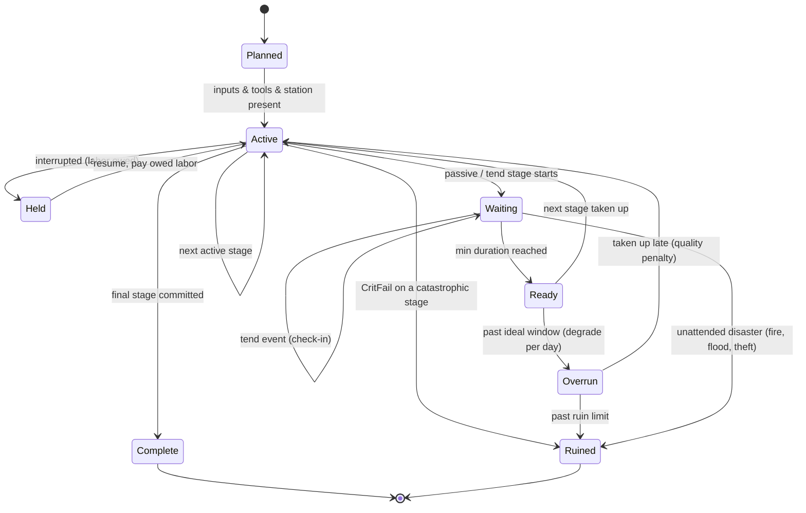
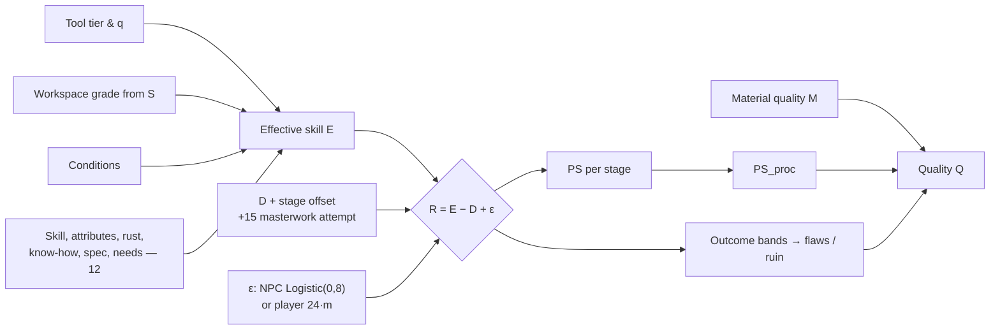

# 13 — Crafting, Land Work & Minigames

> **Status:** Draft v0.1 · revised for canon v0.3 (decision points) · **Owner doc for:** the crafting/process model, item quality (score, grades, flaws, appraisal, maker's marks, durability), materials and their properties, every per-profession minigame for crafts **and** land work (farming incl. the crop & soil model, husbandry incl. the livestock model, hunting, fishing, foraging, woodcutting, mining), and how NPCs resolve the same work without playing minigames · **Depends on:** [01-canon](../01-canon.md), [02-game-overview](../02-game-overview.md), [10-world-and-setting](10-world-and-setting.md), [11-survival](11-survival.md), [12-skills-and-professions](12-skills-and-professions.md), [14-technology-and-buildings](14-technology-and-buildings.md), [15-economy-and-trade](15-economy-and-trade.md), [16-social-systems](16-social-systems.md), [17-governance-and-law](17-governance-and-law.md), [18-conflict-and-warfare](18-conflict-and-warfare.md), [19-player-experience](19-player-experience.md), [20-architecture](../tech/20-architecture.md), [21-npc-ai](../tech/21-npc-ai.md), [22-llm-integration](../tech/22-llm-integration.md), [30-roadmap](../production/30-roadmap.md)

The vision: *"Making a bow for example shouldn't just be clicking 'make bow' it should involve mini
games of sorts where you carve a bow, treat it, string it etc … Farming involves tilling the land,
planting seeds, fighting off pests and diseased plants, watering etc … Each profession and skill
should feel almost like its own game."* This document is the specification for that promise
(pillar **P3 — Work is a craft**) and for keeping it honest with **parity** (tenet 2), **respect for
the player's time** (tenet 7) and **simulate first, render second** (tenet 4).

## Table of contents

1. [Scope and interfaces](#1-scope-and-interfaces)
2. [Design principles](#2-design-principles)
3. [The work clock: labor, game time, interruptions](#3-the-work-clock-labor-game-time-interruptions)
4. [The process model](#4-the-process-model)
5. [Quality](#5-quality)
6. [Materials](#6-materials)
7. [Minigame framework](#7-minigame-framework)
8. [Craft minigames](#8-craft-minigames)
9. [Land-work minigames](#9-land-work-minigames)
10. [The crop & soil model](#10-the-crop--soil-model)
11. [The livestock model](#11-the-livestock-model)
12. [Tedium control: mastery, batch, delegation, automation](#12-tedium-control-mastery-batch-delegation-automation)
13. [NPC work resolution & parity](#13-npc-work-resolution--parity)
14. [Discovery, recipes, learning & LLM touchpoints](#14-discovery-recipes-learning--llm-touchpoints)
15. [Simulation LOD](#15-simulation-lod)
16. [Data schemas](#16-data-schemas)
17. [Milestone map](#17-milestone-map)
18. [Tuning knobs](#18-tuning-knobs)
19. [Exploits and mitigations](#19-exploits-and-mitigations)
20. [Headless validation](#20-headless-validation)
21. [Open questions](#open-questions)
22. [Proposed canon additions](#proposed-canon-additions)

---

## 1. Scope and interfaces

**Owned here:** recipes/processes and their stages; workstations' and tools' *roles* in work;
quality score, grades, flaws, appraisal, durability, provenance and maker's marks; material
properties; all minigames; field, crop, soil, pest, weed and blight simulation; livestock biology,
feed and products; NPC work resolution; work at every simulation LOD.

**Consumed from other documents (interface only):**

| From | What this doc needs | Notes |
|------|---------------------|-------|
| [12](12-skills-and-professions.md) | `Resolve(CheckRequest)` → Outcome, margin R, performance score PS, WorkRate, E ([12 §6](12-skills-and-professions.md)); know-how levels; perks; XP; competence evidence events | 13 passes D, tool, workspace grade, condition tags and the player's minigame value `m`; consumes PS, outcome bands and WorkRate (§5.2). |
| [10](10-world-and-setting.md) | Daily weather per region (`tMin, tMax, precipMm, frost, snowCover, wind, storm, hail, humidity`), soil type per terrain cell, resource nodes (species, size, grade, regrowth), fauna & fish populations, tides | 13 reports harvest pressure back (kills, catches, picks, felled trees). |
| [11](11-survival.md) | Needs drain per labor intensity; injury/disease/poison model; food nutrition & spoilage; condition-observable symptoms | 13 emits `TreatmentResult`, food `Q` & preservation quality, work-accident events. |
| [14](14-technology-and-buildings.md) | Workstation entities and their quality `S`; construction blueprints; mills, kilns, furnaces as buildings | 13 provides the minigames that construction labor uses (lashing, thatching, framing, laying stone). |
| [15](15-economy-and-trade.md) | `QualityMult(Q)`, `ConditionMult(d)`, wages, commissions/orders, property | 15 requires integer `Q ∈ 0–100, 50 = common`; this doc adopts it. |
| [16](16-social-systems.md) | Competence reputation, memories, gossip | 13 emits 12's `ProductObserved` / `TaskWitnessed` evidence and `NotableWork` events. |
| [17](17-governance-and-law.md) | Land tenure rules, labor services, hunting/forest rights, mark registration, forgery as crime | 13 records who worked/owns which strip and item. |
| [18](18-conflict-and-warfare.md) | Weapon/armor use, archery shot model, quality multiplier on damage | 13 supplies Q, grade, durability, draw weight, flaws. |
| [21](../tech/21-npc-ai.md) | Job selection, schedules, personality facets & traits, corner-cutting decisions | Personality acts on work only through those choices (§13.2), never on the dice. |
| [22](../tech/22-llm-integration.md) | Dialogue pipeline for mentor hints, commissions, patients | 13 supplies structured hint tags and specs, and builds commission decision menus with 15 (§14.4); never quality or yield outcomes. |

**Skill mapping for activities without a canon skill name** (aligned with
[12 §4.4](12-skills-and-professions.md)): knapping → **Masonry**; charcoal burning and birch-tar
making → **Woodcutting** (Collier); bricks/tiles → **Pottery**, bricklaying → **Masonry**; mill
operation → **Carpentry** (Wright), millstone dressing → **Masonry**; hand-quern grinding →
**Cooking**; butchery, cheese (with `dairying`), salting and salt boiling → **Cooking**; slaughter itself →
**Husbandry**; field dressing → **Hunting**; cordage, basketry, dyeing → **Textiles**; fletching
and bowstrings → **Bowyery**; resin & honey gathering → **Foraging**; carburizing → **Metallurgy**; bloom consolidation → **Smithing** (`forge_welding`); threshing/winnowing → **Farming**; construction labor →
**Carpentry**/**Masonry** per stage ([14](14-technology-and-buildings.md) assigns).

---

## 2. Design principles

1. **Processes, not buttons; the land is persistent.** Products are multi-stage processes with
   real intermediates (rough stave, bloom, limed hide, greenware), some spanning game days. Fields,
   herds, clamps and pits exist in the world and are worked by many hands.
2. **The minigame replaces the dice, not the skill.** A minigame yields `m ∈ [−1,+1]` in place of
   the random term of [12](12-skills-and-professions.md)'s shared check; skill, materials, tools
   and station decide what the work is worth. One quality function for player and NPC (§5, §13).
3. **Skill is felt in the hands; materials matter as properties.** Higher skill widens windows,
   steadies jitter and reveals information; yew bends where oak cracks, bloom carries slag.
4. **Ten verbs, headless.** All minigames compose ten primitives (§7.1) implemented as
   deterministic state machines in the pure-C# sim core ([20](../tech/20-architecture.md)),
   calibrated by bot players in CI (§20).
5. **Tedium is opt-out** — auto-resolve, Quick Work, batch, delegation — always at or below a
   skilled hand's result (§12).

---

## 3. The work clock: labor, game time, interruptions

Canon time: 30 real minutes per game day, **1 real second = 0.8 game minutes** (48:1). The world
never pauses for a minigame (pillar P1); the player may pause the whole game (single-player), which
freezes minigame state too.

### 3.1 Nominal labor and the paid-labor rule

Every active stage has a **nominal labor** `L` in game-minutes (authored, at reference conditions).
Actual labor:

```
L_eff = L × PerkTimeFactor × TaskToolFactor / WorkRate × (1.10 − 0.002·PS) (× 1.5 for a masterwork attempt)
```

- `WorkRate` comes from [12 §6.4](12-skills-and-professions.md) (`0.5 + E/100`, × tool-tier
  ToolSpeed, × 1.5 if rushing); `PerkTimeFactor` from 12's perks.
- `TaskToolFactor` (13 data) adds extra tool-tier sensitivity only where material dominates the
  work: felling, tillage, quarrying — stone ×1.5, copper ×1.2, else 1.0.
- `(1.10 − 0.002·PS)`: good work is also brisk work (0.90–1.10). Applied identically to NPCs.

**Paid-labor rule (decision).** While the player plays a stage, the clock runs normally. When the
stage ends after `r` real seconds, if `0.8·r < L_eff`, a short **work-passes time-lapse** (1–3 s,
the character working in montage) advances the clock to `start + L_eff`. If the player was slower
than `L_eff`, nothing more is charged. Total game time = `max(0.8·r, L_eff)`. Needs drain over the
whole span at the stage's intensity tag (`light | moderate | heavy`, mapped by
[11](11-survival.md)).

**Interruptions.** The time-lapse uses the same safety checks as *Wait* (canon §6.1: hostile
perceived, attack, household death/birth, summons, accusation, war, critical needs). If halted, the
stage result is computed but **held**: the WIP is marked `LaborOwed = remaining minutes` and does
not advance until the owed labor is paid by resuming (a time-lapse on resume). Owed labor never
expires and abandoning a held stage never refunds inputs, so interrupting can never make work
cheaper.

**Design target.** Real play time × 0.8 should cover **40–80 %** of `L_eff`, so the time-lapse is
present but brief. Example: tillering has `L = 240` game-min; a 150 s session covers 120 min; the
time-lapse covers the other 120 min in ~2 s.

### 3.2 Sessions and multi-day work

Long work (a sword: ~30 labor-hours) is split into stages, each a session of 1–8 real minutes.
Work beyond ~10 labor-hours per game day causes the character to tire per [11](11-survival.md);
nothing in this doc forbids night work, but light conditions apply (§5.4).

---

## 4. The process model

### 4.1 Concepts

| Concept | Definition |
|---------|------------|
| **Recipe** | Data definition of a process: output, skill, difficulty `D`, know-how, tier, station, tools, inputs, stages, design parameters (§16.1). |
| **Stage** | One step. Kinds: `active` (minigame/animation), `passive` (timer at a location), `tend` (passive with check-in events), `assembly` (combine intermediates; usually a short active step). |
| **Intermediate** | A real item instance carrying `ProcessState` (e.g. `item.bow_stave_rough`, `item.bloom`, `item.hide_limed`, `item.greenware_jar`). It can be stored, traded, stolen, inherited, or finished by someone else. |
| **ProcessInstance** | Runtime record tying a WIP item (or a world object such as a clamp, kiln load, tanning pit or field) to its recipe and stage. |
| **Workstation** | Placed object/building ([14](14-technology-and-buildings.md)) with quality `S` (0–100), capacity, and optional quality cap. |
| **Tool** | Item with tags (`tool.knife`, `tool.adze`…), quality `Q` and material tier; `Q` and tier feed 12's `ToolMod` and `ToolSpeed`; wear and repair are 13's (§4.5). |

### 4.2 Process state machine



- **Stage results commit at stage end**, not at process end. Stage PS values and flags accumulate
  on the WIP; `PS_proc = Σ w_i·PS_i` at completion (§5.2).
- **Stepping away** (Esc) from an active stage saves "bench state" (partially tillered limb, half-
  thrown pot is *not* saveable — clay stages must complete or collapse back to wedged clay with no
  loss). Hot work cools: smithing heats decay in real time (reheat costs fuel and labor, no
  penalty); **vigil stages** (bloomery, kiln firing, charcoal clamp) left unattended drift on
  autopilot and are resolved as an NPC draw at `E − 15` unless a delegate tends them.
- **Anyone can continue a WIP** if they have the know-how; the final item's provenance lists every
  contributor with their stage weights (maker = largest weight).

### 4.3 Passive & tend durations (game days unless noted)

| Process | Min | Ideal | Overrun effect |
|---------|-----|-------|----------------|
| Season bow stave | 8 | 16–32 | none (drier is fine) |
| Season joinery timber | 8 | 16 | none; green timber allowed for framing (historical) |
| Flax retting (water / dew) | 1 / 3 | 2 / 4 | −20 Q per day over; ruin at +3 |
| Hide liming/dehairing | 2 | 2–3 | grain damage −10 Q/day after 4 |
| Brain-tan + smoke | 1 | 1 | — |
| Bark tanning: light / heavy leather | 8 / 16 | 8–12 / 16–24 | none |
| Clay slaking & settling | 1 | 1–2 | none |
| Greenware drying (leather-hard / bone-dry) | 0.5 / 1 | same | frost while wet → crack flaw |
| Kiln firing + cooling | 0.5 + 0.5 | — | opening hot → dunting cracks |
| Charcoal clamp burn + cool | 2 + 1 | 2.5 + 1 | uncovered too long → ash loss |
| Lime kiln burn | 2 | 2 | — |
| Malting: steep / germinate / kiln | 0.5 / 2 / 0.5 | — | over-germinated: −15 extract |
| Ale fermentation | 2 | 2 | best days 1–4 after; sour from day 6 → vinegar |
| Mead | 8 | 16+ | — |
| Smoking meat/fish · salt cure | 1 · 2 | 1–2 · 2 | — |
| Cheese: soft / hard | 1 / 8 | 1 / 16–32 | soft spoils per [11](11-survival.md) |
| Woad vat ferment | 2 | 2 | exhausted after 4 |
| Bread proof | 1–2 game h | — | over-proof −10 Q |
| Carburizing pack (T4) | 1 | 1–2 | over-carburized: brittle flaw |

**Perks** from [12](12-skills-and-professions.md) that shorten these (e.g. *Supple Hand*, tanning
time −30 %) multiply the min and ideal durations.

### 4.4 Workstations (roles only; buildings owned by [14](14-technology-and-buildings.md))

| Station | Tier | Used by | Quality cap if crude |
|---------|------|---------|---------------------|
| Campfire | T0 | Cooking, hafting tar, heat-straightening shafts | Cooking 70 |
| Knapping spot / anvil stone | T0 | Knapping | — |
| Drying/smoking rack | T0 | Preservation, hides | — |
| Shaving horse / carving bench | T0 | Bowyery, Carpentry | — |
| Workbench | T1 | Carpentry, Leatherworking, Textiles (cutting) | — |
| Clay oven · hearth | T1 | Baking, cooking | — |
| Pit firing · updraft kiln | T0–T1 | Pottery, bricks | Pit: 60 |
| Warp-weighted loom · treadle loom | T1 · T3 | Weaving | — |
| Tanning pits & beam | T1 | Leatherworking | — |
| Brewing vats & malt floor | T1 | Brewing | — |
| Bowl furnace · crucible furnace | T1 · T2 | Copper smelting, bronze | — |
| Forge & anvil (stone anvil / iron anvil) | T1+ | Smithing | Stone anvil 65 |
| Bloomery | T3 | Iron smelting | — |
| Charcoal clamp site · lime kiln | T1 · T2 | Woodcutting (collier), Masonry | — |
| Threshing floor · quern · watermill/windmill | T1 · T1 · T3 | Farming, Cooking, Carpentry | — |
| Sawpit · pole lathe | T1 | Carpentry | — |
| Mason's banker | T2 | Masonry | — |
| Infirmary bed | T1 | Healing (counts as well-equipped for surgery) | — |

`S` maps to 12's workspace grade (§5.2). Wear: stations lose 1 `S` per ~40 labor-hours;
repair is a short carpentry/masonry stage.

### 4.5 Tools and the finite salvage

Recipes require tool tags (hard gate) and may list optional tools (each with its own tier and `Q`, feeding
12's `ToolMod`/`ToolSpeed`). Each labor-hour consumes tool durability at the stage's wear rate. Sharpening
(Smithing, whetstone, 30 s minigame) restores up to 80 % of max durability and lowers max
durability by 2 %. The ship's **salvaged iron tools** (canon §5.3) are ordinary iron tool instances
with high wear relevance: they cannot be reforged until a forge exists (M4) and cannot be replaced
until iron is smelted (T3). Their condition is a visible colony-level worry by design.

---

## 5. Quality

### 5.1 Scale and grades

Item quality `Q` is an **integer 0–100** on every crafted or harvested item instance, with **50 =
common, sound work** (as required by [15 §2.4](15-economy-and-trade.md)).

| Grade | Q band | Midpoint | Meaning |
|-------|--------|----------|---------|
| **Crude** | 0–19 | 10 | Barely serviceable; breaks or spoils early |
| **Poor** | 20–39 | 30 | Works, visibly amateur |
| **Common** | 40–59 | 50 | Sound, ordinary work |
| **Fine** | 60–74 | 67 | A good craftsman's work; noticed |
| **Superior** | 75–89 | 82 | Expert work; sought after |
| **Masterwork** | 90–100 | 95 | Exceptional; named, remembered, gossiped about |

**Ruined** is an *outcome*, not a grade: no item is produced; salvage per recipe.

### 5.2 The quality function (built on 12's `Resolve()`)

[12 §6](12-skills-and-professions.md) owns the shared check. 13 calls `Resolve()` once per
**scored stage** and turns the results into item quality.

```
// Per scored stage i — 12's contract (12 §6.1)
req_i = CheckRequest(Actor, SkillId = recipe.skill,
          Difficulty = D + stage.dOffset (+15 if Masterwork attempt),
          ActionKey = recipe.id, KnowHowId = recipe.knowhow,
          Tool = best tool for stage.toolTag (q, tier), Workspace = Grade(station S),
          Conditions = 12's set + 13 tags (§5.4), Helpers,
          MinigameM = m_i (player, m ∈ [−1,+1] → ε = 24·m) | null (NPC, auto, batch → ε ~ Logistic(0,8), ±31))
res_i = Resolve(req_i)   // → Outcome, R, PS_i = clamp(50 + 1.25·R, 0, 100), WorkRate, E

// Process quality — 13
PS_proc = Σ w_i · PS_i                         // stage weights in recipe data, Σ w_i = 1
Mat     = 0.70 + 0.30 · M/100                  // M = slot-weighted input material quality
Cap     = min( 30 + 0.7·M,                     // material ceiling
               recipe.max_quality,             // default min(100, 60 + D): a nail is never a masterwork
               station.cap, flaw caps,
               89 unless Masterwork attempt,   // masterworks require intent
               50 if any stage used know-how at Aware )   // experimentation (12 §8.2)
Q       = clamp(round(PS_proc · Mat + PerkBonus), 0, Cap)
```

**Stage outcomes** use 12's bands. **CritFail** (R < −30) on a stage flagged `catastrophic` →
**Ruined**; on other stages → its flaw and `PS_i = 0`. **Fail** (−30 ≤ R < −10) → the stage's
flaw tag (§5.7). **Success / CritSuccess** → clean. Because 12 clamps NPC noise at ±31 and the
minigame at ±24, a catastrophe is impossible for an NPC at `E − D ≥ +1` and for the player at
`E − D ≥ −6`: **things break when you work above your level.** In play, a catastrophic input
(overdrawing the bow, burning the steel) whose R stays ≥ −30 is shown as the character catching
it — "the limb creaks; you ease off" — and becomes a flaw.

- `M`: weighted mean of input slots' `Q` (bow: stave 0.8, string 0.2).
- **Masterwork attempt** (design parameter; this is the "target-quality uplift" 12 expects): D +15,
  labor ×1.5, lifts the 89 ceiling. NPCs attempt only for commissions, guild masterpieces
  ([12 §13](12-skills-and-professions.md)) or when *Ambitious* ([21](../tech/21-npc-ai.md)).
- `PerkBonus` ([12 §4.2](12-skills-and-professions.md) capstones): "+1 quality grade" = **+10**
  before the cap (material-producing perks such as *Forest-wright* apply it to the harvested
  material's `M` instead); *Masterwork Smith* "masterwork chance ×2" = **+8 when `PS_proc·Mat ≥ 80`** (≈ doubles the rate at typical attempt margins).
- Workspace grade from station quality: `S < 30` makeshift · 30–79 proper · ≥ 80 well-equipped;
  a missing expected station is "none". Tool tier and `q` enter `E` through 12's `ToolMod`.
- The process's **XP outcome** is its signature stage's outcome ([12 §5.2](12-skills-and-professions.md)).



### 5.3 Calibration

Single-stage view by margin `Δ = E − D` (multi-stage processes have ~40 % less NPC spread). A
**typical attentive player** must calibrate to median `m ≈ 0`, IQR ±0.35 (12 §6.5); a
**practiced, skilled player** sits around `m ≈ +0.35`; perfect play is `m = +1`. Columns use
`Mat 0.85` (M 50, cap 65) and `Mat 0.97` (M 90, cap 93; 89 without a masterwork attempt).

| Δ | NPC median PS | Skilled PS | Perfect PS | Q: NPC, M 50 | Q: NPC, M 90 | Q: skilled, M 90 | Q: perfect, M 90 |
|---|---------------|-----------|------------|--------------|--------------|------------------|------------------|
| −30 | 12.5 | 23.0 | 42.5 | 11 Crude | 12 Crude | 22 Poor | 41 Common |
| −15 | 31.3 | 41.8 | 61.3 | 27 Poor | 30 Poor | 40 Common | 59 Common |
| 0 | 50.0 | 60.5 | 80.0 | 43 Common | 49 Common | 59 Common | 78 Superior |
| +15 | 68.8 | 79.3 | 98.8 | 58 Common | 67 Fine | 77 Superior | 89 cap |
| +30 | 87.5 | 98.0 | 100 | 65 cap (Fine) | 85 Superior | 89 cap | 89 cap |
| +45 | 100 | 100 | 100 | 65 cap | 89 cap | 89 cap | 89 cap |

- **Parity envelope:** perfect play equals an NPC's ~95th-percentile roll (ε = +24); skilled play
  ≈ the NPC's 74th percentile. An NPC's best roll (+31) still beats perfect play. A skilled player
  is typically **~+9 Q** (about half a grade) better than the same person resolved as an NPC.
- **Masterworks** need intent, margin and material: attempting at true Δ = +30 (effective +15)
  with M 90, an NPC reaches Q ≥ 90 in ~5–8 % of attempts and a perfect player always; at true
  Δ = +45 (effective +30) the NPC rate is ~30–37 %. With average material (M ≤ 85) they are
  impossible. Exceptional materials are therefore treasures.

### 5.4 Conditions

Condition modifiers (light, weather, workspace, needs, pain, intoxication, mood, rushing) are
12's ([12 §6.2](12-skills-and-professions.md)). 13 adds two work-specific tags: **wet material**
−5 (green wood for carving, damp hide for cutting, wet clay at firing) and **gusting wind on
open-fire work** −3 (campfire cooking, pit firing, clamp lighting). Frozen ground and similar are
hard gates (§9), not modifiers.

### 5.5 Worked example — a yew self bow

Bryn: Bowyery 44 with the *Bowyer* specialization, DEX 6 · PER 5 · STR 5, Energy 25 (tired),
iron knife q 55, *Self-bow* Practiced, proper bench, daylight.
`E = 44 + 1.8 (attributes) + 0.4 (tool) + 0 (know-how) + 8 (spec) − 5 (energy) = 49.2`. Recipe
`recipe.self_bow_yew`, `D = 45` → **Δ = +4.2**. Scored stages: selection .10, shaping .20,
tillering .50 (signature, catastrophic), stringing .20. Yew stave `M 72`, flax string `M 70` →
`M ≈ 71.6`, `Mat 0.915`, `Cap = min(80, 100, 89) = 80`.

- **NPC Bryn:** median `PS_proc = 50 + 1.25·4.2 = 55.3` → **Q 51 Common**; spread ≈ ±10 PS, so
  ~17 % of her bows reach Fine. She cannot break a stave at this margin.
- **Player as Bryn:** `m` = +0.3, +0.3, +0.6, +0.3 → weighted `m = 0.45` → `PS_proc = 55.3 + 30·0.45
  = 68.8` → **Q 63 Fine**.
- **Player overdraws while tillering** (`m_tiller = −1`): `R = 4.2 − 24 = −19.8` → *Fail*, not
  *CritFail* — the limb creaks, she eases off, `flaw.hinge` (cap 55). `PS_proc = 44.8` → **Q 41
  Common, hinged**.

### 5.6 What quality does

| Effect | Formula (default; owner may override) | Owner of the consuming system |
|--------|---------------------------------------|------------------------------|
| **Stat multiplier** (warmth, protection, capacity, container shelf-life…) | `StatMult(Q) = 0.85 + 0.003·Q` (0.85 / 1.00 / 1.15) | 13 for containers & misc.; [11](11-survival.md) warmth; [18](18-conflict-and-warfare.md) weapons/armor; tools act through 12's `ToolMod` |
| **Durability** (max condition) | `maxDur = baseDur × (0.5 + Q/100)` (0.5×–1.5×) | **13** |
| **Value** | `QualityMult(Q) = clamp(2^((Q−50)/25), 0.25, 4)` | [15 §2.4](15-economy-and-trade.md) |
| **Food** | Calories unchanged; `Q` → meal mood/comfort step and preservation shelf-life multiplier `0.7 + 0.006·Q` | [11](11-survival.md) |
| **Maker reputation** | 12's `ProductObserved{maker, skill, Q, flawsSeen, observer}` on sale, gift, use in view, appraisal ([12 §12](12-skills-and-professions.md)) | [16](16-social-systems.md) |
| **Renown** | Masterwork completion emits `NotableWork` (Chronicle-worthy, gossip seed) | [16](16-social-systems.md), [22](../tech/22-llm-integration.md) |

[18](18-conflict-and-warfare.md) currently lists five grade names (Poor · Common · Good · Fine ·
Masterwork) with multipliers 0.85–1.15; this doc proposes it use the continuous `StatMult(Q)` above,
which spans the same 0.85–1.15 range on the canonical six grades.

### 5.7 Flaws — partial success

A stage whose outcome is **Fail** (or a non-catastrophic **CritFail**) attaches its **flaw tag**
instead of ruining the item (§5.2). Flaws are discrete, visible to appraisers by skill, and cap quality.

| Flaw | Typical source | Effect | Cap | Fix |
|------|---------------|--------|-----|-----|
| `flaw.hinge` | Uneven tiller | Bow durability −40 %, break chance on overdraw | 55 | Re-tiller (lighter bow) |
| `flaw.follows_string` | Green stave, overdraw | Draw −10 % | 70 | — |
| `flaw.cold_shut` | Forge weld too cool | Break chance under heavy impact | 60 | Reforge |
| `flaw.slag_inclusion` | Poor consolidation | Durability −25 % | 65 | — |
| `flaw.soft_edge` | Late/slow quench | Edge stat −20 % | 70 | Re-harden |
| `flaw.warp` | Uneven quench | Handling −10 % | 75 | Straightening stage (30 s) |
| `flaw.hairline_crack` | Fast kiln ramp, bubbles | Vessel leaks; holds dry goods only | 50 | — |
| `flaw.misfit_joint` | Loose tenon | Furniture/frames wear ×2 | 60 | Shim/peg (assembly stage) |
| `flaw.uneven_yarn` / `flaw.mispick` | Spinning/weaving drift | Cloth warmth −10 % | 65 | — |
| `flaw.loose_seam` | Stitching drift | Garment durability −30 % | 70 | Resew |
| `flaw.scorched` / `flaw.undercooked` | Cooking heat | Mood −; undercooked meat → disease risk ([11](11-survival.md)) | 45 | — |
| `flaw.off_flavor` | Brewing infection | Mood −; may sour early | 45 | — |
| `flaw.tainted_meat` | Gut puncture in dressing | Spoils ×2 faster | 50 | Trim (loses 10 % meat) |
| `flaw.knot` | Stave/board with hidden knot | Break risk | 60 | — |

### 5.8 Appraisal — perceived quality

True `Q` and flaws are ground truth; people *perceive* them. Viewer `v` with relevant skill `s`
(the item's craft skill, or `0.6 × Commerce` if higher — *Appraiser* specialization per
[12](12-skills-and-professions.md) uses full Commerce):

```
Q_est = Q + N(0, σ_a),   σ_a = 2 + 13·(1 − s/100)          // seeded per (viewer, item): stable on re-inspection
see flaw f with p = 1 / (1 + exp(−(s − f.hiddenDifficulty + 10)/8))     // 12's success curve
UI: grade name always; exact number only if s ≥ 40; maker sees own result exactly
```

This feeds haggling in [15](15-economy-and-trade.md) (e.g. its `quality_flaw` argument) and
reputation in [16](16-social-systems.md).

*Implemented (M2-09):*
- **Quality functions:** `Sim/Items/Quality.cs` has the grades, §5.6's curves, the §5.2 quality function with its
  whole cap chain (rounded half away from zero — the §5.3 table's 42.5 → 43), flaw caps, and §5.8 appraisal (seeded
  per viewer and item; flaw sighting per flaw).
- **Flaws:** content (`content/flaws/flaws.yaml`, 16 flaws). The `hidden_difficulty` values are proposals; the
  table above gives none.
- **Inventory:** `InventoryStore` holds per-container slots and the instance table. Commodities stack, and unique
  items carry Q, flaws, durability and provenance.
- **Holdings:** people's goods now live there.
- **Not yet:**
  - The process model and stage aggregation that produce `PS_proc` (M2-10).
  - Marks, and `ProductObserved`.
  - Material features.

### 5.9 Provenance and maker's marks

Every non-commodity item carries immutable **provenance**: maker id(s) with stage weights, recipe,
completion time (game-minutes), settlement, input material origins (node/animal/field ids), and an
optional **mark**.

- **Marks** unlock at **Journeyman (skill ≥ 40)** in the recipe's skill. The player designs a mark
  from a glyph set ([19](19-player-experience.md)); NPCs get procedural marks. Marking is per item
  (default on for Fine+).
- A marked item emits `ProductObserved` for its maker whenever appraised, used in view, sold or
  gifted; unmarked work credits its maker only where the maker is otherwise known (made in view,
  handed over personally) — in a 24-person camp that is everything; in a town of 500, marks matter.
- Era 3+: marks may be registered with a guild or lord; stamping another's mark is forgery
  ([17](17-governance-and-law.md)); appraisers notice a mark whose `Q_est` is far below the maker's
  known competence.
- **Commodity stacks** (grain, flour, charcoal, yarn, nails, arrows in sheaves) carry a
  stack-weighted mean `Q`, a source list, and no mark; merging stacks averages `Q` by quantity.

---

## 6. Materials

### 6.1 Model

A **material type** (`material.yew`) carries fixed *properties*; a **material instance** (this
stave, this bloom, this hide) carries a quality `M` (0–100) and, where it matters, hidden
**features** (knots, twist, slag pockets, holes, cortex) generated at harvest from the source node's
grade ([10](10-world-and-setting.md)) and the harvester's performance, seeded so reloading cannot
re-roll them. Properties decide *what can be made and its stat envelope*; `M` and features decide
*how well*. Properties are normalized 0–1 unless units are shown.

### 6.2 Woods

| Wood | Density g/cm³ | Stiffness | Flex (strain before set) | Toughness | Rot resist. | Workability | Split ease | Signature uses |
|------|---------------|-----------|--------------------------|-----------|-------------|-------------|------------|----------------|
| Yew | 0.67 | 0.55 | **0.95** | 0.70 | 0.85 | 0.60 | 0.40 | Self/war bows (heart/sap natural laminate); rare |
| Ash | 0.68 | 0.75 | 0.55 | **0.95** | 0.30 | 0.70 | 0.80 | Spear shafts, handles, flatbows, cart parts |
| Elm | 0.58 | 0.55 | 0.65 | 0.85 | 0.75 (wet) | 0.50 | **0.15** | Flatbows, hubs, keels, pipes, shields |
| Hazel | 0.56 | 0.60 | 0.65 | 0.70 | 0.35 | 0.85 | 0.75 | Quick bows, arrows, wattle, hurdles (coppice) |
| Oak | 0.72 | 0.80 | 0.30 | 0.80 | **0.90** | 0.45 | 0.70 (rives) | Frames, beams, barrels; **bark → tannin** |
| Pine | 0.50 | 0.65 | 0.35 | 0.50 | 0.55 | 0.85 | 0.75 | Construction, resin, torches |
| Birch | 0.65 | 0.70 | 0.45 | 0.70 | 0.20 | 0.75 | 0.55 | Bark containers, **birch tar**, bowls, fuel |
| Willow | 0.42 | 0.40 | 0.70 | 0.60 | 0.25 | 0.95 | 0.60 | Baskets, weirs, wattle, light shields |
| Alder | 0.50 | 0.50 | 0.40 | 0.50 | 0.90 (submerged) | 0.85 | 0.65 | Piles, fine charcoal, clogs |
| Lime | 0.53 | 0.45 | 0.45 | 0.50 | 0.25 | **1.00** | 0.60 | Carving; **bast fiber** for cordage |

Species availability by biome is [10](10-world-and-setting.md)'s; this list is the minimum set
the crafts need. Bow example: achievable draw weight range and set resistance come from stiffness ×
flex × stave dimensions; yew reaches war-bow weights (32–45 kgf per
[18](18-conflict-and-warfare.md)) with narrow limbs; ash and elm need wide flat limbs; hazel tops
out ~25 kgf.

### 6.3 Metals

| Metal | Tier | Hardness (as made / best) | Toughness | Edge retention | Work mode | Melt/forge °C | Notes |
|-------|------|---------------------------|-----------|----------------|-----------|---------------|-------|
| Copper | T1 | 0.25 / 0.40 (work-hardened) | 0.80 | 0.25 | Cold-work + anneal; cast | 1085 melt | Blunts fast |
| Bronze (Cu + Sn) | T2 | 0.55 / 0.65 | 0.60 | 0.55 | Cast, then cold-work edge | ~950 melt | Best at 10 % Sn; >13 % brittle, <7 % soft |
| Bloom iron | T3 | — | — | — | Must be consolidated | 1150–1250 smelt | Spongy, slaggy intermediate |
| Wrought iron | T3 | 0.40 / 0.45 | 0.75 | 0.40 | Hot forge, forge-weld | ~1300 weld | Cannot be quench-hardened |
| Steel (0.5–0.8 % C) | T4 | 0.55 / **0.90** (quenched) | 0.40 → 0.80 (tempered) | 0.85 | Forge, quench, temper | ~1200 forge | Temper trades hardness for toughness |

Hardness/toughness for steel are set by the **temper color** chosen (§8.3): straw (H 0.88,
T 0.50) → bronze (0.82, 0.62) → purple (0.75, 0.72) → blue (0.65, 0.80, springy). Bloom
consolidation yields **steely patches** (carbon-rich) that an Expert can spot by spark test and
sort out — the T4 "bloom steel" route; carburizing (cementation) is the reliable one.

### 6.4 Hides, leathers, fibers, clays, stone

| Category | Types & key properties |
|----------|-----------------------|
| **Hides** (by species, from [10](10-world-and-setting.md) fauna & §11 livestock) | Deer (fine, supple) · goat (fine, parchment later) · sheep (fleece-on, weak leather) · cattle (heavy) · boar/pig (tough) · hare/fox/wolf/bear (fur; winter-taken pelts +20 M). `M` drops with cuts/holes from skinning and with delay (hair slip after 1 day unprocessed). |
| **Leathers** | Rawhide (stiff, shrinks; lashing, drumheads) · buckskin (brain-tan + smoke; soft, washable) · bark-tanned light/heavy (firm, durable; shoes, belts, soles, armor) · tawed (alum, trade only; white, soft). Properties: `strength, suppleness, water_resist, mold_ability`. |
| **Fibers** | Nettle & lime bast (T0; strong, labor-heavy) · flax/linen (T1; strongest, cool; bowstrings, sails) · wool (T1 with sheep; warm, felts, best dye uptake) · sinew (T0; backing, binding). Properties: `tensile, warmth, softness, spin_ease, dye_affinity`. |
| **Clays** | Earthenware (common; fires 900–1050 °C) · stoneware (rare deposit; vitrifies 1200–1280 °C; needs T2+ kiln; watertight) · fireclay (refractory: crucibles, tuyeres, furnace linings). Properties: `plasticity, shrinkage, firing_range, refractoriness, lime_impurity`. |
| **Stone** | Flint/chert (conchoidal; `predictability`, inclusions, cortex) · quartzite (hammerstones) · granite (hard, slow, durable) · limestone (easy dressing; burns to lime) · sandstone (whetstones, querns — sheds grit) · slate (splits to roofing). Properties: `hardness, dressability, fracture_predictability, frost_resist`. |

### 6.5 YAML examples

```yaml
id: material.yew
category: wood
tier: T0
properties: { density: 0.67, stiffness: 0.55, flex: 0.95, toughness: 0.70,
              rot_resist: 0.85, workability: 0.60, split_ease: 0.40 }
seasoning_days: { min: 8, ideal: 16 }
features:                      # rolled per instance at harvest, seeded
  - { id: feature.knot,  chance: 0.35, visible_difficulty: 30 }
  - { id: feature.twist, chance: 0.20, visible_difficulty: 45 }
  - { id: feature.sapwood_ratio, range: [0.15, 0.40], visible_difficulty: 20 }
tags: [wood.bow_stave, wood.carving]
---
id: material.steel
category: metal
tier: T4
properties: { hardness_quenched: 0.90, toughness: 0.40, edge: 0.85, forge_temp_c: 1200,
              burn_temp_c: 1280, quenchable: true }
temper_curve:                  # color → (hardness, toughness)
  straw: [0.88, 0.50]
  bronze: [0.82, 0.62]
  purple: [0.75, 0.72]
  blue: [0.65, 0.80]
```

---

## 7. Minigame framework

### 7.1 The ten primitives

Every minigame is a sequence of stages, each built from one or two primitives. Each primitive is a
sim-core state machine with a scoring function returning a raw score that maps to `m ∈ [−1,+1]`
(§7.2), plus optional catastrophic-input events.

| Primitive | Player does | Scored on | Used by (examples) |
|-----------|-------------|-----------|--------------------|
| `strike` | Place a cursor, set angle, charge & release force | Placement error, angle error, force vs target, timing vs heat/state | Knapping, hammering, chiseling, axe chops, flail, ore breaking |
| `hold_band` | Keep a value inside a moving target band via an analog input | Time-in-band, overshoot integral | Bellows, kiln curve, mash temp, plow depth, line tension, clay centering, twist |
| `trace` | Follow a path with the tool | Mean deviation, coverage, puncture events | Sawing, leather/cloth cutting, sickle, shearing strokes, scraping, suturing path |
| `rhythm` | Match a cadence or a key pattern | Beat error, pattern errors, consistency | Spinning, weaving, stitching, milking, threshing, wedging, kneading |
| `shape` | Iteratively remove/move material toward a target profile, with test views | Final profile error, evenness, overwork | Tillering, carving, wall pulling, drawing out, stone dressing |
| `inspect` | Examine an object from views; pick/flag features or a hypothesis | Correct features found / correct choice | Stave selection, foraging ID, diagnosis, prospecting, tracking, ripeness |
| `fit` | Place/rotate pieces in a space under constraints | Gaps, overlaps, waste, structural rules | Dry-stone walls, pattern layout, joinery, kiln loading, clamp stacking, snare setting |
| `tend` | Over game days, answer check-in **event cards** with choices/actions | Decision quality, response latency | Charcoal clamp, tanning, fermentation, seasoning, fields, aftercare |
| `aim` | Ballistic aim with sway and release | Hit error | Bow shot (via [18](18-conflict-and-warfare.md)), net cast, spear-fishing, broadcast sowing arc |
| `steer` | Move a body/team/flock in the world | Path error, panic/noise, completion | Herding, plowing, stalking, felling direction, seine hauling |

### 7.2 How skill changes a minigame

Feel parameters derive from the stage's **grip** `g = 1/(1 + exp(−(E − D)/10))` (so a master smith
making a trivial nail gets wide windows); **information** derives from the skill *tier* (knowing
what to look for is general domain knowledge). Each primitive's raw score maps to `m ∈ [−1,+1]`
through a per-minigame calibration curve fitted **per grip band** so the median attentive player
scores `m ≈ 0` at every skill level (12 §6.5). Skill therefore changes how the work *feels* (wider
windows, steadier hands, more information) but affects results only through `E − D` — no double
counting against NPCs.

| Parameter | Formula / ladder | Novice → Master example |
|-----------|-----------------|------------------------|
| Tolerance width | `ref × (0.6 + 0.9·g) × (0.8 + 0.04·DEX)` | quench window 0.35 s → 0.85 s |
| Hand jitter (σ, % of target size) | `8 % × (1 − 0.85·g)` | strike lands ±8 % → ±1.5 % |
| Catastrophe band | A catastrophic input sets `m = −1`; it ruins only if `R < −30` (§5.2), else the character catches it and a flaw results | Novices above their level break staves; others hinge them |
| Speed | via `WorkRate` and `L_eff` (§3.1) | — |
| Information tier | Novice/Apprentice **I1**, Journeyman **I2**, Expert **I3**; **I4** only via a capstone/specialization perk in [12](12-skills-and-professions.md) (*Fire-reader*, *Reads the Soil*, *Deep Sense*, *Breeder's Eye*, *Forest-wright*, *Physician*) | — |

**Information ladder** (same everywhere): **I0** diegetic only (glow, sound, shape) · **I1**
qualitative cue text ("too cold", "uneven") · **I2** gauge band (heat ribbon, thickness overlay,
moisture tint) · **I3** precise readout + target markers · **I4** predictive overlay (where the
flake will run, where the limb will hinge, which cell blight hits next).

**Teacher present** ([12 §9](12-skills-and-professions.md)): the learner sees up to the teacher's
tier − 1, and mentor hints are voiced (§14.4).

### 7.3 Controls (keyboard & mouse; controller at M7)

| Input | Bench mode (close-up "bench camera", canon §4) | Field mode (third-person in world) |
|-------|-----------------------------------------------|-----------------------------------|
| Mouse move | Cursor / tool position | Camera / aim |
| LMB hold-release | Charge & strike; hold for continuous action (scrape, pour, pump) | Tool use (chop, swing sickle) |
| RMB | Rotate view / inspect | Inspect target |
| Wheel | Force or fine parameter (pressure, pour rate) | Zoom |
| Q / E | Rotate workpiece | — |
| Shift | Fine control (½ cursor speed, ½ force rate) | Walk slow / sneak |
| Space | Commit stage / next test | Commit (release shot, call "timber!") |
| Tab | Toggle information overlay (up to tier) | Same |
| 1–4 | Choose option/event card | Same |
| Esc | Step away (WIP saved per §4.2) | Same |
| Controller (M7) | Right stick cursor, triggers = analog force/pressure, A commit, B step away, bumpers tools | Standard third-person |

### 7.4 Feedback conventions

- **Audio first:** each primitive has a "good" and "bad" signature (clean ring vs dull thud of a
  hammer; flint *tink* pitch rising with clean flakes; wood *creak* before a break; kiln roar).
  Every audio cue has a caption/icon equivalent.
- **Result card** after each process: per-stage `m` and PS, `PS_proc`, `Q` and grade, flaws, XP, and
  1–3 hint tags (§14.4). Personal best per recipe is tracked.
- **Live sub-score** is a subtle meter (I2+) — never a big number mid-play.

### 7.5 Accessibility (applies to every minigame)

| Option | Effect | Balance impact |
|--------|--------|----------------|
| Palettes & patterns | Heat, temper and ripeness colors get colorblind-safe palettes plus pattern/label alternatives | None |
| Captions for cues | All audio cues shown as icons/text | None |
| Hold → toggle, one-handed layout, remapping, reduced motion/shake | — | None |
| **Timing relief** | Minigame clock 0.5×–1.0× | **None needed:** `m` is bounded at ±1 (±24 margin, 12 §6.5), so the most relief can buy is an NPC's ~95th-percentile result |
| **Auto-resolve any stage** | Stage resolved exactly like an NPC's (§13.1) at the player's `E` | None — it is the parity baseline |
| Purist mode | Hides all overlays (I0) | None |

### 7.6 The 50th-repetition toolkit

1. **No two inputs alike** — stave grain, hide holes, ore grade, weather on the field.
2. **Design choices** — draw weight, blade profile, temper color, weave pattern, dish variant,
   seed rate; each with trade-offs.
3. **Commissions** — NPC orders with a spec (e.g. "a 20 kgf bow for my son by Summer 3"); price
   and order mechanics in [15](15-economy-and-trade.md); fit-to-spec adds reputation.
4. **Flourishes** at Expert+ — inlay, carving, embroidery, decorated pots: an `ornament` tag that
   raises value/status ([15](15-economy-and-trade.md), [16](16-social-systems.md)), not stats.
5. **Rare events** — a hidden knot revealed mid-tiller, a steely patch in a bloom, a swarm of bees.
6. **Mastery shortcuts** — Quick Work and Batch (§12). The 50th bow does not have to be played.

### 7.7 The pace-setter rule (area & volume work)

Work measured in area or volume (tilling a field, threshing a stack, spinning a full spindle,
splitting a cord of wood, laying 20 m of wall) is not played in full. The player plays a **sample
segment** (20–60 s); the rest proceeds as a task loop (animation, or time-lapse) at

```
m_session = 0.6 · m_sample            // regresses toward the NPC median (m = 0)
```

The player may re-play a segment at any time to reset it. Each cell/unit records the worker and
the resulting PS, so many hands on one field each leave their own mark (§10.7).

---

## 8. Craft minigames

Each spec uses one template. **Spec strip:** skill · tier · milestone (MVP → depth), station &
tools, representative recipes with difficulty `D`, real-time target per process, nominal labor.
**Stages** list primitive and weight `w`. Shared rules (§7.2 skill effects, §7.5 accessibility,
§7.6 variety, §12 shortcuts, §13 NPC resolution) apply unless a deviation is listed.

### 8.1 Flint knapping

| Skill · tier · milestone | **Masonry** · T0 · **M2** (MVP: percussion, pressure, hafting) → M3 (heat-treated flint) |
|---|---|
| Station · tools | None (anvil stone optional, +S) · hammerstone (req), antler billet & pressure flaker (opt; without them stages 3–4 cap at 55) |
| Recipes (D) | Scraper 10 · knife blade 20 · spear point 30 · axe/adze head 35 · arrowhead 40 |
| Real · labor | 60–120 s · 30–60 game-min |

**Stages.** (1) **Nodule choice** — `inspect`, w .10: rotate candidate nodules, tap for ring; I2
shows usable platforms, I3 inclusions. (2) **Roughing out** — `strike`, w .35: pick a point on the
edge, set platform angle (Q/E), charge force. A simplified conchoidal model sets flake length ∝
force × cos(angle − 70°) × predictability; outcomes: clean flake · step/hinge termination (leaves a
lip that penalizes later strikes) · overshoot · end-shock snap. (3) **Thinning** — `strike` with
soft billet, w .30, toward the outline template (I2 overlay). (4) **Pressure flaking** — `trace` +
small `strike`s, w .25: retouch, serrate, notch for hafting. (5) **Hafting** (assembly, separate
w): heat birch tar (`hold_band`), wrap sinew/bast (`rhythm`).

- **Skill:** I3 shows the predicted flake as a ghost before release; jitter shifts the strike point.
- **Failure/partial:** snap → Ruined, salvage 2–4 `item.flint_flake` (Crude cutters); repeated
  step fractures → `flaw.blunt_edge` (cap 55). Roughing and thinning are `catastrophic` stages.
- **50th:** every nodule differs; arrowheads made in sixes (pace-setter on the first); heat-treated
  flint feels different (more predictable).

### 8.2 Bowyery & fletching

| Skill · tier · milestone | **Bowyery** · T0 (crossbow T4) · **M2** green bow → **M3** seasoned self bow → M6 war bows, crossbows |
|---|---|
| Station · tools | Shaving horse / carving bench · knife (req), axe, drawknife, scraper (opt), tillering stick |
| Recipes (D) | Hazel green bow 20 · ash/elm flatbow 35 · yew self bow 45 · yew war bow 60 · crossbow 70 (with Smithing/Carpentry parts) · bowstring 20 · arrows (sheaf of 6) 15 |
| Real · labor | Self bow 7–9 min over 3 sessions · ~14 h + seasoning 8–16 days; arrows ~2 min / 6 · 3 h |

**Design parameter:** target draw weight in **kgf** (hunting 18–25, war 32–45, matching
[18](18-conflict-and-warfare.md)); material caps the achievable range (§6.2).

**Stages (self bow).** (1) **Stave selection** — `inspect`, w .10: staves show grain, knots,
twist, sapwood band; I3 reveals hidden knots. (2) **Rough shaping** — `shape`, w .20: drawknife
strokes to the layout; the back must follow one growth ring (I2 ring overlay) — cutting through it
("violated back") raises later break chance. (3) **Seasoning** — `tend`, 8–16 days: events
(end-checking → seal with fat; warp → bind to a form). (4) **Tillering** — `shape` + `hold_band`,
w .50, the signature stage: side view of the bow on the tillering stick; pull to marks in ~5 cm
steps; scrape the belly (drag along the limb, wheel = depth); each pull shows limb curve vs target
arc (I2) and draw weight at that length (I2 band, I3 exact). Pulling more than one mark past the
last even tiller risks a break (∝ stress); concentrated bending makes a hinge. (5) **Finishing** —
optional: heat-treat the belly (`hold_band`, +5 % draw, scorch risk; know-how), seal, horn nocks
(T1+). (6) **Stringing** — `rhythm` (reverse-twist flax/sinew) + `hold_band` (brace height), w .20.

**Green bow (M2):** stages 2, 4 (three pulls), 6 only; unseasoned → cap 55 and 40 % chance of
`flaw.follows_string`. **Fletching:** straighten shafts over heat (`inspect` + `hold_band`), sort
spine to the bow (`fit`; I3 shows spine values), trim and bind feathers (`trace` + `rhythm`), fit
points (flint / broadhead / bodkin per [18](18-conflict-and-warfare.md)) — pace-setter on one
shaft. Arrow `Q` should scale dispersion (proposed to 18: `σ × (1.3 − 0.006·Q)`).

- **Outputs:** `drawKgf` (actual), `Q`, durability, flaws. Velocity and damage are 18's.
- **Failure/partial:** break while tillering → Ruined (salvage firewood or a short-staff blank);
  `flaw.hinge`, `flaw.follows_string`, `flaw.knot`; off-spec draw is not a flaw but matters for
  commissions.
- **50th:** commissions by draw weight; wood choice; Quick Work = tillering only.

### 8.3 Smithing

| Skill · tier · milestone | **Smithing** · T1–T4 · **M4** (copper/bronze working, salvage-iron repair & reforging) → **M5** iron tools, forge welding → **M6** steel quench & temper, swords, mail |
|---|---|
| Station · tools | Forge & anvil (stone anvil cap 65) · hammer, tongs (req); punch, drift, fuller, chisel (opt) · fuel: charcoal per heat |
| Recipes (D) | Nail 10 · sharpen/repair 15 · knife 30 · sickle/hoe 30 · bodkin heads 30 · spearhead 35 · axe head 35 · plowshare 45 · mail (per 100 rings) 50 · iron arming sword 60 · steel arming sword 65 · longsword 75 |
| Real · labor | Knife 3–5 min · 3 h; axe 5–7 min · 6 h; sword 3–4 sessions × 6–8 min · ~30 h |

**Heat scale** (shown as glow at I0, ribbon at I2, named heat at I3): black < 500 °C · dull red
~650 · cherry 750–800 · bright cherry ~850 · orange 950–1000 · yellow ~1100 · white/sparkling
1250+ (welding heat for wrought iron; **burns steel**).

**Stages.** (1) **Fire** — `hold_band` via bellows rhythm. (2) **Heat & pull** — `inspect`
timing: pull at the target color for the operation. (3) **Forge** — `strike` + `shape`: top and
edge profiles vs target; choose strike point, hammer face (flat/peen), force; each heat lasts
~8–15 real s by mass (I3 shows time left). Drawing out lengthens, upsetting thickens. Striking iron
below dull red risks cracks; copper/bronze work-harden and need an anneal heat. (4) **Special
ops** — punch & drift an eye; **forge weld** (scarf, flux sand, strike within 3 s of pulling at
welding heat; cool → `flaw.cold_shut`). (5) **Quench** (steel only) — `strike` timing + `trace`:
heat to critical (I3: "non-magnetic" cue), choose quenchant (water hard/risky · brine harder · oil
gentle), plunge edge-first, agitate vertically. (6) **Temper** — `inspect` + `hold_band`: heat the
spine, watch oxide colors run to the edge, quench at the chosen color (design parameter; §6.3).
(7) **Grind, hone, haft** — `trace` on the grindstone, `rhythm` on the whetstone, assembly.

- **Failure/partial:** burnt steel → Ruined (salvage 50 % as scrap iron); quench crack → Ruined
  for blades, `flaw.hairline_crack`-equivalent for tools; `flaw.cold_shut`, `flaw.warp`,
  `flaw.soft_edge`. Repairs: reforging and resharpening restore durability (§4.5).
- **50th:** blade profiles, temper choices, pattern-welding (Master capstone in
  [12](12-skills-and-professions.md)); nails, arrowheads and mail rings use the pace-setter.

### 8.4 Metallurgy (and the collier's clamp)

| Skill · tier · milestone | **Metallurgy** (clamp: **Woodcutting**/Collier) · T1–T4 · **M4** clamp, copper, bronze → **M5** bloomery & consolidation → **M6** carburizing; crucible steel post-M6 |
|---|---|
| Station · tools | Clamp site · bowl/crucible furnace · bloomery (2–3 workers) · balance scale · molds (stone/clay) |
| Recipes (D) | Charcoal clamp 25 · copper smelt 30 · bronze alloy & cast 40 · bloomery smelt 50 · consolidation 45 · carburizing 60 · crucible steel 80 |
| Real · labor | Clamp 6–8 check-ins × 15–45 s over 3 days; copper 3 min · 3 h; bronze 2–3 min · 2 h; bloomery 4–6 min active · 8 h |

**(a) Charcoal clamp.** `fit`: stack billets around a chimney (target packing 0.6–0.8), cover with
turf and earth; light. `tend` 2–3 days: cards for smoke color (thick white = drying · yellow-brown
= charring · thin blue = done), **breakthrough flame** (seal within 30 game-min or lose a sector),
wind shifts (open/close vents), rain. Cool 1 day, rake out. Yield: charcoal = wood mass ×
(0.15 + 0.001·PS); low PS leaves brands (unburnt) and ash. **(b) Ore prep.** Roast (`tend`, 2–3 h),
crush (`strike` rhythm), sort ore from gangue (`inspect` quick-sort). **(c) Copper.** Charge
malachite + charcoal; bellows `hold_band` 1100–1200 °C for ~3 h; prills → ingot (sulfide ores must
be roasted). **(d) Bronze.** Weigh copper and tin on a balance (`fit`/measure: actual Sn % sets
hardness per §6.3); melt (`hold_band`), skim; **pour** (`hold_band` on tilt rate: too slow →
misrun, Ruined but 95 % metal recovered; too fast → `flaw.porosity`). **(e) Bloomery.** Preheat;
every ~20 game-min charge charcoal and roasted ore at the chosen ratio (`rhythm`; ~1:1 by mass);
bellows `hold_band` 1150–1250 °C (hot → brittle high-carbon bits; cold → slag freezes, no bloom);
`tend` cards ("slag rising — tap now"); extract the bloom hot (`strike` timing). 20 kg ore + 25 kg
charcoal → 2.5–4.5 kg bloom by PS and ore grade. **(f) Consolidation** (Smithing, `forge_welding`). `strike` on the hot bloom:
gentle compaction first (heavy blows on a fresh bloom crumble it — mass loss), then fold and weld;
yields wrought bar at 55–70 % of bloom mass; low PS → `flaw.slag_inclusion`; Experts spark-test
and set aside steely patches. **(g) Carburizing (T4).** Pack in charcoal in a sealed clay box;
`tend` 1–2 days; case depth ∝ time.

- **Team work:** the player may take any role; partners are NPC-resolved. Water-powered bellows
  ([14](14-technology-and-buildings.md)) fix the bellows stage at `m = +0.15` (§12.4).
- **Charcoal budget (for 14/15):** ~10 kg charcoal per kg finished bar iron (smelt + forging).

### 8.5 Carpentry (incl. construction labor)

| Skill · tier · milestone | **Carpentry** · T0–T4 · **M2** lashing, thatching, handles → **M3** saw, joinery, furniture, pole lathe → M4 cooperage → M5 wheelwright, mill gearing → M6 siege-engine parts |
|---|---|
| Station · tools | Workbench / sawpit / pole lathe · axe, knife (req); saw, adze, chisel, auger, plane (opt or per recipe) |
| Recipes (D) | Tool handle 10 · lashed frame 10 · stool 20 · lathe bowl 30 · door 30 · chest 35 · bucket/barrel 45 · cart wheel 55 · mill gearing 65 |
| Real · labor | Handle 60–90 s · 1 h; stool 2–3 min · 4 h; chest 5–7 min · 12 h; one joint 30–45 s |

**Stages.** (1) **Select & mark** — `inspect` (seasoned vs green, knots) + `trace` (snap chalk
line, scribe with square). (2) **Cut** — `rhythm` + `trace`: saw cadence; drift from the line
measured; forcing → binding; pit-saw is a two-person rhythm synced with a partner. (3) **Hew/plane**
— `shape` with adze or plane; `inspect` grain direction (against grain → tear-out, cosmetic).
(4) **Joinery** — chisel `strike` + `fit`: mortise depth/width and tenon fit (target snug; loose →
`flaw.misfit_joint`, tight → split risk); drawbore pegs. (5) **Assemble & finish** — `fit`
sequence, pegs/hide glue, oil. Lathe: treadle `rhythm` + tool angle `hold_band`. Cooperage: stave
bevels (`shape`) + hoop driving (`strike`) → watertightness test.

- **Construction labor** (blueprints and stage assignment owned by
  [14](14-technology-and-buildings.md)): lashing (`rhythm` wraps), thatching (`fit` + `rhythm`
  courses), wattle (`rhythm` weave), framing joints (as above), raising (team `hold_band`). These
  give **M2 shelter building** its hands-on feel; long builds use the pace-setter.
- **Failure/partial:** a split piece is Ruined (offcuts salvage); misfit and tear-out flaws.

### 8.6 Masonry

| Skill · tier · milestone | **Masonry** · T0–T4 · M2 hearth stones → **M3** dry-stone walls, ovens, querns → M4 lime & mortared walls → M5 ashlar, millstones → M6 castle works |
|---|---|
| Station · tools | Mason's banker (T2) · hammer, pitching tool, point, claw chisel; level, plumb bob |
| Recipes (D) | Hearth ring 10 · dry-stone wall (5 m) 20 · clay oven base 30 · quern 35 · mortared wall 35 · ashlar block 45 · millstone 55 · arch 60 |
| Real · labor | Block 45–90 s · 2 h; wall segment 60 s (pace-setter) · 3 h per 5 m |

**Stages.** **Dressing** — `inspect` the bedding plane (lay stone "on its bed" for frost
resistance), then `strike` with pitching tool to knock off waste, then `shape` with point and claw
toward a flat face and square arrises; a spall drops the block to a smaller size or rubble.
**Lime** — lime kiln `tend` (2 days); slaking `hold_band` on water addition (scald hazard event);
mortar measured 1:3 lime:sand. **Laying** — `fit` + `hold_band`: bed, level and plumb indicators,
bond rule "one over two"; **dry-stone** is a pure `fit` puzzle: choose from the pile to fill each
gap, place a through-stone every ~1 m, pack hearting. Wall `Q` feeds structure integrity/decay in
[14](14-technology-and-buildings.md).

- **50th:** the dry-stone pile is never the same; arches and vaults add sequencing.

### 8.7 Leatherworking

| Skill · tier · milestone | **Leatherworking** · T0–T4 · **M2** rawhide, fleshing, brain-tan → **M3** bark tanning, shoes, bags → M4 harness, bellows → M6 cuir bouilli armor, saddles |
|---|---|
| Station · tools | Fleshing beam, tanning pits, workbench · knife, scraper (req); awl, needles, last (opt) |
| Recipes (D) | Rawhide 10 · fleshing 15 · brain-tan 25 · bag/belt 25 · bark tan 35 · turnshoes 35 · bellows 40 · harness 45 · saddle 55 · cuir bouilli 60 |
| Real · labor | Fleshing 60–90 s · 2 h; tan check-ins 15–20 s; cutting 45 s; shoe 3–4 min · 6 h |

**Stages.** (1) **Fleshing** — `trace` with coverage map; wheel = pressure; too hard → hole
(`M` loss, layout constraint). (2) **Dehair** — passive lime/ash soak (2 days), then `trace`
scrape. (3) **Tan** — *brain*: work the emulsion (`rhythm`), "break" the hide while it dries
(`rhythm` + `hold_band` on stretch), smoke (`tend`); *bark*: pits for 8/16 days, `tend` cards to
rotate hides and strengthen liquor (strong liquor too early → `flaw.drawn_grain`, case-hardened).
(4) **Curry** — oiling `rhythm`. (5) **Layout** — `fit` pattern pieces avoiding holes/scars,
aligned to the backbone stretch line; waste % shown at I2. (6) **Cut** — `trace`. (7) **Stitch** —
`rhythm`: awl spacing and two-needle saddle-stitch tension. (8) **Mold** (cuir bouilli) —
`hold_band` water temperature and time.

- **Fit-to-wearer:** shoes and garments take the wearer's size; fit error lowers comfort.
- Skinning happens in field dressing (§9.3) or butchery (§8.10); its cuts become hide holes.

### 8.8 Textiles

| Skill · tier · milestone | **Textiles** · T0–T4 · **M2** cordage, basketry → **M3** flax processing, drop spindle, tabby weaving, simple sewing → **M4** wool, twill, dyeing → M5 spinning wheel, treadle loom, fulling mill → M6 gambesons, sails |
|---|---|
| Station · tools | Spindle, warp-weighted loom (T1), treadle loom (T3), dye vat, needles & shears |
| Recipes (D) | Cordage 5 · basket 15 · spinning 20 · tabby cloth 25 · tunic 30 · dyeing 35 · twill 40 · sail 45 · gambeson 50 |
| Real · labor | Cordage 30 s; spindle sample 30 s (pace-setter); weaving sample 60 s per ~1 m; tunic 3 min |

**Stages.** **Cordage** — reverse-wrap `rhythm`; evenness → tensile `Q`. **Basketry** — `rhythm`
over a stake pattern. **Flax** — pull (§9.1) → ret (passive) → break and scutch (`strike`
rhythm) → hackle (`trace` comb strokes) → line flax (long, fine) and tow (coarse). **Wool** — wash
(passive), card/comb (`rhythm`). **Spinning** — `hold_band` on twist (spindle speed) while
drafting (drag rate): too fast → thin spot/break, too slow → slubs; target count is a design
parameter (fine/medium/coarse). **Weaving** — warping is a counting `fit` (threads, heddles,
weights); weaving is `rhythm`: shed keys per pattern (tabby 2 sheds; 2/2 twill 4; herringbone and
diamond twill as key sequences), pass the weft, beat with consistent force; errors leave visible
floats (`flaw.mispick`). **Dyeing** — mordant (wood ash or traded alum), dyestuff (weld yellow,
madder red, woad blue via a 2-day vat ferment, oak gall/iron black, lichens), `hold_band` on
temperature, dip count → shade; commissions specify a target swatch. **Sewing** — `fit` pattern
layout on the bolt, `trace` cut, `rhythm` seams; fit to the wearer.

- **Outputs:** yarn (stack), cloth bolts (length, `Q`, weave, color), garments (warmth via `StatMult(Q)`
  to [11](11-survival.md); status via color/ornament to [16](16-social-systems.md)).

### 8.9 Pottery

| Skill · tier · milestone | **Pottery** · T0–T2 · **M3** coil-building, pit & kiln firing, bricks → **M4** wheel throwing → M5 glazes, stoneware |
|---|---|
| Station · tools | Settling pit, wedging board, slow/kick wheel, updraft kiln |
| Recipes (D) | Pinch pot 5 · coil pot 15 · bricks/tiles 20 · pit firing 20 · kiln firing 30 · crucible (fireclay) 40 · wheel bowl 40 · storage jar 45 · lead glaze 55 · stoneware 65 |
| Real · labor | Wedging 20 s; coil pot 90 s; wheel bowl 60–90 s; firing 6–10 check-ins × 15 s over ~1 day |

**Stages.** (1) **Clay prep** — `inspect` source; slake & settle (passive); temper with sand/grog
(measured ratio). (2) **Wedging** — `rhythm` push-fold; a bubble meter falls — remaining bubbles
become blowouts in the kiln. (3) **Forming** — *coil*: roll (`rhythm`) and smooth joins
(`trace`); *wheel*: **centering** (`hold_band`: pressure & hand position until wobble ≈ 0),
**opening** (depth to target floor), **pulling walls** (vertical drags; wall-thickness profile vs
height; too thin/fast → collapse, clay returns to wedged state, no material loss), **shaping** to a
target silhouette, trimming at leather-hard. (4) **Drying** — passive; humidity/frost events.
(5) **Decoration** — optional incising/slip; glaze (M5). (6) **Firing** — kiln loading is a `fit`
(spacing, shelves); the firing curve is a `hold_band` over ~10 game hours with stoke/damper
check-ins: slow water-smoking ramp (fast → steam blowouts), climb to peak (earthenware ~1000 °C,
stoneware 1200+ needs T2 kiln), soak, slow cool (early opening → dunting cracks). Per-piece losses
come from curve adherence × each piece's bubbles and wall evenness.

- **Social:** a kiln load holds many households' pots — firing day is a communal event and the
  opening reveal is the payoff.

### 8.10 Cooking & preservation

| Skill · tier · milestone | **Cooking** · T0–T3 · **M2** roast, pottage, flatbread, drying, smoking → **M3** oven bread, salting, butter/cheese, quern, butchery → M4 broader dish families, pickles, pies → M5 feasts |
|---|---|
| Station · tools | Campfire (cap 70), hearth, clay oven, smokehouse, salt pans · knife, pot (pottery Q sets station S) |
| Recipes (D) | Roast 5 · pottage 10 · flatbread 10 · drying 10 · butter 15 · smoking 20 · salt boiling 20 · salting 25 · bread 30 · cheese 40 · pie 45 · feast 55 |
| Real · labor | Roast 45–60 s; pottage 60 s; bread 2 min (+ proof); butchery 2–3 min |

**Stages.** **Heat** — `hold_band` on fire level and pot height / spit distance; roasting adds
turning `rhythm` and a doneness read (`inspect`: color, juices; I3 core state). **Timing &
sequence** — add ingredients in order (`rhythm`/cards). **Seasoning** — taste test (`inspect`):
each dish family has a hidden target profile (salt, herb, sour, fat); the cue accuracy rises with
info tier ("bland" → "needs a pinch more salt"). **Bread** — knead (`rhythm`), proof (passive),
fire the oven (`hold_band`, rake out), bake timing (`inspect` crust & tap). **Preservation** —
drying and smoking (`tend`, weather), salting (salt ratio measure + 2-day cure), pickling (vinegar
from soured ale), cheese (curdle `hold_band` → cut → press → age `tend`), butter (`rhythm` churn).
**Butchery** — `trace` along seams; yield % and offal/tallow/bones/hide by PS. **Salt boiling** —
coastal brine pans, `tend` with fuel cost (ownership flagged in Open questions).

- **Outputs:** food items whose nutrition is fixed by ingredients ([11](11-survival.md)); `Q`
  sets a mood/comfort step and multiplies shelf life (§5.6). Undercooked meat → disease risk (11).
- **Discovery:** dish families by ingredient tags (§14.2).

### 8.11 Brewing

| Skill · tier · milestone | **Brewing** · T1–T3 · **M4** malting, ale, small beer, vinegar → M4–M5 mead (wild honey) → M5 hopped beer (keeps), cider (orchards) |
|---|---|
| Station · tools | Malt floor & kiln, mash tun, boil pot, fermenting vessels, cellar |
| Recipes (D) | Small ale 20 · malting 30 · ale 35 · cider 40 · mead 45 · hopped beer 55 |
| Real · labor | Mash 60–90 s; ~4–5 min active spread over 3–4 game days |

**Stages.** (1) **Malting** — steep (passive), germinate 2 days with turning check-ins (`tend`;
I3 shows acrospire length), kiln-dry (`hold_band`: pale vs brown malt; scorching). (2) **Crush** —
quern `rhythm`. (3) **Mash** — `hold_band` on temperature 63–68 °C by adding hot water or heated
stones for ~1 game hour; low reads are diegetic ("hand-hot, hold for a count of ten"), I3 gives
degrees. Low end → more fermentable (stronger, thinner); high → sweeter, fuller.
(4) **Lauter/sparge** — `hold_band` pour rate. (5) **Boil & herbs** — gruit (bog myrtle, yarrow,
heather from foraging) or hops (M5). (6) **Pitch** — barm from the last batch: a yeast culture
item with lineage and `Q`; pitching warm or into an unscalded vessel raises infection risk
(scalding is an optional stage). (7) **Ferment** — `tend` 2 days: temperature (cellar placement),
smell/look checks (`inspect` infection), skim.

- **Outputs:** ale (`Q` → mood; drunkenness per [11](11-survival.md)/[21](../tech/21-npc-ai.md)),
  small beer, vinegar (soured ale), spent grain (livestock fodder, §11), barm.
- *Brewmaster* perk ([12](12-skills-and-professions.md)) disables infection events and adds +10 Q.

### 8.12 Healing

| Skill · tier · milestone | **Healing** · T0–T4 · **M2** bandage & clean (single stage, no diagnosis) → **M4** examination, diagnosis, suture, setting, remedies, midwifery → **M6** battlefield surgery & triage |
|---|---|
| Station · tools | Any (infirmary bed +5 S) · knife, needle & thread, splints, extractor spoon, cautery iron |
| Procedures (D) | Bandage 5 · wound cleaning 15 · poultice 20 · remedy preparation 25–45 · suture 30 · birth assist 35 · bone setting 40 · cautery 40 · arrow extraction 50 · amputation 60 |
| Real · labor | Exam 20–60 s; suture 30–60 s; bone set 45 s; extraction 60–90 s; amputation 60 s |

[11](11-survival.md) owns conditions, their progression, observable signs, and the effect of
treatment. This doc owns the procedures and their output.

**Stages.** (1) **Examine** — `inspect` on a body view: look (wound, color, rash), touch (heat,
swelling, pulse), ask (the patient's complaint is LLM-voiced from 11's symptom list; template
fallback), smell. Each action costs game minutes. Skill decides which of the condition's signs are
revealed and how accurately (a novice may misread a fever). (2) **Diagnose** — choose from a
differential list of conditions consistent with the revealed signs (shorter at higher tier; I3
shows likelihoods; I4 *Physician* reveals hidden conditions). (3) **Treat** — options gated by
know-how: clean (boiled water, wine, vinegar), honey dressing, **suture** (`trace` + `rhythm`),
**set & splint** (`fit`: drag fragments into alignment, then wrap `rhythm`), **cautery**
(`hold_band` contact time), **extraction** (`trace` along the wound channel without tearing),
**amputation** (tourniquet `hold_band` + saw `rhythm`), **remedies** prepared like cooking
(willow bark, yarrow, comfrey, garlic & honey — flora per [10](10-world-and-setting.md)).
**Bloodletting** exists as `knowhow.humoral_theory`: no medical benefit and a small harm, but a
comfort/mood placebo for patients with high Tradition or Faith — period-true "imperfect knowledge"
that NPC healers may practice. (4) **Aftercare** — `tend` dressing changes over days.

- **Output:** `TreatmentResult{condition, procedure, Q, diagnosisCorrect, complications[]}`; 11
  maps `Q` to healing rate, infection, bleeding, alignment (permanent impairment) and mortality
  modifiers. Wrong diagnosis → treatment for the wrong condition (no benefit, possible harm).

---

## 9. Land-work minigames

Land work happens in **field mode** (third-person, in the world) and almost always uses the
pace-setter rule (§7.7): play a sample, then the character works on at `m_session`. Each operation
writes its effect onto the persistent object it touches (field cell, animal, node, mine segment).

### 9.1 Farming operations

**Farming** · T0–T3 · **M3** (MVP: hand tillage, broadcast/dibble sowing, watering, weeding,
scouting, sickle harvest, flail, winnowing) → M4 scythe, haymaking, seed selection → M5 heavy
plough & oxen teams, three-field at scale, mills. Effects use the operation's effectiveness
`E_op = PS · Mat / 100` (§5.2, with `M` = seed or tool quality where relevant).

| Operation | Primitives · sample | What the player does | Writes to cell | Labor per 0.1 ha (game h, skill 50) |
|-----------|--------------------|-----------------------|----------------|------------------------------------|
| **Clearing** | `strike` + `fit` · 30 s | Grub scrub, lever stones onto piles (→ dry-stone walls) | Removes `stoniness`, scrub | 6–20 by terrain |
| **Tilling** (digging stick / spade / hoe) | `rhythm` + `steer` · 30 s | Walk the strip, keep cadence, keep depth in band, stay straight; stones jolt (tool wear) | `tilth = E_op`; weed cover × (1 − (0.5 + 0.4·E_op)) | 14 / 9 / 5 (iron) |
| **Ploughing** (ard by 2 people / ard by ox / heavy plough, team) | `steer` + `hold_band` · 45 s | Guide the animal by reins, hold the stilts at depth; turn at headlands | as above, heavy plough +0.1 weed kill, required for good tilth on clay | 3 / 1.2 / 0.8 |
| **Harrowing** | `steer` · 20 s | Cover the strip evenly | tilth +0.1·E_op | 2 hand / 0.6 ox |
| **Sowing** (broadcast / dibble) | `rhythm` + `aim` · 30 s | Swing the arm in time with steps (seed-density heatmap at I2) / dib holes at spacing | `stand = germ × (0.7 + 0.3·E_op)`; seed rate is a design parameter | 0.3 / 3 |
| **Watering** | `inspect` + `hold_band` · 30 s | Read soil (I1 feel, I2 moisture tint), pour on the driest cells | moisture + per bucket | gardens only; 0.5 per 10 buckets |
| **Weeding** | `inspect` + `trace` · 40 s | Tell weed seedlings from crop (lookalikes early: darnel vs wheat), pull or hoe | weed × (1 − (0.4 + 0.5·E_op)); stand −3 %·(1 − E_op) | 4 hand / 3 hoeing rows |
| **Scouting & response** | `inspect` · 30–60 s | Walk the field; signs revealed by tier; identify (rust vs mildew vs drought scorch); act | see §10.5 responses | 0.5 scouting |
| **Harvest** | `inspect` (ripeness) + `rhythm` + `trace` · 40 s | Thumbnail test; grasp-cut cadence with sickle; stubble height | loss = 3 % + 12 %·(1 − E_op) + shattering if late | 5 sickle / 2 scythe |
| **Binding & stooking** | `rhythm` + `fit` · 20 s | Tie sheaves, stand stooks to dry 1–2 days (rain → mold risk) | grain moisture, `Q` | 2 |
| **Threshing** | `rhythm` (two-beat with partner) · 30 s | Flail in alternation on the threshing floor | recovery = 0.85 + 0.13·E_op | 3 per 100 kg grain |
| **Winnowing** | `aim` + timing · 20 s | Toss into gusts (wind indicator) | cleanliness → grain `Q`; darnel/ergot left if low | 1 per 100 kg |
| **Haymaking** | `rhythm` + `steer`, `tend` turning · 30 s | Scythe swathes; turn and stack between showers | hay mass, `Q` (rain on cut hay −) | 2 scythe + 2 turning/stacking |

**Milling.** Hand quern (**Cooking**, `rhythm` with feed-rate `hold_band`; ~10 kg flour per game
h; soft sandstone querns add grit, −5 Q). Water/windmill (**Carpentry**/Wright; set the stone gap
`hold_band`, feed the hopper; ~150 kg/h; millstone dressing is Masonry). Multure/tolls belong to
[15](15-economy-and-trade.md)/[17](17-governance-and-law.md).

Labor multipliers: `L_eff` (§3.1) × soil workability (§10.2) × weather (wet clay ×1.5; frozen
ground impossible).

### 9.2 Husbandry tasks

**Husbandry** (butchery: Cooking) · **M3** goats & chickens → **M4** sheep, pigs, cattle, oxen
draft → M6 horses.

| Task | Primitives · real time | Mechanics | Failure / partial |
|------|-----------------------|-----------|-------------------|
| Feeding & condition check | `inspect` + ration cards · 15 s | Mix feeds to meet requirement (§11.3); read body condition (I2 BCS shown) | Under-feeding shows next days |
| **Herding** | `steer` · 1–3 min | Flock is a boids sim with flight zones and leaders; pressure from the herder's position; rushing → panic scatter; predators raise panic | Strays (lost if night falls) |
| **Milking** | `rhythm` (LMB/RMB alternate) · 20–30 s per animal | Squeeze-pull cadence; animal tension meter (temperament); rough → kick | Spill, minor injury ([11](11-survival.md)) |
| Egg collection | `inspect` · 15 s | Free-range hens hide nests | Missed eggs spoil |
| **Shearing** | `trace` · 60 s per sheep | Stroke sequence over the body; fleece in one piece | Second cuts (−Q), nicks (animal health, mood) |
| **Breeding** | cards + `inspect` · 20 s | Detect heat by behavior; choose sire; I4 *Breeder's Eye* shows hidden traits | Inbreeding (§11.4) |
| Birth assist | `fit` + `hold_band` · 30–45 s | Reposition, pull with contractions | Loss of dam/young |
| **Slaughter** | `strike` + `trace` · 30 s | Calm the animal (stress lowers meat Q), stun, bleed | Botched → distress (witness mood) |
| Butchery (Cooking) | `trace` · 2 min | Cut along seams; yield %, offal, tallow, bones, horn, sinew, hide holes | Waste |
| Health care | `inspect` + treatment · 30 s | Signs (limp, cough, bloat, scours, mange); isolate; treat (Healing know-how) | Spread in herd |
| Draft training | `steer` sessions · 1 min × several days | Yoke and voice commands; ox `trained` 0–1 sets plough steering tolerance | Unruly animal |

### 9.3 Hunting & trapping

**Hunting** (the shot uses **Archery**/**Melee** through [18](18-conflict-and-warfare.md)) · T0 ·
**M2** tracking-lite, snares, spear/bow shot, field dressing → M4 trap lines, forest-law hooks
([17](17-governance-and-law.md)).

1. **Tracking** — `inspect` + `steer`: tracks, scat, browse, rubs, beds, hair spawn as world decals
   along the animal's real path. Tier reveals: I1 species; I2 direction and freshness band; I3 age
   in hours, size/sex; I4 (*Ghost of the Wood*) exact age. A wind/scent cone shows at I2 (grass,
   smoke drift at I0).
2. **Stalking** — `steer` + `hold_band` on movement speed vs noise (Stealth contributes per 12);
   animal states Unaware → Alert (head up; freeze or be seen) → Suspicious → Flee.
3. **Shot** — bow, thrown or braced spear per 18's ranged/melee model; placement: vitals (quick
   kill) · gut (long trail, meat taint risk) · miss (flee).
4. **Recovery** — blood trail `inspect`.
5. **Field dressing** — `trace` sequence (open, gut, bleed, quarter); a punctured gut →
   `flaw.tainted_meat`; skinning cuts become hide holes; delay → spoilage clock
   ([11](11-survival.md)).
6. **Trapping** — snares and deadfalls: `inspect` a run, `fit` loop size/height and anchor; pits for
   larger game. `tend`: check daily (catches, foxes stealing, sprung/lost snares).

| Game (canon set) | Meat kg | Other | Danger |
|------------------|---------|-------|--------|
| Deer | 30–50 | hide (fine), antler, sinew | Low |
| Boar | 40–70 | tough hide, tusks | **High** (charges; brace a spear) |
| Wild goat | 15–20 | hide, horn | Cliffs |
| Hare | 1.5 | fur | — |
| Waterfowl | 1 | feathers (fletching) | — |
| Fox / wolf | — / — | fur (winter +20 M) | Wolf packs |
| Bear | ~100 + fat | fur, prestige | **Very high** (combat per 18) |

Populations, spawn and recovery belong to [10](10-world-and-setting.md); 13 reports kills.
Real time: a hunt is free play (5–20 min); stalking 1–3 min; dressing 45–60 s; a snare 20 s.

### 9.4 Fishing

**Fishing** · **M2** handline, spear → **M3** nets, weirs, basket traps → M4 boats & sea fishing
(boats in [14](14-technology-and-buildings.md)).

| Method | Primitives | Mechanics | Yield (realistic per day/hour) |
|--------|-----------|-----------|-------------------------------|
| Handline / rod | `aim` cast, `inspect` bite, `strike` timing, `hold_band` tension | Bait choice; bite cues get earlier/clearer with tier; strike window; play the fish (pull when it tires, give when it runs; over-tension snaps the line, slack throws the hook) | 0.5–2 kg/h |
| Spear | `aim` with refraction offset | Shallows only | 0.5–1.5 kg/h |
| Cast net | `aim` throw arc (open fully) | Timing on a shoal | 2–8 kg/h |
| Seine | team `steer` | 3+ people haul an arc to shore | 5–30 kg/h (variable) |
| Weir & basket traps | `fit` placement + `tend` daily checks | Read current/tide; wattle weirs (basketry); repair after floods | 2–15 kg/day passive |
| Shellfish | foraging-style `inspect` at low tide | Tides from [10](10-world-and-setting.md) | 1–3 kg/h |

Fish classes (species list owned by 10): small river fish, seasonal run fish, eels (autumn traps),
sea shoals (boats). Line/hook quality (cordage, bone/bronze/iron hooks) is a tool modifier.

### 9.5 Foraging

**Foraging** · T0 · **M2** (core Landfall food) → M4 wild honey, rare dyes/resins.

**Identification** (`inspect`, 5–20 s for an unfamiliar plant): close-up of leaf, stem, flower,
gills, smell; compare with journal sketches ([19](19-player-experience.md)). Tier reveals the
discriminating features. A wrong ID of a poisonous lookalike delivers its effect via
[11](11-survival.md). Test-tasting an unknown is a deliberate, risky action (12 awards XP).

| Edible | Poisonous lookalike | Discriminating feature (revealed at) |
|--------|--------------------|--------------------------------------|
| Wild carrot, cow parsley, wild parsnip | Hemlock, water dropwort | Purple-blotched hairless stem, mousy smell (I2) |
| Field mushroom, young puffball | Death cap | White gills, volva at base, no pink gills (I3) |
| Bilberry | Deadly nightshade | Single shiny berry in a star calyx (I2) |
| Comfrey / borage leaf | Foxglove leaf | Leaf venation & downy underside (I3) |
| Wild sorrel | Lords-and-ladies (arum) | Arrow-shaped leaf lobes pointing back (I2) |
| Wheat (field) | Darnel | Ear arrangement (I2); ergot sclerotia in rye ears (I2) |

**Picking** (`trace`/timing): cutting vs uprooting changes the node's regrowth (interface:
`Harvest(node, fraction, method)` → 10's regrowth). Yields: berries 0.5–2 kg/h in season,
hazelnuts 1–3 kg/h (autumn), mushrooms, spring greens, roots, medicinal and dye herbs, gruit herbs,
fibers (nettle, lime bast), resin, bird eggs (spring), seaweed, wild honey (smoke `hold_band`,
stings).

### 9.6 Woodcutting

**Woodcutting** · T0–T3 · **M2** felling, limbing, splitting → M3 riving, hewing, bark → M4
coppice management, charcoal (§8.4a), birch tar.

1. **Felling** — `inspect` lean, wind, obstacles and *people nearby*; choose a felling direction;
   **notch** (`strike` on two planes to make a clean wedge) and **back cut** (`strike` rhythm,
   leaving a hinge of target thickness — the hinge steers the fall). Thin hinge → twist or kick;
   no hinge → barber-chair split (danger, timber `M` loss). Call "timber!" (Space): NPCs in the fall
   zone move; injuring someone is an accident with social/legal consequences
   ([16](16-social-systems.md), [17](17-governance-and-law.md)). Hang-ups need a second cut.
2. **Limbing** — `strike`; branch wood to fuel/kindling.
3. **Bucking** — choose lengths (logs for planks, beams, staves, firewood) and cut (`rhythm`).
4. **Splitting / riving** — `inspect` grain and checks, place wedge or froe, `strike`; riven
   staves, shakes and boards keep grain continuity (higher `M`); firewood uses the pace-setter.
5. **Hewing** — broadaxe `shape` to a beam (shared with Carpentry).
6. **Forest products** — bark stripping (oak in spring for tanning; birch for containers),
   **birch tar** (double-pot dry distillation, `tend`), coppicing (hazel/willow/ash rotation).

Felling time for a 40 cm tree: ~30 game-min with an iron axe (stone ≈ ×2.5: 12's ToolSpeed 0.6 ×
`TaskToolFactor` 1.5). Real: felling 30–60 s; limbing 20 s; splitting sample 20 s. Tree
volume and species come from [10](10-world-and-setting.md); 13 reports fellings for regrowth.

### 9.7 Mining & quarrying

**Mining** (dressing: Masonry) · T1–T4 · **M3** clay, sand, surface stone, quarry blocks → **M4**
prospecting, surface copper, stream tin, bog iron → **M5** shafts/adits, shoring, collapse,
drainage → M6 scale (lords' mines, labor services).

1. **Prospecting** — `inspect` + `steer`: surface indicators — green stains (copper), rusty gossan
   (iron/sulfides), heavy black sand in streams (tin; **panning** is a swirl `rhythm` that
   separates heavy minerals), orange ochre sheen in wetland water (bog iron), indicator plants
   (owned by [10](10-world-and-setting.md)). Test pits return a grade/size *estimate* with error
   `σ = 30 % × (1 − c)`; I4 *Deep Sense* is exact.
2. **Extraction** — `inspect` seams and cracks, then `strike` with pick or gad-and-hammer;
   **fire-setting** (`tend`: fire against the face, then quench to crack it). Rates: surface iron
   ore 50–100 kg per game h; underground 20–40 kg.
3. **Sorting** — `inspect` quick-sort ore from gangue (ore `M`).
4. **Shoring** — `fit` timber sets at a spacing; `inspect` rock (cracks, drips, creaks).
5. **Quarrying** — wedge lines along bedding (`inspect` + `strike`) → blocks for masonry.

**Collapse model** (per tunnel segment, daily at every LOD):

```
Stability S = RockCompetence(0–60, from 10) + Support(0–40: spacing & timber Q) − SpanPenalty − WaterPenalty − Age/8
p_collapse/day = 0.0005 (S ≥ 70) · 0.003 (50–69) · 0.02 (30–49) · 0.08 (< 30)
```

At LOD0 a collapse is preceded by **30–90 game-min of warnings** (creaks, dust, dripping) that a
person notices by passing a Mining check at D 40 (12); *Deep Sense* cuts risk by 75 % per
[12](12-skills-and-professions.md). Injuries and death go through [11](11-survival.md); flooding
requires drainage adits (M5, [14](14-technology-and-buildings.md)).

---

## 10. The crop & soil model

### 10.1 Calendar and compression

**Day-of-year** `d = 1–32`: Spring 1–8, Summer 9–16, Autumn 17–24, Winter 25–32. All windows
below use `d`.

**The mismatch.** People eat per game day at roughly realistic daily rates
([11](11-survival.md)), but harvests come once per 32-day year. Historical per-hectare yields would
feed ~11× more people per hectare than history did, and land would never be scarce (tenet 5).

**Decision — harvest compression `κ = 4`:** per-area seed rates and yields of **once-a-year
harvests** (grain, pulses, flax, hay, garden crops, orchard fruit) are **¼ of historical**; the
seed:yield *ratio* stays historical. **Daily-rate outputs stay realistic per day**: milk, eggs,
pasture regrowth, fish and game per hour, foraging per hour. Biological durations compress like
canon's pregnancy (9 months → 24 days): **1 real month ≈ 2.7 game days**.

**Subsistence check** (working assumption pending 11: an adult needs ~**0.45 kg grain-equivalent
per game day**; +5 kg/year for ale, +10 % storage loss → **~21 kg/adult-year**). At typical
realized ratios (§10.4) mixed cereals net ~85 kg/ha/year, so an adult needs **~0.25 ha cropped,
0.37 ha arable under three-field, 0.5 ha under two-field**.

| Population | Arable needed (two-field) | Plus meadow & pasture | Share of 35–45 km² land |
|-----------|---------------------------|-----------------------|------------------------|
| Landfall camp, 24 (~20 adult-equivalents) | ~10 ha | ~5 ha | trivial — but **labor**-bound (hand tools) |
| Town of 500 | ~2 km² | ~2 km² | ~10 % |
| World of 1,500 | ~6 km² | ~6 km² | ~30 % — and good soil is a fraction of it |

`κ` is a tuning knob validated headless (§20): target arable 0.35–0.5 ha per adult in Era 1 and
field work ≤ 35 % of a hamlet's labor.

### 10.2 Fields, cells and soil

A **Field** is a polygon split into **10 × 10 m cells (0.01 ha)**; strips and tenure are cell sets
(§10.7). Each cell holds soil state, weed state, pest loads, disease inoculum and crop state, and
ticks **daily at every LOD** (a mature world has ~100–150 k arable/meadow cells; a daily update is
cheap).

| Soil (from [10](10-world-and-setting.md)) | Drainage | Base N | Base Min | Tillage labor × | Notes |
|------|---------|--------|----------|-----------------|-------|
| Loam | 0.6 | 60 | 60 | 1.0 | Best all-round |
| Alluvial | 0.6 | 75 | 70 | 1.0 | River valleys; flood events |
| Clay | 0.3 | 60 | 70 | 1.6 (hand/ard) · 1.1 (heavy plough) | Waterlogs; heavy plough unlocks it |
| Sandy | 0.9 | 35 | 40 | 0.8 | Droughty; rye, oats |
| Thin upland / chalk | 0.8 | 40 | 50 | 1.3 (stony) | Barley, sheep |
| Peat / marsh | 0.1 | 50 | 30 | 1.5 | Needs drainage ([14](14-technology-and-buildings.md)) |

Cell state: `N` (nitrogen/fertility 0–100), `Min` (phosphate/potash/lime lumped, 0–100), `OM`
(organic matter/tilth 0–100), `moisture` (0–100), `stoniness`, `tilth`, `weedCover` (0–1),
`weedSeedbank` (0–3), `pest[p]` (0–1), `inoculum[d]` (0–1), `cropHistory` (last 6 seasons).

**Moisture (daily):** `m += precipMm × (0.6 + 0.4·OM/100) − ET(tMean, stage) − drain(soil)`;
`m < 25` drought; `m > 85` waterlogged. Weather inputs from [10](10-world-and-setting.md): `tMin,
tMax, precipMm, frost, snowCover, wind, storm, hail, humidity`.

### 10.3 Crop catalog

Seed rate in **game kg/ha** (κ applied); ratio = potential under good practice / clamp max. Stage
days: Emergence / Vegetative / Flowering(heading) / Ripening.

| Crop | M | Sow `d` | Stages (days) | Ripe → harvest `d` | Frost · drought tolerance | Seed kg/ha | Ratio pot. / max | N | Uses |
|------|---|---------|---------------|--------------------|---------------------------|-----------|------------------|---|------|
| Barley (spring) | M3 | 2–6 | 1/5/3/3 | 14–19 | low · med | 45 | 5.0 / 8 | −12 | Ale, bread, fodder |
| Oats | M3 | 2–6 | 1/6/3/3 | 15–20 | low · low (likes wet) | 44 | 3.5 / 5.5 | −10 | Porridge, horse/ox fodder; poor wet soils |
| Winter wheat | M3 | 17–21 | 1/3 + dormant + 5/3/3 | 13–16 | hardy dormant (snow protects) · med | 34 | 4.5 / 7 | −12 | Bread; good soil |
| Winter rye | M3 | 17–22 | 1/3 + dormant + 4/3/3 | 11–14 | very hardy · good | 34 | 4.5 / 6.5 | −10 | Sandy/poor soil; **ergot** risk |
| Beans / peas | M3 | 3–7 | 1/4/3/3 | 14–18 | low (peas med) · med | 50 | 4.5 / 6.5 | **+8** | Protein, fodder, rotation |
| Flax | M3 | 2–5 | 1/4/2/3 | pull 11–14 (fiber) / 13–16 (seed) | low · low | 25 | seed 4 / 6; straw 0.8 t/ha → 12 % fiber | −8 | Linen, oil, bowstrings |
| Cabbage | M3 | seedbed 1–4, transplant +3 | 10–14 after transplant | 14–28 | **hardy** · low | garden | 3.75 t/ha | −10 | Food; clubroot |
| Turnips | M3 | 9–14 (catch crop) | 9 | 18–28, field-stored | hardy · med | garden/field | 4.5 t/ha | −6 | Food, **winter fodder** |
| Onions | M3 | 1–4 | 14 | 15–19, cure 2 days | med · med | garden | 2.5 t/ha | −6 | Long storage |
| Herbs (bed) | M3 | establish 1 season | perennial | any non-winter day | varies | garden | small | −2 | Culinary, medicinal, gruit, dye (woad, madder, weld at M4) |
| Hay meadow | M3 | — | regrowth | mow 9–14 (2nd cut 17–20 at 50 %) | — | — | 0.6 t/ha per cut | — | Winter fodder |
| Orchard (apple, pear) | M5 | plant saplings (grafting know-how) | first fruit year 3, full year 6 | 18–22 | — | — | 2.5 t/ha mature | −4 | Food, cider |

**Grain harvest window (for other docs): Summer 5 – Autumn 4 (`d` 13–20)**; root and garden
harvests run through Autumn into early Winter. Ripe cereals stand **3 days** before shattering
loses 5 %/day; rain on ripe or stooked grain risks sprouting/mold.

### 10.4 Growth and yield

```
daily: progress[stage] += f_T(tMean) × f_W(m) / stageDays
       f_T = 0 below crop Tmin (dormancy), ramps to 1 in the optimal band, 0.5 under heat stress
       f_W = 0.5 drought · 1.0 normal · 0.7 waterlogged (0.6 on clay)
       YP (yield potential, starts 1.0) −= stress: drought day 4 % at flowering else 1 %;
            frost on non-hardy emerged crop 10 % (25 % at flowering); waterlogged day 2 %;
            storm at ripening (lodging) 5–15 %; hail 20–60 %; pests & disease §10.5

Yield_cell = area × seedRate × ratioPot × f_stand × YP × f_N × f_Min × f_weed
             × (1 − harvestLoss) × threshRecovery × KnowHowMult,  ratio clamped ≤ max
  f_stand = 0.6 + 0.4·stand          stand = germ × (0.7 + 0.3·E_op,sow), germ = (0.6 + 0.35·tilth) × seedViability
  f_N   = clamp(0.3 + 0.7·N/60, 0.3, 1.20)      f_Min = clamp(0.6 + 0.4·Min/50, 0.6, 1.05)
  f_weed = 1 − 0.6 × mean weedCover over vegetative→flowering
  KnowHowMult: selected-seed lineage +0.02 ratio per year (max +0.5); Reads the Soil +10 % (12)
```

**Worked example — ordinary.** 0.5 ha barley on loam (`N 65`, `Min 60`); seed 22.5 kg; tilth
0.65, sowing `E_op` 0.6 (`f_stand 0.89`); two drought days at heading (`YP 0.92`); `f_N 1.06`, `f_Min
1.05`; weeds averaged 0.2 (`0.88`); harvest `E_op` 0.6 (loss 7.8 %); threshing `E_op` 0.6 (recovery 0.93).
`22.5 × 5.0 × 0.686 = 77 kg` → **1:3.4**.
**Improved.** Expert hands, manured (`N 80`, `f_N 1.20`), three-field, 15 years of selected seed
(ratio 5.3), clean weeding (0.95), stand 0.95, `YP 0.95`, loss 4 %, recovery 0.97 → **1:5.5**;
**~1:6** with *Reads the Soil*. That is the medieval range the brief asks for: ~1:3 typical,
1:5–6 for the best-run land, hard cap 1:8.

### 10.5 Weeds, pests and blights

**Weeds:** `dw = (0.04 + 0.02·seedbank) × (1 − w) × f_W × (0.5 + N/100)`. Tilling resets cover;
weeds still flowering at crop heading (`w > 0.4`) add +0.2 seedbank; summer-ploughed fallow −0.3.
Weed seed **drifts** to adjacent strips (+0.05 seedbank per season from each weedy neighbor cell) —
a lazy neighbor's field is a real grievance ([16](16-social-systems.md)). **Darnel** in wheat
contaminates grain unless weeded or winnowed out (mild poisoning per [11](11-survival.md)).

| Pest | When | Growth / damage | Responses (effect) |
|------|------|-----------------|--------------------|
| Birds | Sowing (seed) & ripening (grain) | Up to 15 % stand / 10 % grain unguarded | Scaring by a child, scarecrow, clapper (−50–70 %); netting gardens |
| Hare & deer browsing | Emergence–flowering, field edges | ∝ fauna density ([10](10-world-and-setting.md)) × (1 − fence); ≤ 1 %/day YP | Hurdles/hedges/walls (−80 %), hunting, snares |
| Aphids | Warm dry days; cereals, beans | Logistic `r = 0.3/day`; `YP −= 0.02·L` | Hand-crush in gardens; ash dusting (folk, −10 % growth); predators recover |
| Caterpillars | Summer; brassicas | `r = 0.25/day`; `YP −= 0.03·L` | Hand-picking (`trace`) |
| Wireworm | First year after breaking grassland | −15 % stand | Fallow/ploughing; accept |
| Rodents | Stooks, stacks, stores | Storage loss per [11](11-survival.md) | Cats, raised granaries ([14](14-technology-and-buildings.md)) |

| Disease | Host · trigger | Spread | Persistence (per season without host) | Responses |
|---------|---------------|--------|---------------------------------------|-----------|
| Rust | Cereals · warm, humid | Neighbors `β 0.15`; airborne to fields ≤ 50 m (×0.1) | ×0.5 | Rogue early, rotation, earlier sowing |
| Loose smut | Cereals · **seed-borne** | Via seed lot | in seed | Seed cleaning / brine steep (know-how, −80 %) |
| Ergot | Rye · wet flowering | Neighbors `β 0.05` | ×0.6 | Sieve/pick sclerotia (`inspect`); else ergotism ([11](11-survival.md)) |
| Powdery mildew | Peas, cereals · dry days, humid nights | `β 0.10` | ×0.5 | Rogue, spacing (lower seed rate) |
| Chocolate spot | Beans · wet | `β 0.08` | ×0.5 | Rotation, drainage |
| Clubroot | Brassicas · acid, wet | Soil, tools | **×0.85** (years) | Long rotation, lime (`Min` +) |
| Flax wilt | Flax · soil-borne | Soil | ×0.8 | ≥ 5-year flax interval |
| Root rot | Any · waterlogging ≥ 2 days | — | ×0.5 | Drainage, ridges |

Disease severity per infected cell rises 0.05–0.15/day; `YP −= 0.02·severity` per day (×2 at
flowering for rust). **Rogueing** removes severity −0.6 at a stand cost of 5–20 %. **Burning
stubble** cuts inoculum −80 % (`OM −2`, `N −2`, `Min +2`).

### 10.6 Rotation, fallow and manure

- Crop-family history per cell. Same family two years running: `YP −10 %` and inoculum carry-over.
- **Legumes** fix `N +8` at harvest; **fallow** recovers `N +6/year` plus any grazing manure;
  ploughed fallow suppresses weeds.
- **Two-field** (crop/fallow) is common Varrowan know-how; **three-field** (winter cereal → spring
  cereal or legume → fallow) is a know-how ([12](12-skills-and-professions.md)) that cuts fallow to
  one third and adds the legume benefit.
- **Manure:** 100 kg on a cell (≈10 t/ha) → `N +10`, `Min +4`, `OM +3`. Collected manure per
  housed animal-day (§11.2); folding sheep on fallow deposits directly. Nutrients come only from
  feed eaten (mass balance — no free fertility). Wood ash: `Min +3` per 10 kg/cell.

### 10.7 The field as a shared, persistent object

- **Tenure** (rules owned by [17](17-governance-and-law.md)): private croft, **communal open
  field** in strips (each strip a cell set with a holder), **lord's demesne** worked through labor
  services, glebe. Boundary stones are objects; moving one is a crime.
- **Plan & task queue:** each strip has a season plan (crop, seed rate, manuring) set by its holder
  or steward; the field emits operations with windows (till by `d`, sow by `d`, weed when
  `w > 0.25`, harvest when ripe). NPC jobs ([21](../tech/21-npc-ai.md)) and the player take tasks
  from the queue; the field shows them in the world.
- **Many hands:** each cell records the operation, worker, `E_op` and labor-hours. This feeds wages
  and obligations ([15](15-economy-and-trade.md), [17](17-governance-and-law.md)), competence
  evidence ("Aldo's strips are always clean"), and disputes (weed drift, trampling, theft from
  stooks).

---

## 11. The livestock model

### 11.1 Species

Goats and chickens arrive with the *Wending Star* (canon §5.3); sheep, pigs and cattle arrive with
resupply ships or other expeditions (Y1+); horses later. Durations use the biological compression
(1 month ≈ 2.7 game days); daily products are realistic per day.

| Species | M | Feed (kg dry matter/day) | Gestation (days) | Young | Breeding age (days) | Daily products | Seasonal products | Carcass kg | Manure kg/day | Care min/day |
|---------|---|--------------------------|------------------|-------|---------------------|----------------|-------------------|------------|---------------|--------------|
| Goat | M3 | 1.5–2 (browse: damages saplings & coppice) | 13 | 1–2 | 19 | Milk 1–2 L (lactation ~21 days) | Hide, kid | 15–20 | 1.5 | 10 (+10 milking) |
| Chicken | M3 | 0.1 grain/scraps or free range | 2 (incubation) | 6–10 hatch | 13 (laying) | Eggs 0.3–0.5 (Winter ~0.1) | Feathers | 1–1.5 | 0.1 | 1 |
| Sheep | M4 | 1.5 grazing | 13 | 1–2 (mean 1.3) | 21 | Milk 0.3–0.5 L | **Wool 1–1.5 kg** (shear Spring 6–Summer 4) | 15–20 | 1.5 | 4 |
| Pig | M4 | 1.5–2 scraps/grain or **pannage** (autumn mast) | 10 | 5–6 | 18 | — | Litters | 40–60 | 4 | 5 |
| Cattle (cow/ox) | M4 | 8–10 (+grain for working oxen) | 25 | 1 | 40–64 | Milk 3–5 L (lactation ~27 days) | Calf, **draft power** | 120–180 | 20 | 15 (+20 milking) |
| Horse | M6 | 8–10 + oats when worked | 30 | 1 | ~96 (riding) | — | Riding, draft, war ([18](18-conflict-and-warfare.md)) | — | 15 | 20 |

### 11.2 Feed, condition and winter

- **Body condition score** BCS 1–5 per animal; daily `±0.1` from intake vs requirement. BCS < 2:
  products −50 %, fertility 0, disease risk ×2; BCS 1 for 3 days → death.
- **Pasture** regrows realistically per day: Spring 25, Summer 15, Autumn 8, Winter 0 kg DM/ha/day;
  grazing below 300 kg DM/ha cuts next season's regrowth 20 % (overgrazing). Common-pasture stints
  are [17](17-governance-and-law.md)'s.
- **Winter fodder:** hay (1.0), straw (0.5 energy value), turnips, spent grain, dried leaf fodder
  (pollarded ash/elm). A cow needs ~120 kg hay for Winter plus shoulder days ≈ 0.2 ha of meadow.
- **Autumn cull** (historical "blood-month"): households weigh fodder stock vs herd; NPCs via
  [21](../tech/21-npc-ai.md)'s utility AI; the player gets a fodder-budget helper
  ([19](19-player-experience.md)).

### 11.3 Health and predation

- **Herd diseases:** daily `p = β × infectedFraction` within a herd: foot rot (sheep, wet), scab
  (sheep), murrain (cattle; rare epidemic event), swine fever, fowl pest, bloat (wet clover),
  scours (young). Signs are `inspect`able; treatment uses Husbandry plus Healing know-how;
  zoonoses are [11](11-survival.md)'s.
- **Predation:** nightly `p = base(species) × predatorDensity(10) × Π(1 − protection)`; fold/pen
  0.6, night watch 0.25, fences 0.3, dog 0.25 (if dogs exist — open question). Wolves take
  sheep/goats/calves; foxes chickens; bears pigs and hives. Losses create memories, Fear and a
  hunting incentive ([16](16-social-systems.md)).

### 11.4 Breeding and genetics

Hidden heritable traits per animal, normalized around the breed baseline: `size, yield
(milk/wool/eggs), hardiness, temperament, fertility`. Offspring = parents' mean + `N(0, 0.08)`.
Inbreeding coefficient `F` from a 3-generation pedigree: `F > 0.125` → fertility and hardiness
−15 %; `F > 0.25` → −30 %. Selective-breeding know-how (M5) makes traits estimable by `inspect`;
*Breeder's Eye* shows them exactly and doubles gains ([12](12-skills-and-professions.md)).

---

## 12. Tedium control: mastery, batch, delegation, automation

Tenet 7: tedium is opt-out, and **no shortcut is better than a skilled hand** — batch, Quick Work
and delegation use the NPC draw (median `m = 0`); automation is a fixed `m = +0.15` (consistent,
never exceptional); all sit below a practiced player's `m ≈ +0.35`.

| Mode | Unlock | What the player plays | Resolution of the rest | Time |
|------|--------|-----------------------|------------------------|------|
| **Full** | Always | Every active stage | — | Paid-labor rule (§3.1) |
| **Auto-resolve a stage** | Always (accessibility, §7.5) | Nothing for that stage | NPC draw at the player's `E` | Same labor |
| **Quick Work** | 3 completions of the recipe | Only the recipe's **signature stage** (tillering, quench, centering, back cut…) | Other stages NPC draws | Same labor, ~70 % less real time |
| **Batch** | 12's rule `E − D ≥ +10` **and** 3 completions | Nothing | Each item's stages are NPC draws (seeded per item) | Labor ×0.9 per item for N ≥ 5 (also for NPC batches); one time-lapse, interruptible like Wait |
| **Delegate** | An apprentice, hired hand or household member assigned ([12 §9](12-skills-and-professions.md), [15](15-economy-and-trade.md) wages, [21](../tech/21-npc-ai.md) jobs) | Nothing; set **standards**: min input `M`, design parameters, "no rushing", masterwork attempts | The delegate's own `Resolve()` | Their labor, not yours |
| **Standing orders** | Interludes (canon §6.1) | Nothing | LOD3 production (§15) | — |
| **Automation** | Buildings ([14](14-technology-and-buildings.md)): water/wind mill, water bellows, trip hammer, fulling mill | Nothing for the automated stage | Fixed `m = +0.15`, no variance; large speed gain | Per building |

The player who loves a craft keeps playing it because it is *better* (≈ +9 Q, §5.3) and because
commissions, materials and masterwork attempts keep it varied — not because the game forces it.

---

## 13. NPC work resolution & parity

### 13.1 Algorithm

```
ResolveProcess(person, proc, rng = Stream("craft", worldSeed, proc.Id)):
  for stage in proc.recipe.scoredStages from proc.stageIndex:
      req = BuildCheckRequest(person, proc, stage, minigameM: null)     // §5.2
      res = Skills.Resolve(req, rng.Fork(stage.Index))                  // 12 §6 — same function the player uses
      if res.Outcome == CritFail and stage.catastrophic: return Ruin(proc, stage)
      if res.Outcome <= Fail: proc.Flags.Add(stage.flaw)
      proc.StagePS[stage] = res.PerformanceScore
      proc.LaborMinutes += Labor(stage, res.WorkRate, res.PerformanceScore)   // §3.1
  return Complete(proc, Q = Quality(proc))                                // §5.2
```

Passive and `tend` stages are resolved by the same rule: each check-in event is a `Resolve()` at
the event's D (a late or missed check-in by an absent worker is a −15 condition).

**Team stages** (bloomery crew, pit saw, seine, raising a frame, many hands on a field) follow
[12 §6.6](12-skills-and-professions.md): each participant works at their own `WorkRate`, the
stage PS is the labor-weighted mean, and catastrophic outcomes come from the lead worker's roll.
The player in a team supplies `m` only for their own share.

**RNG plumbing.** Save-scum resistance (§19) needs `Resolve()` to draw from a per-process stream
(seed `worldSeed, processId, stage`) rather than one shared skills stream whose order depends on
what else happened; see Open questions.

### 13.2 Imperfect people: personality changes choices, not dice

Parity means the dice are identical. NPC personality, mood and circumstance act — exactly as the
player can — through **choices** made by [21](../tech/21-npc-ai.md):

| Choice | Typical drivers | Effect (same for player) |
|--------|-----------------|--------------------------|
| **Rush** | *Lazy*, low Diligence, order backlog, hunger | 12's rushing: 1.5× speed, −8 E |
| **Skip optional stage** (short seasoning, no scalding, no heat treatment, one weeding pass) | Low Diligence, impatience, need for money | Higher flaw/infection risk, lower cap |
| **Cheaper inputs** | *Greedy* (goods for sale), scarcity | Lower `M` |
| **Masterwork attempt** | *Ambitious*, commission, guild masterpiece | D +15, ceiling lifted |
| **Stop early** on area work | Low Diligence, bad weather, fatigue | Field cells left unworked (visible to neighbors) |
| **Act on a false belief** | Beliefs ([16](16-social-systems.md)) — "these mushrooms are fine" | Real consequences (poisoning, wrong treatment) |

Corner-cutting is detectable: flaws are appraisable (§5.8), unworked strips are visible, and
customers who get a hinged bow remember the maker (12 `ProductObserved`).

### 13.3 Calibration (minigame ↔ NPC draw)

12 §6.5 requires: typical attentive player median `m ≈ 0`, IQR ±0.35. Each minigame ships with a
**calibration curve** mapping its raw score to `m`, fitted from headless bot runs and refreshed
from playtest telemetry (§20). Targets: median attentive `m ∈ [−0.05, +0.05]`; practiced
`m ∈ [+0.25, +0.45]`; `m ≥ +0.9` in < 5 % of practiced attempts; novice bot median `≈ −0.3`.

---

## 14. Discovery, recipes, learning & LLM touchpoints

### 14.1 Recipes and know-how

Recipes are YAML content gated by know-how levels owned by [12 §8](12-skills-and-professions.md):
**Aware** (every homeland adult, for homeland know-how to T4) may only **experiment** (−20 E,
quality cap 50, materials consumed); **Familiar**, **Practiced**, **Mastered** work normally with
12's modifiers. The player's journal lists recipes by level ([19](19-player-experience.md)).

### 14.2 Combination discovery (Farstrand-specific)

Cooking dishes, dyes, remedies and brews use **ingredient-tag rules**: a dish family (pottage,
stew, porridge, bread, pie, sausage), dye (yellow, red, blue, black), remedy (fever, wound,
bones, gut) or brew (ale, gruit ale, mead) is defined by required and optional tags; each authored
**variant** names a tag combination. Trying a new combination that matches an authored variant
"discovers" it (journal entry, XP per 12). Unmatched combinations yield a generic result ("odd
stew") with `−10 Q`. Variants and their effects are **authored data, never LLM-invented**
(canon §13). Which *local* plants are edible, dye-bearing or medicinal is a **belief** problem
([16](16-social-systems.md)), tested by foraging ID and tasting.

### 14.3 Learning by watching

Observation within 5 m at LOD0 gives know-how progress per 12 §8.2. 13 adds: while observing, the
watcher sees the worker's minigame as a **demonstration ghost** (the worker's resolved stage
replayed as inputs that would produce their `m`) with the information tier of the worker − 1. NPCs
observe the player identically.

### 14.4 LLM and Jev touchpoints (canon §13 compliant)

| Touchpoint | Model | Input (structured) | Output | Outcome effect | Fallback |
|-----------|-------|--------------------|--------|----------------|----------|
| **Mentor advice** during/after a minigame | LLM | Hint tags from telemetry (`hint.tiller.left_limb_stiff_outer`, `hint.quench.too_slow`), mentor persona, relationship | 1–2 spoken lines | None | Template line per tag |
| Workshop small talk while working beside someone | LLM | Recipe, last result grade, both personas | Banter | None | Canned barks |
| **Commission proposed to the player** (the player is the crafter) | In conversation, the LLM (the customer picks `propose_commission` from its menu); otherwise 15's order generation (policy) | Spec `{item, designParams, deadline, price (15)}` | A proposal card and request dialogue | The spec and price are data from the menu; the player's reply is their own act. Haggling over the price is 15's trade menu (`accept_at_price` · `counter_step_k` · `refuse`) | Template request |
| Player's free-text order → spec | **Fast decider choice** | Player text (untrusted) + closed list of item ids and parameter buckets (e.g. draw `light/medium/heavy`) | Selected buckets | Pre-fills a spec the player confirms in UI; never sets price or acceptance | Order form |
| **The player commissions an NPC crafter** | **LLM** chooses, in the crafter's reply (policy in template mode and NPC↔NPC) | The confirmed spec; a decision menu built by 13 with [15](15-economy-and-trade.md) | `accept_at_price` (15's price for spec + deadline) · `counter_step_k` (a higher price, or a later deadline in whole-day steps) · `refuse` (eligible options only: the crafter must hold the know-how and be able to source materials) | `p_i` from the crafter's order queue, skill fit to the spec, Opinion, and price vs. their labor rate; stakes from 15's trade rules (critical at ≥ 1 crown, canon §13.1). Executed by 15's order book (deposit, due date) and 13's process model (the NPC resolves the work through `Resolve()`) | Policy samples `p_i`; order form |
| Customer reaction to delivered work | LLM | Appraised grade, flaws noticed (§5.8), spec fit | Reaction line | None (opinion via 16's math) | Template |
| Patient's complaint (§8.12) | LLM | 11's observable symptom list for the condition | Patient speech | None (signs are data) | Symptom list read-out |
| **Masterwork naming** | LLM | Item, maker, material, settlement | A name from a naming grammar | Cosmetic only | Grammar-generated name |
| Chronicle lines (masterwork, blight, famine harvest) | LLM ([22](../tech/22-llm-integration.md)) | Event-log facts | Prose | None | Template sentences |

Characters may decide whether to take or offer a commission and at which menu price or deadline
(above). Mentor advice is only ever voiced from structured hint tags. No model reads or writes Q, PS,
yields, flaws or recipe availability.

---

## 15. Simulation LOD

| Tier | Crafting processes | Fields & animals | Gathering (hunt, fish, forage, fell, mine) |
|------|--------------------|------------------|--------------------------------------------|
| **LOD0** | Player: minigames. NPCs: stage animation loops (`anim.hammer_strike`, `anim.scrape`…) for `L_eff`; outcome drawn at stage end; WIP visible on the bench | Daily cell/animal tick; operations shown as workers moving across cells | Physical actions; animals and nodes are real entities |
| **LOD1** | No animation; stage completes after `L_eff`, outcome drawn | Same daily tick; operations applied per task | Task-granularity yields from expected rates × PS |
| **LOD2** | Hourly work blocks advance stage progress; outcome per item at completion; commodity batches aggregated | Same | Hourly rate × PS, harvest pressure reported to [10](10-world-and-setting.md) |
| **LOD3** | Daily production per worker-job: `units = laborHours × WorkRate / laborPerUnit` (fractional carry); commodity `Q ~ N(E[Q], σ/√n)`; unique items sampled individually up to 12 per worker-day, beyond that stored as a grade histogram and materialized on demand; expected ruin fraction removes inputs deterministically with carry | **Identical daily tick** (fields and herds are daily objects at every LOD); queued operations executed by assigned workers with drawn PS | Daily rate × PS with variance draw |

**Promotion** (to LOD0) rebuilds a plausible WIP: a worker mid-job gets a `ProcessInstance` at the
stage matching their schedule progress, consistent with inventory. **Consistency test:** over 10
days, LOD3 output count and mean Q within ±5 % of LOD1 for the same schedules (mirrors 12 §15).

---

## 16. Data schemas

### 16.1 Recipe / process (YAML)

```yaml
id: recipe.self_bow_yew
output: { item: item.self_bow, qty: 1 }
skill: skill.bowyery
difficulty: 45
max_quality: 100                 # default min(100, 60 + D)
knowhow: knowhow.self_bow
tier: T0
station: { tag: station.carving_bench, required: false }   # absent → workspace "none"/makeshift
tools:
  - { tag: tool.knife, required: true }
  - { tag: tool.drawknife, required: false }
inputs:
  - { slot: stave,  tag: wood.bow_stave, qty: 1, weight: 0.8 }
  - { slot: string, item: item.bowstring, qty: 1, weight: 0.2, consumed_at: stringing }
design_params:
  draw_kgf: { min: 15, max: 45, default: 22, material_limit: true }
  masterwork_attempt: { default: false }
stages:
  - { id: select,   kind: active, primitive: inspect, labor_min: 20,  weight: 0.10, flaw: flaw.knot }
  - { id: shape,    kind: active, primitive: shape,   labor_min: 180, weight: 0.20, flaw: flaw.violated_back }
  - { id: season,   kind: tend,   duration_days: { min: 8, ideal: 16 }, events: [end_check, warp] }
  - { id: tiller,   kind: active, primitive: [shape, hold_band], labor_min: 240, weight: 0.50,
      signature: true, catastrophic: true, flaw: flaw.hinge, d_offset: 5 }
  - { id: finish,   kind: active, primitive: hold_band, labor_min: 30, weight: 0.0, optional: true,
      knowhow: knowhow.heat_treat_bow }
  - { id: string,   kind: active, primitive: [rhythm, hold_band], labor_min: 60, weight: 0.20,
      flaw: flaw.follows_string }
salvage_on_ruin: [ { item: item.firewood, qty: 2 } ]
intensity: moderate              # needs drain (11)
```

### 16.2 Crop and animal species (YAML)

```yaml
id: crop.barley
family: cereal
milestone: M3
sow_window: [2, 6]               # day-of-year
stages_days: { emergence: 1, vegetative: 5, flowering: 3, ripening: 3 }
ripe_hold_days: 3
shatter_per_day: 0.05
temp_c: { min: 4, opt: [12, 24], stress: 30 }
tolerance: { frost: low, drought: medium, waterlog: low }
seed_rate_kg_ha: 45              # κ applied
ratio: { potential: 5.0, max: 8.0 }
uptake: { n: -12, min: -4 }
diseases: [disease.rust, disease.loose_smut, disease.powdery_mildew]
outputs: [ { item: item.barley_grain }, { item: item.straw, kg_per_kg_grain: 1.2 } ]
---
id: animal.goat
milestone: M3
feed_dm_kg_day: [1.5, 2.0]
browse_damage: true
gestation_days: 13
litter: { mean: 1.6, max: 2 }
breeding_age_days: 19
products_daily: { milk_l: [1.0, 2.0], lactation_days: 21 }
carcass_kg: [15, 20]
manure_kg_day: 1.5
care_min_day: 10
traits: [size, yield, hardiness, temperament, fertility]
predators: [wolf]
```

### 16.3 Runtime records (C# sketches)

```csharp
public readonly record struct ItemInstance(
    long Id, string ItemId, int Q /*0–100*/, float Durability /*0–1 of max*/, float MaxDurability,
    ImmutableArray<string> Flaws, Provenance? Provenance, ProcessState? Wip, long OwnerId);

public sealed record Provenance(
    ImmutableArray<(long PersonId, float StageWeight)> Makers, string RecipeId, long CompletedAt /*game-min*/,
    long SettlementId, ImmutableArray<long> MaterialSources, MarkId? Mark, string? Name /*cosmetic*/);

public sealed record ProcessState(
    string RecipeId, int StageIndex, ImmutableDictionary<string, float> StagePS,
    ImmutableArray<string> Flags, IReadOnlyDictionary<string, object> DesignParams,
    long StageStartedAt, int LaborOwedMin, long RngSeed);

public readonly record struct StageResult(
    string StageId, float? M /*player m*/, Outcome Outcome, float R, float PS, int LaborMin,
    ImmutableArray<string> HintTags);

public struct FieldCell {                     // 10 × 10 m, ticked daily
    public byte Soil; public float N, Min, OM, Moisture, Stoniness, Tilth;
    public float WeedCover, WeedSeedbank; public fixed float Pest[6]; public fixed float Inoculum[8];
    public ushort CropId; public byte Stage; public float Progress, Stand, YieldPotential;
    public long HolderId; public long LastWorkerId; public float LastEop; public ulong CropHistory;
}

public sealed record AnimalInstance(
    long Id, string SpeciesId, byte Sex, long BornAt, float Bcs /*1–5*/,
    ImmutableArray<float> Traits, long? SireId, long? DamId, float Inbreeding,
    long? PregnantSince, ImmutableArray<string> Conditions, long OwnerId, float Trained /*draft 0–1*/);
```

Commodity stacks are `ItemInstance`s with a quantity and mean `Q`, no `Provenance.Mark`.

---

## 17. Milestone map

| Milestone | MVP in this doc | Later depth |
|-----------|-----------------|-------------|
| **M0** | Content schemas (§16) in the YAML pipeline; minigame primitives as headless state machines with bot drivers | — |
| **M2 Landfall** | Quality model & flaws; process model with passive stages; **knapping**; **woodcutting** (fell, limb, split); **campfire cooking**, drying/smoking; **foraging ID** with lookalikes; handline & spear fishing; tracking-lite, snares, shot via 18, field dressing; rawhide & brain-tan; cordage & basketry; **green bow**; lashing & thatching for **shelter** (with 14); bandage & clean; tool wear on the salvaged iron | — |
| **M3 Hamlet** | **Crop & soil model** and all hand farming operations; goats & chickens (feeding, milking, eggs, breeding); seasoned self bow & fletching; carpentry (saw, joinery, lathe); dry-stone, querns, ovens; bark tanning, shoes; flax, spindle, tabby, sewing; coil pottery, pit & kiln firing, bricks; oven bread, salting, butter/cheese; clay & stone extraction; Quick Work, Batch, delegation; NPC parity calibrated; LOD0–LOD3 resolution | Ard ploughing with oxen once cattle arrive |
| **M4 Village** | Smithing (copper/bronze, salvage-iron repair & reforging); charcoal clamp; copper smelting, bronze alloying & casting; wheel throwing; twill & dyeing; wool; brewing; full healing (diagnosis, suture, setting, remedies, midwifery); sheep, pigs, cattle, oxen draft; prospecting & surface ore; scythe & haymaking; seed selection; maker's marks & appraisal; commissions; learning by watching | Mead, cooperage |
| **M5 Town & Lordship** | Bloomery & consolidation, iron tools at scale, forge welding; mills (quern → water/wind); heavy plough; three-field at scale; mortared stone, ashlar, millstones; shafts, shoring, collapse; orchards; hopped beer; spinning wheel, treadle loom, fulling mill; selective breeding; guild masterpieces; LOD3 at 500-person scale | Lost-wax casting |
| **M6 Realms at War** | Steel (carburizing, quench & temper), swords, mail; war bows & crossbows; cuir bouilli & gambesons; siege-engine carpentry; horses; battlefield surgery & triage; war-scale batch production of arrows and spears | Pattern welding, coat-of-plates |
| **M7 Local-first & Polish** | Controller support; accessibility pass; calibration refresh from telemetry; balance | — |
| **M8 Early Access** | Content completeness (recipes, variants, flaws), stability | Crucible steel |

---

## 18. Tuning knobs

All formulas live in their sections; these are the levers balance passes should touch first.

| Knob | Default | § |
|------|---------|---|
| Harvest compression `κ` | 4 | 10.1 |
| Material factor · material cap | `0.70 + 0.30·M/100` · `30 + 0.7·M` | 5.2 |
| Recipe max quality · no-attempt ceiling · attempt uplift | `min(100, 60 + D)` · 89 · D +15, labor ×1.5 | 5.2 |
| Perk bonuses | +10 per grade perk · +8 masterwork perk | 5.2 |
| Durability curve | `0.5 + Q/100` | 5.6 |
| Pace-setter regression · batch efficiency · automation `m` | 0.6 · ×0.9 (N ≥ 5) · +0.15 | 7.7, 12 |
| Yield caps & losses | `f_N` ≤ 1.20 · weeds 0.6 · harvest loss 3 % + 12 %·(1 − E_op) | 10.4 |
| Pest/disease `β`, persistence; BCS rate; predation; collapse | per tables | 9.7, 10.5, 11 |

---

## 19. Exploits and mitigations

| Exploit | Mitigation |
|---------|-----------|
| Save-scumming NPC/batch/auto outcomes | Per-process RNG stream seeded `(worldSeed, processId, stage)`; reload reproduces the result. Player minigame performance can be replayed — that is skill, not luck. |
| Re-rolling material features (hidden knot, ore grade) by reload | Features generated and stored at harvest from a seeded stream. |
| Macros / auto-clickers | `m` bounded to ±1 (12 contract); jitter at low grip; worst case = an NPC's ~95th-percentile roll. |
| Finishing fast to save game time; interrupting to skip labor | Paid-labor rule and owed labor (§3.1). |
| Abandoning a WIP before a bad stage commits | Stage results commit at stage end; abandoned inputs are not refunded. |
| XP grinding on trivial recipes | 12's difficulty and repetition factors; XP uses nominal hours. |
| Craft-and-salvage loops | Salvage returns ≤ 50 % of inputs; 12's salvage RepF. |
| Stack laundering (merge to hide bad quality) | Stacks average Q by quantity; unique items never merge. |
| Masterworks on trivial items for value | Recipe max quality `60 + D`; masterwork attempts required. |
| Forged maker's marks | Immutable provenance; appraisal flags mismatches; crime per [17](17-governance-and-law.md). |
| Free fertility via manure loops | Manure nutrients are a mass balance of feed eaten. |
| Over-sowing for yield | Seed-rate stand benefit saturates (`f_stand`), disease spread rises with density, seed is lost. |
| Re-inspecting to re-roll appraisal | Seeded per (viewer, item). |
| Timing relief as a power-up | Allowed; bounded by the same ±1 `m` window. |

---

## 20. Headless validation

Runs in CI on the pure-C# core ([20](../tech/20-architecture.md)):

1. **Minigame calibration:** for every minigame, bot profiles (novice / attentive / practiced /
   perfect, parameterized reaction time, aim σ, rhythm jitter, decision quality) × grip levels ×
   1,000 runs. Assert §13.3 targets; fail the build if a curve drifts.
2. **Quality distributions:** NPC Q histograms per recipe × Δ match §5.3 within ±2 Q (median) and
   masterwork rates within the stated bands.
3. **Harvest & famine:** 50 seeds × 10 years of a 24-settler colony with standing farm orders:
   realized ratios 1:2.5–1:4 untrained, 1:5–1:6 with three-field + manure + Experts; Era 1 arable
   0.35–0.5 ha/adult; field work ≤ 35 % of hamlet labor; ≥ 1 hungry winter in 30–60 % of seeds
   (scarcity creates story) and colony collapse in < 5 %.
4. **Blight spread:** rust outbreak on a 2 ha open field infects 20–60 % of cells without rogueing,
   < 15 % with timely rogueing.
5. **Livestock:** herds stay within fodder budget; predation losses 2–8 %/year with folds; inbreeding
   penalties appear after 3 closed generations.
6. **Charcoal & iron economy:** a T3 smithy's charcoal demand sized against coppice output (with
   [14](14-technology-and-buildings.md)).
7. **LOD consistency:** LOD3 vs LOD1 output and mean Q within ±5 % over 10 days.
8. **Determinism:** identical seeds and inputs → identical items, Q and provenance.

---

## Open questions

1. **[Resolved — canon v0.2: food unit is 1 ration = 100 Satiety ≈ 1 kg bread; the 0.45 kg grain-equivalent figure stands as the grain share of the diet; validate κ in M3 headless runs]** **Food need per day** — §10.1 assumes ~0.45 kg grain-equivalent per adult per game day; 11 owns
   the number. If it changes, retune `κ` (not the ratios).
2. **[Resolved — canon v0.2: 60 kg of seed grain (≈ 1.3 ha of sowing at κ = 4). The first harvest is seed-limited by design; foraging, hunting, fishing and the Y1 resupply ship carry the colony. Validate survival targets in M3]** **Seed grain on the Wending Star** — canon says "seed grain"; 150–250 kg (≈4–6 ha of sowing) is
   assumed. 11 owns the Landfall manifest.
3. **[Resolved — canon v0.2: ship's cats and dogs arrive with the settlers and on resupply ships (canon §5.1)]** **Dogs** — not in the salvage list or wildlife set; herding and predation defense assume they may
   exist. Canon decision needed.
4. **[Resolved — canon v0.2: 18 now uses this doc's six grades and harvest window]** **18's grade names** (Poor/Common/Good/Fine/Masterwork) differ from §5.1; proposed remap via
   `StatMult(Q)`. 18 also assumed a harvest window of Autumn 3–6; this doc defines Summer 5 –
   Autumn 4 (`d` 13–20).
5. **Arrow quality → dispersion** (`σ × (1.3 − 0.006·Q)`) and a material "cast" factor on bow
   velocity are proposals for 18.
6. **[Resolved — canon v0.2: 12 updated: dairying gated by Cooking 15; butchery is carcass breakdown, field dressing is Hunting]** **Know-how mapping mismatch inside 12:** `dairying` requires Husbandry while 12's skill table
   lists cheese under Cooking; `butchery` (Cooking) covers field dressing while Hunting governs it.
   This doc uses the skill tables and treats know-how prerequisites as gates. 12 to confirm.
7. **Salt production and boats** — salt boiling is designed here as Cooking (`salt_curing`); boats
   and sea fishing gear are assumed to be 14's buildings/vehicles.
8. **Flora/fauna lists** — tree species, herbs, dye plants, fish classes and indicator plants
   assumed here must be confirmed by 10.
9. **Night work and light** — should fine crafts at night require a lamp item (consumable) or only
   apply 12's light modifier?
10. **[Resolved — canon v0.2: 12 §6.1 now takes a caller-supplied RNG stream, per-process for crafts]** **RNG plumbing with 12** — 13 requires `Resolve()` to accept a per-process RNG fork (or a seed
   in `CheckRequest`) so batch/NPC/auto outcomes are reproducible after reload regardless of draw
   order elsewhere; 12 §6.1 currently reads a shared `rng.skills` stream. 12 to confirm.

## Proposed canon additions

> **Status (canon v0.2):** accepted items have been folded into [01-canon](../01-canon.md) (see its change log). Items not reflected there remain proposals for the owner to decide.

1. **Quality grades:** integer `Q` 0–100 (50 = common, as 15 proposes) with grades **Crude 0–19 ·
   Poor 20–39 · Common 40–59 · Fine 60–74 · Superior 75–89 · Masterwork 90–100**; **Ruined** is an
   outcome, not a grade.
2. **Paid-labor rule:** the world clock runs during minigames; a stage always costs at least its
   nominal labor (time-lapse to cover the remainder); interrupted labor is owed, never forgiven.
3. **Harvest compression `κ = 4`:** once-a-year harvest yields and seed rates per area are ¼ of
   historical (ratios unchanged); daily-rate outputs (milk, eggs, pasture, fish, game, foraging)
   stay realistic per day.
4. **Biological time compression:** 1 real month ≈ 2.7 game days for gestation, incubation and
   maturity of animals (consistent with canon's 24-day pregnancy); animals age 1 year per game year.
5. **Day-of-year** `d = 1–32` (Spring 1–8, Summer 9–16, Autumn 17–24, Winter 25–32) and the **grain
   harvest window Summer 5 – Autumn 4**.
6. **Field cell** = 10 × 10 m (0.01 ha); fields tick daily at every LOD.
7. **Masterworks require intent:** without a masterwork attempt (D +15, labor ×1.5) quality is
   capped at 89; maker's marks unlock at Journeyman (skill ≥ 40).
8. **Shortcut ceiling (tenet 7 clarified):** batch and delegation resolve with the NPC draw;
   automation is a fixed, variance-free `m = +0.15`; only hand play can reach a practiced player's
   level, and it stays bounded by 12's ±24 window.
9. **Commission decision points** (canon v0.3, §14.4): a crafter asked for a commission chooses
   `accept_at_price · counter_step_k · refuse` from a menu built with 15 (counters raise the price or
   push the deadline in whole days); customers may propose commissions in conversation; 15's order
   book and 13's process model execute.
