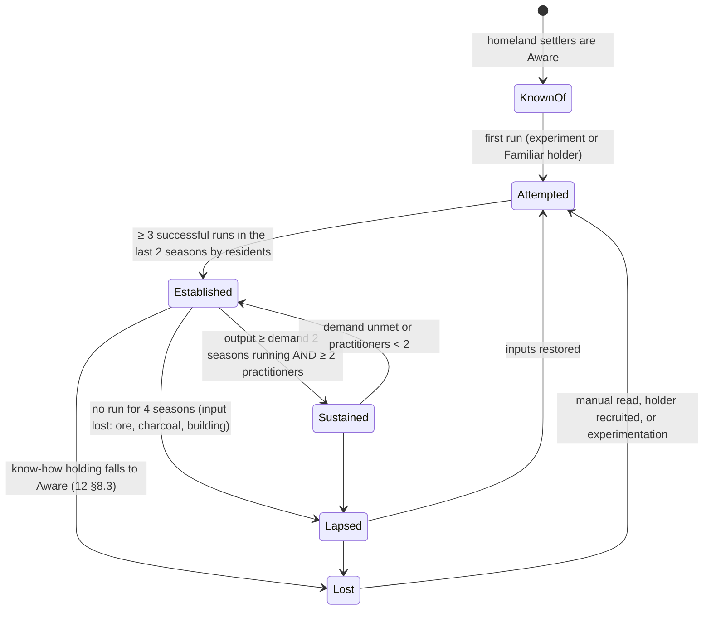
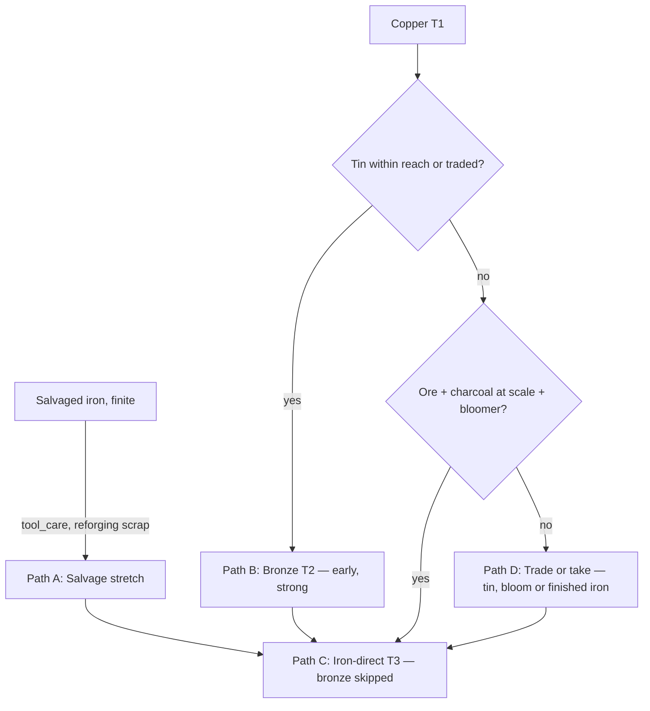

# 14 — Technology & Buildings

> **Status:** Draft v0.1 · **Owner doc for:** tech tiers in detail (the capability graph), buildings, construction, infrastructure, settlement layout, institutions as buildings, settlement metrics, era criteria · **Depends on:** [01-canon](../01-canon.md), [10-world-and-setting](10-world-and-setting.md), [11-survival](11-survival.md), [12-skills-and-professions](12-skills-and-professions.md), [13-crafting-and-minigames](13-crafting-and-minigames.md), [15-economy-and-trade](15-economy-and-trade.md), [17-governance-and-law](17-governance-and-law.md), [18-conflict-and-warfare](18-conflict-and-warfare.md), [21-npc-ai](../tech/21-npc-ai.md)

The settlers already know what a smithy, a water mill and a castle are. What they lack is the ore,
the charcoal, the lime, the hands and the one person who remembers how. This document defines how a
settlement's **capacity** grows — what it can make and build — and how it physically grows on the
land: from a beach camp of lean-tos to a walled town with a keep.

## Table of contents

1. [Design goals and the labor budget](#1-design-goals-and-the-labor-budget)
2. [The capability graph (tech T0–T4)](#2-the-capability-graph-tech-t0t4)
3. [Buildings catalog](#3-buildings-catalog)
4. [Construction](#4-construction)
5. [Condition, decay, repair and fire](#5-condition-decay-repair-and-fire)
6. [Settlement layout and growth](#6-settlement-layout-and-growth)
7. [Infrastructure](#7-infrastructure)
8. [Institutions](#8-institutions)
9. [Settlement metrics](#9-settlement-metrics)
10. [Era criteria (descriptive)](#10-era-criteria-descriptive)
11. [LLM / Jev touchpoints](#11-llm--jev-touchpoints)
12. [Simulation LOD and Interludes](#12-simulation-lod-and-interludes)
13. [Data schemas](#13-data-schemas)
14. [Tuning knobs](#14-tuning-knobs)
15. [Failure modes and exploits](#15-failure-modes-and-exploits)
16. [Validation with headless runs](#16-validation-with-headless-runs)
17. [Milestone map](#17-milestone-map)
18. [Open questions](#open-questions)
19. [Proposed canon additions](#proposed-canon-additions)

---

## 1. Design goals and the labor budget

| # | Goal | Consequence |
|---|------|-------------|
| G1 | **Capacity, not research** (tenet 6, canon §9) | No tech points. A capability is available when its resources, buildings, know-how holders, skill and labor exist *together*, and is lost when any of them disappears. |
| G2 | **Parity** | NPCs build with the same blueprints, stages, labor and skill checks as the player. |
| G3 | **The settlement grows itself** (P1) | Households build their own homes; councils and lords decide communal works; layout emerges from scored decisions, not a player's city plan. |
| G4 | **Scarcity shapes paths** (tenet 5) | Tin, ore, lime, good timber and the people who know how are unevenly spread. Settlements diverge. |
| G5 | **Building is a craft, lightly** (P3) | Construction is hands-on but brief; the deep carpentry/masonry minigames live in [13](13-crafting-and-minigames.md). |

### 1.1 Labor-budget calibration (binding for every number in this doc)

A game year is only 32 days, so building labor is **compressed** relative to history. All
construction numbers below are *on-site labor-hours* (the work at the site), excluding gathering and
hauling, which [13](13-crafting-and-minigames.md) calibrates to roughly **1.0–1.5×** on-site labor
for timber/thatch buildings and **1.5–2.5×** for stone.

| Settlement | Able workers | Labor-hours / year (8 h × 28 days) | Food & fuel share | Free for building & craft | Construction share |
|------------|-------------|-------------------------------------|-------------------|---------------------------|--------------------|
| Landfall, 24 people, Y0 Spring–Autumn (24 days) | ~19 | ~3,700 | ~60 % | ~1,500 | ~600–900 h incl. gathering |
| Hamlet, 60 | ~36 | ~8,000 | ~60 % | ~3,200 | 15–20 % ≈ 1,200–1,600 |
| Village, 150 | ~90 | ~20,000 | ~55 % | ~9,000 | 15–20 % ≈ 3,000–4,000 |
| Town, 300 | ~180 | ~40,000 | ~50 % | ~20,000 | 15 % ≈ 6,000 + feudal labor obligations |

Calibration rules derived from this table:

- **Landfall shelter fits:** a longhouse (180 h) plus a few huts (24 h each) and stores (~80 h)
  houses 24 people before Winter with time left for crafts.
- **A household of 2–3 adults builds its own cottage (80 h on-site) within one season part-time**,
  or two seasons including gathering — faster with a work party.
- **A keep (6,000 h) is about one year of a 300-person town's communal labor**; a modest castle
  (~18,000 h) is two to three years with labor obligations. Castles are Era 3–4 projects, as canon
  intends.
- **Communal construction is capped at 20 % of settlement labor** except in declared emergencies
  (§6.4), so builders cannot starve the settlement.

---

## 2. The capability graph (tech T0–T4)

### 2.1 Capabilities, not technologies

A **capability** is something a settlement can *do* (smelt bloom iron, fire glazed ware, grind grain
by water). It has five kinds of prerequisite, all checked against the settlement's present state:

| Prerequisite | Checked as |
|--------------|-----------|
| **Resource** | Access to a deposit within the settlement's working range ([10](10-world-and-setting.md)) *or* a supply flow (trade, tribute, raid) of at least the capability's minimum per season ([15](15-economy-and-trade.md)) |
| **Building** | A completed building of the required type with condition ≥ 25 |
| **Know-how** | A living resident at ≥ Familiar (to attempt) / ≥ Practiced (to *establish*) ([12 §8](12-skills-and-professions.md#8-know-how)) |
| **Skill** | That resident's governing skill ≥ the know-how's minimum |
| **Labor** | Crew size and labor-hours per run (e.g. a bloomery smelt needs 3 people for a day) |

### 2.2 Settlement capability lifecycle



The **settlement tech tier** (descriptive, for UI, Chronicle and era labels) is the highest tier T
for which **≥ 2/3 of T's signature capabilities are Established**. **T2 is skippable**: if the T3
signature set qualifies, the tier is T3 whether or not bronze was ever made.

**Player affordance — "Why can't we…?"** Every recipe, building and capability in the UI can show
its missing prerequisites ("Bloomery iron: ✔ ore at Redscar hill · ✘ charcoal supply 0.2 of 1.0 t
per season · ✔ Ilse knows bloomery smelting (Practiced) · ✘ no bloomery building"). This is how
the player reads the tech graph: as a list of real, concrete bottlenecks, each of which is a job,
a trade deal, a journey or a person.

### 2.3 The graph

Ids are `capability.<id>`. Know-how ids refer to [12 §8.4](12-skills-and-professions.md#84-catalog).
Bold rows are the tier's **signature capabilities**.

**T0 — Salvage & Stone**

| Capability | Resources | Building | Know-how · skill | Labor | Unlocks |
|-----------|-----------|----------|------------------|-------|---------|
| **fire** | tinder, flint or salvaged steel | campfire | fire_making | 1 | cooking, warmth, light, small charcoal |
| **knapped_tools** | flint/chert deposit | work area | knapping · Masonry 10 | 1 | stone-tier axes, knives, scrapers, points |
| **cordage_baskets** | fiber plants, withies | — | cordage_netting, basketry_wattle | 1 | rope, nets, baskets, snares, wattle |
| **shelter** | wood, reeds, clay | — | shelter_building · Carpentry 5 | 2+ | lean-to, hut, longhouse |
| **preservation** | wood smoke; salt (optional) | drying rack / smokehouse | smoke_drying (salt_curing) | 1 | stored meat & fish ([11](11-survival.md) spoilage) |
| hide_processing | hides | drying rack | hide_curing | 1 | rawhide, cured hides |
| **salvage_iron_care** | the ship's iron tools | — | tool_care | 1 | extends salvaged tool life ([13](13-crafting-and-minigames.md) durability) |

**T1 — Clay & Copper**

| Capability | Resources | Building | Know-how · skill | Labor | Unlocks |
|-----------|-----------|----------|------------------|-------|---------|
| **kiln_pottery** | clay deposit, firewood | pottery & kiln | kiln_firing · Pottery 25 | 2 | storage jars (spoilage ↓), crucibles, bricks (with brick_tile) |
| **timber_framing** | timber | saw pit, workshop | timber_framing, plank_sawing · Carpentry 30 | 3+ | cottages, granaries, halls, bridges |
| **weaving** | flax field or sheep | weaving shed | spinning_weaving (flax_linen) · Textiles 20 | 1 | cloth, sails, clothing |
| **tanning** | hides, oak bark | tannery | bark_tanning · Leatherworking 25 | 2 | leather, bellows, harness |
| **copper** | copper ore (malachite) or native copper; charcoal (small) | copper smelter | copper_smelting · Metallurgy 25 | 2 | copper ingots → copper-tier tools, fittings |
| charcoal_small | wood | charcoal clamp | charcoal_burning · Woodcutting 25 | 1–2 | charcoal for smithy and copper |
| **oven_and_brew** | grain | clay oven / bakehouse; brewhouse | oven_baking; malting_brewing | 1 | bread, ale (food value, mood, trade) |
| ard_plough | draft animals (arrive by ship, [10](10-world-and-setting.md)/[15](15-economy-and-trade.md)) | byre | ard_ploughing · Farming 25 | 1+team | field labor −40 % ([13](13-crafting-and-minigames.md)) |
| lime | limestone or chalk | lime kiln | lime_burning · Masonry 25 | 2 | mortar, limewash, tanning lime |
| boats | timber, planks | jetty | plank_boats · Carpentry 35 | 3 | fishing boats, coastal trips |

**T2 — Bronze** (optional tier)

| Capability | Resources | Building | Know-how · skill | Labor | Unlocks |
|-----------|-----------|----------|------------------|-------|---------|
| **bronze** | copper **and tin** (≥ 1 kg tin per 9 kg copper per season) | foundry | bronze_alloying, mold_casting · Metallurgy 35 | 2 | bronze-tier tools & weapons, fittings, bells, mill gudgeons |
| **mortared_stone** | stone + lime | lime kiln | mortared_masonry · Masonry 40 | 4+ | stone houses, chapels, stone bridges, towers |
| **water_mill** | stream site, timber, millstone-grade stone, 20 kg iron *or* bronze fittings | (the mill itself) | millwrighting · Carpentry 50; Masonry 40 for the stones | 6+ | milling (frees ~8 labor-h per 100 kg grain), later water power |
| glazed_ware | lead/ash glaze inputs | pottery & kiln | glazing · Pottery 45 | 1 | fine ware (trade, status) |
| horses | horses (ship or trade) | stable/byre | horse_breaking · Husbandry 30 | 1 | riding, fast messengers, cavalry ([18](18-conflict-and-warfare.md)) |

**T3 — Iron**

| Capability | Resources | Building | Know-how · skill | Labor | Unlocks |
|-----------|-----------|----------|------------------|-------|---------|
| **charcoal_at_scale** | managed woodland (coppice ≥ 4 ha within 2 km) | ≥ 2 charcoal clamps | coppicing, charcoal_burning · Woodcutting 25 | ≥ 3 colliers | ≥ 1 t charcoal per season |
| **bloomery_iron** | iron ore (hill ore; bog ore where [10](10-world-and-setting.md) places it), charcoal_at_scale | bloomery | bloomery_smelting · Metallurgy 40 | crew 3 per smelt-day | bloom iron |
| **iron_forging** | bloom or scrap iron | forge (smithy + iron anvil) | ironworking, forge_welding · Smithing 40 | 1–2 | iron-tier tools, nails, shares, weapons |
| **heavy_plough** | ~8 kg iron per plough, ox team of 4–8 | byre | heavy_plough · Farming 30 | team | heavy clay soils farmable ([13](13-crafting-and-minigames.md)) |
| mail | iron wire | forge | mail_making · Smithing 50 | 1 | mail armor ([18](18-conflict-and-warfare.md)) |
| windmill | exposed hill site, 30 kg iron, millstones | (the mill) | windmill_building · Carpentry 55 | 8+ | milling away from rivers |
| water_bellows | water mill site | bloomery or forge on a race | water_bellows | — | bloomery output ×1.5, larger blooms |
| **castle_works** | stone + lime at scale | lime kilns, quarry | castle_works · Masonry 60 | ≥ 6,000 h/yr | keeps, curtain walls, gatehouses |

**T4 — Steel**

| Capability | Resources | Building | Know-how · skill | Labor | Unlocks |
|-----------|-----------|----------|------------------|-------|---------|
| **steel_cementation** | iron, charcoal | forge | carburizing · Metallurgy 55 | 2 | steel stock |
| **heat_treatment** | steel | forge with quench trough | quench_temper · Smithing 55 | 1 | steel-tier blades & tools |
| **trip_hammer** | water site, 120 kg iron | advanced forge | trip_hammer, millwrighting | — | iron/steel working labor −40 %; plate |
| **crossbows** | steel (for steel prods) or horn/sinew composite | bowyer's shop + forge | crossbow_making · Bowyery 50 | 1 | crossbows ([18](18-conflict-and-warfare.md)) |
| coat_of_plates | steel plates, leather | forge | plate_armor · Smithing 60 | 2 | coat-of-plates armor |
| trebuchet | timber, iron, rope | siege yard | trebuchet · Carpentry 50 & Tactics 50 | 10+ | counterweight trebuchets |
| crucible_steel | high-temperature kiln, charcoal | foundry | crucible_steel · Metallurgy 75 | 2 | rare top-grade steel |

### 2.4 How tin shapes paths (and how bronze gets skipped)

Tin exists in one or two places on Farstrand (canon §5.1). Iron ore is in the hills, usually far
from the best farmland. Every settlement therefore follows one of four paths — not by choosing a
"tech branch" but because of what its people can reach.



| Path | Typical settlement | Strength | Weakness | Story pressure |
|------|-------------------|----------|----------|----------------|
| **A. Salvage stretch** | Any, in Era 0–1 | No new inputs needed | ~a few dozen kg of iron in total; every broken axe is a crisis | Who gets the last good axe? Theft of tools |
| **B. Bronze** | Near the tin | Bronze tools by Y1–Y2; tin to sell | Dependent on one deposit | Tin becomes a strategic resource others covet — trade, tribute, raids |
| **C. Iron-direct** | Hills, woodland, a bloomer among the settlers | Ore is common; iron is the endgame material | Charcoal is labor-hungry (colliers, coppice) and the bloomery needs a Practiced holder | If the only bloomer dies untaught, the capability is Lost |
| **D. Trade or take** | Far from tin and ore | — | Depends on neighbors, resupply ships (until the Silence) | Dependence breeds resentment; war over resources (vision) |

Design intent: at least one rival settlement should sit on a resource the player's settlement lacks
([10](10-world-and-setting.md) owns placement; this doc requests it).

---

## 3. Buildings catalog

### 3.1 Conventions

- **Materials** use item ids defined in [13](13-crafting-and-minigames.md); suggested unit masses:
  `log` 60 kg (trimmed trunk) · `pole` 8 kg · `plank` 12 kg · `thatch` 5 kg bundle · `daub` 25 kg ·
  `clay` 25 kg · `stone` 25 kg rubble · `ashlar` 60 kg block · `lime` 20 kg · `brick` per piece ·
  `shingle` / `slate` bundle of 25 · `nails`, `iron` in kg.
- **Labor** = on-site labor-hours (§1.1).
- **Lead skill / know-how**: the stage lead needs this skill and know-how ≥ Familiar; helpers need
  only Athletics (hauling) or skill ≥ 10 for assist bonuses ([12 §6.6](12-skills-and-professions.md#66-shared-tasks)).
- **Maint.** = materials per season to hold condition (labor ≈ 2 % of build labor per season).
- **Fire class**: **V** very high (open fire + flammable roof) · **H** high (thatch, hearth) ·
  **M** medium (shingle, or thatch without hearth) · **L** low (stone/slate/tile).
- **Comfort** (dwellings, 0–100) feeds the Comfort need ([21](../tech/21-npc-ai.md)); **Status**
  (0–100) feeds household status and settlement Grandeur (§9).

### 3.2 Catalog

**T0 — camp and first shelter**

| Building (`building.`) | Footprint | Materials | Labor h | Lead skill · know-how | Function / capacity | Maint. | Fire | Comfort · Status |
|----------|-----------|-----------|---------|-----------------------|--------------------|--------|------|------------------|
| campfire | Ø 1.5 m | 6 stone | 0.5 | — · fire_making | cooking, warmth (r 4 m), light | fuel | V (ignition source) | +5 nearby · 0 |
| sailcloth_shelter | 3×3 | 1 sailcloth, 4 pole, rope | 1 | — | sleeps 3 (salvage) | −10 cond./season | M | 15 · 0 |
| lean_to | 2×3 | 6 pole, 8 thatch (or bark/brush) | 2 | Carpentry 0 · shelter_building | sleeps 2 | 2 thatch | H | 10 · 0 |
| drying_rack | 2×1 | 6 pole, rope | 1.5 | — | dries 20 kg meat/fish/hides per batch | 1 pole | L | — |
| work_area | 3×3 | 1 log, 4 pole | 2 | — | "makeshift" workspace (−5, [12 §6.2](12-skills-and-professions.md#62-effective-skill)) | — | L | — |
| storage_pit | Ø 1.5 m | 4 stone, 2 pole | 4 | — | 400 kg dry goods; animal-proof; damp | — | — | — |
| raised_cache | 2×2 | 4 log, 12 pole, 10 thatch | 8 | Carpentry 5 | 600 kg; vermin-resistant | 1 thatch | H | — |
| latrine | 1×3 | 2 pole | 3 | — | 20 users; must be ≥ 30 m from water | re-dig / 2 seasons | — | — |
| hut | 4×5 | 4 log, 30 pole, 40 daub, 30 thatch | 24 | Carpentry 10 · shelter_building | household of 4, hearth | 3 thatch, 3 daub | H | 30 · 5 |
| longhouse | 6×18 | 20 log, 120 pole, 200 daub, 150 thatch | 180 | Carpentry 25 · shelter_building | sleeps 20; central hearth; meeting place | 10 thatch, 8 daub | H | 30 (crowded) · 15 |
| shrine | 2×2 | 1 log or 10 stone | 8 | — | faith focus ([16](16-social-systems.md)) | — | L | — · 5 |
| fence / pen (per 10 m) | line | 15 pole | 3 | Carpentry 5 · basketry_wattle | holds goats/sheep; keeps deer out | 2 pole | M | — |
| stake_fence (per 10 m) | line | 20 pole | 4 | — | defense 5; slows attackers | 2 pole | M | — |

**T1 — hamlet**

| Building | Footprint | Materials | Labor h | Lead skill · know-how | Function / capacity | Maint. | Fire | Comfort · Status |
|----------|-----------|-----------|---------|-----------------------|--------------------|--------|------|------------------|
| cottage | 5×8 | 12 log, 40 pole, 100 daub, 60 thatch, 1 nails | 80 | Carpentry 30 · timber_framing | household of 6; hearth; 3 module sockets | 4 thatch, 4 daub | H | 45 · 10 |
| granary | 4×4 on staddles | 8 log, 30 plank, 30 thatch, 8 stone | 50 | Carpentry 30 · plank_sawing | 6 t grain (~7,500 person-days); spoilage ×0.5 | 3 thatch | H | — · 5 |
| root_cellar | 3×4 dug | 4 log, 12 plank, 10 stone | 30 | Carpentry 15 | 3 t produce; cool (spoilage ×0.6) | 1 plank | L | — |
| smokehouse | 3×3 | 4 log, 20 pole, 30 daub, 15 thatch | 20 | Carpentry 15 · smoke_drying | 200 kg per 2-day batch | 2 thatch | V | — |
| workshop_shed | 5×6 | 8 log, 30 pole, 40 thatch | 40 | Carpentry 20 | proper workspace for 2 (carpentry, bowyery, leather, textiles) | 3 thatch | H | — · 5 |
| saw_pit | 2×6 | 2 log, 4 plank | 15 | Carpentry 20 · plank_sawing | plank production, 2 sawyers | — | L | — |
| tannery | 8×8 | 6 log, 40 pole, 30 thatch (6 pits) | 50 | Leatherworking 20 · bark_tanning | 2 workers, 20 hides/season; **nuisance r 60 m**; pollutes downstream | 3 thatch | M | −10 to neighbors |
| pottery_kiln | 5×6 | 30 clay, 40 stone, 20 pole, 20 thatch | 50 | Pottery 25 · kiln_firing | 60 vessels or 300 bricks per firing day | 5 clay | V | — |
| clay_oven | 2×2 | 20 clay, 15 stone | 12 | Cooking 20 · oven_baking | bakes for 30/day | 2 clay | M | — |
| bakehouse | 5×6 | 2 ovens + 8 log, 20 pole, 40 daub, 30 thatch | 50 | Carpentry 20 · oven_baking | bakes for 120/day | 3 thatch | V | — · 5 |
| brewhouse | 5×7 | 8 log, 30 pole, 50 daub, 40 thatch, 4 barrels, 1 vat | 60 | Carpentry 25 · malting_brewing | 200 L ale per 2 days | 3 thatch | V | — · 5 |
| weaving_shed | 5×6 | as workshop_shed | 40 | Carpentry 20 | 3 looms | 3 thatch | H | — |
| smithy | 5×6 | 6 log, 30 pole, 40 daub, 30 thatch, 15 stone, 2 hide (bellows) | 60 | Carpentry 20 + Masonry 15 | 2 smiths; copper & iron work. **Stone anvil** (makeshift, −5) until an iron anvil (60 kg iron) is made | 3 thatch | V | — · 10 |
| copper_smelter | 3×3 | 20 clay, 20 stone, 2 hide | 25 | Metallurgy 25 · copper_smelting | 1 smelt/day, crew 2 | 3 clay | V | — |
| charcoal_clamp | Ø 6 m site | (wood per burn: 13) | 6 prep | Woodcutting 25 · charcoal_burning | 1 burn per 3 tended days | — | V (wildfire risk) | nuisance r 40 m |
| lime_kiln | 4×4 | 80 stone, 10 clay | 50 | Masonry 25 · lime_burning | 400 kg quicklime per 2-day burn | 4 stone | V | nuisance r 30 m |
| well | Ø 1.5 m, 5 m deep | 12 plank, 2 log, rope, bucket | 30 | Carpentry 15 (Mining assists) | serves 60; contamination per §9 | 1 plank | — | — |
| byre_barn | 6×12 | 14 log, 60 pole, 40 daub, 80 thatch | 90 | Carpentry 25 | 10 cattle or 30 sheep + 4 t hay | 5 thatch | H | — |
| jetty | 3×15 | 12 log, 20 plank | 50 | Carpentry 30 | 2 boats; landing for trade | 2 plank | L | — |
| palisade (per 10 m, 3 m) | line | 25 log | 16 | Carpentry 20 | defense 20; blocks movement | 2 log (rot) | H | — · 2 |
| ditch_and_bank (per 10 m) | line | earth | 20 | — | defense 10; stacks with palisade | 1 h | — | — |
| timber_gate | 4 m | 6 log, 10 plank, 2 iron | 20 | Carpentry 25 | controlled entry; defense 30 | 1 plank | H | — |
| watchtower | 3×3, 8 m | 16 log, 20 plank | 60 | Carpentry 30 | sight +150 m; archer platform (6) | 2 plank | H | — · 3 |

**T2 — village**

| Building | Footprint | Materials | Labor h | Lead skill · know-how | Function / capacity | Maint. | Fire | Comfort · Status |
|----------|-----------|-----------|---------|-----------------------|--------------------|--------|------|------------------|
| tavern | 6×12 | 24 log, 40 plank, 120 daub, 100 thatch, 2 nails | 220 | Carpentry 40 · timber_framing | seats 30, 4 beds, cellar 2,000 L | 6 thatch | H | 55 · 15 |
| market_square | 30×30 + cross | 10 ashlar (cross); per stall: 4 pole, 4 plank, 1 cloth | 40 + 6/stall | Masonry 30 | market institution (§8) | 1 plank/stall | L | — · 15 |
| shopfront (module) | on cottage | 6 plank, 1 nails, shutters | 12 | Carpentry 30 | shop institution ([15](15-economy-and-trade.md)) | — | — | — · +5 |
| warehouse | 6×10 | 16 log, 60 plank, 60 shingle, 2 nails | 150 | Carpentry 40 | 20 t goods; lockable | 2 shingle | M | — · 5 |
| hall | 8×20 | 50 log, 100 plank, 250 daub, 200 thatch (or 120 shingle), 4 nails | 600 | Carpentry 45 · timber_framing | seats 80; council, court; leader's household | 10 thatch | H (M shingled) | 60 · 40 |
| chapel (timber) | 6×12 | 30 log, 60 plank, 150 daub, 80 shingle | 300 | Carpentry 40 | congregation 80 | 3 shingle | M | — · 30 |
| stone_cottage | 6×9 | 160 stone, 25 lime, 8 log, 30 plank, 60 shingle | 250 | Masonry 40 · mortared_masonry | household of 8; chimney | 1 shingle | L | 65 · 25 |
| stone_well | Ø 2 m | 60 stone, 4 plank, rope, windlass | 60 | Masonry 25 | serves 100; contamination resistance ×0.5 | — | — | — · 3 |
| foundry | 5×6 | 200 brick, 30 clay, 20 stone + shed | 60 | Metallurgy 35 · bronze_alloying | 1 casting pour/day | 5 clay | V | — |
| water_mill | 6×8 + race | 30 log, 80 plank, 40 shingle, 20 iron/bronze, 2 millstones (80 h each) | 700 | Carpentry 50 · millwrighting | grinds 400 kg/day; stream flow ≥ "medium" ([10](10-world-and-setting.md)) | 1 plank, 0.5 iron | M | — · 20 |
| watch_house | 5×8 | as cottage | 80 | Carpentry 30 | 8 guards; watch institution | 4 thatch | H | 35 · 10 |
| stocks | 2×2 | 2 log, 4 plank, 1 iron | 6 | — | punishment ([17](17-governance-and-law.md)) | — | — | — |

**T3 — town & lordship**

| Building | Footprint | Materials | Labor h | Lead skill · know-how | Function / capacity | Maint. | Fire | Comfort · Status |
|----------|-----------|-----------|---------|-----------------------|--------------------|--------|------|------------------|
| bloomery | 5×6 + furnace | 300 clay (or 200 brick), 30 stone, 4 hide bellows | 70 | Metallurgy 40 · bloomery_smelting | 1 smelt/day, crew 3 (yields: 13) | 6 clay (reline) | V | nuisance r 30 m |
| forge (smithy upgrade) | upgrade | +40 stone, 4 lime, iron anvil (60 kg), quench trough | +60 | Masonry 30 + Smithing 40 | well-equipped (+3), 3 smiths, forge welding | — | V | — · 15 |
| windmill | 6×6 | 40 log, 120 plank, 2 millstones, 30 iron | 900 | Carpentry 55 · windmill_building | 300 kg/day (wind ±50 %); exposed hill | 2 plank, 1 iron | M | — · 20 |
| stone_chapel | 7×15 | 300 stone, 60 ashlar, 40 lime, 20 log, 40 slate | 1,200 | Masonry 45 · mortared_masonry | congregation 150 | 1 lime | L | — · 50 |
| manor_house | 10×16 | 600 stone, 80 ashlar, 80 lime, 40 log, 120 plank, 150 slate | 2,000 | Masonry 50 · mortared_masonry | lord's household + hall of 60; court venue | 2 slate, 1 lime | L | 85 · 70 |
| guildhall | 8×12 | timber-framed, shingled | 400 | Carpentry 45 | guild institution ([12 §13](12-skills-and-professions.md#13-guilds-era-3-sketch)) | 3 shingle | M | — · 25 |
| school | 5×8 | as cottage | 100 | Carpentry 30 | Letters lessons for 8; manual copying | 4 thatch | H | — · 15 |
| mint | 5×6 stone | 160 stone, 25 lime, 10 ashlar, 20 iron (door) | 300 | Masonry 40 | mint institution ([15](15-economy-and-trade.md)) | — | L | — · 20 |
| stone_wall (per 10 m; 5 m × 1.8 m) | line | 400 stone, 60 lime, 20 ashlar | 300 | Masonry 50 · mortared_masonry (castle_works above 5 m) | defense 100 | 0.5 lime | L | — · 5 |
| wall_tower (10 m) | 6×6 | 900 stone, 120 lime, 60 ashlar, 10 log, 20 plank | 900 | Masonry 55 · castle_works | defense 200; 10 archers | 1 lime | L | — · 15 |
| gatehouse (stone) | 8×10 | 1,600 stone, 200 lime, 120 ashlar, 20 log, 40 plank, 60 iron | 2,500 | Masonry 60 · castle_works (+ Smithing 40 for portcullis) | defense 400 | 2 lime | L | — · 30 |
| keep | 14×14, 3 storeys | 4,000 stone, 600 lime, 300 ashlar, 60 log, 200 plank, 100 iron, 200 slate | 6,000 | Masonry 60 · castle_works | garrison 40; lord's household; last refuge; defense 1,000 | 4 lime | L | 70 · 90 |
| siege_yard | 10×10 | 10 log, 20 plank | 40 | Carpentry 40 | builds rams, mantlets, engines ([18](18-conflict-and-warfare.md)) | — | M | — |

**T4 — steel & castles**

| Building | Footprint | Materials | Labor h | Lead skill · know-how | Function / capacity | Maint. | Fire | Comfort · Status |
|----------|-----------|-----------|---------|-----------------------|--------------------|--------|------|------------------|
| advanced_forge | 6×10 + race | 20 log, 60 plank, 200 stone, 20 lime, 120 iron | 800 | Carpentry 55 + Smithing 50 · trip_hammer | water hammer & bellows; steel output ×2; plate | 1 iron | V | — · 20 |
| castle | composite | keep + ~20 wall sections + 4 towers + gatehouse + hall + ditch | ≈ 18,000 | Masonry 60 · castle_works | seat of a realm; defense per parts | per parts | L | — · 100 |

Castle "blueprint" is a **composite**: the lord's master plan places its parts; each part is an
ordinary construction site, so a half-built castle is a real, defensible thing.

### 3.3 Modules (sockets on blueprints)

| Module | Fits | Labor h | Effect |
|--------|------|---------|--------|
| loft | hut, cottage, stone_cottage | 12 | +2 beds or +1 t storage |
| annex (lean-to room) | cottage, stone_cottage | 20 | +12 m² floor; workshop room (proper workspace for 1) |
| chimney (stone/clay) | any dwelling with hearth | 16 | ignition ×0.5; comfort +5 |
| shopfront | cottage, stone_cottage, warehouse | 12 | shop institution |
| porch / bench | dwellings, tavern | 4 | comfort +2; social spot |
| yard fence | any | per 10 m | pen/garden plot attached |
| shingle / slate roof | any thatched | roof stage redo | fire class −1 step; decay ↓; status +5/+10 |

---

## 4. Construction

### 4.1 Decision: freeform whole-blueprint placement with modules

Buildings are placed as **whole blueprints** at any position, freely rotated (15° snap toggle), with
**module sockets** for variety. Linear works (fences, palisades, walls, ditches, roads) are drawn as
**splines** with post snapping. There is **no piece-by-piece building** in v1.

Rationale: NPCs must build the same things the player does, which is tractable with whole blueprints
and intractable with free-form piece assembly; organic medieval layouts look wrong on a grid; and
modules give enough expression (a loft, a shopfront, a chimney) for a home to feel like *yours*.
Piece-building is listed as an open question, not a v1 goal.

### 4.2 Player experience

1. **Build menu** lists every blueprint the player is *Aware* of. Unbuildable ones show the
   "Why can't we…?" panel (§2.2): missing know-how, skill, materials, land rights.
2. **Placement:** a ghost footprint with overlays — slope, ground (rock, soil, marsh), flood risk,
   plot boundaries and claims ([15](15-economy-and-trade.md)), nuisance radii (tannery smell,
   smithy fire), water-contamination radii (latrines vs wells), snap-to-road edge and neighbor
   alignment. Invalid placements show the reason.
3. **Commit** creates a **construction site** (stage *Planned*): a staked-out footprint other people
   can see — and gossip about.
4. **Work:** the player chops, hauls and builds like anyone else. Stage work is either **hold-to-work**
   (resolved by `Resolve()`, [12 §6](12-skills-and-professions.md#6-skill-checks--the-shared-resolution-function))
   or a short **rhythm/placement minigame** owned by [13](13-crafting-and-minigames.md) (pegging a
   joint, laying a course) that supplies the minigame term. Either way the stage's quality is the
   labor-weighted PS of everyone who worked it.
5. **Help:** ask kin and friends (favor), hire builders (Era 2+, [15](15-economy-and-trade.md)), or
   host a **raising** (§4.5).

### 4.3 Foundations and terrain

| Foundation | Max slope | Extra | Notes |
|-----------|-----------|-------|-------|
| Earthfast posts | 8° | — | cheap; posts rot (§5.1) |
| Stone sill | 15° | +20 stone, +6 h per 40 m² | slows rot; needs Masonry 15 |
| Terraced | 25° | cut/fill × 1.5 h per m³; Masonry 30 | hillside towns, castles |
| Piles | marsh/wet ground | +50 % foundation labor; Carpentry 30 | jetties, wetland edges |

Site prep levels the footprint automatically: labor = 1.5 h per m³ of cut/fill (computed from the
heightmap); felled trees on the footprint yield logs. Building in a mapped floodplain is allowed with
a warning; floods damage condition ([10](10-world-and-setting.md) owns flood events).

### 4.4 Stages

| Stage | Share of labor | Lead skill | Materials needed on site | Unlocks on completion |
|-------|----------------|-----------|--------------------------|-----------------------|
| 0 **Planned** | 0 | — | — | Claim validated; cancel is free |
| 1 **Site prep** | 10 % (+ earthwork) | Athletics / Woodcutting | — | Footprint cleared and level |
| 2 **Foundation** | 15 % | Carpentry or Masonry | posts / stone | — |
| 3 **Frame & walls** | 40 % | Carpentry or Masonry | logs, poles, daub, stone, lime | Windbreak (partial shelter) |
| 4 **Roof** | 25 % | Carpentry (Masonry for slate) | thatch / shingle / slate | **Usable as shelter** (beds count, Warmth) |
| 5 **Finish** | 10 % | Carpentry, Masonry, the building's craft | doors, hearth, fittings, nails | **Function enabled** (workshop, store, institution) |
| **Complete** | — | — | — | Condition = 60 + 0.4 × quality PS |

**Material delivery.** When a stage becomes active, its materials are **reserved** at stockpiles
(so two sites cannot count the same logs) and **haul tasks** are generated. A stage may begin when
≥ 50 % of its materials are on site; progress is capped by the delivered fraction. Reservations
expire after 4 days without hauling (deadlock guard). Carrying capacity comes from
[12 §3.1](12-skills-and-professions.md#31-what-each-attribute-does); a sledge ×3 (on flat ground or
snow), handcart ×4 (track or better), ox cart ×12 (road). Delivered materials sit in a visible site
stockpile — a theft target.

**Quality.** Each stage's quality is the labor-weighted mean PS of its workers; the building's
quality Q is the labor-weighted mean of stages. Q scales decay (§5.1) and comfort (±5). A critical
failure by a stage lead wastes 10 % of that stage's materials; on stone works ≥ 5 m high it also
rolls a partial collapse (injury chance, [11](11-survival.md)).

### 4.5 Work parties and crews

```
maxWorkers(stage)  = ceil(footprint_m² / 10) + 2            // cottage 6, longhouse 13, wall section 8
crowdEfficiency(n) = max(0.7, 1 − 0.03 × (n − 1))
stageRate          = Σ WorkRate_i × crowdEfficiency(n) × (1.10 if Foreman-specialized lead)
```

**Raisings** (a communal work day — the barn-raising): the host invites people and provides
**1 meal + 1 L ale per participant**. Each invitee attends with probability

```
P(attend) = clamp(0.2 + 0.4·Opinion(host)/100 + 0.3·reciprocityOwed + 0.2·Sociability/100
                  − 0.4·[busy with obligation], 0, 0.95)
```

Attendance satisfies the Social need, raises Opinion of the host and Familiarity among participants
(events to [16](16-social-systems.md)), and records **labor reciprocity** (hours given/received
between households), which [16](16-social-systems.md) treats as owed favors. A host with Leadership
≥ 40 can run a raising of up to 20; the player calls one through dialogue or the build menu.

**Professional crews** (Era 2+): carpenters and masons take **commissions** — client, blueprint,
price, deadline ([15](15-economy-and-trade.md) prices them). Large works (walls, keeps) are run by a
**master of works** (Masonry Expert, ideally *Master of Works* capstone) with crews fed by boon days
and feudal labor obligations ([17](17-governance-and-law.md)).

### 4.6 How NPCs decide to build

**Their own homes (household projects).** A household starts a home project when

```
homeNeed = 1.0·[no dwelling of its own]                          // e.g. still in the longhouse
         + 0.6·max(0, 1 − floorPerPerson/6 m²)                    // crowding
         + 0.4·max(0, (50 − condition)/50)                        // dilapidation
         + 0.3·max(0, statusAspiration − dwellingStatus)/50       // wants a better house
homeNeed ≥ 0.5 and household is not food-insecure and it is not Winter
```

It then picks the **best blueprint it can lead** (a member or hired builder has the skill and
know-how) within the materials it can gather or buy, scores plots (§6.3), requests a claim
([15](15-economy-and-trade.md)), and schedules the work in household time ([21](../tech/21-npc-ai.md)),
inviting kin and friends or hosting a raising. Newly married couples form a household and get a
home project immediately (16 → household formation event).

**Communal works (the Works Agenda).** Daily, the sim scores candidate projects from metric deficits
(§9); the council or lord **decides** which to adopt ([17](17-governance-and-law.md) owns the
decision rule; the LLM voices the debate):

```
priority(project) = severity(deficit) × benefit(project) / (labor_h + 0.2 × material_haul_h)
                    × urgency (1.5 before Winter for shelter/storage; 2.0 under threat for defense)
```

| Deficit (§9) | Candidate projects |
|--------------|-------------------|
| HousingRatio < 1.0 approaching Winter | longhouse, huts (emergency) |
| StorageCover < 1.0 | granary, root cellar, smokehouse, warehouse |
| WaterAccess < 80 % or contaminated source | well, stone well |
| Sanitation < 50 | latrines; relocate tannery/midden |
| DefenseRating < threat estimate ([18](18-conflict-and-warfare.md)) | ditch, palisade, gate, tower, wall |
| Milling labor > 15 % of food labor | water mill / windmill |
| Exchange volume high, no market | market square |
| Faith demand ([16](16-social-systems.md)) | shrine → chapel |
| Leader's legitimacy/status needs ([17](17-governance-and-law.md)) | hall, manor, keep |
| Bottlenecked capability (§2) | the missing building (bloomery, kiln…) |

Adopted projects become Task Board tasks (Era 0–1) or boon days and obligation work (Era 1+;
[12 §11.4](12-skills-and-professions.md#114-labor-allocation-by-era)), within the 20 % labor cap
unless an **emergency** is declared (attack threat, post-fire rebuild, no shelter at Winter).

### 4.7 Upgrades and demolition

- **Upgrade in place** keeps the site and reuses stages: hut → cottage (redo frame & walls and roof);
  thatch → shingle → slate (roof stage only); timber hall → stone hall (rebuild walls); smithy →
  forge; add modules any time.
- **Demolition** by the owner or sponsor returns timber 50 %, stone/ashlar 60 %, brick 40 %, iron
  80 %, thatch and daub 0 %, over 30 % of the original labor. Anyone else demolishing is vandalism
  or theft ([16](16-social-systems.md), [17](17-governance-and-law.md)). Pulling down thatch with
  fire hooks to make a firebreak is a separate 20-minute emergency action (§5.3).

---

## 5. Condition, decay, repair and fire

### 5.1 Condition and decay

**Condition** is 0–100 per building. Each season it loses the sum of its component rates, scaled by
build quality:

| Component | Loss / season |
|-----------|---------------|
| Thatch roof / shingle / slate or tile | 5 / 3 / 1 |
| Daub walls / timber frame / stone | 3 / 1.5 / 0.5 |
| Earthfast posts / stone sill | 2 / 0.5 |
| Storm, flood, siege damage | event-driven ([10](10-world-and-setting.md), [18](18-conflict-and-warfare.md)) |

`seasonalLoss = Σ component × (1.3 − 0.6 × Q/100)` — a cottage at Q 50 loses ~10 per season unmaintained.

| Condition | State | Effects |
|-----------|-------|---------|
| 70–100 | Sound | — |
| 50–69 | Worn | comfort −10; spoilage ×1.2 in stores |
| 25–49 | Dilapidated | comfort −25; spoilage ×1.5; ignition ×1.5; capability prerequisites fail below 25 |
| 1–24 | Unsafe | 1 %/day collapse chance during storms (injury rolls) |
| 0 | Ruin | unusable; salvage 30 % |

**Maintenance** (the per-season materials in §3 plus ~2 % of build labor) holds condition. **Repair**
restores lost condition: labor = 0.4 × build labor × (lost/100); materials proportional to the
damaged components. Responsibility: owner household, the council's maintenance list for communal
buildings, or the lord ([17](17-governance-and-law.md)). Abandoned buildings decay to ruin and become
a salvage temptation.

### 5.2 Ignition

| Fire class | Ignitions per building per day |
|-----------|-------------------------------|
| V (smithy, kiln, bakehouse, brewhouse, smokehouse, bloomery) | 0.002 |
| H (thatched dwelling with hearth, thatched workshops) | 0.0003 |
| M | 0.0002 |
| L | 0.00005 |

Multipliers: Winter ×1.5 (hearths stoked); drought ×2 ([10](10-world-and-setting.md) weather);
occupant drunk ×2; chimney ×0.5; dilapidated ×1.5; lightning and wildfire from charcoal clamps are
separate events; **arson** is a deliberate act ([16](16-social-systems.md), [18](18-conflict-and-warfare.md)).
An ignition is **contained** immediately with P = 0.7 if the building is occupied and someone is
awake, else 0.3. A village of 50 thatched homes and 5 V-class workshops sees ~0.8 ignitions a year
and a **spreading fire roughly every 3 years** — memorable, not routine.

### 5.3 Spread and firefighting (LOD0/1 model)

Every 5 game-minutes, each burning building tries to ignite each building within 15 m:

```
P_spread = k_roof(target) × wind × exp(−d / 5 m) × (1 − suppression(target))
k_roof: thatch 0.25 · shingle 0.10 · slate/tile/stone 0.02
wind:   downwind 1 + windSpeed/5 (m/s) · crosswind 1 · upwind 0.5
```

| Material | Burn time to collapse | Result |
|----------|----------------------|--------|
| Thatch/timber | 90 game-min | ruin; contents lost |
| Shingled timber | 150 game-min | ruin |
| Stone (roof/interior burns) | 240 game-min | structure survives at condition −60 |

**Suppression:** a bucket chain needs water within 60 m; each 6 people adds 0.15 (max 0.6). A
building whose suppression stays ≥ 0.45 for 20 minutes before it is half-burnt is saved. **Firebreak:**
4 people with hooks pull a thatched roof in 20 minutes (its k_roof → 0.02). NPC responses (raise
the alarm, help, flee, loot) are utility choices in [21](../tech/21-npc-ai.md) driven by Courage,
Safety and opinion of the owner. A **minimum spacing of 4 m** between building footprints is enforced
at placement; deliberately dense towns burn.

---

## 6. Settlement layout and growth

### 6.1 Founding site — the first political decision

After landing, the camp sits on the beach. Choosing the **permanent site** is a council-level
decision in Y0 Spring–Summer. The sim scores candidate sites within 3 km of the landing:

```
siteScore = 0.25·freshWater + 0.20·arable(1 km) + 0.15·timber(500 m) + 0.15·defensibility
          + 0.10·landing/harbor + 0.10·stone/clay nearby − 0.15·floodRisk − 0.10·exposure
```

The top three become proposals; the Charter heir and the de-facto leaders may back different ones
([17](17-governance-and-law.md) decides; the LLM voices the argument). The player can scout and
propose a site. Splinter settlements (canon §5.4) re-run the same scoring.

### 6.2 Organic growth: the envelope

```
coreRadius R = 60 + 8 × √population  (m)      // 24 → 99 m · 150 → 158 m · 500 → 239 m
```

Inside R: dwellings, workshops, stores, communal buildings. Outside: infields, pasture, woodland,
quarries, charcoal clamps. **Nuisance trades** (tannery 60 m, lime kiln 30 m, bloomery 30 m,
charcoal 40 m) must sit with their nuisance radius clear of dwellings or accept the comfort and
opinion penalties — and are scored to go downstream/downwind. Culture sets the default form:
Varrow and Osmeri **nucleated**; Brannoch **dispersed steadings** (R × 1.5, lower density).

Who places what:

| Decider | Places | Constraint |
|---------|--------|-----------|
| Households | Their dwellings, yards, private workshops | On land they hold or are granted ([15](15-economy-and-trade.md)) |
| Council / headman | Commons, wells, granary, market, palisade, roads | Commons and reserved land |
| Lord (Era 3) | Hall/manor, keep, walls, mill, **planned extensions** (a street of burgage plots 6–10 m wide) | Demesne and lord's grants |
| Guilds / merchants | Guildhall, warehouses, shops | Purchased or rented plots |

**Satellite hamlets** form when a household's fields lie > 1.5 km from the core: it may found a
steading there, which grows into a hamlet with its own envelope (canon Era 3 "satellite hamlets").

### 6.3 Plot scoring (households and placement validation)

```
plotScore = 0.25·access (to center/road) + 0.20·water (≤ 150 m) + 0.20·work (fields/workplace)
          + 0.15·kin proximity + 0.10·terrain (slope, drainage) + 0.10·inside defenses
          − 0.30·nuisance exposure − 0.20·flood risk + Gumbel(0.05)
```

Hard constraints: inside the envelope (or a valid steading), not on roads/commons/reserved land,
≥ 4 m from other footprints, no overlap with existing claims, slope within foundation limits.

### 6.4 Plots and claims — the interface with 15

[15](15-economy-and-trade.md) owns property, ownership, rent and land transfer. This doc owns the
**geometry** and **validation**:

```csharp
public enum PlotUse { Dwelling, Workshop, Field, Pasture, Woodland, Commons, Reserved, Road }
public sealed record Plot(long Id, long SettlementId, Polygon2 Shape, PlotUse Use, long? ClaimId);

// 14 validates geometry; 15 decides rights.
ClaimRequestResult RequestClaim(long personOrHousehold, Polygon2 shape, PlotUse use);
```

Plots are drawn automatically around placed buildings (yard depth 6–20 m by culture) or explicitly
with the plot tool. Fields are polygons drawn by the farmer; their soil model is
[13](13-crafting-and-minigames.md)'s.

---

## 7. Infrastructure

### 7.1 Paths and roads

**Desire paths emerge.** A traffic grid (4 m cells) counts passes by LOD0/LOD1 movers (LOD2/3 add
path-graph flow). Counts decay 10 % per season. A cell with ≥ 200 passes per season becomes a
**path**. Paths can be upgraded deliberately:

| Grade | Speed | Carts | Build per 10 m | Requires |
|-------|-------|-------|----------------|----------|
| Wild ground | ×1.0 | no | — | — |
| Path (emergent) | ×1.1 | handcart in dry weather | — | traffic |
| Track | ×1.2 | carts, dry weather | 3 h | — |
| Road (gravelled, ditched) | ×1.3 | all weather | 10 h + 20 stone | Masonry 15 |
| Paved street | ×1.35 | all weather; sanitation + | 30 h + 40 stone | Masonry 30, T3 |

Unpaved surfaces in rain: speed −20 %, carts may stick. Road quality between settlements feeds
transport cost in [15](15-economy-and-trade.md).

### 7.2 Bridges and crossings

| Crossing | Span | Build | Requires | Notes |
|----------|------|-------|----------|-------|
| Ford | — | — | — | impassable in flood |
| Stepping stones | ≤ 8 m | 4 h, 20 stone | — | foot only |
| Log bridge | ≤ 6 m | 6 h, 2 log | Carpentry 10 | foot, handcart |
| Timber trestle | ≤ 40 m | per 10 m: 60 h, 12 log, 30 plank | Carpentry 35 | carts; decays like timber |
| Stone arch | per 10 m span | 500 h, 300 stone, 40 lime, 40 ashlar | Masonry 50 · mortared_masonry | permanent; toll point |

### 7.3 Water works

| Work | Build | Effect |
|------|-------|--------|
| Ditch (per 10 m) | 8 h | field drainage / irrigation ([13](13-crafting-and-minigames.md) soil moisture) |
| Mill race / leat (per 10 m) | 15 h | required for water mill, water bellows, trip hammer |
| Weir / mill dam | 120 h, 40 log, 200 stone | raises head; floods upstream land |
| Water meadow (per ha, T2) | 150 h | hay yield bonus (13) |
| Wetland drainage (per ha, T2–T3) | 400 h | converts Wetland → Meadow ([10](10-world-and-setting.md) biome change); removes bog-ore and reed sources |
| Fish weir | 30 h, 30 pole, wattle | fixed fishing ([13](13-crafting-and-minigames.md)) |

### 7.4 Docks and waystations

| Work | Tier | Build | Effect |
|------|------|-------|--------|
| Beach landing | T0 | — | boats beached; ships anchor offshore |
| Jetty | T1 | §3 | fishing boats, small trade |
| Wharf (stone quay, per 10 m) | T3 | 300 h, 300 stone, 30 lime | ships berth; cargo ×4 faster; harbor institution |
| Harbor crane | T3 | 200 h, Carpentry 50 (Wright) | heavy cargo, stone imports |
| Wayside shelter | T1 | 6 h | rest point between settlements (Energy/Warmth, [11](11-survival.md)) |
| Waystation inn | T2 | tavern blueprint on a road | lodging; rumor exchange between settlements |

### 7.5 Defenses (summary for 18)

Enclosures are evaluated as a ring: **DefenseRating = the weakest segment's rating along the
perimeter** (gates and gaps count), plus tower and garrison bonuses. Segment ratings: ditch 10,
stake fence 5, palisade 20 (30 with ditch), stone wall 100, gate 30 (timber) / 400 (gatehouse).
Ratings scale with condition/100. [18](18-conflict-and-warfare.md) owns how ratings meet attackers.

---

## 8. Institutions

Canon §7: systems unlock through **institutions**, not era labels. An institution is a building
(or module) plus a human or legal condition. Remove either and the institution lapses.

| Institution | Building(s) | Additional condition | Unlocks (owner) | First milestone |
|-------------|-------------|---------------------|-----------------|-----------------|
| Meeting place | campfire → longhouse → hall | — | Task Board, council meetings ([12](12-skills-and-professions.md), [17](17-governance-and-law.md)) | M2 |
| Communal store | raised cache / granary / warehouse | appointed keeper (Stewardship ≥ 20) | rationing, communal distribution ([15](15-economy-and-trade.md)) | M3 |
| Shrine → chapel | shrine / chapel | a priest | rites, faith ([16](16-social-systems.md)) | M3 / M4 |
| Market | market square + cross | authority decrees market days (canon: days 4 & 8) | markets, stall rent ([15](15-economy-and-trade.md)) | M4 |
| Shop | shopfront module | owner with Commerce ≥ 20 | shops & posted prices ([15](15-economy-and-trade.md)) | M4 |
| Tavern | tavern / waystation inn | an innkeeper | rumor hub ([16](16-social-systems.md)), hiring ([12](12-skills-and-professions.md)), lodging | M4 |
| Watch | watch house or gate | ≥ 2 guards on rota | patrols, detection ([16](16-social-systems.md)), curfew ([17](17-governance-and-law.md)) | M4 |
| Stocks / gaol | stocks; stone room | an authority | punishments ([17](17-governance-and-law.md)) | M4 |
| Harbor | jetty → wharf | — | trade ships, immigrant landings ([15](15-economy-and-trade.md), [10](10-world-and-setting.md)) | M4 |
| Court | hall or manor | a recognized judge office | formal trials ([17](17-governance-and-law.md)) | M5 |
| Mint | mint | authority + copper/silver supply + mold_casting holder | local coin ([15](15-economy-and-trade.md)) | M5 |
| Keep / garrison | keep or fortified hall | a lord and men-at-arms | garrison, muster point ([17](17-governance-and-law.md), [18](18-conflict-and-warfare.md)) | M5 |
| Guild | guildhall or tavern room | charter ([12 §13](12-skills-and-professions.md#13-guilds-era-3-sketch)) | guild rules | M5 |
| School | school | a Letters ≥ 40 teacher | Letters lessons, manual copying ([12](12-skills-and-professions.md)) | M5 |
| Toll point | bridge or gate | authority | tolls ([15](15-economy-and-trade.md)) | M5 |
| Seigneurial mill | a lord-owned mill | law of mill-suit ([17](17-governance-and-law.md)) | milling monopoly and fees | M5 |

---

## 9. Settlement metrics

Computed per settlement: hourly at LOD1, daily at LOD2/3. They drive the Works Agenda (§4.6), job
demand ([12 §11.3](12-skills-and-professions.md#113-demand-signals)), era labels (§10) and other
systems.

| Metric | Definition | Consumers |
|--------|-----------|-----------|
| **HousingRatio** | comfort-weighted sheltered beds / population (lean-tos and sailcloth weigh 0.5 after the first Winter) | [11](11-survival.md) exposure, [21](../tech/21-npc-ai.md) Comfort, job demand |
| **Crowding** | dwelling floor m² per resident (target ≥ 6) | [11](11-survival.md) contagion, Comfort |
| **StorageCover** | protected storage capacity by goods class / projected consumption to next harvest | [11](11-survival.md)/[13](13-crafting-and-minigames.md) spoilage, Works Agenda |
| **WaterAccess** | % residents within 150 m of an uncontaminated source | [11](11-survival.md), [21](../tech/21-npc-ai.md) |
| **Sanitation** (0–100) | see below | [11](11-survival.md) disease risk |
| **Contaminated** (per water source) | any latrine, midden, tannery, slaughter site or graveyard within 30 m upslope/upstream | [11](11-survival.md) waterborne disease |
| **FireExposure** (0–100) | Σ ignition rates × neighbor density × roof flammability, minus bucket-chain capacity | Works Agenda, Chronicle |
| **DefenseRating** | weakest-segment ring rating + towers + garrison (§7.5) | [18](18-conflict-and-warfare.md) |
| **Comfort** | mean dwelling comfort over households | [21](../tech/21-npc-ai.md) |
| **Grandeur** | Σ status of public buildings × condition/100 | [17](17-governance-and-law.md) legitimacy, visitors' impressions |
| **InfrastructureReach** | % of key node pairs (core, fields, quarry, mine, landing, neighbor) linked by track or better | [15](15-economy-and-trade.md) transport cost |
| **TechTier** | §2.2 rule | UI, Chronicle, era labels |

```
Sanitation = clamp( 100
   − 30 × max(0, usersPerLatrine / 20 − 1)
   − 25 × share of residents whose nearest water source is Contaminated
   − 15 × [a nuisance trade drains into a used water source]
   − 10 × max(0, density_per_ha / 150 − 1)
   + 10 × pavedStreetShare, 0, 100)
```

[11](11-survival.md) owns how Sanitation and Contaminated translate into disease incidence; this doc
only guarantees the numbers exist, are cheap, and are deterministic.

---

## 10. Era criteria (descriptive)

Era labels are **descriptive** (canon §7): computed per settlement each season, shown in UI and
the Chronicle, used by the roadmap and validation — never gating a system.

| Era | Label applies when (all hold) | Canon timing to validate |
|-----|------------------------------|--------------------------|
| 0 Landfall | founding, until Era 1 criteria hold | Y0 Spring–Autumn |
| 1 Hamlet | first Winter reached · HousingRatio ≥ 0.9 in hut-or-better dwellings · ≥ 1 field sown in the past year · StorageCover ≥ 0.5 | Y0 Winter – Y2 |
| 2 Village | population ≥ 60 · ≥ 3 craft professions with a full-time practitioner · a market or a regular barter day · property claims exist ([15](15-economy-and-trade.md)) · ≥ 1 workshop building | Y2–Y5 |
| 3 Town & Lordship | population ≥ 150 · a recognized lordship with court and taxation ([17](17-governance-and-law.md)) · a defensive enclosure · ≥ 1 mill (or regular milling at a neighbor's mill) · TechTier ≥ T2 (or T3) | Y5–Y10 |
| 4 Realms | the settlement's polity has formal relations (alliance, vassalage or war) with ≥ 1 other polity ([17](17-governance-and-law.md)) · a stone fortification *or* a levy ≥ 40 ([18](18-conflict-and-warfare.md)) · TechTier ≥ T3 | Y6+ |

Labels can **regress** (a burned, depopulated town falls back to Village); the Chronicle reports it.

---

## 11. LLM / Jev touchpoints

| # | Touchpoint | Model | Input → output | Decided by | Fallback |
|---|-----------|-------|----------------|-----------|----------|
| 1 | Player proposes a project in free text ("we need a wall by the river") | Jev **choice** over Works Agenda candidate categories + a named-place reference from a closed list | untrusted text → candidate id + location id | Works Agenda feasibility; council/lord decision ([17](17-governance-and-law.md)) | Proposal menu |
| 2 | Council debate over works | LLM | candidate scores, deficits, costs, speakers' interests | — (voice only) | Template pros/cons |
| 3 | Names of taverns, halls, streets, bridges | LLM proposes 5 names; sim picks deterministically by seed; the chosen name is written to the event log as data (replay stays deterministic) | culture, founder, events | — | Name tables per culture |
| 4 | Grumbling about layout ("that tannery stinks") | LLM barks | nuisance exposure, opinion of owner | — | Bark templates |
| 5 | Chronicle of construction, fires, lost capabilities | LLM | event-log facts | — | Template sentences |
| 6 | Founding-site argument | LLM | site scores, factions' preferred sites | [17](17-governance-and-law.md) | Template speeches |

No model chooses placements, sets priorities, computes costs or decides whether a fire spreads.

---

## 12. Simulation LOD and Interludes

| Tier | Construction | Hauling | Decay | Fire | Paths |
|------|-------------|---------|-------|------|-------|
| **LOD0** | per worker action; stage meshes advance continuously | per carried load | daily | cellular, per game-minute | traffic per pass |
| **LOD1** | per worker task-hour | task durations | daily | cellular, per 5 game-minutes | traffic per pass |
| **LOD2** | hourly: crew rate × hours | material flows | daily | hourly roll per building, expected spread from a precomputed table | path-graph flow |
| **LOD3** | daily labor allocation; stages snap on completion | flows | daily | daily roll per settlement: P(significant fire) and loss fraction from density and roof mix | flow |

- **Consistency:** construction progress at LOD3 must stay within ±5 % of LOD1 over 10 days; the
  LOD3 fire-loss tables are fitted from LOD0/1 fire simulations of the same layouts.
- **Promotion:** a site promoted to LOD0 shows the stage mesh for its current progress; stockpiles
  show delivered materials. Nothing pops.
- **Interludes:** all settlements run at LOD3. Households build, councils adopt works, buildings decay
  and burn. The player's **standing orders** can include a construction project ("finish my cottage,
  then add a smithy annex"), executed by the player character's AI plus kin and hired help. A fire
  that destroys the player's home or workplace is an Interlude **interrupt** if the player's
  household is endangered (canon §6.1). The Chronicle lists completions, fires and capability changes.

---

## 13. Data schemas

```yaml
# content/buildings/cottage.yaml
id: building.cottage
tier: 1
category: dwelling
footprint: { w: 5, d: 8 }
foundations: [earthfast, stone_sill]
stages:
  site_prep:  { labor_h: 8,  skill: skill.athletics }
  foundation: { labor_h: 12, skill: skill.carpentry, materials: { item.log: 4 } }
  frame:      { labor_h: 32, skill: skill.carpentry, materials: { item.log: 8, item.pole: 40, item.daub: 100 } }
  roof:       { labor_h: 20, skill: skill.carpentry, materials: { item.thatch: 60 } }
  finish:     { labor_h: 8,  skill: skill.carpentry, materials: { item.nails: 1 } }
requires: { knowhow: [knowhow.timber_framing], skill_min: { skill.carpentry: 30 } }
capacity: { beds: 6, floor_m2: 40 }
modules: [module.loft, module.annex, module.chimney, module.shopfront, module.porch]
maintenance_per_season: { item.thatch: 4, item.daub: 4, labor_h: 2 }
decay_components: [roof_thatch, walls_daub, frame_timber, posts_earthfast]
fire_class: H
comfort: 45
status: 10
```

```yaml
# content/capabilities/bloomery_iron.yaml
id: capability.bloomery_iron
tier: 3
signature: true
requires:
  resources: [{ deposit: deposit.iron_ore, or_supply_per_season_kg: 200 }]
  capabilities: [capability.charcoal_at_scale]
  buildings: [building.bloomery]
  knowhow: { knowhow.bloomery_smelting: familiar }      # practiced to Establish
  skill_min: { skill.metallurgy: 40 }
  crew: 3
unlocks: { recipes: [recipe.iron_bloom], capabilities: [capability.iron_forging] }
```

```csharp
public enum SiteStage { Planned, SitePrep, Foundation, FrameWalls, Roof, Finish, Complete, Stalled }
public enum Sponsor { Household, Council, Lord, Commission, Guild }

public sealed class ConstructionSite {
    public long Id, PlotId, SettlementId; public string BlueprintId; public Pose2 Pose;
    public Sponsor Sponsor; public long SponsorId; public long? ForemanId;
    public SiteStage Stage; public float StageLaborDoneH;
    public Dictionary<string, int> Reserved, Delivered;     // item id → units
    public float QualityLaborWeighted, LaborTotalH;          // Q = QualityLaborWeighted / LaborTotalH
    public long CreatedMin, LastProgressMin;                 // stall: none for 2 seasons → Stalled
}

public sealed class BuildingState {
    public long Id, PlotId, SettlementId; public string BlueprintId; public Pose2 Pose;
    public float Condition, Quality; public FireState Fire; public ModuleSet Modules;
    public long? OwnerId;                                    // ownership semantics: 15
}

public readonly record struct SettlementMetrics(
    float HousingRatio, float CrowdingM2, float StorageCover, float WaterAccess,
    float Sanitation, float FireExposure, float DefenseRating, float Comfort,
    float Grandeur, float InfrastructureReach, int TechTier, int EraLabel);

public enum CapabilityStatus { KnownOf, Attempted, Established, Sustained, Lapsed, Lost }
```

---

## 14. Tuning knobs

| Knob | Default | Effect |
|------|---------|--------|
| Global construction labor scale | 1.0 | Pace of physical growth (§1.1 must still hold) |
| Communal labor cap | 20 % | Building vs food/craft balance |
| Stage labor shares | 10/15/40/25/10 | When shelter/function arrive |
| Crowd efficiency slope / floor | 0.03 / 0.7 | Value of big work parties |
| Raising attendance coefficients | §4.5 | Social payoff of hosting |
| Decay rates per component | §5.1 | Maintenance burden |
| Ignition rates, k_roof, spread distance | §5.2–5.3 | Fire frequency and severity |
| Bucket-chain suppression per 6 people | 0.15 | Firefighting value |
| Minimum footprint spacing | 4 m | Density vs fire risk |
| Envelope `R = 60 + 8√pop` | — | Compactness |
| Desire-path threshold / decay | 200 passes / 10 % | Organic road emergence |
| Establish rule (runs / seasons) | 3 / 2 | Capability stability |
| Signature fraction for tech tier | 2/3 | Tier label strictness |

---

## 15. Failure modes and exploits

| Issue | Mitigation |
|-------|-----------|
| Overbuilding starves the settlement | 20 % communal cap; food-security veto (non-emergency works pause when food deficit > 0.5); harvest override ([12 §11.7](12-skills-and-professions.md#117-preventing-degenerate-equilibria)) |
| Construction deadlock (reserved materials never hauled; two sites waiting on each other) | 4-day reservation expiry; stall detection after 2 seasons; Works Agenda re-sequencing; abandoned after 4 seasons with materials reclaimable |
| Fire wipes the settlement | 4 m spacing; chimneys; firebreak behavior; slate upgrades; validation bound on worst-case loss |
| Decay death spiral (too many buildings to maintain) | Maintenance appears in the Works Agenda with its labor cost; low-value buildings are abandoned first; ruins salvage |
| Lean-to spam to fake housing | Comfort-weighted HousingRatio; lean-tos weigh 0.5 after the first Winter |
| Player claims huge land with fences | Claims governed by [15](15-economy-and-trade.md); fences cost labor; envelope and use requirements |
| Player demolishes communal buildings for materials | Only owner/sponsor may demolish; otherwise vandalism/theft with witnesses ([16](16-social-systems.md)) |
| Build/demolish loops for XP | XP only for net stage progress; demolition recovers < materials; repetition rules ([12 §5.3](12-skills-and-professions.md#53-repetition-and-daily-caps-diminishing-returns)) |
| NPCs build in absurd places | Hard placement constraints; reserved road corridors; flood and slope rules |
| A single tin deposit decides the whole game | Iron-direct and trade paths always exist; validation tracks path diversity |
| Jev maps a proposal to the wrong building | The parsed proposal is shown back to the player for confirmation before tabling |

---

## 16. Validation with headless runs

1. **Landfall shelter:** over 50 seeds, ≥ 90 % reach HousingRatio ≥ 0.9 before Y0 Winter 1; median
   by Autumn day 4.
2. **Era timing:** distributions of Era 1/2/3 transitions fall inside canon §6.2 targets in ≥ 70 % of
   seeds (Hamlet at Y0 Winter–Y1, Village Y2–Y4, Town Y5–Y10).
3. **No deadlocks:** zero sites Stalled > 4 seasons while materials and labor exist.
4. **Fire:** 2–4 spreading fires per settlement-decade; mean loss per fire ≤ 15 % of buildings;
   99th-percentile loss ≤ 60 %.
5. **Labor share:** communal construction ≤ 20 % of labor in ≥ 95 % of non-emergency seasons.
6. **Tech paths:** across 50 seeds, fraction reaching T3 by Y10; fraction skipping bronze (target
   25–50 %); correlation between distance to tin and bronze adoption is positive.
7. **Layout sanity:** zero footprint overlaps; ≥ 80 % of dwellings within 150 m of water; ≥ 90 % of
   nuisance trades outside dwelling radii.
8. **Sanitation link:** with [11](11-survival.md)'s disease model, settlements in the lowest
   Sanitation quartile show higher waterborne illness — a qualitative regression test.
9. **LOD consistency & determinism:** LOD3 vs LOD1 construction within ±5 %; identical seeds give
   identical layouts.

---

## 17. Milestone map

| Feature | Milestone |
|---------|-----------|
| Campfire, lean-to, sailcloth shelter, drying rack, work area, storage pit, raised cache, latrine, hut, longhouse; whole-blueprint placement; stages; hauling; basic condition; founding-site decision | **M2** |
| Full construction (modules, work parties, raisings, NPC home projects, Works Agenda, plots & claims interface); T1 buildings; capability graph T0–T1 and "Why can't we…?"; settlement metrics; era labels; fire model; repair & decay | **M3** |
| Tavern, market square, shopfront, hall, chapel, warehouse, stone cottage, stone well, foundry, lime kiln, water mill; paths/roads, bridges, jetty, waystations; institutions (market, shop, tavern, watch, harbor); LOD3 construction for Interludes; T2 graph | **M4** |
| T3: bloomery, forge, windmill, manor, walls, towers, gatehouse, keep, mint, guildhall, school; planned extensions; satellite hamlets; court/keep/mint institutions; LOD at 500 people | **M5** |
| T4 and castles; siege yard; fortification damage and repair under siege with [18](18-conflict-and-warfare.md) | **M6** |
| Balance of labor scale, fire and decay against telemetry | **M7** |

---

## Open questions

1. **Piece-by-piece building** for the player's own homestead (Valheim-style) as a later mode? It
   breaks NPC parity, so v1 says no.
2. **Draft animals:** canon lists goats and chickens on the first ship. When do oxen and horses
   arrive (resupply ships? trade?) — [10](10-world-and-setting.md) / [15](15-economy-and-trade.md).
   Ploughing capabilities depend on it.
3. **Bog iron** in Wetlands as a low-grade iron path for lowland settlements — does
   [10](10-world-and-setting.md) place it?
4. **Building damage in combat:** shared HP model with [18](18-conflict-and-warfare.md), or does
   siege damage simply reduce Condition?
5. **Interiors and furnishings** (beds, chests, tables) as comfort/status sources — here, in 13, or
   cut?
6. **Ruins** (a canon open question) could seed salvageable stone and a mystery; affects early
   masonry.
7. Can a player-lord draw planned streets freely, or only choose from generated layouts?

## Proposed canon additions

1. **Construction labor calibration:** on-site labor-hours as in §3 (hut 24 h, cottage 80 h,
   longhouse 180 h, hall 600 h, keep 6,000 h, stone wall 300 h per 10 m, castle ≈ 18,000 h);
   gathering/hauling ≈ 1.0–2.5× on top (13 calibrates); **communal construction capped at 20 % of
   settlement labor** outside emergencies.
2. **Placement model:** freeform whole-blueprint placement with module sockets and spline-drawn
   linear works; **minimum 4 m** between footprints; no piece-building in v1.
3. **Construction stages:** Planned · Site prep · Foundation · Frame & walls · Roof · Finish ·
   Complete (shares 10/15/40/25/10 %); shelter at Roof, function at Finish.
4. **Condition scale** 0–100 with thresholds 70 / 50 / 25 / 0 and per-component decay rates (§5.1).
5. **Fire classes** V/H/M/L with daily ignition rates 0.002 / 0.0003 / 0.0002 / 0.00005 and the
   spread formula of §5.3.
6. **Capability lifecycle:** KnownOf · Attempted · Established (≥ 3 successful runs in 2 seasons) ·
   Sustained · Lapsed · Lost; settlement tech tier = highest tier with ≥ 2/3 signature capabilities
   Established, **T2 skippable**.
7. **Settlement envelope** `R = 60 + 8√population` m.
8. **Settlement metric names:** HousingRatio, Crowding, StorageCover, WaterAccess, Sanitation,
   Contaminated (per source), FireExposure, DefenseRating, Comfort, Grandeur, InfrastructureReach,
   TechTier.
9. **Era criteria** as in §10 (descriptive, per settlement, can regress).
10. **Institution list** of §8 with their building + human/legal conditions.
11. **Id prefixes:** `building.`, `module.`, `capability.`; building ids as in §3.
12. Suggested material unit masses (§3.1) — for [13](13-crafting-and-minigames.md) to adopt or amend.

**Interface requests to other docs:** [10](10-world-and-setting.md) places at least one rival
settlement site near a resource the player's region lacks, and defines stream-flow classes for mill
sites; [11](11-survival.md) consumes Sanitation/Contaminated/HousingRatio; [13](13-crafting-and-minigames.md)
calibrates gathering rates to §1.1.

No conflicts with canon were found.
