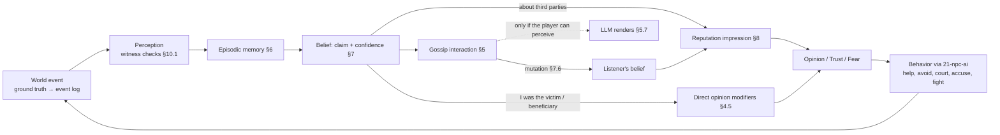
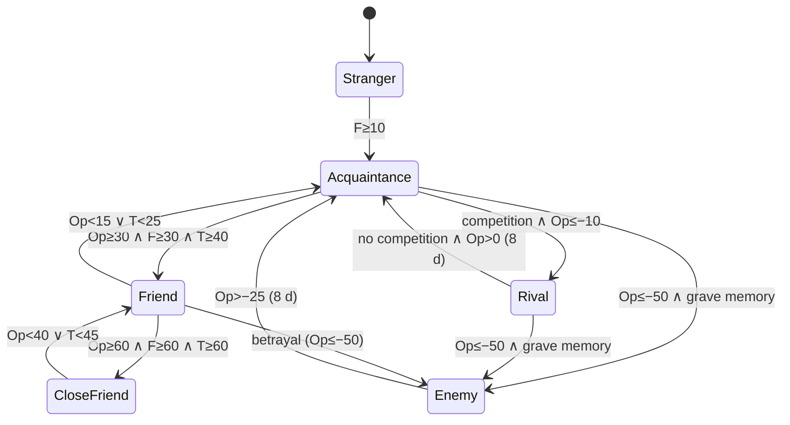
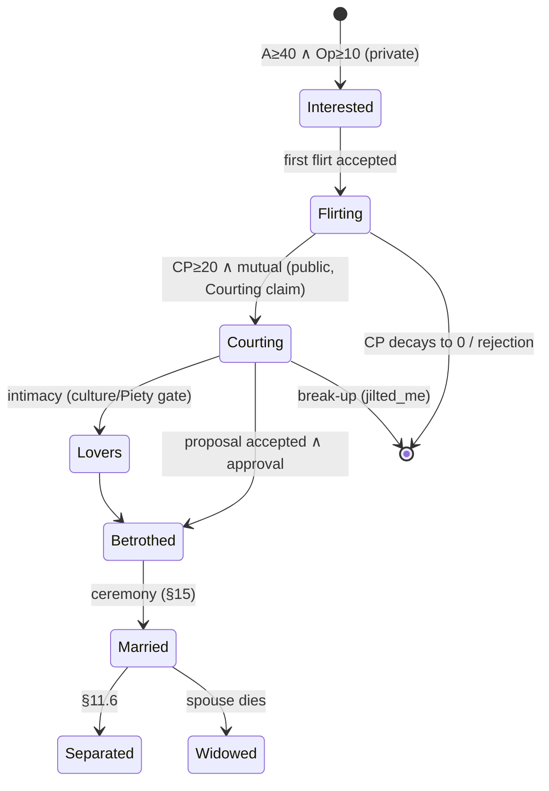

# 16 — Social Systems

> **Status:** Draft v0.1 · revised for canon v0.3 (decision points) · **Owner doc for:** relationships (Opinion, Trust, Familiarity, Fear, Attraction, tags), NPC↔NPC social interactions, memory / belief / rumor propagation, reputation & Renown, provocation & escalation (up to the fight hand-off), crime detection & witnesses, households & kinship, courtship & marriage, pregnancy & upbringing, life cycle & mortality, death processing & grief, informal groups, faith, community events · **Depends on:** [01-canon](../01-canon.md), [21-npc-ai](../tech/21-npc-ai.md), [22-llm-integration](../tech/22-llm-integration.md), [17-governance-and-law](17-governance-and-law.md), [18-conflict-and-warfare](18-conflict-and-warfare.md), [15-economy-and-trade](15-economy-and-trade.md), [11-survival](11-survival.md), [12-skills-and-professions](12-skills-and-professions.md), [19-player-experience](19-player-experience.md), [20-architecture](../tech/20-architecture.md)

This document is the heart of pillars **P2 "Everyone is a person"** and **P4 "Consequences travel"**.
It defines how people come to like, distrust, fear, love, gossip about, accuse, marry, mourn and
fight each other — the same rules for the player and for every NPC. Time references use canon §6:
**1 game day = 30 real minutes; 1 season = 8 days; 1 year = 32 days.** Every half-life below is in
*game days*; read "32 d" as "one year" and "64 d" as "the length of a maximal Interlude".

## Table of contents

1. [Purpose, principles & interfaces](#1-purpose-principles--interfaces)
2. [The social pipeline](#2-the-social-pipeline)
3. [Data model & storage](#3-data-model--storage)
4. [Relationships](#4-relationships)
5. [Social interactions](#5-social-interactions)
6. [Memory](#6-memory)
7. [Beliefs, claims & rumors](#7-beliefs-claims--rumors)
8. [Reputation & Renown](#8-reputation--renown)
9. [Provocation & escalation](#9-provocation--escalation)
10. [Crime detection & witnesses](#10-crime-detection--witnesses)
11. [Households, kinship, romance & marriage](#11-households-kinship-romance--marriage)
12. [Life cycle, death & grief](#12-life-cycle-death--grief)
13. [Informal groups & factions](#13-informal-groups--factions)
14. [Faith](#14-faith)
15. [Community events](#15-community-events)
16. [The player's knowledge limits](#16-the-players-knowledge-limits)
17. [Simulation LOD, Interludes & performance](#17-simulation-lod-interludes--performance)
18. [LLM & Jev touchpoints](#18-llm--jev-touchpoints)
19. [Milestones](#19-milestones)
20. [Tuning knobs](#20-tuning-knobs)
21. [Exploits & mitigations](#21-exploits--mitigations)
22. [Headless validation & drama metrics](#22-headless-validation--drama-metrics)
23. [Open questions](#open-questions)
24. [Proposed canon additions](#proposed-canon-additions)

---

## 1. Purpose, principles & interfaces

### 1.1 Principles

1. **Perception-gated.** Nobody reacts to what they do not know. Ground truth lives in the event log;
   people act on *beliefs* formed from what they perceived or were told. Beliefs can be wrong.
2. **Parity.** One relationship, rumor, reputation and crime model for player and NPCs. NPCs gossip
   about, lie to, steal from, court, accuse and feud with *each other* — that is most of the traffic.
   The player is not special-cased in any *rule*; the only exceptions are presentational: the human
   supplies psychological needs (canon §10.5), the UI shows beliefs ([§16](#16-the-players-knowledge-limits)),
   the player's journal never forgets, and NPC memories about the player are slightly favoured when
   compaction picks *which details* to keep (§6.3).
3. **Structured irrationality** (tenet 3). People are biased in specific, tunable ways: motivated
   reasoning, confirmation bias, in-group bias, scapegoating, rumor embellishment, grudges that outlive
   their reasons, noise in temper. Not uniform randomness.
4. **Sparse and lazy.** Nothing ticks per pair. Decaying values are stored as `(value, timestamp)` and
   evaluated in closed form on read, so LOD3 and Interludes cost O(events), not O(pairs × days).
5. **Language decides, systems resolve** (canon §13). Every option, parameter and consequence here is a
   hard-coded function. When an NPC must choose in a conversation with the player — warm to them,
   grant a favor, accept an apology, believe a claim, answer a provocation, report a crime — this doc
   opens a **decision point (DP)**: it builds the menu (fixed parameters, eligibility, base
   propensities, stakes), the LLM in the NPC's reply (or the fast decider) picks, the DRE guards the
   pick, and this doc's functions apply it. Everything else — NPC↔NPC life, Interludes, headless runs
   — is decided by the **policy** (seeded sampling from the same propensities), and NPC↔NPC exchanges
   the player overhears are decided by the policy and only rendered by the LLM. §18 lists every DP.
6. **Everything is logged.** Every social event (interaction outcome, belief formed, tag change,
   marriage, death, accusation) appends to the event log ([20-architecture](../tech/20-architecture.md))
   so Chronicles and saves can reconstruct it.

### 1.2 Interfaces

| Doc | This doc consumes | This doc provides |
|-----|-------------------|-------------------|
| [21-npc-ai](../tech/21-npc-ai.md) | Personality facets/values/traits, emotion engine (Anger, Fear, Grief, Joy, Shame, Jealousy dynamics), needs, utility AI, schedules | Social *triggers & magnitudes* pushed into emotions/needs; relationship queries (`Opinion`, `Trust`, …); social action candidates and their utilities' social terms; `Willingness` term |
| [22-llm-integration](../tech/22-llm-integration.md) | Dialogue-act / tone / claim / promise classification of player text; the deciders (LLM in the reply, fast decider) and the DRE's guards, deadline and recording; rendering service | DP menus with base propensities (§18); `SocialExchangeRender` requests; structured claim vocabulary; memory/belief context for prompts |
| [17-governance-and-law](17-governance-and-law.md) | Law set (which acts are crimes), verdicts, succession & inheritance rules, formal factions, blood-price law | `Accusation` with evidence strength; testimony; kin-graph heir queries; group cohesion/grievance; reputation & opinion for votes/legitimacy |
| [18-conflict-and-warfare](18-conflict-and-warfare.md) | Fight resolution, feud conduct, war events (muster, deaths, absences) | `ConfrontationEscalated`, `FeudDeclared`; morale inputs from family ties & grief |
| [15-economy-and-trade](15-economy-and-trade.md) | Trades, prices, property & ownership records | Opinion/Trust/Honesty inputs to price willingness and credit; `fair_trade` / `cheated_me` outcomes |
| [11-survival](11-survival.md) | Health, disease, injuries, childbirth complications as health states | Pregnancy state, conception, birth events, background mortality hazard |
| [12-skills-and-professions](12-skills-and-professions.md) | Teaching/apprenticeship contracts, job choice, attribute aging | Mentor/apprentice tags, Competence reputation, hiring inputs |
| [19-player-experience](19-player-experience.md) | UI, journal, dialogue UI | Belief-only data views for the player ([§16](#16-the-players-knowledge-limits)) |
| Inputs assumed from elsewhere | **Status band** (ordinal social rank: serf/landless, freeman, craftsman/merchant, notable, lord) from 17; **intoxication level 0–3** from 11 (consumption) / 21 (state) — derived from 21's Drunkenness 0–100 as `0` < 20 ≤ `1` < 45 ≤ `2` < 70 ≤ `3` | — |

### 1.3 Parity audit

| Player can… | NPCs do the same to each other via |
|-------------|-----------------------------------|
| Insult, provoke, brawl | §5.2 Insult/Argue → §9 ladder |
| Lie, deny, frame others | §5.2 Lie/deny, §10.4 fabrication |
| Spread or debunk rumors | §7.5 gossip, §7.7 corrections |
| Steal and be watched, accused, scapegoated | §10 for every actor; NPC thieves face the same detection |
| Court, marry, cheat, divorce | §11 functions shared verbatim |
| Hold false beliefs | NPCs hold false beliefs about the player and each other; the player about NPCs (§16) |
| Win a reputation and an epithet | §8, §7.9 apply to all subjects |

---

## 2. The social pipeline



Three loops make the society move: **experience** (I saw/felt it → I like/dislike you), **talk** (I was
told → my picture of you changes), and **action** (my picture of you changes what I do → new events).

---

## 3. Data model & storage

### 3.1 Runtime records (C# sketches)

```csharp
// Directed edge A→B, stored in A's adjacency list (sparse; see §17 for caps).
public struct RelationshipEdge {
    public PersonId Target;
    public byte Trust, Familiarity, Fear;   // 0–100
    public byte Attraction;                 // 0–100; 255 = not applicable (age/orientation gate)
    public RelTags Tags;                    // bit flags (§4.12)
    public long LastContact;                // game-minutes
    public ModSlotSpan Mods;                // inline span into a pooled ModSlot buffer (typ. 0–8, cap 16)
    public short PeakFamiliarity;           // for decay floor
}
public struct ModSlot {                     // ONE slot per modifier type per edge (exact merge, §4.3)
    public ushort ModifierId;
    public float  Value;                    // value at Time (already stacked & personality-scaled)
    public float  Floor;                    // permanent residue ("scar"), 0 if none
    public long   Time;                     // game-minutes of last rebase
    public byte   Count;                    // instances absorbed (diminishing, analytics)
    public long   SourceMemoryId;           // optional backing memory (may be compacted away)
}
public readonly record struct Claim(        // interned in a global ClaimTable, refcounted
    ushort Predicate, PersonId Subject, long Object, byte Magnitude,
    int PlaceId, long TimeApprox, ushort Qualifiers, int DerivedFrom /*0 = original*/);
public struct Belief {
    public int ClaimId; public byte Confidence;        // 0–100 (0.0–1.0 in formulas)
    public long FirstHeard, LastReinforced;
    public PersonId Source0, Source1, Source2;         // most recent tellers (source chain)
    public byte BestHop;                                // 0 = first-hand
    public BeliefFlags Flags;                           // FirstHand, SelfInvolved, Secret, Debunked, Latent
    public ToldRing ToldTo;                             // ring of last 8 listeners (hot beliefs only)
}
public struct MemoryRecord {
    public long Id, EventId; public ushort Kind;
    public PersonId Actor, Target, Extra; public int PlaceId; public long Time;
    public sbyte Valence;                   // −100..+100 from the owner's point of view
    public byte Salience0; public long SalienceTime; public bool Core;
    public MemorySource Source;             // Experienced, Witnessed, Told, Inferred
    public int ClaimId; public ushort Count; // Count > 1 = compacted pattern memory
    public int SummaryTextId;               // LLM summary, player conversations only
}
```

### 3.2 Content files (YAML, canon §14)

| File | Defines |
|------|---------|
| `/content/social/opinion_modifiers.yaml` | Modifier catalog §4.5 (value, half-life, stacking, cap, floor, personality hooks, `extends_to`) |
| `/content/social/interactions.yaml` | Interaction types §5.2 (weights, preconditions, outcomes, bark/template ids) |
| `/content/social/claim_predicates.yaml` | Claim vocabulary §7.3 (juiciness, axis impacts, escalation ladders, plausibility hooks) |
| `/content/social/absurd_acts.yaml` | Norm-violation detectors and grades §7.9 |
| `/content/social/events.yaml` | Community events §15 |
| `/content/cultures/*.yaml` | Marriage, divorce, residence, inheritance-default, mourning customs (shared with 17) |
| `/content/faiths/*.yaml` | Faith definitions §14 |

```yaml
# opinion_modifiers.yaml (excerpt)
- id: opinion.stole_from_me
  value: -20               # scaled by stolen value, see §4.5 note
  half_life_days: 48
  stacking: add
  cap: -60
  floor_fraction: 0.0      # floor 0.25 if value >= 1 week's wage (56f)
  extends_to: { household: 0.5 }
  hooks: { vengeful_half_life_mult: 2.0 }
```

### 3.3 RNG streams (determinism, canon §14)

`social.interaction`, `social.rumor`, `social.mutation`, `social.perception`, `social.crime`,
`social.romance`, `social.family`, `social.mortality`, `social.faith`, `social.events`, `social.dp`
(policy draws for decision points, §18). Draws are
keyed by `(stream, day, personId, counter)` so LOD changes do not perturb unrelated outcomes.

---

## 4. Relationships

### 4.1 Dimensions (canon §10.6)

| Dimension | Range | Directed | Nature | Section |
|-----------|-------|----------|--------|---------|
| Opinion | −100…+100 | yes | Sum of decaying modifiers + derived terms | 4.2–4.7 |
| Trust | 0–100 | yes | Evidence-updated; slow drift | 4.8 |
| Familiarity | 0–100 | yes (near-symmetric) | Grows with contact; decays with absence | 4.9 |
| Fear | 0–100 | yes | Event-driven + power-derived | 4.10 |
| Attraction | 0–100 | yes | Adults only; taste + dynamics | 4.11 |
| Tags | flags | some mutual | Derived from thresholds or events | 4.12 |

### 4.2 Opinion

```
Opinion(A→B, t) = clamp( Σ_d D_d(A,B)  +  Σ_m [ F_m + (V_m − F_m) · 0.5^((t − T_m) / (h_m · κ_m(A))) ], −100, +100 )
```

- `D_d` — **derived** terms (no decay; recomputed when inputs change, §4.6).
- `V_m, T_m, F_m` — stored slot value, rebase time and permanent floor of modifier type *m*.
- `h_m` — catalog half-life (days); `κ_m(A)` — personality half-life multiplier (§4.4).
- Slots whose decayed magnitude (above floor) falls below **1** are deleted on next read.
- An edge caches Opinion and recomputes on read if older than 1 game hour (LOD0/1) or 1 day (LOD2/3).

### 4.3 Stacking rules

All instances of one modifier type share a half-life, so they **merge exactly into one slot**:
`V ← V·0.5^((now − T)/h) + v_new; T ← now`.

| Rule | Behaviour | Used for |
|------|-----------|----------|
| **Add** (cap *c*) | `V ← clamp(V_decayed + v, cap)` | Discrete harms/benefits that should accumulate (thefts, rescues) |
| **Saturate** (cap *c*) | `V ← V_decayed + v·(1 − V_decayed/c)` — asymptotic diminishing returns | Cheap repeatable acts (chat, compliments, gifts) |
| **Refresh** | `V ← sign·max(abs(V_decayed), abs(v))` | States that re-assert rather than add (rival in love) |
| **Once** | Ignored after the first instance on this edge | First impression |

Floors: modifiers marked with `floor_fraction` set `F ← F + floor_fraction·v` — a residue that never
decays ("I'll never forgive him for my brother").

### 4.4 Personality scaling (trait names per canon §10.4; trait catalog owned by [21](../tech/21-npc-ai.md))

| Holder property | Effect on new modifiers |
|-----------------|------------------------|
| Volatility *Vo* | Negative magnitude × `(0.8 + 0.4·Vo/100)` |
| Warmth *W* | Positive magnitude × `(0.8 + 0.4·W/100)`; if W ≥ 70, negative half-life κ × 0.75 (forgiving) |
| Vengeful | Negative κ × 2; floors on modifiers with abs(v) ≥ 25 doubled |
| Jealous | Love-related negatives (§4.5 #49–52, D7) × 1.5 |
| Paranoid | Positive magnitude × 0.8; Trust gains × 0.7 |
| Greedy | Gift & trade modifiers × 1.5; `cheated_me` × 1.5 |
| Honor value *Ho* | Insult/humiliation × `(0.5 + Ho/100)` |
| Family / Faith values | Kin- and faith-targeted modifiers × `(0.5 + value/100)` |
| Stubborn | Apology/mediation reduction halved (§4.14) |

### 4.5 Opinion modifier catalog (direct experience)

Values are **pre-scaling**. "Public" = ≥ 3 witnesses → × 1.5 for status-relevant harms. `extends_to`
applies the modifier at the listed fraction to the victim's spouse/household/kin (no separate entries).

| # | id | Trigger (perceived/believed by holder, c ≥ 0.6) | Value | Half-life (d) | Stacking (cap) | Notes |
|---|----|---------------------------------------------|-------|---------------|----------------|-------|
| 1 | `chatted` | Friendly interaction succeeded | +2 | 3 | Sat (+12) | ×1.5 if holder's Social need < 40 |
| 2 | `joked_together` | Joke landed | +3 | 3 | Sat (+12) | |
| 3 | `shared_meal` | Ate together / shared food | +2 | 4 | Sat (+10) | |
| 4 | `complimented_me` | Praise | +3 | 3 | Sat (+10) | ×0.5 if Trust < 30 (flattery) |
| 5 | `comforted_me` | Comfort while Grief/Fear/Shame ≥ 30 | +8 | 8 | Sat (+20) | |
| 6 | `helped_my_work` | Joined my task ≥ 1 h | +5 | 6 | Sat (+20) | |
| 7 | `granted_my_request` | Accepted a request | +5 × imp | 8 | Sat (+25) | imp 0.5–3 (request importance) |
| 8 | `gave_gift` | Gift accepted | `min(20, 3 + 5·log2(1 + G/W))` | 8 | Sat (+35) | G = gift value (f), W = holder's daily income (default 8f); ×0.5 from someone Opinion ≤ −30 |
| 9 | `fair_trade` | Trade within ±10 % of holder's value estimate | +2 | 4 | Sat (+10) | from 15 |
| 10 | `generous_deal` | Discount / credit extended | +5 | 8 | Sat (+15) | |
| 11 | `taught_me` | Teaching session (12) | +4 | 16 | Sat (+25) | |
| 12 | `kept_promise` | Commitment fulfilled | +6 × stakes | 12 | Add (+30) | stakes 1–3 |
| 13 | `repaid_debt` | Loan repaid on time | +5 | 12 | Add (+20) | |
| 14 | `defended_my_name` | Contradicted a rumor about me / spoke for me at court | +10 | 24 | Add (+30) | holder must learn of it |
| 15 | `stood_by_me` | Fought on my side | +15 | 48 | Add (+40) | |
| 16 | `healed_me` | Treated my injury/illness | +10 × sev | 24 | Add (+30) | sev 0.5–2 |
| 17 | `fed_me_hungry` | Gave food while my Satiety < 25 | +10 | 32 | Add (+30) | Era 0 cornerstone |
| 18 | `saved_my_life` | Rescue from lethal danger | +40 | 128 | Add (+70), floor 0.25 | `extends_to: {kin: 0.5}` |
| 19 | `avenged_me` | Punished someone who wronged me | +20 | 64 | Add (+40) | |
| 20 | `romantic_moment` | Courtship success / intimacy (adults) | +4 | 4 | Sat (+20) | |
| 21 | `attended_my_occasion` | Came to my wedding / child's naming / kin's funeral | +4 | 16 | Sat (+12) | |
| 22 | `hosted_me` | Feast or hospitality | +4 | 8 | Sat (+12) | |
| 23 | `shared_hardship` | Endured famine/winter/battle in the same group | +6 | 64 | Sat (+20) | applied to co-members with F ≥ 20 |
| 24 | `first_impression` | First interaction (§8.5) | −15…+15 | 16 | Once | |
| 25 | `made_amends` | Restitution for a prior harm | +½ of harm's remaining | 24 | Add | offsets, never exceeds harm |
| 26 | `rude_to_me` | Brusque, ignored greeting | −2 | 2 | Sat (−10) | |
| 27 | `argued_with_me` | Argument (either side) | −4 | 3 | Sat (−16) | |
| 28 | `refused_my_request` | Request declined | −2 × imp | 3 | Sat (−12) | |
| 29 | `mocked_me` | Mockery (severity 2) | −6 | 4 | Sat (−20) | |
| 30 | `insulted_me` | Insult (severity 3) | −12 | 8 | Add (−40) | ×1.5 public; Honor scaling |
| 31 | `insulted_my_kin_or_faith` | Severity-4 insult | −15 | 16 | Add (−40) | Family/Faith scaling |
| 32 | `humiliated_me` | Severity-5 / public humiliation | −25 | 32 | Add (−50) | |
| 33 | `threatened_me` | Threat | −10 | 12 | Add (−30) | Fear +15 |
| 34 | `struck_me` | Shove/slap | −15 | 16 | Add (−40) | Fear +10 |
| 35 | `beat_me` | Lost a brawl to them | −20 | 32 | Add (−50) | ×0.5 if I started it |
| 36 | `wounded_me` | Weapon injury | −40 | 96 | Add (−70), floor 0.25 | Fear +30 |
| 37 | `cheated_me` | Trade ≥ 25 % against me, discovered | −15 | 24 | Add (−40) | |
| 38 | `broke_promise` | Commitment failed | −8 × stakes | 16 | Add (−40) | |
| 39 | `lied_to_me` | Caught in a lie | −10 | 24 | Add (−40) | |
| 40 | `stole_from_me` | Theft | −10…−40 by value | 48 | Add (−60), floor 0.25 if ≥ 56f | `extends_to: {household: 0.5}` |
| 41 | `damaged_my_property` | Vandalism, arson | −8…−30 | 24 | Add (−50) | |
| 42 | `trespassed` | Entered my home/field uninvited | −4 | 4 | Sat (−15) | |
| 43 | `spread_lies_about_me` | Learned they sourced a false claim about me | −15 | 48 | Add (−40) | |
| 44 | `accused_me_falsely` | Public/formal false accusation | −30 | 96 | Add (−60), floor 0.15 | |
| 45 | `testified_against_me` | Testimony against me | −12 | 48 | Add (−30) | ×0.5 if true and my Fairness ≥ 70 |
| 46 | `got_me_punished` | Their report led to my sentence | −20 | 64 | Add (−50) | |
| 47 | `abandoned_me` | Left me in danger | −25 | 64 | Add (−50) | |
| 48 | `took_my_place` | Won the job/office/match I sought | −8 | 32 | Add (−20) | Ambitious ×2 |
| 49 | `rejected_my_courtship` | Advance refused | −5 | 8 | Sat (−15) | Romantic ×1.5 |
| 50 | `jilted_me` | Broke betrothal / left me | −30 | 96 | Add (−50), floor 0.1 | |
| 51 | `slept_with_my_spouse` | Applied to the lover | −50 | 160 | Add (−80), floor 0.3 | Jealous ×1.5 |
| 52 | `betrayed_me` | Applied to the unfaithful spouse | −40 | 96 | Add (−70), floor 0.15 | |
| 53 | `harmed_my_child` | Any harm ≥ 15 to my child | −35 | 96 | Add (−60), floor 0.2 | |
| 54 | `killed_my_friend` | Friend/close friend killed | −50 | 192 | Add (−70), floor 0.2 | |
| 55 | `killed_my_kin` | Kin killed (incl. lawful execution, ×0.5) | −80 | 320 | Add (−100), floor 0.375 | "blood debt"; Vengeful floor 0.75 |
| 56 | `defied_me` | Child/ward refused my arranged match or command | −15 | 32 | Add (−30) | |
| 57 | `apostate` | Left my faith (Faith ≥ 60 holders) | −20 | 96 | Refresh | §14 |
| 58 | `warmed_to_me` | Rapport DP picked `warm_to_speaker` (§4.15) | +1…+4 (Familiarity step) | 6 | Sat (+20) | counts toward the +10/day words budget |
| 59 | `cooled_on_me` | Rapport DP picked `cool_to_speaker` (§4.15) | −1…−4 (Familiarity step) | 6 | Sat (−20) | |

### 4.6 Derived terms (no decay, recomputed)

| id | Formula | Range |
|----|---------|-------|
| D1 `kin_bond` | `{parent/child 30, sibling 22, grandparent 18, aunt/uncle/cousin 10, in-law 8} × (0.5 + Family/100)` | 0…+45 |
| D2 `same_household` | +5 | |
| D3 `homeland` | same: +4; different: `−(2 + 10·Tradition/100) × tension` (tension 0.5–1.5, from group grievance §13) | −18…+4 |
| D4 `faith` | same creed `+4·Faith/50`; Ember lax↔orthodox −3; rival creed `−(5 + 15·Faith/100)` | −20…+8 |
| D5 `values_alignment` | `10 × cos(v_A − 50, v_B − 50)` over the nine values (holder perceives B's values with noise `σ = 30·(1 − F/100)`) | −10…+10 |
| D6 `trade_competitor` | same profession, same settlement, both ≥ Journeyman: `−(3 + 5·Wealth/100)`, Ambitious ×1.5 | −12…0 |
| D7 `rival_in_love` | both courting the same person | −15 |
| D8 `status_gap` | toward ≥ 2 status bands higher: `+8·Tradition/100` minus `8·Fairness/100` if holder is poor | −8…+8 |
| D9 `reputation_impression` | `Σ_axis R³ᵖ_A,x(B) · w_x(A) / 100`, cap ±25; w_x from values (Honesty←Fairness, Generosity←Fairness/Family, Courage←Honor, Peaceableness←Warmth, Lawfulness←Tradition/Loyalty, Piety←Faith) | −25…+25 |
| D10 `attraction_glow` | `+Attraction/10` when Attraction ≥ 30 | 0…+10 |
| D11 `group_identity` | shared clique/trade group: `+3 × identification` (§13) | 0…+6 |

### 4.7 The no-double-counting rule

> A harm or benefit **I experienced** (I am victim/beneficiary, or `extends_to` covers me) reaches my
> Opinion **only** as a direct modifier. A harm or benefit I merely **believe happened to others**
> reaches my Opinion **only** through D9, which is computed from the *third-party* impression
> `R³ᵖ` that excludes `SelfInvolved` beliefs (§8.1). Decisions that need the full picture (wariness,
> hiring, trust ceilings) use `R_full`.

### 4.8 Trust

Baseline: `T0(A,B) = clamp(35 + 0.3·(W_A − 50) − 15·Paranoid_A + 10·sameHomeland + 25·kin, 5, 80)`;
strangers start at `T0 − 10`. Evidence updates are asymmetric — betrayal hurts more when trust was high:

```
positive:  T ← T + g · (100 − T)/100
negative:  T ← T − l · (0.5 + T/100)
ceiling:   T ≤ 80 + 0.5 · R_full_A,Honesty(B)       // you cannot deeply trust a believed liar (owner 2026-10-04: base 80, was 50)
drift:     T ← T0 + (T − T0) · 0.9^(Δdays/32)        // absent contact: 10 %/year back to baseline
```

| Evidence | g / l |
|----------|-------|
| Kept promise (minor / major / sacred oath) | g 5 / 10 / 20 |
| Broke promise (minor / major / sacred) | l 10 / 20 / 35 |
| Caught lying to me / believed liar to others | l 15 / 6 |
| Claim they told me later confirmed (max 1/day) | g 3 |
| Claim they told me debunked, honest mistake | l 3 |
| Repaid loan / defaulted | g 8 / l 20 |
| Kept a secret ≥ 16 d / leaked my secret | g 6 / l 25 |
| Fought beside me / abandoned me | g 8 / l 25 |
| Stole from me (believed) | l 40 |
| Consistent season (≥ 4 interactions, no negative evidence) | g 2 |

Promises come from NPC intents or from player commitments extracted by 22 (`Commitment{debtor,
creditor, act, deadline, stakes}`); the sim checks fulfilment against ground truth.

### 4.9 Familiarity

Start: strangers 0; **shipmates 15–35** (the voyage); household 70; non-household kin 50.
Each contact adds `ΔF = w · (1 − F/100)`:

| Contact | w |
|---------|---|
| Any social interaction (cap +6/pair/day) | 3 |
| Co-working ≥ 2 h same site (per day) | 1.5 |
| Same household (per day) | 3 |
| Shared significant event (fight, rescue, wedding) | 5 |
| Co-resident in a settlement ≤ 60 people (per day, "everyone knows everyone") | 0.3 |

Decay: after 4 days without contact, `F` decays with half-life **64 d** toward a floor
`max(kin ? 40 : 0, spouse/ex ? 50 : 0, 0.3·PeakF)`. Check: a daily acquaintance (one chat + co-work +
co-residence ≈ 4.8 %/day) reaches **F 50 in ~15 days (two seasons)**, satisfying the canon §12
lineage fallback (Opinion ≥ 50 ∧ Familiarity ≥ 50) for genuine friends.

### 4.9a Time together (owner direction, 2026-10-04)

People who keep spending long hours close to each other warm to each other, unless animosity is brewing. Once a game
hour, each LOD0/1 person who is awake and able (or asleep in a shelter) counts up to **6** people within **6 m**,
scanning from a rotating start. Toward each one the holder gains `opinion.time_together` (#63: +1, saturating, cap +8,
half-life 8 days), unless the holder's Opinion of them is below 0, the holder's Anger is 40 or more, or a quarrel
between them is open. The hour sample plus the saturating cap means only sustained company counts. (Values below 1
are dropped by §4.5's negligible rule, so +1 per hour is the smallest step that accumulates.) This is the missing
source §5.6 named: talk alone saturates near Op 20, so before this a camp's friendships were a tail event (31 D46).
**Camp (300 seeds × 30 days):** friends per person 1.35 (p5 0.50, p95 2.46), in band [0.08, 3] in 99 % of seeds (was
84 %); brawls per 300 camp-days 142 → 115 (10 worlds); S6 Social 7.9 µs/step.

### 4.10 Fear

Event fear (decays, half-life 8 d; Paranoid ×2, Brave ×0.5): threatened +15, struck +10, beat me +15,
wounded +30, witnessed B kill +25, B drew a weapon on me +20. Derived fear (no decay): B has
power over me (lord, judge, employer) `+0…+30 × (1 − R_Peaceableness(B)/200)`; believed violent
(`R_full Peaceableness ≤ −40`) +10. Effects: **≥ 30** avoid being alone with B, comply bonus
`+Fear/5 %` added to the base propensity of granting B's requests (§5.4; deterministic, outside the
menu width), accusation/testimony willingness × `(1 − Fear/100)`, escalation pressure −0.4·Fear (§9);
**≥ 70** flee when B approaches with hostile intent, refuse trade.

### 4.11 Attraction

**Hard gate (non-overridable by culture, config or LLM): Attraction exists only when both people are
Adults (16+) and orientation-compatible; otherwise it is `n/a`.** Each person has an orientation field
(attraction profile) in the person model (proposed canon addition).

```
A0(A→B) = clamp(25 + taste(A,B) + 3·(Cha_B − 5) + groomed_B·4 − 1.5·max(0, |age_A − age_B| − 8) + 10·Romantic_A, 0, 100)
taste ~ N(0, 15), seeded by hash(A,B) — asymmetric, stable
```

Dynamics: successful flirt +3, romantic moment +2; effective attraction
`A_eff = A − max(0, −Opinion)/2`; long-married couples drift −5 %/year unless ≥ 4 romantic moments
that year. Wealth/Status-valuing people add `+0.1·(Wealth or Status value)·richer_B` (0…+10).

### 4.12 Tags & transitions

*Daily upkeep timing (S6):* familiarity decay, trust drift, slot cleanup and the tag checks run **once per game day
per holder, in hour `hash(holder) mod 24`** rather than all at midnight, so 70k edges don't make one 80 ms step.
Day-based rules (2 days as friends, 8 days calm) are unaffected. Crowds: co-working (§4.9) counts within teams of 12
people per task, and Landfall shipmates are one ship's company up to 60 people (crews of 24 in larger test populations).

| Tag | Mutual? | Enter | Exit (hysteresis) |
|-----|---------|-------|-------------------|
| Acquaintance | no | F ≥ 10 | F < 5 |
| Friend | no ("friends" when both) | Op ≥ 30 ∧ F ≥ 30 ∧ T ≥ 40 for 2 days | Op < 15 ∨ T < 25 |
| Close friend | no | Op ≥ 60 ∧ F ≥ 60 ∧ T ≥ 60 | Op < 40 ∨ T < 45 |
| Rival | no | Competing (D6/D7, same office, contest lost) ∧ Op ≤ −10 | competition over ∧ Op > 0 for 8 d |
| Enemy | no | Op ≤ −50 ∧ a memory with salience ≥ 50, valence ≤ −50 about B | Op > −25 for 8 d |
| Courting / Lover / Betrothed / Spouse / Former spouse / Widowed | yes | §11 events | §11 events |
| Mentor / Apprentice | yes | 12 contract | 12 |
| Kin (parent, child, sibling, …) | yes | kin graph (§11.2) | never |
| Lord / Vassal / Employer | yes | 17 / 15 | 17 / 15 |
| Sworn (oath-kin, Brannoch rite) | yes | oath ritual | oathbreaking → `Oathbreaker` claim |



### 4.13 Worked example — Mira and the player

Mira: Warmth 65, Volatility 55, Honor 40; same homeland & faith; values alignment +3 → derived **+11**.
Shipmate Familiarity 25; Trust baseline `35 + 4.5 + 10 = 49.5`.

| Day | Event | Modifier (scaled) | Opinion |
|-----|-------|-------------------|---------|
| 3 | Player helps her haul timber; shares food while her Satiety is 20 | `helped_my_work` +5.3 (h 6); `fed_me_hungry` +10.6 (h 32) | 26.9 |
| 10 | Before insult (decay) | +2.4, +9.1 | **22.5** |
| 10 | Player mocks her cooking in front of 4 people (severity 3, public) | `insulted_me` −12 × 1.5 × 0.9 (Honor) × 1.02 (Vol) = **−16.5** | **5.9** |
| 11 | Player apologizes → apology DP (§4.14): p(`accept_apology`) = 0.40 + 0.005·5.9 + 0.003·15 = 0.47, plus the words term for a plainly sincere apology (L 0.3, s 0.57, Persuasion 35): 0.15·0.57·0.675·0.3 ≈ 0.02 → **0.49**; the LLM accepts → remaining ×0.5 | insult −7.6 | 14.4 |
| 20 | Decay | | **14.9** (11.4 had he not apologized) |

*(Corrected 2026-10-04, M1-05: the earlier 15.6 / 12.1 kept a 0.75 `helped_my_work` residue that §4.2's rule — slots
below 1 are dropped — removes. `RelationshipTests.TheMiraWorkedExample` checks every row.)* The player is back to
"acquaintance, slightly warm"; Familiarity is 72 by day 20, so a few more good
days make them friends. Each of these conversations also closed with a rapport DP (§4.15); the table
assumes `stay_neutral` every time. Had the LLM picked `warm_to_speaker` on day 11 (Familiarity ≈ 55 →
step 3; p ≈ 0.40 after an accepted apology), day 20 would read ≈ 16.7 instead of 15.6. Had Mira been Vengeful, the insult's half-life would be 16 d and the apology
less likely.

*Implemented (M1-05, 2026-10-04):* `FeudalSim.Sim.Social.RelationshipStore` (`world.Relationships`): directed edges in id
order; one slot per modifier type merged exactly by stacking rule; personality scaling (§4.4: Volatility, Warmth,
Paranoid, Honor/Family/Faith, Vengeful floors and κ, Warmth ≥ 70 forgiving κ); derived D3 homeland, D4 faith (creed
from culture), D5 values alignment with familiarity-scaled perception noise; Trust baseline/evidence/ceiling/drift;
Familiarity contact (+6/pair/day social cap), co-working after 2 h, co-residence in camps ≤ 60, decay after 4 days;
event Fear; tags Acquaintance/Friend/Close friend/Enemy with hysteresis (Enemy uses a grave-harm proxy until memories,
Rival waits for a competition source). Reads are pure; `DailyUpdate` applies decay, drift, cleanup and tags. The
modifier catalog is `content/social/opinion_modifiers.yaml` (#1–39, #58–59). In the M1 camp, `SocialSystem` drives
chats and shared meals as a stand-in until §5's interaction catalog (M1-06).

### 4.14 Apology, amends & reconciliation

`P(accept apology) = clamp(0.40 + 0.005·Op + 0.003·(W − 50) − 0.20·Stubborn − 0.25·Vengeful
+ 0.10·gift≥1 day's income − 0.10·(apologies to me in last 4 d) + G·Margin, 0.05, 0.95)` where
`G·Margin` is the words term of canon §13.4: `Margin = 0.15·s·(0.5 + 0.5·Persuasion/100)` of the
apologizer, `s` the victim's susceptibility and `G = clamp(L, −0.5, 1)` from the classified sincerity
(22 §6.3; NPC apologies use `L = Shame/100`).

**Apology DP.** The victim's answer is a decision point — decided by the LLM in the reply when the
player apologizes in conversation, by the policy everywhere else:

| Option id | Fixed parameters | Eligible | Base propensity | Stakes |
|-----------|------------------|----------|-----------------|--------|
| `accept_apology` | the "Accepted" effects below | always | `P(accept apology)` | low (medium if the incident's modifier ≥ 25) |
| `demand_amends` | names a restitution computed here: the harm's value for thefts, damage and cheating (§10.2 provenance / 15 value), otherwise one day's income of the apologizer; accepted once paid (an obligation, §4.8) | a material harm exists | `(1 − P)·0.4` | by the restitution's value (15 §5.6 bands) |
| `refuse_apology` | the "Refused" effects below | always | the rest | low |

Accepted: the incident's modifiers keep **50 %** of remaining value (**30 %** with gift; Stubborn: 75 %
/ 55 %), the holder's Anger −30, the escalation ladder resets (§9). Refused: no change, and a fourth
apology within 4 days is read as mockery (`rude_to_me`). **Restitution** (returning goods, paying
compensation ≥ value) adds `made_amends` and a `MadeAmends` claim that propagates (§7) and restores
up to half the Honesty impression lost.

*Implemented (M1-09a):* `ApologyOwner` (`apology.respond`, content `dp.apology`) with the formula above; `G·Margin` from
22 §6.3 with the classified sincerity (1–5 → L_words (s − 3)/2). Every attempt is remembered, so repeats lose 0.10 each
and a fourth within 4 days also adds `rude_to_me`. Accepting scales the grievance modifiers (insulted, mocked, rude,
argued, threatened, struck, humiliated) to 50 % (Stubborn 75 %), Anger −30, ends any quarrel and gives those in earshot a
`made_amends` claim. `demand_amends` stays ineligible until material harms exist (theft, damage: M3–M4). NPC↔NPC
apologies keep the M1-06 policy roll.

### 4.15 Conversation rapport (decision point)

Canon §13.1's "a long, friendly conversation" moment. A conversation with the player closes with one
**rapport DP** for the NPC, bundled into its closing reply (plus one more after every 8 further player
turns; at most 3 per conversation). If the player walks off with no closing reply to bundle it into,
the policy decides at the deadline — the sim never waits:

| Option id | Fixed parameter | Eligible | Stakes | Executed by |
|-----------|-----------------|----------|--------|-------------|
| `warm_to_speaker` | `warmed_to_me` (#58) at +step | while the pair's words budget for the day is not spent | low | this doc (§4.3, Saturate) |
| `stay_neutral` | none | always | low | — |
| `cool_to_speaker` | `cooled_on_me` (#59) at −step | always | low | this doc |

`step` comes from the listener's Familiarity with the speaker: **F < 15 → 1 · 15–34 → 2 · 35–59 → 3 ·
≥ 60 → 4**. Strangers barely move on one talk (first impressions, §8.4, cover them); people who know
each other well move more.

**Base propensities (the policy):**

```
L = 0.5·L_words + 0.5·L_skill          // the conversation's mean classified words signal and the speaker's
                                       // Persuasion (22 §6.3); template mode: the tags of the dialogue options chosen
z = s·L + 0.25·(Warmth − 50)/50 + 0.15·Mood/100 + 0.2·[Social need < 40] − Anger(at speaker)/100
    − 0.15·[Paranoid] + 0.1·clamp(Opinion, −50, 50)/50          // s = susceptibility (22 §6.3); liking begets liking
U = { warm: 2z,  neutral: 0.8,  cool: −2z − 0.5 }  →  p = softmax(U)
```

At `z` = 0 the split is warm 0.26 · neutral 0.58 · cool 0.16; at `z` = 0.5 it is 0.53 · 0.43 · 0.04;
at `z` = 1, 0.76 · 0.23 · 0.01, so cooling on a speaker after a warm talk is below the anti-exploit
floor and out of a model's reach. `warm_to_speaker` with `p < 0.20` is a long shot (it favors the
player) and spends the pair's daily long-shot budget.

**The words budget.** Positive Opinion that comes from *words* — `warmed_to_me` and the conversational
acts `chatted` (#1), `joked_together` (#2), `complimented_me` (#4), `comforted_me` (#5) and
`romantic_moment` (#20) when talk produced them — is capped at **+10 per speaker → listener pair per
game day** (canon §13.4); the excess is discarded and `warm_to_speaker` becomes ineligible once the
budget is spent. Deeds (gifts, help, food, a rescue) are not words and are not capped by it. Insults,
threats and lies found out are acts that apply their own §4.5 modifiers whatever the rapport pick.
Familiarity grows from the contact itself (§4.9), whatever the pick.

*Implemented (M1-09a):* `RapportOwner` (`relationship.rapport`, content `dp.rapport`) reproduces the split above
(`SocialDpTests`). Each conversation with the player opens one after turns 8 and 16 and one at the close (at most 3):
decided in the closing reply (LLM) when the player or NPC says goodbye, by the policy at once when the player walks off,
a fight or a threat ends it, or the last turn was flagged as injection. The **words budget** is content-driven: opinion
modifiers marked `words: true` (#1, #2, #4, #5, #20, #58) add at most +10 per directed pair per game day (`WordsToday`
on the edge, saved and hashed); deeds are uncapped. NPC↔NPC rapport DPs are not opened (Q12 open; the `chatted` stream
stands, and the budget binds it).

**Parity.** The budget binds every pair. NPC↔NPC conversations at LOD0–2 close with the same DP,
decided by the policy, once per pair per day with ≥ 2 successful interactions; at LOD3 the expected
value `step·(p_warm − p_cool)` is applied instead.

---

## 5. Social interactions

### 5.1 Opportunities & budgets

A **social opportunity** exists when two awake people are within speaking range (≤ 4 m; LOD1+:
same task site, meal, well, hearth, market, tavern) and neither is in combat or a focus task
(crafting minigame-equivalent work allows chatter at half rate).

| Budget | Value |
|--------|-------|
| Initiations per waking day | `I = 2 + Sociability/16` (mean ≈ 5.1; 2–8.3); +1 if Social need < 40; −Grief/30 |
| Participation (incl. being approached) | ≈ 10 / person / day |
| Per pair per day | ≤ 4 (household exempt) |
| Community events | Budget × 3 for attendees (§15) |
| LOD3 | Budget × 0.5 sampled from cached top-24 contacts (§17) |

### 5.2 Interaction types

| Type | Preconditions | Base weight W₀ | Main biases | Success test | Effects (success / failure) |
|------|---------------|---------------|-------------|--------------|-----------------------------|
| **Chat** | any | 10 | Sociability | `0.75 + 0.002·Op_target` | `chatted` both, F / awkward: `rude_to_me` −2 if Volatile target |
| **Gossip** | initiator holds a tellable belief (§7.5) | `10·P_share` | Gossip ×2.5, Sociability | listener interest ≥ 0.3 | claim transfer §7; `chatted` if listener is Gossip/Sociable; Honest listeners −1 |
| **Joke** | any | `3·(Curiosity + Sociability)/100` | Joy, Drunk ×1.5 | `0.5 + 0.03·(Cha − 5) + 0.002·Op` | `joked_together` / −2; joke at an absent target's expense spreads `Mocked` claim |
| **Praise** | Op ≥ 20 | 2 | Warmth | auto | `complimented_me` |
| **Comfort** | target Grief/Fear/Shame ≥ 30; Warmth ≥ 40; Op ≥ 10 | `4·W/50` | Warmth, Pious (+priest ×1.5) | `0.5 + 0.004·Op + Healing/400` | target emotion −15 (21), `comforted_me` / nothing |
| **Request help** | initiator has a need 21 marks as social-solvable | by need urgency | Diligence, pride (Status) | `Willingness` §5.4 | `granted_my_request` / `refused_my_request` |
| **Confide** | Op ≥ 50 ∧ T ≥ 60 | 1 | Sociability, Grief | auto | `Secret` belief in listener; trust test later |
| **Flirt** | Attraction ≥ 40, adults, §11.3 availability | `2·(A − 40)/60` | Romantic ×2, Drunk ×1.5 | §11.3 | courtship points / `rejected_my_courtship` |
| **Argue** | disagreement topic (value distance ≥ 30 on a live issue, work dispute, resource clash, faith) | `2·Vo/50·(1 + Stubborn)` | Anger, Stubborn | Persuasion contest decides "winner" | `argued_with_me` both, Anger +10; may escalate §9 |
| **Insult** | Op ≤ −20 ∨ Anger ≥ 40 | `Vo/50·(1 + Hot-tempered)·(1 + 0.5·drunk)` | Anger | n/a | enters ladder §9 |
| **Threaten** | Op ≤ −40, intent from 21 | 0.5 | Fear of target low | n/a | `threatened_me`, Fear |
| **Lie / deny** | questioned or accused about own wrongdoing; or boasting | by context | `P(lie) = 0.7 − 0.5·Honest − 0.3·Fairness/100 + 0.2·[punishment feared]` | listener detects with `clamp(0.1 + 0.02·Perception + F/400 + 0.5·[contradicts listener's own belief ≥ 0.6] + s_consistency, 0, 0.9)` | undetected: false claim enters listener / detected: `lied_to_me`, Trust l 15 |
| **Apologize** | own offense ≤ 8 d old; Shame ≥ 20 ∨ Op(victim) ≥ 20 ∨ Fear of retaliation ≥ 40 | 3 | Honest, Warmth | §4.14 | §4.14 |
| **Warn** | Op(listener) ≥ 40 and initiator holds a negative claim *about the listener* or a threat to them | 3 | Loyalty | auto | listener learns the claim (they discover what is said about them) |
| **Debate/preach** | faith/politics topic; Faith or Status ≥ 60 | 1 | Pious | Persuasion contest | conversion doubt §14 / Argue fallback |
| **Trade** | owned by [15](15-economy-and-trade.md) | — | — | 15 | `fair_trade`, `generous_deal`, `cheated_me` |
| **Teach** | owned by [12](12-skills-and-professions.md) | — | — | 12 | `taught_me`, F |

### 5.3 Selection

```
for each initiation slot of person i (spread over waking hours):
  candidates = co-located awake people (LOD0/1) | contact sample (LOD2/3)
  w_j = (0.2 + F_ij/100) · (1 + max(0, Op_ij)/50) · proximity · (1.3 if not met today)
        · (0.2 if Fear_ij ≥ 30 or Op_ij ≤ −30, unless Argue/Insult intent dominates)
  j = weighted_draw(w)
  for each type τ: W_τ = W₀_τ · f_personality · f_mood(Joy↑ chat/joke, Anger↑ argue/insult)
                        · f_relationship · f_context(event, drunk, work)
  τ = softmax_draw(W, temperature = 0.5 + Vo_i/100)      // volatile people pick less "sensibly"
  resolve(τ, i, j)  →  modifiers, F, emotions (21), claims, log event
```

This loop **is the policy** for NPC↔NPC life (canon §13.2): who talks to whom, about what, and every
choice inside the exchange (grant a request, accept an apology, believe a claim, answer an insult) is
sampled from the same propensities a DP would carry, on the seeded `social.*` streams. No model
decides an NPC↔NPC exchange — not even one the player overhears (§5.7).

### 5.4 Willingness to help (social term)

`Willingness(B→A) = 0.25 + 0.006·Op + 0.003·T + 0.004·(W − 50) + 0.15·kin + 0.10·Charitable +
0.05·reciprocity − 0.004·cost_hours·(100 − Diligence)/50 + Fear/500 + G·Margin`, where `G·Margin`
is the words term of canon §13.4: `Margin = 0.15·s·(0.5 + 0.5·Persuasion_A/100)` and `G = clamp(L,
−0.5, 1)` from 22 §6.3 (NPC askers draw `L_words` as in 22 §6.2). Clamped 0.02–0.98. Asking again
for the same thing multiplies it by `0.5^(n−1)` and adds Anger +3 (canon §13.4). 21 multiplies it with
B's own schedule/utility; 15 handles paid requests. Reciprocity: +0.05 per unreturned favor A did for
B (max +0.2) — favors are remembered.

**Request DP.** When the player asks a favor in conversation, B's answer is a decision point (the LLM
in B's reply); between NPCs the policy samples the same menu:

| Option id | Fixed parameters | Eligible | Base propensity | Stakes |
|-----------|------------------|----------|-----------------|--------|
| `accept_request` | do the favor as asked (21 schedules it); `granted_my_request` (#7) for A | B can do it (skills, tools, schedule, law) | `p = Willingness` | by importance: imp < 1 low, 1–2 medium, > 2 high; any transfer ≥ 960f critical |
| `accept_with_condition` | do it in return for a favor of equal hours, or for pay at 15 §9's day rate — recorded as A's obligation (§4.8) | as above, and `cost_hours ≥ 1` | `(1 − p)·0.35` | as above |
| `defer` | promise it for B's next free schedule slot (an obligation on B, §4.8) | the favor can wait ≥ 1 day | `(1 − p)·0.15` | low |
| `refuse_request` | `refused_my_request` (#28) for A | always | the rest (`(1 − p)·0.50` when all are eligible) | low |

`accept_request` and `accept_with_condition` favor the player: picked at `p < 0.20` they spend the
pair's long-shot budget.

*Calibration finding (M1-16):* `accept_with_condition`'s `(1 − p)·0.35` does not fall with Opinion, so an NPC who hates
the asker (Opinion ≤ −60, `p` ≈ 0.04) still agrees on condition about a third of the time; the hours term
(`0.004·hours·(100 − Diligence)/50`) is also small (≈ 0.03 for 8 hours at Diligence 50). Kept as written; open question 21.

*Implemented (M1-09b):* `RequestOwner` (`request.respond`, content `dp.request`). M1 favors are help at a camp task for
some hours (the task and hours come from 22's extraction; default: what the NPC was doing, 1 h). The yes propensity is
22 §6.3's expectation `Yes(A, Margin, L)` over the policy's steps, with A = the formula above without its words term
(kin waits for §11), × 0.5^(n−1) for the n-th ask of the day (counted per pair on the edge, any request — not yet per
"same thing"); the second ask adds Anger +3, the third `rude_to_me`. Accepted favors go to a saved `FavorStore` and the
utility AI treats an active favor's task as an obligation (it wins over routine unless a need is critical) until the
hours are worked (`FavorDone`); `defer` starts it at the next day's work block; conditional favors record the asker's
return obligation (not enforced until obligations exist, §4.8). NPC↔NPC requests keep the M1-06 policy roll.

### 5.5 Player interactions use the same machinery

The player's free-text lines are classified by 22 into a dialogue act (chat, praise, joke, insult,
threaten, flirt, request, promise, claim, apology, question…), tone, severity and extracted
claims/commitments. Each maps to the same §5.2 type and the same resolution functions. Where the
NPC then has to choose, the choice is a DP whose propensities are those functions (§18 lists them);
the LLM in the NPC's reply picks within the menu, so words change *which* option is likely, never
the options or their numbers. A player insult *is* an `Insult` — the player's own act, shown as an
intent echo with a 1.5 s unsay window (canon §13.5) — with severity from the fast decider's **score**
question (1–5), clamped and ignored if confidence < 0.5 (fallback: keyword + tone heuristic,
severity 2).

### 5.6 Frequency targets (validated in §22)

Per adult per day: ~10 interactions, of which chat 45 %, gossip 20 %, joke 10 %, work/help/trade
15 %, comfort/praise 5 %, argue 4 %, insult/threaten ≤ 1 %, flirt (eligible adults) 2 %.

*Implemented (M1-06, 2026-10-04):* `FeudalSim.Sim.Systems.InteractionSystem` runs the NPC↔NPC policy for Chat,
Joke, Praise, Comfort, Request help, Argue, Insult and Apologize (Gossip and Warn need claims → M1-07; Confide,
Flirt, Threaten, Lie, Debate, Trade and Teach wait for their owners). Each quarter-hour an awake person initiates with
probability `I / 32` (half while working). 64 waking quarters would realize only ≈ 0.5·I, because work halves the
rate and ≈ 29 % of draws find no one in range, so the camp sweep calibrated the divisor to realize ≈ I. An
opportunity is the same task site (both performing) or ≤ 4 m (walkers included). Partners follow §5.3; types are a
softmax over log-weights at `T = 0.5 + Vo/100`. In the camp, Request help means "a hand with this task": the asker is
working, the weight is `2·(1 + fatigue)` × pride, and Willingness (§5.4) includes reciprocity from remembered favors.
A grant also gives `helped_my_work`. Insult adds the modifier and 21 §6.1 anger; the §9 ladder is M1-08. ≤ 4 per pair
per day, kept on the edge. Interactions don't refill the Social need; the `socialize` action does (40/h). A +10 per
chat let idle time displace socializing and pushed the idle rate out of band. **Camp sweep (100 seeds × 30 days):**
5.5 initiations / person / day (≈ 11 participations), of which chat 70 %, joke 21 %, request 5 %, argue 2 %, praise 1 %,
comfort/insult/apology < 1 %. Friends form in 87 % of seeds (0.09 / person by day 30). *(M1-07a:)* gossip is 6 % of the mix against 20 %,
because the camp's only claim supply is `helped` plus rare insults. It should rise once thefts, courting and work
claims exist (M1-08 onward). Talk alone saturates near Op 20 (`chatted` + `joked_together` caps), so friendship
needs help, comfort or rapport, as in §4.13. All 21 §19 bands hold.

### 5.7 Rendering (interface to [22-llm-integration](../tech/22-llm-integration.md))

The **policy decides** every NPC↔NPC exchange first (canon §13.2) — including ones the player
overhears, so being watched never changes outcomes. Only exchanges the player **can perceive** are
voiced:

| Condition | Rendering |
|-----------|-----------|
| Player within 10 m (normal speech) or 25 m (argue/insult/shout), player at LOD0 | Candidate for LLM rendering |
| Exchange mentions the player, player's kin/friends, or a belief with J ≥ 0.6; or is Argue/Insult/Flirt | Priority high |
| Budget | ≤ 1 ambient render in flight; ≤ 6 per real minute; suppressed while the player is in dialogue |
| Over budget / LLM down | Template bark (one line from `interactions.yaml`) or murmur SFX |

```csharp
public record SocialExchangeRender(
    PersonId Speaker, PersonId Listener, InteractionType Type, Outcome Outcome,
    IReadOnlyList<ClaimRef> MustExpress,      // claims transmitted, already mutated by the sim
    IReadOnlyList<ClaimRef> MustNotExpress,   // secrets/unknowns
    EmotionSnapshot Moods, RelationshipSummary Rel, PlaceRef Place, int MaxLines /*2–6*/);
```

The LLM may choose wording, never the outcome; 22's validator rejects outputs that introduce
entities, claims or outcomes not in the request, and falls back to templates. When an overheard
exchange contains a claim, the **player forms a belief from it exactly as an NPC listener would**
(source = speaker, hop + 1, eavesdrop credibility × 0.9).

---

## 6. Memory

### 6.1 What gets remembered

A `MemoryRecord` is created when a person **experiences** (is actor/target), **witnesses** (passes the
§10.1 perception check), is **told** (gossip, testimony, letter), or **infers** (discovers missing
goods) an event whose initial salience `S0 ≥ 5`. Routine low-salience sightings ("saw Tam at the
granary at dusk") are kept in a 2-day **sighting ring buffer** (32 entries/person) that can be
promoted to memory retroactively when a crime is discovered (§10.3).

### 6.2 Salience

```
S0 = clamp(base_kind × relevance × (1 + intensity/100) × novelty, 0, 100)
relevance: self 1.0 · spouse/child 0.9 · kin/close friend 0.75 · friend 0.6 · acquaintance 0.4 · stranger 0.25 (+0.2 if subject Renown ≥ 60)
intensity: largest emotion change the event caused (0–100)
novelty: 1.5 if absurd or first of its kind in this settlement within 32 d, else 1.0
S(t) = S0 · 0.5^(Δt / h),   h = 2 + 0.3·S0 days      (S0 10 → 5 d · 50 → 17 d · 90 → 29 d)
```

| Event kind | base | Event kind | base |
|------------|------|------------|------|
| Chat | 5 | Insult / humiliation | 30 / 50 |
| Gift | 20 | Theft | 50 |
| Help / teaching | 15 | Assault / wounding | 70 / 85 |
| Gossip heard | 8 + 40·J | Rescue | 85 |
| Absurd act | 40 | Death of kin / spouse | 95 |
| Wedding / birth in household | 70 | Battle | 80 |

**Core memories:** `S0 ≥ 80` with |valence| ≥ 60 and self-relevance ≥ 0.75 become **core**: decay stops
at a floor of `0.5·S0`. Cap 24 per person (lowest replaced). Core memories drive anniversaries,
lifelong grudges and the stories elders tell.

**Reinforcement:** recalling a memory (telling it, discussing it with the player, meeting its subject
at its place, an anniversary of a core memory) → `S ← S + 0.15·(100 − S)`, rebased to now.

### 6.3 Capacity & compaction

| Store | Cap per person |
|-------|---------------|
| Episodic memories | 160 |
| Core memories | 24 |
| Conversation summaries with the player | 40 |
| Sighting ring buffer | 32 (2 d) |

Compaction runs nightly for LOD0–2 people and once per season at LOD3:

1. Delete memories with `S < 3` that back no belief with c ≥ 0.3 and no live modifier slot.
2. Merge memories sharing `(kind, actor, target)` into a **pattern memory** (`Count`, first/last time,
   `S = max + 5·log2(Count)`): "Hobb often shares his ale with me (×6)".
3. If still over cap, evict lowest `S × (1 + 0.5·aboutPlayer)` (the player is always a bit more
   memorable — a presentation bias, not a rules bias: it only affects *which* details survive).

Opinion modifiers outlive their memories: a slot whose `SourceMemoryId` is gone stays and is
voiced as a vague feeling ("I don't recall why, but I've never liked him").

*Implemented (M1-06, 2026-10-04):* `FeudalSim.Sim.Social.MemoryStore` (`world.Memories`) implements §6.2 S0 (stored
if ≥ 5), half-life `2 + 0.3·S0` days and core memories (floor 0.5·S0). Nightly compaction (`SocialSystem`) deletes
S < 3, merges `(kind, actor, target)` into patterns at `max + 5·log2(Count)` and enforces the caps 160 / 24. It is saved
(memories table) and hashed. The Enemy tag (§4.12) now requires a grave memory (S ≥ 50, valence ≤ −50) instead of
the M1-05 proxy. Not yet: step 1's "backs a belief / live slot" exception (beliefs → M1-07; slots carry no
`SourceMemoryId` yet), and the player bias in step 3 (no player memories until M1-09).

### 6.4 Conversation summaries

After a dialogue with the player, 22 produces a ≤ 60-word summary stored as `SummaryTextId`
alongside the **structured facts the sim extracted** (promises, claims, insults, gifts). Facts drive
mechanics; the summary only feeds future prompts. Summaries are evicted like other memories.

---

## 7. Beliefs, claims & rumors

### 7.1 Claims and beliefs

A **claim** is a structured, interned statement (`Predicate(Subject, Object, Magnitude, Place, Time,
Qualifiers)`). A **belief** is one person's confidence `c ∈ [0,1]` in a claim, with a source chain.
A **rumor** is a belief in transit. Ground truth is the event log; a claim is *true* iff it matches a
logged event (the sim always knows; people never do).

| Threshold | c | Meaning |
|-----------|---|---------|
| Forget | < 0.10 | Belief deleted |
| Doubt | 0.10–0.49 | Can be mentioned with hedging ("I heard, but…"); not counted in reputation |
| Hold | ≥ 0.50 | Counts in reputation; retold |
| Act | ≥ 0.60 | Creates direct modifiers (if self-involved), wariness, refusals |
| Certain | ≥ 0.85 | Accusation-grade if first-hand |

### 7.2 Belief update

```
on_hear(listener L, teller S, claim k, teller_conf cS):
  cred = (0.15 + 0.75·T(L→S)/100) · 0.9^hop · plaus(L,k) · bias(L,k) · speaker_factor(S)
  if supports(k):    c ← c + (1 − c) · cred · cS
  if contradicts(k): c ← c · (1 − 0.8 · cred · cS)
  first-hand beliefs lose at most 0.20 total to hearsay ("I saw it with my own eyes")
plaus  = clamp(1 + 0.5 · (−R_full_L,axis(subject))/100 · sign(claim harm), 0.5, 1.5)   // fits what I already think
bias   = 0.6 if Op(L→subject) ≥ 50 and claim negative      // motivated reasoning
         1.3 if Op(L→subject) ≤ −30 and claim negative      // confirmation bias
         0.7 if Op(L→subject) ≤ −30 and claim positive
         × 1.2 Paranoid on negative claims · × 0.7 absurd claims unless subject is "eccentric" (×1.2)
speaker_factor = child 0.6 · elder 1.1 · priest on moral claims 1.3 (Faith-weighted)
```

First-hand witnesses set `c = identification confidence × act clarity` (§10.1).

### 7.3 Claim vocabulary (excerpt of `claim_predicates.yaml`)

J = **juiciness** (0–1), the base pull of a claim in conversation. Axis impacts feed §8.

| Predicate | J | Axis impacts (per unit magnitude) | Escalation ladder (mutation) |
|-----------|---|-----------------------------------|------------------------------|
| `Stole(S, victim, value)` | 0.7 | Honesty −12, Lawfulness −15 | Stole → StoleRepeatedly |
| `Cheated(S, victim)` | 0.5 | Honesty −10 | Cheated → Stole |
| `Lied(S, to)` | 0.4 | Honesty −8 | |
| `Insulted(S, target)` / `Threatened` | 0.4 / 0.5 | Peaceableness −4 / −8 | Insulted → Threatened → Assaulted |
| `Assaulted(S, target, sev)` | 0.7 | Peaceableness −15, Lawfulness −8 | Assaulted → Wounded → Killed |
| `Killed(S, victim)` | 1.0 | Peaceableness −40, Lawfulness −30 (0 if lawful/war/duel) | |
| `Fled(S, danger)` / `Brave(S, act)` | 0.5 | Courage −15 / +12 | |
| `Saved(S, whom)` | 0.7 | Courage +15, Generosity +5 | |
| `Gave(S, whom, value)` / `Helped` | 0.3 / 0.2 | Generosity +6 / +3 | |
| `Hoarded(S)` (during scarcity) | 0.5 | Generosity −10 | |
| `Courting(S, P)` / `SleptWith(S, P)` | 0.4 / 0.9 if either married | Honesty −8, Piety −8 (Ember/Ashen) | Courting → SleptWith |
| `Pregnant(S)` | 0.5 (0.8 unmarried) | — | |
| `Blasphemed(S)` / `Devout(S)` / `Heretic(S)` | 0.6 / 0.2 / 0.6 | Piety −15 / +6 / −10 (orthodox listeners) | |
| `Skilled(S, prof, tier)` / `ShoddyWork(S, prof)` | 0.2 / 0.3 | Competence(prof) ±(tier·4) / −8 | |
| `Absurd(S, act, grade)` | 0.3 + 0.2·grade | — (Renown, eccentricity §7.9) | grade +1 |
| `Drunk(S, place)` | 0.3 | Tradition-weighted D9 only | |
| `Dead(S, cause)` / `Sick(S, illness)` | 0.9 / 0.5 | — | Sick → Contagious |
| `Plotting(S, against, aim)` | 0.8 | consumed by 17 | |
| `Owes(S, creditor, amount)` | 0.3 | Honesty −6 if overdue | |
| `MadeAmends(S, victim)` / `Converted(S, faith)` | 0.3 / 0.6 | restores ≤ ½ lost Honesty / §14 | |

### 7.4 Gossip: who tells whom what

Per interaction, the initiator shares a belief with probability `P_share`; the responder may share back
at half the base rate. Topic choice uses **tellability**:

```
Tell(a, b, l) = J_eff(b) · nov(b) · interest(l, subject) · c_b · discretion(a, b, l)
J_eff     = J · (0.6 + 0.4·Renown(subject)/100)
nov       = 0.5^(age_days / (1 + 5·J))                       // juicy news stays fresh longer
interest  = 0.5 + 0.5·F(l,subject)/100 + 0.5·[subject is l's kin/friend/enemy] + 0.3·Gossip_l
discretion= 0 if l ∈ ToldTo(a,b) or l is the subject (that is a confrontation/Warn, not gossip)
          × 0.3 if claim negative about a's kin/close friend and Loyalty_a ≥ 60
          × 0.5 if Honest_a and c_b < 0.7 ;  × 0.2 if Secret and not Gossip_a
P_share   = 0.25 + 0.004·(Soc_a − 50) + 0.30·Gossip_a + 0.35·J·nov     (responder: base × 0.5)
topic     = argmax Tell; shared with probability Tell/(Tell + 0.6)  // 0.6 = everything else people talk about
```

Ties within 10 % **in a conversation with the player** may be broken by the decider (the LLM in the
NPC's reply, or the fast decider) among the pre-approved candidates ("which piece of news would this
person bring up?"). In NPC↔NPC talk — overheard or not — the policy's RNG breaks them (canon §13.2).

### 7.5 Propagation pseudocode

```
procedure GossipExchange(a, l, now):
  if rng(social.rumor) > P_share(a, l, now): return
  b = best_tellable(a, l)                     // §7.4; null if none
  if b == null or rng() > Tell/(Tell + 0.6): return
  k = b.claim
  if rng(social.mutation) < P_mut(a, b): k = Mutate(k, a)  // §7.6, new interned claim, DerivedFrom = b.claim
  L = l.beliefs.get_or_create(k)
  UpdateBelief(L, teller=a, conf=b.c, hop=b.hop+1)          // §7.2 through §7.10's DP: policy-sampled (LOD0–2), expectation (LOD3)
  a.ToldTo(b).add(l); reinforce(a.memory(b), 0.15)
  l.memories.add(Told, k, salience = 8 + 40·J)
  log(GossipEvent{a, l, k, mutated})
  if l can perceive player context: queue SocialExchangeRender(MustExpress=[k])
```

### 7.6 Distortion (hard-coded structured mutation)

`P_mut = clamp(0.06 + 0.10·Gossip + 0.06·drunk + 0.03·min(hop, 4) − 0.05·Honest + 0.04·[Op(a→subject) ≤ −30], 0.01, 0.35)`

| Mutation | Weight | Effect |
|----------|--------|--------|
| Exaggerate | 35 | Magnitude × U(1.5, 3); severity +1 ("a loaf" → "a sack of flour") |
| Drop hedge | 20 | Qualifier "maybe/seemed" removed; teller passes `max(c, 0.8)` |
| Escalate predicate | 15 | Next rung on the predicate's ladder (Courting → SleptWith) |
| Shift subject | 10 | Subject → someone in the same household/group, or someone the teller dislikes (Op ≤ −30); never the listener |
| Add motive | 10 | Attach a secondary claim from the teller's prejudices (`Heretic`, `Drunk`, `Plotting`) |
| Blur | 5 | Time/place → unknown |
| Soften | 5 | Magnitude ÷ 2 / one rung down — only if Op(a→subject) ≥ 30 or Warmth ≥ 70 |

The LLM rewords the mutated claim in the teller's voice; it never mutates claims itself. Variants of
the same `(subject, predicate)` coexist; reputation counts only the strongest variant per holder.

### 7.7 Contradiction, debunking & decay

- **Counter-evidence** produces contradicting claims: the item turns up elsewhere, the "dead" man walks
  in, a verdict (17) — `Acquitted/Convicted` carries cred × 1.3 for Tradition/Loyalty ≥ 60 listeners —
  a confession, or a denial by the subject (cred × 0.4 × T(listener→subject)).
- **Debunks travel slower:** a correction has `J = 0.5·J_original`, except Honest people who spread
  the original, who repeat the correction at full J.
- **Who told you that?** When a held belief (≥ 0.6) falls below 0.2, the holder applies Trust −3 to
  each source in the chain, or `lied_to_me` if the source was first-hand (they knew). The player can ask
  NPCs for their sources in dialogue; NPCs reveal the chain if `Op ≥ 20 ∧ T ≥ 40` or under authority.
- **Decay:** retelling stops when `nov` fades; the belief remains **latent** at its confidence (counted in
  reputation, not told) and is **reactivated** (nov reset) if the subject is later linked to a similar
  claim — "I always knew he was a thief."

### 7.8 Expected propagation speeds

Toy model (single claim; partner mix camp: hearth 25 %, work crew 25 %, friends 20 %, anyone 30 %;
town of 300: household 30 %, work 25 %, friends 15 %, neighbourhood 15 %, anyone 15 %; budgets and
`P_share`/`nov`/topic rule exactly as §5.1 and §7.4; first-hearing acceptance ≈ 0.7; 3 witnesses in
camp, 6 in town; 200 runs). **Targets to confirm in M1 headless runs, not measurements.**

| Claim class | Camp (24): t50 / t90 | Town (300): t50 / t90 | Final reach |
|-------------|---------------------|-----------------------|-------------|
| Mundane (J 0.2: "Tam fixed his roof") | ~5 d / rarely | ~19 d / never | camp ~65 %, town ~50 % |
| Notable (J 0.5: "Edda is courting the cooper") | ~1.3 d / ~3.4 d | ~3.4 d / ~5.9 d | ~100 % |
| Juicy (J 0.9: theft, affair, naked swim at Harvest Home) | **~0.5 d / ~1.4 d** | **~1.8 d / ~2.8 d** | ~100 % |

Mutated variants should reach 15–35 % of holders by t50 (§22).

*M1-22 (public event at the evening fire, 10 worlds, `rumor --witnesses 0 --days 3`):* notable and juicy events reach
≥ 80% of the camp within 3 days in 10/10 worlds (`cheated` 95%, `dead` 99% heard; t90 0.8–0.9 d); a mundane one
(`helped`, J 0.2) reaches 69% (≥ 80% in 3/10) — as intended, since mundane news is rarely retold.

**Cross-settlement:** travelers (traders on market days 4/8, messengers, visitors, immigrants) share
their top-5 claims by `Tell` on arrival with `interest × 1.5` ("news from Eastwick") and `P_mut + 0.05`;
only claims with `J_eff ≥ 0.4` usually make it. Expected: juicy news about a Renown ≥ 60 person reaches
a market-linked neighbour in 4–8 d and distant settlements in 1–2 seasons. **Letters** (M5) carry claims
verbatim (no mutation), cred = trust in the author.

### 7.9 Rumors about the player — absurd acts, crimes, heroism

Same machinery; the player is a subject like any other. Three sources make the player notable:

- **Absurd acts.** `absurd_acts.yaml` defines norm-violation detectors with grades 1–3 (swimming in
  winter, undressing in public, climbing the shrine, sleeping in the square, talking to livestock at
  length, carrying a goat everywhere, digging holes for no purpose). The sim detects; witnesses get
  `Absurd` claims. Player *speech* can be absurd too: a fast-decider score question ("how bizarre is this for
  a medieval settler?") above 0.7 confidence → `SaidStrangeThings` (grade ≤ 2, clamped). Observer
  reaction by personality: Curiosity ≥ 60 → amused (+2 opinion); Tradition ≥ 60 → `improper` (−3);
  Pious/Paranoid → unease (Fear +5). **Eccentric** label: ≥ 3 distinct absurd claims held (c ≥ 0.5) by
  ≥ 30 % of a community → children follow you, Competence impressions −5, absurd claims become
  *more* plausible about you, and dialogue references it.
- **Crimes** — §10. **Heroism** — `Saved`, `Brave`, `Killed(wolf)` → Courage, Renown.
- **Epithets.** When one claim about a person is held (c ≥ 0.6) by ≥ 40 % of a community and Renown ≥ 40,
  the community adopts an epithet from the predicate's template set ("the Thief", "Wolfbane",
  "Goat-wife", "the Mad"); the LLM may propose wording, the sim validates it against the predicate.
  Epithets are used in barks and Chronicles and fade when the claim's holders drop below 20 %.

### 7.10 Being told (decision point)

When someone tells a person a claim — the player in conversation, or an NPC in a gossip exchange —
whether the listener takes it on, and what they do with it, is a decision point. With the player it
is decided by the LLM in the listener's reply; between NPCs by the policy (canon §13.2). The claim
itself is fixed first: 22 extracts it into the §7.3 vocabulary, the sim checks it against ground
truth, and the §5.2 lie test runs deterministically. A **detected lie** is an act (`lied_to_me`,
Trust l 15) and leaves only `doubt`, so no DP opens.

| Option id | Fixed parameters (supporting claim; mirror for a contradicting one) | Eligible | Stakes |
|-----------|----------------------------------------------------------------------|----------|--------|
| `believe` | `c ← c + (1 − c)·cS` — the teller taken at their word (contradicting: `c ← c·(1 − 0.8·cS)`, first-hand beliefs still lose ≤ 0.20 to hearsay); retold at the normal §7.4 rate | always | low; medium for accusation-grade claims (`Stole`, `Assaulted`, `Killed`, `Plotting`, `SleptWith` about a named person) |
| `doubt` | `c` unchanged; the hearing is remembered (`Told` memory), so a second source compounds; may ask "who told you?" (§7.7) | always | low |
| `repeat` | as `believe`, and the claim turns **eager**: `nov` reset and `Tell × 2` for 2 days | the updated `c ≥ 0.5` and the claim is tellable (§7.4 discretion > 0) | as `believe` |
| `keep_quiet` | as `believe`, but discretion 0 for this claim for 8 days (still acted on: wariness, refusals, self-involved modifiers) | the updated `c ≥ 0.5` | low |

`cS` is the teller's confidence; for the player, 0.9 for a first-hand assertion and 0.7 for hearsay
("I heard…"), from 22's extraction.

**Base propensities (the policy):**

```
p_take   = clamp( cred + G·Margin, 0.05, 0.95 )      // cred = §7.2's (0.15 + 0.75·T/100)·0.9^hop·plaus·bias·speaker_factor
                                                     // Margin = 0.15·s·(0.5 + 0.5·Persuasion/100); G from 22 §6.3 (0 for NPC tellers)
p(doubt) = 1 − p_take
p_take is split:  repeat     ρ = clamp(2·P_share(listener)·J_eff, 0, 0.7)
                  keep_quiet q = clamp(0.1 + 0.3·Discreet + 0.3·[Secret] + 0.4·[negative about own kin/close friend ∧ Loyalty ≥ 60], 0, 0.7)
                  believe      = the rest (ρ and q scaled down if they sum past 1)
```

With `G` = 0 the expected confidence is exactly §7.2's update (`c + (1 − c)·cred·cS`), so the policy
is the old rule in expectation and LOD3 keeps the closed form; `ρ` and `q` are tuned so §7.8's
propagation targets still hold (§22). `believe` and `repeat` favor the player (and `keep_quiet`
when the player asked for discretion): picked at `p < 0.20` they spend the pair's long-shot budget.
What the listener later retells still mutates only by §7.6's deterministic rules — no model ever
alters a claim.

*Implemented (M1-09b):* `BeingToldOwner` (`belief.respond`, content `dp.told`) for claims the player tells: the claim is
interned (blurred, truth from observed events), the §5.2 lie test runs (a false claim the teller doesn't hold at ≥ 0.6;
detection `clamp(0.1 + 0.02·Perception + F/400 + 0.5·[contradicts a belief ≥ 0.6], 0, 0.9)` with Perception the 1–10
attribute and a contradiction = a held claim with the same predicate and object but another subject; `s_consistency`
joins with the fast decider in M1-11); a caught lie is `lied_to_me` and Trust l 15 with no DP. Otherwise the menu is
16's masses with G·Margin (`Rumors.HearMasses`, shared with the NPC path; `ApplyTold` enacts the pick).

*Implemented (M1-07a, 2026-10-04):* `content/social/claim_predicates.yaml` (§7.3: 32 predicates with J, axes, valence,
ladder, accusation/moral flags; schema `claim.schema.json`). `Sim/Social/Claims.cs`: interned claims (`world.Claims`,
ids in insertion order) whose truth comes from observed events (a variant is true only if an observed claim matches
it: magnitude within 10 %, same time unless blurred), and beliefs (`world.Beliefs`: c, first-hand floor, hop, source,
nov, eager/quiet windows, ToldTo). Both are saved (claims and beliefs tables) and hashed. `Sim/Social/Rumors.cs`
covers §7.2 credibility and update, §7.4 tellability and P_share, §7.6 mutation (all seven kinds; ineligible ones drop
out of the draw) and the §7.10 policy (`BeingToldMasses`, a pure function M1-09 builds its menu from). `Witness` gives
the people involved c 1.0 and awake bystanders in range c 0.9. In the camp, granted requests are witnessed as
`helped`, insults as `insulted` and accepted apologies as `made_amends`.

Choices and deviations:

- **Gossip rides on friendly interactions,** as §7.5's pseudocode says (`if rng > P_share: return`), not as a
  separate softmax type. In the §5.6 mix, a chat that carried news counts as gossip.
- **Renown** is computed on demand over the whole camp as one community (§8.2 `knows`, w_m = 1), and `plaus` = 1.
  M1-07b adds opinion-leader weights, R-based plausibility and caching.
- **Doubt** leaves c unchanged and records a `Told` memory. Each later hearing from a new source is an independent
  draw, which is how a second source compounds.
- **Belief cap:** 256 per person, weakest evicted; §6.3 sets none.
- **Warn:** the listener hears the claim from the warner and trusts them more (+2), and remembers the warning.
  §5.2 names no modifier for it.
- **Not yet applied:** the "Honest listeners −1" Gossip effect (no catalog modifier yet).

**Measured (100 seeds, `feudalsim rumor`):** §7.8's toy setup (3 witnesses, day 2 at 08:00). Heard = witnessed or
told (any variant, the doubt band included); held = c ≥ 0.5.

| Claim class | t50 / t90 (heard) | Day 3 heard / held | Final (10 d) heard / held | Variants at t50 |
|-------------|-------------------|--------------------|---------------------------|-----------------|
| Mundane (`helped`, J 0.2) | never / never | 16 % / 14 % | 17 % / 14 % | 0 % |
| Notable (`cheated`, J 0.5) | 2.4 d / 6.0 d | 55 % / 34 % | 85 % / 60 % | 8 % |
| Juicy (`assaulted` 0.7 · `dead` 0.9) | 1.5 / 4.2 d · 1.2 / 3.0 d | 73 / 47 % · 85 / 58 % | 99 / 89 % · 100 / 96 % | 7 % |

These run 2–3× slower than the targets. The cause is acceptance: listeners take 31–40 % of tellings, while the toy
assumed ≈ 0.7. At camp trust (T ≈ 45–50, hop 1) §7.2's `cred` is ≈ 0.45. Mundane news rarely spreads because it
competes with the camp's many other `helped` claims for the teller's best topic. Variant share at t50 (7–8 %) sits
below 15–35 % because early holders are mostly witnesses. The **M1 exit criterion holds for a grounded public
event**: an assault at the evening fire (13.4 witnesses on average) is heard by ≥ 80 % of the camp within 3 days in
99 % of seeds (98 % mean; 89 % hold it). `RumorTests` checks this. §7.2 is unchanged; see Q16.

---

## 8. Reputation & Renown

### 8.1 Personal impressions (what *I* think of your character)

```
R_A,x(B) = 100 · tanh( Σ_{beliefs b about B, c_b ≥ 0.5} c_b · impact_x(b) · mag(b) · (FirstHand ? 1.5 : 1) · 0.5^(age_b / h_x) / 100 )
h_x: Honesty 64 d · Lawfulness 64 d · Peaceableness 48 d · Courage 32 d · Generosity 32 d · Piety 32 d · Competence 48 d
R_full = all beliefs;   R³ᵖ = excludes SelfInvolved beliefs (§4.7)
```

Competence also updates from **use**: each time A uses an item B made or a service B gave, a
`Skilled/ShoddyWork` first-hand claim is updated by quality vs. A's expectation (13 provides quality).

*Implemented (M1-07b, 2026-10-04):* `Sim/Social/Reputation.cs` (`world.Reputation`) computes R_full and R³ᵖ per
(holder, subject) from beliefs at c ≥ 0.5. Only the strongest variant of each original claim counts. Self-involved
beliefs (holder is the claim's object) are excluded from R³ᵖ, which enforces §4.7. Ages run to the start of the current
day, so an impression is a pure function of (beliefs, day) and is cached until either changes. **D9** is now part of
`Derived`, with weights equal to the holder's value itself (0–100): Honesty←Fairness, Generosity←(Fairness + Family)/2,
Courage←Honor, Peaceableness←Warmth, Piety←Faith. Lawfulness gets no M1 effects and Competence feeds no D9. Worked
check: one believed theft (c 0.9) gives Honesty −10.8 and, with Fairness 50, Opinion −5.4. The **trust ceiling**
(`50 + 0.5·R_full Honesty`) and **plaus** (§7.2) read it.

### 8.2 Community reputation & Renown

A **community** is a settlement (and, later, a polity per 17). It has no global number for you:

```
Rep_C,x(B)  = Σ_{m∈C, knows(m,B)} w_m · R_m,x(B) / Σ w_m          w_m = 1 + Renown_C(m)/50   (opinion leaders count up to 3×)
knows(m,B)  = min(1, F(m,B)/30 + 0.5·[m holds a belief about B with c ≥ 0.5])
Renown_C(B) = 100 · Σ_{m∈C} w_m · knows(m,B) / Σ_{m∈C} w_m
```

Maintained incrementally (delta-updated when a member's impression changes; full recompute nightly
for Renown ≥ 20, lazily otherwise). `Rep_C` is used by institutions (17's councils, 15's guild-like
bodies) and for the player's "what the village thinks" estimate; **individuals always act on their own
`R_A`**.

*Implemented (M1-07b):* Renown is recomputed nightly over the whole world as one community. The first pass uses
w = 1; from then on, w comes from the previous night (opinion leaders count up to 3×). It is saved (renown table) and
hashed, and it feeds `J_eff`. `Community(subject, axis)` gives Rep_C on demand. In the 24-person camp, Renown is
60–100 for everyone by day 3. **Camp effect (100 seeds × 30 days):** friends rise to 0.31 per person, with a friend
in 100 % of seeds (0.09 and 83 % before D9). This comes mostly from believed `helped` acts lifting Generosity
impressions. All 21 §19 bands hold. The M1 rumor exit check now passes in 100 % of seeds.
*S6 changes:* the first pass now runs at Landfall, right after the shipmates are seeded, so Renown is always
nightly state (the O(people) live fallback in `J_eff` cost 93 % of a 1,500-person run). The nightly pass only visits
pairs where `knows > 0` (familiarity or a held belief) and divides by `Σw − w_B`. Camp sweep and rumor check unchanged.

### 8.3 Effects

| Consumer | Input | Rule (this doc) / owner |
|----------|-------|-------------------------|
| Prices & haggling | seller's Op, T, `R_full Honesty` of buyer | Op maps to ±10 % price willingness (15 applies); Honesty ≤ −30 → no credit, pay first |
| Hiring & apprenticeship | employer's `R_full Competence(prof)`, Honesty, Op | hire if Competence ≥ required tier − 10, Honesty ≥ −20, Op ≥ 0 (12/15) |
| Requests | `Willingness` §5.4 | — |
| Marriage prospects | family Approval §11.3 (Honesty, Generosity, Piety, wealth/status) | — |
| Votes, acclamation, council support | Op, Lawfulness, Courage, Generosity, group identity | 17 |
| Guard attention | guard's `R_full Lawfulness/Honesty` of B | `P(tail B on sight) = clamp((−R_Lawful − 20)/100 + 0.2·[unsolved theft ≤ 8 d], 0, 0.6)` |
| Testimony weight | listener's T and `R Honesty` of witness | 17 |
| Who follows you to war | Courage, Leadership Competence, Op | 18 |

### 8.4 First impressions

On the first interaction (F 0 → > 0): `first_impression = clamp(3·(Cha − 5) + dress(−5…+5, vs.
observer wealth & Tradition) + 1.5 × the first interaction's own modifier, −15, +15)` (Once, h 16 d).
If the observer already holds beliefs about B, they also receive the D9 term immediately —
**reputation precedes you**.

### 8.5 Reputation in other settlements

Strangers must *link* claims to the face in front of them: if B gives a name that matches the claims,
link = 1.0; otherwise `P(link) = 0.15 + 0.6·Renown_C(B)/100` per meeting (description match: build,
scar, homeland, epithet). A false name is a `Lied` claim waiting to happen. Settlements with no
information treat B as a stranger: Trust = baseline − 10, D3/D4 homeland/faith biases apply in full.

---

## 9. Provocation & escalation

### 9.1 The ladder

| Rung | Name | θ (pressure threshold) | What happens |
|------|------|-----------------------|--------------|
| 0 | Calm | 0 | — |
| 1 | Slight | 10 | Cold reply, sneer |
| 2 | Argument | 25 | Raised voices; Argue resolution |
| 3 | Threat | 45 | Squaring up, "say that again"; `threatened_me` |
| 4 | Shove | 60 | Physical contact → **hand-off** (18, non-lethal) |
| 5 | Brawl | 72 | Fistfight → **hand-off** (18, subdue intent) |
| 6 | Armed fight | 88 | Weapon drawn → **hand-off** (18, wound intent) |
| 7 | Lethal intent | 100 | Kill intent → **hand-off** (18) |
| — | Feud | n/a | Group state between kin-groups (§9.5) |

### 9.2 Escalation pressure

Each provocation by P against R (severity `s`: 1 rude, 2 mocking, 3 insult, 4 insult to kin/faith/honor
or accusation, 5 humiliation or a blow) first raises R's Anger by `ΔAnger = 8·s·(0.75 + Vo/200)·(1.5 if
Hot-tempered)` (pushed to 21), then:

```
E = 8·s + 0.3·Anger + 0.3·(Vo − 50) + 10·HotTempered + 0.1·Honor·public + 5·drunk(0–3)
    + 1.5·min(witnesses,5)·Honor/100 − 0.4·Fear(R→P) − 0.15·max(0,Op(R→P)) + 0.2·max(0,−Op(R→P))
    + 10·Brave − 20·Coward − 15·[P outranks R by ≥ 2 status bands ∧ Fairness_R < 70]
    − 10·[authority present ∧ Lawfulness-relevant values high] − 15·[R is child/elder]
response rung r* = max{ r : θ_r ≤ E + ε },  ε ~ N(0, 4 + Vo/10)
```

Constraints: `r* ≤ current + 2` (+3 if Hot-tempered, drunk ≥ 2 or s ≥ 4); rung 6 needs a weapon at
hand ∧ Anger ≥ 60 ∧ (Honor ≥ 60 ∨ Vengeful ∨ Enemy tag ∨ P armed first); rung 7 needs Enemy tag,
a `killed_my_kin` slot, or feud/war context. If `r* < current` R de-escalates (walks off, laughs it off,
apologizes if §5.2 conditions hold). Each response is itself a provocation to the other party
(Argument → s 2, Threat → s 3, Shove → s 5), so NPC↔NPC quarrels run the same loop — decided by the
policy, which samples `r*` exactly as above. When the **player** provokes an NPC in conversation,
`r*` is not drawn directly: its distribution becomes the propensities of the NPC's response DP
(§9.6), and the LLM in the NPC's reply picks the response.

### 9.3 Worked example — insulting Hobb the smith in the alehouse

Hobb: Vo 70, Warmth 40, Hot-tempered, Honor 65, Anger 10, one ale (drunk 1), Op toward player +5
before the insult, 4 witnesses (two drinking friends; the alewife Gerd — Warmth 70, Leadership 30,
Op +35 toward Hobb; a stranger). No weapon at hand. The LLM decides for Hobb (§9.6); noise sd = 4 +
70/10 = 11.

1. **The insult.** The player calls his work shoddy (s = 3; the intent echo shows "insult" and the
   player lets it stand): ΔAnger = 39.6 → Anger 49.6; **E = 69.5**. Uncapped that is most likely a
   shove, but from Calm the cap is rung 3 (Hot-tempered). Hobb's DP: `threaten` 0.89, `call_others`
   0.10 (his friends are present), `retort` 0.013, `laugh_off` and `walk_away` ≈ 0. Everything but
   threatening and calling his mates is below the 0.02 floor; the LLM picks `threaten` — *"Say that
   again."* A typical villager (E = 36, sd 9) would answer `retort` 0.89 (the 16 % that reaches a
   threat collapses onto rung 2, the cap from Calm) or `laugh_off` 0.11.
2. **A bystander.** Gerd is not in the conversation, so the fast decider answers her bystander DP:
   `step_in` 0.18, `call_others` 0.20, `ignore` 0.62. Say it returns `ignore`.
3. **Doubling down.** The player adds *"and your father was a fraud"* (s = 4): Anger 96.7, **E = 91.7**.
   The cap is now rung 6, but rung 6 needs a weapon at hand, so rung 5 is the ceiling and the 63 % of
   `E + ε` past 88 collapses onto it. Hobb's DP: `attack_brawl` 0.87, `call_others` 0.10, `shove`
   0.03, `threaten` 0.002. `shove` is under the high-stakes floor (0.05). The LLM picks
   `attack_brawl` → `ConfrontationEscalated{Rung 5, Subdue}`; 18 resolves the fistfight.
4. **Had Gerd stepped in** after the threat, both parties' next `E` would drop by 10 + 30/5 = 16: Hobb's
   second `E` = 75.7, and his DP would read `attack_brawl` 0.57, `shove` 0.26, `call_others` 0.10,
   `threaten` 0.07 — a real chance that the fight never happens. If the LLM then held at `threaten`
   (0.07), the pick would clear the medium-stakes floor but, being a long shot in the player's favor,
   would use one of the two this pair has today.
5. **Had the player apologized** at rung 3 instead (Hobb's Opinion now −17 after `insulted_me` −22),
   Hobb's apology DP (§4.14) gives `accept_apology` 0.40 − 0.085 − 0.03 ≈ **0.29** (+≈ 0.02 for
   plainly sincere words), or 0.39 with a round of ale worth a day's income. At 0.29 accepting is not
   a long shot; if the LLM refuses, the quarrel goes on from rung 3.
6. **Critical picks.** With his hammer to hand and the player his Enemy, rung 6 would be open. In a
   quarrel where `attack_armed`'s propensity — recomputed with the act class's default severity, not
   the model's score — came to, say, 0.12, an LLM pick of it would be refused (critical options need
   ≥ 0.25); the policy would choose instead and the line would be regenerated. Here, at `E` = 91.7,
   it would be ≈ 0.57 and would pass: words can start an armed fight only where the hard-coded
   temper already makes one likely.

*Implemented (M1-08, `Sim/Social/Escalation.cs`, `EscalationOwner.cs`):* E, the noise, caps and the §9.6 menu
reproduce this example: step 1 E 69.53 → `threaten` 0.89, `call_others` 0.10, `retort` 0.013; step 3 (E 91.7) →
`attack_brawl` 0.87, `call_others` 0.10, `shove` 0.03; step 4 (E 75.7) → 0.57 / 0.26 / 0.10 / 0.07; the typical villager
retorts 0.89 or laughs it off 0.11 (`EscalationTests`). **Correction:** step 3's "Anger 96.7" matches neither adding
ΔAnger 52.8 (102 → capped 100) nor 21 §6.1's saturation (49.6 + 52.8·(1 − 49.6/150) = 84.9); E 91.7 is consistent with
the saturated value (84.9 gives 92.3), so the code uses saturation and the step's E stands.

### 9.4 De-escalation

- **Bystanders:** each witness with Op ≥ 30 to either party, an authority/kin role, or Warmth ≥ 65 (not
  Coward) intervenes with `P = 0.1 + 0.3·[authority ∨ kin] + 0.004·(W − 50)` per exchange; success
  subtracts `10 + Leadership/5` from both parties' next E. At rung ≥ 5 interventions are physical (18).
  When the player is a party, this choice is the bystander DP of §9.6; otherwise the policy rolls it.
- **Apology / gift** — §4.14. **Walking away** — if `E < θ_current − 10`, the exchange ends; Anger decays
  (21).
- **Mediation** (after the fact): a third party with Op ≥ 20 to both; `P = 0.3 + Leadership/200 +
  Persuasion/400 + 0.2·authority − 0.2 per Stubborn party`; success: both Anger −30, grievance slots
  ×0.7, `reconciled` +5 (h 8 d). Priests get +0.15 (§14).

### 9.5 Hand-offs to 18 (fights) and the feud trigger

```csharp
record ConfrontationEscalated(PersonId A, PersonId B, Rung Rung, FightIntent Intent /*Subdue, Wound, Kill*/,
    long CauseEventId, IReadOnlyList<PersonId> Witnesses, PlaceRef Place, bool AlcoholInvolved);
record FightResolved(long FightId, PersonId? Winner, IReadOnlyList<PersonId> Yielded,
    IReadOnlyList<InjuryRef> Injuries, IReadOnlyList<PersonId> Dead, IReadOnlyList<PersonId> Interveners, bool Armed);
```

18 owns the fight. On `FightResolved` this doc applies `beat_me`/`wounded_me`/`stood_by_me`/
`abandoned_me`, Fear, first-hand `Assaulted/Brave/Fled` claims for witnesses, and passes the event to 17
(law decides whether brawling is a crime; victims decide whether to report, §10.5).

**Feud trigger.** Kin-group grievance `G(K1→K2) = Σ |current value|` of grave slots (#36, 44, 47, 51–55)
held by K1 adults against K2 members, × kin weight. Daily, if `G ≥ 120` ∧ no blood-price settlement
accepted (17) ∧ K1's head (or most Vengeful adult) is Vengeful or Honor ≥ 70: `P(declare) = 0.05/day` →
`FeudDeclared(K1, K2, grievanceEvents)` to 18, which owns feud conduct (revenge, raids, settlement).
Declaring a feud is a **critical** option (canon §13.1): it stays this daily policy roll, and because
0.05 never reaches the 0.25 critical bar, no conversation can talk a kin-group head into one.

*Implemented (M1-08):* M1 runs the ladder through rung 5. `shove` emits `ConfrontationEscalated{4, Subdue}` and
`struck_me`; `attack_brawl` emits `{5, Subdue}` and a **placeholder brawl** (`BrawlStub`: P(starter wins) =
logistic(0.8·(power_s − power_o)), power = Str + 0.5·End + 0.25·Dex; the loser yields; no injuries) whose
`FightResolved` applies `beat_me` (×0.5 if the loser started it) to the loser, `struck_me` to the winner and a
first-hand `assaulted` claim to everyone within 25 m. 18's real fistfight (stun, knockdowns, separation by bystanders)
replaces the stub in M2. Not yet: rungs 6–7 (no weapons; lethal context), `challenge` (dueling custom, 18 §4.3), drunk
(no alcohol), status bands and authority (17), kin (§11). NPC insults now enter the ladder (policy), and each response
is a provocation back (retort 2, threaten 3, shove 5) until someone settles it (≤ 12 exchanges as a safety stop).
A quarrel left alone for an hour is over.

*M2-26 (2026-10-04):* two §9.4 rules that were specified but not yet in code are now in.
- **Walking away:** once a quarrel is under way, an NPC↔NPC exchange ends when `E < θ_current − 10`. With the player as a
  party, the response DP's `walk_away` mass covers this.
- **Mediation after the fact** (`Social/Mediation.cs`): when a quarrel that reached an argument ends (walked away,
  backed down, fought out, or idle for an hour), the camp member with the highest `min(Op→A, Op→B) ≥ 20` tries once, at
  the §9.4 P (authority 0 until 17; the player never stands in as an NPC mediator). Success: Anger −30 for both, the
  quarrel's grievance slots ×0.7 both ways, and `opinion.reconciled` +5 (#62, h 8 d). A `QuarrelMediated` event is emitted.
- **A bug fix:** the hour-long expiry of idle quarrels ran only once, at shipmate seeding (misplaced in `SocialSystem`
  since M1-08), so idle quarrels lingered until the pair's next provocation reset them.

`feudalsim social` (20 worlds × 30 days): brawls 306 → **195** (0.33 per camp-day; still above 18 §16, Q22). The sweep's
friends per person is in band for **91%** of 100 seeds (was 83%) and 95% of CI's 20 seeds.

*M1-22 (2026-10-04):* NPC **arguments** now reach the ladder as §5.2 says: a persuasion contest
(`P(win) = σ((Persuasion_i − Persuasion_j)/20)`) picks the loser, who answers the winner's severity-2 provocation
on the §9 menu (laughing it off and walking away included); the retort rung carries `argued_with_me`. Before this
the camp had no emergent quarrels at all (0 in 10 worlds × 30 days). `feudalsim social` (10 worlds × 30 days): **21.6
disputes per 10 days** (min 9.3), no deadlocks; by highest rung — argument 373, threat 102, shove 37, **brawl 137**.
*Calibration finding:* 137 brawls in 300 camp-days is **0.46 per camp-day** for 24 people, against 18 §16's "1–4 brawls
per season" for a village of 100 (season = 8 days → 0.03–0.12 per day scaled to 24): **≈ 4–15× too many**. The
`authority present` and `outranked` terms are fixed `false` in M1 and there is no drink, mediation or kin, so some
excess is expected; friends per person fell from 0.47 to 0.22 (band [0.08, 3] still holds in 90% of seeds, the CI
threshold). Kept as written (rule: never loosen a band); open question 22.

### 9.6 The response decision point (player provocations & bystanders)

*"A player can start a fight with words, but it is settled by the combat system"* (canon §13). When
the player provokes an NPC in conversation — an insult, threat, mockery or accusation, a lowball that
tips a trader's anger (15 §5.4), or a shove — the provocation is the player's own act (shown as an
intent echo with a 1.5 s unsay window, canon §13.5). Its Anger and `E` are computed as in §9.2, and
the NPC's answer is a DP decided by the LLM in its reply. A provocation outside a conversation — an
insult shouted in passing, a shove in the street — opens the same menu with the **fast decider**
deciding (canon §13.1's "reaction to a shouted insult").

**Response menu.** `cap` = current rung + 2 (+3 if Hot-tempered, drunk ≥ 2 or s ≥ 4), as in §9.2.

| Option id | Rung after | Fixed parameters | Eligible | Stakes | Executed by |
|-----------|-----------|------------------|----------|--------|-------------|
| `laugh_off` | 1 Slight | Anger −5; this provocation's pressure ends | current ≤ 2 ∧ s ≤ 4 | low | this doc |
| `retort` | 2 Argument | Argue resolution (§5.2): `argued_with_me` both ways, Anger +10; counts as s 2 against the player | current ≤ 3 | low | this doc |
| `threaten` | 3 Threat | `threatened_me` and Fear +15 on the player; counts as s 3 | 3 ≤ cap | medium | this doc |
| `shove` | 4 Shove | `ConfrontationEscalated{Rung 4, Subdue}` | 4 ≤ cap | high | 18 (non-lethal) |
| `attack_brawl` | 5 Brawl | `ConfrontationEscalated{Rung 5, Subdue}` | 5 ≤ cap | high | 18 |
| `attack_armed` | 6 Armed fight | `ConfrontationEscalated{Rung 6, Wound}` | 6 ≤ cap ∧ §9.2's rung-6 gate | **critical** (lethal violence; 18 treats armed fights as lethal intent) | 18 |
| `attack_to_kill` | 7 Lethal intent | `ConfrontationEscalated{Rung 7, Kill}` | 7 ≤ cap ∧ §9.2's rung-7 gate | **critical** | 18 |
| `challenge` | 3 Threat | a formal duel challenge with proposed terms ([18 §4.3](18-conflict-and-warfare.md)) | 3 ≤ cap ∧ Honor ≥ 60 ∧ dueling customary (18 §4.3); takes half of `threaten`'s mass when eligible | high | 18 |
| `walk_away` | 0 | leaves the scene; Anger decays (21) | not cornered | low | this doc, 21 |
| `deescalate` | 0 | backs down — an apology if R holds the offense (§5.2 Apologize conditions), else "let's not do this"; Anger −15; the ladder resets | current ≥ 1, or the §5.2 Apologize conditions hold | low | this doc (§4.14) |
| `call_others` | unchanged | calls up to 3 present allies (kin, friends with Op ≥ 40 toward R) or the nearest watchman/office-holder within 25 m; each gets a bystander DP with `called` set | someone callable within 25 m | low | this doc, then 18 §4.2 / 17 |

**Base propensities (the policy)** are §9.2's own escalation probabilities:

```
π(r)  = P( θ_r ≤ E + ε < θ_{r+1} ),  ε ~ N(0, 4 + Vo/10)       // the rung §9.2 would draw
mass above the cap, or on a gated rung (6, 7), collapses onto the highest eligible rung
π(0) → walk_away / deescalate (deescalate's share 0.5 if the §5.2 Apologize conditions hold, else 0.2)
π(1) → laugh_off · π(2) → retort · π(3) → threaten · π(4) → shove · π(5) → attack_brawl
π(6) → attack_armed · π(7) → attack_to_kill
call_others (when eligible) takes c = 0.10 + 0.30·[Coward ∨ Fear(R→P) ≥ 40] + 0.20·[P outranks R]
  of the mass at rungs ≥ 3
mass on an ineligible option below the current rung goes to walk_away / deescalate
```

So the policy is §9.2 exactly, and NPC↔NPC quarrels need no separate rule. The guards then apply
(canon §13.1): `p_i ≥ 0.02` (low/medium) or `≥ 0.05` (high); the options that end at or below the current rung
(`laugh_off`, `retort`, `walk_away`, `deescalate`, and `threaten` from rung 3) favor the player and,
picked at `p < 0.20`, spend the pair's long-shot budget; `attack_armed` and `attack_to_kill` need `p_i ≥ 0.25`
recomputed **without the player's text** — `E`, including its ΔAnger term, with the default severity
of the act class the player let stand in the intent echo (rude 1 · mocking 2 · insult 3 · kin/faith/honor or accusation 4 ·
humiliation or a blow 5) instead of the fast decider's severity score. Lines for high and critical
picks are Tier B (held until verified). Every pick, its menu hash and its decider are recorded as
input events.

**Bystander DP.** When a quarrel involving the player reaches rung ≥ 2, each witness within 25 m
(raised voices, canon §10.6) who is not a party gets a DP — at most 3 per exchange (highest `step_in`
propensity first); the rest use the policy:

| Option id | Fixed parameters | Eligible | Base propensity | Stakes |
|-----------|------------------|----------|-----------------|--------|
| `step_in` | both parties' next `E` −(10 + Leadership/5); at a shove (rung 4), pulls them apart | §9.4's conditions (Op ≥ 30 to either party, authority/kin role, or Warmth ≥ 65 and not Coward) | `0.1 + 0.3·[authority ∨ kin] + 0.004·(W − 50)` (+0.3 if `called`) | medium |
| `call_others` | shouts for the watch or a party's kin: office-holders arrive in 20–60 game-minutes (18 §4.2); every other bystander's `step_in` +0.2 | someone callable within 25 m | `min(0.5, 0.05 + 0.15·[rung ≥ 3] + 0.15·[Coward ∨ child ∨ Fear of either party ≥ 40] + 0.10·[(Tradition + Fairness)/2 ≥ 60])` | low |
| `ignore` | watch, or drift off | always | the rest | low |

The decider is the **fast decider** (one labelled question per bystander, within the exchange's
deadline), or the LLM if that bystander is already speaking in the player's conversation. Once a
brawl or armed fight starts (rung ≥ 5), the fight and its onlookers belong to 18: bystanders switch to 18
§4.2's hard-coded reactions, and in combat at most 18's ≤ 500 ms fast-decider yield/mercy choice
remains (canon §13.2). Quarrels the player is not part of — overheard or not — are decided entirely
by the policy, and the LLM only renders what the player can hear.

---

## 10. Crime detection & witnesses

Which acts are **crimes** is decided by each settlement's law (17). This section detects **acts**
(theft, burglary, poaching, vandalism, arson, assault, homicide, trespass, fraud, adultery, blasphemy,
boundary moving) — before any law exists (Era 0–1) people still witness, disapprove, gossip and
confront.

*Implemented (M1-29, placeholder):* `Sim/Social/Theft.cs` — the player's `Steal` command (an item from a person within
2.5 m) moves the goods, rolls §10.1 per awake person (LOS 1 on the open camp; R by hour; A_w by activity, "watching the
actor" when the victim is talking with you; C_actor from Stealth), gives each who sees it a first-hand `stole` belief at
`id_conf × clarity`, `stole_from_me` (0.5–2× by value) and trust −15 to the victim if they saw it, and trust −10 to
every believer at c ≥ 0.6 (§10.6 "wary", also shown as the dialogue cue). The rumor then spreads by ordinary gossip:
at the evening fire 8 of 24 saw a knife taken; two days later 13 of 24 believed it (`TheftTests`). Suspicion,
accusations, missing-goods discovery, NPC thieves and law are M3–M5.

### 10.1 Perception

```
P_detect(w) = LOS · V_dist · A_w · (1 − C_actor)
LOS     = 1 clear · 0.5 partial (foliage, crowd, window) · 0 blocked; loud acts (break-in, struggle) audible ≤ 12 m at ×0.5 without LOS
V_dist  = 1 if d ≤ 5 m, else max(0, 1 − (d − 5)/(R − 5));  R = 40 m day · 15 m dusk/torchlit · 8 m dark;  fog/rain R × 0.7
A_w     = (asleep 0.05 · focused work 0.35 · socializing 0.5 · idle 0.6 · watching the actor 1.0) × (0.7 + 0.06·Perception)
C_actor = clamp(0.6·Stealth/100 + 0.15·sneaking + 0.1·crowd cover (sleight acts) − 0.2·loud − 0.1·[witness is a child], 0, 0.85)
id_conf = clamp(0.4 + 0.6·V_dist + 0.3·F(w,actor)/100, 0, 1)   // F < 10 → description claim with candidate set
c_first_hand = id_conf × clarity   (clarity: taking from a market stall 0.5 — might have paid; forced door 1.0)
```

LOD0: per action per witness. LOD1: per task. LOD2/3: expected witnesses from location occupancy at
that hour (same formula with averaged factors) — **crimes are never free at low LOD**. Children are good
witnesses (adults are careless near them) with low credibility (§7.2).

### 10.2 Evidence

| Evidence | Source | Weight in suspicion | Evidence strength e_k (17) |
|----------|--------|--------------------|----------------------------|
| Named eyewitness | §10.1 | +2.0·c | 0.5·c·cred_w |
| Description match | §10.1 | +0.6·match | 0.15 |
| Stolen item recognized | provenance | +2.5·recog | 0.6·recog |
| Seen near place/time | sighting buffer promoted | +0.6 | 0.1 |
| Alibi (believed elsewhere) | beliefs | −2.0·c | — |
| Confession | 17 / dialogue | decisive | 0.9 |

**Provenance:** items worth ≥ 12f or *distinctive* (Journeyman+ maker's mark, unique, earmarked
livestock) carry `OwnerId, MakerId, LastLegitTransfer` (records owned by 15). Recognition chance when
the owner, their household, the maker or a friend (F ≥ 30) sees the item with someone else: unique 0.9,
marked 0.7, common tool 0.2, commodities 0.02. **Missing goods** are noticed on the next use of the
container: `P = min(1, 0.2 + 0.4·value/24f + Stewardship/200)` → `Stole(unknown)` claim; matching
sightings in the ring buffer are promoted (salience × 3). Footprints/blood trails (Hunting-based
tracking) are an optional M6 layer.

### 10.3 Suspicion & accusation

For each unsolved act, each **investigator** (victim, kin, guard, reeve) scores candidates (people
believed nearby + prior suspects + an "unknown outsider" pseudo-candidate at 0.5):

```
prior(x) = 0.3·max(0,−R_Honesty(x))/100 + 0.2·max(0,−R_Lawful(x))/100 + 0.2·max(0,−Op(i→x))/100
         + 0.15·outgroup(i,x) + 0.1·eccentric(x) + 0.1·[known poor/hungry] + 0.2·[x benefits: heir, rival]
         (× 1.5 if Paranoid; outgroup & eccentric × 2 when CommunityTension ≥ 60)
score(x) = prior(x) + Σ evidence weights ;   P(x) = softmax(2·score)
accuse if P(top) ≥ θ (0.60; Paranoid 0.45; Honest or Fairness ≥ 70: 0.75)
          ∧ (Fear(i→x) < 50 ∨ authority exists) ∧ x not kin/close friend (else private confrontation or cover-up)
ES (evidence strength to 17) = 1 − Π_k (1 − e_k)          // reputation is NOT evidence; biased judges are 17's business
```

Accusation forms: **private confrontation** (enters §9 at s 4), **public accusation** (a first-hand-style
`Stole` claim with J 0.8 spreads from the accuser), **formal accusation** →
`Accusation{accuser, accused, claim, evidence[], ES}` to 17.

**Worked example.** The player lifts Edda's silver ring (240f) at dusk. Old Wenna, 12 m away through a
window, idle, Perception 4; player Stealth 25, sneaking: `0.5·0.3·0.56·0.70 ≈ 6 %` — unseen. Edda
notices next morning (P = 1). Jory's sighting of the player passing at dusk is promoted. Scores: player
0.1 (eccentric) + 0.6 = 0.7; Tam the drunkard 0.18; outsider 0.5 → P(player) = 0.49 < 0.6: no
accusation, but `Stole(unknown, Edda)` spreads (J 0.7) and Edda watches the player. Two market days
later Edda's sister recognizes the ring on the player's stall (0.9): score 2.95 → **P = 0.99**, formal
accusation with **ES = 1 − (1 − 0.54)(1 − 0.1) = 0.59**.

### 10.4 False accusations & scapegoating

- **Honest mistakes** emerge from priors and noise.
- **Fabrication:** while an unsolved act is believed in the community, a person with motive
  (Op ≤ −50 or a rival with stakes), no Honest trait, Fairness ≤ 40, rolls daily
  `P = 0.01 · (1 + Vengeful + Ambitious + Greedy)` to claim first-hand sight of the target (passes
  c 0.8). The fabrication is logged as ground truth, so alibis, contradictions or 17's testimony checks
  can expose it → `Lied`, `accused_me_falsely`, Honesty −30 claim about the fabricator.
- **CommunityTension** (0–100) = unsolved crimes (8 d window) + misfortune (deaths, blight, epidemic,
  raids) + famine pressure. At ≥ 60, outgroup/eccentric priors double and accusation θ drops 0.1: the
  foreigner, the heretic and the odd one get blamed. The player can be the scapegoat — or frame others
  (risk: being seen planting, §10.1).

### 10.5 Witness reporting

`P_report = clamp(0.3 + 0.004·Op(w→victim) − 0.006·max(0, Op(w→actor)) + 0.003·(Fairness − 50)
− 0.006·Fear(w→actor) + 0.3·[w is guard/official] − 0.5·[actor is w's kin/spouse] + 0.2·[victim is
w's kin], 0, 1)`. Non-reporters still hold the belief, may gossip it, and (M5) Greedy witnesses with
Op ≤ 10 toward the actor may attempt blackmail. The witness's choice among report, confront,
blackmail and silence is the §10.7 menu: sampled by the policy off-screen, and a DP decided by the LLM
when the actor is the player and talks with the witness first.

### 10.6 Being watched ("wary around you")

Triggered for A when `R_full Honesty(B) ≤ −25` or `Lawfulness ≤ −25` (theft) or `Peaceableness ≤ −30`
(violence), or a held `Stole` belief with c ≥ 0.6:

| Behavior | Who | Effect |
|----------|-----|--------|
| Watching | shopkeepers, stall-holders, homeowners | attention on B = 1.0 within 15 m → future detection ↑ |
| Locking up / hiding valuables | households with locks (T2+) | locked doors/chests while B nearby or at night |
| Pay first, no credit | merchants | 15 |
| Refuse hire, entry, lodging | employers, households | — |
| Avoid being alone | Fear ≥ 30 holders | — |
| Tail on sight | guards | §8.3 |
| Cold greetings | everyone | barks & LLM tone from Op/Trust |

Wariness fades with the impression (Honesty half-life 64 d ≈ two years) or faster through
`MadeAmends`.

### 10.7 Facing the witness (decision point)

**Detection is never a decision.** Perception (§10.1), evidence (§10.2), suspicion and the evidence
strength sent to 17 (§10.3) are deterministic and appear on no menu. What a witness *does* with what
they saw is a choice. A witness who believes (c ≥ 0.6) that the player committed an act and has not
yet acted on it decides at their next opportunity — by the policy off-screen (21 schedules the
resulting action), or as a DP decided by the LLM in the witness's reply if the player talks with them
first or the witness comes to confront the player.

| Option id | Fixed parameters | Eligible | Base propensity | Stakes | Executed by |
|-----------|------------------|----------|-----------------|--------|-------------|
| `report` | tells the victim or the nearest authority: `Accusation{witness, player, claim, evidence, ES}` per §10.3 to 17 (before any law exists: a public accusation claim, J 0.8) | always | `p_r = P_report` (§10.5) | high | this doc → 17 |
| `confront` | a private confrontation: names the act and demands restitution — the item back or its value (15 §2.4), or for violence an apology to the victim; enters §9 at s 4; if the player complies, `MadeAmends` (§4.14) and the witness keeps quiet | always | `(1 − p_r)·c_conf` | medium | this doc, 15 |
| `blackmail` | demands `D = clamp(round(0.5 × the stolen value, or the act's expected fine — 17's band midpoint), 8f, 0.25 × the player's believed liquid wealth)` within 4 days, recorded as an obligation; payment moves through 15; unpaid → `report` | Greedy ∧ ¬Honest ∧ Op(w→player) ≤ 10; from M5 | `(1 − p_r)·0.3` | high; critical if `D ≥ 960f` | this doc, 15, 17 |
| `stay_silent` | holds the belief as `Secret` (§7.4 discretion × 0.2) | always | the rest | medium | this doc |

```
c_conf = clamp(0.2 + 0.3·[Op(w→player) ≥ 20] + 0.2·[Honest] + 0.2·[player is w's kin/close friend]
               − 0.004·Fear(w→player), 0, 0.8)
words:  stay_silent += G·Margin, taken from report;  Margin = 0.15·s·(0.5 + 0.5·Persuasion/100), G from 22 §6.3
```

A plea moves the menu only by that width. **Bribes and threats are acts**: a gift applies `gave_gift`
(raising Op, which lowers `P_report` through §10.5's terms), and a threat raises Fear (lowering it too)
but is itself a provocation (§9) and a second act the witness now holds. `stay_silent` and `confront`
favor the player; picked at `p < 0.20` they spend the pair's long-shot budget.

*Example.* Had Old Wenna seen the ring theft of §10.3 (c 0.6; Op toward Edda 40, toward the player 10;
Fairness 60; not Greedy) and the player called on her that evening: `P_report` = 0.3 + 0.16 − 0.06 +
0.03 = 0.43; `c_conf` = 0.2 → `report` 0.43 · `confront` 0.11 · `stay_silent` 0.46 (`blackmail`
ineligible). The player pleads *"Please, Wenna — I'll put it back tonight"* (L 0.4; Wenna's `s` 0.6;
Persuasion 35 → `Margin` 0.061): `stay_silent` rises to 0.48 and `report` falls to 0.41. Whatever the
LLM picks, the theft stays in the event log, and Edda can still find the ring.

---

## 11. Households, kinship, romance & marriage

### 11.1 Households

```csharp
class Household { long Id; PersonId Head; List<PersonId> Members; long? DwellingId;
  HouseholdKind Kind /*Hearth, Family, Extended, Bachelor, Ward*/; CultureId Culture; FaithId Faith; long StoresId; }
```

Era 0 **hearth groups** form from who sleeps at whose fire (3–8 people; re-clustered every 8 days by
mutual Opinion until permanent dwellings exist, M3). Head = eldest married adult by culture default
(17 may override). On marriage, residence follows culture (§11.4); if no dwelling is free, the couple
joins a parent household (Extended).

### 11.2 Kinship

Each person stores biological parents, social (adoptive/foster) parents, spouse history
`(spouse, start, end, endReason)`, children, a **kin-group** id (Varrowan family name, Osmeri house,
Brannoch clan, Ashen congregation family) and a `Legitimacy` flag per child (born in recognized
marriage / acknowledged). Kin degree is a BFS ≤ 3 generations cached as a `KinSet` (≤ 64 entries),
invalidated on birth, marriage, death. **Paternity is ground truth; beliefs about it can differ.**
Interface to 17: `KinQuery.GetHeirCandidates(deceased) → [(person, relation, legitimacy, household,
age)]`; 17 applies succession/inheritance law, 15 transfers property.

### 11.3 Courtship



- **Flirt success** `= clamp(0.1 + 0.6·A(B→A)/100 + 0.003·Op(B→A) + 0.03·(Cha_A − 5) − 0.4·[B unavailable] + G·Margin, 0.02, 0.9)`, with `G·Margin` the words term of canon §13.4 (`Margin = 0.15·s·(0.5 + 0.5·Persuasion/100)`).
- **Courtship points (CP):** +5 per successful flirt, +8 per gift during courtship, +6 per romantic
  moment (festival dance, walk), −8 per rejection; decay 10 %/day without contact.
- **Compatibility** `C = 50 + 25·cos(values) + 10·sameFaith − 15·rivalCreed + 10·(1 − |Δstatus bands|/2) − 10·|ΔVo|/50`.
- **Family approval** (0–100), averaged over B's parents/guardian (or clan head):
  `0.4·(50 + Op(parent→A)/2) + 0.2·(50 + R_Honesty(A)/2) + 0.2·wealthStatusMatch(0–100) + 0.2·faithMatch(0 | 50 lax | 100)`.
- **Proposal acceptance** `P = σ((M − 50)/10)`, `M = 0.35·A + 0.30·Op + 0.15·C + 0.20·Approval −
  15·[a rival suitor scores higher]`. In high-status families (head's Status value ≥ 60) the approval
  weight rises to 0.40 and Approval < 30 is a **veto** (Varrow, Osmeri); the Brannoch clan head holds a
  veto; Ashen elders only advise. NPCs propose when their own M ≥ 60 and Family value ≥ 30.
- **The player courts NPCs** through the same functions. B's answer to a flirt is a DP (`respond_warmly` +5 CP / `deflect`, no change / `rebuff`, −8 CP and `rejected_my_courtship`; base propensities: flirt success, then 0.6 / 0.4 of the rest; low stakes) and to a proposal a DP (`accept_proposal` / `ask_for_time` (decide within 4 days) / `refuse_proposal`; base: `P`, then 0.5 / 0.5 of the rest; high stakes), decided by the LLM in B's reply; words act only through `G·Margin`. The age/orientation gate (§4.11) is eligibility: where Attraction is n/a, no courtship option is ever on a menu, whatever the decider. Family approval and vetoes stay deterministic.
- **Arranged marriages (M5):** heads with Status/Wealth ≥ 60 score matches by status gain, wealth and
  political value (17 supplies), negotiate with the other head; child's consent
  `P = 0.5 + 0.004·Op(child→match) + 0.3·Tradition/100`; refusal → `defied_me` and household tension.

### 11.4 Marriage customs by culture

| | Varrow (Ember orthodox) | Osmeri (Ember lax) | Brannoch (ancestor rites) | Ashen Reform |
|---|---|---|---|---|
| Rite / officiant | Vow before a Keeper (priest); charter official if none | Written contract + optional blessing | **Handfasting** for a year and a day (33 d), made permanent or parted by declaration | Mutual vow before the congregation |
| Payments | Dowry from bride's family | Negotiated settlement | Bride-price in livestock | None (plain living) |
| Residence | Husband's household (patrilocal) | Wealthier family's | Clan steading of the higher-standing clan | New household |
| Divorce | None — separation; annulment only for non-consent, close kinship or non-consummation (17) | By contract terms; property split per contract | Public declaration three times at the hearth | For cruelty, abandonment or adultery, by elders |
| Widow(er) remarriage | After 1 season of mourning | Anytime | After Cairn Night | After 1 season |
| Adultery | Shameful; a crime where 17's Varrowan law says so | Civil wrong (compensation) | Matter for the wronged kin (feud risk) | Grave sin; expulsion possible |
| Mixed-faith match | Requires conversion of the non-Ember partner | Accepted | Accepted if clan approves | Discouraged (Approval −30) |

Minimum age everywhere: **Adult (16)** — not configurable. Same-sex unions: see Open questions.

### 11.5 Infidelity & jealousy

Daily for a married/betrothed A with a candidate L (`A(A→L) ≥ 60 ∧ Op ≥ 30 ∧ A(L→A) ≥ 50` ∧ privacy):
`P(affair starts) = 0.004 · (1 + Romantic) · clamp(1 + (60 − Op(A→spouse))/40, 1, 3) · (1 − Faith/150)
· (1 − 0.5·Honest)`. Encounters are detectable acts (§10.1); Jealous spouses watch their partner
(attention 1.0). **Jealousy** (emotion, 21) inputs: spouse/lover flirts with X witnessed +20 (Jealous
×2), affair rumor +40·c, spouse lingering with an attractive X +5/day (Jealous only). Jealousy ≥ 50 →
confront spouse (Argue) and X (§9 at s 4). Discovery (c ≥ 0.6): slots #51/#52, spouse Trust l 35,
§9 pressure +20 against the lover, separation check.

### 11.6 Separation & divorce

Every 8 days, if `Op(A→spouse) ≤ −40` for ≥ 8 days, or betrayal was discovered:
`P(leave) = 0.1 · culture_allowance · (1 + Freedom/100) · (1 − Tradition/150) · (1 − Faith·strictness/150)
· (has somewhere to go ? 1 : 0.3)`. Varrow yields separation (no remarriage) unless 17 grants annulment.
Custody default by culture: Varrow father's household; Brannoch mother until 7 then clan fosterage;
Osmeri per contract; Ashen elders decide by the child's welfare.

### 11.7 Pregnancy & childbirth

| Parameter | Value |
|-----------|-------|
| Conception (partnered fertile woman, per day) | `0.012 × age × nourishment × desire` |
| Age factor | 16–17: 0.6 · 18–30: 1.0 · 31–35: 0.7 · 36–40: 0.4 · 41–44: 0.15 · 45+: 0 |
| Nourishment (8-day mean Satiety) | ≥ 60: 1.0 · 40–59: 0.6 · < 40: 0.25 |
| Desire | 0.5–1.3 from Family value, food security; × 0.85 per living child beyond 3; unmarried lovers × 0.5 |
| Pregnancy | **24 days (3 seasons)** — canon; visible (`Pregnant` claim) from day 8 |
| Postpartum infertility | 16 days |
| Twins | 1.5 % |
| Maternal death per birth | **1.5 %** × attendant `(1 − Healing/150)` × age (<18: 1.4; >38: 1.6) × malnutrition 1.5 × twins 1.5 |
| Stillbirth / death in first 8 days | 6 % × same attendant and nourishment factors |

Expected: ~0.2 births per fertile woman per year → crude birth rate ~4 %/yr in a healthy settlement.
Complications are health states owned by 11; work-capacity effects of late pregnancy are applied by
11/21.

### 11.8 Upbringing, adoption & orphans

- **Facets:** `child = clamp(0.4·mean(bio parents) + 0.6·N(50, 15))`.
- **Values:** start at household culture defaults ± noise; each season drift 5 % toward the household
  adults' mean; at 14 (Youth) set to `0.5·household + 0.15·mentor/closest adult + 0.35·own`; slow drift
  after 16 (21).
- **Traits** (catalog in 21): at birth one temperament trait, each parent's trait inherited with P 0.2;
  at 14 and 16, experience-driven draws: orphaned → Paranoid/Vengeful +0.15; devout home → Pious +0.3;
  Drunkard parent → Drunkard +0.15; beaten by a household adult → Volatility +10.
- **Faith** follows the household; **skills** via chores (from 8) and apprenticeship (14) per 12.
- **Orphans:** guardians in order — surviving parent, grandparents, aunts/uncles, adult siblings,
  godparent/friend of the parents (accepts with `P = 0.2 + 0.004·Op(parent) + 0.003·(W − 50) +
  0.2·Charitable`, × 0.5 if food-insecure), faith community, then **ward of the lord/council** (17).
  Brannoch children may be fostered by design. Orphans carry Grief, low Safety, and +50 % theft
  propensity (21) while hungry.

---

## 12. Life cycle, death & grief

### 12.1 Life stages (canon §6)

| Stage | Social rules |
|-------|--------------|
| Child 0–13 | No Attraction, courtship or formal accusation; gossip cred × 0.6; play/fight interactions with peers; chores from 8 (12) |
| Youth 14–15 | Apprenticeship; values set at 14; still no Attraction; may witness and testify (17 weighs) |
| Adult 16–54 | Full social, romantic, legal standing |
| Elder 55+ | Gossip cred × 1.1; Tradition drifts +1/yr; core memories retold at Long Night (§15) — elders are the community's memory; Brannoch elders gain mediation +0.1; attribute decline per 12 |

### 12.2 Natural mortality

Target **total background hazard per in-game year**; explicit causes simulated elsewhere (disease and
injury in 11, violence in 18, childbirth §11.7) are subtracted during headless calibration so the sum
matches the table. Daily: `p_day = 1 − (1 − p_year)^(1/32)`.

| Age | 0 | 1–4 | 5–13 | 14–29 | 30–44 | 45–54 | 55–59 | 60–64 | 65–69 | 70–74 | 75–79 | 80–84 | 85+ |
|-----|---|-----|------|-------|-------|-------|-------|-------|-------|-------|-------|-------|-----|
| p/yr | 12 % | 3 % | 0.8 % | 0.5 % | 0.8 % | 1.5 % | 3 % | 5 % | 8 % | 13 % | 20 % | 32 % | 50 % |

Modifiers: chronic hunger (8-day Satiety < 40) × 1.5; healer access (Healing ≥ 40 in settlement) ×
0.85 for ages 0–4 and 55+; widowed elders × 1.3 for one year. Result: ~71 % of 16-year-olds reach 55;
median age at death for those who do ≈ 67 (canon "typically 55–80").

### 12.3 Death processing

1. `Death{person, cause, place, witnesses, killer?}` logged; witnesses get first-hand `Dead` beliefs.
2. Household members present learn at once; others via `Dead` claims (J 0.9) — distant kin may not know
   for days; a missing body yields `Missing` then suspicion (§10.3 "last seen with").
3. **Grief** applied on learning (§12.4); `killed_my_kin` / `killed_my_friend` if a killer is believed;
   Vengeful kin gain a vengeance intent (21) feeding §9.5.
4. **Funeral** scheduled within 1–2 days per faith (§15).
5. **Vacated roles**: job/mentorships (12), office (17), household head (eldest adult / spouse per
   culture), know-how lost if untaught (12, tenet 6).
6. **Inheritance** → `KinQuery` to 17; property via 15.
7. **Edges**: the deceased's own edges, memories and beliefs are deleted (the event log keeps history).
   Others' edges to the deceased become compact `DeadBond{person, opinionAtDeath, tags, deathDay}` if
   |Op| ≥ 30 or kin/spouse (so NPCs speak of "my late father" and keep anniversaries); others drop.

### 12.4 Grief

Grief is an emotion owned by 21; this doc supplies triggers and long-term effects.

| Loss | Grief | Loss | Grief |
|------|-------|------|-------|
| Child (≥ 1 yr) / infant | 90 / 60 | Lover | 60 |
| Spouse | 80 | Sibling / mentor | 50 / 30 |
| Parent (holder adult / child) | 60 / 80 | Close friend / friend | 45 / 25 |
| Liege (Loyalty-scaled) | 0–20 | Acquaintance | 5 |

× `(0.6 + W/125)`. Long-term: spouse/child loss adds a "bereaved" mood term −15 decaying with
half-life 32 d (one year); death anniversaries of core bonds spike Grief +15; Grief ≥ 60 → work speed
−20 %, effective Sociability −Grief/3, Drunkard-trait chance +0.1 per season; violent deaths with a
known killer feed vengeance; deaths without funerals (body lost, war) keep the bereaved term ×1.5
for Faith/Tradition ≥ 60. Comfort interactions (§5.2) are the community's counter.

### 12.5 War at home (inputs to 18)

Musters (18) separate households. While a member is away: spouse Social need −, Fear (for kin at war:
+20 at departure, +30 on battle news), fidelity checks use `Op(A→spouse)` with absence
penalty (§11.5 term × 1.3), children's Safety −. Soldiers' morale term from home (18 consumes):
`+5 per kin in the defended settlement, −10 if household hungry or threatened, −15 if spouse believed
unfaithful`. Battle deaths produce grief waves; returning veterans carry `shared_hardship` with
comrades and Fear/core memories of battle.

---

## 13. Informal groups & factions

| Group | Membership | Identification weight (0–1) |
|-------|------------|-----------------------------|
| Household | §11.1 | 0.5 + Family/200 |
| Kin-group | §11.2 | 0.3 + Family/200 + 0.2·Brannoch |
| Homeland/culture | origin expedition | 0.2 + Tradition/250 + Loyalty/500 |
| Faith congregation | creed | Faith/100 |
| Trade group | same profession, same settlement | 0.2 + Status/400 (proto-guild) |
| Clique | label propagation on the mutual-friend graph (Op ≥ 30 both ways), recomputed every 8 d per settlement, O(edges) | 0.3 + Sociability/400 |
| Work crew / war band | assignment (12/18) | 0.2 while active |

In-group bias: D3/D4/D11. **Cohesion(G)** = `50·(mean sampled pairwise Op)/100 + 50·mean
identification` (0–100). **Grievance(G→H)** = Σ over claims whose victim ∈ G and actor ∈ H (or H's
authority) of `c × salience × impact`, normalized per member, plus `max(0, −Op(m→H's leaders))`
averaged. Cohesion and grievance per group are published as `SocialGroupSnapshot` to 17, which turns
them into formal factions, votes, schism and exodus (canon §5.4) — this doc never decides a schism.

---

## 14. Faith

Modest by design: faith is identity, comfort, ritual and friction; depth grows by milestone.

| | Ember Faith — orthodox (Varrow) / lax (Osmeri) | Ashen Reform | Brannoch ancestor rites |
|---|---|---|---|
| Core belief *(working)* | The Ember kindled the world and lives in every hearth; sin "smothers" it | Only ash remains when pride burns away; humility, scripture over priests | The dead watch and judge; kin and oaths bind across generations |
| Clergy | **Keepers** (ordained priests); lax: optional | None — congregational **elders** | None — clan head leads; **rememberers** (elders) keep lineage |
| Practice | Hearth-flame kept lit; **Hearthday rite** (day 8 each season); confession to a Keeper | Communal prayer, reading the *Book of Embers* (Letters), plain dress, fasting | Ancestor cairns, oaths sworn on ancestors, offerings |
| Holy days | Kindling (Spring 1), Long Night (Winter 8) | Same calendar, austere | **Cairn Night** (Autumn 8) |
| Friction | Orthodox see Ashen as heretics (D4 −5…−20); lax see Ashen as nuisances | See Keepers as corrupt; refuse tithe (17) | Oathbreaking is the gravest shame (`Oathbreaker` claim J 0.8) |

- **Practice & needs:** people with Faith ≥ 40 satisfy Purpose/Comfort (21) through rites; two seasons
  without practice → mood −5.
- **Piety reputation** comes from *observed* practice (`Devout`), gifts to shrines, and `Blasphemed` claims —
  not from the hidden Faith value.
- **Shrines & priests:** hearth shrine (any household, T0); chapel / cairn ring as buildings (14);
  priest is a job (12). Priests: comfort success × 1.5, mediation +0.15, officiate weddings/funerals,
  and preach one **sermon** per Hearthday that seeds a claim or value nudge to attendees with cred × 1.3
  for Faith ≥ 60 listeners — moral authority as a rumor amplifier (and a political lever for 17).
- **Conversion:** doubt `D` (0–100) toward a creed: per exposure (preaching, debate, mixed marriage,
  witnessing a rite) `ΔD = 6 · (Persuasion_p/40 + Op(t→p)/100) · (1 − Faith·Tradition/12000) · (1.5 if
  Grief ≥ 50 or ill)`; −3 per own-creed rite attended. At 100 → `Converted` claim; former co-religionists
  with Faith ≥ 60 apply `apostate`; household children < 14 follow the head.
- **Superstition** (`Cursed`, `Omen` claims) is implemented as disabled content pending canon's
  folklore decision.

---

## 15. Community events

| Event | When | Attendance utility | Mechanics |
|-------|------|-------------------|-----------|
| Hearthday rite | Day 8 each season | Faith/100 + obligation | Piety claims; sermon (§14); interaction budget × 2 |
| Market day (15) | Days 4 & 8 | economic + Social need | Cross-household mixing; travelers' news (§7.8) |
| Kindling / Landfall Day | Spring 1 | 0.6 + Social | Oath renewals, courtship CP × 2, retelling of the landing (core memories) |
| Midsummer games | Summer 4 | Sociability, Status | Contests (Athletics, Archery, Melee) → `Skilled/Brave` claims, Renown |
| Harvest Home | Autumn 8 | everyone | Feast funded from stores; providers gain Generosity; ~40 % drunk ≥ 1 → escalation risk; proposals peak |
| Long Night / Cairn Night | Winter 8 / Autumn 8 | Faith, Tradition | Elders' stories reinforce core memories community-wide; LLM tells tales from logged events |
| Wedding | §11.3 | kin, Op ≥ 30 friends; obligation | Gifts, dancing (CP), objections from jilted/rivals (§9), `attended_my_occasion` / skipped −4 |
| Funeral | within 1–2 d of death | kin, friends, faith | Comfort × 1.3, eulogy rendered from claims about the deceased, will reading (17) |
| Feast (private) | host decides | Op(host), Social | Host spends food/drink (15); `hosted_me`; Renown, Generosity; political use (17) |
| Naming day / coming of age | birth / 16th year | kin, friends | Gifts, F gains |

Shared mechanics: `CommunityEvent{kind, host, place, start, duration, invitees, attendees}`;
attendance utility `= 0.4·Social deficit + 0.3·obligation + 0.3·faith/tradition − work urgency` (21);
during the event: interaction budget × 3, partner choice ignores household (mixing), gossip share × 1.5
(**events are where rumors explode**), flirt weight × 2, alcohol per host's supply.

---

## 16. The player's knowledge limits

- The player character owns a normal belief/memory store (no compaction — the journal keeps it). The
  UI (19) shows **beliefs, never ground truth**: names learned, relationships known, rumors heard with
  source and confidence wording ("Edda told you; you're fairly sure").
- **Others' feelings are read, not displayed.** NPC Opinion of the player appears as a band (Hostile,
  Cold, Neutral, Warm, Devoted) from true Opinion plus noise `σ = 25·(1 − F/100)·(1 − Perception/20)`,
  with reasons drawn only from the player's own memories.
- **What people say about you** reaches the player only by being told (the `Warn` interaction — friends
  with Op ≥ 40 tell you with P 0.5 per meeting, exactly as NPCs warn their friends), by overhearing
  (§5.7), or by inference from treatment (doors locked, prices raised).
- **Player claims** extracted by 22 become claims with the player as source. A claim contradicting the
  player's own belief (c ≥ 0.6) is flagged `Lie` in ground truth and can be exposed like any NPC lie.
- Debug/"god view" exists only in headless tools and developer builds.

---

## 17. Simulation LOD, Interludes & performance

| Tier | Interactions | Rumors | Perception | Romance/family/crime events |
|------|-------------|--------|------------|-----------------------------|
| LOD0 | Real time, §5.3 per slot; LLM-rendered if perceivable | Per exchange | Per action per witness | Event-driven |
| LOD1 (1 Hz) | Rolled per co-located group at task granularity | Per exchange | Per task | Event-driven |
| LOD2 (hourly) | Rolled per schedule location | Batched per hour | Location occupancy | Hourly hazard |
| LOD3 (daily) | `Poisson(0.5·I)` partners from cached top-24 contacts | Batched; ≤ 64 hot claims per settlement, rest latent | Expected witnesses | Daily hazard with integrated opportunity factors |

All values decay in closed form, so an Interlude day costs only that day's events. Compaction runs per
season at LOD3. Interrupts relevant here (canon §6.1): death/birth in the player's household, a crime
accusation against the player. **Calibration requirement:** LOD3 rates must match LOD1 within ±20 % on
§22 metrics.

| Budget (1,500 people) | Target |
|-----------------------|--------|
| Edges per person | camp ~23; town 40–120; **cap 150** (evict lowest `F + abs(Op)` with no tags, stale > 32 d) |
| Edge storage | ≤ 225k edges × ~96 B ≈ 22 MB |
| Memories / beliefs | 184 × 56 B and ≤ 256 × 32 B per person ≈ 15 MB + 12 MB |
| Claim table | ≤ 50k interned claims, refcounted GC |
| CPU, LOD3 day | ≤ 50 ms social total (≈ 7,500 interactions + rumor ops) |
| CPU, LOD1 tick (500 people) | ≤ 2 ms |
| LLM renders | §5.7 budget only; zero LLM calls below LOD0 |
| Decision points | LLM / fast decider only inside a conversation with the player (§18); every other DP is a policy draw at every LOD; Interludes are policy-only |

---

## 18. LLM & Jev touchpoints

**Decision points owned here.** In a conversation with the player the LLM picks, decision-first in
the NPC's reply; the fast decider picks where noted, or when the LLM is unavailable; otherwise — and
for all NPC↔NPC life, overheard exchanges, Interludes and headless runs — the policy samples the same
menu on the seeded `social.*` streams. Common rules: menus, parameters and propensities come from
this doc; an ineligible option's propensity falls to the DP's residual option (the one listed as "the
rest"), or is shared out in proportion where there is none; a DP with one eligible option is not
opened; the DRE guards every pick (floors 0.02 / 0.05, the pair's two
daily long shots, critical options ≥ 0.25 recomputed without the player's text); a pick that fails
goes to the policy and the line is regenerated; the deadline is 4 s (then the policy); the DP, its menu
hash, the pick and the decider are recorded as input events (canon §13).

| DP | Options | Base propensity from | Stakes | Decider with the player |
|----|---------|----------------------|--------|-------------------------|
| Rapport (§4.15) | `warm_to_speaker` · `stay_neutral` · `cool_to_speaker` | softmax of the conversation's words, mood, Warmth, Opinion | low | LLM |
| Apology (§4.14) | `accept_apology` · `demand_amends` · `refuse_apology` | `P(accept apology)` | low–medium | LLM |
| Request (§5.4) | `accept_request` · `accept_with_condition` · `defer` · `refuse_request` | `Willingness` | low–high; transfers ≥ 960f critical | LLM |
| Being told (§7.10) | `believe` · `doubt` · `repeat` · `keep_quiet` | §7.2 credibility; §7.4 tellability | low–medium | LLM |
| Gossip topic tie-break (§7.4) | the tied candidate claims | Tell | low | LLM or fast decider |
| Provocation response (§9.6) | `laugh_off` · `retort` · `threaten` · `shove` · `attack_brawl` · `attack_armed` · `attack_to_kill` · `walk_away` · `deescalate` · `call_others` | §9.2's rung distribution | low → critical (armed, lethal) | LLM (fast decider for a provocation outside a conversation) |
| Bystander (§9.6) | `step_in` · `call_others` · `ignore` | §9.4 intervention; call formula | low–medium | fast decider (LLM if already in the conversation) |
| Witness (§10.7) | `report` · `confront` · `blackmail` · `stay_silent` | `P_report` (§10.5) | medium–high; blackmail ≥ 960f critical | LLM |
| Flirt, proposal (§11.3) | `respond_warmly` · `deflect` · `rebuff`; `accept_proposal` · `ask_for_time` · `refuse_proposal` | flirt success; proposal `P` | low; high | LLM |

**Classification and generation.** "Fast decider" is canon §4.1's role: today a small OpenRouter model
read through option-label log-probabilities; later Jev through TypeSafe's own API and/or a fine-tuned
local Laya (Jev is not reachable through OpenRouter, which lists only the `typesafe/jev-router` router).

| Touchpoint | Model | Output (structured) | Bound / fallback |
|------------|-------|---------------------|------------------|
| Player dialogue act, tone, insult severity | Fast decider choice/score | act (shown as an intent echo for consequential acts), severity 1–5 | Confidence < 0.5 → heuristic; severity clamped; critical checks use the act class's default severity |
| Claim & promise extraction from player text | LLM structured output → validated against predicate vocabulary | `Claim`, `Commitment` | Unknown entities rejected; player text untrusted |
| Words signal for DPs (apology sincerity, request, flirt, plea, persuasion quality) | Fast decider score | `L_words` → the policy's `G` and the guards' propensities | Width is `Margin` (canon §13.4); template mode: the chosen dialogue option's tags |
| Absurd-speech grade | Fast decider score | grade ≤ 2 | Ignored below 0.7 confidence |
| Consistency of a player's statement with what the listener knows (lie detection) | Fast decider yes/no on listener's beliefs + player line | `s_consistency` | ±0.1 inside the deterministic §5.2 lie test; heuristic: claim-vs-belief match only |
| Injection attempt in player text | Code heuristics + fast-decider label | flag | p ≥ 0.3 → that turn's DPs are decided by the policy (canon §13.5) |
| Overheard exchanges, barks, rumor wording, eulogies, tales | LLM | text only — the policy already decided | Validator → templates |
| Conversation summaries | LLM | ≤ 60 words | Structured facts only |
| Epithet wording | LLM proposal → sim validation | string | Template list |
| Chronicle social content | LLM from event log | prose | Template digest |

No model counts, compares dates or computes values (canon §4.1); every threshold, parameter and
propensity is in code.

---

## 19. Milestones

| ID | Social scope |
|----|-------------|
| **M1** Talking Camp | Opinion (modifiers #1–35, #38–39, D1–D5, D9), Trust, Familiarity, Fear; tags through Enemy/Rival; interactions Chat/Gossip/Joke/Praise/Comfort/Request/Argue/Insult/Apologize/Warn; memory + compaction; claims/beliefs/rumors with mutation; reputation axes (no Lawfulness effects yet); escalation through rung 5 with **stubbed** fight hand-off; LLM rendering of overheard talk; DPs for rapport (#58–59), apology, request, being told, provocation response and bystanders, with LLM-vs-policy calibration (≤ 10-point gap per option family; refusal suite ≥ 95%); headless scale spike (hundreds of NPCs at LOD2/3) |
| **M2** Landfall | Perception & witnesses at LOD0, theft from communal stores, real fight hand-off (18), first impressions, absurd acts, wariness basics |
| **M3** Hamlet | Hearth groups → households, courtship & Varrowan marriage, community events (Hearthday, Harvest Home, weddings), cliques & group identity, save/load of all social state |
| **M4** Village | Full crime detection & provenance, suspicion, accusations → 17, false accusations; pregnancy, birth, upbringing, aging, mortality, death processing, grief, inheritance interface; Interlude LOD3 social; Competence; epithets; cross-settlement rumor via traders; multi-culture marriage when the second expedition exists |
| **M5** Town & Lordship | Scale to 500/settlement; `SocialGroupSnapshot` for factions/schism; arranged marriages; divorce customs; faith depth (priests, sermons, conversion, inter-creed conflict); letters; blackmail; reputation preceding you between polities |
| **M6** Realms at War | War at home (§12.5), feud trigger to 18, grief waves, veterans, tracking evidence |
| **M7–M8** | Performance tuning, local-LLM rendering budgets, content breadth (predicates, absurd acts, barks) |

---

## 20. Tuning knobs

| Knob | Default | Effect |
|------|---------|--------|
| `social.initiations_base` / `per_sociability` | 2 / 1/16 | Interaction volume |
| `rumor.share_base` / `gossip_bonus` / `juice_bonus` | 0.25 / 0.30 / 0.35 | Rumor speed |
| `rumor.topic_background` | 0.6 | Competition from ordinary talk (mundane claims' reach) |
| `rumor.mutation_base` | 0.06 | Distortion rate |
| `belief.hold` / `act` | 0.5 / 0.6 | Credulity |
| `belief.bias_friend` / `bias_enemy` | 0.6 / 1.3 | Motivated reasoning strength |
| `opinion.halflife_scale` | 1.0 | Global grudge length |
| `escalation.noise_sd` | 4 + Vo/10 | Temper unpredictability |
| `escalation.thresholds` | 10/25/45/60/72/88/100 | Fight frequency |
| `crime.accuse_theta` | 0.60 | Accusation eagerness |
| `crime.fabrication_rate` | 0.01/day | False accusations |
| `tension.scapegoat_threshold` | 60 | Mob irrationality onset |
| `romance.affair_rate` | 0.004/day | Infidelity drama |
| `fertility.base` | 0.012/day | Population growth |
| `mortality.scale` | 1.0 | Death rate |
| `feud.grievance_threshold` | 120 | Feud frequency |
| `render.max_per_minute` | 6 | LLM load |

---

## 21. Exploits & mitigations

| Exploit | Mitigation |
|---------|------------|
| Gift spam to buy love | Saturate caps; gift value relative to income; Fairness ≥ 70 holders read a 3rd gift within 8 d as bribery: the `gave_gift` slot is skipped and `rude_to_me` −2 applied instead |
| Chat spam for Familiarity | +6/pair/day conversational cap |
| Apology spam | −0.1 per recent apology; 4th within 4 d counts as mockery |
| Prompt-injecting rumors ("everyone knows the lord is a thief") | Extraction to fixed predicates; player is just a source with player-trust credibility; the being-told DP (§7.10) can only pick `believe`/`doubt`/`repeat`/`keep_quiet`, with propensities from trust; decider inputs flagged untrusted; injection p ≥ 0.3 → policy |
| Killing the only witness | Death creates `Missing/Dead` claims; "last seen with" evidence; the killing is itself witnessable |
| Planting stolen goods on a rival | Allowed (parity) — planting is a detectable act; provenance records `LastLegitTransfer` |
| Marrying for inheritance, then murder | Heir prior (+0.2 "benefits") in suspicion |
| Crimes during LOD1/2 or Interludes | Same perception formula on expected occupancy |
| Asking until "yes" | `refused_my_request` stacks, lowering future Willingness; re-asking multiplies the acceptance propensity by `0.5^(n−1)` and adds Anger +3; at most 2 player-favoring long shots (`p < 0.20`) per pair per game day |
| Sweet-talking for Opinion | The words budget: ≤ +10 language-derived Opinion per pair per day (§4.15); deeds are the only way past it |
| Talking an NPC into lethal violence or a feud | Armed and lethal responses and feud declarations are critical: deterministic `p ≥ 0.25` computed without the player's text (§9.5–9.6) |
| A sycophantic model that always yields | Floors and the long-shot budget; parity calibration against the policy (§22) |
| False name in a new settlement | `P(link)` by Renown/description; exposure → `Lied` |
| Reset grudges by sleeping/Interludes | Grave modifiers have half-lives ≥ 96 d and floors |

---

## 22. Headless validation & drama metrics

Run **50 seeds × 20 in-game years** at LOD3 plus 10 seeds × 2 years at LOD1 (§17 calibration). Rates
are per 100 people per in-game year unless noted. Out-of-range results fail CI-adjacent balance
checks ([20-architecture](../tech/20-architecture.md)).

| Metric | Target | Too low means | Too high means |
|--------|--------|--------------|----------------|
| Interactions / adult / day | 7–12 | Lifeless | Perf, noise |
| New friendships | 20–40 | Atomized | Everyone loves everyone |
| Adults with zero friends | 3–10 % | — | Loneliness epidemic |
| Enemies formed | 2–6 | No conflict (vision!) | Hobbesian |
| Arguments / insults | 150–400 / 40–120 | Too polite | Constant bickering |
| Brawls / armed fights | 3–10 / 0.3–1.5 | — | — |
| Non-war homicides | 0.1–0.4 | — | — |
| Feuds declared | 0.2–0.6 | — | — |
| Thefts committed / share detected | 3–10 / 35–60 % | Crime free | Crime is futile / free |
| False accusations (share of accusations) | 10–25 % | Too rational | Witch-hunt |
| Marriages / divorces+separations | 1.2–2.0 / 0–0.4 | — | — |
| Affairs begun / discovered | 0.5–1.5 / 40–70 % | — | — |
| Births / non-war deaths | 3.5–5 / 2.5–4 | Dying out | Explosion |
| Juicy rumor t50 (camp / 300 town) | 0.3–1 d / 1–3 d | Consequences don't travel | No time to react |
| Holders of a mutated variant at t50 | 15–35 % | Too accurate | Pure noise |
| Belief accuracy (held beliefs that are true) | 70–85 % | Chaos | Too rational |
| Corr(ground-truth thefts, community Honesty) | 0.5–0.8 | Reputation meaningless | Omniscient village |
| Conversions / yr | 0–2 % of pop. | — | — |

Scenario tests: *the insult* (§9.3 reproduces), *the theft* (§10.3 reproduces), *the absurd swim*
(camp-wide awareness ≤ 1.5 d), *the orphan* (guardian found ≤ 2 d), *Interlude parity* (LOD3 vs LOD1
±20 %), *template mode* (all metrics within range with LLM disabled), *DP replay* (recorded picks
reproduce the run; a menu-hash mismatch fails it).

**Calibration suite (M1, live models, not nightly):** on neutral golden scenarios for every §18 DP,
the LLM's pick rates stay within 10 percentage points of the policy's per option family, and NPCs who
should refuse (a Stubborn victim of a fresh humiliation asked to forgive, a loyal friend asked to
betray a confidence, an Honest guard asked to ignore a theft) refuse in ≥ 95% of the refusal suite
(canon §13.5).

---

## Open questions

1. **Same-sex unions:** the attraction model supports any orientation; should cultures differ in
   recognizing such marriages (friction source), or should all recognize them? Default proposed: all
   cultures recognize them; heirs via adoption.
2. **Superstition layer** (canon §5.1 open): enable `Cursed/Omen` claims and misfortune-blame?
3. Should the player see *any* numeric Opinion (e.g. at high Familiarity), or bands only?
4. Is a 150-edge cap enough for lords and merchants, who "know" hundreds? (Option: one-way
   `Known-of` stubs without modifiers.)
5. Polygamy/concubinage for any culture? Currently none.
6. Should Ashen and Brannoch have priest-equivalent jobs for parity of comfort/mediation bonuses?
7. Blackmail depth (M5): pure social leverage or an economic contract via 15? (§10.7 now records the
   demand as an obligation with payment through 15; the open part is court enforceability.)
8. How visible should paternity doubts be (resemblance mechanic)?
9. Does a court verdict (17) override first-hand belief, or only hearsay? (Current: hearsay only.)
10. Do community events need a minimum population (e.g. Midsummer games ≥ 40 people)?
11. **Rapport step direction** (§4.15): steps grow with Familiarity (1 → 4). Should strangers instead
    swing more on one talk (and old friends less)? Playtest both.
12. Should NPC↔NPC pairs really get rapport DPs (parity), or is the existing `chatted` stream enough —
    i.e. is the player's rapport channel a presentational exception?
13. How many bystander DPs per exchange can the fast decider afford in a crowded tavern (cap 3 now),
    and should called allies always get one?
14. Should the player be told (UI) when a pick was blocked by a guard, or should it stay invisible?
16. **§7.8 vs §7.2.** *Owner (2026-10-04): keep §7.2 for now; tune later if play needs it.* At camp trust, §7.2's credibility gives ≈ 0.35–0.40 acceptance, but §7.8's speeds assume ≈ 0.7,
    so a 3-witness juicy claim takes 1.2–1.5 d to t50, not 0.5 d (§7.10 note). Keep §7.2 and restate the §7.8 targets,
    or raise `cred`'s intercept (e.g. 0.15 → 0.35)? The M1 exit criterion passes either way, measured as *heard*.
17. **Trust ceiling at neutral reputation.** *Resolved (owner, 2026-10-04): the base is 80, so most people (no explicit honest acts) can be trusted to 80 and a believed liar stays capped lower; revisit when honest acts exist.* §4.8's `T ≤ 50 + 0.5·R_full Honesty` caps trust at 50 for anyone without
    a positive Honesty record. The M1 vocabulary has almost no positive Honesty claims (`made_amends` +4), so Close
    friend (T ≥ 60) is unreachable and claim acceptance stays ≈ 0.4 (Q16). Should the ceiling apply only when
    R < 0 (a believed liar), or should kept promises and returned property (17/15) create `Honest` claims?
15. **Friendship formation rate.** *Decided (owner delegated, 2026-10-04): the sweep enforces 0.08–3 friends / person at day 30 (≥ one mutual friendship per camp; 98 % of 100 seeds pass at 0.31 mean) as a regression guard; aim for ≈ 1 once rapport DPs (M1-09) exist.* The M1 camp makes 0.31 friends / person by day 30 with D9 (0.09 before) with no rapport DPs and no
    gossip yet. What target (e.g. 1–2 friends / person by day 30) should the 21 §19 sweep enforce? It interacts
    with Q12.

---

## Proposed canon additions

> **Status (canon v0.2):** accepted items have been folded into [01-canon](../01-canon.md) (see its change log). Items not reflected there remain proposals for the owner to decide.

1. **Attraction hard gate:** exists only between two Adults (16+) who are orientation-compatible;
   person model gains an **orientation** (attraction profile) field. No culture/config/LLM override.
2. **Belief thresholds:** forget < 0.1, hold ≥ 0.5, act ≥ 0.6, certain ≥ 0.85.
3. **Social interaction budget:** `2 + Sociability/16` initiations per waking day (~10 participations).
4. **Starting Familiarity:** shipmates 15–35, household 70, non-household kin 50.
5. **Escalation ladder rung names:** Calm, Slight, Argument, Threat, Shove, Brawl, Armed fight, Lethal;
   feud is a kin-group state declared via `FeudDeclared` to 18.
6. **Fertility & birth numbers:** conception 0.012/day at peak, postpartum infertility 16 days, maternal
   death 1.5 % per birth base, stillbirth/neonatal 6 %, twins 1.5 %.
7. **Background mortality table** (§12.2) as the canonical life-table target.
8. **Relationship edge cap 150** per person; LOD3 uses top-24 contacts.
9. **Speech audibility:** 10 m normal, 25 m raised voices (also used by 19/22).
10. **Faith working names:** Ember clergy = **Keepers**; Ashen scripture = *Book of Embers*; holy days
    **Kindling** (Spring 1), **Midsummer** (Summer 4), **Harvest Home** (Autumn 8), **Cairn Night**
    (Autumn 8, Brannoch), **Long Night** (Winter 8).
11. **Brannoch handfasting** lasts a year and a day (33 game days); Varrow has no divorce, only
    separation/annulment.
12. **Kin-groups** (family name / house / clan) as a first-class grouping used by succession (17) and
    feuds (18).
13. **Reputation axis memory half-lives** (§8.1) and the rule that communities hold no global reputation.
14. **CommunityTension** (0–100) metric, consumed by 17 for unrest.
15. **Epithets** as a community-assigned name element (owned here; displayed per 19).
16. **For 10 (arrival logic):** seed the first ship with 1–3 non-orthodox settlers (an Ashen sympathizer,
    a Brannoch hired hand) so faith/homeland friction exists before the second expedition.
17. **Rapport steps** (canon v0.3 proposal): the rapport DP's step is Familiarity-scaled — F < 15 → 1,
    15–34 → 2, 35–59 → 3, ≥ 60 → 4 — and the +10/day words budget covers every language-derived
    positive modifier (#1, #2, #4, #5, #20 when produced by talk, #58), for every pair (parity).
18. **Provocation response option ids** (`laugh_off`, `retort`, `threaten`, `shove`, `attack_brawl`,
    `attack_armed`, `attack_to_kill`, `walk_away`, `deescalate`, `call_others`) mapped one-to-one onto
    ladder rungs; **armed fights (rung 6) count as lethal violence**, so they are critical like rung 7.
19. **Critical checks on provocations** recompute `E` with the default severity of the act class the
    player let stand in the intent echo, never the model's severity score.
20. **Detection is never a decision:** perception, evidence and evidence strength stay deterministic;
    only what a witness does about it is a DP.
21. **Conditional yes when hostile (M1-16):** should `accept_with_condition` scale with Willingness (e.g. `(1 − p)·0.35·
    clamp(1 + Opinion/100, 0.2, 1)`) and should long favors cost more? Applied default (reversible): the formula as
    written; 22's refusal suite counts only the unconditional yes (22 Q17).
22. **NPC↔NPC escalation is too violent (M1-22):** arguments on the ladder give 0.46 brawls per camp-day vs ≈ 0.03–0.12
    (18 §16 scaled). Levers in the doc's own fix order: authority/status terms (17, M4–M5), mediation (§9.4), a
    stronger walk-away at low rungs, the argue weight, or the ladder's noise `ε`. Applied default (reversible): the
    formulas as written; re-measure with `feudalsim social` after each lever.
    *M2-26 (2026-10-04):* the two §9.4 rules that were written but not in code are now in: the hard end and mediation.
    Idle quarrels also expire again (see §9.5). Brawls fell from 306 to 195 per 600 camp-days (20 worlds × 30 days),
    i.e. 0.33 per camp-day, still ≈ 3–11× 18 §16. Friends: 91% of seeds in band (100 × 30; was 83%). **Owner decision
    still open:** accept the rate until 17's authority/status terms land (M4–M5), or apply one of the later levers now.
