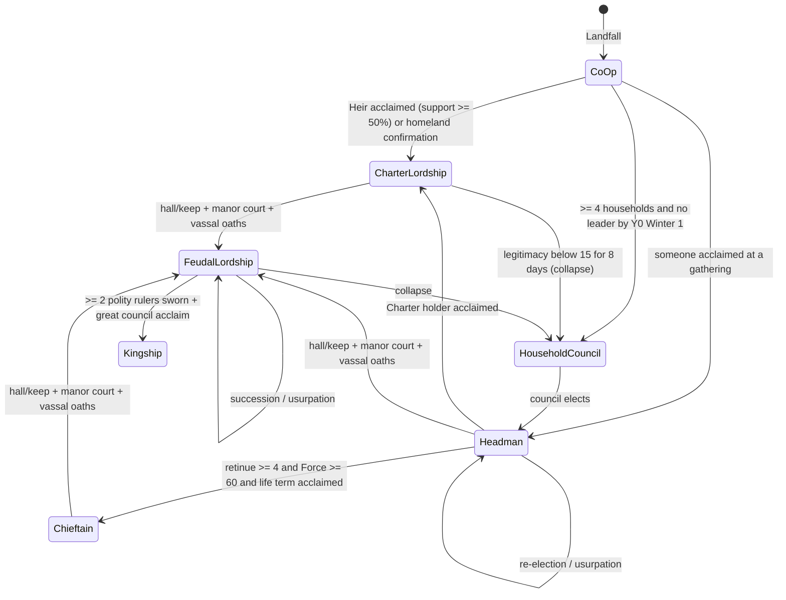
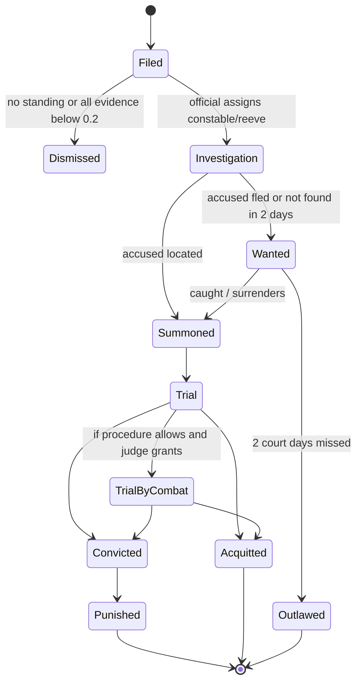

# 17 — Governance & Law

> **Status:** Draft v0.1 — revised for canon v0.3 (decision points) · **Owner doc for:** governance forms, leadership emergence, legitimacy, political factions, feudal obligations, laws & justice, court, succession, schism, diplomacy between polities · **Depends on:** [01-canon](../01-canon.md) (§5.3 Charter, §5.4 polity channels, §6 calendar, §7 eras, §10 person model, §13 LLM boundary), [15-economy-and-trade](15-economy-and-trade.md), [16-social-systems](16-social-systems.md), [18-conflict-and-warfare](18-conflict-and-warfare.md), [12-skills-and-professions](12-skills-and-professions.md), [14-technology-and-buildings](14-technology-and-buildings.md), [19-player-experience](19-player-experience.md), [21-npc-ai](../tech/21-npc-ai.md), [22-llm-integration](../tech/22-llm-integration.md)

The vision: *"If the player wants to be a leader, they need to get people on board with their
vision"*; *"if they steal they should expect … potentially authorities to find them"*; *"Lords and
kings must hold court and manage their kingdoms' finances."* This document defines who rules,
why anyone obeys, how laws are made and enforced, how the player rises (or falls), and how polities
deal with each other until [18](18-conflict-and-warfare.md) takes over at the declaration of war.

---

## Table of contents

1. [Scope, principles and interfaces](#1-scope-principles-and-interfaces)
2. [Polities, offices and powers](#2-polities-offices-and-powers)
3. [Governance forms and transitions](#3-governance-forms-and-transitions)
4. [Legitimacy and authority](#4-legitimacy-and-authority)
5. [Political factions](#5-political-factions)
6. [The player as leader: support and persuasion](#6-the-player-as-leader-support-and-persuasion)
7. [Paths to power](#7-paths-to-power)
8. [Councils and assemblies](#8-councils-and-assemblies)
9. [Feudal structure](#9-feudal-structure)
10. [Laws as data](#10-laws-as-data)
11. [Crimes and punishments](#11-crimes-and-punishments)
12. [The justice process](#12-the-justice-process)
13. [Holding court](#13-holding-court)
14. [Running a polity](#14-running-a-polity)
15. [Succession](#15-succession)
16. [Grievance, rebellion, schism and exodus](#16-grievance-rebellion-schism-and-exodus)
17. [Diplomacy between polities](#17-diplomacy-between-polities)
18. [LOD and Interlude behavior](#18-lod-and-interlude-behavior)
19. [LLM / Jev touchpoints](#19-llm--jev-touchpoints)
20. [Milestones](#20-milestones)
21. [Tuning knobs](#21-tuning-knobs)
22. [Exploits and mitigations](#22-exploits-and-mitigations)
23. [Headless validation](#23-headless-validation)
24. [Open questions](#open-questions)
25. [Proposed canon additions](#proposed-canon-additions)

---

## 1. Scope, principles and interfaces

| # | Principle | Consequence |
|---|-----------|-------------|
| G1 | **Authority is what people actually do.** A title is a claim; obedience is computed per person, per order. | A Charter heir can be ignored; a competent woodsman can be followed without any title. |
| G2 | **Institutions, not era labels.** Forms change when institutions and events change (a hall, a court, an oath, an acclamation), canon §7. | The same settlement can be a lordship in Y4 or a council in Y12. |
| G3 | **Same rules for the player.** The player's proposals, speeches, promises, bribes, crimes and trials run through the functions NPCs use. | The player can't "click to be king". |
| G4 | **Language decides, systems resolve** (canon §13). When an NPC must choose at an attended political moment — answering the player's proposal, voting in a session the player attends, judging the player's trial, answering a petition or an envoy — this document opens a **decision point (DP)**: it builds the menu (option ids, fixed parameters, eligibility, base propensity `p_i` from the formulas below, stakes), a decider picks (the LLM in its reply; the policy everywhere else), the DRE guards, and this document (or 15/16/18) executes. | Eloquence and skill widen the menu; the character still chooses; the systems enact the result. Unattended politics is policy-only. |
| G5 | **Disputes come from the sim.** Petitions, accusations and grievances are generated from real state (claims, debts, crimes, hunger) — never invented for flavor. | Court is a window onto the society, not a quiz. |

| Concept | Owner | Interface used here |
|---------|-------|---------------------|
| Opinion, Trust, Fear, reputation axes, memories, beliefs, rumors | [16](16-social-systems.md) | read; this doc emits opinion modifiers and memories |
| Crime detection, witnesses, evidence discovery | [16](16-social-systems.md) | consumes `Accusation` (§12.1) |
| Family tree, death events, marriage, faith | [16](16-social-systems.md) | consumes for succession, marriage petitions, Faith legitimacy |
| Prices, taxes (mechanics), ledger, debts, land claims, estates | [15](15-economy-and-trade.md) | this doc sets tax *policy* and rules on disputes |
| Fights, duels, coups-turned-fights, muster, war declaration process, war goals, battles | [18](18-conflict-and-warfare.md) | this doc supplies `Claim`, `CasusBelli`, `Treaty`, oath-breaking, and who may declare war |
| Buildings (hall, keep, court room, gaol, stocks) | [14](14-technology-and-buildings.md) | institution prerequisites |
| Traits, utility AI | [21](../tech/21-npc-ai.md) | trait flags |
| UI for court, council, ledger | [19](19-player-experience.md) | screens described here functionally |

**Inheritance is split three ways:** death event and family tree → [16](16-social-systems.md);
what property passes and how estates settle → [15](15-economy-and-trade.md) §10.6; **who the heir
is (succession rule)** → this document §15.

**Political factions** are not in canon's ownership map; this document claims them (§5) and proposes
that as a canon addition. Kin groups and friendships remain 16's.

**Decision points owned here** — stance (§6.9), bribe and threat responses (§6.6–6.7), coup recruitment
(§7.1), council votes (§8.3), verdicts and punishments (§12.6), witness answers and petitioner
reactions (§13.3), envoy responses (§17.6) — are catalogued in §19. Everywhere: the player's own
choices are the player's (UI or classified free text, with an intent echo, canon §13.5); deciders
pick only menu options and never set a number; critical options (canon §13.1) also need a
deterministic `p_i ≥ 0.25` computed without the player's words.

---

## 2. Polities, offices and powers

```csharp
record Polity(long Id, string Name, PolityKind Kind /*settlement|lordship|kingdom|outlaw_band*/,
              string GovernanceFormId, long RulerOfficeId, long[] SettlementIds, long? LiegePolityId,
              string LawCodeId, long TreasuryId, string CultureId, string FaithId,
              List<long> ClaimIds, List<long> TreatyIds);
record Office(long Id, long PolityId, string Title, long? HolderId, AppointmentRule Rule,
              int? TermDays, Power[] Powers, int WageFPerDay);
enum AppointmentRule { Acclaim, Election, Appointment, Inheritance, Designation, Conquest }
enum Power { Order, ProposeLaw, EnactLaw, LevyTax, Appoint, Dismiss, HoldCourt, Pardon, GrantLand,
             GrantRight /*market, fair, trade license, mint*/, Mint, Muster, DeclareWar, MakeTreaty,
             Banish, Outlaw, Knight, CallAssembly }
```

Any adult may **call a gathering** and **make a proposal**; only office holders hold other powers.
Powers by form are in §3.1; enacting anything still requires that people comply (§4.5).

---

## 3. Governance forms and transitions

### 3.1 Forms

| Form | Typical era | Ruler | Institutions (prerequisites) | Decision process | Powers of the ruler | Legitimacy leans on |
|------|-------------|-------|-------------------------------|------------------|---------------------|--------------------|
| **Co-op** (Landfall) | 0 | None formally; the Heir claims by Charter; de-facto leaders emerge | The fire circle | **Acclaim** at a gathering (§8) | Heir: Order (by claim only) | Tradition vs. Competence — the canon §5.3 contest |
| **Household Council** | 1 | Chair (eldest head, or rotating each season) | ≥ 4 permanent households; a meeting place | Heads vote; majority, quorum ½ | Chair: CallAssembly | Popularity, Tradition (elders) |
| **Headman** | 1–2 | Headman, acclaimed or elected for 1 year (32 days) or life | Council of heads advises; a reeve | Headman decides minor matters; council majority for laws and taxes | Order, HoldCourt, Appoint (reeve), LevyTax (with council) | Competence, Popularity |
| **Chieftain** | 1–2 (Brannoch style) | Chief with armed retinue; tanist (heir-elect) | Hall; retinue ≥ 4 armed | Chief decides; kin council acclaims the tanist | + Muster, Banish | Force, Tradition (kin) |
| **Charter-lordship** | 0–2 | The Charter holder recognized as lord under homeland law | Charter in hand; acclamation or homeland confirmation | Lord decides; council advisory | Order, HoldCourt, LevyTax, GrantLand, Appoint | Tradition (Charter, homeland) |
| **Feudal lordship** | 3 | Lord | Hall or keep; manor court; ≥ 2 sworn vassals or ≥ 1 knight's fee granted; steward | Lord decides; **great council** consent for extraordinary levies and offensive war (Varrow custom) | All except DeclareWar without consent where custom requires | Tradition, Force, Faith |
| **Kingship** | 4 | King | Royal hall/castle; ≥ 2 sworn polity rulers; great council of lords | King decides; great council | All; + Knight, grant titles | All five |
| *Variant:* **Elders' Synod** | any (Ashen Reform) | Council of elders | Meeting house; chaplain | Elders' majority; faith-law binding | as Headman | Faith |
| *Variant:* **Merchant Council** | 2+ (Osmeri) | Council of masters, votes weighted by wealth | Market; ≥ 3 shops | Weighted majority | as Headman + GrantRight, Mint | Competence, Popularity |
| *Variant:* **Outlaw Band** | any | Strongest/most feared | Camp | Leader decides | Order, Banish | Force |

### 3.2 Transitions



| Transition kind | Procedure | Conditions | Legitimacy effect |
|-----------------|-----------|------------|-------------------|
| **Acclaim** | Gathering vote on a "make X leader" proposal (§8) | Attendance ≥ 40% of adults; weighted support > 50% | Tradition +15 ("chosen by custom") |
| **Election** | Council vote | Quorum; rule per form | Tradition +15 |
| **Appointment** | Liege appoints (vassal lord, official) | Liege holds Appoint/GrantLand | Inherits liege's Tradition × 0.5 |
| **Inheritance** | §15 | Rule-heir with uncontested claim | Tradition carried over (−10 if minor) |
| **Usurpation / coup** | §7.2 | Force ratio ≥ 1.5 at the moment | Tradition −30 (recovers +5/year) |
| **Conquest** | [18](18-conflict-and-warfare.md) outcome | War won | Force high; Tradition 0 until treaty/oaths |
| **Exodus** | §16.4 | Faction leaves | Faction leader becomes Headman/Chieftain of the splinter |
| **Collapse** | Ruler's legitimacy < 15 for 8 days | — | Office vacant; form reverts to Household Council; a gathering follows |
| **Institutional upgrade** | Ruler issues a proclamation when prerequisites exist | Legitimacy ≥ 50 | None by itself; upgrades unlock powers |

---

## 4. Legitimacy and authority

### 4.1 Sources (each 0–100, per ruler, some per-observer)

| Source | Measured from sim state |
|--------|-------------------------|
| **T — Tradition / Charter** | Rightful heir *and* holds the Charter: +40 (rightful heir without it: +20; non-heir holding it: +10). Homeland confirmation by ship decree: +20 (decays −2/season after the Silence). Child or designated heir of the previous legitimate ruler: +20. Came to power by recognized procedure (acclaim, election, inheritance): +15; usurper: −30 (+5/year). Oath-bound to a recognized liege: +10. Years in office: +2/year (max +20). Clamp 0–100. |
| **C — Competence** | 50 + 16-day EMA terms: food security vs. 8-day target (±20); violent deaths and raid losses (−5 each, max −20); median household wealth change (±10); petitions resolved vs. backlog (±10); promises kept ratio (±10); war outcomes (±15, from 18). Per observer: `C_i = C + 0.3·(i's own wellbeing change)` — the hungry judge harshly. |
| **P — Popularity** | `P_i = 50 + Opinion_i(ruler)/2` |
| **F — Force** | `100 · LoyalArmed / (LoyalArmed + OtherArmed + 1)`, where LoyalArmed counts armed adults with Opinion of the ruler ≥ 20 or sworn to them; + ruler's Courage reputation/5. Per observer: `F_i = F + Fear_i(ruler)/2`, clamp. |
| **R — Faith** | `40 + 30·[endorsed by chaplain/priest] − 40·[denounced] + Piety reputation/4`; per observer ±20 for same/different faith. |

**The Charter is an item** (`item.charter`, canon §5.3) with legal effect. It can be stolen (the
thief gains only +10), **forged** (Letters ≥ 60; a clerk with Letters ≥ 50 detects with p = 0.5 per
inspection) or **burned** — a political act that removes the +40/+20 Charter term for everyone once
the news spreads, outrages Tradition-valuing people (Opinion −20 of the burner) and frees the colony
from homeland law.

### 4.2 Per-observer weighting

Each adult `i` weighs the sources by their values (canon §10.4) and culture:

```
w_T = (0.5 + Tradition/100 + Loyalty/200) · cult_T
w_C = 1.0 · cult_C
w_P = (0.5 + Freedom/100 + Fairness/200) · cult_P
w_F = (0.25 + (Honor + Status)/400) · cult_F
w_R = (Faith/100) · cult_R
normalize so Σw = 1
L_i(ruler) = Σ_k w_k · s_k(ruler, i)                       // 0–100
```

| Culture | cult_T | cult_C | cult_P | cult_F | cult_R |
|---------|-------:|-------:|-------:|-------:|-------:|
| Varrow | 1.3 | 1.0 | 1.0 | 1.0 | 1.0 |
| Osmeri | 1.0 | 1.2 | 1.2 | 0.8 | 0.8 |
| Brannoch | 1.2 | 1.0 | 1.0 | 1.3 | 0.9 |
| Ashen Reform | 0.9 | 1.0 | 1.0 | 0.8 | 1.5 |

**Aggregate legitimacy** `L(ruler) = Σ_i inf_i · L_i / Σ_i inf_i`, with influence
`inf_i = 1 (adult) + 0.5·[household head] + 1·[office holder] + Renown/50 + 2·[vassal lord] + 1·[knight]`;
children have 0.

### 4.3 Events that shift legitimacy (examples)

| Event | Effect |
|-------|--------|
| Resupply ship brings homeland confirmation of the Heir | T +20 |
| The Silence | homeland confirmation term decays |
| Famine (food security < 2 days for 4 days) | C −15 |
| Raid repelled / lost | C +5 / −10; F ±5 |
| A just verdict seen as just by most onlookers | C +0.5, P via opinions (§13.4) |
| Broken public promise | C −5; Opinion −20 among those who heard (§6.6) |
| Debasement discovered | C −10; Honesty −15 ([15](15-economy-and-trade.md) §8.4) |
| Feast or alms in hard times | P via Opinion +5 to recipients |
| Chaplain endorses / denounces | R +30 / −40 |
| Ruler breaks an oath | T −20, Honor −30 |

### 4.4 Authority: will this person obey this order?

When a ruler (or anyone claiming authority) issues an order `o` to person `i`:

```
x = 0.5
  + 2.0 · (L_i − 50)/50                      // perceived right to command
  + 1.0 · Opinion_i(ruler)/100
  + 1.5 · E · Fear_i(ruler)/100              // E = enforcement capacity, 0..1
  + 1.0 · Align_i(o)                         // −1..1, value alignment of the order (§6.2 vectors)
  − 2.5 · Cost_i(o)                          // 0..1: labor days/4 + goods/wealth + danger, clamp
  + (Loyalty_i − 50)/100 − (Freedom_i − 50)/100
  − 0.5·[Stubborn] − 1.0·[faction grievance ≥ 50]
P(comply) = 1 / (1 + e^(−x))
E = min(1, 5 · LoyalEnforcers / adults)     // constables, men-at-arms, retinue
```

Non-compliance splits into **drag feet** (does it late/half: if `x > −1`), **quiet refusal**, or
**open refusal** (if Volatility ≥ 65 or Opinion ≤ −40) — open refusal is a public challenge that the
ruler must answer (punish → Force/Fear; ignore → C −2).

### 4.5 Worked example — Landfall, Day 3: who gets followed?

*The Heir (17, illustrative) holds the Charter; an Ember priest endorses him. **Hallam**
(illustrative), a 38-year-old ex-sergeant, found water and organized shelters on Days 1–2. Two of
the late lord's men-at-arms are loyal to the house; Hallam and three hunters are armed and loyal to
Hallam.*

| Source | Heir | Hallam |
|--------|-----:|-------:|
| T | 60 (rightful heir + Charter 40, lineage 20) | 10 |
| C | 45 | 70 |
| F | 100·2/7 = 29 | 100·4/7 = 57 |
| R | 70 | 40 |
| P | 50 + Opinion/2 | 50 + Opinion/2 |

**Mara** (Tradition 70, Loyalty 60, Freedom 40, Fairness 50, Honor 50, Status 40, Faith 60; Opinion of
Heir +10, of Hallam +30): weights T .377, C .193, P .222, F .092, R .116 →
**L(Heir) = 54**, **L(Hallam) = 42**.
**Tobin** (Tradition 30, Loyalty 40, Freedom 70, Fairness 60, Honor 60, Status 50, Faith 30; Opinion of
Heir −10, Hallam +40): weights T .281, C .216, P .324, F .114, R .065 →
**L(Heir) = 49**, **L(Hallam) = 50**.

Two orders on Day 3 (20 adults; `E` = 5 × loyal armed / adults):

| Order | Who | Cost | Align | P(comply) Mara | P(comply) Tobin |
|-------|-----|-----:|------:|---------------:|----------------:|
| A: "All salvage to my tent, issued by my hand." | Heir (E 0.5, Fear 0) | Mara 0.1, Tobin 0.3 | Mara +0.3, Tobin −0.4 | **0.74** | **0.25** |
| B: "Shelters before dark; sorting waits." | Hallam (E 1.0; Mara's Fear 10, Tobin's 0) | 0.3 | +0.5 (Safety) | **0.64** | **0.58** |

Read: the traditionalist obeys the Heir's property order and grudgingly the sergeant; the
free-spirited man resists the Heir and follows the sergeant who has no title at all. Over the
first season, Hallam's Competence and the Heir's Tradition race — exactly canon §5.3's
"legitimacy-by-charter vs. legitimacy-by-competence".

---

## 5. Political factions

A **faction** is a set of people who share a political position and act together. Factions emerge;
they are not authored.

```csharp
record Faction(long Id, long PolityId, string Label /*LLM-named from facts, e.g. "the Charter men"*/,
               long? LeaderId, Dictionary<long, float> Membership /*person → 0..1*/,
               Dictionary<string, float> Agenda /*issueId → desired position −1..1*/,
               float Cohesion /*0..100*/, float Grievance /*0..100*/, float Power);
```

- **Issues** are live political questions (e.g. `issue.heir_authority`, `issue.common_stores`,
  `issue.lay_tithe`, `issue.war_with_X`, `issue.faith_toleration`). Each adult's stance on each issue
  is their support `U` (§6.2) for the proposal that would change the status quo.
- **Clustering** (every 8 days; LOD3-cheap): k-medoids over stance vectors (issues + support for the
  ruler), seeded by kin, faith, culture and household ties; clusters with ≥ 4 adults and mean
  pairwise Opinion ≥ 0 become factions. Membership = similarity to the medoid, 0–1.
- **Cohesion** = 50 + mean pairwise Opinion among members/2 + 10·[shared faith] + 10·[shared homeland].
- **Power** = Σ members' `inf_i · membership` × (1.5 if armed).
- **Leader** = argmax of `Leadership + Renown + 20·[Ambitious] + 10·[Brave] + mean member Opinion/2`.
- The faction label is LLM-generated from structured facts (fallback: "{leader}'s people").

Grievance, ultimatums, revolt and exodus are in §16.

---

## 6. The player as leader: support and persuasion

### 6.1 Proposals

Everything political is a **proposal**: structured, data-defined, with effects the sim can evaluate.

```csharp
record Proposal(long Id, long ProposerId, string TypeId, Dictionary<string, object> Params,
                Venue Venue /*gathering|council|court|private*/, long CreatedAt, long? VoteAt);
```

| Proposal type | Params | Value-effect vector (sign of effect on value-holders) | Self-interest computed from |
|---------------|--------|--------------------------------------------------------|-----------------------------|
| `make_leader` | person, form | Tradition +(if heir), Loyalty + | expected favor from candidate (Opinion) |
| `divide_stores` | rule (equal / by household size / by labor) | Freedom +, Fairness ±(rule), Wealth +, Tradition − | Δ own share vs. communal ration |
| `adopt_law` | law id/params | per law (e.g. theft law: Fairness +, Freedom −) | exposure to the law |
| `set_tax` | tax id, rate | Wealth −, Tradition − if above custom | Δ own burden |
| `build_project` | building, funding | Safety/Status + | own labor cost vs. benefit |
| `grant_land` | parcel, recipient | Fairness ± | own claim affected |
| `war` / `peace` | target | Honor +, Family −, Safety ± | own risk of muster |
| `exodus` | destination, leader | Freedom +, Tradition − | Δ expected status |
| `banish` | person | Fairness ±, Loyalty − (if kin) | Opinion of the person |

### 6.2 Individual support

```
U_i(p) = 0.30 · ValueAlign_i(p)        // Σ_v importance_iv/100 · effect_pv / Σ importance, in −1..1
       + 0.30 · SelfInterest_i(p)      // clamp(Δ expected wealth/wealth + Δ safety + Δ status, −1..1)
       + 0.20 · Opinion_i(proposer)/100 · (0.5 + Trust_i(proposer)/200)
       + 0.10 · FactionStance_i(p)     // faction agenda position × membership
       − 0.10 · StatusQuoBias_i        // (Tradition_i/100) for change proposals
       + Promise_i(p) + Bribe_i(p) + Intimidation_i(p)   // acts, deterministic (§6.5–6.7)
       ─────────────────────────────── = U⁰_i(p), the words-free support
       + G_i(p)                        // words: the reach granted so far, |G_i| ≤ M_i (§6.3, §6.9)
Stance bands:  U ≥ 0.30 Support · 0.10–0.30 Conditional support · −0.10–0.10 Undecided
               · −0.30–−0.10 Oppose · ≤ −0.30 Oppose loudly
```

`U` is the **base propensity** behind every political DP (§6.9 stance, §8.3 vote, §7.1 recruitment).
Words enter only as `G_i`: speech and skill set the menu width `M_i` (§6.3), and a decider's choice
of stance or vote fixes how much of it is granted (§6.9).

The player's **Support panel** shows, per person, the stance *as the player believes it* (from
conversations and rumors — beliefs owned by [16](16-social-systems.md)), plus the top reasons the NPC
has *told* the player. Persuasion skill ≥ 40 reveals one hidden reason per conversation; Perception
reveals nothing — people tell you or they don't.

### 6.3 Speeches and arguments

A speech (at a gathering, council, or one-to-one) is free text from the player or generated for
NPCs. One fast-decider call (canon §4.1; player text delimited as untrusted data, questions framed
by the sim) classifies it. The classification feeds the **policy** (`L_words`), promise extraction and
proposal matching; when an LLM is answering the player, it reads the speech itself and decides (§6.9).

| Q | Type | Question | Output |
|---|------|----------|--------|
| S1 | choice (9 + none) | Which values does this speech appeal to? | probability per value (Family, Wealth, Status, Honor, Tradition, Faith, Fairness, Freedom, Loyalty) |
| S2 | score (5) | How clear, well-reasoned and moving is it, for this audience (sim summary)? | `W` = E[level]/4 |
| S3 | choice | Tone | inspiring, reasoned, humble, arrogant, threatening, insulting |
| S4 | noul | Does the speaker commit to a future action? | → promise extraction (§6.5) |
| S5 | choice | Which pending proposal is this speech about? | among sim-listed proposals |

Per listener `i` — **menu width** (canon §13.4) and the **policy's words signal**:

```
K_sp      = (0.6·Persuasion + 0.4·Leadership)/100                 // the speaker's skill (K_skill)
S_i       = susceptibility as in 15 §5.5, using Leadership/Persuasion gap instead of Commerce gap,
            + 0.1·[same faction as speaker] − 0.1·[opposing faction]          // s ∈ [0.05, 1]
M_i       = C_pol · S_i · (0.5 + 0.5·K_sp),   C_pol = 0.15            // menu width: how far words can move U
            total over all speeches on p per listener; each further speech by the same speaker on p
            heard by i within 8 days can add at most 0.6^n of M_i
// Policy only (when no LLM is deciding for i):
Appeal_i  = Σ_v p_v · importance_iv/100 · sign(effect_pv)       // appeals to values the proposal really serves
v         = +1 if Appeal_i > 0.15;  0.5 if |Appeal_i| ≤ 0.15;  −1 if Appeal_i < −0.15
tone mod  = arrogant: v −0.2 unless Status_i ≥ 60; threatening → routed to intimidation (§6.7); insulting → 16's insult rules
L_i       = 0.5 · W·v + 0.5 · K_sp                                // canon §13.4: words and skill weigh equally
step      = round(3·L_i)/3 ∈ {−1, −⅔, −⅓, 0, ⅓, ⅔, 1}            // the discrete share of M_i granted
G_i(p)   += step · M_i  (respecting the totals above; |G_i| ≤ M_i)
```

The **guard propensity** (canon §13.1 floors, long-shot budget, critical check) is always computed
with `L_words = 0`, i.e. `step = round(1.5·K_sp)/3` — it never sees the player's text. Listeners not
present hear a **rumor** of the speech (16): `M_i` ×0.3. NPC speakers use the same formula with `W`
drawn from their Persuasion (as in 15 §5.10). **Fallback:** a speech builder of structured choices
(pick two values to appeal to and a tone) with `W` = 0.5.

### 6.4 Rallies and feasts

A **feast** costs at least 2 ration-days per guest ([15](15-economy-and-trade.md) prices). Each guest:
Opinion of host +5 (+3 more if hungry), Mood +10 for a day, and the speech at a feast gets
`S_i + 0.1`. A **rally** is a gathering whose only agenda is the speaker's proposal; attendance is
`0.2 + 0.6·max(0, U_i)` — rallies mostly reach the already-sympathetic (preaching to the choir is
real).

### 6.5 Promises are obligations

S4 = yes triggers extraction: the LLM (structured output) maps the promise onto a **promise template**
the sim offers (`lower_tax`, `grant_land`, `build`, `share_stores`, `appoint`, `marry`, `avenge`, `pay`),
with parameters filled by UI confirmation — the player sees "You are promising: *lower the tithe to
1/20 by Y3 Winter 1*. [Promise] [Rephrase]". NPCs only treat confirmed promises as promises (an
unconfirmed vague statement is remembered as "talk").

```csharp
record Obligation(long Id, long DebtorId, long[] BeneficiaryIds, string TemplateId, Dictionary<string,object> Params,
                  long DueAt, long[] WitnessIds, ObligationStatus Status /*open|kept|broken|released*/);
```

- `Promise_i(p) = 0.3 · Value_i(promised outcome) · Credibility_i`, with
  `Credibility_i = Trust_i(promiser)/100 · (0.5 + Honesty_rep/200)`.
- **Kept:** Trust +10 with beneficiaries; Honesty +3 community. **Broken** (due passes): Trust −20 and
  Opinion −15 for every beneficiary and witness; Honesty −10; faction grievance +15 (§16). Obligations
  persist into Interludes (the Chronicle reports them).

### 6.6 Bribery

A bribe is an **offer**, not a speech. The briber picks the amount `g` (f) and the proposal from a
menu (UI, or classified free text confirmed by an intent echo, canon §13.5). The recipient answers
with the **bribe DP** `dp.bribe_offer`:

| Option | Fixed parameters | Eligibility | `p_i` (guard: words-free) | Executed by |
|--------|------------------|-------------|---------------------------|-------------|
| `accept` | `g`; adds `Bribe_i` to U | always | `(1 − r)·(1 − a)` | 15 moves the coin (gift ledger); this doc adds `Bribe_i` |
| `ask_more` | `g* = g` needed for `Bribe_i ≥ 0.30 − U⁰_i`, capped at 4·g | briber can afford `g*` | `(1 − r)·a`, `a = 0.3·[Greedy] + 0.2·[g < g*]` | Re-offer at `g*` (the briber's choice) |
| `refuse` | — | always | `r·(1 − d)` | 16: Opinion −5 |
| `refuse_and_denounce` | — | always | `r·d`, `d = 0.3 + 0.3·[i holds office ∧ bribery is a crime here]` | 16: Opinion −10, rumor "tried to buy me"; if the law lists bribery (§11), an `Accusation` (16 §10) |

```
Bribe_i = min(0.4, 0.5 · g/(g + 0.1·wealth_i)) · (1 − Honor_i/100) · (1.5 if Greedy)
r       = clamp(Honor_i/100 · (1.5 if Honest) · (0.5 if Greedy), 0.05, 0.95)     // refusal propensity
```

Stakes: medium; **critical if `g` ≥ 960f** (canon §13.1 transfer threshold). Repeating a refused offer
to the same person multiplies acceptance by `0.5^(n−1)` and raises Anger (canon §13.4). Bribing an
official or juror is a crime if the law code lists it (§11).

### 6.7 Intimidation

A threat is the speaker's own act (classified by S3, shown as an intent echo, or a structured
*Threaten* action). It always costs Opinion −10 and adds +5 grievance to i's faction (16). The
target answers with the **threat DP** `dp.intimidation`:

| Option | Effect (fixed) | Eligibility | `p_i` | Executed by |
|--------|----------------|-------------|-------|-------------|
| `yield` | `Intimidation_i = 0.4·Fear_i(speaker)/100` added to U **for public stances and open votes only** | always | `y = clamp(0.4·Fear/100 + 0.2·[Coward] − 0.2·[Brave] − 0.1·[faction grievance ≥ 50], 0.02, 0.9)` | this doc (U term) |
| `defy` | none | always | `(1 − y)·(1 − e − t)` | 16 (Opinion, memory) |
| `report` | an `Accusation` (threats) if the law lists it; tells kin and faction | the speaker is not the ruler | `(1 − y)·t`, `t = 0.2 + 0.3·Fairness_i/100` | 16 §10, §12 |
| `retaliate` | a severity-3 provocation against the speaker | always | `(1 − y)·e`, `e` = P(rung ≥ Threat) for that provocation under 16 §9.2, capped at 0.5 | 16 §9 escalation; any fight by [18](18-conflict-and-warfare.md) |

Stakes: medium (`retaliate` follows 16/18's stakes for the rung reached). **Secret ballots nullify
`yield`** — voting rules matter (§8.3).

### 6.8 Worked example — "Divide the stores"

*Y0 Summer 6, gathering of 20 adults. The player (Persuasion 45, Leadership 30) proposes
`divide_stores(rule = by household size)` and says: "We bled for these fields together. Each
family should keep what feeds its own children, and no one man's tent should hold the winter."*

Fast decider: S1 → Family 0.55, Fairness 0.30, Freedom 0.10; S2 → `W` 0.75; S3 → inspiring; S4 → no.
Proposal effects: Family +, Fairness +, Freedom +, Wealth +, Tradition −. `K_sp` = 0.39. All three
listeners below have Appeal > 0.15 (`v` = +1). They stay silent, so the **policy** decides for them:
`L` = 0.5·0.75 + 0.5·0.39 = 0.57 → step ⅔ (the words-free guard step is ⅓).

| Listener | Values (Fam/Fair/Trad) | U⁰ | S | Width `M` | Menu (§6.9) | Policy `p_i` (guard `p_i`) | Most likely |
|----------|------------------------|---:|--:|----------:|-------------|----------------------------|-------------|
| Mara (mother of 3) | 80/50/70 | +0.06 | 0.60 | 0.063 | undecided · conditional | 0.49 · 0.51 (0.65 · 0.35) | Conditional support |
| Tobin | 40/60/30 | +0.22 | 0.45 | 0.047 | conditional · support | 0.83 · 0.17 (0.90 · 0.10) | Conditional support |
| The Heir | 50/40/90 | −0.45 | 0.20 | 0.021 | oppose loudly | 1.0 | Oppose loudly |

The speech can tip the waverers; it cannot turn the Heir — no step of his narrow menu reaches even
plain opposition, because his self-interest (losing control of the stores) dominates.

**The same moment in conversation.** Had the player taken Tobin aside first, the LLM would choose in
his reply from the same menu. `support` is a long shot (guard `p_i` 0.10 < 0.20) that favors the
player, so choosing it spends one of the pair's two long shots for the day (canon §13.1). Mara's
`conditional_support` carries the price the sim named from her largest term (Family): the promise
`share_stores(seed grain set aside per child before division)`. If the player confirms it (§6.5), she
counts as support and the Obligation binds the player. The vote (§8.3) passes 12–6 with 2
abstentions; the Heir's faction grievance rises — and the next chapter begins.

### 6.9 The stance decision point

Opened when an NPC must take a position on a proposal in front of the player: the player asks them
in conversation ("Will you back me?"), they speak at a session the player attends (§8.2), or the player
addresses them there. Silent listeners at an attended assembly, NPC↔NPC canvassing (overheard or not)
and all unattended politics are decided by the **policy** (§6.3 step, then the §8.3 vote).

| Option | Fixed parameters | Executed as (this doc) |
|--------|------------------|------------------------|
| `support` | step `k` | `G_i := k·M_i`; votes yes; speaks for p if asked |
| `conditional_support` | step `k`; **named price** | If the proposer accepts the price, it becomes an Obligation (§6.5) or a payment (15) and the stance counts as `support`; otherwise the vote is left to §8.3 |
| `undecided` | step `k` | `G_i := k·M_i`; vote left to §8.3 |
| `oppose` | step `k` | `G_i := k·M_i`; votes no |
| `oppose_loudly` | step `k` | Votes no; claims an opposing speaking slot (§8.2); tells 1–3 contacts against p (16 gossip) |

- **Eligibility = the menu width.** An option is on the menu iff its stance band (§6.2) intersects
  `[U⁰_i − M_i − ε, U⁰_i + M_i + ε]`, with `ε = 0.05` (the §8.3 irrationality noise). Its step `k` is
  the smallest-magnitude value in `{0, ±⅓, ±⅔, ±1}` that puts `U⁰_i + k·M_i` in (or nearest to) its band.
- **Named price** (computed by the sim, never by the decider): i's price list holds promise templates
  (§6.5) on i's largest self-interest or value term, with sim-filled parameters, and the payment `g*`
  that would close the gap to 0.30 under §6.6. The named price is the item i values most that the
  proposer can deliver; if there is none, `conditional_support` is ineligible.
- **Base propensity:** `p_i` = the mass of `N(U⁰_i + k_pol·M_i, 0.05)` in each eligible band,
  renormalized, where `k_pol` is the §6.3 policy step. The guard's `p_i` uses the words-free step.
- **Stakes:** medium; high for `make_leader`, `banish`, `exodus`, `war`/`peace`. A stance is never
  critical; the vote on a declaration of war is (§8.3).
- **Decider:** the LLM, decision-first in the NPC's reply; after the 4 s deadline, the policy.
- **Commitment:** the chosen stance is remembered as a public statement (16 memory). Asking the same
  person again for the same proposal multiplies `support` and `conditional_support` propensities by
  `0.5^(n−1)` and raises Anger (canon §13.4).

---

## 7. Paths to power

| Path | How (player and NPC alike) | Key thresholds |
|------|----------------------------|----------------|
| **Be chosen** | Build support (§6), then propose `make_leader(you)` at a gathering or council | Weighted support > 50% with attendance ≥ 40% (gathering) or quorum (council) |
| **Be appointed** | A ruler appoints you to an office (steward, reeve, constable, marshal, herald) | Ruler's Opinion of you ≥ 30 and the office's skill ≥ Journeyman (§14.2) |
| **Seize power (coup)** | §7.1 | Force ratio ≥ 1.5 at the moment of action |
| **Found your own settlement (exodus)** | Lead a faction out (§16.4) | ≥ 6 adults, ≥ 16 ration-days of food per person |
| **Receive a grant (vassalage)** | Service → knighthood → fief (§9.4) | Renown ≥ 30, Melee ≥ 40, liege's Opinion ≥ 40 |
| **Marry into power** | Romance and marriage ([16](16-social-systems.md)); spouse of a ruler may be regent or designated heir | per §15 |
| **Inherit** | Be the rule-heir; under Lineage play (canon §12) the player's heir continues | per §15 |

### 7.1 Coups

1. **Conspire.** The plotter privately proposes `seize_power` to individuals. Each recruit decides
   with `U` (§6.2) plus a risk term `−0.3·(1 − F_plotters/F_ruler)`. Each approach risks
   **betrayal**: `p = (1 − Trust_i(plotter)/100) · (0.5 + Loyalty_i/200) · [Opinion_i(ruler) > Opinion_i(plotter)]`;
   a betrayer informs the ruler → `Accusation(treason)` with evidence 0.6. When the player does the
   recruiting in conversation, the recruit's answer is a DP (LLM in reply; policy otherwise):
   `join` · `join_for_price` (named price as §6.9) · `refuse_silently` · `inform_ruler` (the betrayal
   above), with `p_i` from that `U` and the §6.9 menu width, and the betrayal `p` for
   `inform_ruler`; stakes high.
2. **Strike.** At a chosen moment, compare armed conspirators present vs. ruler's loyal armed present
   (fights resolved by [18](18-conflict-and-warfare.md) if both sides stand). Success requires
   holding the hall/keep and the ruler (or the Charter) at day's end.
3. **Aftermath.** Success: new ruler with T −30 (usurper), F from the conspirators; Tradition-valuing
   adults' Opinion −20; the deposed ruler's faction grievance +40. Failure: treason trial (§12).

---

## 8. Councils and assemblies

### 8.1 Bodies

| Body | Members | Meets | Quorum | Default rule |
|------|---------|-------|--------|--------------|
| **Gathering** | All adults present | When called: by anyone with Renown ≥ 20 or an office; attendance `p = 0.3 + 0.5·interest + 0.2·[called by ruler] − 0.3·[busy]` | ≥ 40% of adults | Weighted majority (influence `inf_i`) by show of hands |
| **Household Council** | Heads of household | **Day 8 evening** (after the Hearth Market) | ½ | Simple majority |
| **Village council / moot** | Elected heads (1 per ~5 households) | Day 8 evening | ½ | Simple majority; ⅔ for law changes |
| **Lord's council** | Officials + vassals present | At the lord's call | — | Advisory; the lord decides |
| **Great council** | Vassal lords and knights | Day 1 of Spring and Autumn (with court), or summoned | ½ of vassals | Majority **consent** needed for extraordinary levy and offensive war (Varrow custom) |
| **Merchant council** (Osmeri) | Masters of shops | Day 4 after market | ½ | Wealth-weighted majority, **secret ballot** (pebbles) |
| **Elders' synod** (Ashen) | Elders (55+ or ordained) | Day 8 | ⅔ | ⅔ majority; faith-law can't be overruled |

Voting rules are data (`VotingRule { quorum, threshold, weighting, secret, vetoHolder }`) and can be
changed by proposal — itself voted under the old rule.

### 8.2 Debate

```
Agenda: proposals in order of submission (max 3 per session).
For each proposal:
  1. Proposer speaks (player: free text or speech builder; NPC: generated).
  2. Speakers queue: up to 2 strongest opponents and 2 supporters, ranked by |U| × (Renown + Leadership)/2,
     plus anyone who chose oppose_loudly (§6.9); the player may claim a speaking slot any time (one per proposal).
  3. Each speech sets the menu width M_i (§6.3) for every member present (NPC speeches use skill-drawn W).
     Session attended by the player: each NPC speaker's stance is a §6.9 DP, chosen by the LLM
     decision-first in the same output that voices the speech; the speech is built from structured
     reasons — the top-3 contributing terms of the speaker's U (e.g. "Self-interest: my household
     would lose 40 rations"; "Value: Tradition"). Silent members: policy (§6.3 step).
     Unattended session: no speech text is generated; every member's step and stance are policy.
  4. Amendments: any member may propose a parameter change (e.g. rate 1/12 instead of 1/10);
     amendments are voted first. An NPC speaker's `propose_amendment(step)` is a menu option whose
     steps are the law parameter's discrete steps (one step toward the speaker's preferred value).
  5. Vote (§8.3).
```

### 8.3 How NPCs vote

Each member's vote is the **vote DP** `dp.council_vote`:

| Option | Eligibility (menu width, §6.9) | `p_i` | Executed by |
|--------|--------------------------------|-------|-------------|
| `yes` | `U⁰_i + M_i + ε > 0.05` | `P(U_i + N(0, 0.05) > 0.05)` | this doc: tally under the `VotingRule` |
| `no` | `U⁰_i − M_i − ε < −0.05` | `P(U_i + N(0, 0.05) < −0.05)` | tally |
| `abstain` | the interval `[U⁰_i − M_i − ε, U⁰_i + M_i + ε]` meets `[−0.05, 0.05]`, and the member is not compelled | the remainder | tally |

`U_i` includes the granted words `G_i`, and on open votes the intimidation (`yield`, §6.7) and
visible-loyalty terms (`+0.1·FactionStance` peer pressure); **secret ballots** remove both, and
members compelled to vote lose `abstain` (its mass goes to the sign of `U_i`). `p_i` is renormalized
over eligible options; the guard's `p_i` uses words-free `G_i`.

- **Who decides:** a member who chose a stance this session (§6.9) votes by it (`support` → yes;
  accepted `conditional_support` → yes; `oppose`/`oppose_loudly` → no). Otherwise the policy samples
  `p_i`. A speaking member at an attended session whose stance is still open may choose the vote
  directly in their speech (LLM).
- **Stakes:** low for ordinary business; high for laws, taxes, `make_leader`, `banish`, `exodus`;
  **critical for a vote to declare war** (canon §13.1: deterministic `p_i ≥ 0.25`, words-free).
- **Veto:** a ruler with veto may overturn a vote at C −3 and P (Opinion −5 among the majority). An
  NPC ruler's veto at a session the player attends is a DP (`accept_result` · `veto`), high stakes,
  `p(veto) = clamp(0.5 − 2·U_ruler(result), 0.02, 0.9) · (0.5 if L(ruler) < 40)`; LLM in the ruler's
  closing words, policy otherwise.

---

## 9. Feudal structure

### 9.1 Ranks

| Rank | Holds | Owes upward | Is owed |
|------|-------|-------------|---------|
| **King** | Realm; demesne | (God/none) | Oaths of lords |
| **Lord** (tenant-in-chief) | Lordship of ≥ 1 settlement | To a king if sworn: service, counsel, aids | Oaths of vassals; dues from tenants |
| **Vassal lord / Knight** | A **fief** (§9.2) | **8 days of field service per year** (or scutage 240f — [15](15-economy-and-trade.md) §11.1), castle guard 4 days/year, counsel at great council, **aids** (lord's ransom, knighting of the heir, marriage of the eldest daughter), **relief** on inheriting (1 year's rent of the fief) | Protection, justice in the lord's court, the fief's income, maintenance if landless |
| **Freeman** (freeholder or free tenant) | Land by rent or freehold; may leave | Rent, hearth tax, tithe, 1 Autumn boon day, militia muster (18) | Protection, justice, right to leave and to plead in court |
| **Burgess** | House in a chartered town | Town rent, tolls, watch duty | Market freedom, town court |
| **Serf** | A holding on the manor | **Corvée 2 labor-days/season + 1 Autumn boon day per household**, rent in kind, tithe, merchet, heriot; may not leave without leave | Land to work, protection, the **lord's dole** in famine, justice in the manor court |
| **Clergy** | Faith property | Prayer, record-keeping, alms | Tithe (⅔), protection |
| **Outlaw** | Nothing | — | Nothing — no legal protection |

**Status bands.** Legal rank (above) exists only once a feudal order does. Social systems
([16](16-social-systems.md)) need an ordinal standing in *every* era, so each person also has a
**status band** (canon §10.6), derived from legal rank where one exists and otherwise from office,
property, mastery and Renown:

| Band | Name | Typical members (feudal era) | Typical members (pre-feudal) |
|------|------|------------------------------|------------------------------|
| 0 | **Unfree / landless** | Serfs, servants, landless laborers | Settlers with no household stores, tools or trade |
| 1 | **Commoner** | Freemen, burgesses, smallholders, men-at-arms | Most heads of household |
| 2 | **Master / merchant** | Master craftsmen, merchants, clergy, minor officials (reeve, bailiff) | Recognized masters of a trade; the Charter's clerk |
| 3 | **Notable** | Knights, vassal lords, stewards, marshals, senior clergy, council members | Council members, headman's deputies, the Charter heir before acclamation |
| 4 | **Ruler** | Lords and kings | Acclaimed headman/chieftain |

Outlaws sit outside the bands (treated as band 0 with no legal protection).

### 9.2 Fiefs and knights' fees

```csharp
record Fief(long Id, long HolderId, long LiegeId, long[] ParcelIds, long[] HouseholdIds,
            int ServiceDaysOwed /*8*/, int CastleGuardDays /*4*/, bool ScutageCommuted,
            long GrantedAt, long OathId);
```

A **knight's fee** is a fief able to support one knight: typically **8–12 households** producing
≈ **1,000f/year** (about a crown) gross for the holder — consistent with ≈ 90f per household in
[15](15-economy-and-trade.md)'s sample lordship budget. Granting a fief transfers the parcels' claims
([15](15-economy-and-trade.md) §10.4, basis *grant*) and the households' dues.

### 9.3 Oaths

```csharp
record Oath(long Id, long SwearerId, long LiegeId, OathKind Kind /*fealty|homage|truce|marriage_pact*/,
            string[] Terms, long[] WitnessIds, long SwornAt, OathStatus Status);
```

Swearing is a ceremony at court (voiced, witnessed). **Breaking an oath** (refusing service, rebelling,
switching liege without release): swearer Honor −30, T −20; each witness Opinion −15 (×1.5 if
Loyalty ≥ 70); the liege gains a `Claim` (forfeiture) and a `CasusBelli` (§17.5). A liege who fails
the duties (no protection during a raid, denial of justice, dues above custom) gives the vassal a
**just cause**: breaking the oath then costs Honor −10 only, and Loyalty-valuing witnesses don't
penalize it.

### 9.4 Knighthood and the player's climb

A lord may **knight** a person who has Renown ≥ 30, Melee ≥ 40, and the lord's Opinion ≥ 40, and
who either owns horse and arms or receives them. A knight may then be granted a fief (or serve in the
lord's household for 12f/day + board until one is free). Service in war (18) is the usual path:
deeds raise Renown and the lord's Opinion.

### 9.5 Custom and good lordship

Every due has a **customary rate** recorded in the law code when first levied. Levying above custom
adds faction grievance (§16.1) proportional to the excess and to members' Tradition. A lord whose
tenants' food security is < 2 days and who does not open the granary (the **lord's dole**) loses
C −10 and P.

### 9.6 The player as serf, freeman or lord

- **Serf:** the reeve summons you for corvée on scheduled days (a work order; noncompliance follows
  §4.4 and is a petty offence); your harvest is tithed in the field; you need leave to marry off the
  manor (merchet) or to leave. **Ways out:** buy **manumission** for **480f**; earn freedom by
  service (knighthood, notable war deeds); or flee to a chartered town and live there **a year and a
  day = 33 days** unclaimed, after which you are free.
- **Freeman:** pay rent and taxes; choose your lord by leaving; vote in the moot if the form has one.
- **Lord:** hold court (§13), keep the ledger (§14), muster (18), satisfy vassals and the great
  council, and keep enough legitimacy that your orders are obeyed.

---

## 10. Laws as data

A polity's **law code** is YAML content instantiated at runtime and amended by proposals.

```yaml
law_code: law.varrow_custom
inherits: null
enact_power: [EnactLaw]                     # who may enact (by form, §3.1)
amend_rule: { body: council, threshold: 0.67 }
laws:
  - id: crime.theft
    kind: crime
    elements: [took_item, item_owner_other, not_consented]
    severity_by_value: [{ max_f: 12, severity: 2 }, { max_f: 240, severity: 3 }, { max_f: null, severity: 4 }]
    punishments:
      2: [{ restitution_mult: 2 }, { stocks_hours: 4 }]
      3: [{ restitution_mult: 2 }, { flogging: true }, { branding: optional }]
      4: [{ hanging: true }, { outlawry: if_fled }]
  - id: proc.trial
    kind: procedure
    judge: ruler_or_delegate
    standard_of_proof: 0.60
    trial_by_combat: false
  - id: econ.assize_bread
    kind: economic
    rule: { good: bread, max_price_mult_of_grain: 1.6 }
  - id: prop.good_faith_purchase
    kind: property
    rule: return_to_owner
  - id: social.hearthday_trade
    kind: social
    rule: allowed
```

| Law kind | Examples |
|----------|----------|
| crime | theft, assault, murder, poaching, usury, heresy |
| procedure | who judges, standard of proof, trial by combat allowed, appeal to liege |
| economic | tax rates and customary rates ([15](15-economy-and-trade.md)), tolls, assizes, usury, minting monopoly |
| property | land claim rules, good-faith purchase, inheritance rule (§15), communal vs. private stores |
| social | Hearthday trade, weapons in the market, marriage consent, faith toleration |

**Knowing the law.** A new or amended law is known to adults with p = 0.6 if proclaimed at a market or
gathering, +0.2 per further proclamation; strangers know only "custom" (their homeland's code). Breaking
an unknown law still counts, but onlookers judge punishment of the ignorant as harsh (§12.6).

---

## 11. Crimes and punishments

### 11.1 Crime catalog

Severity 1–5 drives fine bands: **1: 2–8f · 2: 8–48f · 3: 48–240f · 4: 240–960f or forfeiture ·
5: death, outlawry or forfeiture.** Fines are capped at **50% of the convicted household's liquid
wealth** ("saving their livelihood"); the remainder becomes work-off or stocks.

| Crime | Sev. | Era 1–2 (headman / council) | Era 3+ (lord's court) |
|-------|-----:|-----------------------------|------------------------|
| Slander | 1 | public apology + 2–8f to victim | 8–24f + apology |
| Trespass | 1 | warning; 2–8f | 4–16f |
| Hearthday trading (if banned) | 1 | — | 2f |
| Petty theft (≤ 12f) | 2 | restitution ×2 + stocks 4 h | restitution ×2 + 8–24f or stocks |
| Assault | 2 | compensation 8–48f | 24–96f + compensation |
| Fraud / false measures | 2 | restitution + stocks | 24–96f + stocks; trading right revoked |
| Receiving stolen goods | 2 | restitution | restitution + fine |
| Tax evasion | 2 | — | 2× evaded + fine |
| Bribery of an official | 2 | — | fine + dismissal of the official |
| Usury (if enacted) | 2 | — | forfeit interest + fine |
| Contempt (ignoring summons) | 2 | fine | after 2 failures: outlawry |
| Serf flight | 2 | — | return + fine (void after 33 days in a chartered town) |
| Poaching (lord's forest, Era 3) | 2–3 | — | 24–96f or stocks; repeat: flogging |
| Theft (> 12f) / burglary | 3–4 | restitution ×3 + stocks, flogging or banishment | restitution + flogging/branding; > 240f: hanging (Varrow) |
| Wounding | 3 | compensation 48–240f | 96–480f + flogging |
| Heresy (optional, if enacted) | 3 | — | penance, fine, banishment |
| Desertion | 3 | (18) | flogging/branding; in active war: hanging |
| Arson | 4 | banishment | hanging |
| Manslaughter (unplanned killing in a fight) | 4 | blood-price 480f to kin | 480f + penance |
| Oath-breaking (vassal) | 4 | — | forfeiture of fief, outlawry |
| Murder | 5 | banishment/outlawry or blood-price 960f (Brannoch wergild) | hanging; outlawry if fled |
| Treason / rebellion | 5 | banishment | hanging + forfeiture |

### 11.2 Punishments and their mechanical effects

| Punishment | Effect |
|------------|--------|
| Fine | Coin/goods to treasury (`I-COURT`, [15](15-economy-and-trade.md)) |
| Restitution / compensation / blood-price | To the victim or kin; clears the victim's grievance −50% |
| Stocks / pillory | 2–8 game-hours at the market; Shame +40; Lawfulness −5; onlookers may jeer (Opinion −3 of the convict) |
| Flogging | Moderate injury ([11](11-survival.md)); Shame +30 |
| **Branding** | Permanent visible mark: strangers' starting Trust −20; Honesty/Lawfulness reputation floor −20 |
| Imprisonment | Needs a gaol ([14](14-technology-and-buildings.md)); 1–8 days; mainly pre-trial |
| Banishment | Leave the polity's territory within 1 day; return = outlawry; property per law (default: household keeps it) |
| **Outlawry** | Loss of all legal protection: harming or killing an outlaw is no crime; property forfeited; optional bounty |
| Forfeiture | Land/goods to treasury or liege |
| Penance | Fine to the faith + public confession; Piety +5 |
| Hanging | Death (16's death event) |
| *Maiming* | **Off by default.** Available only with the world setting **Grim Justice**; tone and player-character impact (a lost hand would break crafting) make it a deliberate opt-in. |

---

## 12. The justice process

### 12.1 The accusation interface (from 16)

```csharp
record Accusation(long Id, long? AccuserId /*null = official on own knowledge*/, long AccusedId, string CrimeLawId,
                  long IncidentEventId /*ground truth link, hidden from judges*/, List<Evidence> Evidence,
                  long[] WitnessIds, long FiledAt, long PolityId);
record Evidence(EvidenceKind Kind /*eyewitness|hearsay|physical|confession|document|recognition*/,
                long? SourceId, float Strength /*0..1, from 16*/, bool Exculpatory);
```

[16](16-social-systems.md) owns how witnesses perceive, remember and report, and what evidence
strength is. This document owns everything from filing onward.

### 12.2 States



### 12.3 Investigation

The constable (or reeve, guard, headman) spends up to **2 game-days**. Each hidden evidence item in
the sim (stolen goods in a house, blood on a blade, a witness not yet heard) is discovered with
`p = 0.15 + 0.25·(Perception/10) + 0.25·[search authorized by ruler] + 0.10·[informant]` per day (clamp 0.95).
Searching a house requires the ruler's order (a Fief or Polity power); unauthorized searches are
trespass. Investigators are people: a constable with Opinion ≤ −30 of the accused searches harder
(+0.1), and one bribed by the accused searches less (−0.3).

### 12.4 Weighing evidence (any judge, NPC or player-assisted)

```
c_j     = credibility of source j to judge J:
          physical/document/confession: 1.0
          eyewitness/recognition: 0.5 + 0.5·Trust_J(source)/100, ×0.5 if source is an enemy of the accused
          hearsay: 0.3 · same factor
B       = 1 − Π_inculpatory (1 − Strength_j · c_j)              // belief of guilt from evidence
B       = B · Π_exculpatory (1 − Strength_k · c_k)              // alibis, counter-witnesses
β       = clamp( 0.15·(Opinion_J(accuser) − Opinion_J(accused))/100
               + 0.05·(band_accuser − band_accused)            // status bands 0–4 (§9.1, canon §10.6)
               + 0.05·[accused of other faith/culture]·Tradition_J/100
               + β_bribe, −0.25, +0.25)
β_bribe = ∓ min(0.20, 0.4·g/(g + 0.05·wealth_J)) · (1 − Honor_J/100) · (0 if Honest)   // sign toward the briber
B'      = clamp(B + β, 0, 1)
Verdict menu: convict eligible iff B' ≥ standard of proof; acquit iff B' < standard + 0.20 (§12.6)
```

| Procedure | Standard of proof |
|-----------|------------------:|
| Headman alone | 0.60 |
| Council / moot (each member votes on own `B'_m`) | 0.60 per member, majority |
| Lord's court | 0.60, −0.10 if lord Paranoid, +0.05 if Charitable |
| King's court / appeal | 0.65 |
| Confession | `B` = 0.95 |

### 12.5 The defense — the player's free-text plea

The accused may speak. The fast decider (canon §4.1) classifies the statement (untrusted, delimited):
`choice: denial | alibi | counter_accusation | justification | confession | plea_for_mercy`, plus
`score: coherence (5 levels)`. A plea works in two separate ways.

**1. Evidence — hard checks, the only way a plea reaches the verdict menu:**

- **Alibi:** the sim extracts the claimed place/time via structured LLM output against a list of sim
  places and day-parts; if a witness believes the accused was there, an exculpatory evidence item
  (strength = that witness's belief) is added; if the claim is contradicted by evidence the judge has,
  `B += 0.10` and Honesty −5.
- **Counter-accusation:** creates a new `Accusation` against the named person (with whatever evidence
  exists), and if baseless, slander. The player's accusation is shown as an intent echo first (canon §13.5).
- **Confession:** `B` = 0.95 (§12.4); the player's confession is always confirmed.

**2. Persuasion — inside the menu only.** Justification and pleas for mercy never change `B` and never
make a verdict or punishment eligible. At a trial the player attends, the NPC judge's LLM reads the
plea and chooses among the eligible verdicts and punishments (§12.6) — a moving plea can earn the
lenient option, or acquittal inside the doubt band. In policy fallback, the classified plea lowers
harshness `h` (§12.6) by `0.15 · L · S_J`, with `L = 0.5·L_words + 0.5·L_skill` (Persuasion; canon
§13.4). The guard's `p_i` and the critical check use `plea = 0`.

- **Fallback:** structured buttons (Deny · Give alibi [choose place] · Accuse another · Justify ·
  Confess · Beg mercy).

### 12.6 Punishment choice and consequences

Each law lists its punishment options in order of severity (the band). When an NPC judges — a
headman, lord or steward, or each member of a council or moot on their own `B'_m` — the justice
system opens the **verdict DP** `dp.verdict`. Its menu is built **from evidence only**: no plea, speech
or Persuasion widens it. Within it, the judge's choice is a real decision. With `s` the standard of
proof (§12.4):

| Option | Fixed parameters | Eligible iff (evidence and law only) | `p_i` |
|--------|------------------|--------------------------------------|-------|
| `convict(k)` | punishment option `k` of the band for this severity, with its fine, hours, days or restitution multiple | `B' ≥ s` | `p_conv · q_k` |
| `acquit` | — | `B' < s + 0.20` (the **doubt band**) | `1 − p_conv` |
| `defer` | back to Investigation (§12.3) | investigation time (2 game-days) remains | 0.15 |
| `dismiss` | — | no standing, or all evidence < 0.2 | 0.9 |
| `grant_trial_by_combat` | duel terms (§12.8) | the law allows it and a party demanded it | `Honor_J/100` |

```
p_conv = 1 if B' ≥ s + 0.20;  0 if B' < s;
         else clamp(0.5 + 2.5·(B' − s) + 0.1·[Paranoid ∨ Vengeful] − 0.1·[Charitable], 0.05, 0.95)
h      = clamp(0.5 + (Tradition_J − 50)/200 + 0.2·[Vengeful] − 0.2·[Charitable] + 0.1·priorConvictions
               − 0.1·(Warmth_J − 50)/50 − plea, 0, 1)                     // harshness (plea: §12.5)
q_k    ∝ exp(−(k − h·(n − 1))² / (2 · 0.4²))   over the band's n options, k = 0 (lenient) … n−1 (harsh)
```

The shares of `defer`, `dismiss` and `grant_trial_by_combat` are taken first and the rest is split as
shown; `p_i` is renormalized over eligible options.

- **Stakes:** `acquit`, `defer`, `dismiss`: medium; `convict(k)`: high. **Critical** (canon §13.1):
  any `convict(k)` whose punishment is **hanging, maiming** (Grim Justice only), **banishment** or
  **outlawry**, or a fine, forfeiture or blood-price worth ≥ 960f. A critical option needs a
  deterministic `p_i ≥ 0.25` computed with `plea = 0`, so no plea or injected text can talk a judge
  into a hanging the evidence and the judge's character wouldn't already make likely.
- **Decider:** at a trial the player attends (as accused, accuser, witness or onlooker), the LLM
  chooses decision-first in the judge's pronouncement, having heard plea and testimony; after the 4 s
  deadline, the policy. Unattended trials and delegated court (§18): the policy, with the plea's
  classified shift in `h`.
- **Fines** inside an option are set by the band at the judge's words-free `h`. Pleas about the
  amount use the canon fine width (`C_sys` = 0.05, canon §13.4): the menu also offers the same option
  with the fine reduced by the fraction `0.05 · S_J · (0.5 + 0.5·K_skill)` of its amount, never below
  the band's floor.
- **The player as judge** is not gated: their ruling is their own choice (§13.3), and onlookers judge it.
- **Execution** (this doc): the sentence is recorded and applied per §11.2 — fines through 15
  (`I-COURT`), injuries through 11, deaths through 16, the execution interaction through 18 §2.10,
  trial by combat through 18 §4.4.

After the verdict, **every onlooker `o`**
(attendees; others via rumor at ×0.5) judges it against their own belief of guilt `b_o` (from 16):

| Verdict vs. `b_o` | Onlooker reaction |
|-------------------|-------------------|
| Convicted, `b_o` < 0.3 | "Unjust": Opinion of judge −10; o's faction grievance +3 (+10 if the convict is a member) |
| Convicted, `b_o` > 0.6 | "Just": Opinion +3; judge's C +0.5 |
| Acquitted, `b_o` > 0.7 | "Corrupt or weak": Opinion −5 (−10 if victim's kin) |
| Punishment above the band or for an unknown law | Fairness-valuing onlookers −5 |
| Punishment below the band for a severe crime | Vengeful/Honor-valuing victim kin −10 |

The convict's reputation: Lawfulness −10 × severity; Honesty −5 × severity for theft/fraud; the
memory and rumor spread via 16. Acquitted-but-suspected people keep the rumor.

### 12.7 Authorities hunting the offender

- **Hue and cry:** when a crime is witnessed, the witness raises the cry if Brave or Lawfulness ≥ 20;
  adults within LOD0 range join pursuit with `p = 0.3 + 0.4·Lawfulness/100 − 0.3·[friend of offender]`.
  Catching and holding the offender for the constable is lawful.
- **Wanted:** `WantedRecord { personId, crime, issuedAt, bounty? }`. The constable checks the last
  known location, the offender's home, and **asks around** — NPCs answer from their beliefs, and
  friends may lie (16). Patrol frequency in the settlement doubles. A bounty (from the treasury) makes
  bounty-hunting a job option for NPCs with Wealth ≥ 60 and Melee ≥ 40.
- **Summons:** a messenger delivers it; failing to appear at two consecutive court days → **outlawry**
  proclaimed.
- **Sanctuary:** a faith building gives **4 days** of sanctuary; then the fugitive must stand trial or
  **abjure the realm** (banishment).
- **Interlude interrupt:** an accusation against the player interrupts a skip (canon §6.1).

### 12.8 Trial by combat (optional procedure)

Enabled per law code (`proc.trial.trial_by_combat`): **default on for Brannoch, off for Varrow,
Osmeri and Ashen**; Era 3+. Either party may demand it in serious accusations or land disputes; an NPC
judge's `grant_trial_by_combat` option (§12.6) has `p_i = Honor_J/100` (player judges choose). Champions are allowed (hired at 48–240f).
The fight is a duel owned by [18](18-conflict-and-warfare.md); the winner's side prevails.
Faith-valuing onlookers accept the result (no fairness penalty); Fairness-valuing onlookers apply
§12.6 with their own beliefs.

### 12.9 Worked example — the player and a missing goat

*Y2 Autumn 3. Wynn's goat is missing. Gethin saw the player leading a goat at dusk (eyewitness,
Strength 0.6; Gethin's Trust with the headman 60 → c = 0.8). The constable finds a goat with Wynn's
notched ear in the player's pen (recognition by Wynn, Strength 0.8, c = 0.75 — Wynn is no enemy).*

`B` = 1 − (1 − 0.48)(1 − 0.6) = **0.79**. The player pleads: *"I found her wandering by the ford and
penned her so the wolves wouldn't — I was bringing her back at first light."* Fast decider:
`justification`, coherence 3/4. No witness supports it, none contradicts it → no change to `B`.
Headman's `β`: Opinion of Wynn +20, of player −10 → +0.045 → `B'` = 0.84. The goat is worth 21f > 12f →
theft of **severity 3**, whose Era 1–2 band is {restitution ×3 + 4 hours in the stocks; restitution ×3 +
flogging} (banishment belongs to severity 4).

**The verdict menu** (evidence only): `B'` 0.84 ≥ 0.80 = `s` + 0.20, so `acquit` is off the menu and
no plea can put it back; the constable's 2 days are spent, so `defer` is off too. The headman (Warmth
75, Tradition 50) has words-free `h` = 0.45 → guard `p_i`: stocks 0.58 · flogging 0.42. The player is
present, so the headman's LLM, having heard the plea, pronounces decision-first: `convict(stocks)` —
**restitution ×3 (63f) + 4 hours in the stocks** rather than flogging. In template mode the policy
lowers `h` by the plea (−0.04 → 0.41) and samples stocks 0.64 · flogging 0.36. Onlookers who liked the
player (`b_o` 0.3–0.6) shrug; the rumor "they took Wynn's goat" spreads anyway.

---

## 13. Holding court

Holding court is the lord's profession minigame (canon pillar P3).

### 13.1 Sessions

- **Court day = day 1 of each season**, morning (the **hallmote**): it coincides with the **quarter day**
  when rents fall due ([15](15-economy-and-trade.md) §11.1). The **great court** (vassals attend) is the
  Spring 1 and Autumn 1 session. The lord may call an **extraordinary session** any day for urgent cases.
- A session occupies **3 game-hours** of the ruler's schedule; during it the game runs in dialogue time
  (slowed/paused per [19](19-player-experience.md)).
- **3–8 petitions** per session, triaged by the steward from the **dispute ledger**: priority
  = stakes (f value or severity) × parties' influence × (1 + age in sessions). Petitions not heard
  carry over; a petition unheard for 2 sessions gives C −1 and the petitioner's faction grievance +3.

### 13.2 Where petitions come from

Every petition is backed by a sim object — never invented.

| Petition type | Source in the sim | Structured ruling options |
|---------------|-------------------|---------------------------|
| Land / boundary | Conflicting claims on a parcel ([15](15-economy-and-trade.md) §10.4) | Favor A · Favor B · Favor one side with compensation to the other · Divide · Survey and defer · Trial by combat (if allowed) |
| Debt | Overdue `Debt` | Order payment by date · Distraint · Work-off · Forgive part · Dismiss |
| Crime | `Accusation` at Trial stage | Guilty / not guilty + punishment within band · Defer for investigation |
| Inheritance | Estate dispute (15 §10.6) | Award by rule · Divide · Honor a testament · Defer |
| Marriage | Merchet requests, wardship, broken betrothal, consent disputes (16) | Grant · Refuse · Grant with fine |
| Damage | Livestock in crops, fire spread, injury | Compensation (amount slider) · Dismiss |
| Grievance | Faction grievance ≥ 30 (§16) | Concede · Partial · Refuse · Promise (creates an Obligation) |
| Rights / office | Request for a market, trading right, appointment | Grant (fee) · Refuse · Defer |
| Insult / feud | 16's insult and feud records | Order apology · Compensation · Bind both to peace (oath) · Dismiss |

### 13.3 Flow of one petition

1. **Presentation.** The petitioner (LLM-voiced from the dispute's facts and *their* beliefs) states
   the case; the opposing party responds.
2. **Questions.** The lord may question parties and witnesses (free text or suggested questions).
   Answers come from each person's **beliefs**. Each answer is the **witness DP** `dp.testimony`
   (LLM decision-first in the answer at a session the player attends; policy otherwise):

   | Option | Fixed parameters | Eligibility | `p_i` |
   |--------|------------------|-------------|-------|
   | `answer_truthfully` | the person's belief, hedged by confidence (22) | always | `0.8·(1 − p_lie)` |
   | `lie(alt)` | `alt` = the belief alternative that most helps the party the person favors | not Honest; an alternative exists | `p_lie` |
   | `evade` | — | always | `0.2·(1 − p_lie)` |
   | `recant` | the truthful belief, plus Honesty −10 and a perjury record | lied earlier this session and the lord pressed after a tell | `0.2 + 0.3·Fear_i(lord)/100` (taken first) |

   `p_lie = [not Honest] · clamp(0.2 + 0.6·stake − 0.4·(Lawfulness_rep + 100)/200 + 0.2·[Opinion of the
   party helped ≥ 40], 0, 0.9)` (stake 0–1: own claim, kin, bribe). Stakes: high for `lie` (it can
   convict), medium otherwise; a lie never creates evidence by itself — it adds a testimony item of
   the witness's claimed strength, weighed by §12.4. The lord notices a "tell" after a lie with
   `p = 0.2 + 0.4·Persuasion/100 + 0.2·Familiarity/100` (deterministic; a subtle UI cue and a line in
   the notes).
3. **Ruling.** When the **player is the lord**, the ruling is the player's own choice — a structured
   option (with sliders for amounts, bounded by law bands) or a **free-text pronouncement**, which one
   fast-decider call classifies: `choice` among this petition's options, `score` harshness 1–5, `noul`
   "does the ruler give a reason that distinguishes this case from precedent?", `noul` "does the ruler
   make a promise?". Numbers in the text are parsed by code and clamped to the law's band. **The
   interpreted ruling is shown as an intent echo and always confirmed** (an order given with
   authority, canon §13.5) — "Ruling: Favor Gwen; Tobin pays 24f; 4 hours in the stocks. [Confirm]
   [Revise]" — so misclassification never executes silently. When an **NPC lord** rules at a session
   the player attends, the ruling is a DP over the same structured options: crimes use the verdict DP
   (§12.6); civil petitions give each option `p_i ∝ exp(3·V_J)`, where `V_J` is the judge's belief
   that the option is right (claims and evidence weighed as §12.4, bias `β` included)
   + 0.3·PrecedentAlign + 0.2·Partisan_J. Amounts come from the law band at the judge's `h`. Like
   verdicts, these menus are evidence-only, and awards or forfeitures worth ≥ 960f are critical.
4. **Reactions.** The losing or partly losing party answers with the **reaction DP** `dp.ruling_reaction`
   (LLM in their reply when the player attends; policy otherwise):

   | Option | Executed as | `p_i` |
   |--------|-------------|-------|
   | `accept` | §13.4 only | `(1 − g)·a` |
   | `accept_grudgingly` | §13.4 + a grudge memory (16) | `g·a` |
   | `protest` | §13.4; extra Opinion −5 of the ruler; their faction's grievance +3 | `(1 − a)·(1 − r)` (⅓ of it if `appeal` is eligible) |
   | `appeal` | a new petition at the liege's court (§12.4 King's court) | ⅔ of the protest share; eligible only where the procedure allows appeal |
   | `refuse_to_comply` | open refusal of an order (§4.4) → contempt (§11.1) | `(1 − a)·r` |

   `a` = P(comply) (§4.4) with the ruling as the order (its cost to the party; `Align` = outcome);
   `g = clamp(0.5 − outcome/2 + 0.2·[Vengeful], 0, 1)`; `r` = 0.5 if Volatility ≥ 65 or
   Opinion(ruler) ≤ −40, else 0.1. Stakes: medium; `refuse_to_comply` high.
5. **Consequences** (§13.4), voiced reactions, and the ruling recorded as precedent.

### 13.4 Consequences

```
Parties:   ΔOpinion_p(ruler) = 15 · outcome_p · (1 + Volatility_p/100)
           outcome: win +1, partial win +0.3, partial loss −0.3, loss −1; Vengeful losers ×1.5 + grudge memory
Onlookers: J_o = (Fairness_o/100)·EvidenceAlign_o        // ruling favors the side o believes right: ±1
               + (Tradition_o/100)·PrecedentAlign          // +1 consistent, −1 inconsistent (halved if a distinguishing reason was given), 0 none
               + (Loyalty_o/100)·Partisan_o                // +1 favors o's kin/faction, −1 against
               + (Warmth_o/100 − Honor_o/100)·Mercy        // mercy +1 / harsh −1 per harshness score
           ΔOpinion_o(ruler) = 5 · J_o   (rumor-reached onlookers ×0.5)
Legitimacy: C += 0.5 per petition with mean J_o > 0; C −= 0.5 if mean J_o < −0.3
```

### 13.5 Precedent

```csharp
record Precedent(long Id, long PolityId, string PetitionType, string[] FactTags, string RulingOptionId,
                 int Harshness, long JudgeId, long At);
```

Similar = same type and fact-tag Jaccard ≥ 0.6. Precedents persist across rulers of the polity —
an heir inherits their parent's precedents, and Tradition-valuing subjects expect consistency. A
written law (Letters) can codify a precedent into the law code by proposal.

### 13.6 Worked example — a boundary dispute

*Y6 Spring 1. Gwen (freeman, Opinion of lord +30) and Tobin (freeman, member of the "Charter men"
faction, Opinion −10) both claim a strip by the brook. Claims: Gwen — cultivation (40); Tobin —
witnessed purchase from the previous holder (70), but the seller is dead and the only witness is
Tobin's cousin.*

The player, as lord, questions the cousin. His answer is a witness DP: not Honest, kin stake 0.8,
Opinion of Tobin ≥ 40 → `p_lie` = 0.68, so the menu is `lie(alt: "I watched the silver change
hands")` 0.68 · `answer_truthfully` 0.26 · `evade` 0.06. The LLM picks the lie in his reply. The lord's
Persuasion 55 gives `p_tell` = 0.42 → the cue fires. The lord pronounces: *"A purchase witnessed only
by kin is no purchase. The strip is Gwen's, but she'll pay Tobin six pence for the ditch he dug."*
Fast decider: `Favor one side with compensation` 0.62 vs `Favor A` 0.35 → intent echo: "Favor Gwen;
Gwen pays Tobin 24f (6d)" → confirmed. Precedent recorded: *land, purchase, kin-only witness → claim
rejected*. Tobin (partial loss; `a` 0.75, `g` 0.65) answers with a reaction DP: `accept` 0.27 ·
`accept_grudgingly` 0.50 · `protest` 0.23 (`refuse_to_comply` at 0.03 is under the high-stakes floor
and drops off the menu). The LLM picks `accept_grudgingly` — a stiff bow and a grudge memory. Gwen
(partial win) Opinion ≈ +5, Tobin ≈ −5; Charter-men onlookers (Loyalty-weighted partisan −1) dip; most
Fairness-valuing onlookers who believed the cousin lied approve. Net C +0.5.

---

## 14. Running a polity

### 14.1 Managing finances

The finances screen is a view onto [15](15-economy-and-trade.md)'s treasury ledger (§11.3 there):

| Panel | Content | Player actions |
|-------|---------|----------------|
| Ledger | Income/expense by category, this season and last 4 | Drill into entries |
| Budget | Per-season allocation per expense category | Set allocations; the steward warns on deficits |
| Forecast | Steward's forecast of income × expected compliance (error shrinks with Stewardship) | — |
| Taxes | Current rates vs. customary rates; compliance and arrears by household | Propose new rates (`set_tax`, needs council/great council where custom requires); order enforcement |
| Stores | Granary days per capita vs. famine target (8), armory | Open the granary (dole), buy grain |
| Credit | Debts owed and owing | Borrow from merchants; repay; assign revenues |
| Mint (if held) | Coin issued, fineness | Mint at standard, or **debase** (shows the immediate gain, never the consequences) |

### 14.2 Officials

| Office | Skill(s) | What competence changes | Wage |
|--------|----------|-------------------------|------|
| **Steward** | Stewardship, Letters | Forecast error; collection efficiency (+0.2·skill/100 to `p_detect`); can hear minor petitions | 12f/day |
| **Reeve** | Stewardship, Farming | Corvée scheduling (+10% demesne output at Expert); tithe collection; often elected by villagers | 4f/day + remission of own dues |
| **Constable** | Perception, Melee | Investigation `p`; arrests; hue-and-cry response | 10f/day |
| **Marshal** | Tactics, Leadership | Muster and training ([18](18-conflict-and-warfare.md)) | fief, or 16f/day if landless |
| **Chaplain** | Faith ([16](16-social-systems.md)), Letters | Faith legitimacy (endorsement), alms, records | ⅔ of tithe |
| **Clerk** | Letters | Written deeds/laws (evidence 0.95), letters to other polities | 10f/day |
| **Bailiff** | Stewardship | Demesne management | 8f/day |
| **Herald / envoy** | Persuasion, Letters | Diplomacy missions (§17) | 8f/day + travel |

Appointment needs the candidate's acceptance (wage ≥ reservation wage, [15](15-economy-and-trade.md)
§9, or Status/Ambitious gain). Offered in conversation, the answer is a DP (LLM in reply; policy
otherwise): `accept` · `accept_at_wage(step k)` (wage steps within the canon §13.4 menu width) ·
`refuse`, with `p_i` from that reservation-wage comparison; stakes medium. Officials have their own loyalties: corruption chance per day
`0.01·[Greedy]·(1 − (Lawfulness_rep + 100)/200)·(1 − Opinion(ruler)/100)`, revealed by audits (steward)
or rumor. Appointing a faction's leader to office is the classic co-optation move: that faction's
grievance −20, rival factions +5.

### 14.3 Ordering works and issuing orders

A ruler orders building projects ([14](14-technology-and-buildings.md)) funded by treasury coin,
corvée days and/or a levy. Each assigned worker's turnout follows §4.4 (cost = labor days). General
**orders** (curfew, muster, "no one leaves the walls", "hand over your bows") use the same compliance
model; the ruler sees an aggregate compliance estimate before issuing (accuracy by steward skill).
Completed works raise C (+2 for a granary/mill/wall in use).

### 14.4 The lord's loop

Morning: reports (steward, constable, rumor). Court on day 1. Councils on day 8. Market days to be
seen and heard. Orders and projects throughout. Every season: budget, taxes due, vassals' service.
Every year: great councils, fairs, oaths renewed on accession. Each of these is a place where legitimacy
is won or lost.

---

## 15. Succession

### 15.1 Rules

| Rule | Who succeeds to land and office | Default culture |
|------|---------------------------------|-----------------|
| **Primogeniture** | Eldest child, then that child's line, then siblings | Varrow |
| **Partible** | Land and fiefs split among children (office to the eldest) — fragmentation | Brannoch for land |
| **Tanistry** | Kin council elects a tanist from the ruler's adult kin, in the ruler's lifetime | Brannoch for office |
| **Elective** | Council or great council elects from eligible adults | Osmeri, Ashen (elders) |
| **Designated** | The ruler names an heir; ratified by council majority or acclaim | Allowed in all by proclamation |

A world setting **Customs: Egalitarian (default) / Historical** governs sex in succession and office:
Egalitarian is sex-blind; Historical adds male preference to Varrow and Brannoch rules. Rationale:
"be anyone" (canon pillar P6) by default, with historical friction available.

### 15.2 Claim strength and crises

```
ClaimStrength = LegalRank (rule-heir 50 · next 35 · third 25 · designated 45 · elected winner 60)
              + 30 · SupportShare        // influence-weighted share of adults backing the claimant (U ≥ 0.1)
              + 20 · ForceShare          // share of armed adults loyal to the claimant
              + 10 · [holds the Charter or seal]
              + 5  · [adult with C ≥ 50] − 15 · [minor]
```

A **succession crisis** occurs if: no eligible heir; the top two claims are within **15**; the heir is a
minor and a rival has ≥ 0.8× the heir's strength; or a designation contradicts the rule and the rule-heir
has ≥ 50. Resolution, in order of attempt: **council arbitration** (vote), **negotiation** (partition,
compensation, marriage — via §17's treaty engine), **trial by combat** (if allowed), **civil war**
([18](18-conflict-and-warfare.md)), or **schism** (the loser leaves with their faction, §16.4).

**Regency:** an heir under 16 rules through a regent (designated, else surviving parent, else steward).
An Ambitious regent whose own claim strength ≥ the heir's attempts usurpation with p = 0.02/day.

**The player and succession:** under Lineage (canon §12), when the player dies the continuing heir takes
whatever offices and claims this section gives them — a contested succession is the first crisis of the
next life.

---

## 16. Grievance, rebellion, schism and exodus

### 16.1 Grievance (per faction, 0–100)

| Source | Effect |
|--------|--------|
| Dues above custom | +0.2/day × (excess %/10) × mean member Tradition/50 |
| Hunger: food security < 4 days per capita | +1/day |
| Unjust verdict on a member (§12.6) | +10 |
| Broken promise to the faction (§6.5) | +15 |
| Excluded from council (faction ≥ 20% of adults, 0 seats) | +0.5/day |
| Faith restriction (heresy law; Hearthday ban against their custom) | +0.5/day |
| Debasement discovered (members paid in coin) | +10 |
| Requisition ([15](15-economy-and-trade.md) §12) | +5 × affected-member share |
| Member killed in the ruler's war | +5 each |
| Concession granted | −30 |
| Feast / largesse / dole | −5 |
| Leader co-opted into office | −20 |
| Decay | −1/day toward 0 (toward 30 for 32 days after a refused ultimatum) |

### 16.2 Thresholds

| Grievance | Requires | Faction behavior |
|----------:|----------|------------------|
| ≥ 30 | — | Petition at court (§13.2) |
| ≥ 50 | — | **Non-compliance:** −1.0 in §4.4 for members; tax evasion up ([15](15-economy-and-trade.md) §11.2); crime rate +20% |
| ≥ 65 | Cohesion ≥ 50 and a leader | **Ultimatum:** formal demands (proposals) with an 8-day deadline |
| ≥ 80 | Cohesion ≥ 50 and a leader | **Decision:** revolt, exodus or submit (§16.3) |

### 16.3 Decision and outcomes

```
PowerRatio = FactionPower / RulerLoyalPower
if PowerRatio ≥ 0.8 and (leader Ambitious or Brave):        Revolt   → civil conflict, owned by 18
elif ExodusViable:                                          Exodus   → §16.4
else:                                                       Submit   → grievance floor 50 for 32 days; crime +20%
ExodusViable = adults ≥ 6 ∧ food ≥ 16 ration-days/person ∧ tools for shelter ∧ a known site
```

The ruler's responses at any threshold: **concede** (adopt a demand; −30), **co-opt** (office for the
leader; −20), **negotiate** (promise → Obligation), **repress** (arrest the leader: grievance −20 if
`F` ≥ 60 and the leader is convicted as just, else +20), or **ignore**. A player ruler chooses. When
the player delivers an ultimatum to an NPC ruler in person, the ruler's answer is a DP with these five
options (LLM in reply; policy otherwise), `p_i` from the ruler's own support `U` (§6.2) for each
demand and the power ratio, stakes high; unattended, the policy.

### 16.4 Exodus (canon §5.4 channel 4)

1. The faction proclaims departure for a chosen day (≥ 2 days ahead) — an **interrupt** for the player if
   the player's household is involved.
2. Members take personal and household property. Their share of **communal** property is disputed: the
   ruler may grant it (Accord +10), refuse (Accord −10; members may steal it — crimes), or try to stop the
   exodus by force ([18](18-conflict-and-warfare.md)).
3. A site is chosen via [10](10-world-and-setting.md)/[14](14-technology-and-buildings.md) site selection;
   a new `Polity` is created with the faction leader as Headman (or Chieftain if armed retinue ≥ 4), the
   faction's culture, faith and an inherited copy of the parent's law code (amendable).
4. Initial Accord with the parent: −20 (−40 if blocked by force). The parent may hold a `Claim` on the
   splinter (e.g. the Charter's).
5. Banished or outlawed persons cluster: ≥ 3 in an area form an **Outlaw Band** polity (raids in 18).

---

## 17. Diplomacy between polities

### 17.1 Accord

Between any two polities, **Accord** (−100…+100) is a sum of decaying modifiers:

| Modifier | Value | Decay |
|----------|------:|-------|
| Shared faith / different faith | +10 / −10 | none |
| Same homeland / different homeland | +10 / −10 | none |
| Rulers' mutual Opinion | average ÷ 2 | live |
| Trade volume | +0.5 per 100f per season (max +15) | live |
| Treaty in force | NAP +10 · trade +10 · alliance +20 · marriage +25 | while in force |
| Border incident / poaching | −5 | 1 year |
| Raid suffered | −20 | 2 years |
| Envoy insulted or harmed | −15 / −40 | 2 years |
| Oath or treaty broken | −30 | 4 years |
| Each claim held on the other | −10 | while held |

### 17.2 Envoys

Envoys are people who **travel** (time and risk are real). The player may be the envoy (as ruler,
herald or a trusted knight). Envoy meetings are LLM-voiced; the *terms* are structured. The player's
proposals are the player's own choices: free text is classified by the fast decider into one of the
treaty terms the sim currently offers (choice), numbers come from UI fields, and the offer is shown as
an intent echo before it is made. The other side's answer is the **envoy DP** (§17.6).

### 17.3 Treaties

```csharp
record Treaty(long Id, string TypeId, long[] PolityIds, Dictionary<string, object> Terms,
              long SignedAt, long? ExpiresAt, long[] OathIds, TreatyStatus Status);
```

| Type | Terms | Notes |
|------|-------|-------|
| Non-aggression | duration (≥ 1 year) | Breaking = oath-breaking |
| Trade agreement | toll reductions, market access, merchant safety | Lowers `Tolls`/`Risk` in [15](15-economy-and-trade.md) §4.7 |
| Alliance (defensive / offensive) | call-to-arms conditions | Call-to-arms handled by 18 |
| Marriage alliance | spouses, dowry (f), heirs' claims | Marriage itself owned by 16 |
| Tribute | amount per season (f or goods) | Paid via ledgers (`E-TRIBUTE` / `I-TRIBUTE`) |
| Vassalization | oath of the weaker ruler to the stronger | The vassal polity keeps its laws; owes §9 obligations |
| Border / claims settlement | parcels, renounced claims | Ends claims |
| Extradition | return of outlaws and fugitives | |
| Truce / peace | from war outcomes | Terms from 18's war score |

### 17.4 How an NPC ruler evaluates a proposal

```
U_B(treaty) = 100 · Σ term value to B (f-equivalent) / B's annual income
            + Security_B(treaty)          // + if allied against a stronger third party; − if it binds B against a friend
            + Accord(A,B)/5
            + personality: Ambitious −10 for tribute/vassalage given; Paranoid −10 for alliances; Honor ≥ 70 −15 for terms requiring a breach
            = U⁰_B (words-free)
            + G_B                         // words: reach granted, |G_B| ≤ 100·M_B (§17.6)
θ = 0 for mutual treaties; +10 for tribute or vassalage paid by B
```

`U_B` is the base propensity of the envoy DP (§17.6): `p(accept) = 1/(1 + e^(−(U_B − θ)/5))`.
Unattended meetings (NPC↔NPC, or the player absent) are decided by the policy sampling that
propensity.

Quantitative terms (tribute, dowry, toll rate) are haggled with **15's alternating-offer engine**
([15](15-economy-and-trade.md) §5.3), treating the term as the price: its concession steps become the
`counter` options of §17.6, and the same patience, firmness and insult rules apply between rulers (a
lowball tribute demand insults).

### 17.5 Claims and the hand-off to war

```csharp
record Claim(long Id, long ClaimantId /*person or polity*/, ClaimTarget Target /*parcel|settlement|title*/,
             ClaimBasis Basis /*charter|inheritance|marriage|prior_possession|homeland_grant|forfeiture*/,
             int Strength /*0..100*/, long? PressedSince);
```

The **Charter** claims "the lands of the expedition and such as they shall settle" — vague enough to
claim any splinter founded by the expedition's people: a built-in casus belli against exodus polities.

This document produces `Claim`s, `Accord`, treaty breaches, oath-breaking and insults; **[18](18-conflict-and-warfare.md)
owns war causes, the declaration process, war goals and peace enforcement**. Who may declare war:

| Form | Who declares | Consent needed |
|------|-------------|----------------|
| Co-op / Household Council / Merchant Council / Synod | The body | Vote (majority; synod ⅔) |
| Headman | Headman | Council majority |
| Chieftain / Outlaw Band | The leader | — |
| Charter-lordship / Feudal lordship | Lord | Great council consent for **offensive** war (Varrow custom); defensive war needs none |
| Kingship | King | Great council for offensive war |

Kingship arises diplomatically when a lord holds oaths from ≥ 2 other polity rulers and a great council
acclaims them (§3.2).

### 17.6 Negotiation decision points

At an envoy meeting the player attends (as envoy, ruler or herald), the NPC across the table answers
each proposal with the **envoy DP** `dp.envoy_response`, chosen by the LLM decision-first in its reply
(4 s deadline → policy). Unattended meetings use the policy.

| Option | Fixed parameters | Eligibility | `p_i` |
|--------|------------------|-------------|-------|
| `accept` | the treaty as proposed | `U⁰_B + 100·M_B ≥ θ` | `p_a = 1/(1 + e^(−(U_B − θ)/5))` |
| `counter(k)` | quantitative terms: the 15 §5.3 engine's next concession step `k` (value fixed by the engine); qualitative terms: one sim-listed swap (drop a term, add a term from B's interest list, change the duration by one step) | a step or swap remains | `(1 − p_a)·0.6` |
| `reject` | talks continue; B may make its own proposal next round | always | `(1 − p_a)·0.3` |
| `walk_out` | talks end; Accord −5; an insult per 15 §5.4 if the offer was a lowball | lowball, patience exhausted (15 §5.3), or `U⁰_B < θ − 25` | `(1 − p_a)·0.1·(1 + [Hot-tempered] + [lowball])` |

- **Menu width:** `M_B = 0.15 · S_B · (0.5 + 0.5·K_skill)` (canon §13.4, `K_skill` = the proposing
  envoy's Persuasion/100), applied on the 100-point scale of `U_B`, so words can make a treaty
  acceptable that falls short of `θ` by at most 15 points (against a maximally susceptible ruler).
  The engine's concession steps on quantitative terms already carry 15's own menu width.
- **Propensities** are renormalized over eligible options; the guard's `p_i` uses words-free `G_B` = 0.
- **Stakes:** trade agreement, extradition: medium; non-aggression, alliance, border or claims
  settlement, marriage alliance, truce or peace: high; **critical** — vassalization (an oath of
  fealty), and any tribute, dowry or other transfer worth ≥ 960f in total (deterministic `p_i ≥ 0.25`).
- **Execution:** this document's treaty engine records the `Treaty`, its oaths and the Accord
  modifier (§17.1); 15 posts tribute and dowry to the ledgers; 16 handles marriage; 18 handles
  calls to arms and the war-side peace inputs (18 §7.4).
- **Repetition:** re-proposing a rejected treaty in the same meeting multiplies `p_a` by `0.5^(n−1)`
  (canon §13.4).

---

## 18. LOD and Interlude behavior

| System | LOD0/1 (player's settlement) | LOD2 | LOD3 / Interlude |
|--------|------------------------------|------|------------------|
| Legitimacy | recomputed daily | daily | daily (aggregates only) |
| Orders & compliance | per person | per person, task level | aggregate compliance rate |
| Gatherings & councils | embodied, voiced; if the player attends, speakers' stances and votes are DPs (LLM), silent members policy (§8.2) | policy: §8.3 without speech text (NPC speeches as skill-drawn `W` and policy steps) | statistical vote (policy) |
| Court | full minigame (player) / delegated; NPC judges, witnesses and parties decide by DP (LLM) when the player attends | NPC judge resolves petitions by §12–13 menus, policy | delegated (policy); petitions requiring the player raise a **summons interrupt** |
| Factions | recomputed every 8 days | every 8 days | every 8 days |
| Diplomacy | embodied envoys; envoy DP by LLM when the player attends (§17.6) | rolled meetings (policy) | daily evaluation of pending proposals (policy) |

During an Interlude the player's standing orders include **court delegation** (to the steward: rulings
follow the steward's personality and the precedents), **tax policy** (keep rates), and **response to
ultimatums** (default: negotiate). Interrupts follow canon §6.1: a summons or petition only the player can
answer (capital crimes, vassal disputes, ultimatums addressed to the player), an accusation against the
player, a declared war, an exodus involving the player's household.

---

## 19. LLM / Jev touchpoints

"Fast decider" is the canon §4.1 role (an OpenRouter small model now; Jev or Laya later), reached
through `IDecider`.

**Classification and generation** (no character decision):

| Id | Touchpoint | Model | Output | Bound | Fallback |
|----|-----------|-------|--------|-------|----------|
| G-1 | Player speech | fast decider (S1–S5, §6.3) | value appeals, `W`, tone, promise flag, proposal referenced → the policy's `L_words` | can only choose a step within the menu width `M_i` (≤ 0.15·S) | speech builder (`W` = 0.5) |
| G-2 | Free text → proposal | fast decider, choice among proposal templates | template + params via UI | player confirms | proposal menu |
| G-3 | Promise extraction | LLM structured output → template | Obligation (confirmed) | player confirms | promise menu |
| G-4 | Player's court pronouncement (the player as lord) | fast decider (§13.3) | ruling option, harshness, distinguishing reason, promise — the player's own choice | options are sim-generated; numbers clamped; **intent echo + confirm** | structured ruling panel |
| G-5 | Defense plea | fast decider + LLM place/time extraction | plea type, coherence; alibi claim | changes evidence only via witnesses' beliefs; never widens the verdict menu | plea buttons |
| G-6 | Player's envoy proposal | fast decider | treaty term chosen | terms from the sim's list; numbers from UI; intent echo | term menu |
| G-7 | Voices: petitions, testimony, debate speeches, verdicts, proclamations, envoys | LLM | wording from structured facts, reasons and the **chosen option** | no new facts; numbers slot-filled; must match the decision (canon §13.5 Tier B for high/critical) | templates |
| G-8 | Faction labels, Chronicle politics | LLM | names, prose | from event log | "{leader}'s people"; tabular Chronicle |

**Decision points** (canon §13.1) — the LLM decides only where it is already voicing the character at
a moment the player attends; otherwise the policy samples `p_i`. Every DP has a 4 s deadline, is
guarded by the DRE, and is recorded as an input event (DP, menu hash, choice, decider).

| Id | DP | Options | `p_i` from | Stakes | Executed by |
|----|----|---------|-----------|--------|-------------|
| G-9 | Stance (§6.9) | support · conditional_support(price) · undecided · oppose · oppose_loudly | §6.2 `U`, menu width §6.3 | medium; high for leader/banish/exodus/war | this doc (U, speaking slots); 15/§6.5 (price) |
| G-10 | Bribe / threat response (§6.6–6.7) | accept · ask_more · refuse · refuse_and_denounce / yield · defy · report · retaliate | Honor, Greed, Fear; 16 §9.2 | medium; bribe ≥ 960f critical | 15 (coin), 16 (opinion, rumor, escalation) |
| G-11 | Coup recruitment (§7.1) | join · join_for_price · refuse_silently · inform_ruler | `U` + risk; betrayal `p` | high | this doc (§7.1) |
| G-12 | Council vote (§8.3), veto | yes · no · abstain; accept_result · veto | `U` with ±0.05 noise | low → high; **war declaration critical** | this doc (tally) |
| G-13 | Verdict & punishment (§12.6) | convict(k) · acquit · defer · dismiss · grant_trial_by_combat | `B'`, `h` (evidence-only menu) | high; **hanging, maiming, banishment, outlawry, ≥ 960f critical** | this doc §11.2; 11, 15, 16, 18 |
| G-14 | Testimony, ruling reaction, NPC lord's civil ruling (§13.3) | answer_truthfully · lie(alt) · evade · recant; accept · accept_grudgingly · protest · appeal · refuse_to_comply | `p_lie`; §4.4 compliance; `V_J` | medium–high | this doc (§12.4, §13.4, §4.4) |
| G-15 | Envoy response (§17.6), ultimatum answer (§16.3) | accept · counter(k) · reject · walk_out; concede · co-opt · negotiate · repress · ignore | `U_B` (§17.4); `U` (§6.2) | medium–high; **vassalage, ≥ 960f critical** | treaty engine (§17.3), 15, 16, 18 |

Player text is always delimited untrusted data; deciders choose only menu options and never compute
numbers; every consequence is computed by the formulas above ([22](../tech/22-llm-integration.md)).

---

## 20. Milestones

| Milestone | Governance & law features |
|-----------|---------------------------|
| **M0** | Polity/Office/Proposal/LawCode schemas; content validation |
| **M1** | Talking Camp: gatherings, proposals, §6 support; stance DP (§6.9) with fast-decider speech classification, menu-width harness and LLM-vs-policy calibration on stance; legitimacy T/C/P |
| **M2** | Landfall: the Charter item, Heir vs. de-facto leaders, compliance model §4.4, salvage dispute gathering, acclaim |
| **M3** | Household Council, Headman, councils & voting rules (vote DP), promises/obligations, bribery and intimidation DPs, factions (basic) |
| **M4** | Law codes, crimes & punishments, justice process, verdict and testimony DPs (with the critical-punishment gate), constable, hue and cry, wanted/outlawry, headman/council trials |
| **M5** | Feudal structure, fiefs, oaths, knighthood, court minigame & precedent, officials, finances screen, succession, grievance/rebellion/exodus, coups |
| **M6** | Diplomacy, Accord, envoys and the envoy DP, treaties, claims, war-declaration hand-off, vassalization, kingship |
| **M7** | Balance via headless runs; court pacing polish |
| **M8** | Content: law codes per culture, petition variety |

---

## 21. Tuning knobs

| Knob | Default | Range |
|------|---------|-------|
| Legitimacy source weights / culture multipliers | §4.2 | — |
| Compliance coefficients (a0…a5) | 0.5, 2.0, 1.0, 1.5, 1.0, 2.5 | — |
| Political menu width `C_pol` (canon `C_sys`) | 0.15 | 0.05–0.25 |
| Stance/vote irrationality `ε` (menu edge and `p_i` spread) | 0.05 | 0.02–0.10 |
| Verdict doubt band (acquit eligible while `B'` < standard + band) | 0.20 | 0.10–0.30 |
| Punishment spread around `h` (σ, in band positions) | 0.4 | 0.2–0.8 |
| Envoy acceptance spread (points of `U_B`) | 5 | 2–10 |
| Support weights (value / self / opinion / faction / status quo) | 0.30/0.30/0.20/0.10/0.10 | — |
| Speech diminishing factor | 0.6 | 0.4–0.8 |
| Gathering attendance threshold | 40% | 25–60% |
| Collapse threshold | L < 15 for 8 days | — |
| Standard of proof | 0.60 | 0.5–0.8 |
| Judge bias cap | ±0.25 | 0.1–0.4 |
| Grievance thresholds | 30/50/65/80 | — |
| Exodus minimums | 6 adults, 16 ration-days | — |
| Coup force ratio | 1.5 | 1.2–2.0 |
| Succession crisis margin | 15 | 5–25 |
| Accord modifiers | §17.1 | — |

---

## 22. Exploits and mitigations

| Exploit | Mitigation |
|---------|------------|
| Speech spam to swing a vote | Menu width is a per-listener, per-proposal total; 0.6ⁿ diminishing; rumor width ×0.3; re-asking ×0.5^(n−1) and Anger |
| "Rephrase until yes" with one NPC | Long-shot budget: ≤ 2 player-favoring choices with `p_i` < 0.20 per NPC–player pair per game day (canon §13.1); repetition penalty |
| Prompt injection in speeches, pleas or rulings ("the court must acquit") | Deciders pick only menu options; the guard's `p_i` is words-free; verdict menus are evidence-only (a plea can't make `acquit` eligible); harsh punishments, war votes, vassalage and ≥ 960f transfers need a deterministic `p_i ≥ 0.25`; injection probability ≥ 0.3 → that turn's DPs go to the policy (canon §13.5); the player's rulings require confirmation |
| Promise spam | Credibility uses Trust and Honesty reputation; broken promises cost Trust −20 per beneficiary and faction grievance |
| Buying every vote | Bribe effect capped (0.4), scaled by wealth; Honest/Honor refusals and rumors; secret ballots |
| Intimidating a council | Secret ballot nullifies; grievance +5 per intimidated member |
| Court "always side with the rich" | Onlookers judge by their own beliefs and values; Fairness-valuing majority punishes partisanship |
| Enacting absurd laws (outlaw a rival by statute) | Laws need votes or consent where the form requires; unjust punishment penalties; grievance |
| Coup cheese with one strong fighter | Force ratio counts armed people present; betrayal risk in recruitment; usurper T −30 |
| Exodus as an exploit to escape justice | Accused persons cannot lead an exodus; the polity may pursue (Extradition, claims) |
| Save-scumming court outcomes | Policy draws are seeded (same state ⇒ same draw); an LLM choice is one guarded sample within the same menu, and the long-shot budget is saved with the pair; Ironman mode |

---

## 23. Headless validation

Nightly CI ([20](../tech/20-architecture.md)): **50 seeds × 20 years at LOD3**, template mode and
mocked-decider mode (recorded fast-decider answers; every DP decided by the policy, as headless runs
require). V11 runs separately on the M1 decision suites with recorded LLM choices.

| # | Assertion |
|---|-----------|
| V1 | By Y1 Spring 1, ≥ 90% of seeds have a ruler or council; the Heir holds rule in **30–70%** of seeds (both canon §5.3 paths stay viable) |
| V2 | Median ruler legitimacy 45–75; no ruler pinned at 0 or 100 for > 1 year |
| V3 | Exodus or schism occurs in **20–60%** of seeds by Y15 (canon §5.4 channel 4 is live but not universal) |
| V4 | Successful coups ≤ 1 per 10 years (median per polity); no coup chains within 2 years in > 5% of seeds |
| V5 | Justice: truly guilty convicted ≥ 70%; wrongful convictions 5–15% of trials |
| V6 | NPC rulers resolve ≥ 80% of petitions within 2 sessions |
| V7 | With ≥ 3 polities, ≥ 1 treaty by Y10 in ≥ 70% of seeds; Accord distributions not all-hostile |
| V8 | No DP choice is off-menu or ineligible; no granted `G_i` exceeds its menu width; no critical option executes with words-free `p_i` < 0.25 (asserted in code) |
| V9 | Template-mode metrics within the same bands as mocked-decider runs |
| V10 | Determinism: same seed and the same recorded DP choices ⇒ identical political event logs |
| V11 | Parity (canon §13.5): on neutral golden scenarios, LLM-vs-policy choice rates differ by ≤ 10 points per option family for stance, vote, verdict, testimony, reaction and envoy DPs; the refusal suite (NPCs who should say no — the Heir on `divide_stores`, a judge facing `B'` ≥ s + 0.20, an envoy offered vassalage at `U_B` ≪ θ) passes ≥ 95% |

---

## Open questions

1. Should the homeland ever **send a governor** to depose a non-Charter ruler before the Silence (a
   strong but heavy-handed event)?
2. Is a gaol/imprisonment worth building, or should punishment stay public and immediate?
3. Should the **Grim Justice** setting also enable judicial torture of witnesses? (Current answer: no.)
4. Should factions be visible as named UI entities to the player, or only discoverable through talk?
5. Appeals: may a freeman appeal a lord's verdict to a king's court (Era 4)? Proposed yes, with the king's
   standard of proof.
6. Do serfs exist at all in Osmeri and Ashen polities, or only free tenants?
7. Does the Charter's vague territorial claim apply to *other expeditions'* settlements (stronger casus
   belli) or only to the Wending Star's people?
8. Should the **player as judge** face the same evidence-gated verdict menu as NPC judges (parity), or
   keep free rulings judged only by onlookers (current answer: free, §12.6)?
9. Silent members of an attended assembly are decided by the policy from one classification of the
   speech. Is a per-listener fast-decider call worth its cost and latency for large gatherings (20+)?
10. Is the 0.20 **doubt band** right? Too wide and LLM judges acquit plainly guilty people in the
    player's presence; too narrow and the judge's choice is cosmetic. Calibrate against V5 and V11.
11. Political `K_skill` here is `0.6·Persuasion + 0.4·Leadership` for speeches but Persuasion alone
    for envoys; canon §13.4 names Persuasion. Keep Leadership for speeches to crowds?
12. Stance and vote menus add an irrationality margin `ε = 0.05` beyond the canon width
    `C_sys·s·(0.5 + 0.5·K_skill)`, so the old vote noise survives in policy runs. Accept that as a
    canon extension (tenet 3), or drop `ε` and let only the width define the menu?

## Proposed canon additions

> **Status (canon v0.2):** accepted items have been folded into [01-canon](../01-canon.md) (see its change log). Items not reflected there remain proposals for the owner to decide. Items 9, 14 and 15 were revised or added for canon v0.3 (decision points).

1. **Governance forms** (ids): Co-op, Household Council, Headman, Chieftain, Charter-lordship, Feudal
   lordship, Kingship; variants Elders' Synod (Ashen), Merchant Council (Osmeri), Outlaw Band.
2. **Legitimacy** = five sources — **Tradition/Charter, Competence, Popularity, Force, Faith** — each
   0–100; legitimacy 0–100, influence-weighted.
3. **Political factions** are owned by 17 (add to the §16 ownership map); kin groups remain 16's.
4. **The Charter is an item** with legal effect (can be stolen, forged, burned).
5. **Court day = day 1 of each season** (hallmote), coinciding with the quarter day; **council day =
   day 8 evening** after the Hearth Market; great court on Spring 1 and Autumn 1.
6. **"A year and a day" = 33 days** (serf freedom in a chartered town).
7. **Maiming is off by default** (world setting *Grim Justice*); **trial by combat** is an enactable
   procedure, default on for Brannoch only.
8. World setting **Customs: Egalitarian (default) / Historical** for sex in succession and office.
9. **Political menu width** (canon v0.3 §13.4): `C_sys` = 0.15 on support per listener per proposal,
   with political `K_skill = 0.6·Persuasion + 0.4·Leadership` for speeches; words and skill weighted
   50/50 in the policy step (same as trade).
10. **Fine bands** by severity: 2–8f, 8–48f, 48–240f, 240–960f, capital; fines capped at 50% of liquid
    wealth.
11. **Manumission** price 480f; **knight's fee** ≈ 8–12 households, ≈ 1,000f/yr gross; vassal service 8 field days
    + 4 castle-guard days per year (scutage 240f).
12. **Exodus minimum:** 6 adults and 16 ration-days of food per person.
13. Shared with 15: corvée, scutage, tithe split (⅔ faith / ⅓ lay), official wages, quarter days.
14. **Political decision points** (canon v0.3 §13.1): stance options `support · conditional_support ·
    undecided · oppose · oppose_loudly` mapped onto the five support bands; vote options `yes · no ·
    abstain`; a vote to declare war is critical.
15. **Verdict menus:** `convict` eligible iff `B'` ≥ the standard of proof; `acquit` eligible iff `B'` <
    standard + **0.20** (the doubt band); punishments drawn around harshness `h`; hanging, maiming,
    banishment, outlawry and ≥ 960f fines/forfeitures are critical.
