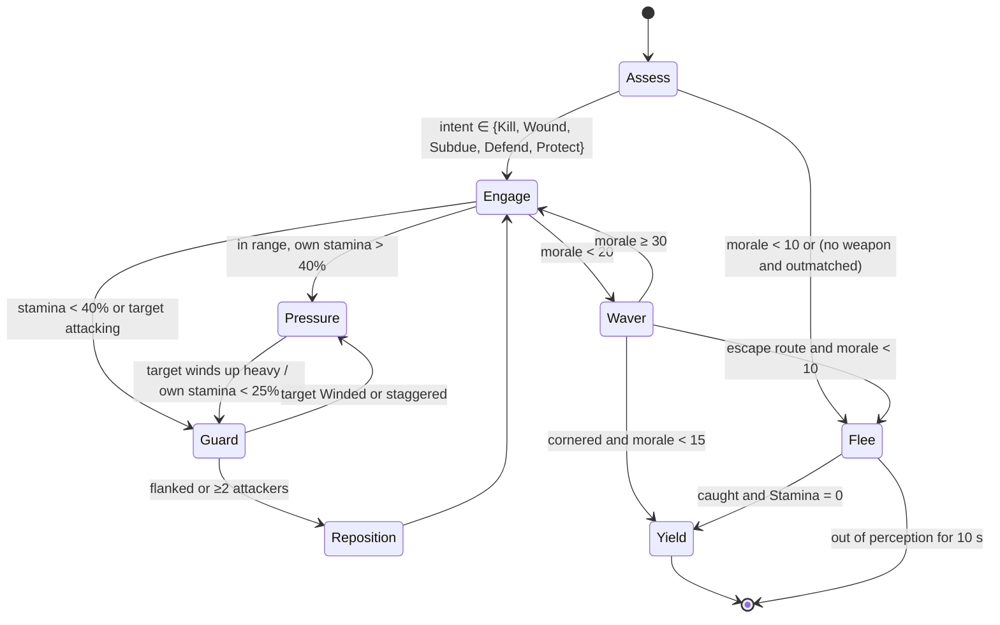
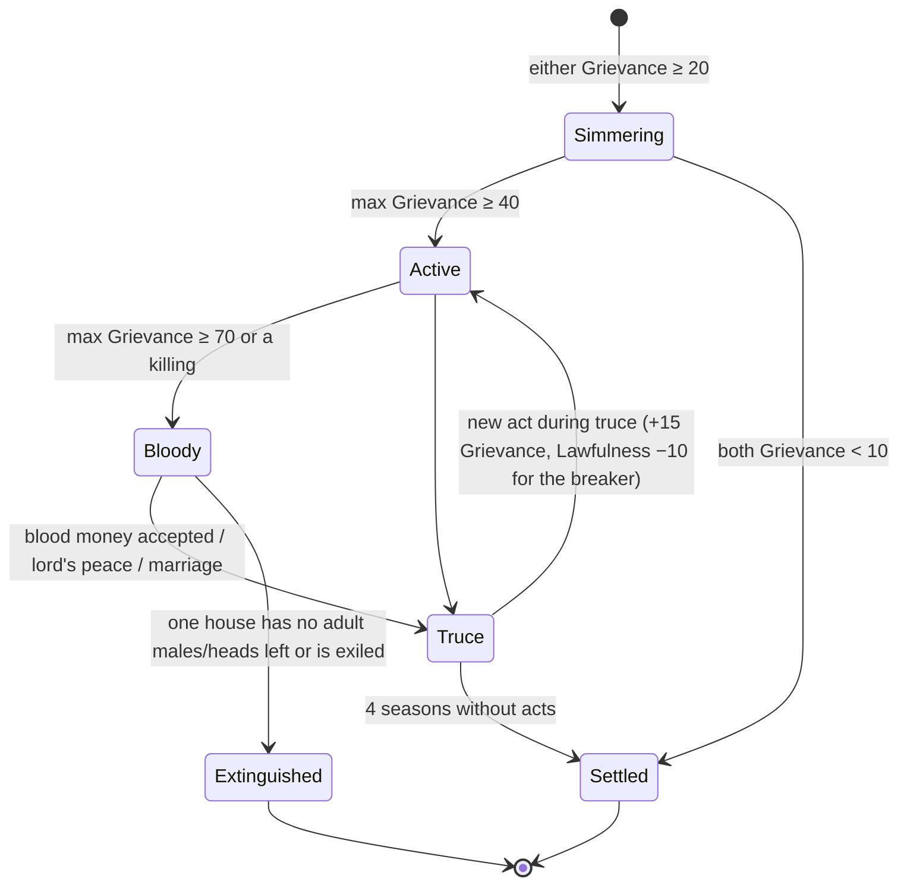
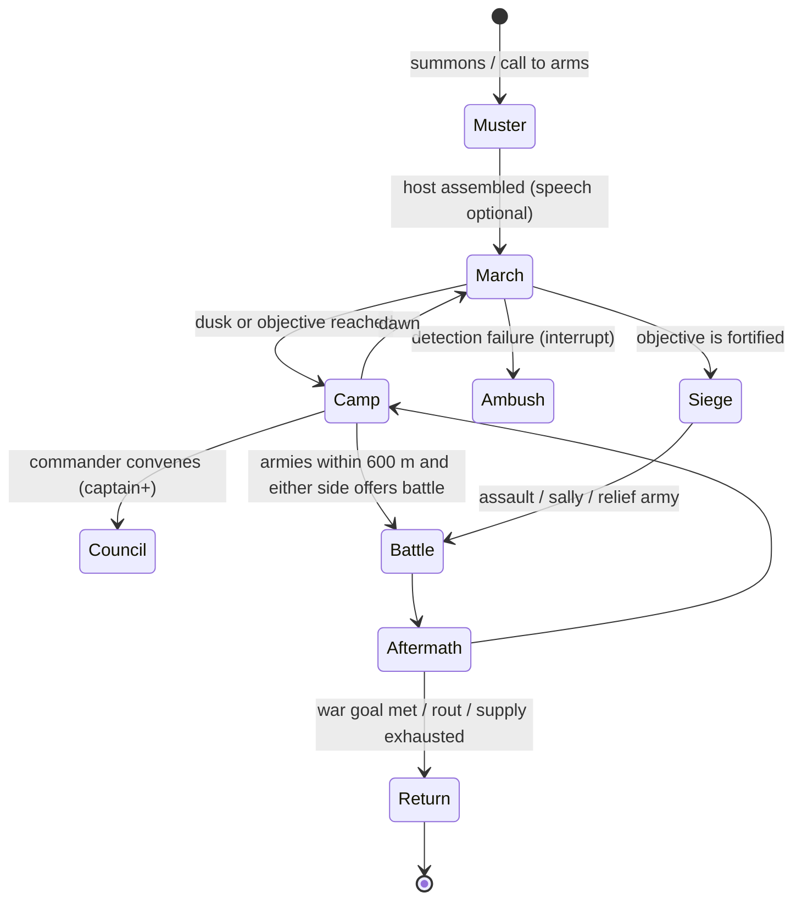

# 18 — Conflict & Warfare

> **Status:** Draft v0.1 — revised for canon v0.3 (decision points) · **Owner doc for:** personal combat, fights & duels, feuds, raids, war causes, muster/conscription, battles, sieges, war's effects · **Depends on:** [01-canon](../01-canon.md), [11-survival](11-survival.md) (injuries, disease, rations), [12-skills-and-professions](12-skills-and-professions.md), [13-crafting-and-minigames](13-crafting-and-minigames.md) (weapon/armor quality, hunting), [14-technology-and-buildings](14-technology-and-buildings.md) (fortifications), [15-economy-and-trade](15-economy-and-trade.md), [16-social-systems](16-social-systems.md), [17-governance-and-law](17-governance-and-law.md), [21-npc-ai](../tech/21-npc-ai.md), [22-llm-integration](../tech/22-llm-integration.md), [20-architecture](../tech/20-architecture.md)

The vision asks for two things that pull in opposite directions: violence that is **personal** ("if they insult a person, they should be prepared for a fight") and war that is **societal** ("leaders will need to get people from their real societies to fight on their behalf which would affect the economies of those societies"). This document builds one continuous system from the tavern scuffle to the siege. Every rung uses the same combat math, the same people, and the same consequences.

---

## Table of contents

1. [Principles & the escalation ladder](#1-principles--the-escalation-ladder)
2. [Personal combat](#2-personal-combat)
3. [NPC combat AI & animals](#3-npc-combat-ai--animals)
4. [Fights, brawls, duels & the law](#4-fights-brawls-duels--the-law)
5. [Feuds](#5-feuds)
6. [Raids & defense](#6-raids--defense)
7. [War causes & the decision to fight](#7-war-causes--the-decision-to-fight)
8. [Muster, conscription & rank](#8-muster-conscription--rank)
9. [Campaigns & logistics](#9-campaigns--logistics)
10. [Battles](#10-battles)
11. [Sieges](#11-sieges)
12. [War's effects & the three morale scales](#12-wars-effects--the-three-morale-scales)
13. [LLM & Jev touchpoints](#13-llm--jev-touchpoints)
14. [Data schemas](#14-data-schemas)
15. [LOD & Interlude behavior](#15-lod--interlude-behavior)
16. [Interfaces with other documents](#16-interfaces-with-other-documents)
17. [Milestones](#17-milestones)
18. [Tuning knobs](#18-tuning-knobs)
19. [Exploits & mitigations](#19-exploits--mitigations)
20. [Headless validation](#20-headless-validation)
21. [Open questions](#open-questions)
22. [Proposed canon additions](#proposed-canon-additions)

---

## 1. Principles & the escalation ladder

| # | Principle | Consequence for design |
|---|-----------|------------------------|
| C1 | **Words can start a fight; combat settles it** (canon §13). A fight starts from a conversation decision point (an NPC chooses to shove or attack, §4.1) or from someone's action. Once it starts, the combat system resolves it in real time: no LLM generation inside a combat loop. | Combat AI is a 10 Hz utility controller; mid-fight yield and mercy are fast-decider choices (≤ 500 ms) or policy (§2.10); barks come from pre-generated pools; battles have no LLM decisions at all (§10). |
| C2 | **Parity.** Player and NPCs use the same damage, armor, stamina, morale and injury math. | NPCs do not "press parry"; they sample timing from a skill-calibrated distribution against the *same* windows the player faces (§3.2). |
| C3 | **Every casualty has a name.** No anonymous soldiers. Every levy is a simulated person with a household. | Battle results write injuries and deaths onto real persons; grief and labor loss follow. |
| C4 | **War is mostly logistics and grief.** Battles are rare climaxes; the cost is days of absent labor, food requisitioned, and empty chairs. | Most war gameplay is muster, camp, march, home front. A typical war has 1–3 field battles. |
| C5 | **Escalation is gated.** Each rung of violence has a hard-coded eligibility gate on the decision menu and a legal/social price. | Most insults end in words; most feuds end in blood money; most tensions end in raids, not war. |
| C6 | **Readable over realistic.** Non-directional, timing-based melee; stylized low-poly animation budget; 150 combatants. | See the §2.1 rationale. |

### 1.1 The escalation ladder

| Rung | Typical lethality | Decided by | Legal default ([17](17-governance-and-law.md) may override) | First milestone |
|------|------------------|-----------|-----------------------------|-----------------|
| 0 Insult / slight | none | [16](16-social-systems.md) applies opinion and emotion | none | M1 |
| 1 Retort / threat | none | §4.1 confrontation DP (LLM in reply when the player is party; else fast decider or policy) | none | M1 (verbal), M2 (physical) |
| 2 Brawl (fists) | ~1% | §4.1 DP starts it; combat (§2–4.2) resolves it | Affray: minor fine | M2 |
| 3 Armed fight | 15–30% | §4.1 DP (critical: requires lethal intent and deterministic `p_i ≥ 0.25`); combat resolves it | Assault / wounding / manslaughter | M2 |
| 4 Formal duel | 5–40% by terms | §4.3 challenge DP (accept / demand terms / refuse); combat resolves it | Lawful if sanctioned | M4 |
| 5 Feud | sporadic killings | §5 feud engine (policy) | Lord may arbitrate | M4 |
| 6 Raid | 0–10% of participants | §6 raid utility (policy) | Crime, or an act of hostility between polities | M5 |
| 7 War | 5–25% of combatants per battle | §7 war utility: policy, or the leader's DP at a war council the player attends | Lawful between polities | M6 |
| 8 Siege / conquest | high, plus starvation | §11 | — | M6 (basic), M7 (engines) |

---

## 2. Personal combat

### 2.1 Model choice: non-directional, timing-based

Melee is **non-directional**: light attack, heavy attack, block, timed parry, dodge, shove. There are no swing directions to read or match.

**Rationale:**

1. A directional system (Mount & Blade style) needs four or more attack and block animation sets per weapon class, plus AI to read direction. That is expensive for a small team and hard to read on low-poly models at battle distances.
2. 150 to 300 combatants need an AI whose decisions are cheap. Timing-plus-spacing is cheap.
3. Depth comes from **stamina, reach, armor versus damage type, footwork, group positioning and morale**. These are the things that also matter at battle scale, so the skill transfers.

Directional combat stays an open question for post-launch.

### 2.2 Controls (keyboard & mouse; controller mapping in M7, owned by [19](19-player-experience.md))

**Units.** Combat timings written in `s` (windups, windows, cooldowns, rally and yield timers) are **real seconds**. The world clock advances in parallel at 48:1, or 12:1 in battle mode (§10.1). Durations written in game-minutes or game-hours are world-clock time.

| Input | Action | Notes |
|-------|--------|-------|
| LMB tap | Light attack | Primary damage type of the weapon |
| LMB hold ≥ 0.3 s, release | Heavy attack | ×1.6 damage, breaks guards; can be feinted (cancel with RMB before 70% of windup, costs 6 stamina) |
| Alt + LMB | Thrust variant | Only on weapons that have one (sword, dagger, spear, polearm) |
| RMB hold | Block | Shield: 120° frontal arc. Weapon: 90° frontal arc |
| RMB press timed to an incoming hit | Parry | See §2.6 |
| Space | Dodge-step | 2 m step, 0.25 s invulnerability, distance reduced by armor load |
| F | Shove / shield-bash | 8 stamina; staggers 0.5 s if the target is not braced (walking or blocking with a shield braces) |
| Q | Soft lock-on | Optional; camera framing only, no aim assist |
| Shift | Sprint | 5 stamina/s; a sprint attack gets ×1.2 momentum |
| Alt (hold) | Careful footwork | Walk speed; +25% stagger resistance |
| R / 1–4 | Draw, sheathe, swap weapons | Sheathed weapons signal non-hostility to NPC perception (§4) |
| Y (hold 1 s) | Yield | Drop the weapon and kneel (§2.10) |
| E (hold 1.5 s) on a downed person | Finish / spare / bind | Deliberate input, so you cannot kill someone by accident |

### 2.3 Derived combat stats

All inputs are canonical attributes (1–10) and skills (0–100) from [canon §10](../01-canon.md#10-the-person-model-shared-by-player-and-npcs).

| Stat | Formula | Average person (attributes 5, Melee/Athletics 30) |
|------|---------|----------------------------------------|
| Max Stamina | `50 + 5·End + 0.2·Athletics` | 81 |
| Stamina regen | `15/s` after 1.0 s without spending; ×0.5 while blocking; ×(1 − 0.3·ArmorLoad) | 15/s unarmored |
| Armor load | `ArmorKg / (10 + 2·Str)` (1.0 = full capacity; >1.0 means sprint disabled) | padded + mail 15 kg → 0.75 |
| Strength damage multiplier `M_str` | `1 + 0.05·(Str − 5)` | 1.00 |
| Skill damage multiplier `M_skill` | `0.8 + 0.4·(Melee/100)` | 0.92 |
| Windup multiplier | `1 − 0.2·(Melee/100) − 0.02·(Dex − 5)` | 0.94 |
| Parry window | `0.12 s + 0.0012·Melee` (+0.03 s with a shield) | 0.156 s |
| Dodge distance | `2.0 m · (1 − 0.4·ArmorLoad)` | 2.0 m |

**Fatigue.** Combat Stamina is a fast pool, separate from the slow **Energy** need ([11](11-survival.md)). Each 100 stamina spent drains 1 Energy. If Energy < 25, Max Stamina and regen are both ×0.75. If Stamina hits 0, you are **Winded**: guard breaks, no attacks for 1.5 s, and the next hit you take staggers.

### 2.4 Damage types, damage formula, hit location

There are three damage types: **cut, pierce, blunt**. Brawling adds a fourth channel, **stun** (§4.2).

```
Raw      = Base[attack] × Q × M_str × M_skill × M_attack × M_momentum
Located  = Raw × LocMult[region]
Effective (per armor layer stack covering the region):
         = max(0, Located × Π(1 − R_layer[type]) − Σ T_layer[type])
```

| Term | Values |
|------|--------|
| `Q` — quality multiplier | 0.75 (Crude) · 0.85 (Poor) · 0.95 (Common) · 1.02 (Fine) · 1.08 (Superior) · 1.15 (Masterwork). Grades and Q bands come from [13](13-crafting-and-minigames.md) §5 (Q 0–100, 50 = common); this doc owns only the multiplier. |
| `M_attack` | light 1.0 · heavy 1.6 · thrust per weapon table |
| `M_momentum` | sprint attack 1.2 · attacking downhill > 15° 1.1 · otherwise 1.0 |
| `LocMult` | Head 1.5 · Torso 1.0 · Arms 0.7 · Legs 0.8 |
| Abstract hit location (when no physical hitbox exists: LOD1+, auto-resolve) | Head 12% · Torso 40% · Arms 24% · Legs 24% |

Physical hits at LOD0 use hitboxes. The region is wherever the blade connected.

### 2.5 Weapons by tech tier

Base values assume iron, `Q = 1.0`, Str 5, Melee 50. Material tier is baked into each row. Steel weapons also lose condition at half the rate of iron (durability is owned by [13](13-crafting-and-minigames.md)).

| Weapon | Tier | Hands | Light (type/base) | Heavy | Thrust | Reach m | Light windup s | Stamina L/H | kg | Notes |
|--------|------|-------|------------------|-------|--------|---------|-----------------|-------------|----|-------|
| Fists | — | 2 | blunt 4 + stun 12 | 7 + stun 25 | — | 0.6 | 0.25 | 6/12 | — | §4.2 |
| Club / cudgel | T0 | 1 | blunt 16 | ×1.6 | — | 0.8 | 0.40 | 10/20 | 1.5 | Non-lethal intent possible |
| Flint knife | T0 | 1 | cut 10 | ×1.4 | pierce 11 | 0.4 | 0.28 | 7/14 | 0.3 | Also a tool |
| Fire-hardened spear | T0 | 1–2 | — | — | pierce 15 | 2.4 | 0.40 | 9/18 | 1.6 | Can be braced against a charge (boar) |
| Flint-tipped spear | T0 | 1–2 | — | — | pierce 17 | 2.4 | 0.40 | 9/18 | 1.7 | — |
| Salvaged iron hand-axe | T0* | 1 | cut 20 | ×1.6 | — | 0.7 | 0.40 | 11/22 | 1.1 | *Finite ship salvage; also the colony's tool |
| Sling | T0 | 1 | blunt 14 (ranged) | — | — | 40 m eff. | 1.2 s cycle | 8 | 0.1 | Cheap; poor against armor |
| Copper axe / dagger / spear | T1 | — | ×0.80 of iron row | — | — | — | — | — | — | Blunts fast |
| Bronze sword (leaf blade) | T2 | 1 | cut 19 | ×1.6 | pierce 18 | 0.75 | 0.36 | 9/19 | 1.0 | Short; status item |
| Bronze spear / axe | T2 | — | ×0.95 of iron row | — | — | — | — | — | — | — |
| Iron arming sword | T3 | 1 | cut 22 | ×1.6 | pierce 20 | 0.95 | 0.38 | 10/20 | 1.2 | All-rounder |
| Iron spear | T3 | 1–2 | — | — | pierce 24 | 2.4 | 0.40 | 10/20 | 2.0 | Line weapon for levies |
| War axe | T3 | 1 | cut 24 | ×1.6 | — | 0.8 | 0.42 | 12/24 | 1.4 | Hooks shields: a heavy hit strips block stability by 50% for 2 s |
| Mace | T3 | 1 | blunt 22 | ×1.6 | — | 0.7 | 0.42 | 12/24 | 1.6 | Anti-armor |
| Dagger (rondel) | T3 | 1 | cut 12 | — | pierce 16 | 0.35 | 0.25 | 6/— | 0.4 | Against downed or grappled targets, armor thresholds are halved |
| Steel arming sword | T4 | 1 | cut 25 | ×1.6 | pierce 23 | 0.95 | 0.36 | 10/20 | 1.15 | — |
| Steel longsword | T4 | 2 | cut 28 | ×1.6 | pierce 26 | 1.15 | 0.40 | 12/24 | 1.5 | Half-swording: thrust ignores 30% of mail resistance |
| Flanged steel mace | T4 | 1 | blunt 25 | ×1.6 | — | 0.7 | 0.40 | 12/24 | 1.6 | — |
| Polearm (bill / glaive) | T4 | 2 | cut 30 | ×1.6 | pierce 24 | 2.6 | 0.55 | 14/28 | 2.6 | Formation weapon |

**Ranged weapons**

| Weapon | Tier | Draw kgf | Release velocity | Damage at release | Cycle | Effective range (aimed / volley) | Skill |
|--------|------|----------|------------------|-------------------|-------|-------------------------------|-------|
| Self bow (hunting) | T0 | 18–25 | `25 + drawKgf` m/s | pierce `0.8 · drawKgf` | 1.6 s | 40 / 120 m | Archery |
| Flatbow / war bow (yew/elm) | T1+ (wood; better heads at T3) | 32–45 | ″ | ″ | 2.0 s | 80 / 200 m | Archery |
| Crossbow (composite or steel prod) | T4 | spanned mechanically | 55 m/s | pierce 55 | 5.0 s (belt-hook spanning) | 70 / 180 m | Archery at **50% weight**: `M_skill = 0.9 + 0.2·Archery/100` |
| Thrown javelin | T0+ | — | 20 m/s | pierce 18 | 1.2 s | 25 m | Athletics |

Arrowheads: **flint** ×0.85; **broadhead** (T1+) cut-type, ×1.25 against unarmored, ×0.6 against mail; **bodkin** (T3+) pierce, ignores 30% of mail resistance.

### 2.6 Blocking, parrying, shields

| Defense | Result | Stamina cost to defender |
|---------|--------|--------------------------|
| Block with a weapon (90° arc) | Hit stopped | `Raw × (1 − 0.4)` |
| Block with a shield (120° arc) | Hit stopped | `Raw × (1 − Stability)` |
| Parry (RMB press within the window before impact) | Hit stopped; attacker staggered 0.6 s (riposte opening) | 0 |
| Early or failed parry | Your block comes up 0.35 s late | — |
| Block while Winded | Guard breaks; hit lands at ×0.5 | — |
| Arrows | Shield only; cannot be parried | `Raw × 0.2` |

| Shield | Tier | Stability | kg | Durability (hits) | Notes |
|--------|------|-----------|----|-------------------|-------|
| Wicker / hide | T0 | 0.55 | 2.5 | 25 | Arrows: 30% pass-through |
| Plank round shield | T1 | 0.65 | 4.5 | 40 | — |
| Iron-bossed round shield | T3 | 0.72 | 5.5 | 60 | Bash ×1.3 |
| Kite / heater | T3–T4 | 0.75 | 5.0 | 60 | Covers the legs against arrows |
| Pavise | T4 | 0.85 (planted) | 9.0 | 120 | Crossbow cover; immobile while planted |

### 2.7 Armor

Layers stack multiplicatively on resistance (R) and additively on threshold (T). Coverage decides which regions a layer protects.

| Armor | Tier | Coverage | Cut R/T | Pierce R/T | Blunt R/T | kg | Notes |
|-------|------|----------|---------|------------|-----------|----|-------|
| Hide / hardened leather | T0–T1 | Torso, arms | 0.30/3 | 0.20/2 | 0.20/1 | 5 | — |
| Padded (gambeson) | T1 (Textiles) | Torso, arms, upper legs | 0.30/2 | 0.25/1 | 0.35/2 | 4 | Worn under mail |
| Mail hauberk + coif | T3 | Torso, arms, legs to knee, head (coif) | 0.65/5 | 0.35/2 | 0.15/0 | 11 | Useless against blunt on its own |
| Coat-of-plates | T4 | Torso | 0.60/4 | 0.50/3 | 0.30/2 | 9 | Worn over mail |
| Leather cap | T0–T1 | Head | 0.25/2 | 0.15/1 | 0.20/1 | 0.5 | — |
| Bronze / iron helm | T2–T3 | Head | 0.70/6 | 0.50/3 | 0.35/2 | 2.0 | Perception −1 for sound cues |
| Steel helm (great helm / bascinet) | T4 | Head | 0.80/8 | 0.60/4 | 0.40/3 | 3.0 | Perception −2 |

Combined stacks on the torso:

| Stack | Cut ×rem/T | Pierce ×rem/T | Blunt ×rem/T | kg |
|-------|-----------|---------------|--------------|----|
| Padded | 0.70/2 | 0.75/1 | 0.65/2 | 4 |
| Padded + mail | 0.245/7 | 0.488/3 | 0.553/2 | 15 |
| Padded + mail + coat-of-plates | 0.098/11 | 0.244/6 | 0.387/4 | 24 |

**Worked example (why maces and crossbows exist).** A steel arming sword's light cut (Raw 25) against padded + mail on the torso: `25 × 0.245 − 7 = −0.9`, so **0 damage**. The same sword's thrust (23): `23 × 0.488 − 3 = 8.2`. A flanged mace's heavy (40): `40 × 0.553 − 2 = 20.1`. A crossbow bolt (55): `55 × 0.488 − 3 = 23.8`. Against an unarmored levy the same sword cut does the full 25, so about four hits down a healthy person. Armor turns fights into hunts for gaps, blunt trauma and the dagger on the ground. That is historically right and readable.

### 2.8 Archery

- **Comfortable draw** `C = 12 + 4·Str + 0.1·Archery` kgf. Example: Str 5, Archery 30 → 35 kgf.
- **Overdraw ratio** `o = drawKgf / C`. If `o > 1`, draw time, aim sway and stamina per shot are each ×`o^2`. If `o > 1.4`, you cannot draw the bow. A 40 kgf war bow is a skilled, strong archer's weapon. Levies get crossbows at T4 for exactly this reason.
- **Draw time** `0.8 s · max(1, o)`. **Steady time** `1.0 + Archery/50` s. After steady time, sway grows linearly and stamina drains 4/s.
- **Ballistics**: real projectile physics with gravity 9.81 m/s² and no drag. Damage at impact scales by `(v_impact / v_release)^2`. There is no reticle drop indicator; Archery skill shrinks the sway cone (`cone° = 3.0 − 2.4·Archery/100`).
- NPC archers solve the ballistic angle analytically, then add aim error `σ° = 2.5 − 2.0·Archery/100 + 0.5·(target speed in m/s)/5` (parity with the player's sway cone).

### 2.9 Injuries & fighting while injured

[11-survival](11-survival.md) owns Health, injuries, bleeding and healing. Combat emits **trauma events**; 11 turns them into health loss and injury records.

Interface expected from 11:

```csharp
// 18 → 11
InjuryOutcome ApplyTrauma(long personId, BodyRegion region, DamageType type, float effective, long gameMinute);
// 11 → 18 (queried at 1 Hz and on every injury change)
CombatPenalties GetCombatPenalties(long personId);
// { AttackSpeedMult, DamageMult, MoveSpeedMult, StaminaRegenMult, PerceptionMod, CanUseTwoHanded }
```

These are the **default thresholds this doc assumes** (11 may override them; the combat tuning depends on them). Health is 0–100, and health loss equals `effective`:

| Effective damage in one hit | Injury severity | Typical combat penalty |
|-----------------------------|-----------------|------------------------|
| < 8 | Bruise / scratch (no injury record) | — |
| 8–19 | Minor | −5% on that limb's functions |
| 20–34 | Moderate | Arm: −20% attack speed. Leg: −25% move speed. Head: 1 s stagger |
| 35–54 | Severe | Arm: drops a two-handed weapon. Leg: limp, no sprint. Torso: bleeding |
| ≥ 55 | Critical | Immediate downing check: 50% chance to fall regardless of Health |

**Adrenaline.** For 60 real seconds (≈ 48 game-minutes at 48:1) after combat starts, injury penalties are ×0.6 for everyone. After that comes a **crash**: penalties go to ×1.2 for 2 game hours. Fighters feel strong until it's over.

**Downed.** At Health 0 a person is **Incapacitated** ([canon §12](../01-canon.md#12-the-player)). They can crawl at 0.5 m/s, plead, or yield. Bleed-out timing belongs to 11. Downed people are only killed by a deliberate finishing action (§2.10), by bleed-out, or by environmental damage.

### 2.10 Surrender, mercy, executions

**Yielding.** Any combatant can yield: weapon dropped, kneeling. The player yields with Y (§2.2). For an NPC, yielding is the **yield DP** `dp.combat_yield`, opened when its combat morale (§3.3) first drops below Waver (20), or when an opponent demands surrender (quick intent "Yield!"):

| Option | Effect | Eligibility | `p_i` (`lg(x) = 1/(1 + e^(−x))`) |
|--------|--------|-------------|------------------------------------|
| `fight_on` | Stays in the Combat Controller (§3.1) | always | the remainder |
| `yield` | Drops weapon, kneels; the victor's mercy DP follows | always | `lg((15 − M)/3)` × 1.5 if cornered; +0.2 if surrender was demanded by a visibly stronger opponent |
| `flee` | Flee state (§3.1) | an escape route exists | `lg((10 − M)/3)` |

`yield` and `flee` together are capped at 0.95. Stakes: medium. Re-opened when morale drops a further 10 points.

The victor then chooses. The player chooses with the deliberate E-hold (§2.2). An NPC victor's choice is the **mercy DP** `dp.mercy`:

| Victor's choice | Effect | `p_i` |
|-----------------|--------|-------|
| **Spare** (`spare`) | Fight ends. Yielder gets Shame +30 and Fear of the victor +20. Witnesses: victor Courage +2, Peaceableness +3 | share of `1 − pKill` by weight `0.5 + 0.3·Warmth/100` |
| **Bind / capture** (`bind`) | Takes 4 s with rope or cord. Captive follows. In war they become ransomable (§12.5). Eligible only with rope or cord to hand | weight `0.6·(1 + [war] + [ransom value ≥ 48f] + [arrest by an officer])` |
| **Strip** (`strip`: take weapon and purse) | In civil fights this is robbery ([17](17-governance-and-law.md)) | weight `0.1 + 0.3·[Greedy]` |
| **Kill the yielded** (`kill`) | Murder in civil law, even after a lawful fight. In war it is not a crime by default, but witnesses with Honor ≥ 50 apply Opinion −25 and the community applies Courage −10 and Peaceableness −15. Among Brannoch kin it opens a feud automatically (§5) | `pKill` — **critical** (lethal violence) |

`pKill = clamp(0.02 + 0.6·hatred + 0.2·[Vengeful] + 0.15·[Hot-tempered, Anger > 70] − 0.3·(Warmth/100) − 0.2·(Honor/100), 0, 0.95)`, where `hatred = max(0, −Opinion)/100`. In war, add +0.15 if a friend or kin of the victor died in this battle. Because `kill` is critical, it is on the menu only when this deterministic `pKill ≥ 0.25` (canon §13.1); no plea and no decider can make it more likely than that.

**Who decides yield and mercy.** Never an LLM, and never generated speech: the yielder's plea and the victor's words are barks from the pools (§13). The **fast decider** (canon §4.1) decides when the player is a party (the opponent, the yielder, or the one demanding surrender), outside battle mode, and only if it answers within the **0.5 s** combat deadline. It reads a structured state summary plus the player's quick intent (beg, offer ransom, name a protector), never free text. Otherwise — NPC↔NPC fights, LOD1+, every fight in battle mode (§10), or a missed deadline — the **policy** samples `p_i`. A player's ransom offer adds no number of its own: it raises the `bind` weight by +1, and the ransom amount is fixed by §12.5.

**Executions.** [17](17-governance-and-law.md) decides sentences. This doc provides the **execution interaction**: a non-combat sequence (hanging, beheading) carried out by whoever holds the office. If the player holds it, they must perform it or delegate it, and that choice is public. Witnesses get emotions from the condemned's relationships (Grief for kin, Fear for those with guilty memories, Joy for those with hatred ≥ 60). The content setting "executions: fade to black" exists ([19](19-player-experience.md)).

---

## 3. NPC combat AI & animals

### 3.1 Architecture

When an NPC enters combat, a **Combat Controller** takes over from the needs-driven utility AI of [21-npc-ai](../tech/21-npc-ai.md). It hands back when the fight ends (no hostile in perception for 10 s, or yield or flee completed). It ticks at **10 Hz at LOD0** (5 Hz in battle mode, §10.1).



**Combat intent** is set when combat begins and can change on events:

| Intent | Set when | Weapon behavior |
|--------|----------|-----------------|
| Subdue | brawl, arrest, sparring, Opinion of the target > −40 | Fists or club; stops at a downed or yielded target |
| Wound | armed fight without lethal intent (16 rung 6), duels to first blood (§4.3) | Weapons drawn; stops at a downed or yielded target; never finishes (`pKill` = 0) |
| Kill | war, feud killing, ambush, Opinion ≤ −60 with lethal escalation (§4.1), predator defense | Finishes a downed target with probability `pKill` (§2.10) |
| Defend | attacked without wishing to fight | Guard-heavy; flees when possible |
| Protect(X) | kin, friend (Opinion ≥ 50), lord, or charge X is attacked | Moves to intercept, targets X's attacker |

### 3.2 Reaction & skill model (parity)

NPCs perceive attack telegraphs after a reaction delay:

```
reaction_s = clamp(0.40 − 0.002·Melee − 0.015·(Per − 5), 0.15, 0.60) + N(0, 0.05)
```

On perceiving a hit in time, the NPC picks a defense by weighted choice:

| Defense | Weight |
|---------|--------|
| Parry attempt | `0.15 + 0.5·Melee/100` (×0 if Winded) |
| Block | `0.6` (×1.4 with a shield) |
| Dodge | `0.2 + 0.2·Athletics/100` (×(1 − ArmorLoad)) |
| Trade blows | `0.1 + 0.3·[Hot-tempered]` |

A parry attempt draws a timing error `ε ~ N(0, σ)` with `σ = 0.16 − 0.001·Melee` s. It succeeds if `|ε| < window/2`, using the **same window formula as the player** (§2.3). An expert NPC (Melee 70) has σ = 0.09 s and window 0.204 s, so it parries about 74% of the hits it chooses to parry. A novice (Melee 10) has σ = 0.15 s and window 0.132 s, about 34%. Headless tests verify these rates against a scripted "player-proxy" (§20).

### 3.3 Combat morale (per person, per fight)

One morale function serves duels, brawls and battles. Battles add squad terms (§10.3).

```
M0 = 50 + 15·[Brave] − 15·[Coward] − 0.15·(Volatility − 50) + 0.1·(Honor − 50)
     + seed            // in war: 0.5·(CampaignMorale − 50); otherwise 0
M(t) = M0 + Σ situational terms, clamped 0..100, recomputed at 2 Hz
```

| Situational term | Value |
|------------------|-------|
| Own Health < 50 / < 25 | −10 / −25 |
| Own Severe injury | −10 each |
| Locally outnumbered (enemies ÷ allies within 10 m) | `−10·(ratio − 1)`, clamped −30..0 |
| Ally downed within 15 m | −4 each (decays 1/s) |
| Friend or kin downed within sight | −8 and Anger +20 (Vengeful: +5 instead of −8) |
| Defending own home / kin present | +10 |
| Opponent visibly stronger (perceived power ratio > 1.5) | −10 |
| Opponent fled, yielded or fell | +10 |

Thresholds: **Waver < 20**, **Flee < 10** with an escape route, **Yield < 15** when cornered. For people, Flee and Yield are the centers of the yield DP's propensities (§2.10), opened at Waver; animals use the thresholds directly, with species seeds (§3.6).

### 3.4 Target selection & spacing

```
score(t) = 3.0·threatTo(self or protectee)        // t is attacking me or my charge
         + 1.5·(1 − dist/15)
         + 1.0·[t is the squad focus target]
         + 0.8·hatred(t)                            // max(0, −Opinion)/100
         + 0.6·(1 − t.Health/100)·[Kill intent]     // opportunism
         + 2.0·[Vengeful and t harmed my kin]
         − 1.5·[t already has ≥ 2 attackers]        // attack slots
```

- **Attack slots.** At most 2 melee attackers per target engage at once; others circle at 3–4 m (3 in battle lines). This reads well and is historically plausible.
- **Preferred range** per weapon: reach + 0.3 m. Spears keep distance. Daggers close in.
- **Flank avoidance**: keep enemies within a 120° front cone. Reposition when one leaves it.
- **Style by personality.** Hot-tempered: heavy-attack ratio 0.45 (base 0.25), spacing −0.3 m. Diligence > 65: blocks 20% more. Coward: guard-heavy, keeps an escape vector.

### 3.5 Group combat

Outside battle mode, groups of up to 12 use the same controller plus a **lightweight squad blackboard**: a shared focus target (picked by the most senior or highest-Tactics member), and "cover me" (an ally with a shield moves between a downed ally and enemies, weighted by Warmth and Opinion). Above 12 per side, encounters promote to battle mode (§10.1).

### 3.6 Animal combat

Fauna come from [10](10-world-and-setting.md). Hunting as a craft belongs to [13](13-crafting-and-minigames.md). This doc owns only the fight.

| Animal | Health | Attack (type/base) | Behavior | Morale seed | Flee / stop triggers |
|--------|--------|--------------------|----------|-------------|---------------------|
| Wolf (pack 3–7) | 45 | bite pierce 10 + cut 4; drag-down (shove) | Circles, attacks from the flank or rear, rotates attackers; avoids fire | 55 | 2 pack members down, or the alpha down; torch swung at it −15 |
| Boar | 90 | tusk charge pierce 22 ×1.2 momentum; gore cut 14 | Charges in a straight line; recharges after 3 s | 75 | Health < 20. A braced spear (hold RMB with a spear, facing the charge) deals the boar's own momentum back (×1.5) |
| Bear | 220 | swipe blunt 20 + cut 12; bite pierce 18 | Bluff-charge first (60%); stands; mauls downed targets | 65 (defending cubs 90) | Health < 40%; fire; ≥ 3 humans shouting (−20) |
| Deer, goat | 40–60 | antler/horn blunt 10 when cornered | Flees | 20 | Always flees if possible |

Shouting, clattering and torches all go through the same morale function. A group of settlers yelling and waving fire really can turn a bear. This rule teaches cooperation in Era 0.

---

## 4. Fights, brawls, duels & the law

### 4.1 The confrontation function (insult → fight hand-off)

Ownership split, per [canon §13](../01-canon.md#13-the-llm-boundary-language-decides-systems-resolve) (v0.3: language decides, systems resolve):

1. **[16-social-systems](16-social-systems.md)** receives the classified dialogue act. The fast decider (canon §4.1) classifies tone and insult severity, and that input is treated as **untrusted**. 16 applies the act's deterministic Opinion and emotion changes, then emits `ProvocationEvent{target, provoker, severity, anger, witnesses}`.
2. **The target's response is a decision point** (canon §13.1). Its menu is the escalation ladder ([16 §9](16-social-systems.md)). 16 computes the base propensities `p_i` over all response rungs from its escalation pressure `E` (16 §9.2). This document supplies the fight-starting options (`shove`, `challenge`, `attack_brawl`, `attack_armed`, `attack_to_kill`) with their fixed parameters, extra eligibility gates and combat intents (table below).
3. **Decider.** If the provoker is the player in conversation, the LLM chooses decision-first in the target's reply. A shouted insult outside a conversation is a fast-decider choice. NPC↔NPC quarrels, overheard or not, are decided by the policy; the LLM only renders them.
4. **Guard.** The DRE checks the menu, eligibility, floors and the long-shot budget. `attack_armed` is **critical** (lethal violence): it also needs a deterministic `p_i ≥ 0.25`, computed without the player's words.
5. **Execution.** Verbal options go back to 16 (Opinion, emotions, rung state). Fight-starting options start a fight in the **combat system** (§2–3, §4.2) with the option's fixed intent, or open the duel challenge (§4.3). From the first blow, combat is real time and hard-coded; nothing more is decided by an LLM until the fight ends.

**Escalation pressure and the response menu are owned by [16 §9.2 and §9.6](16-social-systems.md#92-escalation-pressure)**
(one formula, `E`, with rung thresholds, caps and noise; the canonical worked example is Hobb the
smith in [16 §9.3](16-social-systems.md#93-worked-example--insulting-hobb-the-smith-in-the-alehouse)).
This document owns what happens when a chosen rung reaches the body: the fight-starting options'
fixed parameters, extra eligibility gates, and the combat intent they start.

| 16 rung | Menu option(s) | Fixed parameters (this doc) | Extra eligibility (this doc) | Stakes | Combat start |
|---------|----------------|-----------------------------|------------------------------|--------|--------------|
| 3 Threat | `threaten`, `challenge` | challenge: proposed duel terms (§4.3) | `challenge`: Honor ≥ 60 and dueling customary (§4.3) | medium / high | None (verbal), or a duel per §4.3 |
| 4 Shove | `shove` | stagger 0.5 s, no damage | — | high | None unless answered; a shove back or a further insult starts a brawl |
| 5 Brawl | `attack_brawl` | intent **Subdue**, fists (§4.2) | — | high | Fistfight (§4.2) |
| 6 Armed fight | `attack_armed` | intent **Wound**, weapon at hand | weapon at hand (16's rung-6 gates apply) | **critical** | Armed fight that stops at a downed or yielded target |
| 7 Lethal intent | `attack_to_kill` | intent **Kill** (§3.1), weapon at hand | lethal intent: `Opinion ≤ −60`, an active feud or grievance, or 16's rung-7 gates | **critical** | Fight to the death; `pKill` applies (§2.10) |

Critical options also need a deterministic `p_i ≥ 0.25` computed without the player's words (canon
§13.1). An ineligible option's mass moves down the ladder, as 16 specifies.

**Worked example.** In [16 §9.3](16-social-systems.md#93-worked-example--insulting-hobb-the-smith-in-the-alehouse)
the player insults Hobb twice in the alehouse; his response DP reaches `attack_brawl` 0.87 and the
LLM in his reply picks it. 16 emits `ConfrontationEscalated{Rung 5, Subdue}`; this document's combat
system starts a Subdue fistfight (§4.2) and resolves it in real time — damage, stamina, knockouts and
yields are all hard-coded. Had Hobb's hammer been to hand with the player his Enemy, rung 6 would be
open and an LLM pick of `attack_armed` would pass only because the hard-coded temper already made it
likely (≥ 0.25).

The player is never forced to fight back. Fleeing, yielding or calling the watch are all valid. Each has reputation consequences (Courage −3 for fleeing an affront with witnesses, only in honor cultures).

### 4.2 Brawls & bystanders

**Brawl rules.** Fists deal small Health damage and large **Stun** damage. Stun is a 0–100 pool that regenerates 5/s after 2 s without being hit. **Stun 0 → knockdown** for 3–6 s. A second knockdown in the same brawl → **knockout** for 20–40 s (10% concussion chance → 11). A brawl ends on: yield, knockout, separation by bystanders (two interveners holding a fighter for 3 s), a watchman's order (`Obey` utility from 21, high), or **a weapon being drawn**. Drawing a weapon instantly re-classifies the incident as armed (§4.5) for all witnesses.

**Bystanders.** While a quarrel is still verbal, a bystander who notices it gets one fast-decider DP
(`step_in` · `call_others` · `ignore`; canon §13.1), whose menu and propensities belong to 16's
de-escalation rules ([16 §9.4](16-social-systems.md)). Once blows land, the fight is real time:
bystanders within 20 m each pick a reaction at 1 Hz with these hard-coded utilities (no decider):

| Reaction | Utility (abridged) |
|----------|--------------------|
| Watch / cheer | `0.4 + 0.3·Sociability/100 + 0.3·intoxication` |
| Intervene (separate) | `0.3·Warmth/100 + 0.4·[watch/office] + 0.2·[Opinion ≥ 40 toward either fighter] − 0.3·Fear` |
| Join a side | `0.5·[kin, or Opinion ≥ 60 toward a fighter] + 0.2·[Hot-tempered] + 0.2·intoxication − 0.4·[Coward]`; join chance halves for each joiner already on that side; max 2 joiners per side |
| Flee | children, Coward, Fear > 50 |
| Fetch the watch | `0.3 + 0.4·Lawfulness-valuing (Tradition/Fairness)`; office-holders arrive in 20–60 game-minutes (≈ 25–75 real s) at LOD1 |

Each witness gets an episodic memory (16), so rumors carry the *witness's* version: who started it, and who drew steel.

**Sparring** is a consensual quick-intent ("Spar") using practice weapons or fists. It has no legal or reputational effect. XP gain is diminishing (§19).

### 4.3 Formal duels

A **challenge** is a structured act with proposed terms. An NPC issues one by choosing `challenge` in the confrontation DP (§4.1); the player uses the *Challenge* quick intent ([19](19-player-experience.md)). Text the classifier reads as a challenge is confirmed through the intent-echo UI before it counts.

| Terms (the challenged party has the final say) | Ends on | Lethality |
|-----------------------------------|---------|-----------|
| First blood | First injury ≥ Minor | ~1% |
| Yield | Yield or downing | ~5% |
| To the death | Death (only if [17](17-governance-and-law.md) permits death duels) | ~40% |

**The challenge DP** `dp.duel_challenge` (NPC challenged). The LLM decides in the reply when the player issues the challenge in conversation; otherwise the policy decides. If the player is the one challenged, it is the player's choice.

| Option | Fixed parameters | Eligibility | `p_i` | Stakes |
|--------|------------------|-------------|-------|--------|
| `accept` | the proposed terms, place and time | always | `pAccept·(1 − dShare)` | high; **critical** if the terms are to the death |
| `demand_terms(t)` | `t` = the next less lethal terms, or a named champion (the best eligible kin or retainer), or both | a less lethal term exists, or a champion is allowed (below) | `pAccept·dShare`, `dShare = 0.25 + 0.25·[perceived power ratio < 1] + 0.2·[proposed to the death]` | high |
| `refuse` | refusal costs (below) | always | `1 − pAccept` | medium |

`pAccept = clamp(0.3 + 0.006·Honor + 0.004·Volatility + 0.2·[Brave] − 0.4·[Coward] + 0.15·cultureHonor·[witnesses] − 0.3·[perceived power ratio < 0.7], 0.02, 0.98)`. After `demand_terms`, an NPC challenger answers with its own DP (`accept_terms` · `withdraw`, `p(accept_terms) = pAccept` computed for the challenger). Re-issuing a refused challenge to the same person multiplies `pAccept` by `0.5^(n−1)` and raises Anger (canon §13.4). Once a duel is agreed, this document runs it in the combat system; the seconds' and yield rules below are hard-coded.

**Refusal costs:** Courage −10 × cultureHonor (with witnesses), Shame +20. The challenger gains nothing for a refused challenge against a much weaker person (Peaceableness −5 instead).
**Champions** are allowed if the challenged party is an Elder, a Youth, injured (Severe+), or of higher status (a lord may name a champion). A champion's loss counts as the principal's.
**Seconds** (one per side) may stop the fight at Waver. NPC seconds call it when their principal's Health < 30 and the terms are "yield".

### 4.4 Trial by combat (interface with 17)

[17](17-governance-and-law.md) decides **eligibility** through the law flag `trial_by_combat` (none / nobles only / freemen / all) and court procedure. This doc resolves the fight. The fight is a duel "to yield" by default, or to the death if the law says so, with champions as in §4.3. Output:

```csharp
record TrialCombatResult(long CaseId, long WinnerId, long LoserId, bool LoserDied, bool ChampionUsed);
```

17 converts the result into a verdict. [16](16-social-systems.md) handles how faith communities read it (Piety-weighted belief that the outcome was just). Rigging a trial, for example by poisoning or injuring the opponent beforehand, is detectable through normal crime detection.

### 4.5 Legal consequences of violence

This doc classifies violent acts. [16](16-social-systems.md) handles detection and witness beliefs. [17](17-governance-and-law.md) handles law and sentencing. Classification uses **ground truth** for the event record; the court only ever hears **beliefs** (witness testimony), which can be wrong.

| Act (ground truth) | Class emitted | Self-defense test |
|--------------------|---------------|-------------------|
| Fists, no injury ≥ Moderate | `Affray` | n/a |
| Fists causing ≥ Moderate injury | `Assault` | The other party struck first and force was proportionate |
| Weapon drawn against someone without one | `ArmedAssault` | Only if facing a credible lethal threat |
| Weapon injury ≥ Severe, or a lost limb | `Wounding` | as above |
| Death in a brawl or unplanned fight | `Manslaughter` | Self-defense → `LawfulKilling` |
| Death by ambush, of a yielded or bound person, or premeditated | `Murder` | none |
| Sanctioned duel, trial, war, execution, or a predator | `LawfulKilling` | — |

**Provocation flag.** If the deceased or victim was provoked by the other party within the last game hour (a `ProvocationEvent` on record), self-defense is downgraded one step for the provoker. This closes the "insult them into swinging, then kill them" exploit (§19).

---

## 5. Feuds

A **feud** is a persistent conflict between two **houses**: a household plus its kin within two degrees ([16](16-social-systems.md) family graph), or a faction ([17](17-governance-and-law.md)).

### 5.1 Grievance

Each side holds **Grievance** (0–100) against the other. Grievance comes from acts by members of the other house:

| Act against a house member | Grievance |
|----------------------------|-----------|
| Public insult (severe) | +5 |
| Beating (≥ Moderate injury) | +15 |
| Theft / livestock theft | +10 / +20 (×value factor) |
| Seduction of a spouse, broken betrothal | +20 |
| Maiming (lost limb, permanent injury) | +35 |
| Killing | +60 (×1.5 if the house head or a child; ×1.3 if dishonorable, §2.10) |
| Refused blood money | +10 |
| Court verdict judged unjust (by the house head) | +10 |

Decay: −10% of current Grievance per season with no new acts. Brannoch houses decay at −5%.

### 5.2 Stages



| Stage | NPC behavior (goal weights fed to [21](../tech/21-npc-ai.md)) |
|-------|----------------------------------------------------------------|
| Simmering | Refuse trade and help; insults in public (ProvocationEvents become more likely) |
| Active | Vandalism, beatings, livestock theft against the house; testimony bias in court (+0.3 lie propensity) |
| Bloody | `AvengeKin` goal: ambush killings by members with `Vengeful` or `Family ≥ 70`, prioritizing the killer and then the killer's close kin |

### 5.3 Resolution

| Route | Mechanism |
|-------|-----------|
| **Blood money (wergild)** | One house offers coin, goods or land. `demand = Σ wergild(act)·(Grievance/60)`. The receiving head's answer is a DP (LLM in reply when the player negotiates in person; policy otherwise) using 15's haggling menu ([15 §5](15-economy-and-trade.md)): `accept` · `counter(k)` (the engine's concession steps) · `refuse` (+10 Grievance, §5.1). `accept` is eligible iff `offer ≥ demand·(1 − M)`, with menu width `M = 0.15·s·(0.5 + 0.5·K_skill)` (canon §13.4; `K_skill` = the payer's Persuasion). `p(accept) = lg((offer/demand − 1)/0.1)` (logistic, as in §2.10). Transfers ≥ 960f are critical (deterministic `p_i ≥ 0.25`). 15 moves the goods and coin; acceptance moves the feud to Truce |
| Lord's arbitration | 17's court imposes a settlement. Refusal = defying the lord (Lawfulness −20, possible outlawry) |
| Marriage alliance | Both heads consent (16 marriage logic); Grievance −50 each side |
| Duel | Heads agree to settle by a duel (§4.3); the loser's side drops Grievance to 20 |
| Exile / extinction | — |

**Default wergild table** (in farthings; [15](15-economy-and-trade.md) may recalibrate against the 8f labor-day anchor; a year is 32 days, so an unskilled year's wage is about 256f):

| Victim | Wergild | ≈ unskilled years' wages |
|--------|---------|--------------------------|
| Serf / laborer | 480f (10s) | ~1.9 |
| Freeman | 960f (1 crown) | ~3.8 |
| Master craftsman / priest | 1,440f | ~5.6 |
| Sergeant / knight | 2,880f (3 crowns) | ~11 |
| Lord | 9,600f (10 crowns) | ~38 |
| Injury: Moderate / Severe / maiming | 48f / 192f / 480f | — |

The same table values ransom (§12.5).

---

## 6. Raids & defense

### 6.1 Outlaw and bandit camps

Outlaw camps come from canon channel 4 ([§5.4](../01-canon.md#54-how-multiple-societies-come-to-exist-so-war-is-possible)): banished people, deserters, the starving and the landless. A camp is a micro-polity with a **leader** (highest `0.5·Leadership + 0.3·Melee + 0.2·Volatility`). Its members are ordinary NPCs with the `outlaw` legal status from [17](17-governance-and-law.md).

| Activity | Trigger (per day, LOD2) | Mechanics |
|----------|------------------------|-----------|
| Highway robbery | Camp food < 3 days, or greed (Greedy leader) | Ambush on a path: Stealth vs Perception detection (§6.3). Demand-and-release by default; fight if refused. If the player is the robber, the victim's answer is a DP (`hand_over` · `bargain(step)` · `refuse` · `flee`; LLM in reply, `p_i` from Fear of the robbers, Brave/Coward and the wealth at stake); a robbed player chooses freely. `refuse` starts a fight resolved by §2–3 |
| Livestock theft | Night, flock > 5 head, watch weak | Raid resolution (§6.2) at size 2–5 |
| Extortion | Camp ≥ 8 members; target hamlet < 40 people | "Tribute" demand, LLM-voiced. Refusal → burn raid within 1–2 seasons |
| Recruitment | Hungry, banished or deserter NPCs within 2 km | Join chance `0.05·(desperation)·(1 − Lawfulness value/100)` per encounter |

Camps grow while the region has desperate people, and shrink when a lord holds a **posse / hue and cry** (17 obligation), offers bounties, or offers pardons.

### 6.2 Raids between settlements

A raid is a short, deniable act of violence that does not amount to war. It happens during **Tension/Hostility** diplomatic states ([17](17-governance-and-law.md)), or freelance by young Hot-tempered or Brannoch members.

| Raid type | Size | Goal | Typical timing |
|-----------|------|------|----------------|
| Cattle raid | 3–10 | Drive off livestock | Night, Summer–Autumn |
| Burn raid | 4–12 | Fire fields, stores, palisade | Late Summer (ripe fields), dry weather |
| Punitive / reprisal | 6–20 | Beat or kill named offenders; humiliate | After a provocation or an unpaid wergild |
| Snatch | 2–5 | Capture a person for ransom (no slavery; see [Proposed canon additions](#proposed-canon-additions)) | Night |

**Sanctioned raid decision**, polity level: the war utility (§7.2) with a lower threshold `θ_raid = 55` (war `θ_war = 80`). **Freelance raid**, per eligible NPC: `0.002·Volatility/50·(Grievance or hostility)/50` per day, plus +0.01 if the leader encourages it.

**Raid resolution (LOD0 if the player is within 400 m, otherwise LOD2):** approach → detection checks → if undetected, act for 30–90 game-minutes → withdraw. If detected → alarm → fight or flee by morale.

### 6.3 Detection, watch & alarm

Detection runs every 10 game-minutes while raiders are within 300 m:

```
d_w = 0.08 × light × (1 + 0.1·(Per_w − 5)) × (1 − Stealth_leader/200) × tower
pDetect = 1 − Π_watchers (1 − d_w) × (1 − 0.15·dogs_on_watch)
light: day 1.5 · moonlit 0.7 · dark 0.5 · torches near raiders 1.2;  tower ×1.5
```

**Example.** Two watchmen (Per 6), dark night, one dog, no tower, raid leader Stealth 40: `d_w = 0.08·0.5·1.1·0.8 = 0.0352`. Then `1 − (0.965²·0.85) = 0.208` per check, so about 75% detection over a 1-game-hour approach (6 checks). With no watch, only sleepers can detect (Per check at 0.01, plus dogs). An unwatched village is robbed.

**Alarm**: bell 600 m, horn 900 m, shouting 60 m. Hearers within range run their **Muster-to-alarm** behavior ([21](../tech/21-npc-ai.md) defense goal). Able adults with weapons go to the alarm point. Children, elders and Cowards shelter. **Militia** turnout within 30 game-minutes ≈ `ableAdults × (0.4 + 0.3·HomeFrontMorale/100 + 0.2·[watch organized])`. Watch posts, bells and palisades are buildings from [14](14-technology-and-buildings.md). The **watch** is a job from [12](12-skills-and-professions.md).

---

## 7. War causes & the decision to fight

### 7.1 Actors

Wars are between **polities** ([17](17-governance-and-law.md) defines polities, rulers, councils, vassal webs, and the diplomatic states Peace → Tension → Hostility → **War** → Truce → Peace). This doc owns what happens inside the War state, and the pressures that push a ruler toward it.

### 7.2 Casus belli pressures

Each pressure `P_k(A→B)` is computed from sim state and normalized to 0–100. It is recomputed at every season start, and on trigger events (insult between rulers, a theft of a strategic site, a death caused by B).

| k | Pressure | Computation (sketch) | Weight `w_k` | Ruler trait multipliers |
|---|----------|----------------------|------|------------------------|
| Need | Survival need | `max(foodDeficit, strategicDeficit, landPressure)`. foodDeficit = 100·clamp((10 − projectedFoodDays)/10, 0, 1) when B holds surplus within reach; strategicDeficit = 70 if a needed tier input (tin, iron ore, charcoal timber) is controlled by B and not tradeable at < 2× base; landPressure = 100·clamp(pop/arableCapacity − 0.9, 0, 0.5)/0.5 | 1.0 | Greedy ×1.2 |
| Enmity | **Personal dislike between rulers** | `max(0, −Opinion(rulerA→rulerB))` plus 20 if a `rival` or `enemy` tag | 0.8 | Hot-tempered ×1.4, Jealous ×1.3, Paranoid ×1.2 |
| Ambition | Desire for power | `0.6·Status value + 40·[Ambitious] + 0.2·Wealth value`, × (B has what A lacks: land, title, a better site) | 0.7 | Ambitious ×1.5 |
| Honor | Unanswered insult or broken word | Σ diplomatic incidents (insult to ruler or envoy 20, broken treaty 50, unpaid tribute or wergild 30), decaying 20%/season | 0.6 | Honor ≥ 70 ×1.3, Stubborn ×1.2 |
| Faith | Religious hostility | `faithDistance(A,B)·Faith value of ruler` (Ember vs Ashen Reform = 0.8; orthodox vs lax = 0.3; Ember vs old ways = 0.6) | 0.5 | Pious ×1.5 |
| Claim | Legal claim | Charter claim over land 60, inheritance claim to B's seat 80, prior possession 40 (17 registers claims) | 0.6 | Tradition ≥ 70 ×1.2 |
| Revenge | Old wounds | Σ war deaths caused by B (2 per death, cap 60), plus 40 if B killed the ruler's kin | 0.7 | Vengeful ×1.5 |
| Opportunity | B looks weak | `50·clamp(powerRatio(A/B) − 1, 0, 1)` plus 20 if B is at war elsewhere, plus 20 if B's ruler legitimacy < 30, plus 15 if B is in famine | 0.6 | Greedy ×1.2, Ambitious ×1.2 |

**Restraints** `R(A→B)`:

```
R = 0.8·Exhaustion_A
  + 30·[truce or treaty in force]  (+ legitimacy cost of breaking it, from 17)
  + 0.4·kinTies(A,B)               // 0–100: marriages between ruling houses
  + 0.3·tradeDependence(A on B)    // 0–100 from 15
  + 50·clamp(1 − powerRatio(A/B), 0, 1)   // B stronger
  + 0.3·max(0, Warmth_ruler − 50)
  + 0.3·councilOpposition          // 0–100, §7.3
  + 20·[next season is Winter]
```

**Utility: one strong reason is enough.** The vision wants wars "for reasons as dumb as two leaders … disliking each other". So the combination is not a plain average:

```
s_k = w_k · m_k · P_k
U   = max_k(s_k) + 0.35·(Σ s_k − max_k(s_k)) − R + N(0, 6)      // noise: ruler irrationality
p_declare (per season-start check) = 1 / (1 + exp(−(U − θ_war)/τ)),   θ_war = 80, τ = 10
```

Unattended (no war council the player attends), the season-start check **is the policy**: it samples
`declare`, `raid` and the alternatives with the propensities of the leader's war-decision menu (§7.3,
step 5). At a war council the player attends, the same propensities feed that leader's DP.

**Worked example: a war over dislike.** Lord Corwin of Ravensford (Ambitious, Hot-tempered, Warmth 35) and Chieftain Mór of Dunlach insulted each other at a midsummer feast, and Corwin's Opinion of Mór is now −80.
- Enmity: 80 × 0.8 × 1.4 = **89.6**; Ambition: 50 × 0.7 × 1.5 = 52.5; Need (tin): 20 × 1.0 = 20; Opportunity: 40 × 0.6 = 24.
- U_raw = 89.6 + 0.35·(52.5 + 20 + 24) = 89.6 + 33.8 = 123.4.
- R = trade dependence 20·0.3 (6) + B is 1.2× stronger, so A/B = 0.83 and the power term is 50·0.17 (8.5) + council opposition 40·0.3 (12) = 26.5.
- U = 96.9 → `p = 1/(1+e^{−1.69}) ≈ 0.84` this season.
- If the player sits on Corwin's council, his final choice is a DP (§7.3): `declare` 0.84 (critical; the words-free propensity clears 0.25), `raid` 0.14, and `delay`, `negotiate` and `back_down` together 0.015 — each under the high-stakes floor, so off the menu. Talking Corwin himself out of war is hopeless this season; the player's real lever is the councillors, whose stances feed `R`.

A calm pair (max pressure 30, others 20, R 20) gives U ≈ 17 → p ≈ 0.2%. **Sanctioned raids** use the same U with `θ_raid = 55`. Typically, rising tension shows up as raids for a season or two before war.

### 7.3 The war council

Before declaring war (or when war is declared on them), a ruler with a council ([17](17-governance-and-law.md)) convenes it. The convening is a court event the player attends if they are a member. At a council the player attends, each councillor's stance and the leader's final choice are **decision points** decided by the LLM in that speaker's output (canon §13.2). An unattended council is decided entirely by the policy, with no speech text.

1. **Base stance.** Each councillor computes their own `stance⁰ ∈ [−100, +100]` with the same pressure model, from their own values and interests (a councillor with fields near the border weights Need and Revenge; a merchant weights trade dependence).
2. **Stance DP** `dp.war_council_stance`, chosen decision-first in the councillor's speech. The LLM voices the speech **from the top two pressures behind the chosen stance** (structured: `{speaker, stance, reasons:[Need: tin, Restraint: harvest]}`). Opening speeches may be generated while the council assembles; a councillor who answers the player decides again in that reply.

   | Option | Stance band | Fixed parameters | Stance value (for steps 4–5) |
   |--------|-------------|------------------|------------------------------|
   | `urge_war` | ≥ +40 | the war goal this councillor prefers (§7.4) | +60 |
   | `support_with_conditions(c)` | +15…+40 | `c` from a fixed list: after the harvest · raid first · only with an ally · a smaller war goal | +30; `c` is attached to the leader's `declare` option |
   | `counsel_delay` | −15…+15 | — | 0 |
   | `counsel_negotiate` | −40…−15 | send an envoy demanding the war goal (17 §17) | −30 |
   | `oppose` | ≤ −40 | — | −60 |

   **Eligibility = the menu width:** the bands that meet `[stance⁰ − 100·M_i − 6, stance⁰ + 100·M_i + 6]`, where `M_i = 0.15·s_i·(0.5 + 0.5·K_skill)` (canon §13.4; `K_skill` = the speaker's `0.6·Persuasion + 0.4·Leadership`, as 17 §6.3) and 6 is the irrationality σ of §7.2. **`p_i`** = the mass of `N(stance⁰ + k·100·M_i, 6)` in each eligible band, where `k` is the policy's discrete step from `L = 0.5·L_words + 0.5·L_skill`. The guard uses the words-free step. Stakes: high.
3. **The player may speak** (once per council). The fast decider classifies the speech for `{addresses: pressure ids, persuasiveness: score 1–5, tone}` (untrusted input). The classification feeds only the policy's words signal, `L_words = (persuasiveness − 3)/2 × match`, where `match` is the share of the listener's weighted pressures that the speech addressed. The menu width comes from susceptibility and skill, never from the text.
4. **Council opposition** `= power-weighted share of councillors whose final stance value is < −20` (`counsel_negotiate`, `oppose`). It feeds `R` (§7.2) and the muster turnout (§8.4).
5. **The leader's final choice** `dp.war_decision`:

   | Option | Fixed parameters | Eligibility | `p_i` (at the noiseless `U` of §7.2) | Stakes | Executed by |
   |--------|------------------|-------------|--------------------------------------|--------|-------------|
   | `declare(goal)` | a §7.4 war goal whose typical causes include the dominant pressure; accepted conditions `c` | 17 §17.5 consent rules met (e.g. great-council consent for offensive war) | `p_d = 1/(1 + e^(−(U − θ_war)/τ))` | **critical** | §7.4 (War record, goal, interrupts) |
   | `raid` | a sanctioned raid (§6.2) | Tension or Hostility | `p_r = max(0, 1/(1 + e^(−(U − θ_raid)/τ)) − p_d)` | high | §6.2 |
   | `delay` | re-check at the next trigger or season start | always | `0.40·rest` | high | — |
   | `negotiate` | an envoy carrying the war goal as a demand | not already at war with B | `0.35·rest` | high | 17 §17 |
   | `back_down` | drop it this season; Enmity and Honor pressures carry over | always | `0.25·rest` | high | — |

   `rest = 1 − p_d − p_r`. Stubborn halves `back_down`; Warmth ≥ 60 multiplies `negotiate` by 1.5; a Winter next season multiplies `delay` by 1.5; then renormalize. The leader is a listener too: the player's words can move `U` within `±100·M_leader`, exactly as for councillors, but the critical check on `declare` uses the words-free `p_d`. If the **player is the ruler**, the choice is the player's own (a declaration is an order given with authority: intent echo, always confirmed). The UI shows the projected turnout, food days, and the council split as *the player's character perceives it* ([19](19-player-experience.md)).
6. **Unattended** (an NPC ruler with the player absent): the policy samples the same `p_i` at the season-start check (§7.2). No LLM is involved.

### 7.4 Declaration, war goals, war score, exhaustion

A declaration is an event carrying a structured **war goal**. The LLM writes the declaration text from it (template fallback).

| War goal | Peace demand cost | Typical cause |
|----------|-------------------|---------------|
| Humiliate / redress (apology + wergild) | 10 | Honor, Enmity |
| Plunder / punitive | 15 | Ambition, Revenge |
| Tribute (10–25% of B's taxes for N seasons) | 25 | Ambition, Need |
| Cede a resource site (mine, ford, forest) | 30 | Need (tin, iron) |
| Cede a hamlet / land | 40 | Need (land), Claim |
| Vassalage | 60 | Ambition, Claim |
| Depose the ruler / seize the seat | 80 | Claim, Enmity |
| Faith: expel or convert clergy | 35 | Faith |

**War score** `WS ∈ [−100, +100]` from A's perspective:

| Event | WS change |
|-------|-----------|
| Field battle won | `+10 + 20·clamp(enemyCasualty% − ownCasualty%, 0, 1)` |
| Settlement occupied (hamlet / main) | +10 / +30 |
| Enemy ruler or heir captured | +40 |
| Successful raid | +3 |
| Siege lifted or failed | −10 for the besieger |
| Per season occupying the goal territory | +5 |

**Exhaustion** `X ∈ [0, 100]` per side, updated daily:

```
ΔX/day = 150·(war deaths today / fightingAgeAdults)
       + 0.25                                  // baseline per day at war
       + 0.5·absentLaborShare                  // 0..1 share of adult-days absent
       + 2·[stores < 10 days]
       + 0.05·max(0, 50 − HomeFrontMorale)
```

At **X ≥ 70**, the ruler's peace utility dominates (they seek terms). At **X ≥ 90**, revolt and desertion modifiers kick in (17 unrest; Campaign Morale −15).

**Peace.** Diplomacy and treaty content belong to [17](17-governance-and-law.md). This doc supplies the war-side acceptance input: a side accepts a demand with cost `c` if `c ≤ |WS| + 0.5·(X_self − X_other) + 10 + traitTerm` (Stubborn −15, Honor ≥ 70 −10, Coward +10). The defender always accepts white peace when `X ≥ 70` and the attacker offers it. As a decision point (a peace parley the player attends uses 17's envoy DP, [17 §17.6](17-governance-and-law.md)), this rule becomes the acceptance propensity `p(accept) = 1/(1 + e^(−(|WS| + 0.5·(X_self − X_other) + 10 + traitTerm − c)/5))`; the white-peace rule stays a hard eligibility (the defender's only option). Unattended, the policy samples the same propensity.

---

## 8. Muster, conscription & rank

### 8.1 Who owes service

| Era / polity | Source of obligation | Default |
|--------------|---------------------|---------|
| Era 1–2 (council, headman) | Custom; a **call to arms** | Volunteers plus social pressure: non-volunteers get Opinion −5 from Honor ≥ 60 neighbors |
| Era 3+ (lordship) | Feudal obligation ([17](17-governance-and-law.md)): vassals owe N armed people per holding; freeholders owe personal service; serfs owe levy service | Levy rate `1 in 3` able adults, per law |
| Defensive emergency (*arrière-ban*) | Ruler's decree when enemy troops are in own territory | All able adults 16–60, plus Youths 14–15 as messengers and archers |

**Eligibility (hard filter):** age 16–54 (offensive war); no Severe or Critical injury; not pregnant or within 1 season postpartum; not the **sole adult** caring for children under 6. Sex eligibility is the law parameter `levy_sex_rule ∈ {men_only, men_first, any}`: Varrow default `men_first`, Brannoch `any`, Osmeri `men_only` (hire substitutes), Ashen Reform `men_first`. Anyone may **volunteer**.

### 8.2 The muster algorithm

```pseudo
on MusterOrder(polity, targetCount, assembleDay, expectedSeasons, warGoal):
  for each vassal v in polity (recursively): v.quota = share by holdings (17)
  for each household h in v's domain:
      able = eligible members of h
      q = ceil(len(able) * levyRate)               // e.g. 1 in 3
      // Household head decides WHO (hard-coded utility, personality-bent):
      rank able by  econCriticality(m) * 1.0       // 15: sole smith, the plowman
                  - favoritism(head, m) * 0.5      // heads protect favored sons/daughters
                  - [m is head] * 0.4
                  + [m volunteered] * 2.0
      exempt     = members on the law's exemption list (clergy, smith-masters, miller, healer if sole)
      called(h)  = top-q non-exempt members from the ranked list
  for each called person c:
      Response(c) = muster DP ∈ {report, pay_commutation, send_substitute, petition_exemption, hide, flee}
```

**The muster DP** `dp.muster_response`. A called NPC's response is a decision point. When the player is talking with them about it (as the reeve or sergeant delivering the summons, a lord, a friend or kin), the LLM chooses in the reply; otherwise the **policy** decides. The player's own response is the player's choice (§8.3). `p_i = softmax(u_i/10)` over eligible options, from these utility drivers:

| Response (option id) | Utility drivers `u_i` | Fixed parameters / eligibility | Stakes | Executed by |
|----------|-----------------|----------|--------|-------------|
| Report (`report`) | `0.4·Loyalty + 0.3·Honor + 0.2·Opinion(lord) + 0.3·warPopularity + 20·[Brave]` | — | low | this doc: joins a squad (§8.5) |
| Pay **commutation** (`pay_commutation`, levy buy-out) | `Wealth value + 0.4·econCriticality` | Free status and coin ≥ commutation; commutation = **48f per seasonal service** (2× wages for 3 days of mustered service, per §9 typical campaign) — law-tunable. Not to be confused with a knight's **scutage** (240f/yr per knight's fee, [17](17-governance-and-law.md) §9.1) | medium | 15 moves the coin to the treasury |
| Send a **substitute** (`send_substitute`) | similar | A willing hired person named by the sim; market wage ≈ 12f/day for war service (1.5× anchor) plus risk premium | medium | 15 (wage); this doc (muster list) |
| Petition exemption (`petition_exemption`) | `Persuasion` + relationship with the lord | a court day before `assembleDay`; opens a petition ([17 §13](17-governance-and-law.md)) | medium | 17 court |
| Hide (`hide`) / flee (`flee`) | `0.5·Fear(war) + 0.4·Family − 0.4·Fear(lord) − 0.3·Loyalty + 30·[Coward]` (flee: −10 unless kin or a refuge lies outside the polity) | — | high (a crime, §8.2 penalties) | this doc + 17 (search, crime) |

**Menu width.** An option is on the menu only if `u_i ≥ u_max − 20 − 100·M_i`, with `M_i = 0.15·s_i·(0.5 + 0.5·Persuasion_speaker/100)` (canon §13.4; `M_i` = 0 when no one is talking with them). Words can bring a nearly-chosen response within reach, never one far outside the person's character. Talking never adds utility directly, and options under the canon floors drop off.

**Volunteers** (eligible, not called): `pVolunteer = 0.05 + 0.15·[Brave] + 0.15·[Ambitious] + 0.1·(Status/100) + 0.15·[landless] + 0.2·[war goal is Revenge and kin was killed by the enemy] + 0.1·(warPopularity/100)`.

**Refusal and desertion** are crimes under [17](17-governance-and-law.md). Default penalties: refusing a levy is a fine of 2× commutation or loss of tenancy (repeat: outlawry). Desertion is flogging, or hanging under strict law. The socially visible result is Courage −10 and Loyalty-valuing neighbors' Opinion −10. Kin of the deserter feel sympathy if the war is unpopular (Opinion +5 from those whose warPopularity < 0).

### 8.3 The player being conscripted

The summons arrives as a **messenger NPC** and an **Interlude interrupt** ("a summons only the player can answer"; [canon §6.1](../01-canon.md#61-interludes-time-skips)). Assembly is on `assembleDay` (usually 1–2 days later). The player has the same options as an NPC, and choosing among them is the player's own decision (no DP; a hide, flight or open refusal is a consequential act shown as an intent echo):

| Choice | Immediate | Later |
|--------|-----------|-------|
| Report | Joins a squad at the rank §8.5 grants | Wages or loot, Courage reputation, risk |
| Pay commutation / substitute | Coin out | The substitute's fate is reported, and their kin will remember who bought them |
| Petition exemption | Court scene | If granted: no penalty; if denied: must report or refuse |
| Hide | Hidden for the campaign if not found (search by the lord's sergeants: Perception vs Stealth daily) | Crime if found or reported by neighbors (16 witnesses) |
| Refuse openly | Arrest attempt (17) | Penalty per law; Lawfulness −15 |

### 8.4 Equipment provisioning

| Obligation | Brings own | Lord's armory provides (if stocked) |
|------------|-----------|-----------------------------|
| Levy (serf / laborer) | Tool-weapon (axe, club, hunting bow) | Spear + wicker or plank shield; padded jack if available |
| Freeholder | Spear or axe + shield + padded | Helm at T3+ |
| Sergeant | As freeholder + helm; mail at T3+ if wealthy | Mail from the armory for sergeants |
| Knight / retainer | Full own kit: mail (T3), coat-of-plates (T4), sword, helm, shield | — |

Each soldier carries **3 days of rations** ([11](11-survival.md) defines the ration). **Turnout** = called × P(Report) + volunteers + substitutes, minus council-opposition drag (`× (1 − 0.3·councilOpposition/100)` for vassal quotas).

**Typical army size.** A 300-person Era 3 town has about 150 adults, about 75 men aged 16–54, and about 67 eligible. A `1 in 3` levy calls 22, plus 6 retainers and about 5 volunteers, so **≈ 33**. A two-settlement lordship fields **50–80**. A battle between two realms therefore has 80–160 combatants. That matches the battle-mode target of 150.

### 8.5 Rank ladder

| Rank | Commands | Appointed by | Requirements (all) |
|------|----------|--------------|--------------------|
| **Levy** (levyman) | self | muster | eligible |
| **Sergeant** (squad leader) | squad of **8–12** | captain or lord | CommandScore ≥ 35; appointer's Opinion ≥ 10; free status |
| **Captain** | company of **3–5 squads** (30–60) | lord | CommandScore ≥ 50; lord's Opinion ≥ 30 and Trust ≥ 40; freeholder, knight or noble |
| **Marshal** (commander) | the host | ruler (or the ruler leads) | CommandScore ≥ 60; ruler's Opinion ≥ 50 and Trust ≥ 60 |
| **Knight** (status, not a rank) | a **lance** of 2–6 retainers, treated as a squad | a lord, by accolade | see §8.6 |

```
CommandScore = 0.35·Leadership + 0.25·Tactics + 0.15·Melee
             + 0.15·(Courage reputation + 100)/2 + 0.10·Renown
```

Appointers rank candidates by `CommandScore + 0.3·Opinion(appointer→candidate) + 15·[kin of appointer]`. **Nepotism is a feature.** A lord's incompetent nephew can lead a company, and the soldiers' Campaign Morale knows it (§12.2).

**Field promotion.** Valor events in battle (rallying a wavering squad, saving the standard, downing an enemy sergeant or knight, holding a breach) write `Valor` memories in nearby witnesses. That gives Courage reputation +3..+8 and lord's Opinion +5..+15 if the lord witnessed it or hears of it. Re-evaluation happens after each battle. Losing a squad to rout through bad orders gives Opinion −10 from survivors toward their sergeant.

### 8.6 Knighthood

[17](17-governance-and-law.md) owns knighthood as a feudal status (fief, oaths, obligations). This doc proposes the **martial gate** for an accolade: Melee ≥ 40 (Journeyman); Courage reputation ≥ 30; liege's Opinion ≥ 40 and Trust ≥ 50; the ability to equip at the polity's best tier (mail at T3); and either a fief or a stipend the lord can afford. Common routes are a battle accolade (a Valor event plus surviving), long service (8+ seasons as sergeant), or a political grant. **Mounted combat is out of scope for v1.** Knights fight on foot (see [Open questions](#open-questions)).

---

## 9. Campaigns & logistics

### 9.1 Scale reality

Farstrand's playable region is **8 km × 8 km**. An army marches about 3 km/h, so the farthest march is **under 3 game hours**. Campaign cost is therefore not distance. It is **days of absent labor in an 8-day season**, food, and exposure. Campaigns are short and sharp:

| Campaign type | Typical length | Notes |
|---------------|----------------|-------|
| Raid in force | 1–2 days | — |
| Field campaign (march, maneuver, battle) | 2–5 days | Most wars |
| Siege | 6–16 days | Fits inside one or two seasons |
| A whole war | 1–3 seasons, 1–4 campaigns | Long wars are exhaustion machines |

**Campaign season**: early Summer (days 1–4) and late Autumn (days 5–8), i.e. outside the grain harvest window, which [13](13-crafting-and-minigames.md) defines as **Summer 5 – Autumn 4**. Campaigning in Spring delays planting. Campaigning in Winter brings exposure ([11](11-survival.md)) and Campaign Morale −15. A season-start war check gets `+20 R` for Winter (§7.2).

### 9.2 Campaign beats (the player's experience)

A campaign is a **sequence of player-facing beats with skippable transitions**. Transitions use the normal "Wait" control ([19](19-player-experience.md)) with campaign-aware interrupts.



| Beat | Default real time | Skippable | Player agency |
|------|-------------------|-----------|---------------|
| Muster | 5–10 min | to assembly | Equipment check, talk to squad mates, a lord's speech |
| March | (1–3 game h) 1–4 min at 48:1, or skip | yes; halts on ambush or scout report | Walk with your squad; officers choose the route |
| **Camp (night)** | 5–20 min or sleep | yes | **Campfire conversations** (§13). Dice, songs, rumors, letters home; officers run councils |
| Council | 5–10 min | no (if member) | Argue the plan; councillors answer with stance DPs (§7.3) |
| Battle | 8–25 min real | no (if present) | §10 |
| Aftermath | 5–15 min | partly | Triage, loot, burial, captives |

### 9.3 Supply

Consumption per soldier per day is one ration (defined by [11](11-survival.md); assume ≈1.0 kg food).

| Source | Mechanics | Side-effects |
|--------|-----------|--------------|
| Carried | 3 days per soldier; pack weight counts against carry | — |
| Baggage | Handcarts (T1 wheel; 80 kg each, 2 haulers) or pack goats (15 kg) | Slows the march to 2 km/h |
| Foraging | Party of 4–8 for 3 game hours yields `Σ Foraging/10` kg × biome richness, depleting the area | Scattered foragers are ambushable |
| Requisition (own territory) | Take X% of a village's stores | Home-front morale −(X/2) in that village; Opinion of the lord −10 per household hit |
| Plunder (enemy territory) | Take stores, livestock | Enemy Grievance and Revenge pressures; dishonor if a shrine is plundered |

Each day without a ration, **Campaign Morale −10** and the Satiety rules from 11 apply.

### 9.4 Scouting & information

Commanders never see the truth. Scouts (Stealth, Perception) return **belief reports**: `{enemyCount estimate ± error, composition guess, position, time observed}`.

```
error% = 40 − 0.3·Perception_score − 0.2·Hunting   (min 5%); estimate = true × (1 + N(0, error%))
```

A report is stale after 2 game hours. The commander UI shows estimates as ranges ([19](19-player-experience.md)). Deception is possible: extra campfires inflate an estimate by +20% if not cross-checked.

### 9.5 Disease in camp

[11](11-survival.md) owns diseases. This doc supplies **exposure**. From camp day 3, the daily outbreak probability is:

```
p = 0.01 × crowding (camp pop / 20, max 3) × (1 − sanitation) × (water foul ? 2 : 1) × (Summer ? 1.3 : 1)
sanitation = 0.2·[latrines dug] + 0.2·[clean water source] + 0.002·Stewardship_quartermaster
```

An outbreak (dysentery, "camp flux") infects 10–30% over 3 days. Historically, sieges killed more people by flux than by assault. This doc keeps that.

### 9.6 Campaigns, LOD and Interludes

- If the **player is on campaign**, the campaign is LOD0/LOD1 around them and the home settlement runs at LOD2. Interludes are **unavailable** while mustered. "Wait" works between beats.
- If the **player is at home**, the campaign runs at LOD2 (battles auto-resolve, §10.6). News arrives by messenger or rumor with a delay of 2–6 game hours. Interlude interrupts fire on: a war declared affecting the player, a muster summons for the player, an enemy force within 1 km of the player's settlement, a death in the player's household.

---

## 10. Battles

### 10.1 Battle mode (a dedicated simulation tier)

Canon caps LOD0 at 48 embodied NPCs. A battle targets **150 combatants (stretch 300)**. This doc therefore defines a separate tier, **LOD0-B (Battle)**, proposed for canon:

| Aspect | LOD0-B rule |
|--------|-------------|
| Trigger | Two hostile forces totaling > 24 come within 600 m of each other, with the player within 400 m or in either force |
| Full-fidelity ring | The **48 combatants nearest the player** use complete LOD0 personal combat (10 Hz, hitboxes, §2–3) |
| Everyone else in the battle | 5 Hz decisions; squad **flow-field** movement; melee resolved by the **exchange model** at 2 Hz. The exchange model samples attack, block, parry and hit-location outcomes with the §3.2 probabilities and the §2.4–2.7 damage tables, so it is the same math with no hitboxes |
| Rendering | Full animation within 60 m of the camera; reduced-bone animation and impostors beyond (shared budget ≤ 200 visible characters, [canon §8.2](../01-canon.md#82-simulation-levels-of-detail-canonical-tiers)) |
| World clock | **12:1** while battle mode is active (1 real minute = 12 game minutes), so a 10-minute battle takes 2 game hours. The rest of the world keeps simulating at its LOD |
| Bounds | Battlefield ≈ 500 × 500 m of the real terrain; leaving the bounds = leaving the battle (flight or desertion, §10.4) |
| Decisions | **No LLM decisions in battle.** Orders, formations, morale, rout and rally are hard-coded (§10.2–10.3); every yield and mercy choice is the policy (§2.10); barks come from pools (§13). Language reaches a battle only through the pre-battle rallying speech (§13.2), which is classified, not decided |

### 10.2 Squads, formations & orders

The **squad (8–12)** is the atomic AI unit. Its sergeant is a person: if the sergeant dies, the highest-CommandScore member takes over after `5 s` of confusion (−10 squad morale). Companies group 3–5 squads under a captain.

| Formation | Effect | Best for |
|-----------|--------|----------|
| Line (2–3 ranks) | Default; rear ranks rotate in when a front fighter's stamina < 30% (drilled squads only) | Most fights |
| Shield wall | Overlapping shields: +0.1 Stability, arrows −60%; speed ×0.5; flanks −20% if hit | Holding ground, under archery |
| Spear hedge | Braced spears; attackers entering 2.4 m take a free thrust | Defending a gap, against a charge |
| Loose | 3 m spacing; arrows −40% | Archers, skirmishers |
| Wedge | +15% momentum on contact; flanks exposed | Breaking a line |
| Column | March speed; −30% defense if attacked | Moving |

**Orders** (squad): Hold · Advance · Charge · Fall back · Follow me · Form [formation] · Loose (volley / at will / cease) · Rally · Engage target (squad/area). Company and host orders add: Move to point · Flank (left/right) · Reserve (hold out of contact) · Commit reserve · Retreat.

**Response delay** = `2.0 − 1.5·Drill/100` s for squads in voice range (30 m). For captain+ orders beyond voice range: messenger delay `distance / 6 m/s`, or **horn/flag signals** (1 s, but only Advance / Hold / Retreat / Rally). **Drill** (0–100 per squad): +4 per drill day under a sergeant with Tactics ≥ 20; −2 per season. It improves slot-keeping, rotation and response.

### 10.3 Battle morale & routing

Battle morale is the §3.3 combat morale, seeded from **Campaign Morale** (§12.2), plus these squad terms:

| Term | Value |
|------|-------|
| **Friends or kin within 10 m** (Opinion ≥ 50 or kin tag) | **+2 each, cap +12.** Fighting beside the people you love holds the line |
| Own sergeant alive within 15 m | +10 |
| Captain or lord within 30 m / standard visible | +8 / +5 |
| Standard lost | −15 (one-time, decays to −5) |
| Own leader killed | −20 shock to the squad (decays to −5) |
| Flanked or attacked from the rear | −15 |
| Adjacent squad (≤ 30 m) routs | −10 |
| Enemy squad nearby routs | +8 |
| Receiving missile volleys without answering | −1 per volley (cap −15) |
| Pre-battle speech | 0…+10, decaying over 40 game-min (§13.2) |

**Rout.** An individual Wavers below 20 and flees below 10. A **squad breaks when ≥ 40% of members are fleeing**, and then all flee (contagion −10 to squads within 30 m). **Rally:** a leader with the Rally order within 20 m of fleeing soldiers who have been out of contact ≥ 10 s gives each `M += 5 + 0.15·Leadership_leader`. Those at M ≥ 20 regroup. Cooldown 30 s per leader. **A side routs** when ≥ 60% of its squads are broken or its marshal is down and ≥ 40% are broken.

**The player and morale.** The player has emotions but no psychological needs ([canon §10.5](../01-canon.md#105-needs-mood-emotion)). The player **never auto-routs**; the human decides. The player's **Fear** emotion is driven by the same terms (`Fear ≈ 100 − M`). It produces presentation effects (heartbeat, narrowed vision; visual-only toggle in [19](19-player-experience.md)) and the same mechanical penalty NPCs suffer at Fear ≥ 70 (−10% attack speed). If the player is a leader and flees, their squad suffers the leader-flight shock (−20). If the player is a levy and flees, adjacent allies take the ally-lost term (−4).

### 10.4 The player's role by rank

| Rank | Controls | What the player can do | What it costs |
|------|----------|------------------------|---------------|
| **Levy** | Personal combat | Fight in your slot (cohesion bonus within 2 m of the slot); follow the sergeant's orders (shown as an icon + bark); protect a friend; loot; flee | Leaving the slot −5 squad cohesion. Leaving the field before your squad routs = **desertion** (§8.2). Fleeing with a routed squad is not a crime |
| **Sergeant / knight's lance** | Personal combat + **order wheel** | 8–12 people obey after the response delay; your Leadership drives Rally and the presence aura | Survivors' Opinion of you depends on casualties and outcome (§8.5) |
| **Captain** | + squad cards (select 1–5 squads) | Company orders; assign a reserve | Messenger delay to distant squads |
| **Marshal / ruler** | + **tactical map** overlay (estimates, not truth) | Host orders, commit reserves; optional **tactical slow-mo (0.25×) or pause**, chosen in difficulty settings ([19](19-player-experience.md)) | You can still be killed. Your presence buff only reaches 30 m |

If the player refuses to fight while mustered, they are treated like any NPC who refuses: the sergeant orders them back, and further refusal is recorded as cowardice or desertion.

### 10.5 Phases

1. **Deployment** (commander places companies within the deployment zone; levies stand). Optional speech.
2. **Skirmish** (archers loose; slingers; javelins). Volley hits are resolved per arrow at LOD0-B with area scatter `σ = 4 m at 150 m`.
3. **Engagement** (lines meet; rotation; flanking).
4. **Rout & pursuit** (pursuers get free strikes on fleeing targets; NPC pursuit stops at 200 m or when the commander orders Hold; capturing yielded routers is preferred when ransom value is high).
5. **Aftermath** (§10.7).

### 10.6 Auto-resolve (LOD2/LOD3, and when the player is not present)

```
pow_i = (0.5 + skill_i/100) × W[tier] × A[armor] × (Health_i/100) × (0.9 + 0.02·Str_i)
         skill = Melee (melee role) or Archery (ranged role; ranged also deals one free pre-round volley worth 0.5 round)
         W: T0 0.60 · T1 0.70 · T2 0.85 · T3 1.00 · T4 1.15
         A: none 1.00 · hide/padded 1.15 · mail 1.45 · coat-of-plates over mail 1.65
S_side = Σ pow_i × sqrt(avgCampaignMorale/50) × (1 + 0.004·(CommandScore_marshal − 50))
         × terrain (defending hill/ford/forest edge 1.2) × fortification (defender: palisade 1.5, stone wall 2.5)

each round (10 game-min, max 12):
  f_B = k · 2·S_A/(S_A + S_B) · U(0.8, 1.2)          // fraction of B's engaged men taken out; k = 0.05
  BM_B -= 120 · f_B;  BM_B += 5 if A lost the larger fraction this round
  marshal falls with p = 0.02·exposure per round → BM −15
  side routs if BM < 25 or cumulative losses ≥ 35%
  pursuit: router loses an extra 0.05–0.15 of remaining (× pursuer fresh share)
taken-out split: 55% wounded (Moderate 50% / Severe 35% / Critical 15%), 25% killed, 20% yielded/fled
  (yielded → captured if their side routed; otherwise they return)
```

Each taken-out "unit" is assigned to a **named person**, weighted by front-rank exposure (melee role ×2, armor-weak ×1.5, leaders ×0.7). Those persons get injury records (11) or die (16).

**Worked example.** Ravensford fields 60 levies (Melee 30, T3 spears, padded; pow ≈ 0.92), CM 55, marshal CommandScore 55. That gives `S_A = 55.2 × 1.049 × 1.02 ≈ 59.0`. Dunlach has 45 (Melee 40, T3 axes, hide; pow ≈ 1.035), CM 65, defending a hill. That gives `S_B = 46.6 × 1.14 × 1.2 ≈ 63.7`.
Per round: `f_A ≈ 0.052` (≈ 3.1 men), `f_B ≈ 0.048` (≈ 2.2). Ravensford's BM goes 55 → 48.8 → 42.6 → 36.4 → 30.2 → 24.0: **rout in round 5** after ≈ 15 out. Dunlach takes ≈ 11 and holds near 61. Pursuit costs Ravensford ≈ 4 more.
Result: Ravensford 19 out (≈ 10 wounded, 5 killed, 4 captured). Dunlach 11 out (≈ 6 wounded, 3 killed, 2 back in the ranks). War score Dunlach +10 + 20·(0.32 − 0.24) ≈ +11.6.

`k`, the morale coefficient (120) and the pursuit band are **fit to battle-mode outcomes** in headless runs (§20). This keeps parity: staying home must not systematically change who wins.

### 10.7 Aftermath

- **Triage window.** The wounded lie on the field. Untreated Severe+ injuries follow 11's bleed-out timing. Healers (Healing skill) and comrades can carry or treat them. Each Critical treated within 2 game hours is a life plausibly saved. The player can spend the aftermath here, and it is remembered.
- **The dead** are identified (Familiarity ≥ 30 recognizes a body) and buried or carried home. An unrecovered body adds Grief +10 to kin (16).
- **Loot** (§12.5), **captives** (§12.5), Valor and shame memories, and the **post-battle Chronicle** (§13).

---

## 11. Sieges

Sieges arrive in **M6 (basic: palisades, ladders, rams, fire, starvation)** and **M7 (stone walls, trebuchets, mining)**. Fortifications are buildings from [14](14-technology-and-buildings.md). This doc defines their combat properties.

| Structure | Tier | Section HP | Assault | Notes |
|-----------|------|-----------|---------|-------|
| Palisade (3 m) | T0–T1 | 400 | Ladders easy (climb 4 s) | **Burnable**: fire deals 30 HP/game-min; extinguished by 2 people with water per section |
| Ditch + rampart | T1 | — | Attackers' approach ×0.5 speed, −10 morale under fire | — |
| Timber gate / iron-banded gate | T1 / T3 | 600 / 1,200 | Ram target | — |
| Stone curtain wall (6–8 m) | T3 | 4,000 | Ladders hard (climb 8 s; defenders push ladders off: 30%/attempt) | Fireproof; minable |
| Tower / keep | T3–T4 | 6,000 | Last refuge | Defender fortification 2.5 in auto-resolve |

| Siege work | Tier | Build | Effect |
|------------|------|-------|--------|
| Ladders | T0 | 1 game-h per 2 ladders (Carpentry ≥ 10) | Escalade |
| Ram (log) / covered ram ("cat") | T1 / T3 | 2 h / 1 day (crew 8) | 40 gate damage per hit, 1 hit per 10 s; the cat ignores arrows |
| Mantlets | T1 | 2 h | Mobile cover: arrows −70% |
| Mining (undermining) | T3 | 3–6 days (Mining ≥ 30, crew 6) | Collapses one wall section; counter-mining by defenders |
| **Counterweight trebuchet** | **T4** | 3 days (crew 10, Carpentry ≥ 40, Smithing for fittings) | 150 wall damage per shot, 6 shots/game-h, range 200 m |

**Starvation siege.** Defender food days `D = stores / (population × ration)`. Each besieged day: defender CM/HFM −3. After D hits 0, the starvation rules from [11](11-survival.md) apply, along with camp disease (§9.5). Defender surrender is checked daily:

```
pSurrender = σ((10·daysStarving + 100·casualtyShare − 15·[Stubborn ruler] − 30·[relief expected] − 20)/10)
```

Besiegers also eat, sicken and miss the harvest at home. **Winter breaks sieges**: besieger CM −15 and exposure. The interesting choice is *whose stores and patience run out first*. A siege of 6–16 days nearly always spans a season boundary. The surrender terms (17) decide the fate of the town (§12.6). If the player parleys with the besieged (an attended negotiation), the defender's answer is a DP — `surrender_on_terms` · `counter(t)` (one sim-listed term swap) · `refuse` — with `p(surrender_on_terms) = pSurrender`, decided by the LLM in the defender's reply; otherwise the daily check above is the policy. Surrendering a settlement is high stakes; terms that hand over a ruler or ≥ 960f are critical.

---

## 12. War's effects & the three morale scales

### 12.1 Economy (interface with 15)

| Effect | Mechanism | Owner of downstream math |
|--------|-----------|--------------------------|
| Labor loss | Each mustered adult-day removes that person from their job | [15](15-economy-and-trade.md) production (vacancies) |
| Harvest risk | Campaign days overlapping the harvest window → unharvested fraction = `absentFieldWorkers / fieldWorkers × (overlapDays/harvestDays)` → spoilage | [13](13-crafting-and-minigames.md) crops, [11](11-survival.md) food |
| Requisition | Lord takes a share of stores | 15 stores, 16 opinions |
| War taxes | Scutage, aids, tribute | 15 tax mechanics, 17 law |
| Prices | Iron, weapons, food and pack-animal demand ↑; luxury demand ↓ | 15 |
| Destroyed capital | Burned fields, stores and buildings | 14, 15 |

**Worked example.** Ravensford (≈150 adults) sends 33 to a 6-day siege in Autumn days 2–7. That is `33 × 6 = 198` absent adult-days out of `150 × 8 = 1,200`, a **16.5% labor loss** that season. 20 of its 45 field workers are away for the last 3 of the 8 harvest-window days (Autumn 2–4; the window is Summer 5 – Autumn 4 per [13](13-crafting-and-minigames.md)), so `20/45 × 3/8 ≈ 17%` of the harvest is at risk of rotting in the field — and the absent workers are disproportionately the strong young reapers. The town gets through the winter only if stores were good. This is the vision's "affects the economies of those societies," calculated directly.

### 12.2 Three morale scales

| Scale | Holder | Range | Updated | Purpose |
|-------|--------|-------|---------|---------|
| **Combat Morale** | each person in a fight | 0–100 | 2 Hz | Waver, flee, yield, rout (§3.3, §10.3) |
| **Campaign Morale (CM)** | each mustered soldier | 0–100 | daily | Seeds combat morale; desertion; camp mood |
| **Home-front Morale (HFM)** | each settlement (aggregate) | 0–100 | daily | Productivity, turnout, unrest; distinct from individual Mood (16/21) |

**Campaign Morale.** It moves 30% per day toward:

```
CM* = 50 + 0.2·Opinion(soldier→commander) + 0.4·warPopularity_i      // −50..+50: the soldier's own stance (§7.3 model)
    + 10·[paid or looted this campaign] + 5·victories (cap +15)
    − 8·friendsOrKinLostThisWar (cap −30)
    − 0.05·Family·daysAway                                            // homesickness
    − 10·[hungry] − 10·[sick] − 10·[cold/wet camp]
    − 10·[commander CommandScore < 35]                               // they know the nephew is useless
```

**Desertion** per camp night: `p = 0.15·max(0, (35 − CM)/35)·(1 − deterrence)`, where `deterrence = 0.3 + 0.4·[hanging law] + 0.2·[sergeant posted watch]`. Home is never more than about three hours' walk away, so desertion is a constant temptation. CM 20 with average deterrence gives ≈ 3%/night.

**Home-front Morale.** It moves 20% per day toward:

```
HFM* = 60 − 25·absentHouseholdShare − 2·residentsKilledThisWar (cap −40)
     − 15·[food price index > 1.5] − 10·[raided this season] − 10·[requisitioned this season]
     + 10·recentVictory (decays 2/day) + 0.2·(rulerLegitimacy − 50) + 5·[letters arrived in last 2 days]
```

| HFM | Effects |
|-----|---------|
| > 70 | +5% productivity; volunteers ×1.3 |
| 40–70 | — |
| < 40 | −10% productivity; muster Report utility −15; petty crime ×1.3 |
| < 25 | Unrest event rolls ([17](17-governance-and-law.md)); soldiers from this settlement get CM −5 (bad letters); peace utility +15 |

Individual grief, mood and emotions are owned by [16](16-social-systems.md)/[21](../tech/21-npc-ai.md). This doc emits `WarDeathEvent{person, battle, killerId?, bodyRecovered}`, and those systems give Grief to kin and friends. HFM is the settlement-level view on top of that.

### 12.3 Widows, orphans & households

War deaths re-form households (16): headship passes on, orphans go to kin, a shrine, or a lord's ward. The law (17) may grant **widow's thirds** or a lord's pension. If none exists, widowed households fall into debt (15). These households are opportunities and obligations for the player: adoption, marriage, charity, or exploitation.

### 12.4 Veterans

- **Pride**: the `veteran` tag gives Courage reputation +5 per battle survived (cap +20), Status +5, and tavern anecdotes the LLM draws from real Valor memories.
- **War-haunted** (a condition 21 implements; this doc sets the exposure): per battle `p = 0.05 + 0.10·[Severe+ injury] + 0.08·[saw friend/kin die] + 0.05·[first close kill] + 0.002·(Volatility − 50)`. Effects: Volatility +10, Energy recovery −15% (nightmares), 25% chance per season to gain *Drunkard*. Recovery is −1 severity step per 4 seasons, faster with a spouse or friend at Opinion ≥ 60 and with shrine rites.
- **Disabilities**: lost limbs and permanent injuries (11) force profession changes ([12](12-skills-and-professions.md)), which ripple into the economy.

### 12.5 Loot & ransom

Loot comes from real inventories: battlefield kit, enemy stores, livestock. Default division is **thirds**: one third to the lord, one third to the captains and sergeants, one third to the soldiers. Law can change this. Unfair division gives CM −10 and Opinion −10 toward the lord.

**Ransom**: default `1.0 × wergild` (§5.3), negotiated over hard values using the [15](15-economy-and-trade.md) haggling model. When the player negotiates in person, the other side's answer is that model's DP (accept at the menu price · counter at step k · refuse; LLM in reply); otherwise the policy decides. Ransoms ≥ 960f are critical, and 15 moves the coin. Unransomed captives work under guard and are exchanged at peace. **No slavery** (see [Proposed canon additions](#proposed-canon-additions)).

### 12.6 Occupation & conquered populations

When a settlement is occupied, the conqueror's governor (17) takes over. Residents' Opinion of the occupier starts at `−40 ± 15`, and legitimacy is low. Resistance rolls happen daily at LOD2 (sabotage, hidden stores, feud-killings of garrison soldiers). Opinion drifts toward 0 at +3 per season, faster with fair rule (no requisition, justice at court) and slower across faith differences. The options are tribute, garrison, resettlement of loyalists, exile of troublemakers, or marriage into local families. Each feeds 16 and 17.

### 12.7 Legitimacy

Victory: +5 to +15 ruler legitimacy. Defeat: −10 to −20. A war that most subjects oppose (mean warPopularity < −20): −2 per season at war. A ruler killed in battle triggers succession ([17](17-governance-and-law.md)).

---

## 13. LLM & Jev touchpoints

### 13.1 Table

"Fast decider" is the canon §4.1 role (an OpenRouter small model now; Jev or Laya later), reached through `IDecider`. Every character choice below is a decision point (§13.3); the LLM decides only when it is already voicing a character for the player.

| Touchpoint | Facts given (from sim) | Output | When / latency | Fallback |
|------------|------------------------|--------|----------------|----------|
| Confrontation response (§4.1): retorts, threats, shoves, challenges | The DP menu (option ids, fixed parameters, `p_i`), speaker traits, insult summary | Decision-first choice, then 1–2 lines | Dialogue latency (22); 4 s DP deadline → policy | Policy + template per option × culture |
| Duel challenge answer (§4.3) | Challenge terms, DP menu | Choice + 1–2 lines | Dialogue latency | Policy + template |
| War council speeches (§7.3) | Speaker's DP menu, `stance⁰`, top-2 pressures | Decision-first stance, then 60–120 words each | Opening speeches pre-generated while the council assembles; replies to the player at dialogue latency | Policy + template from pressure ids |
| Leader's war decision (§7.3) | `U`, the war-decision menu, councillors' final stances | Decision-first choice, then a closing speech | Dialogue latency | Policy + template |
| Player's council argument | Player text (**untrusted**) | Fast decider: `addresses` (choice over pressure ids), persuasiveness (score 1–5), tone → the policy's `L_words` only | ≤ 0.5 s | Persuasion skill only (`L_words` = 0) |
| Muster response (§8.2) | The conscript's DP menu and utilities | Choice + reply | Dialogue latency | Policy + template |
| Yield and mercy (§2.10) | Structured state + the player's quick intent (no free text) | Fast decider: one label among fixed options; **no text generated** | ≤ 0.5 s, else policy | Policy |
| Declaration of war, peace treaty text | War goal, causes, rulers | Proclamation | Off the critical path | Template |
| **Rallying speech** (§13.2) | Player text or NPC leader's stance | Fast-decider classification (not a decision); LLM voices NPC speeches | Before battle, not during | Leadership-only bonus |
| **Battlefield barks** | Situation keys | Lines from **pre-generated pools** (`{culture × personality bucket × situation}`, ≈ 40 situations), generated during camp nights and Interludes, never live in combat | 0 ms (pool) | Shipped template pools |
| Campfire conversations | Normal dialogue context + campaign facts (dead friends, rations, home) | Free dialogue ([22](../tech/22-llm-integration.md)); any choices in it are the owning systems' DPs | Normal | Templates |
| Letters home | Soldier's memories (structured) + recipient | 80–150 words; a sim object carrying claims | Generated at camp, delivered 1–2 days later | Template letter |
| Post-battle / war Chronicle | Battle event log (named deaths, Valor events, outcome) | Prose; facts come only from the log | After battle | Templated list |
| Wergild, ransom, peace and siege parleys (§5.3, §12.5, §7.4, §11) | Hard values (15/17), the DP menu | Decision-first choice + dialogue | Normal | Policy + templates |

### 13.2 Rallying speech (bounded)

One speech per leader per battle, given during Deployment. The player types it or picks a template (quick intents, [19](19-player-experience.md)).

A rallying speech is **not a decision point**: no character chooses anything, and battle morale is hard-coded (§10.1). The speech's words only set how much of a canon menu width (§13.4) is granted, by the policy rule:

```
base     = 0.08·Leadership                                   // 0..8: skill alone
reach_i  = 10 · 0.15 · susceptibility_i · (0.5 + 0.5·Leadership/100)   // canon §13.4 width on a 10-pt scale: ≤ 1.5
s        = (persuasiveness − 3)/2 ∈ [−1, +1]                 // fast-decider score 1–5
match    = overlap of the speech's `addresses` {home/kin, glory, faith, revenge, loot, lord}
           with the listeners' top values (0..1)
L        = 0.5·(s · match) + 0.5·Leadership/100              // words and skill weigh equally
step     = round(3·L)/3 ∈ {−1, −⅔, −⅓, 0, ⅓, ⅔, 1}
bonus_i  = clamp(base + step·reach_i·(base > 0 ? 1 : 0) + 1.5, 0, 10)   // listeners within 40 m; decays over 40 game-min (≈ 3.3 real min at 12:1)
```

Text containing instructions ("everyone's morale is maximum") is untrusted data. The fast decider scores it like any other speech, and in the worst case the words move the result by `reach_i` ≤ 1.5 points. An honest, well-targeted speech by a skilled leader is worth about +10. A clumsy speech by a novice is worth about +1.5.

### 13.3 Decision points owned by this document

Every DP follows canon §13.1. This document builds the menu; the decider picks; the DRE guards; the owning system executes. Deadlines are 4 s in conversation and 0.5 s in combat, after which the policy decides. Each DP is recorded as an input event (DP, menu hash, choice, decider). Template mode and headless runs decide every DP by policy.

| DP | Options | `p_i` from | Stakes | Decider | Executed by |
|----|---------|-----------|--------|---------|-------------|
| `dp.confrontation` (§4.1) | laugh_off · retort · threaten · challenge (from §4.3) · shove · attack_brawl · attack_armed · attack_to_kill · walk_away · deescalate · call_others (menu owned by 16 §9.6) | 16's `E` and rung caps (16 §9.2, §9.6) | low → high; **attack_armed and attack_to_kill critical** | LLM in reply (the player in conversation); fast decider (shouted insult, no conversation); policy (NPC↔NPC, incl. overheard) | 16 (verbal); combat system §2–3, §4.2 (fights); §4.3 (challenge) |
| `dp.duel_challenge` (§4.3) | accept · demand_terms(t) · refuse | `pAccept` | high; **to the death critical** | LLM / policy | §4.3 duel in the combat system; 16 reputation |
| `dp.combat_yield` (§2.10) | fight_on · yield · flee | combat morale `M` | medium | fast decider ≤ 0.5 s / policy (always policy in battle) | Combat Controller (§3.1) |
| `dp.mercy` (§2.10) | spare · bind · strip · kill | `pKill` | **kill critical** | fast decider ≤ 0.5 s / policy (always policy in battle) | combat; 16 (reputation, feud); 17 (law) |
| Wergild, ransom (§5.3, §12.5) | accept · counter(k) · refuse | offer vs demand; 15's engine | high; **≥ 960f critical** | LLM / policy | 15 (transfer); §5 (feud stage) |
| `dp.war_council_stance` (§7.3) | urge_war · support_with_conditions(c) · counsel_delay · counsel_negotiate · oppose | `stance⁰` (pressure model) | high | LLM / policy | §7.2 `R`; §8.4 turnout |
| `dp.war_decision` (§7.3) | declare(goal) · raid · delay · negotiate · back_down | `U`, `θ_war`, `θ_raid` | **declare critical**; others high | LLM / policy | §7.4; §6.2; 17 §17 |
| `dp.muster_response` (§8.2) | report · pay_commutation · send_substitute · petition_exemption · hide · flee | `softmax(u/10)` | low → high | LLM / policy | §8; 15; 17 |
| Robbery victim (§6.1), siege parley (§11) | hand_over · bargain · refuse · flee; surrender_on_terms · counter · refuse | Fear, wealth; `pSurrender` | high; critical as noted | LLM / policy | combat; 15; 17 |

Battles (§10) open no DPs beyond the policy-decided yield and mercy above.

---

## 14. Data schemas

```yaml
# content/items/weapons/iron_arming_sword.yaml
id: item.weapon.iron_arming_sword
tier: T3
class: sword
hands: 1
weight_kg: 1.2
reach_m: 0.95
skill: skill.melee
block_stability: 0.40
attacks:
  light:  { type: cut,    base: 22, windup_s: 0.38, stamina: 10 }
  heavy:  { type: cut,    base: 22, mult: 1.6, windup_s: 0.80, stamina: 20 }
  thrust: { type: pierce, base: 20, windup_s: 0.42, stamina: 11 }
tags: [sidearm, status_freeman]
---
id: item.armor.mail_hauberk
tier: T3
layer: mail            # under | mail | plate  (stacking order)
coverage: [torso, arms, legs_upper, head]
resist:    { cut: 0.65, pierce: 0.35, blunt: 0.15 }
threshold: { cut: 5,    pierce: 2,    blunt: 0 }
weight_kg: 11
```

```csharp
public enum DamageType { Cut, Pierce, Blunt, Stun }
public enum BodyRegion { Head, Torso, ArmL, ArmR, LegL, LegR }
public sealed record HitResult(long AttackerId, long DefenderId, BodyRegion Region, DamageType Type,
    float Raw, float Effective, DefenseOutcome Defense, long GameMinute);
public sealed record ViolenceEvent(long EventId, ViolenceClass Class, long InstigatorId, long VictimId,
    bool WeaponDrawn, long? ProvocationEventId, IReadOnlyList<long> Witnesses, long GameMinute);
public sealed record Feud(long FeudId, long HouseA, long HouseB, float GrievanceA, float GrievanceB,
    FeudStage Stage, long StartedMinute, IReadOnlyList<long> ActLog);
public sealed record War(long WarId, long Attacker, long Defender, WarGoal Goal, CasusBelli Cause,
    float WarScore, float ExhaustionA, float ExhaustionB, long DeclaredMinute, WarPhase Phase);
public sealed record Squad(long SquadId, long SergeantId, IReadOnlyList<long> Members,
    Formation Formation, SquadOrder Order, float Drill, float Cohesion);
public sealed record MusterOrder(long OrderId, long PolityId, int TargetCount, long AssembleMinute,
    int ExpectedSeasons, long WarId, LevySexRule SexRule, float LevyRate);
public sealed record BattleResult(long BattleId, long WarId, long Winner, IReadOnlyList<Casualty> Casualties,
    IReadOnlyList<long> Captives, IReadOnlyList<ValorEvent> Valor, bool AutoResolved, ulong RngSeed);
public sealed record Casualty(long PersonId, CasualtyKind Kind, InjuryOutcome? Injury, long? KillerId);
```

All randomness comes from the per-system streams `rng.combat`, `rng.battle`, `rng.war`, `rng.raid` ([canon §14](../01-canon.md#14-scales-units--conventions)).

---

## 15. LOD & Interlude behavior

| System | LOD0 | LOD1 | LOD2 | LOD3 / Interlude |
|--------|------|------|------|------------------|
| Personal fight | Real-time (§2–3) | Exchange model at 2 Hz | One resolution roll: winner by power ratio and morale; injuries sampled | Violence incidents rolled from rates (Volatility × crowding × grievances) |
| Brawl and confrontation | Full: confrontation DP (LLM with the player in conversation, else fast decider or policy), then real-time combat | Confrontation DP by policy → outcome at 1 Hz | Rolled (policy) | Rolled (policy) |
| Feud acts | Embodied ambush if near the player | Task-level | Daily act rolls from stage weights | Seasonal act rolls |
| Raid | Embodied (if within 400 m) | Task-level | §6.3 detection + auto-resolve | Rolled per season per hostile pair |
| Battle | **LOD0-B** | — | Auto-resolve §10.6 | Auto-resolve |
| War decision | Season-start check (policy); the leader's DP by LLM at a war council the player attends | policy | policy | policy (interrupt if it affects the player) |

**Interlude interrupts emitted** (mapped to [canon §6.1](../01-canon.md#61-interludes-time-skips)): war declared affecting the player's polity · muster summons naming the player · hostile force within 1 km of the player's settlement · a raid on the player's settlement · a challenge or accusation of violence against the player · death of household members in battle.

---

## 16. Interfaces with other documents

| Doc | What 18 expects (assumption, to verify) | What 18 provides |
|-----|------------------------------------------|------------------|
| [10](10-world-and-setting.md) | Fauna stats or spawn; other expeditions' cultures | Animal combat profiles (§3.6) |
| [11](11-survival.md) | `ApplyTrauma`, `GetCombatPenalties`, Health 0–100, bleed-out timing, rations, disease from exposure | Trauma events; camp exposure (§9.5) |
| [12](12-skills-and-professions.md) | XP rules for Melee, Archery, Athletics, Stealth, Tactics, Leadership; the watch job | XP events (hits landed, parries, battles, drill days) |
| [13](13-crafting-and-minigames.md) | Quality grades; durability; harvest window | Quality multipliers |
| [14](14-technology-and-buildings.md) | Fortification buildings and HP hooks | Siege damage |
| [15](15-economy-and-trade.md) | Job vacancies → production; prices; haggling model and its DP menu (accept · counter at step k · refuse) for wergild and ransom; stores | Labor-absence ledger; loot and ransom transfers; requisitions; commutation and substitute payments |
| [16](16-social-systems.md) | `ProvocationEvent`; insult classification; the escalation-ladder menu and pre-fight bystander DPs (16 §9); grief, memory, rumor; witnesses; family graph Fight-starting options with fixed parameters, gates and combat intents (§4.1; propensities come from 16's `E`); violence events; war deaths; Valor memories |
| [17](17-governance-and-law.md) | Polities, diplomatic states, councils, obligations, levy laws, sentences, trial eligibility, treaties and the envoy DP (17 §17.6), war-declaration consent rules, legitimacy, succession | Violence classification; war score and exhaustion; peace-acceptance propensity (§7.4); trial results; muster responses; the execution interaction |
| [19](19-player-experience.md) | Order wheel, tactical map, muster screen, speech input, quick intents (Challenge, Yield!, beg, offer ransom), intent echo, content toggles | Mechanics and data for those UIs |
| [21](../tech/21-npc-ai.md) | Trait list, utility AI hand-off, goals (`AvengeKin`, defense), war-haunted condition | Combat Controller |
| [22](../tech/22-llm-integration.md) | DRE (menus, guards, deadlines, DP recording), decision-first prompting, `IDecider` fast-decider providers and the ≤ 0.5 s combat path, bark-pool generation, budgets | DP menus and propensity functions (§13.3); touchpoint specs (§13.1) |

---

## 17. Milestones

| Milestone | Delivers |
|-----------|----------|
| **M1** | Confrontation DP (verbal rungs only) with LLM-vs-policy calibration; `ProvocationEvent` plumbing |
| **M2** | Personal combat core: T0 weapons, sling and bow, stamina, block/parry/dodge, downed state; NPC Combat Controller; wolves, boar, bear; **brawling and physical rungs of insult → fight** (fight-starting DP options, critical gate on `attack_armed`); yield and mercy DPs (policy; fast-decider path behind a latency check) |
| **M3** | Armor (hide, padded), shields, watch and alarm, basic bystander AI, sparring |
| **M4** | Legal classification of violence; duels and the challenge DP; **feuds and wergild** (wergild DP); outlaw camps; T1–T2 weapons |
| **M5** | Trial by combat; levies, muster and the muster-response DP; militia and hue and cry; raids between settlements; T3 weapons and mail; rank ladder; knighthood gate |
| **M6** | War pressures and the war council (stance and war-decision DPs); declarations; war score and exhaustion; campaigns; **LOD0-B battle mode**; auto-resolve calibrated; morale scales; war effects; basic sieges (palisade, ladders, rams, fire, starvation); T4 weapons, crossbows, coat-of-plates |
| **M7** | Stone walls, trebuchets, mining; tactical slow-mo and pause; controller support; battle performance toward 300 |
| **M8** | Bark-pool breadth, balance passes, content completeness |

**MVP depth versus later:** the M6 MVP battle is one field battle type with 3 formations (Line, Shield wall, Loose). Wedge, hedge, reserves and the full command tiers can slip to M7 if needed.

---

## 18. Tuning knobs

| Knob | Default | Range | Affects |
|------|---------|-------|---------|
| Damage global multiplier | 1.0 | 0.5–1.5 | Time-to-kill |
| Parry window base / per-skill | 0.12 s / 0.0012 | 0.08–0.2 | Skill ceiling |
| NPC reaction base | 0.40 s | 0.3–0.6 | NPC difficulty (parity-sensitive) |
| Confrontation thresholds | 20/40/55/70/85 | ±15 | Fight frequency |
| Confrontation propensity spread (σ of `E`) | 8 | 4–12 | How often NPCs answer above or below their rung |
| War-decision split of the non-war mass (delay / negotiate / back down) | 0.40 / 0.35 / 0.25 | — | How wars are averted |
| Muster softmax temperature | 10 | 5–20 | Spread of conscript responses |
| Yield / mercy deadline (fast decider) | 0.5 s | canon | Fast-decider vs policy share in combat |
| `cultureHonor` | 0.6–1.3 | — | Duels and feuds per culture |
| Feud decay per season | 10% (Brannoch 5%) | 2–25% | Feud length |
| `θ_war / θ_raid / τ` | 80 / 55 / 10 | — | War frequency |
| Secondary-pressure share | 0.35 | 0.2–0.6 | Single-cause versus accumulated wars |
| Levy rate | 1 in 3 | 1 in 6 – 1 in 2 | Army size versus economy |
| Levy commutation | 48f per service | — | Rich people buying out |
| Auto-resolve `k` | 0.05 | fitted | Battle length and casualties |
| Rout share (squad / side) | 40% / 60% | — | Lethality |
| Friend/kin morale bonus | +2 each, cap +12 | 0–+4 | Social cohesion matters |
| Desertion base | 0.15 | 0.05–0.3 | Campaign attrition |
| HFM coefficients | §12.2 | — | Home-front fragility |
| Battle clock | 12:1 | 6:1–24:1 | Needs drain during battles |

---

## 19. Exploits & mitigations

| Exploit | Mitigation |
|---------|------------|
| Insult an enemy until they swing, then kill them "in self-defense" | Provocation flag downgrades self-defense (§4.5); witnesses remember the insult; Peaceableness −. The NPC's `attack_armed` stays critical and gated on lethal intent, so words alone can't make them draw steel. |
| Kiting melee NPCs with a bow | NPCs use cover, zig-zag (aim error rises with target speed), close distance or retreat; ammunition is a real item. |
| Parry spam | Early or failed parry → late block (0.35 s). |
| Sparring for unlimited Melee XP | Sparring XP ×0.5, and after 3 spars per day ×0.1 (12 owns XP; this doc sets the factor). |
| Avoiding battle to get the better auto-resolve result | Auto-resolve calibrated against LOD0-B (§20); agreement band enforced in CI. |
| Lone assassination of an enemy ruler to end a war | Allowed. It is murder (dishonor, Courage/Honor witnesses), triggers Revenge pressure, and opens a feud with the ruler's kin. Succession (17) may produce a more hostile heir. |
| Ordering suicidal charges as sergeant to farm Valor | Valor needs witnessed success. Casualties → survivors' Opinion −10 and CM −; refusals of orders at Opinion < −30. |
| Commutation then volunteering as a mercenary elsewhere | Allowed. Paid service for the enemy is treason (17) if detected. |
| Prompt injection in speeches or council arguments | Fast-decider input is untrusted; classification is limited to fixed option lists; deciders pick only menu options; words widen menus only by the canon width (≤ 1.5 morale points for a rallying speech, §13.2); `attack_armed`, `kill`, death duels and `declare` need a words-free deterministic `p_i ≥ 0.25`; an injection probability ≥ 0.3 sends that turn's DPs to the policy. |
| Re-challenging or re-asking until an NPC says yes | Repetition multiplies acceptance by `0.5^(n−1)` and raises Anger; the long-shot budget allows ≤ 2 player-favoring choices with `p_i` < 0.20 per NPC–player pair per game day (canon §13.1). |
| Save-scumming a duel | Ironman mode; Lineage autosaves on challenge acceptance ([19](19-player-experience.md)). |
| Hoarding captives for ransom profit | Captives eat rations; kin feud pressure (+10 Grievance per season held). |

---

## 20. Headless validation

All tests run in the headless sim (no client) with fixed seeds ([20-architecture](../tech/20-architecture.md)).

| Test | Pass criterion |
|------|----------------|
| **Duel skill curve** | 2,000 NPC-vs-NPC duels per Melee gap: +20 Melee wins 70–80%; +40 wins ≥ 90%; equal skill 45–55% |
| **Player-proxy parity** | A scripted bot with human-like reaction (N(0.25 s, 0.05)) and timing error matched to Melee 50 gets a parry rate within ±5 points of a Melee-50 NPC |
| **Armor sanity** | Steel sword cut vs padded+mail = 0; mace heavy deals 15–25; crossbow 20–28 (a regression table) |
| **Auto-resolve ↔ LOD0-B agreement** | 200 seeded matchups (40–150 combatants): same winner ≥ 85%; per-side casualty share within ±25% relative |
| **Confrontation frequency** | Era 2 village of 100 NPCs: 1–4 brawls per season; ≤ 1 armed fight per year; ≥ 60% of severe insults end below the brawl rung |
| **War frequency** | 50 worlds × 30 years: first war Y6–Y12 in ≥ 70%; 1–4 wars per decade; ≥ 10% of worlds have no war by Y20; ≥ 15% of wars have Enmity or Ambition as the dominant pressure; ≥ 25% have Need |
| **Casualty bands** | Era 4 violent deaths ≤ 3% of adults per year on average; no polity loses > 40% of eligible adults in one war (except annihilation scenarios, flagged) |
| **Economic coupling** | A war spanning harvest causes a measurable food-days drop (≥ 15% versus a no-war control) |
| **Feuds** | Median feud length 4–12 seasons; ≥ 50% end by wergild or arbitration |
| **Determinism** | Same seed and same inputs (including recorded DP choices) → identical BattleResult hash at LOD2 and LOD0-B (replay) |
| **DP parity** (canon §13.5) | On neutral golden scenarios, LLM-vs-policy choice rates differ by ≤ 10 points per option family for the confrontation, duel, muster, war-council and war-decision DPs; the refusal suite passes ≥ 95% (a Coward refuses a death duel; a ruler with `U` ≪ θ never declares; a calm NPC at `E` < 20 never brawls) |
| **No LLM in combat** | Instrumented runs: zero LLM generation calls while any fight or battle is active; fast-decider calls only for yield/mercy DPs, each ≤ 0.5 s or replaced by the policy |
| **Performance** | LOD0-B at 150 combatants: sim ≤ 4 ms/frame on recommended spec |

---

## Open questions

1. **[Resolved — canon v0.2: horses arrive by ship (2–8 before the Silence); riding exists; no mounted combat in v1]** **Mounted combat & horses.** Horses are absent from canon wildlife and the ship's salvage. Should resupply ships bring them (cavalry, couched lances), or is v1 infantry-only? This doc assumes infantry-only.
2. **Directional melee** as a post-launch option for duels only?
3. **Levy sex defaults** per culture: confirm the `levy_sex_rule` values with the owner. They are content-sensitive.
4. **Battle clock 12:1:** good enough, or should needs drain pause entirely in battle mode?
5. **Naval conflict** (raids by boat along the coast): out of scope for v1?
6. **Execution depiction:** confirm the default content setting.
7. Should **NPC-only wars** (two AI polities fighting far from the player) ever render, for example by having the player travel to a battlefield in progress? This would need fast LOD2 → LOD0-B promotion mid-battle.
8. Should **assassination and poison** be a full system, or stay a rare NPC goal?
9. **Escalation pressure is defined twice:** 16 §9.2 computes `E` and rung thresholds for its ladder, and this doc's §4.1 computes another `E` with different thresholds. Canon v0.3 has 16 building the confrontation menu. Proposal: one function, owned by 16, producing the propensities over all rungs; 18 keeps only the fight-starting options' parameters and eligibility gates (lethal intent, weapon at hand, dueling custom).
10. **Fast decider in combat:** cloud latency for the 0.5 s yield/mercy deadline is unmeasured. Until a local decider (Laya via ONNX, canon §4.1) is in place, most yield and mercy DPs will fall to the policy. Is that acceptable for M2, or should yield/mercy stay policy-only until a local decider ships?
11. Should a downed player be able to **type** a plea (≤ 280 characters) for the mercy DP, or only use quick intents? The current answer is quick intents only: no free text mid-fight, which also keeps injection out of combat.
12. The war-council stance menu (§7.3, `+6`) and the muster menu (§8.2, `u_max − 20`) add an irrationality margin beyond the canon width `C_sys·s·(0.5 + 0.5·K_skill)`, so policy runs keep their old spread. Accept that as a canon extension (tenet 3)?

## Proposed canon additions

> **Status (canon v0.2):** accepted items have been folded into [01-canon](../01-canon.md) (see its change log). Items not reflected there remain proposals for the owner to decide. Item 14 was added for canon v0.3 (decision points).

1. **LOD0-B (Battle) tier:** ≤ 150 combatants (stretch 300); full LOD0 fidelity for the 48 nearest the player; others at a 5 Hz decision / 2 Hz exchange model with identical damage math.
2. **Battle clock:** the world clock runs at **12:1** while battle mode is active.
3. **Damage types:** cut, pierce, blunt (+ stun for brawling). **Body regions:** head, torso, arms, legs.
4. **Combat Stamina** is a fast pool distinct from the Energy need (Max `50 + 5·End + 0.2·Athletics`).
5. **Armor classes & tiers:** hide/leather T0–T1, padded T1, mail T3, coat-of-plates T4; helms T0–T4.
6. **Rank ladder:** Levy → Sergeant (squad 8–12) → Captain (company of 3–5 squads) → Marshal; knight is a status leading a lance of 2–6.
7. **Three morale scales:** Combat Morale (per fight), Campaign Morale (per soldier), Home-front Morale (per settlement), all 0–100.
8. **War Score** (−100…+100) and **War Exhaustion** (0–100) per side.
9. **Wergild table** (serf 480f … lord 9,600f), also used for ransom.
10. **No mounted combat in v1; no slavery.** Captives are ransomed or exchanged.
11. **Levy defaults:** levy rate 1 in 3 able adults; eligibility 16–54; levy commutation 48f per service (a knight's scutage stays 240f/yr per 15/17); law parameter `levy_sex_rule`.
12. **Campaign season convention:** Summer 1–4 and Autumn 5–8 (outside the grain harvest window, Summer 5 – Autumn 4, owned by 13); Winter campaigning penalized.
13. **Health assumption for 11:** Health 0–100 with injury severity thresholds 8/20/35/55 per hit (to be confirmed or overridden by 11).
14. **Conflict decision points** (canon v0.3 §13.1): the confrontation menu `laugh_off · walk_away · retort · demand_apology · threaten · shove · challenge · brawl · attack_armed`; the mercy menu `spare · bind · strip · kill` (kill critical); the yield menu `fight_on · yield · flee`; the war-decision menu `declare(goal) · raid · delay · negotiate · back_down` (declare critical). In combat, only yield and mercy may use the fast decider, and they never use it in battle mode.
