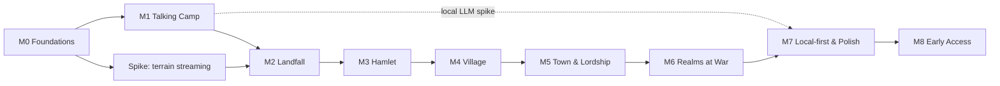

# 30 — Roadmap: Milestones, Sequencing & Exit Criteria

> **Status:** Draft v0.1 · **Owner doc for:** milestones, sequencing, exit criteria, spikes, playtest plan · **Depends on:** [01-canon §15](../01-canon.md#15-milestone-ids), every design and tech doc

This roadmap turns the plan into an order of work. It is built on three convictions:

1. **Retire the scary risks first.** The two bets that could sink the project are (a) LLM-voiced
   characters that feel like people at acceptable latency and cost, and (b) a socially simulated
   population of hundreds at playable performance. Milestone **M1** exists to prove both *before*
   terrain, art or content.
2. **Headless first.** Every system lands with headless tests and metrics
   ([ADR-0002](../adr/0002-headless-deterministic-sim-core.md)). If it can't be measured in the
   runner, it isn't done.
3. **Build in era order.** Each milestone after M1 delivers the next era of the arc
   ([canon §7](../01-canon.md#7-the-era-ladder)) as a playable slice, so the game is always playable
   from Landfall to the furthest era built.

---

## Table of contents

1. [Assumptions](#1-assumptions)
2. [Milestone overview](#2-milestone-overview)
3. [Dependency graph](#3-dependency-graph)
4. [Risk-retiring spikes](#4-risk-retiring-spikes)
5. [Milestones in detail](#5-milestones-in-detail)
6. [Cross-cutting tracks](#6-cross-cutting-tracks)
7. [Playtest plan](#7-playtest-plan)
8. [Definition of done](#8-definition-of-done)
9. [Not in v1](#9-not-in-v1)
10. [Open questions](#10-open-questions)

---

## 1. Assumptions

- **Team:** 1–2 engineers working with heavy AI assistance (Claude Code), plus contracted/part-time
  art and audio from M2 onward. Durations below are **rough ranges for that team size** and exist
  to show relative weight; re-estimate at the end of every milestone.
- **Tooling:** Godot 4.x .NET, .NET 8, GitHub (repo: `elefant35/FeudalSim`), GitHub Actions CI.
- **LLM spend during development** is budgeted separately; M1 establishes the per-play-hour cost.
- **Scope control:** each milestone has an explicit *out of scope* list. Anything not on the
  milestone's list waits, however tempting.

---

## 2. Milestone overview

| ID | Name | Goal (one line) | Rough duration | Era delivered |
|----|------|-----------------|----------------|---------------|
| **M0** | Foundations | Empty repo → building solution, ticking headless sim, YAML content, Godot test scene, AI gateway, CI | 2–4 wks | — |
| **M1** | Talking Camp | Prove LLM-voiced, socially simulated people are fun, fast and affordable; prove scale | 6–10 wks | (graybox Era 0 social) |
| **M2** | Landfall | Era 0 vertical slice in real terrain: survival, gathering, first crafts, wildlife, basic combat | 8–12 wks | Era 0 (Spring–Summer) |
| **M3** | Hamlet | Farming, construction, skills & jobs, seasons/winter, barter, council, save/load, full map | 10–14 wks | Era 0 → 1 |
| **M4** | Village | More professions, shops & markets, coin, crime & law, families & aging, Interludes, Lineage, second expedition | 12–16 wks | Era 2 |
| **M5** | Town & Lordship | Feudal governance, court, taxes & ledgers, legitimacy, schism, faith, scale to 500/1,500 | 12–16 wks | Era 3 |
| **M6** | Realms at War | Diplomacy, raids, muster, campaigns, battle mode, sieges, war's costs, steel & knighthood | 12–18 wks | Era 4 |
| **M7** | Local-first & Polish | Local LLM packaging, template-mode completeness, performance, onboarding, balance | 8–12 wks | — |
| **M8** | Early Access | Content completeness, stability, release builds, store presence | 8–12 wks | — |

Indicative total: **~18–26 months** to Early Access at the assumed team size.

---

## 3. Dependency graph

---

## 4. Risk-retiring spikes

Time-boxed experiments. Each answers one question and produces a short write-up in `docs/spikes/`
(create on first use). A failed spike triggers the relevant ADR's "Revisit if" clause.

| Spike | Question | Time-box | When | Pass condition |
|-------|----------|----------|------|----------------|
| **S1 Crowd render** | Can Godot render 150 animated low-poly characters at 60 fps (recommended spec), and 300 in battle mode at ≥ 30 fps? | 1–2 wks | M1 | Meets the budgets in [20 §19](../tech/20-architecture.md#19-performance-budgets) with animation LOD + MultiMesh/impostors |
| **S2 Dialogue latency & cost** | Can a Qwen-class model on OpenRouter give in-character replies fast and cheaply enough? Includes the model bake-off in [22 §17.2](../tech/22-llm-integration.md#172-m1--talking-camp-the-de-risking-milestone-for-this-document). | 1 wk | M1 | LLM TTFT p50 < 1.0 s; first words p50 ≤ 1.2 s (Tier A); ≤ $0.05 per typical play-hour |
| **S3 Fast decider** | Which provider makes quick choices among fixed options accurately, fast and cheaply — and how injectable is it? Bake-off: `qwen/qwen3.5-9b` via log-probabilities (works today), `qwen/qwen3-30b-a3b-instruct-2507`, **Laya** zero-shot (local, open source), and Jev if TypeSafe grants access. | 1 wk | M1 | ≥ 88% on the golden set; p50 latency ≤ 500 ms; red-team suite causes **0** off-menu actions or guard bypasses |
| **S4 Terrain streaming** | Does an 8 × 8 km stylized terrain stream smoothly in Godot (e.g. Terrain3D) within memory/VRAM budgets? | 1–2 wks | M0–M1 | Walk/run across the full map with no hitches > 50 ms; VRAM within budget |
| **S5 Local LLM beside the game** | Can a 7–14B 4-bit model run alongside the Godot client on recommended hardware (incl. Apple Silicon) at acceptable latency? | 1 wk | M1 (early look), M7 (final) | p50 TTFT ≤ 1.5 s while the game holds 60 fps |
| **S6 Sim scale** | Can the sim tick 1,500 agents across LOD tiers within budget, and fast-forward a year headless quickly? | 1–2 wks | M1 | Per-agent costs and step budgets in [20 §19](../tech/20-architecture.md#19-performance-budgets) on a synthetic population; 1 game year of 1,500 people headless ≤ 60 s at LOD2 / ≤ 5 s at LOD3 |

---

## 5. Milestones in detail

Each milestone lists **in scope**, **out of scope**, **deliverables by area**, and **exit criteria**.
Exit criteria are measurable; a milestone is not done until all are met or explicitly waived (with
the waiver recorded in this doc).

### M0 — Foundations

**Goal:** a working skeleton that every later milestone builds on.

- **In scope:** repo and solution layout; sim core skeleton (clock, tick scheduler, entities,
  command queue, event bus, seeded RNG streams); content pipeline (YAML → schema validation →
  runtime database); headless runner CLI; Godot .NET project rendering a test terrain and a capsule
  NPC driven by the sim; AI gateway able to call OpenRouter (key from `.env`) and a Jev endpoint
  (behind interfaces, with a stub provider); CI (build, test, content validation, headless smoke
  run); dev console and time controls; **the art & audio pipeline skeleton** — Git LFS, palette v0,
  headless-Blender export/check/preview scripts, one test model and one test sound end-to-end into
  Godot, the asset manifest ([32 §16](32-art-and-audio-production.md#16-production-schedule-by-milestone)).
- **Out of scope:** any gameplay system beyond what's needed to prove the plumbing.
- **Deliverables:** the ordered 15-step checklist in
  [20 §20](../tech/20-architecture.md#20-m0-foundations-checklist), plus the M0 gateway scope in
  [22 §17.1](../tech/22-llm-integration.md#171-by-milestone).
- **Exit criteria:**
  - `dotnet build` and `dotnet test` green in CI on every push to `main`.
  - Headless runner simulates 1 in-game year of an empty world with 24 placeholder agents
    deterministically: the same seed gives byte-identical event logs on the same machine.
  - Godot client shows a capsule moving according to sim commands; pausing and time-scale work.
  - A test command line call reaches OpenRouter and records the response into the event log.
  - Content validation fails CI on a malformed YAML file.
  - All 15 steps of the [20 §20](../tech/20-architecture.md#20-m0-foundations-checklist) checklist
    pass, including the replay-of-a-recorded-client-session test.
  - The ADRs proposed in [20](../tech/20-architecture.md) (time model, data layout, embodiment
    boundary, saves, terrain, .NET version) are written and accepted.

### M1 — Talking Camp

**Goal:** prove the core bet. A graybox camp of ~24 settlers who live, talk, remember, gossip,
trade and quarrel — with the player among them — *and* proof that the architecture scales to
hundreds.

- **In scope:**
  - Person model per [canon §10](../01-canon.md#10-the-person-model-shared-by-player-and-npcs):
    attributes, a subset of skills, personality facets, values, traits, needs, emotions, mood.
  - NPC AI: utility selection over a small action set (eat, drink, sleep, gather wood, gather food,
    tend fire, socialize, idle, flee), simple schedules ([21-npc-ai](../tech/21-npc-ai.md)).
  - Social core: opinion modifiers, trust, familiarity, memories, beliefs, rumor propagation in a
    24-person camp ([16-social-systems](../design/16-social-systems.md)).
  - The full dialogue turn pipeline with **decision points** ([canon §13](../01-canon.md#13-the-llm-boundary-language-decides-systems-resolve)):
    sanitize → fast-decider classification → DRE builds the menu → LLM reply with the decision
    first → guards → the owning system executes → speech streamed/verified → state commit
    ([22-llm-integration](../tech/22-llm-integration.md)).
  - The owner's examples working end-to-end: **an insult the NPC answers with a shove → brawl**
    (placeholder brawl resolution); **a bystander who steps in and stops it**; **talking someone into
    buying something → the trade system executes at a menu price**
    ([15-economy-and-trade](../design/15-economy-and-trade.md)); **a long friendly talk → warm_to_speaker
    → capped opinion change**; plus theft → witnesses → wariness and rumor.
  - Calibration tooling: LLM choices vs the deterministic policy on the same scenarios.
  - Template mode (no LLM): the policy makes every decision.
  - Spikes S1, S2, S3, S5 (early look), S6.
- **Out of scope:** real terrain, art, crafting minigames, farming, construction, combat beyond a
  placeholder brawl, save/load (beyond the event log).
- **Exit criteria:**
  - **LLM, fast decider & decision points:** all 13 exit criteria in
    [22 §17.2](../tech/22-llm-integration.md#172-m1--talking-camp-the-de-risking-milestone-for-this-document)
    (latency, rules integrity under red-teaming, calibration and refusal suites, guards without
    railroading, classification accuracy, the fast-decider bake-off, text quality, cost, resilience,
    determinism, feel, template mode, the local spike). If latency, text quality or feel fail, M1 iterates before M2 starts.
  - **Feel (playtest, ≥ 5 people × ≥ 45 min):** in addition to 22's rubric, ≥ 70% can describe 3+
    NPC personalities unprompted and every tester reports at least one moment where their words
    changed an outcome.
  - **NPC AI:** the M1 metrics in [21 §19](../tech/21-npc-ai.md#19-headless-validation-metrics) are
    within their target ranges.
  - **Decision integrity:** 0 off-menu actions or guard bypasses on the red-team suite; LLM-vs-policy
    choice-rate gap ≤ 10 points per option family on neutral scenarios; refusal suite ≥ 95%; guard
    over-rejection ≤ 5% of LLM decisions.
  - **Social sim (headless):** 30 in-game days of the camp with no deadlocks; rumors about a public
    event reach ≥ 80% of the camp within 3 days; at least one emergent dispute per 10 days.
  - **Scale:** spike S6 and S1 pass conditions met.
  - **Template mode:** the camp is fully playable with LLMs disabled.

### M2 — Landfall

**Goal:** Era 0 as a vertical slice in real terrain: the wreck, survival, the first tools, the
first season.

- **In scope:**
  - World generation v1 for at least a 2 × 2 km playable region with the landing coast; biomes,
    resources, weather basics, day/night ([10-world-and-setting](../design/10-world-and-setting.md)).
  - Survival: physical needs, injuries & bleeding, illness basics, exposure, food spoilage, fire,
    the Landfall scenario beats ([11-survival](../design/11-survival.md)).
  - Land work & crafts: foraging, woodcutting, knapping, cordage/baskets, campfire cooking,
    lean-to/hut building ([13-crafting-and-minigames](../design/13-crafting-and-minigames.md),
    [14-technology-and-buildings](../design/14-technology-and-buildings.md)).
  - Wildlife: deer, hare, boar, wolf with basic behavior; hunting (spear/bow) and basic melee
    ([18-conflict-and-warfare](../design/18-conflict-and-warfare.md)).
  - The ship's manifest: 24 generated settlers with pre-seeded relationships and the contested
    Charter.
  - Skills & XP for the skills used above ([12-skills-and-professions](../design/12-skills-and-professions.md)).
  - First art pass: terrain, foliage, settler characters, camp props; ambience audio.
- **Out of scope:** farming, permanent buildings beyond huts, economy beyond M1 barter, governance
  beyond informal leadership.
- **Exit criteria:**
  - A new player can play from the wreck through **Y0 Summer** (16 in-game days) without external
    help; NPCs teach the basics diegetically.
  - With the player idle, ≥ 90% of settlers survive Y0 Spring–Summer across 20 headless seeds.
  - Every M2 minigame has a calibrated NPC resolution and a tedium shortcut.
  - 60 fps on recommended spec in the camp with 24 settlers + wildlife.

### M3 — Hamlet

**Goal:** Era 0 → Era 1: the first winter, the first fields, the first homes and the first council.

- **In scope:** full world generation (8 × 8 km); farming (crop & soil model, pests, weather),
  basic husbandry; construction system (huts, longhouse, granary, root cellar, workshops tier 1);
  skills/XP/aptitude/know-how and job choice for all early professions; seasons and winter
  (exposure, preservation, rationing); barter economy and the communal-stores → private-property
  transition; early governance (council or headman, acclaim, simple decisions); full save/load;
  pottery and kilns (T1 start).
- **Out of scope:** coin, shops, formal law, families/births, Interludes.
- **Exit criteria:**
  - Playable from Landfall through the end of **Y1**; the first winter is a genuine test (in
    headless runs with an idle player, 60–90% of settlers survive the first winter, depending on
    seed difficulty).
  - A leadership structure emerges in ≥ 80% of seeds by Y1 without scripting.
  - Labor distribution avoids degenerate equilibria (no profession left empty when demanded for
    > 1 season in ≥ 90% of seeds).
  - Save/load round-trips with identical subsequent simulation.

### M4 — Village

**Goal:** Era 2: a busy, unequal, suspicious village with commerce, crime and families — and
time that can pass.

- **In scope:** professions and minigames for carpentry, textiles, leatherworking, smithing,
  metallurgy (copper/bronze/iron start), brewing, healing; shops, market days, fairs; coin adoption,
  credit/debt; wages and property; crime & law (theft, assault, slander; witness/evidence;
  headman/council trials; punishments); families (courtship, marriage, pregnancy, birth, children,
  aging, natural death, inheritance); **Interludes** and **Chronicles**; **Lineage**; resupply
  ships; the second expedition and a rival settlement simulated at LOD2; LOD1 rendered crowds.
- **Out of scope:** feudal titles, taxes beyond simple levies, war.
- **Exit criteria:**
  - Playable from Landfall through **Y5** with Interludes; Chronicles cite only events present in
    the event log (automated check).
  - Prices remain within ±50% of base for staple goods over 10 simulated years in ≥ 90% of seeds
    (no hyperinflation/collapse).
  - Crime rate and detection rate within the target ranges set in
    [16-social-systems](../design/16-social-systems.md).
  - Player death → heir continuation works end-to-end.

### M5 — Town & Lordship

**Goal:** Era 3: feudal order, courts and taxes — and the fractures they create.

- **In scope:** feudal governance (lords, vassals, freemen, serfs, fiefs, oaths); legitimacy model;
  holding court; taxation & the lord's ledger; appointments; succession; rebellion, schism & exodus
  (splinter settlements); guards and authorities pursuing criminals; faith system basics; iron tier
  complete, mills, walls; town scale (300–500) and world scale (1,500) with mature LOD; diplomacy
  basics between settlements.
- **Out of scope:** battles, sieges, steel.
- **Exit criteria:**
  - A player can become lord by at least three of the four paths in
    [17-governance-and-law](../design/17-governance-and-law.md) in playtests or scripted test saves.
  - Schism/exodus occurs in 20–50% of seeds by Y10 (tunable target).
  - 1,500-person world meets frame and tick budgets on recommended spec.

### M6 — Realms at War

**Goal:** Era 4: wars that start for human reasons and cost real lives, labor and love.

- **In scope:** casus belli model and war decisions; raids and outlaws; muster/conscription,
  desertion; campaigns and logistics; **battle mode** (150 combatants, stretch 300) with formation
  AI and morale; player ranks (levy → sergeant → captain → commander) and knighthood; sieges
  (simplified); war's economic and emotional effects; peace treaties; steel tier.
- **Out of scope:** mounted combat (unless proven cheap), naval warfare.
- **Exit criteria:**
  - ≥ 1 war or serious inter-settlement conflict by Y12 in ≥ 70% of headless seeds
    ([02-game-overview §13](../02-game-overview.md#13-experience-success-criteria)).
  - Measurable home-front effects: labor shortfall, price changes, grief/morale shifts in families
    of conscripts.
  - Battle mode meets S1 fps targets.

### M7 — Local-first & Polish

**Goal:** the game runs well, teaches itself, and works with local models.

- **In scope:** local LLM runtime integration and user-initiated model download; hardware
  detection and VRAM budgeting; a **local fast decider** — Laya fine-tuned on the decisions recorded
  since M1, temperature-calibrated, run in-process via ONNX or as a `laya-serve` sidecar;
  template-mode completeness; performance optimization; onboarding
  and accessibility; settings; large-scale balance via batch headless runs; content pass.
- **Exit criteria:** S5 final pass; the local fast decider matches the cloud decider's accuracy on
  the golden set within 3 points; full playthrough possible in template mode; no known
  progression blockers; balance targets met in ≥ 90% of 200 headless seeds.

### M8 — Early Access

**Goal:** ship.

- **In scope:** content completeness against the design docs' MVP lists; crash/bug burn-down; save
  compatibility policy; opt-in telemetry; Windows/macOS/Linux builds; store page, trailer, press kit.
- **Exit criteria:** crash-free sessions ≥ 99%; no data-loss bugs open; 20+ external playtesters
  complete Y0–Y5 without blocking issues.

---

## 6. Cross-cutting tracks

Art and audio production — pipelines, budgets, the full asset catalog and per-milestone deliverables —
is planned in [32-art-and-audio-production](32-art-and-audio-production.md); the table below is the
summary. Live status of every milestone's work items is in [33-progress](33-progress.md).

| Track | M0 | M1 | M2 | M3 | M4 | M5 | M6 | M7–M8 |
|-------|----|----|----|----|----|----|----|-------|
| **Art** | — | Graybox | Terrain, foliage, settlers, camp | Buildings T0–T1, crops, livestock | Workshops, clothing variety, interiors | Town, keep, walls | Armies, armor, siege | Polish, VFX |
| **Audio** | — | Placeholder | Ambience, survival SFX | Seasons, farm, building | Village life, crafts | Town, court | Battle | Mix & polish |
| **UX** | Dev console | Dialogue UI v1 | HUD, inventory, bench camera | Build UI, journal v1 | Trade/shop UI, family tree, Interlude UI | Ledger, court UI | Command UI | Onboarding, accessibility |
| **Tools** | Runner, console | NPC inspector, LLM transcript viewer | Worldgen viewer | Metrics dashboards | Event log viewer, Chronicle validator | Batch balancing | Battle sandbox | — |
| **QA** | CI | Golden convos, injection suite | Survival soak | Save/load fuzz | Economy soak | Scale soak | Battle soak | Release QA |

---

## 7. Playtest plan

| When | Who | Focus | Key questions |
|------|-----|-------|---------------|
| End M1 | 5–8 friendly testers | Talking Camp | Do NPCs feel like people? Do words matter? Is latency OK? |
| End M2 | 8–12 | Landfall | Is survival tense and learnable? Are minigames fun at rep 1 and rep 20? |
| End M3 | 10–15 | Hamlet | Is the first winter a satisfying exam? Do jobs emerge sensibly? |
| End M4 | 15–20 | Village | Do consequences travel? Are Interludes/Chronicles satisfying? |
| End M5 | 20+ | Lordship | Is holding court fun? Do paths to power feel open? |
| End M6 | 20+ | War | Does war feel costly and human? Is battle readable? |
| M7–M8 | 50+ (closed beta) | Whole arc | Stability, pacing, balance |

---

## 8. Definition of done

A feature is done when:

1. It matches its owning doc (or the doc was updated in the same change).
2. It has unit tests and contributes metrics to the headless runner.
3. It behaves correctly at every relevant LOD tier and across save/load.
4. It respects parity (player and NPCs use the same rules).
5. Any LLM/Jev touchpoint has a fallback and is covered by the eval suite.
6. It meets the performance budgets in [20-architecture](../tech/20-architecture.md).

---

## 9. Not in v1

Multiplayer · magic/monsters · naval combat · gunpowder and beyond the canon tech ceiling · voice
acting · voice input · console/mobile ports · public modding API · mounted combat (unless cheap) ·
ancient ruins/folklore layer (pending decision) · procedural quests.

---

## 10. Open questions

1. **Team size.** Durations assume 1–2 engineers. Should the plan budget for a dedicated artist
   from M2?
2. **Demo strategy.** Should an M3-era "first winter" demo be released publicly for feedback before
   Early Access?
3. **LLM costs in Early Access.** Does the game ship with a bundled cloud allowance, require the
   player's own key, or default to local/template? See
   [31-risks-and-open-questions](31-risks-and-open-questions.md).
