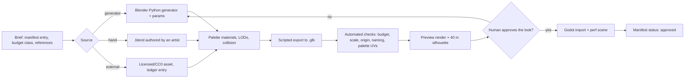
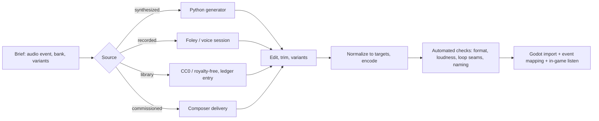

# 32 — Art & Audio Production

> **Status:** Draft v0.1 · **Owner doc for:** producing every 3D model, animation, texture, VFX, UI graphic and sound in the game — pipelines, tools, budgets, the asset catalog, naming, provenance and licensing, validation, and the per-milestone production schedule · **Depends on:** [02-game-overview §9–10](../02-game-overview.md#9-art-direction) (art & audio *direction*), [01-canon](../01-canon.md), [20-architecture](../tech/20-architecture.md) (VRAM and performance budgets, repo layout), [30-roadmap](30-roadmap.md)

[02-game-overview](../02-game-overview.md) says what FeudalSim should look and sound like. This
document says **how every asset gets made**, by whom (human, Claude via scripted Blender, or a
licensed source), to what budget, in what order, and how we prove each one is fit to ship.

---

## Table of contents

1. [Principles](#1-principles)
2. [Tools & environment](#2-tools--environment)
3. [Repository layout & the asset manifest](#3-repository-layout--the-asset-manifest)
4. [Visual production spec](#4-visual-production-spec)
5. [Budgets](#5-budgets)
6. [The 3D pipeline](#6-the-3d-pipeline)
7. [Characters & animation](#7-characters--animation)
8. [What Claude can generate — and what needs people or licensed sources](#8-what-claude-can-generate--and-what-needs-people-or-licensed-sources)
9. [3D asset catalog](#9-3d-asset-catalog)
10. [VFX & UI art](#10-vfx--ui-art)
11. [Audio architecture in Godot](#11-audio-architecture-in-godot)
12. [The audio pipeline & specs](#12-the-audio-pipeline--specs)
13. [Audio catalog](#13-audio-catalog)
14. [Provenance & licensing](#14-provenance--licensing)
15. [Validation & CI](#15-validation--ci)
16. [Production schedule by milestone](#16-production-schedule-by-milestone)
17. [Staffing](#17-staffing)
18. [Risks](#18-risks)
19. [Open questions](#19-open-questions)

---

## 1. Principles

1. **Generate, then curate.** Wherever an asset family is regular (trees, rocks, crops, building
   modules, props, terrain textures, LODs), its source of truth is a **Blender Python generator
   script** with parameters, not a hand-edited mesh. Claude writes and runs those scripts headless,
   renders previews, and a human approves the look. Re-running a generator rebuilds the family.
2. **One palette.** Almost every model is textured from a single shared **palette texture** (flat
   colour swatches with subtle gradients). It keeps the stylized look coherent across hand-made,
   generated and licensed assets, and it is very cheap in VRAM.
3. **Budgets are tests.** Triangle counts, material counts, texture sizes, loudness and file formats
   are checked automatically. An asset that fails its check doesn't ship.
4. **Provenance for everything.** Every asset has a manifest entry recording who made it, how (the
   generator and its parameters, a tool, or an external source) and under what license. No entry,
   no merge.
5. **Placeholders are first-class.** Every gameplay feature can ship to a milestone with graybox art
   (named and tracked as placeholders), so art never blocks systems work and systems never wait
   for polish.
6. **Sound is feedback.** Crafting minigames, combat and needs must be readable by ear
   ([02 §10](../02-game-overview.md#10-audio-direction)). Audio events are driven by sim events, so
   the world sounds as busy as it really is.

---

## 2. Tools & environment

| Tool | Status on the dev Mac (checked 2026-10-03) | Use |
|------|--------------------------------------------|-----|
| **Blender 5.1.0** | Installed at `/Applications/Blender.app` (not on PATH). **Verified:** a headless script built a 56-triangle stylized pine with palette materials, exported a 6 KB `.glb`, and rendered an EEVEE preview | Modelling, generators, rigging, animation, LODs, export, preview renders |
| Blender CLI | `/Applications/Blender.app/Contents/MacOS/Blender -b --factory-startup -P <script.py> -- <args>` | Every scripted asset operation (Claude runs these) |
| **Godot 4.x .NET** | Not yet installed (M0) | Import (`.glb`, `.ogg`, `.wav`, `.png`), in-engine checks |
| **Git LFS** | **Not installed** — `brew install git-lfs && git lfs install` before the first binary asset is committed (M0) | Binary assets in git |
| Python 3.13 + numpy | Installed | Procedural SFX synthesis, audio checks, manifest tooling |
| **ffmpeg** | Not installed — `brew install ffmpeg` (M0) | Encoding (OGG/WAV), loudness measurement (`ebur128`), trimming |
| sox (optional) | Not installed | Batch audio processing |
| fluidsynth + a General MIDI SoundFont (optional) | Not installed | Rendering MIDI music sketches for placeholders |
| Audacity / a DAW such as Reaper (human use) | — | Editing recordings, composing and mixing music |
| Blender MCP server (optional) | Not configured | Interactive Blender control from Claude sessions; not required (headless scripts cover the pipeline) |

**Conventions for scripted Blender work:** always `--factory-startup` (reproducible, no user
add-ons); scripts take arguments after `--`; one script = one job (generate, export, check, preview);
scripts print a machine-readable `RESULT …` line for the caller.

---

## 3. Repository layout & the asset manifest

```
/art
  /generators/<family>/          Blender Python generators (text — the real source for procedural assets)
  /blender/<category>/           Hand-authored .blend sources (Git LFS)
  /palettes/                     palette.png (256×256) + palette.json (named swatches; built by tools/art/make_palette.py)
  /reference/                    Small, licensed mood-board images
  /previews/                     Auto-rendered turntables/thumbnails (gitignored; regenerated)
/audio
  /generators/                   Procedural SFX scripts (Python)
  /source/                       Raw recordings and session files (Git LFS)
  /music/                        Stems and project files (Git LFS)
/game/assets/                    Game-ready exports imported by Godot: .glb, .png, .ogg, .wav (Git LFS)
/content/assets/                 Asset manifest YAML (one file per category)
/content/audio_events.yaml       Sim event → sound bank mapping
/tools/art/                      fsart.py (shared), export.py, check.py, preview.py, make_palette.py, budgets.json (Blender headless)
/tools/audio/                    synth.py, normalize.py, check.py
ASSET_LICENSES.md                Generated from the manifest; feeds the in-game credits
```

**Git LFS patterns** (`.gitattributes`): `*.blend *.glb *.gltf *.fbx *.png *.jpg *.exr *.wav *.ogg
*.flac *.mp3 *.psd *.kra *.sf2`. Generated previews and `*.blend1` backups are gitignored. Note: a
GitHub repo's LFS storage and bandwidth have quotas on the free tier (verify current limits at M0);
music stems and raw recordings are the biggest consumers, so keep only final masters and session
files that are needed to rebuild.

**Manifest entry** (one per shippable asset; validated by JSON Schema in CI like all content):

```yaml
# content/assets/flora.yaml
- id: asset.flora.pine_a
  kind: model                     # model | animation | texture | vfx | ui | sfx | ambience | music | vocal
  status: approved                # placeholder | draft | review | approved | final
  milestone: M2
  source:
    type: generator               # generator | hand | external | recorded | synthesized | commissioned
    generator: art/generators/conifer/conifer.py
    params: { tiers: 3, sides: 7, height_m: 3.7, seed: 11 }
  outputs: [game/assets/flora/pine_a.glb]
  budget_class: tree_small        # see §5
  measured: { tris_lod0: 56, materials: 2 }
  license: { name: Proprietary-own-work, author: FeudalSim, attribution_required: false }
  notes: "Variant family pine_a..pine_f from seeds 11–16"
```

---

## 4. Visual production spec

| Topic | Rule |
|-------|------|
| Scale | 1 Blender unit = 1 m (canon §14). Adult human ≈ 1.60–1.85 m; doors 2.0 m high; a hand tool ≈ 0.4–0.9 m |
| Orientation | Blender Z-up; the glTF exporter converts to Y-up. Characters and directional props face **Blender −Y**, which arrives as **+Z** in Godot (Godot 4's model-front convention). Verify with the M0 test asset |
| Origin | At the base centre (on the ground plane); for handheld items, at the grip |
| Shading | Flat-shaded low-poly forms; smoothing only on organic silhouettes (faces, animals) |
| Colour | Palette swatches via UVs collapsed onto swatch cells; **≤ 2 materials** per prop (palette + optional special); culture accents from reserved palette rows (Varrow, Osmeri, Brannoch, Ashen) |
| Quality read | Item quality (canon §10.8) must show: crude = lumpy silhouette and dull swatches; masterwork = cleaner bevels, an accent swatch, a maker's mark decal at bench-camera distance |
| Seasons | Foliage and ground swap palette rows per season (spring green → summer → autumn → bare/snow) via a shader parameter, not separate meshes |
| Wear | Building Condition (14) drives a shader blend (clean → weathered → damaged) plus a separate damaged mesh state for < 25 |
| Wind | Foliage and cloth sway in a vertex shader (weights painted in vertex colour) |
| Silhouette test | Every character and animal must read at 40 m in a black-silhouette render (automated preview) |

---

## 5. Budgets

Aligned with the ≤ 4 GB VRAM plan in [20 §19](../tech/20-architecture.md#19-performance-budgets)
(vegetation & props 700 MB, buildings 450 MB, characters 450 MB).

| Budget class | LOD0 tris | LOD1 | LOD2 / impostor | Materials | Textures |
|--------------|-----------|------|-----------------|-----------|----------|
| Character (body + clothes + hair) | 2,500–4,000 | 1,200 | 500; billboard beyond ~60 m | ≤ 3 | Palette + 1 pattern atlas (≤ 512²) |
| Animal, small (hare, fowl, fish) | 300–800 | 300 | billboard | 1 | Palette |
| Animal, medium (deer, boar, wolf, goat, sheep, dog) | 1,200–2,500 | 700 | 300 | ≤ 2 | Palette |
| Animal, large (bear, cattle, horse) | 2,000–3,500 | 1,000 | 400 | ≤ 2 | Palette |
| Tree | 200–1,500 | 40% | Octahedral impostor | ≤ 2 | Palette (+ leaf-card atlas ≤ 512² if used) |
| Shrub / crop plant | 30–300 | 50% | cull | 1 | Palette |
| Rock / ore node | 50–400 | 50% | cull/merge | 1 | Palette (+ ore accent) |
| Handheld prop (tool, weapon) | 50–600 | 50% | cull | ≤ 2 | Palette |
| Bench-camera close-up variant | ≤ 3,000 | — | — | ≤ 3 | ≤ 1024² detail map |
| Workstation (anvil, loom, kiln…) | 300–2,000 | 50% | cull | ≤ 2 | Palette |
| Building, small (lean-to, hut) | 300–1,500 | 50% | merged proxy | ≤ 3 | Palette + roof atlas |
| Building, medium (cottage, workshop) | 1,500–4,000 | 40% | proxy | ≤ 3 | Palette + roof/wall atlas |
| Building, large (hall, church) | 5,000–12,000 | 30% | proxy | ≤ 4 | Atlases ≤ 1024² |
| Fortification module (wall, tower, gate) | 1,000–6,000 | 30% | proxy | ≤ 3 | Atlases ≤ 1024² |
| Terrain material | — | — | — | splat layers | ≤ 1024² per layer, ≤ 32 layers |

**Skeletons:** humanoid ≤ 45 deform bones (+ face controls); quadruped ≤ 35. **Animation:** 30 fps
authoring; compressed in Godot.

---

## 6. The 3D pipeline



**Step details**

1. **Brief** — a manifest entry with `status: placeholder`, the budget class, the gameplay doc it
   serves (e.g. `13 §8.3 bowyery stages`), and 1–3 reference images.
2. **Build** — generator, hand model, or licensed import. Generators expose seeds and parameters so
   variants (pine_a…pine_f) are one command.
3. **Prepare** — assign palette swatches; generate LODs (generator parameters or Decimate with
   preserved silhouette); author collision using Godot's import name suffixes (`-col`, `-colonly`,
   `-convcolonly`); name per `<category>_<name>_<variant>_lod<N>`.
4. **Export** — `tools/art/export.py` exports `.glb` with fixed settings (Y-up, apply modifiers,
   no cameras/lights, animations as actions).
5. **Check** — `tools/art/check.py` (headless Blender) measures tris per LOD, materials, bounds and
   scale, origin, forward axis, non-manifold/flipped normals, palette-UV containment, naming; writes
   `measured:` back to the manifest.
6. **Preview** — `tools/art/preview.py` renders a 4-angle turntable and a black silhouette at 40 m
   into `art/previews/` for review (Claude can read these images to self-check before asking for
   human approval).
7. **Approve & import** — a human approves the look (status → approved); Godot imports with
   committed `.import` presets; the asset appears in a perf scene with its LODs.

---

## 7. Characters & animation

### 7.1 Characters

- **One humanoid skeleton** for everyone (adults, with proportional scaling for youths and elders;
  children use a scaled variant). Generated with Rigify in Blender, exported as a single Godot
  `Skeleton3D` profile so all animations retarget.
- **Modular meshes** on that skeleton: 2 base bodies × 4 builds; 12 heads; 16 hair; 10 beards; and
  clothing layers by culture × status band (canon §10.7) — undergarment, tunic/dress, outer layer,
  footwear, headwear, plus armour pieces (18). Hidden-surface removal by masking body regions under
  clothing.
- **Faces:** blend shapes for the six canon emotions (Anger, Fear, Grief, Joy, Shame, Jealousy), a
  blink, and 3–4 mouth shapes for talking. There is no voice acting, so mouths animate to text
  streaming rhythm.
- **Readability:** status and profession read from clothing silhouette and colour at 20 m (a smith's
  apron, a lord's mantle, a priest's robe).

### 7.2 Animation list (v1)

All movement animations are **in place**: the sim owns position ([20 §3](../tech/20-architecture.md#3-the-embodiment-boundary-lod0--headless-sim)),
and Godot blends locomotion by speed and adds foot IK.

| Set | Clips | First needed |
|-----|-------|--------------|
| Locomotion | idle ×3, walk, jog, sprint, crouch walk, carry-heavy walk, swim, climb, fall, land, sit down/up, lie down/up, sleep | M1 (graybox) / M2 |
| Social | talk gestures ×6, nod, shake head, shrug, point, wave, laugh, cry, argue ×2, kneel, bow, embrace, hand over item, receive item, eat, drink, pray | M1–M2 |
| Gathering | chop, split, saw, dig, pick up, forage-pick, fish cast/reel, net haul, carry log/stone | M2 |
| Crafting | knap, carve, hammer (light/heavy), forge strike, bellows, quench, scrape hide, stitch, spin, weave, knead, stir, pour, potter's wheel, grind (quern) | M2–M4 |
| Farming & husbandry | till, sow, weed, water, scythe, bind sheaf, thresh, milk, shear, feed | M3 |
| Combat | per weapon class (unarmed, 1H, 1H + shield, 2H, spear/polearm): light ×2, heavy ×1, block, parry, dodge ×2; bow draw/hold/release; crossbow load/fire; hit reactions by body region (canon §10.9) ×6; stagger; downed; death ×2; yield/kneel; execution (content-gated) | M2 (basic) → M6 (full) |
| Leadership | address a crowd, sit in judgment, sign/seal, command gestures ×3 | M5–M6 |
| Animals (each species) | idle, walk, run, graze/eat, alert, attack (if any), hit, death, sleep | M2 onward |
| Props | door open/close, bellows pump, mill wheel, loom beater, drawbridge, banner cloth | M3–M6 |

**Count:** ~180 humanoid clips and ~120 animal clips for v1.

### 7.3 Sources for animation

Scripted keyframing is fine for props and simple creature cycles, but **convincing human motion
needs a human animator, motion capture, or licensed libraries**:

- *Prototype (M1–M2):* CC0 low-poly animated packs (e.g. Quaternius, Kenney) and royalty-free
  animation libraries (e.g. Mixamo — read the terms and record them in the ledger before shipping
  anything derived from them).
- *Production (M3+):* affordable markerless mocap (video-based) for work and social motions, cleaned
  and retargeted in Blender, plus a contract animator for combat and signature crafts.

---

## 8. What Claude can generate — and what needs people or licensed sources

| Asset type | Claude via scripted Blender / Python | Needs a person or licensed source |
|------------|--------------------------------------|-----------------------------------|
| Trees, shrubs, rocks, ore nodes | **Yes** — parametric generators with variants | — |
| Crops at every growth stage | **Yes** — one generator per crop with a `stage` parameter | — |
| Building modules, palisades, walls, towers | **Yes** — kit generators (walls, roofs, openings, chimneys) and assembly by blueprint | Hero buildings (keep, church) get an artist pass |
| Props, tools, weapons, workstations, furniture | **Yes** — from reference + parameters; quality-tier variants | Bench-camera hero props may get an artist pass |
| Terrain splat textures, palettes, UI frames | **Yes** — procedural textures; palette authoring | — |
| LODs, collision, impostors, previews, exports, checks | **Yes** — fully automated | — |
| The ship and its breakup states | Partly — generator for hull/sections | Artist pass for the hero wreck |
| Human characters (bodies, faces, hair, clothing) | Blockouts and clothing variants only | **Character artist** for bases, heads, hair |
| Animals | Blockouts | **Artist** or licensed models |
| Human animation | Props and simple cycles only | **Animator / mocap / licensed** |
| VFX (fire, smoke, sparks, weather) | **Yes** — Godot particle scenes + generated sprite sheets | — |
| UI icons (~400 items) | **Yes** — rendered from the item models with a fixed camera/lighting rig | Hand-drawn map style needs an illustrator pass |
| SFX — UI, synthetic impacts, noise beds (wind, rain, fire) | **Yes** — Python synthesis | — |
| SFX — foley (wood, metal, leather, cloth, stone, animals) | No | **Recorded foley** or CC0/royalty-free libraries |
| Non-verbal vocalizations | No | **Voice sessions** (cheap: no lines, just grunts, laughs, sighs) |
| Music | Placeholder MIDI sketches only | **Composer** (commission) |

**Generative-AI services** (text-to-3D, text-to-audio, AI music): allowed only when the service's
terms grant commercial use, the output is recorded in the ledger with `source.type: external` and
the tool's name, and a human reviews it. Storefronts (e.g. Steam) ask developers to disclose
AI-generated content, including pre-generated assets, so the ledger doubles as the disclosure record
([31 R17](31-risks-and-open-questions.md#1-risk-register)).

---

## 9. 3D asset catalog

Counts are unique assets (variants counted separately where noted). Milestones as in canon §15.

| Category | Contents | Approx. count | First needed |
|----------|----------|---------------|--------------|
| **Graybox kit** | Capsule people with coloured role markers, primitive props, block buildings | 40 | M1 |
| **Coast & terrain** | Terrain splat layers (sand, grass, dirt, mud, rock, snow, tilled soil, road, forest floor), water, foam, cliffs, reef | 12 layers + 20 meshes | M2 |
| **Flora** | Trees (oak, ash, elm, yew, hazel, beech, pine, birch, alder, willow) × 4–6 variants × 4 season tints; shrubs; herbs and forage plants incl. poisonous look-alikes ([10](../design/10-world-and-setting.md), [13](../design/13-crafting-and-minigames.md)); reeds | ~90 | M2 |
| **Crops** | Barley, wheat, oats, rye, peas/beans, flax, cabbage, turnip, onion × 5 growth stages + blighted/pest states | ~60 | M3 |
| **Rocks & resources** | Boulders, scree, flint, clay bank, copper, tin placer, hill iron, bog iron, galena, quarry faces, depleted states | ~45 | M2–M4 |
| **The Wending Star** | Wreck on the reef, 4 sections (deck, cabins, holds, hull), breakup states, flotsam, salvage crates | ~20 | M2 |
| **Settlers** | Modular bodies, heads, hair, beards, clothing by culture × status band | ~150 parts | M2 → M5 |
| **Wild animals** | Deer, boar, hare, wolf, bear, fox, wild goat, waterfowl, fish ×3, seabirds, seals; bees as VFX | 14 | M2 |
| **Domestic animals** | Goat, chicken (M2–M3); sheep, cattle/ox, pig, horse, dog, cat (as ships bring them) | 8 | M2–M5 |
| **Shelter & buildings** | Lean-to, sailcloth shelter, hut, longhouse, cottage, granary, root cellar, every workshop in [14 §3](../design/14-technology-and-buildings.md#3-buildings-catalog), mills, tavern, chapel, market, hall/manor, palisade, stone walls, gatehouse, keep; construction-stage and damaged states | ~60 buildings via ~150 kit modules | M2 → M6 |
| **Workstations** | Campfire, drying rack, knapping stone, carpentry bench, sawpit, anvil & forge, bloomery, charcoal clamp, kiln, potter's wheel, loom, spinning wheel, tanning vats, quern, oven, brewing vats, smokehouse racks | ~25 | M2 → M4 |
| **Tools & items** | Every tool and craftable item in [13](../design/13-crafting-and-minigames.md) with quality-tier variants: knives, axes, saws, hammers, tongs, bows (green → self → composite), arrows, spears, swords, polearms, shields, crossbows; pottery, baskets, cloth, clothing; food items | ~250 | M2 → M6 |
| **Armour** | Hide/leather, padded, mail, coat-of-plates, helms T0–T4 (canon §9) by culture | ~30 | M4 → M6 |
| **Siege & war** | Rams, ladders, mantlets, trebuchet, tents, banners, camp props | ~20 | M6 |
| **Furniture & interiors** | Beds (bough → bed), chests, tables, benches, hearths, lamps, court dais, altar | ~40 | M3–M5 |

**Total v1:** roughly **1,000 unique game-ready meshes**, most from generators.

---

## 10. VFX & UI art

- **VFX** (Godot GPU particles + generated flipbooks): fire (campfire → forge → burning building),
  smoke, sparks, embers, dust, wood chips, steam/quench hiss, water splashes, blood (content
  setting), rain/snow/fog volumes, magic-free "omens" (birds scattering) for the folklore layer if
  adopted. ~40 effects.
- **UI art:** a parchment-and-ink kit (frames, buttons, dividers, seals), a hand-drawn map style
  (coastlines, symbols, fog of knowledge), journal and ledger layouts, ~400 item icons rendered
  automatically from item models with a fixed light rig, emotion/demeanor glyphs, and a
  legibility-first modern UI font paired with a display font (both licensed for embedding).

---

## 11. Audio architecture in Godot

```
Master
├── Music          (adaptive states; ducked by Stingers)
├── Ambience       (biome beds + settlement layers + weather)
├── SFX
│   ├── World      (3D: work, footsteps, animals, fire, water)
│   ├── Combat     (3D: swings, impacts, blocks, bows)
│   └── UI         (2D)
└── Vocal          (non-verbal vocalizations, 3D)
```

- **Event-driven:** the client subscribes to sim events and plays sounds through
  `content/audio_events.yaml`, which maps event ids (e.g. `craft.smithing.strike.hot`,
  `combat.hit.blunt.mail`, `need.hunger.stomach`) to banks with variation rules. Every sim event
  that should be audible has a mapping, so missing sounds are caught by a test.
- **Ambience is simulated, not looped blindly:** layers mix by biome, time of day, season, weather,
  and **settlement activity** — the number of LOD0/LOD1 people working at smithies, sawpits and
  markets near the player drives how many hammers and voices you hear.
- **Adaptive music states:** explore (by biome and season), settlement (by era: sparse →
  fuller instrumentation), night, tension, combat, court, festival/tavern (diegetic), grief (a death
  in the player's circle), Interlude/Chronicle. **Stingers** mark births, deaths, era transitions and
  declarations of war.
- **Spatial:** `AudioStreamPlayer3D` with tuned attenuation; reverb zones (interior, forest, cave,
  stone hall); cheap occlusion by raycast to the listener for walls.

---

## 12. The audio pipeline & specs



| Spec | Value |
|------|-------|
| Sample rate | 48 kHz |
| Short SFX | WAV, 16-bit, **mono** for 3D sounds, stereo only for UI |
| Music, ambience beds | OGG Vorbis (quality 5–6), stereo, seamless loops with loop points set on import |
| Loudness targets | Music masters −18 LUFS integrated; ambience beds −24 LUFS; SFX peak-normalized to −1 dBTP with per-bank gain set in the mix |
| Variation | 3–5 takes for frequent sounds; random pitch ±5% and volume ±2 dB at play time |
| Resident audio memory | ≤ 256 MB; music and ambience stream from disk |
| Naming | `<bus>_<category>_<name>_<variant>.wav`, e.g. `sfx_craft_smith_strike_hot_03.wav` |

---

## 13. Audio catalog

| Category | Contents | Approx. files | First needed |
|----------|----------|---------------|--------------|
| **Footsteps** | 8 surfaces (sand, grass, dirt, mud, stone, wood floor, snow, shallow water) × walk/run × 4 + body-fall | ~70 | M2 |
| **Gathering & tools** | Chop, split, saw, dig, forage, pick up/drop by material, carry, fishing cast/splash | ~80 | M2 |
| **Crafting minigames** | Every minigame's feedback cues (e.g. knapping flake snap vs shatter; bow creak near the limit and crack on failure; hammer on hot vs cold iron; quench hiss; bellows; wheel hum; kiln roar; loom beat; mash stir) | ~200 | M2 → M4 |
| **Farming & husbandry** | Till, sow, water, scythe, threshing, mill, animal handling | ~60 | M3 |
| **Combat** | Swings by weapon class; impacts by damage type × armour (cut/pierce/blunt × flesh/leather/mail/plate/shield/wood); blocks, parries; bow draw/release; arrow flight and impacts; crossbow; brawling | ~180 | M2 → M6 |
| **Animals** | Each species: idle, alarm, attack, pain, death (+ domestic calls) | ~110 | M2 → M5 |
| **Ambience beds** | 8 biomes × day/night × 4 seasons (shared where sensible); coast surf; river; settlement layers by size and activity; interiors | ~80 | M2 → M5 |
| **Weather** | Rain (3 intensities × surfaces), wind (3 strengths), thunder, snow, storm at sea | ~30 | M2 |
| **Fire & water** | Campfire to burning building; boiling, splashes, wading, swimming | ~30 | M2 |
| **UI** | Parchment, quill, coin, notifications by priority, journal, map | ~40 | M1 → M7 |
| **Vocalizations** | 6 voice types × ~15 kinds (effort, pain, laugh, sigh, gasp, cry, shout, cheer, yawn, cough, hum…) × 3 takes | ~270 | M2 → M4 |
| **Music** | Exploration themes per biome/season; settlement-era themes; night; tension; combat; court; tavern/festival songs (diegetic); funeral lament; Interlude/Chronicle theme; stingers | **45–60 min** + ~20 stingers | M2 (sketches) → M7 |

**Total v1:** roughly **1,200 sound files** plus the score.

---

## 14. Provenance & licensing

- **Acceptable sources:** our own work; **CC0**; royalty-free commercial licenses without
  share-alike or non-commercial terms (each license text stored under `/licenses/`); commissioned
  work with a written assignment or perpetual license.
- **Not acceptable:** CC-BY-NC, CC-BY-ND, CC-BY-SA (for game assets), "free for personal use",
  anything without a clear license, ripped or traced assets, generative-AI output whose terms don't
  grant commercial use.
- **Attribution:** licenses that require credit are allowed only if the manifest records the exact
  credit line; `ASSET_LICENSES.md` and the in-game credits are generated from the manifest.
- **AI disclosure:** the manifest's `source` fields are the record behind the storefront disclosure.

---

## 15. Validation & CI

| Check | Tool | When |
|-------|------|------|
| Manifest schema, every file referenced, every shipped file has an entry, license present | `feudalsim content validate` | Every PR (CI) |
| Mesh budgets, scale, origin, orientation, naming, normals, palette UVs | `tools/art/check.py` (headless Blender) | Pre-commit for changed assets; nightly full run |
| Godot import succeeds with no warnings; perf scene stays within budget | Godot headless import + perf scene | Nightly; milestone gates |
| Audio format, sample rate, channels, loudness (EBU R128), loop seams, naming | `tools/audio/check.py` (ffmpeg `ebur128`) | Every PR touching audio |
| Every audible sim event has a mapping; every mapping resolves to files | Unit test over `audio_events.yaml` | Every PR (CI) |
| Silhouette and turntable previews regenerated for review | `tools/art/preview.py` | On demand / in review |

Blender in CI is heavy (≈ 300 MB download); run art checks locally and in a nightly job rather than
on every push.

---

## 16. Production schedule by milestone

| Milestone | Art deliverables | Audio deliverables |
|-----------|------------------|--------------------|
| **M0** | Pipeline skeleton: Git LFS on, palette v0, `export/check/preview` scripts, the test pine end-to-end into Godot, manifest schema | ffmpeg installed; `synth/check` scripts; one SFX end-to-end into Godot; `audio_events.yaml` schema |
| **M1** | Graybox kit (capsule people with role markers, primitive props), placeholder dialogue UI | Placeholder UI sounds; reaction "barks" as vocalization placeholders |
| **M2** | Coast terrain layers, flora v1 (8 tree families), rocks, the wreck and its sections, campfire, lean-to and hut, knapping/carving close-ups, settler bodies v1 (2 bases, 6 heads, 3 clothing sets), 6 wild animals + goats/chickens, locomotion + ~40 social/gathering/craft clips, basic combat clips | Coast/forest/meadow ambience, weather, footsteps, fire, chopping, knapping, wild-animal calls, first vocalization session, 10 min of music sketches |
| **M3** | Crops × stages, farming tools, building kit T0–T1 (longhouse, granary, cellar, workshops), seasonal palettes and snow, furniture v1, pottery & kiln | Farm and seasonal ambience, winter, pottery and carpentry cues, music: exploration themes ×3 |
| **M4** | Workshops and workstations for every M4 profession, clothing by status/culture, interiors, market stalls, crafting clips, armour T0–T3 | Village layers, every craft's cues, tavern songs ×3, more vocalizations, music: settlement themes |
| **M5** | Stone building kit, mills, walls, keep, court interior, horses/cattle/sheep/pigs, leadership clips | Town and court ambience, livestock, music: court, tension |
| **M6** | Armour and weapons T3–T4, siege engines, camp props, full combat clip set, battle VFX | Full combat bank, battle ambience, music: combat, war stingers |
| **M7–M8** | LODs/impostors everywhere, VFX polish, UI art pass, icon renders, final hero-asset passes | Final mix and master, loudness pass, full score delivery, credits |

---

## 17. Staffing

Claude covers generators, procedural assets, LODs, exports, checks, previews, icons, VFX and
synthesized sounds. People are needed for:

| Role | Engagement | From |
|------|-----------|------|
| Art director / owner sign-off | The owner approves looks at review gates | M0 |
| Character & animal artist (contract) | Bases, heads, hair, animals, hero assets | M2 |
| Animator or mocap cleanup (contract) | Human motion, combat | M2 → M6 |
| Composer (commission) | Score and diegetic songs | M3 (sketches earlier from placeholders) |
| Foley & voice sessions | 2–4 short sessions | M2, M4, M6 |
| Illustrator (small) | Map style, UI ornaments | M4 |

---

## 18. Risks

| Risk | Mitigation |
|------|------------|
| **Style drift** between generated, hand-made and licensed assets | One palette; shared shading rules; preview reviews side by side; external assets re-paletted on import |
| **Animation quality** is the hardest gap for a small team | Licensed/CC0 sets for prototypes; mocap + a contract animator for production; in-place clips keep retargeting simple |
| **License contamination** | Manifest required for every file; CI fails on missing license; no unclear sources |
| **LFS quotas and repo bloat** | Only final masters in LFS; previews gitignored; check quotas at M0 |
| **Audio repetition** fatigue | Variants, randomization, activity-driven ambience |
| **Scope** (~1,000 meshes, ~1,200 sounds) | Generators for families; placeholders allowed until each milestone's art gate |

These feed the project register in [31](31-risks-and-open-questions.md) (R24, R25).

---

## 19. Open questions

1. **Art budget:** how much contract art, animation and music can the project fund, and from which
   milestone?
2. **Generative-AI assets:** allowed at all for shipped content, or only for placeholders?
3. **Blender MCP:** worth configuring for interactive art sessions, or are headless scripts enough?
4. **Licensed packs:** acceptable to ship CC0 packs (e.g. Quaternius, Kenney) re-paletted, or
   prototypes only?
5. **Voice:** stay with non-verbal vocalizations in v1 (canon), or plan a TTS experiment post-v1?
