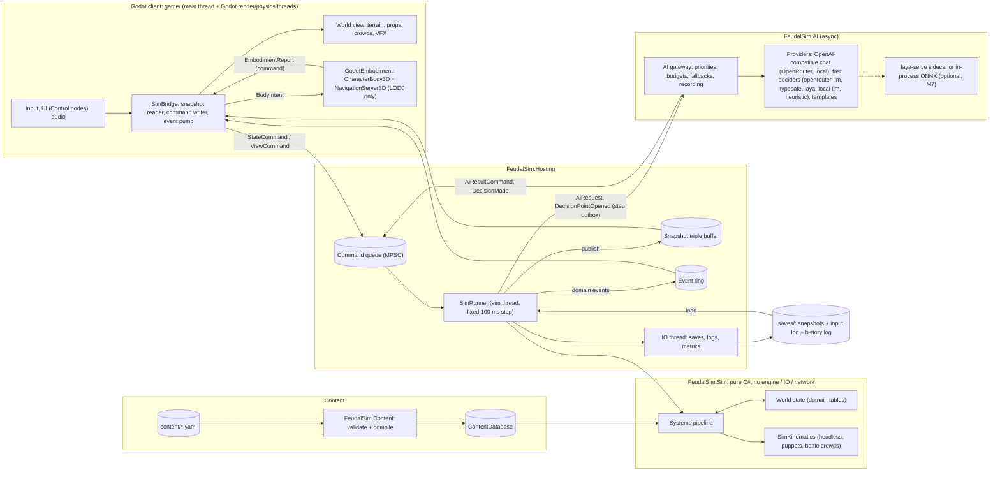
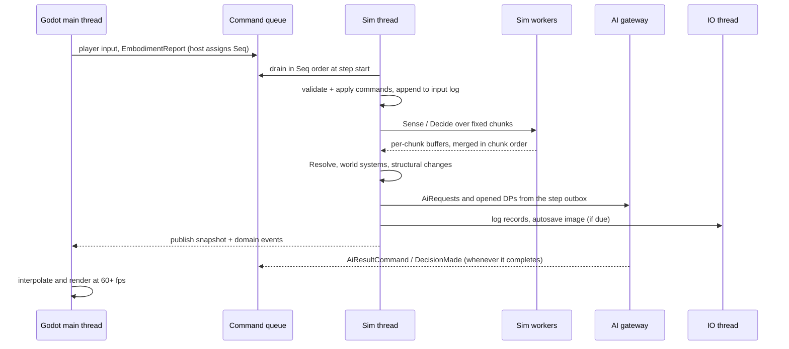
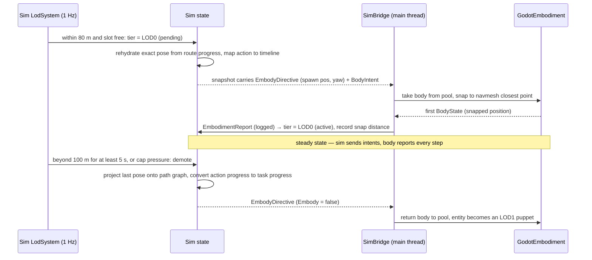
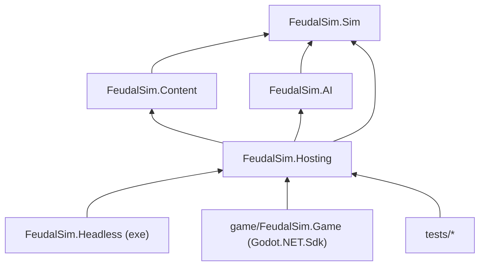
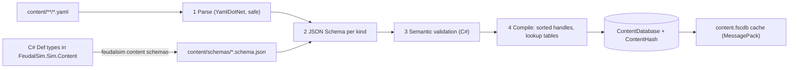

# 20 — Technical Architecture

> **Status:** Draft **v0.2** (2026-10-04: M0 results — terrain decided by the M0-12 spike, ADR-0009; .NET 10 SDK, ADR-0010; embodiment verified, ADR-0007), revised for canon v0.3 (decision points) · **Owner doc for:** engine/sim architecture, threading, clocks & ticks, ECS/data layout, the LOD0 embodiment boundary, commands/events, save/load, determinism, content pipeline, AI-gateway interfaces, Godot client structure, headless runner, testing, performance budgets, tooling, CI/CD, repo layout & engineering conventions · **Depends on:** [01-canon](../01-canon.md) (§4, §6, §8, §13, §14), [ADR-0001](../adr/0001-engine-godot-dotnet.md), [ADR-0002](../adr/0002-headless-deterministic-sim-core.md), [ADR-0003](../adr/0003-language-decides-systems-resolve.md), [ADR-0004](../adr/0004-single-player-scope.md) · **Interfaces with:** [21-npc-ai](21-npc-ai.md), [22-llm-integration](22-llm-integration.md), [10-world-and-setting](../design/10-world-and-setting.md), [13-crafting-and-minigames](../design/13-crafting-and-minigames.md), [18-conflict-and-warfare](../design/18-conflict-and-warfare.md), [19-player-experience](../design/19-player-experience.md), [30-roadmap](../production/30-roadmap.md)

This document says **how FeudalSim is built**: where code lives, which thread runs what, how the
simulation advances, how state is stored and saved, how determinism is kept, and how the Godot client
attaches to a headless simulation. It defines mechanisms, not game rules — *how* NPCs decide (utility,
propensities, the deterministic policy) is [21-npc-ai](21-npc-ai.md), *how* language models choose at
decision points and what they say is [22-llm-integration](22-llm-integration.md), and
every design number belongs to its owning design doc ([canon §16](../01-canon.md#16-document-ownership-map)).

Conventions used here: **MUST / SHOULD / MAY** are normative. `[M0]`…`[M8]` tag the milestone that
first needs a feature ([canon §15](../01-canon.md#15-milestone-ids)). Library names and versions are
recommendations as of 2026-10 and are marked *(verify)* where they must be re-checked at
implementation time. C# snippets are sketches of shape, not final code.

---

## Table of contents

1. [Key decisions at a glance](#1-key-decisions-at-a-glance)
2. [Architecture overview](#2-architecture-overview)
3. [The embodiment boundary (LOD0 ↔ headless sim)](#3-the-embodiment-boundary-lod0--headless-sim)
4. [Solution & repo layout](#4-solution--repo-layout)
5. [Time, clocks & ticks](#5-time-clocks--ticks)
6. [Data layout (ECS)](#6-data-layout-ecs)
7. [Systems, scheduling & parallelism](#7-systems-scheduling--parallelism)
8. [Determinism](#8-determinism)
9. [Commands, events & persistence](#9-commands-events--persistence)
10. [Content pipeline](#10-content-pipeline)
11. [AI gateway (interfaces)](#11-ai-gateway-interfaces)
12. [Godot client](#12-godot-client)
13. [Headless runner](#13-headless-runner)
14. [Testing strategy](#14-testing-strategy)
15. [Tooling & debugging](#15-tooling--debugging)
16. [CI/CD & workflow](#16-cicd--workflow)
17. [Engineering conventions](#17-engineering-conventions)
18. [Security & privacy](#18-security--privacy)
19. [Performance budgets](#19-performance-budgets)
20. [M0 Foundations checklist](#20-m0-foundations-checklist)
21. [Architecture risks](#21-architecture-risks)
22. [Open questions](#open-questions)
23. [Proposed canon additions](#proposed-canon-additions)

---

## 1. Key decisions at a glance

| # | Decision | Section |
|---|----------|---------|
| D1 | `FeudalSim.Sim` is a pure C# `net8.0` library with no engine, IO or network dependencies. It talks to the world **only through messages**: commands in; snapshots, domain events and AI requests out. | [§2](#2-architecture-overview) |
| D2 | The sim runs on a **dedicated thread at a fixed 100 ms step** (10 Hz). The renderer interpolates from triple-buffered snapshots; it never reads live sim state. | [§2.3](#23-threading-model), [§5](#5-time-clocks--ticks) |
| D3 | **Two clocks:** a monotonic `Step` index (covers fine and macro steps) and a game clock in game-milliseconds. Canonical timestamps stay **integer game-minutes** (canon §14). | [§5](#5-time-clocks--ticks) |
| D4 | **Embodiment boundary:** the sim owns intent, state and action *timelines*; Godot realizes LOD0 motion and reports body state back **as logged commands**; headless swaps in `SimKinematics`. Only position/velocity/flags cross the boundary. | [§3](#3-the-embodiment-boundary-lod0--headless-sim) |
| D5 | **Custom domain tables** (struct-of-arrays, id-ordered rows) instead of a general ECS library. | [§6](#6-data-layout-ecs) |
| D6 | **Keyed, counter-based RNG**: every random draw is a pure function of (world seed, stream, entity, step, salt). No RNG state is saved. | [§8.2](#82-random-numbers) |
| D7 | Determinism is guaranteed for **same build + same OS + same CPU architecture**, independent of thread count, frame rate and time scale. Cross-platform determinism is **not** required. | [§8.1](#81-the-guarantee) |
| D8 | A save is a **saga folder**: column-tolerant snapshot (MessagePack + LZ4) + input log since that snapshot + compacted history log. Autosave daily at 06:00 game time. | [§9](#9-commands-events--persistence) |
| D9 | Content is **YAML → JSON Schema (generated from C# definition types) → semantic validation → compiled `ContentDatabase`** with numeric handles. | [§10](#10-content-pipeline) |
| D10 | AI is reached by **outbox/inbox messages with sim-side deadlines and deterministic fallbacks**; results — including every model-made choice — are recorded as commands, so replays never touch the network. | [§11](#11-ai-gateway-interfaces) |
| D11 | Terrain: **Terrain3D** for the 8,192 m region, gated by an M0/M2 spike, with a custom chunked-mesh terrain as fallback. | [§12.4](#124-terrain--world-streaming) |
| D12 | The **headless CLI** is a first-class product for designers (batch balance runs, replays, benchmarks), not a test harness afterthought. | [§13](#13-headless-runner) |
| D13 | **Decision points** (canon §13): the sim builds the menu and propensities; an LLM or fast decider (`IDecider`) *may* choose; the sim guards and executes. The choice arrives as a recorded `DecisionMade` command; if none has applied by the sim-side deadline, the deterministic policy decides. Headless and CI are policy-only. | [§8.5](#85-external-inputs-are-logged-commands), [§11](#11-ai-gateway-interfaces) |

---

## 2. Architecture overview

### 2.1 Component diagram



### 2.2 Layers and responsibilities

| Layer | Owns | Never does |
|-------|------|-----------|
| **Sim core** (`FeudalSim.Sim`) | All game state and rules; time; RNG; LOD tiers; validation of every input; serialization *to a stream*; the AI request/result *contract*; decision-point menus, propensities, guards (the DRE), deadlines and the policy | Call Godot, read files, open sockets, read the wall clock, block on anything |
| **Hosting** (`FeudalSim.Hosting`) | The sim thread and worker pool, queues and buffers, save/log file IO, settings and secrets loading, wiring Sim + Content + AI. Shared by the game and the headless CLI. | Contain game rules |
| **AI** (`FeudalSim.AI`) | Prompt building, chat and fast-decider providers, HTTP, streaming, budgets, circuit breakers, recording (rules owned by [22](22-llm-integration.md)) | Mutate sim state (it only produces result *commands*); build menus, compute numbers or propensities, or pick anything the sim did not offer |
| **Content** (`FeudalSim.Content`) | YAML parsing, schema + semantic validation, compiling to `ContentDatabase`, schema generation | Run at gameplay time except load/hot-reload |
| **Client** (`game/`) | Rendering, input, audio, UI, LOD0 physics bodies & navmesh, minigame presentation | Decide outcomes; hold authoritative state other than LOD0 body pose |
| **Headless** (`FeudalSim.Headless`) | CLI: run, batch, replay, bisect, bench, content, AI ping | Contain game rules |

### 2.3 Threading model

| Thread | Owner | Does | MUST NOT |
|--------|-------|------|----------|
| Godot main | Godot | Input, scene tree, UI, reads snapshots, writes commands, drains event ring, drives LOD0 bodies in `_PhysicsProcess` | Run sim logic; block waiting for the sim |
| Godot render / physics | Godot | Rendering, physics server work | — |
| **Sim thread** | Hosting (`SimRunner`) | Step loop: drain commands → run systems → publish outputs | Call Godot; do file or network IO; `await` |
| Sim workers (N = clamp(cores − 3, 1, 6)) | Hosting (`JobRunner`) | Parallel phases inside one step, on **fixed chunks** ([§7.3](#73-parallel-execution-rules)) | Touch state outside their chunk contract |
| AI gateway (async I/O) | AI | HTTP calls, streaming, JSON parsing; in-process decider inference (ONNX, if adopted in M7) on its own capped worker | Touch sim state; run inference on the sim thread or sim workers |
| IO thread | Hosting | Save compression + atomic writes, log segment appends, metrics files | — |

One step of the loop:



### 2.4 What a step produces

```csharp
public sealed class StepOutput            // pooled; one per step, handed to Hosting
{
    public long Step;                     // monotonic step index (§5.1)
    public long GameMs;                   // game clock after this step
    public RenderSnapshot Snapshot;       // render-relevant subset (written into triple buffer)
    public EventEnvelope[] Events;        // domain events emitted this step, Seq-ordered
    public AiRequest[] AiRequests;        // new requests (outbox)
    public DecisionPointOpened[] OpenedDps; // DPs a model may decide (§11); also written to the input log
    public AiRequestId[] AiCancels;       // superseded requests
    public StepDiagnostics Diagnostics;   // per-system µs, counts, warnings
}
```

- **Snapshots** hold what the view needs: per visible entity id, position, yaw, LOD tier, action id
  + phase + phase start step, equipment visuals, plus time of day and weather. About 64 B × 1,500 ≈
  100 KB per step, so copying is trivial. The triple buffer lets the renderer read *latest* and
  *previous* while the sim writes the third.
- **Render interpolation:** non-embodied entities are drawn one step (100 ms) behind the sim,
  interpolated between the two latest snapshots. LOD0 bodies are drawn from the Godot physics bodies
  themselves, so the player never sees latency on their own movement.
- **Commands** come in two classes. **`StateCommand`s** can change state; they are validated,
  applied in `Seq` order at the start of a step, and **always logged**. **`ViewCommand`s** (watch an
  entity in the inspector, request detail DTOs, change camera focus) cannot change state and are
  **never logged**. The type system enforces the split.
- **Domain events** are ground-truth facts (`PersonDied`, `ItemCrafted`, `TheftCommitted`). They go
  to in-sim subscribers (memory formation, history log, metrics) on the sim thread, in `Seq` order,
  and to presentation via the event ring. Presentation can only affect the sim by sending commands.
- **Detail queries:** the UI never reaches into sim tables. The inspector sends `WatchEntity(id)`
  (a ViewCommand). For watched entities the sim appends a detail DTO (needs, memories, utility
  breakdown) to the snapshot.

---

## 3. The embodiment boundary (LOD0 ↔ headless sim)

### 3.1 The problem

LOD0 NPCs ([canon §8.2](../01-canon.md#82-simulation-levels-of-detail-canonical-tiers)) need things
only an engine provides: navmesh paths around real geometry, collision, avoidance, animation, and
precise weapon contact for the player. The sim must still run headless, deterministically, at 100×
speed. There are two ways to get this wrong:

1. **The sim depends on the engine.** This breaks headless runs, replays and tests.
2. **Two authorities disagree.** The sim believes an NPC is at A and the body is at B. Items get
   duplicated, NPCs end up inside walls, and actions are lost on demotion. These *reconciliation
   bugs* are the classic failure of hybrid simulations.

### 3.2 Principles

1. **The sim owns *what*; the embodiment owns *exactly where the body is*.** Intent, needs,
   inventory, health, action choice, action timing and every outcome live in the sim. The
   embodiment only realizes motion and reports pose.
2. **One authority per datum per tier at any moment.** See the table in §3.3.
3. **Everything the embodiment tells the sim is a `StateCommand`.** It is logged, so a replay
   needs no client: the recorded reports *are* the physics.
4. **Action timing comes from content timelines, not animations.** Animations are fitted to
   timelines by scaling playback rate, with root motion off.
5. **The sim validates every report.** It never trusts the client blindly.
6. **One contract, two implementations:** `GodotEmbodiment` (client) and `SimKinematics` (headless
   runs, LOD1 puppets, battle crowds, pending embodiment). Because `SimKinematics` is also the
   production mover for crowds, it gets the same engineering care as the client side.

### 3.3 Authority table

| Datum | LOD0 in client | LOD1 | LOD2 / LOD3 | Headless (any tier) |
|-------|---------------|------|-------------|---------------------|
| Position / velocity | **Embodiment** (reported every step) | Sim: path-graph progress | Sim: schedule location (hourly / daily) | `SimKinematics` |
| Route choice (which roads, avoid enemy land) | **Sim** path graph → next waypoint | Sim | Sim | Sim |
| Local pathing & avoidance | **Navmesh** (NavigationServer3D, RVO) | Sim, simplified | n/a | `SimKinematics` separation |
| Collision with world | Godot physics | none (puppets snap to terrain) | n/a | heightfield + footprints |
| Action selection | Sim ([21](21-npc-ai.md)) | Sim | Sim | Sim |
| Action timing (windup / impact / recover) | **Sim timeline** from content | task granularity | statistical | Sim timeline |
| Melee hit geometry, NPC attacker | **Sim**: arc test vs reported poses | — (auto-resolve) | — | Sim |
| Melee hit geometry, player attacker | Client shape-cast → **claim**; sim validates | — | — | n/a |
| Projectiles | **Sim** ballistic, swept vs capsules + heightfield | — | — | Sim |
| Damage, block, outcome | Sim ([18](../design/18-conflict-and-warfare.md)) | Sim | Sim | Sim |
| Perception (sight, hearing) | **Sim**, coarse occluder model | Sim, abstract | rolled | Sim |
| Falls, drowning | Client reports `Fall` / `Submerged`; sim applies | — | — | not produced |
| Animation pose | Client (cosmetic) | Client (simplified) | — | none |
| Inventory, needs, health, relationships | Sim | Sim | Sim | Sim |

Perception stays in the sim on purpose: stealth ([canon §10.2](../01-canon.md#102-skills-0100--the-canonical-list-28)
Stealth) must be deterministic and identical headless. The trade-off is that the sim's occluder
model (heightfield, building walls, tree trunks as cylinders, large rocks) may disagree with what
the player sees. A crate the player hides behind does not occlude unless it is a sim entity.
Mitigation: anything big enough to hide behind is a sim entity; decorative clutter is never
cover. The dev overlay draws sim occluders ([§15](#15-tooling--debugging)).

### 3.4 Contract

```csharp
namespace FeudalSim.Sim.Embodiment;   // System.Numerics.Vector3 — never Godot types

// Sim → embodiment: published in the snapshot every step for each embodied entity.
public readonly record struct BodyIntent(
    EntityId Entity, uint IntentVersion,          // bumps on change; client skips unchanged
    LocomotionIntent Move, ActionIntent Action);

public readonly record struct LocomotionIntent(
    LocomotionMode Mode,                          // Idle, MoveTo, Follow, Flee, Face, Hold
    Vector3 NextWaypoint, Vector3 Goal, EntityId GoalEntity,
    float DesiredSpeed, float ArriveRadius,       // m/s and m in embodied time
    Stance Stance);                               // Walk, Run, Sneak, Combat, Carry

public readonly record struct ActionIntent(
    ActionDefHandle Action,                       // content: action.chop, action.swing_overhead…
    EntityId Target, Vector3 TargetPoint,
    long StartStep, ActionPhase Phase);           // Windup, Impact, Recover, Loop

public readonly record struct EmbodyDirective(EntityId Entity, Vector3 SpawnPos, float Yaw, bool Embody);

// Embodiment → sim: ONE command per step, built by the bridge, quantized before enqueueing.
public sealed record EmbodimentReport(long BasedOnStep, BodyState[] Bodies, ContactEvent[] Contacts)
    : StateCommand;

public readonly record struct BodyState(
    EntityId Entity, Vector3 Position, Vector3 Velocity, float Yaw,
    BodyFlags Flags,                              // Grounded, InWater, Swimming, Blocking, Dodging, Crouched
    NavStatus Nav);                               // Moving, Arrived, Blocked, NoPath

public readonly record struct ContactEvent(
    ContactKind Kind,                             // PlayerMeleeClaim, Fall, Submerged, Shove
    EntityId A, EntityId B, BodyZone Zone, float Magnitude, Vector3 Point);
```

Reports are **quantized when the command is created** (position 1 mm, yaw 0.1°, velocity 1 cm/s).
The logged command is therefore exactly what the sim applied, and the log compresses well
([§9.7](#97-size-estimates)).

### 3.5 Actions: sim-timed, client-realized

Every embodied action has a content-defined timeline (values below are illustrative; the real ones
are owned by [13](../design/13-crafting-and-minigames.md) and [18](../design/18-conflict-and-warfare.md)):

```yaml
- id: action.chop
  timeline: { windup_ms: 400, impact_ms: 100, recover_ms: 400 }
  loopable: true
  reach_m: 1.2
  anim: chop_overhead      # client animation key; playback rate fitted to the timeline
```

- **NPCs:** the sim starts the action at step *S*; the phases follow in embodied milliseconds. The
  client plays the clip scaled to the timeline and fires cosmetic VFX/SFX at the clip's impact
  marker. The *effect* (a tree loses integrity, XP accrues) happens at the sim's impact step.
- **Player:** on input the client **starts the animation immediately** (responsiveness) and sends
  `PlayerAction(action, aim)`. The sim starts the same timeline at its next step, so the visual
  and simulated impacts differ by at most one step (≤ 100 ms).
- **Minigames** ([13](../design/13-crafting-and-minigames.md)) are client-side input devices. They
  submit a structured `MinigameOutcome` command (per-phase performance scores). The sim checks the
  ranges and computes the result with the same quality model NPCs use (canon tenet 2, parity).

### 3.6 Combat contacts

- **NPC → anyone (melee):** at the impact step the sim tests an arc (reach, half-angle) from the
  attacker's reported pose against target capsules at their reported poses, including the target's
  `Blocking`/`Dodging` flags. Resolution uses the Combat RNG stream. This is deterministic and
  identical headless.
- **Player → anyone (melee):** aim is a player skill, so the client shape-casts the weapon at the
  visual impact frame and sends `PlayerMeleeClaim(target, zone)`. The sim accepts the claim if the
  target is within reach + 0.5 m and within the arc + 20° at the sim's latest poses, and the action
  is in its impact window ±1 step. It then resolves block, parry and damage itself. A swing with no
  claim is a miss.
- **Projectiles** are simulated by the sim as ballistic paths. Each step sweeps a segment against
  capsules and the heightfield; arrows travel about 6 m per step. The client renders arrows
  analytically from the launch parameters. Player shots send `PlayerShoot(origin, dir, draw)`.
- **Combat feel gate [M2]:** if 10 Hz resolution feels mushy, lower the base step to **50 ms**. All
  rates are authored in milliseconds or game-minutes, never in step counts
  ([§5.2](#52-cadences-per-tier)), so `StepMs` is one constant and behavior systems keep running at
  10 Hz by gating on elapsed time.

### 3.7 Promotion and demotion



Rules:

- **Hysteresis:** promote at ≤ 80 m, demote at ≥ 100 m after ≥ 5 s dwell (radii owned by [21](21-npc-ai.md)). The cap of 48 is allocated
  by priority: conversation partner > hostile or in combat > in view frustum > nearest. The player
  is always embodied and is not counted.
- **Pending state:** after the sim promotes an entity it keeps moving it with `SimKinematics` until
  the first report arrives. If no report arrives within 5 steps, the embodiment is cancelled with a
  logged warning.
- **Only pose crosses the boundary.** Nothing in inventory, needs or relationships is ever held by
  the client, so there is nothing else to reconcile. Demotion converts a partial action into task
  progress (a chop 40% through counts toward the "fell tree" task), so no work is lost or doubled.
- **Metrics:** `lod.snap_distance` per promotion. More than 2 m raises a warning; more than 10 m
  fails the Godot integration tests. Route waypoints must lie on walkable navmesh, and a dev-mode
  validator samples path-graph nodes against the navmesh.
- **Report sanity:** if |Δpos| > maxSpeed × Δt × 1.5 + 0.5 m, the sim clamps and logs a
  `Teleport` anomaly (dev teleports are exempt). `Nav = Blocked` for more than 3 s makes the sim
  replan. `NoPath` marks that route edge blocked for the entity. A stuck body may be unstuck by an
  off-screen snap to the nearest path node.
- **Skips:** Wait, Sleep and Interludes disembody everyone. Bodies are restored after the skip by
  rehydration ([§5.4](#54-macro-stepping-wait-sleep-interludes)).

### 3.8 `SimKinematics`

A deterministic mover, about 1–2k lines of code:

- follows path-graph polylines at the desired speed with acceleration limits
- samples height from the sim heightfield
- separates agents through a spatial hash (16 m cells) with pairwise push
- does formation steering for battles
- does no physics

It serves four roles:

1. LOD0-equivalent motion in headless runs
2. LOD1 puppet positions that the client renders
3. Battle crowds in the LOD0-B sub-tier ([§12.7](#127-battle-mode))
4. Pending embodiment

In headless runs NPCs never fall or drown. That divergence is accepted and documented.

### 3.9 Alternative considered: navmesh inside the sim

A C# port of Recast/Detour (**DotRecast**, MIT *(verify)*) could give the sim its own navmesh,
built from the heightfield and building footprints. All NPC locomotion would then be
sim-authoritative and deterministic. Only the player body would stay client-side, and replays
would need no NPC body reports.

- **For:** perfect headless/client parity, a smaller input log, and no snap bugs for NPCs.
- **Against:** sim geometry must match the visuals, so a visual prop missing from the sim is a
  walk-through-walls bug. It costs more sim CPU, and Godot's baking and avoidance tools would go
  unused.

**Gate (M3):** if M2–M3 produce recurring reconciliation bugs, or headless-vs-client behavior
divergence that matters for balance, write an ADR to move NPC locomotion into the sim. The §3.4
contract survives that change: `GodotEmbodiment` would simply stop reporting NPC bodies.

---

## 4. Solution & repo layout

### 4.1 Folder tree

```text
FeudalSim/
├── FeudalSim.sln
├── global.json                  # pins .NET SDK 10.0.401 (rollForward: latestFeature) + MTP test runner; projects target net8.0 (ADR-0010)
├── Directory.Build.props        # LangVersion, Nullable, TreatWarningsAsErrors, analyzers (all projects)
├── Directory.Packages.props     # central package versions
├── .editorconfig
├── BannedSymbols.txt            # determinism & hot-path bans (applied to FeudalSim.Sim)
├── CLAUDE.md                    # AI-assistant guide: commands, project map, hard rules
├── README.md
├── .env.example  .gitignore     # (exist)
├── .github/workflows/           # ci.yml, godot.yml, nightly.yml, release.yml (M7+)
├── src/
│   ├── FeudalSim.Sim/           # core: clock, RNG, tables, systems, ports, persistence (to Stream)
│   ├── FeudalSim.Content/       # YAML → validated → ContentDatabase; JSON Schema generation
│   ├── FeudalSim.AI/            # gateway, providers, recording, secrets
│   ├── FeudalSim.Hosting/       # SimRunner, JobRunner, queues, snapshot buffers, save/log IO, wiring
│   └── FeudalSim.Headless/      # CLI exe (`feudalsim`)
├── tests/
│   ├── FeudalSim.Sim.Tests/
│   ├── FeudalSim.Content.Tests/
│   ├── FeudalSim.AI.Tests/
│   ├── FeudalSim.Integration.Tests/   # determinism, golden seeds, save/load, architecture rules
│   ├── FeudalSim.Benchmarks/          # BenchmarkDotNet
│   ├── FeudalSim.AI.Evals/            # LLM eval suite — owned by 22; not run in PR CI
│   └── goldens/                       # per-RID golden hashes + metric envelopes
├── game/                        # Godot project
│   ├── project.godot  FeudalSim.Game.csproj
│   ├── addons/                  # terrain_3d, gdUnit4, imgui-godot (dev only)
│   ├── scenes/                  # boot, world, characters, ui, minigames, battle, dev
│   ├── scripts/                 # Bridge/, Embodiment/, View/, UI/, Dev/
│   ├── assets/                  # models, textures, animations, audio, fonts
│   └── tests/                   # GdUnit4 scene tests
├── content/
│   ├── schemas/                 # generated JSON Schemas (committed; CI checks freshness)
│   ├── items/ recipes/ actions/ skills/ knowhow/ traits/ buildings/ crops/ animals/ biomes/ …
│   ├── tuning/                  # global tunables (decay rates, thresholds) — overridable by scenarios
│   ├── scenarios/               # headless & test scenarios
│   └── templates/               # non-LLM fallback text (owned by 22)
├── tools/
│   ├── FeudalSim.Tools/         # dotnet console: bless-golden, perf-compare, save-inspect, report
│   ├── FeudalSim.Analyzers/     # custom Roslyn analyzers (FS001…) [M1]
│   └── analysis/                # optional Python notebooks over sim_runs/ CSVs
└── docs/                        # adr/, design/, tech/, production/
```

Tests live in `/tests` rather than next to each project in `/src`. This keeps `src/` limited to
shipping code and lets CI glob `tests/**`. Runtime output folders (`saves/`, `logs/`, `sim_runs/`,
`llm_transcripts/`, `models/`) are already gitignored and are created on demand.

### 4.2 Projects and references



| Project | Type | Refs | Allowed third-party packages |
|---------|------|------|------------------------------|
| `FeudalSim.Sim` | class lib, net8.0 | — | MessagePack (+ source generator), Microsoft.Extensions.Logging.Abstractions, System.IO.Hashing. **Nothing else without an ADR.** |
| `FeudalSim.Content` | class lib | Sim | YamlDotNet, JsonSchema.Net (+ .Generation) |
| `FeudalSim.AI` | class lib | Sim (port DTOs only) | BCL HTTP/JSON; optional Microsoft.Extensions.AI ([22](22-llm-integration.md) decides); **optional, M7 evaluation:** Microsoft.ML.OnnxRuntime for an in-process Laya decider (native binaries per RID, incl. osx-arm64 — needs an ADR) |
| `FeudalSim.Hosting` | class lib | Sim, Content, AI | Microsoft.Extensions.Logging, ZLogger |
| `FeudalSim.Headless` | exe | Hosting | Spectre.Console.Cli |
| `game/FeudalSim.Game` | Godot C# | Hosting | Godot.NET.Sdk |

The Sim depends on no content loader: **content definition types (`ItemDef`, `SkillDef`…) live in
`FeudalSim.Sim.Content`**, and `FeudalSim.Content` compiles YAML into them. The AI is reached only
through message DTOs that the Sim defines ([§11](#11-ai-gateway-interfaces)).

### 4.3 Dependency rules and enforcement

1. `FeudalSim.Sim` MUST NOT reference Godot, `System.Net.*`, YAML, file IO, or `FeudalSim.AI`.
2. Only `FeudalSim.Hosting` composes the pieces. The game and the CLI differ only in their adapters
   (`GodotEmbodiment` vs `SimKinematics`, render bridge vs metrics writer).
3. Enforcement has three layers:
   - project references (compile time);
   - an **architecture test** in `Integration.Tests` (NetArchTest-style *(verify maintenance)*)
     that asserts the Sim assembly's references are on an allow-list;
   - **BannedApiAnalyzers** with `BannedSymbols.txt` on the Sim ([§8.6](#86-banned-apis-and-analyzers)).

### 4.4 Library choices

All versions *(verify at M0)*.

| Purpose | Choice | Alternative | Rationale |
|---------|--------|-------------|-----------|
| Binary serialization | **MessagePack-CSharp v3** (source-generated formatters) | MemoryPack | Fast, AOT-friendly, versionable `[Key]`/`Union`, and readable from Python tools. Benchmark against MemoryPack at M0. |
| Compression | LZ4 (MessagePack `Lz4BlockArray`) | ZstdSharp | Speed over ratio for autosaves |
| Stable hashing | System.IO.Hashing (XxHash64 / XxHash3) | — | Stable across processes, unlike `GetHashCode` |
| YAML | **YamlDotNet** | VYaml | Mature, line/column errors, safe by default |
| JSON Schema | **JsonSchema.Net** (json-everything) | NJsonSchema | Validation and generation from C# types |
| CLI | **Spectre.Console.Cli** | System.CommandLine (check GA status) | Stable, good tables and progress output |
| Logging | MEL abstractions + `[LoggerMessage]` source gen; ZLogger sink | Serilog | Zero-alloc structured logs |
| Unit tests | **xUnit v3** | NUnit | Mainstream; v3 is the current line |
| Assertions | **Shouldly** / xUnit `Assert` | FluentAssertions | FA v8+ needs a commercial license *(verify)*, so avoid it |
| Property tests | **CsCheck** | FsCheck | C#-native, fast shrinking |
| Benchmarks | **BenchmarkDotNet** | — | Standard |
| Godot tests | **GdUnit4** (C# support) | Chickensoft GoDotTest | Headless CI runner |
| Terrain | **Terrain3D** (GDExtension) | Custom chunked mesh | [§12.4](#124-terrain--world-streaming) |
| Physics | Godot built-in **Jolt** module | GodotPhysics3D | Faster, more stable character bodies |
| Dev UI | **imgui-godot** (ImGui.NET) | Control nodes | Fast to build inspectors (dev builds only) |

---

## 5. Time, clocks & ticks

### 5.1 Two clocks

| Clock | Type | Meaning |
|-------|------|---------|
| `Step` | `long`, monotonic | Count of executed sim steps of any kind (fine or macro). The **ordering key** for command application, logs and RNG. Never derived from game time. |
| `GameMs` | `long`, monotonic | Game time in game-milliseconds since `Y0 Spring 1 00:00`. Internal precision only. |
| `GameMinute` | `long` = `GameMs / 60_000` | **The canonical timestamp** ([canon §14](../01-canon.md#14-scales-units--conventions)), used in every component, event, memory and save field. |
| Embodied time | ms | The physical time of bodies: walking speeds, swing durations. Equals real time at 1× time scale. |

A **fine step** advances embodied time by `StepMs = 100`, and game time by
**`GameMsPerStep = 144,000 / DayLengthMinutes`**, computed directly in integer arithmetic. (This equals
`StepMs × Ratio` with `Ratio = 1440 / DayLengthMinutes` game minutes per real minute, but the ratio is
fractional for 25- and 50-minute days — 57.6 and 28.8 — so it is display-only; M0-04 found and fixed
this.) At the canonical 30-minute day a step is 4,800 game-ms (4.8 game-seconds), 12.5 steps make a game minute, and
18,000 steps make a game day.

**Day-length setting** (canon §6: 20–60 real minutes). Game-ms per step must be an integer, so
144,000 / L must be an integer. The allowed values are
**{20, 24, 25, 30, 32, 36, 40, 45, 48, 50, 60}**.

| Day length (real min) | Ratio | Game-ms / step | Steps / game hour | Steps / game day |
|----|----|----|----|----|
| 20 | 72 | 7,200 | 500 | 12,000 |
| **30 (default)** | **48** | **4,800** | **750** | **18,000** |
| 40 | 36 | 3,600 | 1,000 | 24,000 |
| 45 | 32 | 3,200 | 1,125 | 27,000 |
| 60 | 24 | 2,400 | 1,500 | 36,000 |

`SetDayLength` is a logged `StateCommand` that takes effect at the next step. **Consequence:**
embodied actions (walking, swinging) are in embodied time, while needs, crops, schedules and the
calendar are in game time. At LOD1+, task durations are converted from embodied action durations at
the current ratio, so every tier agrees. Day length is therefore a *gameplay* setting: in a 60-minute
day people walk twice as far per game hour. Balance and golden tests use 30. Whether to normalize
productivity across day lengths is an open question.

### 5.2 Cadences per tier

All cadences are authored in **embodied ms or game-minutes** and converted to step schedules at
runtime. No system hard-codes "every N steps".

| Scope | Cadence (canon §8.2) | Default steps | Spreading (deterministic) |
|-------|----------------------|---------------|---------------------------|
| LOD0 behavior, embodiment sync, combat | every step (100 ms) | 1 | — |
| LOD1 | 1 Hz embodied | 10 | 10 buckets by `XxHash(id) % 10` |
| LOD2 | every game hour | 750 | per-entity **phase offset** in game-ms = `hash(id) % 3,600,000`; an entity updates when its phase falls in (prevGameMs, nowGameMs] mod 1 hour, so spreading is independent of day length |
| LOD3 (far settlements, normal play) | every game day | 18,000 | settlements assigned fixed slices across the day |
| World systems | game-time schedules | — | [§7.2](#72-system-catalog) |

Every tiered update receives its own `dtGameMs = now − lastUpdate[tier]`. An entity that was
promoted or demoted therefore integrates the right amount, whatever bucket it lands in.

*Implemented (S6, [spike write-up](../spikes/s6-sim-scale.md)):* `TierSchedule` builds the due rows and
their `dt` once per step after the Sense phase; per-person systems iterate only those rows. LOD2 uses
the per-entity phase offset above; LOD3 updates at the day boundary (one settlement in M1) or every macro
step. **LOD1 still updates every step in M1** — 0.3 µs per person-step is far inside the LOD1 budget, and
it keeps the tuned camp unchanged; the 1 Hz bucketing above waits until a profile needs it. World-level
upkeep is spread too: the relationship daily update runs in 24 hourly slices by holder (16 §4.8).

### 5.3 The loop, time scale and pause

```csharp
// FeudalSim.Hosting.SimRunner — runs on the dedicated sim thread
while (!_stop)
{
    switch (_mode)
    {
        case RunMode.Paused:   _wake.WaitOne(); continue;
        case RunMode.Skipping: RunMacroStep(); continue;               // §5.4
        case RunMode.MaxSpeed: StepOnce(); continue;                   // headless / dev
    }
    _accumulator += _realClock.ElapsedMsSinceLast() * _timeScale / StepMs;
    int n = 0;
    while (_accumulator >= 1.0 && n < MaxCatchUpSteps /* 5 */)
    {
        StepOnce();                       // drain commands → systems → publish
        _accumulator -= 1.0; n++;
    }
    if (_accumulator >= 1.0) { _accumulator = 0; _diag.TimeDilationEvents++; }  // fall behind gracefully
    SleepUntilNextStepDue();
}
```

- **Time scale** sets how many steps run per real second, not what a step does. It is therefore
  **not a sim input**, it is not logged, and determinism is unaffected. Supported: 0 (pause), 1×,
  "hurry" 2×/4×, and dev up to max speed. Player-facing rules are owned by
  [19](../design/19-player-experience.md); a natural default is to allow hurry only with no hostile
  at LOD0 and no conversation open.
- **Pause** stops stepping. UI, the dialogue UI and LLM streaming keep running. Commands queue up
  and apply on the next step.
- **Focus time** (canon §6.3: the world clock runs at 12:1 while a conversation, court session or
  battle is open) is proposed as a **logged clock-ratio change** — like `SetDayLength`, game-ms per
  step drops to 1,200 — not a time-scale change, so steps keep their 10 Hz embodied rate and bodies
  keep walking at normal speed. Decision-point deadlines in steps (§11) rely on this (open
  question 16).
- **Overload:** if the sim cannot keep up, it drops accumulated time ("time dilation") rather than
  spiralling. This is visible in the dev overlay and counted in metrics.
- **Godot bodies follow sim time.** LOD0 bodies live in Godot physics, which runs on wall time, so
  the bridge mirrors the sim: it sets `Engine.TimeScale` to the sim time scale, and on pause it
  pauses the scene tree (world nodes `ProcessMode.Pausable`, UI and dialogue nodes
  `ProcessMode.Always`). Time dilation also lowers `Engine.TimeScale` for its duration. Without
  this, bodies would keep walking during a pause or lag behind intents at hurry speed, and the
  report check in [§3.7](#37-promotion-and-demotion) would fire false `Teleport` anomalies. Hurry
  speeds above 4× and every skip disembody everyone first.

### 5.4 Macro-stepping: Wait, Sleep, Interludes

Canon §6.1 runs skips at LOD3. The mechanism:

1. `BeginSkip(targetGameMs, kind)` is a logged command. The sim validates availability and safety
   (rules in [19](../design/19-player-experience.md) and [11](../design/11-survival.md)), then
   autosaves ([§9.6](#96-autosave-and-save-slots)).
2. Everyone is disembodied and every person is set to LOD3; previous tiers are remembered.
3. The runner switches to `RunMode.Skipping`. Each **macro step** is one `Step`, advances `GameMs`
   by **1 game hour** for skips under 1 day (Wait, Sleep) or **1 game day** for Interludes, and runs
   the LOD3 systems with that `dt`. LOD3 systems MUST be `dt`-parameterized.
4. **Interrupts:** systems emit `InterruptCandidate` events tagged with an in-step time of day. The
   skip controller checks the canon §6.1 list (settlement attacked, household birth or death,
   summons, accusation, war, critical needs). On the first hit it stops, sets the clock to the
   interrupt's `GameMs`, and ends the skip.
5. **Rehydration** ([21](21-npc-ai.md) owns the rules): reconstruct each person's plausible
   schedule state at the end time. The LodSystem re-tiers, and the player's surroundings are
   re-embodied.
6. Emit `InterludeCompleted(fromSeq, toSeq)`, which triggers a Batch-priority Chronicle request
   ([§11](#11-ai-gateway-interfaces)).
7. Progress is published in snapshots. `CancelSkip` is honored at the next macro-step boundary.

Targets on minimum spec at 1,500 people: **1 season ≤ 4 s, 8 seasons ≤ 30 s**
([§19](#19-performance-budgets)).

---

## 6. Data layout (ECS)

### 6.1 Options

| Option | Strengths | Weaknesses for FeudalSim |
|--------|-----------|--------------------------|
| **Arch** (archetype ECS) | Very fast iteration, source-generated queries, active | Iteration order follows archetype and slot history, so after save/load the order differs unless layout is reconstructed. Its persistence add-on is separate. API churn across majors; unsafe-heavy internals. |
| **Friflo.Engine.ECS** | Very fast, zero dependencies, built-in serialization, relations and indexes | Same ordering concern; younger, single maintainer *(verify)* |
| **DefaultEcs** | Simple, proven | Development has slowed *(verify)*; no advantage at our scale |
| **Custom domain tables** (SoA) | Iteration order fixed by construction (id order); trivial column serialization; tailored sparse stores; no dependency; plain code that AI assistants read and write reliably | We build it (~1.5k LoC) and must stay disciplined |

### 6.2 Recommendation: custom domain tables

FeudalSim has **few entity kinds with mostly fixed component sets**. Every person has needs, skills
and personality, so archetype fragmentation buys little. Per-entity logic dominates cost: a utility
evaluation is tens of µs, iterating memory is nanoseconds. Determinism and **save/load equivalence**
(continuing a loaded save must equal never having saved) are hard requirements, and id-ordered
tables give them for free.

- Each entity kind has a **`Table`**: struct columns (`Needs[]`, `Skills[]`, …), a dense row index,
  and an `EntityId → row` map. Rows are kept in ascending `EntityId` order. Ids are monotonic, so
  creation appends. Deaths tombstone the row, and daily compaction removes tombstones while
  preserving order.
- **Tier lists**: the LodSystem maintains sorted row-index arrays per LOD tier, so systems iterate
  `People.InTier(LOD1, bucket)` cheaply.
- Systems are plain `sealed` classes with explicit loops over spans. No reflection, no hidden
  queries.
- **Gate [M1]:** in the M1 scale spike, if table plumbing exceeds 15% of the step budget or the
  ergonomics fail, write an ADR to adopt Friflo/Arch behind the same system interfaces.

### 6.3 Entity ids

```csharp
public readonly record struct EntityId(ulong Value) : IComparable<EntityId>
{
    public EntityKind Kind => (EntityKind)(Value >> 56);
    public ulong Serial    => Value & 0x00FF_FFFF_FFFF_FFFFUL;
    public static EntityId Make(EntityKind kind, ulong serial) => new(((ulong)kind << 56) | serial);
    public int CompareTo(EntityId other) => Value.CompareTo(other.Value);
}
public enum EntityKind : byte
{ None, Person, Animal, Herd, Household, Settlement, Polity, Faction, Building, Plot,
  Container, ItemInstance, Army, Battle /* append only */ }
```

- These are canon §14's 64-bit runtime ids. **Never reused.** Dead people move to a compact
  **`PersonArchive`** (name, dates, lineage, cause of death, key ties), so memories, lineage
  ([canon §12](../01-canon.md#12-the-player)) and Chronicles can reference them forever.
- `RowRef(int Index, uint Generation)` gives fast in-step access and is **never persisted**.

### 6.4 Component catalog (Person table)

Dense columns are blittable structs; sizes are estimates.

| Column | Contents | ~B | Rules owned by |
|--------|----------|----|----------------|
| `PersonCore` | name (string handle), sex, birth `GameMinute`, life stage, household, settlement, polity, homeland/culture, faith, flags | 48 | [16](../design/16-social-systems.md) |
| `Attributes` | 6 × byte (canon §10.1) | 6 | [12](../design/12-skills-and-professions.md) |
| `Skills` | 28 × ushort (value ×100) + 28 × byte aptitude (×0.01) — fixed buffers | 84 | [12](../design/12-skills-and-professions.md) |
| `Personality` | 5 facets + 9 values (bytes) + up to 4 trait handles | 22 | [21](21-npc-ai.md) |
| `Needs` | 4 physical + 5 psychological (float, 0–100) | 36 | [11](../design/11-survival.md) / [21](21-npc-ai.md) |
| `Affect` | 6 emotions + mood (float) | 28 | [21](21-npc-ai.md) |
| `Health` | HP, blood, stamina, condition list handle | 16 | [11](../design/11-survival.md) |
| `Transform` | `Vector3` pos, yaw, cell id, route edge, edge t | 32 | 20 |
| `LodState` | tier, embodied/pending, bucket, phase offset, last-update per tier | 32 | 20 |
| `ActionState` | action handle, phase, start step, target, progress | 32 | [13](../design/13-crafting-and-minigames.md) / [21](21-npc-ai.md) |
| `Brain` | current goal/task, utility cooldowns, plan handle | 64 | [21](21-npc-ai.md) |
| `Routine` | schedule template, overrides handle | 16 | [21](21-npc-ai.md) |
| `Role` | job, employer, workplace, rank/lord | 24 | [12](../design/12-skills-and-professions.md) / [17](../design/17-governance-and-law.md) |
| `Equipment` | 10 slots × `ItemRef` | 80 | [13](../design/13-crafting-and-minigames.md) / [18](../design/18-conflict-and-warfare.md) |
| `Purse` | coin in farthings (`long`, canon §11) | 8 | [15](../design/15-economy-and-trade.md) |

Total dense data is about **0.6 KB per person**. Variable-size data lives in sparse stores:

### 6.5 Sparse and relational stores

| Store | Layout | Notes |
|-------|--------|-------|
| **RelationGraph** | Per person, a contiguous block of edges **sorted by target id** in a pooled arena. `RelationEdge { EntityId Target; short OpinionCached; byte Trust, Familiarity, Fear, Attraction; ulong Tags; int ModifierHead }` (~32 B). Opinion modifiers live in a second arena: `{ ushort Reason; short Value; long ExpiresMinute }` (16 B). | Directed edges (canon §10.6). Binary-search lookup (~150 edges per person). Daily compaction prunes weak, untagged edges under a degree cap; cap and rules owned by [16](../design/16-social-systems.md). |
| **MemoryStore** | Per person, a salience-ordered pool: `Memory { long Minute; MemoryKind Kind; EntityId Subject, Object; short Valence; ushort Salience; uint EventSeqRef; uint TextRef }` (~48 B) | Active cap (e.g. 256 per person; [16](../design/16-social-systems.md)/[21](21-npc-ai.md) set it). LLM summaries are `TextRef`s into the string arena. |
| **BeliefStore** | `Belief { ClaimKey; Value; Confidence; Source; LearnedMinute }` | Rumors are beliefs in transit ([16](../design/16-social-systems.md)). |
| **InventoryStore** | Per container: `Slot { ItemDefHandle; int Qty; byte QualityBucket; EntityId Instance }` | Commodities are quantities; unique crafted items are `ItemInstance` entities. |
| **KnowHowStore** | Per person, sorted `(KnowHowHandle, proficiency)` | [12](../design/12-skills-and-professions.md) |
| **ReputationStore** | (person, community) → renown + 6 axes + competence map | [16](../design/16-social-systems.md) |
| **StringArena** | Interned UTF-8 strings with ref counts | Components hold `uint` handles, which keeps tables blittable. |

### 6.6 World spatial data

The world is 8,192 m × 8,192 m, centered on the origin: X east, −Z north, +Y up.

| Structure | Resolution | Size | Purpose |
|-----------|-----------|------|---------|
| Heightfield | 2 m, 4,097² `ushort` (5 cm steps) | 34 MB | Kinematics, LOS, projectiles, path costs |
| Terrain attribute grid | 8 m, 1,024² × 8 B | 8 MB | Biome, soil, moisture, slope, move cost, water |
| Resource nodes (trees, rocks, ore, bushes) | 64 m chunks, ~1M × 8 B | 8 MB | Regenerated from the seed; **only deltas are saved** |
| Dynamic spatial hash | 16 m cells | small | Perception and interaction queries; rebuilt per step for LOD0/1, hourly for LOD2 |
| Path graph | 8 m cost grid + HPA* clusters (128 m) + road/door waypoint graph | ~20 MB | Routes for all tiers; route cache invalidated by construction events |
| Occluders | heightfield + building walls + trunks + big rocks | — | Sim-side perception ([§3.3](#33-authority-table)) |

Generation rules belong to [10](../design/10-world-and-setting.md). The sim and the client
consume the **same generated heightfield**. The client may add deterministic visual micro-detail but
must not move the surface by more than 0.25 m.

### 6.7 Content handles

`readonly record struct ContentHandle<TDef>(int Index)` indexes typed arrays in `ContentDatabase`.
String ids such as `item.iron_axe` exist only at load/save boundaries and in tools
([§10](#10-content-pipeline)).

---

## 7. Systems, scheduling & parallelism

### 7.1 Phase pipeline (one fine step)

| # | Phase | Threading | Writes |
|---|-------|-----------|--------|
| 0 | **Begin:** advance clock, compute due schedules | serial | clock |
| 1 | **Commands:** validate + apply in `Seq` order; rejected ones emit `CommandRejected`. Then the **DRE deadline sweep**: `DecisionMade` choices that applied are guarded; open DPs whose `DeadlineStep` is the current step (or earlier) and that have no applied `DecisionMade` take the policy's pick (DP-id order). Chosen options are queued for their owning systems. | serial | anything (via validated handlers) |
| 2 | **Sense:** perception, spatial queries | parallel (fixed chunks) | own-row perception buffers |
| 3 | **Decide:** utility AI, task selection ([21](21-npc-ai.md)) | parallel (fixed chunks) | own row + per-chunk request buffers |
| 4 | **Resolve:** apply requests; execute chosen DP options in their owning systems (trade, ladder, relationship, obligation, justice); arbitrate contested claims; run action timelines; combat | serial, or parallel by settlement | state |
| 5 | **World systems due:** crops, weather, markets, LOD3 slices | parallel by settlement where safe | state |
| 6 | **Structural:** spawns, deaths, transfers from command buffers, in sorted order | serial | tables |
| 7 | **Post:** dispatch events to in-sim subscribers, AI outbox (incl. newly opened DPs, logged as `DecisionPointOpened`) and deadlines, hash (if due), publish snapshot | serial | stores, outputs |

In-sim event subscribers run in phase 7. They may write only their own stores (memories,
reputation, history) and enqueue intents for the next step.

### 7.2 System catalog

**Per-agent systems** (cadence per tier; rules owned by the linked docs):

| System | Owner | LOD0 | LOD1 | LOD2 | LOD3 |
|--------|-------|------|------|------|------|
| LodSystem (tiering, cap, hysteresis) | 20 / [21](21-npc-ai.md) | 1 Hz over the whole population | ← | ← | on skip begin/end |
| Embodiment sync / kinematics | 20 | every step | route advance at 1 Hz; puppets interpolated | location from schedule, hourly | home/work location |
| Perception | [21](21-npc-ai.md) | 10 Hz (5 Hz idle) | 1 Hz, same-place abstract | co-presence rolls | — |
| Needs & health | [11](../design/11-survival.md) | 1 Hz | 1 Hz | hourly | daily |
| Emotion & mood | [21](21-npc-ai.md) | 1 Hz + events | 1 Hz | hourly | daily |
| Decision (utility AI) | [21](21-npc-ai.md) | 10 Hz with commitment hysteresis | 1 Hz | hourly, schedule level | daily plan |
| Actions & work | [13](../design/13-crafting-and-minigames.md) | timelines, every step | task granularity | statistical, hourly | aggregate, daily |
| Combat | [18](../design/18-conflict-and-warfare.md) | every step | auto-resolve | auto-resolve | rolled |
| Social interaction | [16](../design/16-social-systems.md) / [22](22-llm-integration.md) | real dialogue & barks | rolls when co-located (1 Hz) | hourly rolls | daily drift |
| Decision points (DRE: open, guard, deadline, dispatch) | [22](22-llm-integration.md) (DRE) / [21](21-npc-ai.md) (propensities, policy) | recorded DPs in player conversations, attended scenes and fast-decider moments | policy inline in owning systems, not recorded | ← | ← |
| Memory / belief / rumor | [16](../design/16-social-systems.md) | event-driven | event-driven | hourly gossip | daily diffusion |
| Skill XP | [12](../design/12-skills-and-professions.md) | on action | on task | hourly | daily |

**World systems** (game-time cadence):

| System | Owner | Cadence |
|--------|-------|---------|
| Calendar, day/night, season change | 20 / [10](../design/10-world-and-setting.md) | every step (clock); events at boundaries |
| Weather & climate | [10](../design/10-world-and-setting.md) | hourly (sim); presentation interpolates |
| Crops, soil, livestock, regrowth | [13](../design/13-crafting-and-minigames.md) | hourly, plots bucketed by phase offset |
| Spoilage, stores | [11](../design/11-survival.md) | hourly per container bucket |
| Economy: prices, markets, wages | [15](../design/15-economy-and-trade.md) | hourly; market days 4 & 8; LOD3 settlements daily |
| Governance, law, court | [17](../design/17-governance-and-law.md) | daily (08:00) + event-driven |
| Life cycle: aging, pregnancy, birth, death | [16](../design/16-social-systems.md) | daily (00:00) |
| Expeditions, ships, the Silence | [10](../design/10-world-and-setting.md) | daily / season start |
| War campaign, muster | [18](../design/18-conflict-and-warfare.md) | daily; battle mode every step |
| Compaction (tombstones, weak edges, memory eviction) | 20 | daily (03:00), sliced |
| Metrics sampling | 20 | hourly + daily |
| State hash | 20 | hourly (live play), configurable headless |

### 7.3 Parallel execution rules

- **R1. Read anything, write your own.** In parallel phases a system writes only rows in its
  chunk. Cross-entity effects become request records in the chunk's buffer.
- **R2. Fixed partitioning.** Chunks are fixed-size index ranges (64 rows), independent of thread
  count. Buffers merge in chunk order, so results do not depend on scheduling or core count.
- **R3. Deterministic arbitration.** Contested claims (two people reach for the last loaf) are
  sorted by (priority, `EntityId`). The loser replans.
- **R4. No locks, no shared mutable state in sim logic.** Only the `JobRunner` synchronizes.
- **R5. Parallelism is an optimization.** `--threads 1` MUST produce identical hashes, and CI
  checks this.

The `JobRunner` uses dedicated worker threads, not the .NET ThreadPool, so it never competes with
the AI gateway's async I/O. A phase goes parallel only when it has ≥ 128 rows.

### 7.4 Deterministic amortization

Budgets are **counts, never milliseconds**: at most 20,000 A* node expansions per step; LOD2 updates
by phase offset; daily jobs in 24 fixed slices. A wall-clock budget ("run until 2 ms elapsed") makes
results depend on machine speed and is banned.

### 7.5 Step budget at 1,500 people

Minimum-spec core, one sim thread, normal play, averaged.

| Work | Per step (avg) | Unit cost | ms / step |
|------|----------------|-----------|-----------|
| Commands + embodiment sync | 48 bodies | 2 µs | 0.1 |
| LOD0 sense + decide + act | 48 agents | 40 µs | 1.9 |
| LOD1 (~400 agents at 1 Hz) | 40 agents | 30 µs | 1.2 |
| LOD2 (~700 agents hourly) | ~1 agent | 400 µs | 0.4 |
| LOD3 far settlements (~350 agents daily) | slices | — | 0.3 |
| Pathfinding (count-budgeted) | ≤ 20k expansions | ~0.05 µs | ≤ 1.0 |
| World systems (amortized) | — | — | 0.6 |
| Social / memory / rumor | event-driven | — | 0.5 |
| Post: events, snapshot, hash | — | — | 0.4 |
| **Total** | | | **≈ 6.4** |

**Budget:** average ≤ 8 ms, p99 ≤ 16 ms, max ≤ 40 ms. That leaves more than 90% of the 100 ms
window idle at 1×, which is what makes hurry speeds and Interludes affordable. Parallel phases
lower the average further.

---

## 8. Determinism

### 8.1 The guarantee

> Given the same **build**, **ContentDatabase hash**, **world seed**, **starting snapshot** and
> **input log**, the sim produces **bit-identical state** on the same **OS + CPU architecture**,
> independent of thread count, frame rate, time scale and machine load.

Not guaranteed: identical results **across OS or architecture** (x64 vs arm64; libm differences
between Windows, macOS and Linux) or across builds. **Saves are portable** because they are state;
**replays and golden hashes are per platform**, keyed by .NET RID.

### 8.2 Random numbers

```csharp
public enum RngStream : ushort
{ WorldGen = 1, Needs, Ai, Social, Rumor, Combat, Crafting, Farming, Weather, Economy, Law,
  Health, Births, Lod, Battle, Scenario /* append only — values are persisted implicitly */ }

public static class SimRandom
{
    // Pure function of the key: no RNG state exists in the save except WorldSeed.
    public static Rng For(in StepContext ctx, RngStream stream, EntityId subject, uint salt)
        => new(SplitMix64.Mix(ctx.WorldSeed, (ulong)stream, subject.Value, (ulong)ctx.Step, salt));
}

public struct Rng   // xoshiro128** seeded from the mixed key; value type, no allocation
{
    public uint NextUInt();  public float NextFloat01();
    public int Range(int minInclusive, int maxExclusive);  public bool Chance(float p);
}
```

- `salt` identifies the call site (`Salt.MeleeHitRoll`, `Salt.GossipTarget + i`). A unit test
  checks that salts are unique.
- Benefits: draws are thread-safe and order-independent; there is no RNG state to save; and adding
  draws in one system never shifts another system's sequence (the classic "one new random call
  changed everything" problem).
- World generation uses a stateful stream seeded from `(WorldSeed, WorldGen)`, because its
  sequential nature is natural there.
- **Policy draws at decision points** use `RngStream.Ai` keyed by the chooser and `Salt.DecisionPolicy`
  mixed with the `DecisionPointId`, drawn when the DP opens ([21 §7.8](21-npc-ai.md)). The fallback pick
  therefore does not depend on when, or whether, a model answered.

### 8.3 Ordering rules

1. Commands apply in `Seq` order; events dispatch in `Seq` order.
2. Iteration is in table order (ascending `EntityId`) or an explicit sort. **Never iterate a
   `Dictionary`/`HashSet` where order can affect state.** Use `SortedIdMap` or arrays.
3. Never sort by float keys. Sort by quantized ints, then `EntityId` as a tiebreak.
4. Merge parallel results in chunk order ([§7.3](#73-parallel-execution-rules)).
5. Content handles are assigned in sorted-id order at compile time.

### 8.4 Floating-point policy

- `float` is allowed for positions, needs, emotions and probabilities. **Integers** are required for
  money (farthings), quantities, timestamps and ids.
- No **width-dependent SIMD** in state-affecting code (`Vector<T>`, branches on
  `IsHardwareAccelerated`). GitHub runners vary between AVX2 and AVX-512 hardware, so this would make
  goldens flaky.
- Transcendental functions go through a **`SimMath`** facade (`Sin`, `Cos`, `Exp`, `Log`, `Pow`,
  `Atan2`). It delegates to `MathF` today and can switch to portable software implementations if
  cross-platform replay is ever wanted. `Sqrt` and basic arithmetic are IEEE-exact.
- No `Math.FusedMultiplyAdd`, estimate intrinsics or `float` accumulation in parallel reductions.

### 8.5 External inputs are logged commands

| Source | Command | Notes |
|--------|---------|-------|
| Player | `PlayerInput`, `PlayerAction`, `PlayerShoot`, `PlayerMeleeClaim`, `MinigameOutcome`, `DialogueSubmit` | Raw text is stored with the command |
| Client physics | `EmbodimentReport` | Quantized at creation |
| LLM / fast decider | `AiResultCommand`; **`DecisionMade`** | `AiResultCommand`: outcome, payload, provider tag, latency. `DecisionMade`: DP id, menu hash, chosen option (or "policy, now"), decider, provider tag, latency ([§11](#11-ai-gateway-interfaces)) |
| Settings that change state | `SetDayLength`, `SetDifficulty` | Time scale and graphics settings are not state |
| Scenario / dev | `ScenarioInjection`, `DevCommand` | Dev commands **taint** the save (flag in `saga.json`) |
| Integrity | `Checksum(step, hash)`; **`DecisionPointOpened`** | `Checksum`: written hourly ([§8.7](#87-state-hashing-and-desync-detection)). `DecisionPointOpened` (DP id, chooser, menu hash, options, deadline): written when the sim opens a DP a model may decide. Integrity records are **verified, not applied**: replay re-opens the DP, recomputes the menu hash and compares |

AI request ids are deterministic: `AiRequestId = hash(step, entity, kind, ordinal)`, and likewise
`DecisionPointId = hash(step, chooser, owningSystem, ordinal)`. Each request and each DP carries a
sim-side `DeadlineStep`. If no result has been applied by then, the sim applies the fallback itself —
for a DP, the policy's pick — and a late result is rejected the same way in replay.

**Decisions are recorded; replays never call models.** Every choice a model makes reaches the sim
only as a logged `DecisionMade`, next to the logged `DecisionPointOpened` it answers. Replay, `bisect`
and bug bundles re-open each DP, check the menu hash against the log (a mismatch is a desync, found
like any other), and apply the logged choice. Nothing in replay calls a provider, whatever
`LLM_MODE` says. Choices the policy makes inline (off-screen life, NPC↔NPC, Interludes, headless) are
not logged at all: they are a pure function of state and seed.

### 8.6 Banned APIs and analyzers

`BannedSymbols.txt` (Microsoft.CodeAnalysis.BannedApiAnalyzers) applied to `FeudalSim.Sim`:

| Banned | Why | Use instead |
|--------|-----|-------------|
| `DateTime.Now/UtcNow`, `DateTimeOffset.Now`, `Environment.TickCount*`, `Stopwatch` (outside `Diagnostics`) | Wall clock | `StepContext.GameMs` |
| `System.Random`, `Random.Shared`, `Guid.NewGuid` | Unseeded | `SimRandom` |
| `string.GetHashCode`, `HashCode.Combine`/`HashCode` | **Randomized per process** | `StableHash` (XxHash) |
| `Task.Run`, `ThreadPool.*`, `Parallel.*`, `Thread.Sleep` | Scheduling nondeterminism | `JobRunner` |
| `System.IO.File*`, `Directory`, `Console`, `HttpClient` | IO in the sim | Host-provided streams |
| `Environment.ProcessorCount` | Partitioning must not depend on cores | Fixed chunk size |
| `System.Numerics.Vector<T>`, `Vector256.IsHardwareAccelerated` | ISA-dependent results | Scalar or fixed `Vector128` |

Custom analyzers `[M1]` (in `tools/FeudalSim.Analyzers`):

- **FS001:** `foreach` over `Dictionary`/`HashSet` in the Sim.
- **FS002:** `float` used as a sort key.
- **FS003:** capturing lambda or LINQ in `FeudalSim.Sim.Systems.*`.
- **FS004:** `RngStream`/`Salt` value reused at two call sites.

### 8.7 State hashing and desync detection

`StateHasher` computes XxHash64 for each table column and sparse store, iterated in canonical order,
and combines them into `StateHash`. Live play writes a `Checksum` into the input log every game hour.
When a replay diverges:

1. find the first mismatching checksum (hour granularity);
2. re-run that hour with per-table hashes every step to get the first divergent step and table;
3. run a row-level diff (`feudalsim bisect`).

### 8.8 Replay tooling

- `feudalsim replay --save <slot> [--to-step N] [--verify]` re-runs the input log from the slot's
  snapshot and checks every checksum.
- `feudalsim bisect` narrows a divergence as described in §8.7.
- **Bug bundle** (dev builds, F8; later opt-in for players): zips the latest snapshot, its input log,
  the last 10 minutes of logs and the settings, **never secrets**. Bundles replay on the same
  platform.

---

## 9. Commands, events & persistence

### 9.1 Commands

```csharp
public abstract record StateCommand;   // MessagePack [Union] — keys append-only, never reused
public abstract record ViewCommand;    // never logged; cannot reach state-mutating handlers

[MessagePackObject]
public readonly record struct CommandEnvelope(
    [property: Key(0)] long Seq,             // host-assigned, monotonic per saga
    [property: Key(1)] long ApplyStep,       // step at which the sim applied it
    [property: Key(2)] CommandSource Source, // Player, Embodiment, Ai, Settings, Scenario, Dev, Integrity
    [property: Key(3)] StateCommand Payload);
```

The sim stamps `ApplyStep` when it drains the queue, and the log records it. Replay therefore needs
no timing information. Every handler validates first. A rejection is itself deterministic and emits
`CommandRejected(seq, reason)`.

### 9.2 Domain events

```csharp
public abstract record DomainEvent;    // [Union], append-only keys

[MessagePackObject]
public readonly record struct EventEnvelope(
    long Seq, long Step, long GameMinute, EventTypeId Type,
    Salience Salience,                 // Trace, Minor, Notable, Major, Historic
    EntityId Primary, DomainEvent Payload);

// examples
public sealed record PersonDied(EntityId Person, DeathCause Cause, EntityId Killer, CellId Where) : DomainEvent;
public sealed record ItemCrafted(EntityId Maker, ItemDefHandle Item, byte Quality, EntityId Instance) : DomainEvent;
public sealed record TheftCommitted(EntityId Thief, EntityId Victim, ItemDefHandle Item, int Qty) : DomainEvent; // ground truth
```

Events are **ground truth**. Who *believes* what is a separate concern
([16](../design/16-social-systems.md)). Consumers:

- in-sim reactions (memories, reputation)
- the history log
- presentation (UI, notifications, audio)
- metrics
- fact retrieval for Chronicles and dialogue context ([22](22-llm-integration.md))

### 9.3 Logs

| Log | Contents | Needed for | Retention in a save |
|-----|----------|------------|---------------------|
| **Input log** | `CommandEnvelope`s (incl. `DecisionMade`) + integrity records (`Checksum`, `DecisionPointOpened`) | Replay, desync debugging, bug bundles, LLM-vs-policy calibration telemetry | Since the slot's snapshot (dev builds: configurable, all) |
| **History log** | `EventEnvelope`s at salience ≥ Minor | Chronicles, journal, NPC fact retrieval, metrics | Minor: 1 game year, then folded into yearly aggregates. Notable and above: forever. |

Both logs are append-only segment files with one segment per game day. Each record is
`[u32 length][u32 crc32][msgpack]`; a segment is LZ4-compressed when it closes. A torn final record
(crash) is detected by CRC and truncated.

### 9.4 Save format

```text
saves/<saga-id>/
  saga.json                   # human-readable: name, player, date, seed, game/schema/content versions,
                              # playtime, mode (Lineage/Ironman…), dev-tainted flag
  slots/
    auto-1/ auto-2/ auto-3/ quick/ manual-<n>/
      snapshot.fsnap          # header + TOC + chunks (MessagePack, LZ4 per chunk)
      inputs.fslog            # input log from this snapshot onward (until the next save)
      thumb.png
  history/                    # shared, immutable per-day segments; slots record their head Seq
    branches/<timestamp>/     # segments orphaned by loading an older slot (kept for 2 branches)
```

`snapshot.fsnap` layout:

- **Header** (64 B): magic `FSNP`, format version, `SaveSchemaVersion`, game version, content hash,
  world seed, step, `GameMs`, `StateHash`, history head `Seq`.
- **TOC:** chunk id, offset, length, raw length, XxHash per chunk.
- **Chunks:** Clock, StringArena, ContentIdMap (handle → string id), People, PersonArchive,
  Relations, Memories, Beliefs, Inventories, Items, Buildings, Plots, Settlements, Polities,
  WorldDeltas (resource nodes, terrain stamps), Economy, Governance, War, AiPending, Lod, MetricsAcc.

**Column-tolerant tables** keep most schema changes from breaking saves:

```csharp
[MessagePackObject] public sealed class TableChunk
{ [Key(0)] public string Table = "";  [Key(1)] public int RowCount;  [Key(2)] public ColumnBlock[] Columns = []; }

[MessagePackObject] public sealed class ColumnBlock
{
    [Key(0)] public string Name = "";        // "needs"
    [Key(1)] public int LayoutVersion;       // bumped when the struct layout changes
    [Key(2)] public int ElementSize;
    [Key(3)] public byte[] Data = [];        // RowCount × ElementSize, little-endian blittable
}
```

- The loader maps columns **by name**. A missing column takes its registered default; an unknown
  column is dropped with a warning; a `LayoutVersion` mismatch runs a registered column migration.
- A **layout fingerprint test** hashes every persisted struct's field names, types and offsets. It
  fails if a layout changes without a `LayoutVersion` bump.
- **Content references** are saved as handles plus the `ContentIdMap`. On load, handles are remapped
  by string id. A missing id resolves through content `aliases:` (renames) or a declared
  replacement, with a warning.
- **Derived data is never saved:** spatial hash, tier lists, path caches and opinion sums are rebuilt
  on load.

### 9.5 Versioning and migrations

```csharp
public interface ISaveMigration
{
    int FromVersion { get; }                                   // migrates N → N + 1
    void Migrate(SaveImage image, MigrationContext ctx);       // chunk-level: add/rename/split columns, remap ids
}
```

| Period | Compatibility promise |
|--------|----------------------|
| M0–M2 | None (saves are dev artifacts) |
| M3–M7 | Best effort between consecutive milestones. Breaking changes are called out in the commit footer `BREAKING-SAVE:`. |
| M8+ (Early Access) | **Every release loads every earlier EA save.** CI loads a save corpus (small scenario saves in `tests/save-corpus/`; large ones in nightly artifacts). |

### 9.6 Autosave and save slots

- **Autosave at 06:00 game time every day.** Dawn moves with the season, so a fixed time is used.
  That is every 30 real minutes at default. Also on `BeginSkip`, at the end of an Interlude, before
  a battle starts, and on quit. Three rotating autosaves, plus quick save (F5) and manual slots.
  **Ironman:** one slot, autosaves and quit only.
- **Procedure:** at a step boundary the sim thread copies columns into pooled buffers (mostly
  memcpy; ≤ 100 ms at 1,500 people). The IO thread compresses, writes `snapshot.fsnap.tmp`, fsyncs
  and atomically renames. Rendering never hitches; at worst the sim is one step late and catches up.
- **Load:** read → verify chunk hashes → migrate → build tables → rebuild derived data → re-tier →
  embody near the player.

### 9.7 Size estimates

Mature world: 1,500 living people plus ~1,000 archived dead.

| Data | Calculation | Raw |
|------|-------------|-----|
| Person dense columns | 1,500 × 0.6 KB | 0.9 MB |
| Person archive | 1,000 × 200 B | 0.2 MB |
| Relationship edges | 1,500 × 150 × 32 B | 7.2 MB |
| Opinion modifiers | 225k edges × 2 × 16 B | 7.2 MB |
| Memories (structured) | 1,500 × 256 × 48 B | 18.4 MB |
| Memory text (LLM summaries) | 1,500 × 30 × 300 B | 13.5 MB |
| Beliefs / rumors | 1,500 × 100 × 32 B | 4.8 MB |
| Items, inventories, know-how | ~50k instances + slots | 4 MB |
| Buildings, plots, settlements, polities, economy, governance | — | 4 MB |
| World deltas | ~200k touched nodes × 12 B | 2.4 MB |
| **Snapshot raw / compressed (LZ4 ≈ 3×)** | | **≈ 63 MB / ≈ 20 MB** |
| Input log, 30 real min | body reports dominate: 48 × 10 Hz × ~28 B ≈ 13 KB/s raw → 24 MB; quantized deltas + LZ4 | **≈ 3–5 MB** |
| History log at Y40 | ~40k events/yr × 64 B, Minor events folded yearly | **≈ 8 MB** compressed |
| **Per slot at Y40, full scale** | | **≈ 25–35 MB** (Era 0–1: 2–5 MB) |

Budget: **≤ 60 MB per slot** ([§19](#19-performance-budgets)).

---

## 10. Content pipeline



- **Ids** follow `<kind>.<snake_case>`, globally unique, one definition per id (canon §14). The
  **prefix must match the folder kind** (`content/items/*.yaml` holds only `item.*`). Kinds include
  `item`, `material`, `recipe`, `action`, `skill`, `knowhow`, `trait`, `building`, `crop`, `animal`,
  `biome`, `resource`, `job`, `law`, `event`, `salvage`, `scenario`, `tuning`. A file holds a list
  of definitions grouped by theme (`items/tools.yaml`).
- **Single source of truth:** C# definition records. JSON Schemas are **generated** from them and
  committed, and CI fails if they are stale. Each YAML file starts with
  `# yaml-language-server: $schema=../schemas/item.schema.json`, which gives autocomplete and inline
  errors in VS Code for designers and AI assistants alike.
- **Semantic validation** (C#), with file:line errors:
  - references resolve and ids are unique;
  - ranges respect canon scales (0–100, −100…+100);
  - base values fall in a band around the labor anchor of 8f/day (bands owned by [15](../design/15-economy-and-trade.md));
  - every item is reachable from T0 through recipes ([13](../design/13-crafting-and-minigames.md)/[14](../design/14-technology-and-buildings.md));
  - know-how prerequisites are acyclic;
  - the canonical lists match canon exactly (28 skills, 6 attributes, needs, emotions).
- **Compile:** handles are assigned in sorted-id order (deterministic). `ContentHash` is an XxHash64
  of the canonical compiled bytes and is recorded in saves and run outputs. A cached `content.fscdb`
  loads in ≤ 200 ms; a full recompile takes ≤ 2 s.
- **Tuning:** global constants live in `content/tuning/*.yaml`. Scenarios override them by key
  (`tuning.survival.satiety_decay_per_hour: 1.1`), which is how batch balance sweeps work.
- **Hot reload [M1, dev only]:** a FileSystemWatcher triggers recompile + validate. If the id set
  and kinds are unchanged, a `DevCommand(ReloadContent)` swaps the database at a step boundary; the
  save is marked dev-tainted. Structural changes require a restart.

Example (values illustrative; owned by [13](../design/13-crafting-and-minigames.md)/[15](../design/15-economy-and-trade.md)):

```yaml
# yaml-language-server: $schema=../schemas/item.schema.json
- id: item.iron_axe
  name: Iron Axe
  category: tool
  tier: T3
  mass_kg: 1.6
  base_value_f: 96
  durability: 400
  tool: { actions: [action.chop, action.split], efficiency: 1.0 }
  aliases: [item.axe_iron]          # old ids that saves may reference
```

- **Localization:** `name`/`desc` are English source strings until M7, when they are extracted to
  keys.
- **Modding:** not in v1. Content loads from an ordered **pack list** (today: `[base]`), and saves
  record packs and hashes, so data-only mods can be added post-M8 without restructuring. No code
  mods.

---

## 11. AI gateway (interfaces)

Behavior, prompts, guardrails, model choices and budgets are owned by
[22-llm-integration](22-llm-integration.md). This section defines only the mechanism and the
boundary required by [canon §13](../01-canon.md#13-the-llm-boundary-language-decides-systems-resolve) and
[ADR-0003](../adr/0003-language-decides-systems-resolve.md).

```csharp
// FeudalSim.Sim.Ports.Ai — pure DTOs, no HTTP, no prompts
public enum AiPriority : byte { Interactive = 0, Proximate = 1, Background = 2, Batch = 3 }

public sealed record AiRequest(
    AiRequestId Id, AiTaskKind Kind, AiPriority Priority,   // Kind catalog owned by 22
    long IssuedStep, long DeadlineStep,                     // sim deadline → deterministic fallback
    EntityId Speaker, EntityId Listener,
    AiContext Context,                                      // structured facts selected by the sim
    FallbackSpec Fallback);                                 // template / heuristic the sim applies on miss

public sealed record AiResultCommand(
    AiRequestId Id, AiOutcome Outcome,                      // Ok, Timeout, ProviderError, Refused, Cancelled
    AiPayload Payload,                                      // text and/or classifications; the sim validates them.
                                                            // Choices never ride here: they arrive as DecisionMade.
    string ProviderTag, int LatencyMs, int TokensIn, int TokensOut) : StateCommand;

// Decision points (canon §13.1). The DRE — a sim system, rules in 22 — opens them; the gateway only transports.
public enum Stakes  : byte { Low, Medium, High, Critical }
public enum Decider : byte { Policy, Llm, FastDecider }
public readonly record struct MenuOption(
    OptionId Id, OptionFamily Family,
    OptionParams Params,                                    // fixed numbers set by the owning system, never by a decider
    float P, Stakes Stakes);                                // P = base propensity p_i (21 §7.8); eligible options only
public sealed record DecisionPointOpened(                   // outbox item + integrity record in the input log (§8.5)
    DecisionPointId Id, EntityId Chooser, SystemId Owner,
    ulong MenuHash,                                         // XxHash64 of options in id order, params, P quantized to 1e-4
    MenuOption[] Options, long OpenStep, long DeadlineStep, // +40 steps (4 s) in conversation, +5 steps (0.5 s) fast decider
    Decider Allowed,                                        // Llm or FastDecider (policy-only choices never open a recorded DP)
    AiRequestId? BundledReply);                             // Llm: the reply request whose decision-first output carries the choice
public sealed record DecisionMade(
    DecisionPointId Id, ulong MenuHash,
    OptionId? Choice,                                       // null = "policy, now": template mode, budget out, injection flag, chain exhausted
    Decider Decider, string ProviderTag, int LatencyMs,
    float[]? Probabilities) : StateCommand;                 // the fast decider's normalized distribution; telemetry only, no rule reads it

// FeudalSim.AI
public interface IAiGateway
{
    void Submit(AiRequest request);
    void Open(DecisionPointOpened dp);                                         // route to the bundled reply or to IDecider
    void Cancel(AiRequestId id);
    void Cancel(DecisionPointId id);
    IAsyncEnumerable<string> StreamText(AiRequestId id, CancellationToken ct); // presentation-only tokens
    event Action<AiResultCommand> Completed;                                    // Hosting enqueues as command
    event Action<DecisionMade> Decided;                                         // Hosting enqueues as command
    AiGatewayStats Stats { get; }
}
public interface IChatProvider { string Tag { get; } Task<ChatResult> CompleteAsync(ChatRequest r, CancellationToken ct);
                                 IAsyncEnumerable<ChatDelta> StreamAsync(ChatRequest r, CancellationToken ct); }
// The fast decider, "System One" shape (canon §4.1): a state plus typed questions (choice / score / yes-no) in,
// typed answers with per-option probabilities out. DecisionRequest / DecisionResult are defined in 22 §3.1.
public interface IDecider      { string ProviderId { get; } ValueTask<DecisionResult> DecideAsync(DecisionRequest r, CancellationToken ct); }
```

Mechanism (provided by `FeudalSim.AI`; numbers in [§19](#19-performance-budgets) are defaults
that [22](22-llm-integration.md) may change):

- **Queues:** one channel per priority class, strict priority with aging for Background, and
  per-provider concurrency limits.
- **Fallback chain:** circuit breaker per provider, and canon §13.5's chain: cloud LLM → fast
  decider → local model → policy and templates. A DP whose LLM call fails can still be picked by the
  fast decider from the same menu (`Decider = FastDecider`) before the deadline.
- **Two deadlines:** the gateway's real-time timeout produces a logged `Timeout` result (for a DP, a
  "policy, now" `DecisionMade`), so a paused dialogue still resolves. The sim's `DeadlineStep`
  guarantees the sim never waits.
- **Streaming:** the dialogue UI may stream tokens straight from the gateway. The sim only sees the
  final validated payload; if validation rejects it, the UI swaps in the fallback line. Speech that
  follows a decision is buffered until the sim publishes that DP's outcome (one step after
  `DecisionMade` applies); if the guards rejected the choice, the buffer is discarded for the
  regenerated or template line (Tier A/B rules: canon §13.5 #2, 22).
- **Budget:** token and USD accounting against `LLM_MAX_SPEND_USD_PER_SESSION` and
  `LLM_MAX_SPEND_USD_PER_MONTH`. When a budget runs out, Background/Batch drop to template mode
  first; at 100% every DP is answered "policy, now".
- **Gateway modes (`AI_GATEWAY_MODE` in `.env.example`)** — orthogonal to `LLM_MODE`
  (`auto`|`cloud`|`local`|`template`, which picks the provider chain; [22](22-llm-integration.md) §3.3):
  - `live`
  - `record`: live, plus request/response pairs to `llm_transcripts/`, only when
    `LLM_LOG_TRANSCRIPTS=true`
  - `replay`: serve from recordings by request hash; a miss falls back
  - No network at all = `LLM_MODE=template`, **the default for headless and CI**: the policy decides
    every DP and templates voice every line

  Replaying a save never calls the network, because results — including every `DecisionMade` — are
  in the input log (§8.5).

**Decision-point plumbing.**

- **Open.** When the DRE opens a DP a model may decide (only at LOD0: player conversations, attended
  scenes, fast-decider moments; [21 §15.3](21-npc-ai.md)), phase 7 puts `DecisionPointOpened` in the
  outbox and writes it to the input log. The policy's pick is drawn at the same moment (§8.2).
- **Route.** `Allowed = Llm`: the choice comes from the bundled reply request in 22's decision-first
  format; the gateway parses the leading choice, raises `Decided` at once, and keeps streaming the
  speech. `Allowed = FastDecider`: the gateway asks the configured `IDecider` one choice question,
  options labelled `A`, `B`, `C`… in a seeded shuffled order recorded with the DP (position-bias
  control, [21 §8.9](21-npc-ai.md)), and maps the winning label back to its option id.
- **Policy, now.** In `LLM_MODE=template`, with the budget exhausted, when the turn's injection-attempt
  probability is ≥ 0.3 (canon §13.5 #4), or when the whole chain has failed, the gateway answers at
  once with `DecisionMade(Choice: null, Decider: Policy)`, so no DP waits for its deadline when no
  model can answer.
- **Guard on apply.** Phase 1 (§7.1) checks the menu hash, that the choice is on the menu and still
  eligible, the anti-exploit floors, the long-shot budget and, for critical options, the
  deterministic `p_i ≥ 0.25`. Any failure gives the policy's pick and is counted. The gateway never
  judges a choice.
- **Deadline.** A `DecisionMade` applies only if its `ApplyStep ≤ DeadlineStep`; at the end of phase 1
  of the deadline step, undecided DPs take the policy's pick, and a late `DecisionMade` is rejected
  (`CommandRejected(LateDecision)`), identically in replay. Conversation DPs get 40 steps (4 s of
  embodied time) and fast-decider DPs 5 steps (0.5 s). Time scale is not a sim input (§5.3), so the
  deadline is a fixed step count; it equals 4 s / 0.5 s of real time because focus time is a clock-ratio
  change that keeps 10 Hz stepping (§5.3; open question 16).
  `DECIDER_TIMEOUT_MS` (default 1,200 ms) is the gateway's own HTTP timeout: where it is longer than
  the DP deadline (combat's 0.5 s), the sim deadline wins and the late answer is simply rejected.
- **Cancel.** A DP the sim closes early (P0 interrupt, conversation ended; 21 §14.6) emits a
  `DecisionPointCancelled` domain event; the gateway cancels the call and any late `DecisionMade` is
  rejected.

**Configuration** (names exactly as in `.env.example`, which is authoritative; defaults and model
choice are 22's):

| Group | Keys |
|-------|------|
| Keys | `OPENROUTER_KEY` — the development key for both dialogue and the fast decider · `LLM_API_KEY` — optional override for a non-OpenRouter OpenAI-compatible endpoint (falls back to `OPENROUTER_KEY`) · `TYPESAFE_API_KEY` — Jev direct, empty until access is granted |
| Mode | `LLM_MODE` (`auto` · `cloud` · `local` · `template`), `AI_GATEWAY_MODE` (`live` · `record` · `replay`) |
| Chat | `LLM_BASE_URL`, `LLM_DIALOGUE_MODEL`, `LLM_UTILITY_MODEL`, `LLM_CHRONICLE_MODEL`, `LLM_TIMEOUT_TTFT_MS`, `LLM_MAX_CONCURRENCY`; local: `LLM_LOCAL_BASE_URL`, `LLM_LOCAL_DIALOGUE_MODEL` |
| Fast decider | `DECIDER_PROVIDER`, `DECIDER_MODEL` (default `qwen/qwen3.5-9b`), `DECIDER_BASE_URL` (e.g. `http://127.0.0.1:8000` for `laya-serve`), `DECIDER_TIMEOUT_MS` |
| Budgets, logs | `LLM_MAX_SPEND_USD_PER_SESSION`, `LLM_MAX_SPEND_USD_PER_MONTH`, `LLM_LOG_TRANSCRIPTS` |

Any OpenAI-compatible endpoint works for chat (OpenRouter now; llama.cpp, Ollama or LM Studio later).
Shipped builds keep these in the settings file and keys in the OS keychain (§18).

**`IDecider` providers** (`DECIDER_PROVIDER`). All return the same `DecisionResult`, so they are
interchangeable:

| Value | Adapter | Transport | How it answers |
|-------|---------|-----------|----------------|
| `openrouter-llm` (default) | `LogprobChoiceDecider` | OpenRouter chat completions, `OPENROUTER_KEY` | Options labelled `A`, `B`, `C`…; `max_tokens = 1`, `temperature = 0`, `logprobs = true`, `top_logprobs ≈ 8`, `provider.require_parameters = true`; first-token probabilities normalized over the labels. `qwen/qwen3.5-9b` verified 2026-10-03 (≈ 117 input tokens, ≈ $0.000012 per call; latency not yet measured). No label log-probabilities in the response, or an HTTP error such as a provider 429, counts as a provider failure → next in chain |
| `typesafe` | `JevDecider` | TypeSafe API (`TYPESAFE_API_KEY`, waitlisted) or Braintrust | Native choice / score / yes-no. Not via OpenRouter: its `typesafe/jev-router` routes to other models and is not the decision model |
| `laya` | `LayaDecider` | `laya-serve` sidecar (`POST /v1/systemone` at `DECIDER_BASE_URL`), or in-process ONNX (below) | Native choice / score / yes-no in one forward pass; usable only after fine-tuning on our recorded decisions plus temperature scaling |
| `local-llm` | `LogprobChoiceDecider` | `LLM_LOCAL_BASE_URL` | The same log-probability technique on the resident local model (M7) |
| `heuristic` | `HeuristicDecider` | In-process | Lexicons, regex and a small linear classifier with calibrated pseudo-probabilities; always available |

**Laya hosting (evaluate in M7).** Laya is the local-first fast-decider candidate (Apache-2.0; the
English checkpoint is ModernBERT-large, **421M parameters**, 512-token context).

| | `laya-serve` sidecar | In-process via ONNX Runtime |
|-|----------------------|-----------------------------|
| How | `pip install "laya[serve]"`; a separate local process reached at `DECIDER_BASE_URL` | `laya[onnx]` export loaded by `Microsoft.ML.OnnxRuntime` in `FeudalSim.AI`; inference on a capped gateway worker, never the sim thread (§2.3) |
| For | No C# inference code; the same API shape as Jev; crash-isolated | No Python runtime to ship or supervise; one process |
| Against | Ships and supervises a Python runtime per platform; start-up time; a local port | A native dependency per RID; we own tokenizer and pre/post-processing parity with the Python reference |

Budget impact either way: weights are ≈ 1.7 GB fp32, ≈ 0.85 GB fp16, ≈ 0.43 GB int8. A GPU-resident
fp16 model would take most of the 1,150 MB VRAM headroom in §19 and, on a 12 GB GPU, competes with the
resident local LLM (canon §4). CPU int8 fits the 6 / 8 GB process-RAM budgets (≈ 0.45 GB), but must cap
its intra-op threads (≤ 2) so it does not starve the sim workers on the 6-core minimum spec, and the
published ~0.2–0.5 s per request on CPU (~33–40 ms per question on a T4 GPU; test hardware not stated)
is marginal against the 0.5 s combat deadline — misses fall to the policy. The M7 evaluation measures
p95 latency, RAM/VRAM and the LLM-vs-policy calibration gap on minimum and recommended specs, then an
ADR picks sidecar, in-process or neither.

---

## 12. Godot client

### 12.1 Version and .NET

- **Pin one Godot 4.x .NET stable release at M0** (the latest stable at the time), recorded in
  `game/GODOT_VERSION` and the ADR-0001 follow-up. Verify:
  - it targets `net8.0`;
  - the Metal renderer works on Apple Silicon;
  - the built-in Jolt module is available;
  - the `Godot.NET.Sdk` NuGet package lets `dotnet build game/FeudalSim.Game.csproj` run in CI without
    the editor.

  Upgrade deliberately: one PR, CI green, smoke test on macOS.
- Install with the official ".NET" build, or `brew install --cask godot-mono` *(verify cask name)*.
- Point the project setting `dotnet/project/solution_directory` at the repo root so the editor uses
  `FeudalSim.sln` *(verify)*.

### 12.2 Project and scene structure

| Path | Contents |
|------|----------|
| `scenes/boot/Boot.tscn` | Loads settings and content, starts `SimHost` (the only autoload), shows main menu |
| `scenes/world/World.tscn` | Terrain3D node, environment, sky, sea, `ChunkStreamer` |
| `scenes/characters/` | `PlayerBody.tscn`, `NpcBody.tscn` (CharacterBody3D + capsule + NavigationAgent3D + visual), `CrowdRenderer.tscn` |
| `scenes/ui/` | HUD, Dialogue, Journal, Inventory, Interlude, Chronicle ([19](../design/19-player-experience.md)) |
| `scenes/minigames/` | Bench-camera scenes ([13](../design/13-crafting-and-minigames.md)) |
| `scenes/battle/`, `scenes/dev/` | Battle view; dev console, inspector (ImGui) |
| `scripts/Bridge/` | `SimHost`, `SnapshotReader`, `CommandWriter`, `EventPump` |
| `scripts/Embodiment/` | `GodotEmbodiment`, `BodyPool`, `PlayerController` |
| `scripts/View/` | `CharacterViewSystem`, `ChunkStreamer`, `TerrainBuilder`, `AudioCues` |

Rules: no game rules in Node scripts. **Centralized updates:** one manager node per concern iterates
its objects, instead of `_Process` on hundreds of nodes. This cuts C#↔native transitions. Scenes
and resources are saved as **text** (`.tscn`/`.tres`); `.import` and `.uid` files are committed.

### 12.3 Bridge frame

| Callback | Work |
|----------|------|
| `_Process` | Read latest + previous snapshot; interpolate LOD1 puppets; update UI view models; drain the event ring (UI, audio, VFX) |
| `_PhysicsProcess` (60 Hz) | `GodotEmbodiment` applies `BodyIntent`s (NavigationAgent3D target = next waypoint → velocity → `MoveAndSlide`), spawns and despawns from the pool on `EmbodyDirective`. `PlayerController` handles input. When a new sim step is observed, build the quantized `EmbodimentReport` and enqueue it. |

### 12.4 Terrain & world streaming

- **Extent:** 8,192 m × 8,192 m centered on the origin, 1 Godot unit = 1 m. Float32 precision at
  ±4.1 km is about 0.5 mm, so **no double-precision engine build** is needed.
- **Terrain3D evaluation:**

  | For | Against / verify |
  |-----|------------------|
  | Clipmap LOD; region-based maps (1,024-vertex regions at 2 m = 2,048 m → 4×4 for the world); ~32 texture layers; dynamic collision around the camera; navmesh-baking helpers; foliage instancer; MIT; active | GDExtension, so C# calls go through `Call`/`Get` → write a **typed C# facade** and call it rarely. Maps at 1 m spacing cost ~256 MB each (height, control, color) → use **2 m vertex spacing** or drop the color map. Collision must cover ≥ 100 m around the player for LOD0 bodies. Check macOS arm64 binaries, coupling to Godot versions, and a runtime import API for procedurally generated maps. |

  Our terrain is **procedural**, so Terrain3D's sculpting tools matter less; its value is clipmap
  rendering, texturing and collision. **Fallback:** a custom terrain of 64 m chunk meshes with LODs
  generated from the sim heightfield, plus `HeightMapShape3D` collision per chunk.
- **Decided (M0-12 spike, [ADR-0009](../adr/0009-terrain.md)): Terrain3D v1.0.2**, 2 m spacing,
  1,024-vertex regions, behind a typed C# facade used at setup/edits only (a `Call` costs ~0.9 µs vs
  ~20 ns in C#; gameplay reads heights from the sim heightfield). Measured: 512 m both ways at the
  120 fps display cap (GPU 1.6 ms ArrayMesh, 2.2 ms Terrain3D); **full 8,192 m in Terrain3D: GPU
  4.5 ms avg, 301 MB VRAM total, import 0.56 s**, heights exact. Runtime-import rules (region-grid
  alignment, `change_region_size` after entering the tree, `free_editor_textures = false` for generated
  assets) are in the ADR and checked headless in `godot.yml`. The addon is pinned and fetched by
  `tools/godot/fetch_addons.sh` (SHA-256), not committed. Streaming across regions is spike S4 (M1).
- **Generation flow:** sim world generation ([10](../design/10-world-and-setting.md)) produces the
  heightfield and splat map. `TerrainBuilder` imports them at new-game and caches the result under
  `user://worlds/<seed>/` (≤ 60 s once). The 8 km heightfield currently takes 15.7 s on one thread;
  generation moves to fixed 64-row chunks on the job runner (deterministic) in M1/M2.
- **Props:** 64 m chunks; trees and rocks as `MultiMeshInstance3D` per chunk and species, using
  visibility ranges:
  - full mesh ≤ 150 m
  - low LOD ≤ 600 m
  - octahedral impostor ≤ 2 km

  World deltas (felled trees, fields) trigger chunk rebuilds.
- **Buildings:** instanced scenes within 400 m; merged low-LOD meshes beyond.

### 12.5 Navigation

- **LOD0:** NavigationServer3D with **runtime-baked tiles** (64 m, with border) within 160 m of the
  player, which covers the 100 m demote radius plus margin. Baking is async *(verify API)*, and tiles
  are re-baked when construction touches them. RVO avoidance is on for LOD0 NPCs.
- **Global route choice stays in the sim.** The navmesh only paths between consecutive sim
  waypoints. A dev validator flags waypoints that are off the navmesh.
- **LOD1/2:** sim path graph only ([§6.6](#66-world-spatial-data)).

### 12.6 Characters (≤ 200 visible at 60 fps, recommended spec)

| Render tier | Condition | Budget | Technique |
|-------------|-----------|--------|-----------|
| R0 Hero | Embodied and ≤ 40 m | ≤ 48 | Skeleton3D + AnimationTree; modular parts merged into 1–3 surfaces at spawn; shadows |
| R1 Near | 40–100 m, or a visible LOD1 puppet | ≤ 80 | AnimationPlayer updated every 2–4 frames (manual callback mode); 50% LOD mesh |
| R2 Far | 100–250 m | ≤ 150 | **Vertex-animation textures** on MultiMesh (no skeleton; per-instance clip, time and tint) |
| R3 Distant | 250–400 m | as budget allows | Low-LOD VAT or static impostor; nothing beyond 400 m |

The view system enforces the 200 cap by importance. Variety comes from palette and material
parameters on shared meshes. Skinning is on the GPU *(verify)*, but animation evaluation is on the
CPU, which is why these tiers exist. **M2 benchmark:** a 200-character crowd scene.

### 12.7 Battle mode

Gameplay is owned by [18](../design/18-conflict-and-warfare.md). Architecture:

- Combatants in the battle area enter a **LOD0-B** sub-tier: simulated in the sim **every step** with
  `SimKinematics` (formation steering + separation) and sim-side melee and projectile resolution.
- Only the player and the ≤ 48 most relevant combatants are also physics-embodied. **The canon cap
  of 48 applies to physics bodies, not to battle participants.**
- Rendering: R0 for embodied combatants, R2 VAT for the rest, and arrows via MultiMesh.
- Targets: **150 combatants at 60 fps (recommended spec); 300 at ≥ 30 fps (stretch)**.

### 12.8 UI, input, audio

- **UI:** Godot Control nodes + Themes, in an MVVM-lite pattern. View models are built on the main
  thread from snapshot and watch DTOs, and every action goes out as a command. Dev tools use
  imgui-godot and are stripped from release builds by feature tag.
- **Input:** Godot InputMap in `project.godot` (text, diffable), with snake_case actions
  (`move_forward`, `interact`, `attack_primary`, `block`, `dodge`, `toggle_first_person`,
  `open_journal`, `dev_console`). Rebinding comes at M7; controller support later (canon §4).
- **Audio:** a pool of `AudioStreamPlayer3D` voices (≤ 32), cued from action phases and domain
  events; ambient beds by biome, time and weather.

### 12.9 Godot .NET pitfalls

| Pitfall | Rule |
|---------|------|
| Scene tree is not thread-safe | Only the main thread touches nodes. The sim cannot (no reference). |
| GC pauses from per-frame allocation | Zero-alloc frame code. Cache `StringName`/`NodePath`. No `Variant` boxing or `Godot.Collections` in hot paths. Use `RenderingServer`/`PhysicsServer3D` directly for many objects. |
| Interop cost of GDExtension `Call()` | Typed facades; batch calls |
| Signal/lambda leaks | Disconnect in `_ExitTree`; prefer C# events in our code |
| `[Tool]` C# scripts and editor assembly reloads are fragile | Keep editor tooling minimal |
| C# web export unsupported | Irrelevant: PC only (canon §4) |
| Runtime GC settings under Godot hosting | Verify `runtimeconfig` is honored in exports (concurrent workstation GC; `SustainedLowLatency` during play) |
| Export templates, macOS signing and notarization | Release pipeline (M8) |

---

## 13. Headless runner

```text
feudalsim run      --scenario content/scenarios/landfall.yaml [--seed 42] [--years 5 | --until "Y5 Spring 1"]
                   [--fidelity lod0|lod1|lod2|lod3|mixed] [--threads N] [--ai template|replay|live]
                   [--metrics hourly|daily] [--save-every season] [--hash-every day] [--out sim_runs/<name>]
feudalsim batch    --scenario … --seeds 1..200 --parallel 8 [--override tuning.x.y=1.1] [--baseline sim_runs/base]
feudalsim replay   --save saves/<saga>/slots/auto-1 [--to-step N] [--verify]
feudalsim bisect   --save … --against …
feudalsim bench    --scenario content/scenarios/bench_1500.yaml --steps 20000 --budgets tests/perf-budgets.json
feudalsim content  validate | compile | schemas
feudalsim ai       ping | decide | eval | calibrate   # eval and calibrate owned by 22
feudalsim save     inspect <slot> | migrate <slot>
```

Scenario file (fields illustrative):

```yaml
id: scenario.landfall_default
world: { seed: 42 }
start: { date: "Y0 Spring 1", settlers: 24, children: 4, salvage: salvage.wending_star_default }
player: ai                       # none | ai (standing orders, as in Interludes)
fidelity: { default: lod2, player_settlement: lod1 }
duration: { until: "Y5 Spring 1" }
overrides: { tuning.survival.satiety_decay_per_hour: 1.1 }
injections:
  - { at: "Y1 Summer 3", event: event.crop_blight, params: { settlement: first, severity: 0.6 } }
assertions:
  - { at: "Y1 Spring 1", expr: "population >= 12" }
  - { at: end,           expr: "deaths.starvation <= 6" }
```

**Headless runs are policy-only.** `--ai template` (the default, i.e. `LLM_MODE=template`) is used by
every `run`, `batch` and `bench`, and by CI: there is no conversation with the player, so every
decision-point menu is sampled inline by the policy ([21 §15.3](21-npc-ai.md)) and no model is called.
`--ai replay` re-applies the logged `DecisionMade` records of a client save; `--ai live` exists only
for 22's calibration job and manual experiments. `feudalsim ai decide` is the fast-decider ping
([§20](#20-m0-foundations-checklist) step 10). `feudalsim ai calibrate` is the **calibration hook**
owned by [22](22-llm-integration.md): it plays neutral golden DP scenarios (menus and `p_i` from 21)
through a live decider and reports the LLM-vs-policy choice-rate gap per option family, the refusal
suite and the other [21 §19](21-npc-ai.md) calibration metrics.

**Outputs** go to `sim_runs/<run-id>/` (gitignored):

- `run.json`: scenario, seed, git SHA, content hash, timings, final hash, assertion results
- `metrics_daily.csv`: one row per game day per settlement
- `people_yearly.csv`
- `events.jsonl` (≥ Notable)
- final snapshot

`batch` adds `summary.csv` (a row per seed), `aggregate.json` (percentiles) and an HTML report built
by `tools/FeudalSim.Tools report`.

**Core metrics:** population, births, deaths by cause (starvation, exposure, violence, disease,
childbirth, age), mean needs, food stock in person-days, median price per tracked item (f), wages,
wealth Gini, employment by profession, skill-tier counts, **know-how holders per technique** (the
"bus factor", canon tenet 6), crimes by type, detection and conviction rates, active feuds, fights,
marriages, faction cohesion, schisms, settlements, wars, battles, casualties, LLM calls and fallback
rate, decision points by decider (policy, LLM, fast decider) with guard rejections and deadline
fallbacks, and step timings (p50/p95/p99).

**Designer loop:**

1. Edit tuning YAML.
2. Run `feudalsim batch --seeds 1..50 --baseline …`.
3. Read the diff report.
4. Commit the tuning and, if intended, the updated **balance envelopes** (`tests/goldens/envelopes/*.yaml`,
   e.g. "Y5 median population 35–80"), which the nightly run enforces.

**Fidelity profiles:**

| Profile | Use | Throughput target (1,500 people) |
|---------|-----|---------------------------------|
| `lod3` | Long-horizon checks | ≤ 5 s per game year |
| `lod2` | Balance | ≤ 60 s per game year |
| `lod0` | Small M1 camps, combat tests (everyone uses `SimKinematics`) | — |
| `mixed` | Mirrors play around a virtual player | — |

---

## 14. Testing strategy

| Layer | Tool | What it proves | Runs | From |
|-------|------|----------------|------|------|
| Unit | xUnit v3 + Shouldly | Formulas and systems in isolation (formulas are static pure functions) | every PR | M0 |
| Property | CsCheck | Invariants: **conservation** (items and coin only appear through registered faucets: crafting, minting, ships); scale ranges; save/load round-trip; LOD promote/demote preserves inventory and schedule plausibility; command idempotency by `Seq` | PR (bounded), nightly (deep) | M0–M1 |
| Determinism | Integration.Tests | Same seed + log twice gives the same hash; `--threads 1` equals `--threads N`; **save/load equivalence** (run T→T+k equals save at T, load, run k) | every PR | **M0** |
| Golden seeds | Integration.Tests + `tests/goldens/<rid>/` | ~6 scenarios × 3 seeds; daily hashes + metric envelopes | PR (short), nightly (long) | M1 |
| Architecture | NetArchTest-style | Dependency rules ([§4.3](#43-dependency-rules-and-enforcement)) | every PR | M0 |
| Layout fingerprint | Integration.Tests | Persisted struct layouts match `LayoutVersion`s | every PR | M3 |
| Content | `feudalsim content validate` | Schema + semantic rules; schemas up to date | every PR | M0 |
| Soak | Headless | 40 game years × 10 seeds: invariants, managed-heap growth < 10%/decade, save/load every year, no warnings > threshold | nightly | M4 |
| Performance | BenchmarkDotNet + `feudalsim bench` | Micro and macro budgets ([§19](#19-performance-budgets)) | nightly (fails); PR (warns) | M1 |
| Allocation | Integration.Tests | Zero bytes allocated over 1,000 steady-state steps (`GC.GetAllocatedBytesForCurrentThread`) | every PR | M1 |
| Godot integration | GdUnit4 headless | Boot, embody/disembody, report loop, snap distance < 10 m, UI smoke | PR (`godot.yml`) | M0–M2 |
| Save corpus | Integration.Tests | Older saves load ([§9.5](#95-versioning-and-migrations)) | every PR | M3 (enforced M8) |
| Decision points | Integration.Tests with a fake `IDecider` and a fake chat provider | DP open → `DecisionPointOpened` logged; menu hash verified on replay; a fake 6 s decider on a 40-step DP → the policy's pick at the deadline, late result rejected identically in replay; guard failures → policy; "policy, now" answers apply on the next step; template mode decides every DP by policy | every PR | M1 |
| LLM evals | `FeudalSim.AI.Evals` ([22](22-llm-integration.md)) | Dialogue quality, guardrails, classifier and fast-decider accuracy | nightly / manual (needs secrets) | M1 |
| LLM-vs-policy calibration | `feudalsim ai calibrate` in `FeudalSim.AI.Evals` (owned by [22](22-llm-integration.md)) | Choice-rate gap ≤ 10 points per option family on neutral scenarios; refusal suite ≥ 95% (canon §13.5 #7; metrics in [21 §19](21-npc-ai.md)) | nightly / manual (needs secrets) | M1 |

**No network in PR CI.** Unit, property, determinism, golden and integration tests run with
`LLM_MODE=template` (and `AI_GATEWAY_MODE=replay` where recorded fixtures are needed), so the policy
decides every DP and no key is read. Only the nightly/manual evals and the calibration hook touch a
provider.

**Re-blessing goldens:** run `tools/FeudalSim.Tools bless-golden --reason "<why>"`. It rewrites the
goldens, appends a line to `tests/goldens/CHANGELOG.md` and attaches a metric-diff report. A human
reviews every re-bless. AI assistants MUST NOT re-bless unless explicitly asked.

---

## 15. Tooling & debugging

| Tool | Where | Capabilities | From |
|------|-------|--------------|------|
| Dev console | Client (`` ` `` key) + headless REPL; one command registry in Hosting | `time.set`, `time.scale`, `step N`, `tp`, `spawn`, `give`, `kill`, `need.set`, `lod.force`, `ai.mode`, `save`, `hash`, `content.reload`. Mutations are logged `DevCommand`s that taint the save. | M0 |
| Time controls | Dev overlay | Pause, single-step, 1–16×, max, skip-to; shows step, date, ms/step, dilation | M0 |
| NPC inspector | Client (ImGui) | Needs, emotions, mood; utility scores with factor breakdown ([21](21-npc-ai.md)); task and schedule; top relationships with modifiers; memories, beliefs; AI requests with latency and fallback; LOD history | M1 |
| Event log viewer | Client + HTML report | Filter by entity, type, salience and time; jump the camera to the event | M1 |
| Sim visualizer overlays | Client | LOD tier colors, path graph and routes, navmesh, sim occluders, perception cones, territory, resource and crowd heatmaps | M1–M2 |
| Metrics dashboards | Client graph panel; headless HTML | Population, prices, needs, crimes over time | M1 |
| Profiling | `StepDiagnostics` per system; Godot profiler; `dotnet-trace`, `dotnet-counters` | Per-system µs, GC, allocations | M0 |
| Save inspector | CLI | Dump chunks and tables to CSV/JSON; diff two saves | M3 |
| Replay / bisect / bug bundle | CLI + F8 | [§8.7–8.8](#87-state-hashing-and-desync-detection) | M1–M2 |

---

## 16. CI/CD & workflow

| Workflow | Trigger | Steps | Target time |
|----------|---------|-------|-------------|
| `ci.yml` | PR, push to `main` | Matrix **ubuntu-latest (x64)** + **macos-latest (arm64)** *(verify runner arch)*: `dotnet restore --locked-mode` → `dotnet build -warnaserror` → `dotnet format --verify-no-changes` → unit/property/determinism/architecture tests (`LLM_MODE=template`: policy decides every DP, no network) → `feudalsim content validate` + schema freshness → headless smoke (`m0_smoke` / later `landfall_smoke`, one season at LOD2, assertions) → short goldens (per-RID) | ≤ 10 min |
| `godot.yml` | PR touching `game/` or `src/` | Set up Godot .NET headless (community action *(verify)*) → import → build C# → GdUnit4 headless; at M0 just build + boot smoke | ≤ 12 min |
| `nightly.yml` | cron | Long goldens, soak, benchmarks vs `tests/perf-budgets.json` (fail > 10% over on a self-hosted/dedicated runner; warn on hosted), balance envelopes, LLM evals and the LLM-vs-policy calibration hook (`feudalsim ai calibrate`, owned by [22](22-llm-integration.md); repo secret `OPENROUTER_KEY`, **never** for fork PRs) | ≤ 90 min |
| `release.yml` | tag `v*` (M7+) | Godot export per platform (Windows x64, macOS arm64/universal signed + notarized, Linux x64), checksums, artifacts. `export_presets.cfg` is gitignored, so CI renders it from a committed template with signing secrets injected. | — |

- **Branching:** trunk-based. `main` is protected and always green, with required checks `ci` and
  `godot`. Short-lived branches (≤ 3 days): `feat/<scope>-<desc>`, `fix/…`, `docs/…`. Squash merge.
  Feature flags (`content/tuning/features.yaml`) keep incomplete systems dark. Tag `m0`, `m1`, … at
  milestone exits; releases use `v0.x.y`.
- **Commits:** [Conventional Commits](https://www.conventionalcommits.org/) with scopes `sim`,
  `content`, `ai`, `client`, `hosting`, `headless`, `tools`, `docs`, `adr`, `ci`, e.g.
  `feat(sim): keyed RNG streams`. Footer `BREAKING-SAVE:` when the save schema breaks.
- The `gh` CLI is not installed: `brew install gh` is recommended for PR workflows; otherwise use the
  GitHub web UI. Repo: `github.com/elefant35/FeudalSim`.

---

## 17. Engineering conventions

| Area | Convention |
|------|------------|
| Build | `Directory.Build.props`: `net8.0`, `LangVersion 12`, `<Nullable>enable</Nullable>`, `ImplicitUsings`, `TreatWarningsAsErrors`, `AnalysisLevel latest-recommended`, `EnforceCodeStyleInBuild`, `Deterministic`, `ContinuousIntegrationBuild` on CI. Central Package Management + `packages.lock.json`. |
| Style | `.editorconfig`: file-scoped namespaces, `_camelCase` private fields, PascalCase members, one public type per file, files ≲ 400 lines, `sealed` by default, `readonly struct` for components |
| Sim code shape | `sealed class XSystem : ISimSystem { void Run(in StepContext ctx); }`. Design formulas live in **static pure functions** (`static class CraftQuality`) with a `// Design: ../../docs/design/13-…md#…` link. |
| Hot paths (`FeudalSim.Sim.Systems.*`, client per-frame code) | No LINQ, no capturing lambdas, no boxing (no `params object[]`, no interface calls on structs), no string formatting, no `foreach` over interfaces. Use `Span<T>`, `ArrayPool<T>`, pooled lists. Enforced by allocation tests and FS003. |
| Logging | `ILogger<T>` with `[LoggerMessage]` source generation. Sim entries carry `Step` and `GameMinute`. Levels: Trace (per entity, off by default) / Debug / Info (milestones) / Warn (recoverable anomaly) / Error (invariant breach). Files go to `logs/` with rotation. Never log secrets or full player text (unless transcripts are opted in). |
| Errors | Expected failures are result values (command rejection). Bugs throw. `SimAssert.Invariant(...)`: **dev/test builds** throw and write a bug bundle; **release builds** log an Error, quarantine the offending entity/system writes for that step and continue; 3 breaches in a game hour → autosave + safe stop with a message. The gateway never swallows: failures become `ProviderError` results. |
| Docs | XML docs on public Sim APIs; each system file header links its design section; update `CLAUDE.md` when commands change. |
| ADRs | `docs/adr/NNNN-kebab-title.md`, sections: Status (Proposed / Accepted / Superseded by), Context, Decision, Consequences, Alternatives. Number sequentially; after acceptance only the Status changes. Anything that alters a decision in §1 needs an ADR. |
| AI-assisted development | `CLAUDE.md` holds build/test commands, the project map and hard rules (no Godot in Sim, banned APIs, determinism rules, no golden re-bless without asking; run `dotnet test` + `feudalsim content validate` before finishing). Keep Godot resources text; no binary `.res`/`.scn`. Prefer explicit code over reflection. Tests are the spec. |

---

## 18. Security & privacy

- **Secrets:**
  - Dev builds read the repo-root `.env` (gitignored; template `.env.example`).
  - Release builds read `.env` from the user config dir (`~/Library/Application Support/FeudalSim/`,
    `%APPDATA%\FeudalSim\`, `~/.config/FeudalSim/`); OS keychain from M7.
  - Precedence: process environment > user-config `.env` > repo `.env` (dev builds only).
- A **`Secret` type** makes `ToString()` return `***`, is excluded from MessagePack, and never
  reaches snapshots, logs, bug bundles or metrics. HTTP logging redacts `Authorization` and
  key-bearing fields. A CI test scans test-produced logs and saves for key patterns (e.g. `sk-or-`).
  `feudalsim ai ping` and `ai decide` report only `key: set` / `key: missing` for `OPENROUTER_KEY`,
  `LLM_API_KEY` and `TYPESAFE_API_KEY`, never a value or a prefix.
- **Transcripts** are opt-in (`LLM_LOG_TRANSCRIPTS=false` by default), written to
  `llm_transcripts/` (gitignored), and pruned after 7 days.
- **Player disclosure:** on first run in cloud mode, the player is told that typed dialogue and NPC
  context go to the configured provider; local mode keeps text on the device. No telemetry in v1.
  Crash reports are opt-in and scrubbed (M8).
- **Untrusted inputs:**
  - Player text is data (canon §13; guardrails in [22](22-llm-integration.md)). Fast-decider inputs
    that contain it are untrusted too: a model may only pick a menu option, the DRE guards every pick,
    and critical options also need a deterministic `p_i ≥ 0.25` computed without the text.
  - YAML loads with no type tags.
  - Saves are untrusted, since players share them: bounds-checked deserialization, size caps, hash
    verification.
  - Future mods are data-only.
- **Spending guard:** `LLM_MAX_SPEND_USD_PER_SESSION` and `LLM_MAX_SPEND_USD_PER_MONTH`.

---

## 19. Performance budgets

| Area | Budget | Spec | Enforced by | From |
|------|--------|------|-------------|------|
| Frame time, exploration (≤ 200 visible characters) | 16.6 ms (60 fps) | Recommended | Perf scene, profiler | M2 → M7 |
| Frame time floor | 33 ms (30 fps) | Minimum | Perf scene | M7 |
| Main-thread C# per frame (bridge + view + UI) | ≤ 3 ms | Minimum | Profiler | M2 |
| Battle | 150 combatants at 60 fps; 300 at ≥ 30 fps (stretch) | Recommended | Battle bench | M6 |
| Sim step, 1,500 people (avg / p99 / max) | 8 / 16 / 40 ms | Minimum (1 core) | `feudalsim bench` | M5 |
| Sim step, M1 camp (24 people at LOD0) | ≤ 2 ms avg | Minimum | bench | M1 |
| Per-agent cost: LOD0 step / LOD1 update / LOD2 hour / LOD3 day | 40 / 30 / 400 / 150 µs | Minimum | BenchmarkDotNet | M2–M4 |
| Interlude, 1,500 people: 1 season / 8 seasons | ≤ 4 s / ≤ 30 s | Minimum | bench | M4–M5 |
| Headless game year, 1,500 people: LOD3 / LOD2 | ≤ 5 s / ≤ 60 s | Dev (Apple M-series) | bench | M5 |
| Sim managed heap (1,500 people + world) | ≤ 512 MB | — | counters | M5 |
| Process RAM | ≤ 6 GB (minimum, cloud LLM); ≤ 8 GB (recommended, room for a local LLM) | — | counters | M7 |
| **VRAM** | **≤ 4 GB** (canon §8.3) | All | GPU capture | M7 |
| GC | ≤ 1 blocking Gen2 per 10 min of play; pauses ≤ 5 ms | Minimum | counters | M2 |
| Save | ≤ 100 ms sim-thread capture; ≤ 1.5 s background total | Minimum | test | M3 |
| Load to playable | ≤ 10 s (first-time terrain build ≤ 60 s) | Minimum | test | M3 |
| Save slot size (Y40, 1,500 people) | ≤ 60 MB | — | soak | M5 |
| Content | compile ≤ 2 s; cached load ≤ 200 ms | Dev | test | M1 |
| Embodiment report → applied | ≤ 1 step | — | integration test | M2 |
| Navmesh tile bake (64 m) | ≤ 50 ms, async | Minimum | profiler | M2 |
| AI concurrency (defaults; [22](22-llm-integration.md) owns) | Cloud LLM 4 interactive/proximate + 6 background; fast decider 8; local LLM 1–2 slots | — | gateway stats | M1 |
| Decision-point deadlines (canon §13.5) | Conversation DP: 40 steps (4 s of embodied time); fast-decider DP: 5 steps (0.5 s); the sim never waits | All | integration test | M1 |
| Fast decider latency, p95 | ≤ 1,200 ms in conversation (`DECIDER_TIMEOUT_MS`); ≤ 500 ms for combat yield/mercy, else the policy decides | Recommended | gateway stats | M1 (cloud), M7 (local) |
| Local fast decider (Laya, if adopted) | CPU int8: ≤ 0.5 GB RAM, ≤ 2 inference threads; GPU fp16: ≈ 0.85 GB of VRAM headroom — decided by the M7 evaluation ([§11](#11-ai-gateway-interfaces)) | Minimum / recommended | counters | M7 |

*S6 measurements (M3 Pro, one core, `feudalsim bench`; [write-up](../spikes/s6-sim-scale.md)):* LOD2 year
21.5 s; LOD3 year 1.7 s; 1,500 people in a 200/1,000/300 LOD1/2/3 mix step 0.05 / 0.18 / 20.7 ms (avg /
p99 / max); per-agent LOD1 update 0.3 µs, LOD2 hour 18.6 µs, LOD3 day 35 µs. **Calibration finding:** the
per-agent ceilings in this table do not add up to the year targets (1,500 × 768 × 400 µs = 461 s ≫ 60 s;
1,500 × 32 × 150 µs = 7.2 s > 5 s). The year targets bind; treat the per-agent figures as single-update
ceilings, not averages (open question 17).

**VRAM plan (≤ 4 GB):**

| Item | Budget |
|------|--------|
| Terrain (maps at 2 m spacing ~200 MB + texture arrays ~250 MB) | 450 MB |
| Vegetation & props (meshes, atlases, impostors) | 700 MB |
| Buildings | 450 MB |
| Characters (meshes, textures, VAT) | 450 MB |
| Render targets, shadows, SSAO/GI, post | 650 MB |
| UI, fonts, misc | 150 MB |
| Headroom (a GPU-resident local decider would use most of it, [§11](#11-ai-gateway-interfaces)) | 1,150 MB |
| **Total** | **4,000 MB** |

---

## 20. M0 Foundations checklist

Each step ends with a command or observation that passes. Steps are ordered; later steps assume the
earlier ones.

| # | Task | Acceptance criteria |
|---|------|---------------------|
| 1 | **Prerequisites.** Install the pinned Godot 4.x .NET build; confirm .NET SDK 8.0.401; optionally `brew install gh`; set the git remote `github.com/elefant35/FeudalSim`. | `dotnet --version` → 8.0.401. The Godot editor opens and shows a .NET build. `game/GODOT_VERSION` records the version. |
| 2 | **Scaffolding.** `global.json`, `Directory.Build.props`, `Directory.Packages.props`, `.editorconfig`, `BannedSymbols.txt`, `FeudalSim.sln`, `README.md`, `CLAUDE.md`. | `dotnet build` succeeds with zero warnings. |
| 3 | **Projects + architecture test.** Create the `src/` and `tests/` projects with the §4.2 references. | `dotnet test` green. Temporarily adding a forbidden reference to the Sim makes the architecture test fail. |
| 4 | **Sim kernel.** `EntityId`; `SimClock` (`Step`, `GameMs`, day-length set); calendar formatting (`Y0 Spring 1 06:00`); `SimRandom`; `StepContext`; phase pipeline; `People` table (`PersonCore`, `Transform`, `Needs`, `LodState`); `CommandEnvelope`; events; `StepOutput`; two toy systems (`NeedsDecay`, `Wander`). | Tests: 32-day year / 8-day seasons / Hearthday; 18,000 steps = 1 game day at L = 30; invalid day lengths rejected; RNG key reproducibility; salt-uniqueness test. |
| 5 | **Determinism harness.** `StateHasher`; `JobRunner` with fixed chunks. | Same seed run twice for 10,000 steps → equal hashes. `--threads 1` vs `4` → equal. A deliberately injected `Dictionary` iteration in a test system is caught by a hash mismatch. |
| 6 | **Persistence v0.** Column-tolerant snapshot writer/reader (MessagePack + LZ4); input log segments; atomic write. | **Save/load equivalence:** 5,000 + save/load + 5,000 steps = 10,000 straight (hash). Removing a column from the reader falls back to its default. A truncated log tail is recovered. MessagePack vs MemoryPack micro-benchmark recorded. |
| 7 | **Content v0.** `ItemDef`, `SkillDef`, `NeedDef`; YAML for the **28 canonical skills** and ~10 items; schema generation; validator; compiler + `ContentHash`. | `feudalsim content validate` passes. A broken fixture fails with file:line. A test asserts the skill ids equal canon §10.2. Schema freshness check works. |
| 8 | **Headless CLI v0.** `run` with `content/scenarios/m0_smoke.yaml` (seed, 24 people, 3 game days), CSV metrics, `--verify-determinism`. | `dotnet run --project src/FeudalSim.Headless -- run --scenario content/scenarios/m0_smoke.yaml` exits 0 and writes `sim_runs/<id>/metrics_daily.csv` + `run.json` with the final hash. |
| 9 | **Hosting.** `SimRunner` thread (fixed step, time scale, pause, catch-up, dilation counter); triple-buffered snapshots; event ring; dev command registry with ≥ 5 commands. | A headless `--realtime` run holds 10.0 ± 0.2 steps/s for 60 s. Pause and resume via command. Snapshot reader test under contention (no torn reads). |
| 10 | **AI gateway v0.** `.env` loader + `Secret` (reads `OPENROUTER_KEY`, with `LLM_API_KEY` as an optional override); OpenAI-compatible client (blocking + streaming); priority queue + concurrency limit; template fallback; `AiRequest` → `AiResultCommand` through the sim with `DeadlineStep`. **Fast-decider ping:** `IDecider` with the `openrouter-llm` adapter (log-probability technique, [§11](#11-ai-gateway-interfaces)) and the `heuristic` stub. | `feudalsim ai ping` with a key prints a completion from `LLM_DIALOGUE_MODEL` via OpenRouter, plus latency. **`feudalsim ai decide`** sends a fixed four-option sample question (labels `A`–`D`) to `DECIDER_MODEL` (`qwen/qwen3.5-9b`) with `max_tokens = 1`, `temperature = 0`, `logprobs = true`, `top_logprobs = 8`, `provider.require_parameters = true`, and prints the normalized option probabilities (summing to 1.00), the chosen label, latency and token counts. A fully peaked answer (e.g. `{B: 1.00}`) is valid output. A model that returns no label log-probabilities, or an HTTP error such as a provider 429, prints `decider: unavailable (<reason>)`, falls back to the heuristic distribution and exits 0. Both commands read the key from `.env` and print only `key: set` / `key: missing`, never the value; without a key they print `fallback: template` / `fallback: heuristic` and exit 0. The test output scan finds no key. A fake provider with a 3 s delay and a 10-step deadline gives a deterministic fallback, and the late result is rejected identically in replay. |
| 11 | **Godot project.** `game/project.godot`, `FeudalSim.Game.csproj` → Hosting; `Boot.tscn` starts `SimHost`; debug overlay (step, date/time, ms/step, steps/s). | `dotnet build game/FeudalSim.Game.csproj` works from the CLI. The editor runs Boot on macOS with no errors, and the overlay ticks. |
| 12 | **Test terrain spike.** The sim generates a seeded 512 m × 512 m heightfield. Godot renders it **two ways**: Terrain3D import, and an ArrayMesh + `HeightMapShape3D`. Sun, sky, collision. | A WASD/mouse player capsule (CharacterBody3D) walks on each at ≥ 60 fps on the dev Mac. Spike notes (C# interop, VRAM, import time) are written into the terrain ADR. |
| 13 | **Sim-driven capsule NPC.** `Wander` picks sim waypoints. LodSystem with 80/100 m hysteresis. `GodotEmbodiment` with a baked NavigationRegion3D and NavigationAgent3D sends an `EmbodimentReport` each step. Beyond 100 m (for 5 s) the NPC becomes an LOD1 puppet driven by `SimKinematics`. | The NPC visibly wanders. Walking > 100 m away (for 5 s) switches it to a puppet; returning within 80 m re-embodies it with a logged snap distance < 1 m. **Replaying the recorded input log headless reproduces the session's final state hash.** |
| 14 | **CI.** `ci.yml` (ubuntu + macOS) and `godot.yml` (build + headless boot smoke). | Green on `main`. A PR that adds a compiler warning fails. |
| 15 | **Docs.** Draft the ADRs proposed below; finalize `CLAUDE.md`; bump this doc to v0.2 with the spike results. | Merged. [30-roadmap](../production/30-roadmap.md) M0 exit criteria are checked off. |

**M0 exit:** steps 1–15 pass. The determinism, save/load-equivalence and replay-of-client-session
tests are green in CI.

---

## 21. Architecture risks

| Risk | L | I | Mitigation | Gate / trigger |
|------|---|---|-----------|----------------|
| Godot can't hold 60 fps with 8 km terrain, vegetation and 200 characters on minimum-spec GPUs (M1 16 GB) | M | H | Render tiers (§12.6), VAT crowds, impostors, 2 m terrain spacing, a 30 fps floor on minimum spec | M2 crowd/terrain benchmark |
| Terrain3D integration (GDExtension from C#, version coupling, VRAM) | M | M | Typed facade; pin versions (SHA-256 fetch); custom chunk terrain fallback. **M0 spike passed** (ADR-0009): loads on 4.7.2 with one deprecation warning; 8 km at 301 MB VRAM | S4 in M1 (streaming), each Godot upgrade |
| GC pauses (client + sim in one process) | M | M | Zero-alloc rules, allocation tests, GC configuration, counters in the overlay | Any > 5 ms pause in M2 playtests |
| Determinism drift (hash-order iteration, parallel merges, ISA/libm differences) | H | H | Banned APIs + FS analyzers, threads-1-vs-N tests, per-RID goldens, hourly checksums, bisect tooling | Any golden flake is a P0 |
| LOD reconciliation bugs (snap pops, lost actions, NPCs in walls) | M | H | Single authority per datum; only pose crosses the boundary; snap metric; property tests; overlays | > 5 open boundary bugs at M3 → DotRecast ADR (§3.9) |
| Combat feels laggy at 10 Hz resolution | M | M | Client-side prediction for player actions; `StepMs` can drop to 50 | M2 combat playtest |
| **.NET 8 end of support on 2026-11-10**, with Godot TFM coupling | H | M | Keep `net8.0` for M0 (installed SDK, Godot compatibility); ADR to move to **.NET 10 LTS** once the pinned Godot supports it; avoid APIs that block the move | Before M1 ends |
| Save format churn | H | M | Column-tolerant tables, layout fingerprints, migration chain, save corpus | M3 onward |
| Thread contention on 6-core minimum spec | M | M | Worker count capped at cores − 3; the single-thread budget fits on its own | M5 perf pass |
| Interlude speed and rehydration plausibility | M | H | dt-parameterized LOD3 systems; rehydration property tests ([21](21-npc-ai.md)) | M4 |
| AI-assisted code drift (large unreviewed diffs, silently changed rules) | M | M | `CLAUDE.md`, architecture tests, golden re-bless needs a human, small PRs | Ongoing |
| Godot minor upgrades break APIs | M | L | Pin; upgrade in one PR with CI and smoke test | Each upgrade |
| Model-made DP choices drift from the policy (sycophancy) or desync replays | M | H | Menus, guards and the policy stay in the sim; choices are logged `DecisionMade` with menu-hash checks; deadlines → policy; calibration hook (22) | M1 calibration exit (gap ≤ 10 points, refusal suite ≥ 95%) |
| A local fast decider (Laya, 421M parameters) costs too much RAM/VRAM/CPU on minimum spec, or a Python sidecar is hard to ship | M | M | Cloud `openrouter-llm` and `heuristic` stay available; M7 evaluation of sidecar vs in-process ONNX with int8 on CPU and capped threads; ADR | M7 |

---

## Open questions

1. **Day-length normalization:** should NPC productivity (actions per task, walk speed at LOD1+)
   be scaled by the ratio so economic output doesn't depend on the day-length setting?
   ([13](../design/13-crafting-and-minigames.md), [21](21-npc-ai.md), [15](../design/15-economy-and-trade.md))
2. **Combat resolution rate:** is 10 Hz enough, or should the base step drop to 50 ms? Decide after
   the M2 combat playtest.
3. **Terrain:** Terrain3D or custom chunk terrain? Decided by the M0/M2 spikes.
4. **Navmesh inside the sim (DotRecast):** adopt it at the M3 gate?
5. ~~**Dialogue time:** does an open conversation pause the world, slow it to 0.25×, or neither?~~ **Resolved (canon v0.2 §6):** focus time — the world clock runs at 12:1 while a conversation, court session or battle is open.
   ([19](../design/19-player-experience.md), [22](22-llm-integration.md))
6. **Cross-platform replay:** player bug bundles from Windows won't replay bit-exactly on the macOS
   dev machine. Is `SimMath` + no-SIMD + per-RID goldens enough, or do we need software
   transcendentals early?
7. **History log access:** what query patterns and indexes do Chronicles and dialogue fact
   retrieval need from the history log ([22](22-llm-integration.md))?
8. **[Resolved — canon v0.2: net8.0 for M0, then .NET 10 LTS as soon as the pinned Godot supports it; still needs the ADR]** **.NET 10 migration timing:** depends on Godot's supported TFMs.
9. **Serialization:** MessagePack or MemoryPack? Decide with the M0 benchmark.
10. **Loading an older slot** forks the history log. Is keeping two branches enough, and what does
    the player see?
11. **LOD2 position:** continuous along routes, or "at location" snapshots? (Affects puppet
    plausibility in LOD1 view range; [21](21-npc-ai.md).)
12. **Modding:** support data packs after M8?
13. **Laya hosting:** `laya-serve` sidecar, in-process ONNX Runtime, or neither? Decide with the M7
    measurements ([§11](#11-ai-gateway-interfaces)); either way a new ADR, since ONNX Runtime adds a
    native dependency to `FeudalSim.AI`.
14. **DP log size:** `DecisionPointOpened` carries the full option list. Is that affordable in long
    sagas, or should the input log keep only ids, `p_i` and the hash, and rebuild options on replay?
    (Estimate at M1 from play sessions.)
15. **Calibration telemetry:** should play builds aggregate LLM-vs-policy choice rates locally for the
    "drift" watch in canon §13.5 #7, given there is no telemetry in v1 ([§18](#18-security--privacy))?
    Bug bundles already carry the DP records.
16. **Focus time and DP deadlines:** is focus time a logged clock-ratio change with 10 Hz stepping
    (proposed in §5.3), so 40 steps = 4 s, or a 0.25× time scale, which would make the same deadline
    16 s of real time (10 steps would be needed)? 19/20 to confirm before M1.
17. **Per-agent budgets vs year budgets (S6):** §19's per-agent costs (LOD2 hour 400 µs, LOD3 day
    150 µs) multiply out to 461 s and 7.2 s for a 1,500-person year, against targets of 60 s and 5 s.
    Recommendation: keep the year targets binding and restate the per-agent rows as worst single-update
    ceilings with averages of ≤ 50 µs (LOD2 hour, 21 §15.5) and ≤ 100 µs (LOD3 day). Measured: 18.6 µs and 35 µs.

---

## Proposed canon additions

> **Status (canon v0.2):** accepted items have been folded into [01-canon](../01-canon.md) (see its change log). Items not reflected there remain proposals for the owner to decide.

Not applied. For the canon owner to accept or reject; each architectural one comes with a new ADR.

1. **Sim step:** base step = **100 ms of embodied time** (10 Hz). Embodied time = real time at 1×
   time scale. All rates are authored in ms or game-minutes, never in step counts. *(ADR-0006
   time model)*
2. **Clocks:** a monotonic `Step` index (fine and macro steps) plus a game clock with game-ms
   internal precision. Canon §14's **integer game-minute timestamps are unchanged** for all stored
   data.
3. **Day-length setting** (canon §6, 20–60) restricted to **{20, 24, 25, 30, 32, 36, 40, 45, 48,
   50, 60}** minutes, so each step is a whole number of game-ms. Changing it is a logged command.
   Balance and golden tests run at 30.
4. **World extent:** the "8 km × 8 km" region is implemented as **8,192 m × 8,192 m centered on the
   origin**, with X east, −Z north, +Y up, single-precision floats.
5. **Battle sub-tier LOD0-B:** in battle mode up to 300 combatants are simulated every step with
   sim-side kinematics. **The LOD0 cap of 48 applies to physics-embodied bodies** (canon §8.2).
6. **LOD0 hysteresis:** promote at ≤ 80 m, demote at ≥ 100 m after ≥ 5 s (aligned with [21](21-npc-ai.md)). The player is always
   embodied and is outside the cap.
7. **Determinism scope:** bit-identical on the same build + OS + CPU architecture; **not
   cross-platform**. Saves are portable; replays and goldens are per platform. *(amends ADR-0002)*
8. **Embodiment boundary:** the sim is authoritative for everything except LOD0 body pose, which
   the client reports as logged commands. *(ADR-0007)*
9. **Data layout:** custom id-ordered domain tables, not a third-party ECS. *(ADR-0005)*
10. **Saves:** saga folder = column-tolerant snapshot (MessagePack + LZ4) + input log + history log.
    **Autosave daily at 06:00 game time**, plus before and after Interludes, before battles and on
    quit; 3 rotating autosaves. *(ADR-0008)*
11. **Content ids:** `<kind>.<snake_case>`, where the kind prefix must match the content folder.
    Renames go through `aliases:`.
12. **Runtime entity ids:** the top 8 bits encode the entity kind; ids are never reused; dead people
    are archived, not deleted.
13. **Dependency rule:** `FeudalSim.Sim` references no engine, IO, network or YAML library
    (extends canon §4 "zero engine dependencies").
14. **Conflict flag — .NET version:** canon §4 says ".NET 8", which reaches **end of support on
    2026-11-10**. Proposal: keep `net8.0` for M0, and amend canon to ".NET 8 LTS now → .NET 10 LTS
    once the pinned Godot release supports it". *(ADR-0010)*
15. **Terrain technology:** Terrain3D, pending the spike, with a custom chunk-terrain fallback.
    *(ADR-0009)*
16. **Decision-point records:** `DecisionPointOpened` (DP id, chooser, menu hash, options, deadline)
    is an integrity record in the input log, verified on replay; `DecisionMade` (choice or "policy,
    now", decider, latency) is the applied `StateCommand`. DP deadlines are counted in sim steps: 40
    in conversation, 5 for the fast decider; the policy's pick is drawn when the DP opens.
17. **`IDecider` = the System One contract** with providers `openrouter-llm` · `typesafe` · `laya` ·
    `local-llm` · `heuristic` (as `.env.example`), and a `feudalsim ai decide` ping in M0.
18. **Headless and CI are policy-only** (`LLM_MODE=template`, no network); the LLM-vs-policy
    calibration hook `feudalsim ai calibrate` runs nightly or manually and is owned by 22.
