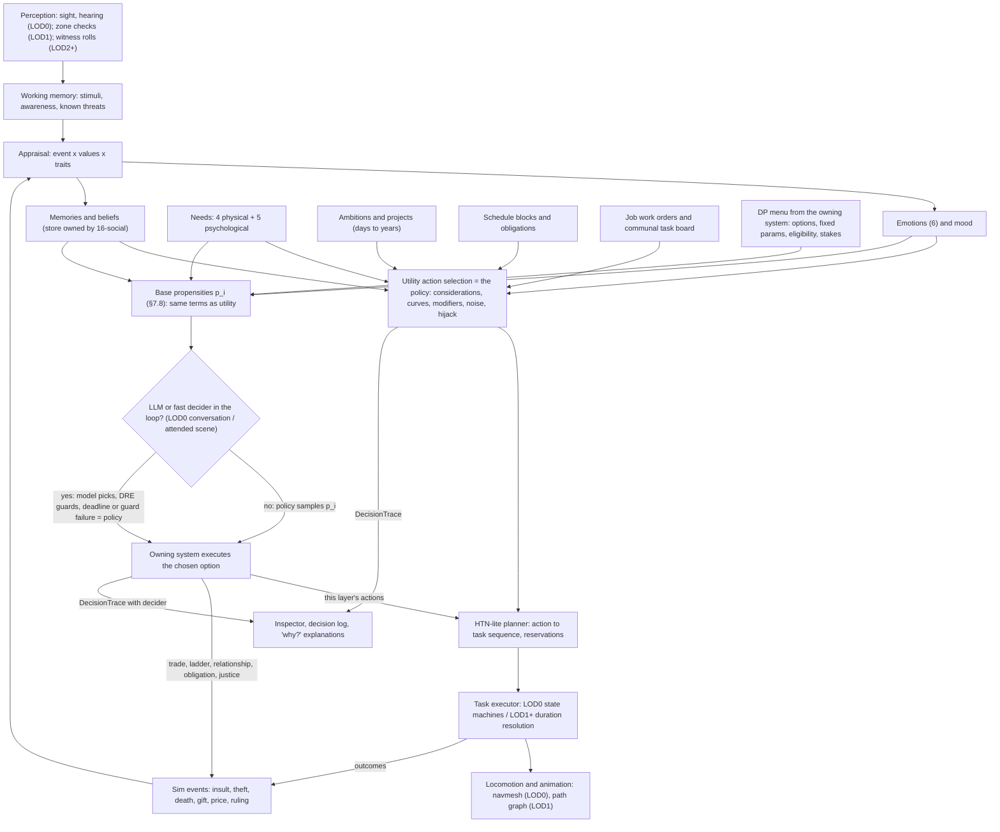
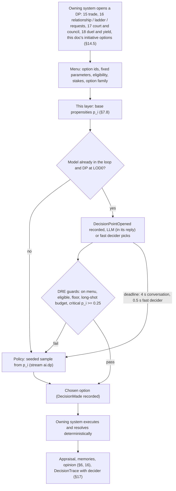
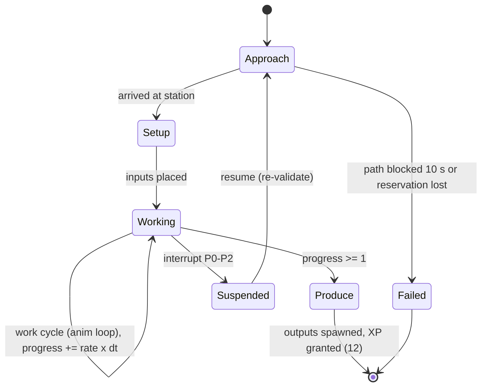
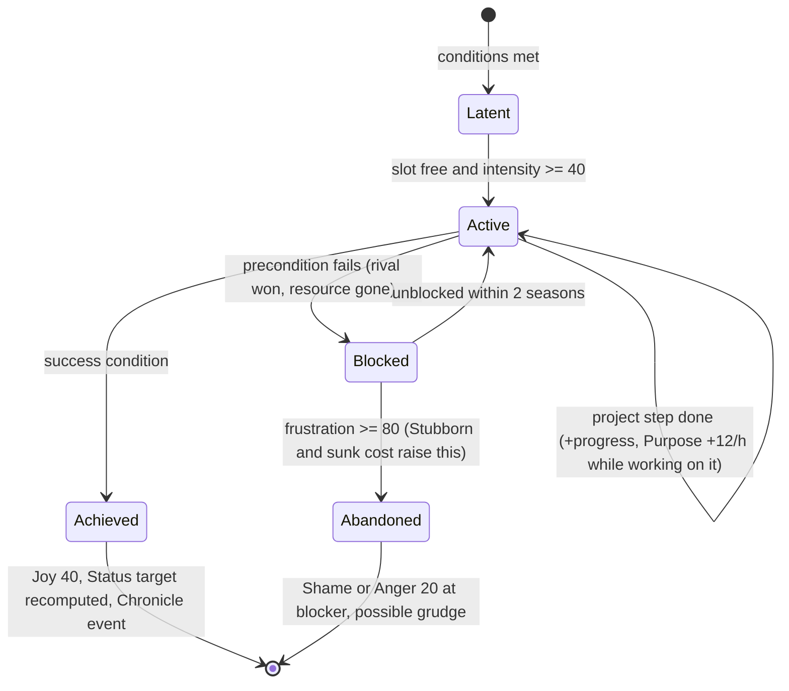
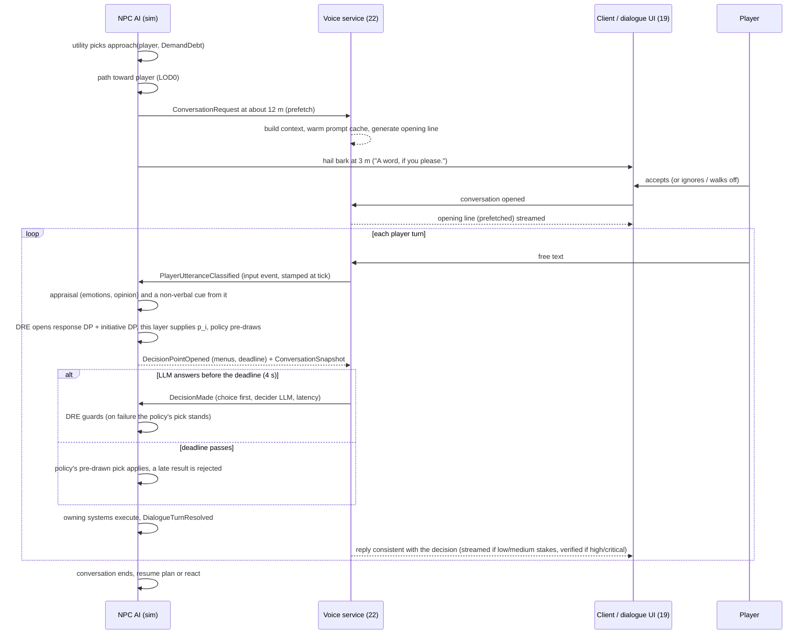
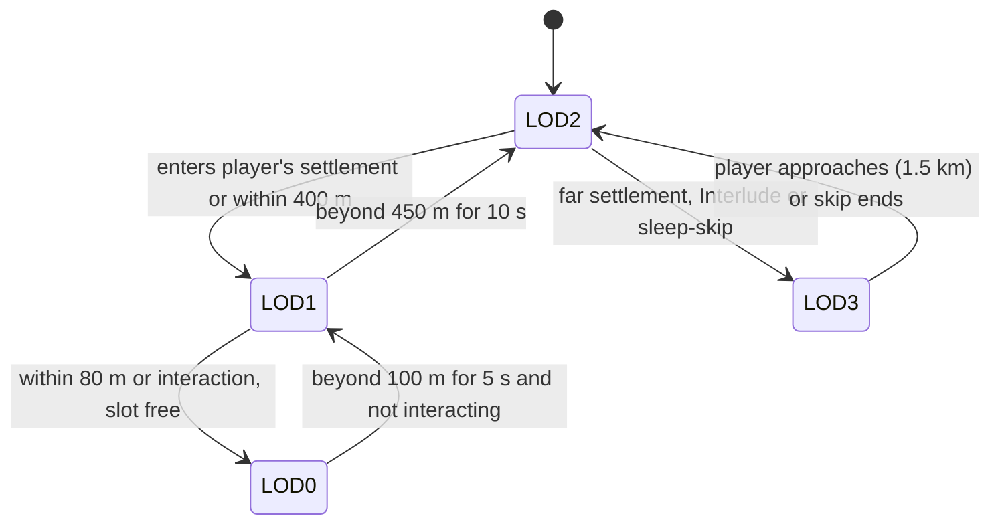

# 21 — NPC AI: Agents, Personality, Needs, Emotion & Simulation LOD

> **Status:** Draft v0.1, revised for canon v0.3 (decision points) · **Owner doc for:** NPC agent architecture; personality model & trait catalog; needs-driven utility AI; psychological needs; emotions & mood; irrationality; schedules & routines; job *execution* (tasks, reservations, task boards, idle); long-term ambitions; group behavior; perception models; NPC-initiated interactions; simulation-LOD behavior incl. Interlude (LOD3) aggregate rules; NPC debugging & headless AI metrics · **Depends on:** [01-canon](../01-canon.md) (binding), [00-vision-original](../00-vision-original.md), [20-architecture](20-architecture.md) (ticks, ECS, determinism, decision-point records), [22-llm-integration](22-llm-integration.md) (DRE guards, deciders, voice), [11-survival](../design/11-survival.md) (physical-need decay), [12-skills-and-professions](../design/12-skills-and-professions.md) (job choice), [13-crafting-and-minigames](../design/13-crafting-and-minigames.md) (work resolution rates), [16-social-systems](../design/16-social-systems.md) (relationships, memory/belief/rumor, crime detection), [17-governance-and-law](../design/17-governance-and-law.md), [18-conflict-and-warfare](../design/18-conflict-and-warfare.md) (combat AI)

---

## Table of contents

1. [Purpose, scope and design goals](#1-purpose-scope-and-design-goals)
2. [Agent architecture](#2-agent-architecture)
3. [Agent data model](#3-agent-data-model)
4. [Personality model](#4-personality-model)
5. [Needs](#5-needs)
6. [Emotions and mood](#6-emotions-and-mood)
7. [Action selection (utility AI)](#7-action-selection-utility-ai)
8. [Irrationality](#8-irrationality)
9. [Schedules and routines](#9-schedules-and-routines)
10. [Job execution: tasks, reservations, task boards, idle](#10-job-execution-tasks-reservations-task-boards-idle)
11. [Long-term goals and ambitions](#11-long-term-goals-and-ambitions)
12. [Group behavior](#12-group-behavior)
13. [Perception](#13-perception)
14. [NPC-initiated interactions and the conversation interface](#14-npc-initiated-interactions-and-the-conversation-interface)
15. [Simulation LOD behavior](#15-simulation-lod-behavior)
16. [Parity: the player as an agent (standing orders)](#16-parity-the-player-as-an-agent-standing-orders)
17. [Debuggability](#17-debuggability)
18. [Performance budgets and data-layout requirements](#18-performance-budgets-and-data-layout-requirements)
19. [Headless validation metrics](#19-headless-validation-metrics)
20. [Milestone plan](#20-milestone-plan)
21. [Tuning knobs](#21-tuning-knobs)
22. [Failure modes and mitigations](#22-failure-modes-and-mitigations)
23. [Open questions](#open-questions)
24. [Proposed canon additions](#proposed-canon-additions)

---

## 1. Purpose, scope and design goals

The vision's core bet is "robust systems managing things behind the scenes" with "most of the
realtime actions based on hard code", while "everyone should feel like a full person" and "people
not always acting rationally" is essential. This document specifies the hard-coded half: the
decision-making of every simulated person, from a starving Landfall settler choosing between
foraging and begging, to a jealous smith deciding to slander a rival, to a militiaman deciding
whether to answer the muster bell or run home to his children.

**The NPC AI makes no LLM or Jev call itself, and it is the *policy*: the deterministic decider for
every choice in the game.** It is deterministic C# driven by seeded RNG streams. Under canon §13
("language decides, systems resolve") a language model may *also* choose, but only at a **decision
point (DP)** in a moment where a model is already in the loop: conversations with the player; court
sessions, councils, negotiations and war councils the player attends; and sub-second fast-decider
choices (a bystander reacting to the player's quarrel, yield or mercy mid-fight). At a DP the owning
system builds the menu, this layer supplies each option's **base propensity `p_i`** (§7.8), the LLM or
fast decider *may* pick instead of the policy, the Dialogue Rules Engine
([22](22-llm-integration.md)) guards the pick, and the chosen option goes down **the same execution
path** the policy's choice would have taken (§2.4). Everywhere else — off-screen life, NPC↔NPC
interactions, Interludes, headless runs — the policy decides alone. Language models also *voice*
outcomes and *classify* the player's words (canon §13.3).

### 1.1 Design goals

| # | Goal | Measured by (see [§19](#19-headless-validation-metrics)) |
|---|------|-------------------------------------------------------|
| G1 | **Competent enough to survive without the player.** A 24-settler camp survives Year 0 in most seeds. | Seed survival rate, starvation rate |
| G2 | **Legible.** Every action can be explained in one sentence from its decision trace. | Trace coverage 100%; "why" answers |
| G3 | **Imperfect, on purpose.** Personality, emotion, bias and noise produce suboptimal and conflicting choices at tuned, measurable rates. | Off-argmax rate, hijack rate, feud/conflict emergence |
| G4 | **Distinct people.** Two NPCs in the same role behave visibly differently. | Behavior-divergence metric |
| G5 | **Cheap.** 1,500 agents within the CPU budget; Interludes fast. | ms per tick per tier |
| G6 | **Seamless LOD.** Promotion/demotion never produces visible teleports, lost items or broken tasks. | Reconciliation error counters |
| G7 | **Parity.** Same needs, skills, laws, relationship math for player and NPCs; the player's Interlude routine runs on this AI. | Shared code paths |
| G8 | **The world you talk to is the world.** Where an LLM chooses at a DP, its choice rates stay within canon's parity band of this layer's propensities — no kinder, no harsher. | LLM-vs-policy calibration (§19) |

### 1.2 What this document does not own

Physical-need decay rates ([11-survival](../design/11-survival.md)); skill/XP/job *choice*
([12](../design/12-skills-and-professions.md)); work output and quality formulas
([13](../design/13-crafting-and-minigames.md)); prices and haggling math
([15](../design/15-economy-and-trade.md)); relationships, opinion modifiers, memory/belief/rumor
propagation, crime detection rules ([16](../design/16-social-systems.md)); laws, offices, schism
thresholds ([17](../design/17-governance-and-law.md)); combat AI and fight escalation
([18](../design/18-conflict-and-warfare.md)); ticks, ECS and save format
([20](20-architecture.md)); decision-point **menus** (owned by the system whose rules the choice
runs on), the DRE's guards and all LLM/Jev/fast-decider usage ([22](22-llm-integration.md)). This
document states the interface it needs from each, and owns the propensities and policy those menus
are sampled with.

---

## 2. Agent architecture

### 2.1 The pipeline



### 2.2 The decision stack (and why)

| Layer | Horizon | Technique | Runs at | Why this technique |
|-------|---------|-----------|---------|--------------------|
| **L4 Ambitions** | Seasons–years | Goal catalog → *project* templates (multi-step goal decomposition), intensity 0–100 | Season start + triggering events | Long arcs (become master smith, take revenge) must persist across LOD and Interludes; they generate *candidate actions*, not control. |
| **L3 Action selection** | Minutes–hours | **Utility AI** (Infinite-Axis-style): each candidate action scores Π(considerations through response curves) × weights × personality/emotion modifiers; softmax noise; emotional hijack | Event-driven + periodic (§7.6) | Handles dozens of competing drives smoothly; personality maps naturally to weights; noise and bias are first-class; scoring is inspectable ("why"). |
| **L2 Task planning** | One action (≤ a few hours) | **HTN-lite**: authored task templates with ordered methods and preconditions; depth ≤ 4, ≤ 12 primitive tasks | When an action is chosen; re-validated per step | Work is procedural ("fetch ore, carry to furnace, smelt, carry bloom to forge"); HTN expresses it data-driven without search blowup. GOAP-style search rejected: costlier and harder to author/debug for ~200 recipes. |
| **L1 Execution** | Seconds | **Small finite state machines** per primitive task (3–6 states); at LOD1+ the same primitive is resolved by duration | LOD0 10 Hz; LOD1 1 Hz | Behavior trees are unnecessary when sequencing lives in L2 and choice in L3. FSMs are cheaper, trivially serializable mid-step (critical for LOD reconciliation), and easy to inspect. |
| **L0 Motor** | Frames | Navmesh steering + animation state machine (client) | Per frame | Client-side presentation; the sim owns position at task granularity. |

Combat is a special case: when an agent enters a fight, L1–L3 hand control to the combat AI owned
by [18](../design/18-conflict-and-warfare.md); this layer still owns the *decision to flee, yield
or join* (via utility with emotion inputs) and resumes control on exit. When the player is the
opponent at LOD0, yield/mercy is a DP the fast decider may take within 500 ms (canon §13.2); the
policy samples it otherwise, and no model ever generates text or moves inside the fight.

**Who decides what.** Every layer above is *policy*. Language models plug in only at L3-level
choices in language-driven moments, and only as an alternative picker over the same menu:

| Choice | The policy (always available) | May be picked instead by |
|--------|-------------------------------|--------------------------|
| Routine actions, plans, task execution (L1–L4) | Utility AI (§7), HTN-lite, FSMs | Nobody — never a model |
| A DP in a conversation with the player, or in a court session, council, negotiation or war council the player attends (LOD0) | Seeded sample from `p_i` (§7.8) | The LLM writing that character's reply (decision-first); the fast decider for quick sub-choices |
| A bystander's reaction to the player's quarrel; yield/mercy when fighting the player | Seeded sample from `p_i` | Fast decider (≤ 0.5 s) |
| Combat moves, evasion, real-time work | 18's combat AI; this layer's executors | Never a model |
| Off-screen life, NPC↔NPC interactions (even overheard), Interludes, headless runs | `p_i` sample, or the LOD2/LOD3 rules calibrated against it (§15) | Never a model (the LLM may *render* an overheard exchange, §15.3) |
| The player's own character | The human; standing orders in Interludes (§16) | **Never a model** |

### 2.3 Reconsideration model

Utility is not evaluated every tick. An agent **reconsiders** when (a) its current action
completes or fails, (b) an *interrupt-class* stimulus arrives (§7.5), (c) its periodic timer fires
(§7.6), or (d) a schedule block boundary passes. Between reconsiderations it executes. This
keeps cost proportional to *events*, not agents × ticks.

### 2.4 Decision points: where model choices plug in



The picker is the *only* thing a model changes. Menu, numbers, eligibility, stakes, execution and
every downstream consequence are identical whether the LLM, the fast decider or the policy chose, so
template mode (canon tenet 8) is the same game with the policy picking every option. The policy's
sample is drawn whenever the DP opens (keyed by DP id, §7.8), so a fallback never costs a second
computation and never depends on when the model failed.

---

## 3. Agent data model

Components are split into **hot** (touched every tick at LOD0/1) and **cold** (touched on
reconsideration). Storage layout is decided by [20-architecture](20-architecture.md); this doc
requires the logical schema below. Sketches are C# (.NET 8), not final code.

```csharp
// ---- Cold: identity & personality (rarely changes) ----
public struct Personality {
    public byte Curiosity, Diligence, Sociability, Warmth, Volatility;   // 0–100, mean 50, SD 15
    public ValueBlock Values;                                            // nine values, 0–100
    public TraitSet Traits;                                              // 64-bit bitset over trait catalog
    public float Temperature0;                                           // cached decision-noise base (§8.2)
}
public struct ValueBlock { public byte Family, Wealth, Status, Honor, Tradition, Faith, Fairness, Freedom, Loyalty; }
// NB: ValueBlock.Status (how much you care about standing) is distinct from PsychNeeds.Status (how satisfied that care currently is).

// ---- Hot: needs, emotions, mood ----
public struct PhysicalNeeds { public float Satiety, Hydration, Energy, Warmth; }      // 0–100, 100 = satisfied; decay owned by 11-survival
public struct PsychNeeds    { public float Social, Comfort, Safety, Purpose, Status; } // 0–100; defined in §5.2 (player: absent)
public struct Emotions      { public float Anger, Fear, Grief, Joy, Shame, Jealousy;    // 0–100, decaying
                              public EntityId AngerTarget, FearSource, JealousyTarget, ShameAudience; }
public struct Mood          { public float Value; public float Smoothed; }             // −100…+100

// ---- Hot: current activity (LOD-independent canonical state; see §15.4) ----
public struct ActivityState {
    public ActionId Action;          // e.g. action.work_job
    public TaskPlanRef Plan;         // HTN expansion, step index
    public ushort StepIndex;
    public float StepProgress;       // 0..1, survives LOD changes
    public long StartedAtMin, ExpectedEndMin;   // game-minutes
    public PriorityClass Priority;   // P0..P4 (§7.5)
    public EntityId Target;          // person/object/station
    public float InvestedHours;      // sunk-cost input (§8.4)
}
public struct LocationState { public ZoneId Zone; public PathNodeId Node; public PathEdgeId Edge; public float EdgeT; public Vector3 WorldPos; }

// ---- Cold: long-term ----
public struct AmbitionSlot { public AmbitionId Kind; public EntityId Target; public byte Intensity; public ProjectRef Project; public long SinceMin; public byte Frustration; }
public struct ScheduleRef  { public ScheduleTemplateId Template; public byte ShiftOffsetHours; public HouseholdId Household; }

// ---- Interfaces this doc needs from others ----
public interface ISocialQuery {            // implemented per 16-social-systems
    int  Opinion(EntityId from, EntityId to);            // −100..100
    int  Trust(EntityId from, EntityId to);              // 0..100
    bool HasTag(EntityId from, EntityId to, RelTag tag);
    IEnumerable<MemoryRef> MemoriesAbout(EntityId self, EntityId subject, int max);
    float BeliefConfidence(EntityId self, ClaimId claim);
}
public interface IWorkResolver {           // implemented per 13-crafting-and-minigames
    WorkResult Resolve(EntityId worker, RecipeOrTaskId task, float hours, in WorkContext ctx, ref Rng rng);
}
```

*Implemented (M1-01a, 2026-10-04):* `Attributes`, `Personality` (facets, `ValueBlock`, culture and profession
handles, trait bitset), `Emotions` (with `UpdatedGameMs` for lazy decay), `Mood`, and per-person skill levels and
aptitudes as flat byte columns (`PersonTable`); `Needs` keeps all nine needs in one column. Generation:
`PersonGenerator` (stream `PersonGen`, keyed by world seed and person id) following §4.2 and §4.4 and 12's rules;
trait effects are content data (`content/traits/traits.yaml`, `TraitEffects`) for the consuming systems.

Per-agent memory: hot ≈ 160 B, cold ≈ 1.5 KB (plus decision log ring buffer, §17). Relationship and
memory stores are owned by 16 and are not counted here.

---

## 4. Personality model

### 4.1 Facets → behavior

Facets are 0–100 (mean 50, SD 15). The AI uses the standardized value
**z = clamp((facet − 50) / 15, −2.5, +2.5)**. Every facet effect is a multiplier `1 + k·z`
(clamped to `[0.25, 2.0]`) unless stated.

| Facet (Big-Five analogue) | Effect | k / formula | Example: facet 80 (z = 2.0) |
|---------------------------|--------|-------------|------------------------------|
| **Curiosity** (Openness) | Utility of *explore, learn know-how, try new recipe, travel, talk to strangers* | k = 0.30 | ×1.60 |
| | Confirmation-bias strength b (§8.4) — *lower* curiosity → stronger bias | b = 0.5 − 0.15·z (clamp 0.1–0.9) | 0.20 |
| | Tradition-violation discomfort (novel practices, other cultures) | k = −0.25 | ×0.50 |
| **Diligence** (Conscientiousness) | Utility of *work, obligation, maintenance* actions | k = 0.25 | ×1.50 |
| | Schedule adherence: schedule-fit consideration weight | k = 0.30 | ×1.60 |
| | Purpose decay rate (§5.2) | k = 0.30 | ×1.60 |
| | Decision temperature (§8.2) | −0.25·z term | lower noise |
| **Sociability** (Extraversion) | Social need decay rate | k = 0.30 | ×1.60 |
| | Utility of *chat, gather, celebrate, gossip*; group-join thresholds | k = 0.30 | ×1.60 |
| | Preferred conversation length (LOD0) | 3 + 1.5·z game-min | 6 min |
| **Warmth** (Agreeableness) | Utility of *help, gift, comfort, share food, apologize* | k = 0.30 | ×1.60 |
| | Utility of *insult, confront, assault, steal* | k = −0.30 | ×0.40 |
| | Opinion gain from positive interactions (multiplier passed to 16) | k = 0.15 | ×1.30 |
| | Susceptibility to persuasion: the listener's `s` in canon §13.4's menu width (computed with [22](22-llm-integration.md)'s DRE) | +0.06·z | +0.12 |
| **Volatility** (Neuroticism) | Emotion gain multiplier g_vol | k = 0.25 | ×1.50 |
| | Anger & Fear half-life multiplier | k = 0.15 | ×1.30 |
| | Decision temperature (§8.2) | +0.35·z term | higher noise |
| | Hijack probability multiplier (§8.3) | k = 0.30 | ×1.60 |
| | Mood weight of negative terms | k = 0.10 | ×1.20 |

### 4.2 Values → behavior

The nine values (0–100) act through two mechanisms:

1. **Action/goal alignment.** Every action, ambition and appraisal event in content YAML carries
   value tags with signed strengths (−1…+1). The *value alignment* modifier is
   `V(a) = 1 + 0.6 · Σ_v tag_v(a) · (value_v − 50) / 50`, clamped `[0.4, 1.8]`.
   Example: `action.steal` has `Wealth +0.5, Honor −0.6, Fairness −0.5, Loyalty −0.3`; for a person
   with Wealth 80, Honor 30, Fairness 40, Loyalty 50: `1 + 0.6·(0.5·0.6 + (−0.6)(−0.4) + (−0.5)(−0.2) + 0) = 1 + 0.6·0.64 = 1.38`.
2. **Appraisal gain.** When an event touches a value (insult → Honor; unfair ruling → Fairness;
   blasphemy → Faith; harm to kin → Family), emotion gain is multiplied by
   `0.5 + value/100` (0.5–1.5).

| Value | Typical action tags (+) | Typical appraisal triggers | Ambitions it seeds |
|-------|------------------------|----------------------------|--------------------|
| Family | care for kin, stay home, protect children | harm/insult to kin, kin death (Grief), kin success (Joy) | Marry, HaveChildren, ProtectFamily |
| Wealth | trade, overtime, hoard, steal | being cheated, loss of goods, neighbor's gain (Jealousy) | AccumulateWealth, OwnLand |
| Status | seek office, display, host feasts | public slights (Shame/Anger), rival's promotion | GainOffice, MasterCraft |
| Honor | keep promises, duel, truth-telling | insults, accusations, cowardice (Shame) | RestoreHonor, Revenge |
| Tradition | customary schedule, rites, homeland ways | novelty, foreign customs | — (resists change in councils) |
| Faith | worship, tithe, shrine work | blasphemy, rite missed | Pilgrimage/BuildShrine |
| Fairness | share equally, report shirkers, protest | free-riding, unjust rulings, price gouging | (joins protests/schism) |
| Freedom | work alone, avoid obligations, leave | corvée, curfew, serfdom | EscapeServitude, Exodus |
| Loyalty | follow leader, defend friends, muster | betrayal, desertion by others | serve lord, Glory |

Values are generated from homeland culture means (Varrow: Tradition 60, Loyalty 60, Faith 55;
Osmeri: Wealth 65, Freedom 55; Brannoch: Family 65, Honor 65, Loyalty 65; Ashen Reform: Faith 75,
Fairness 60, Tradition 35) plus individual noise N(0, 15), clamped 0–100. Unlisted culture means
are 50. Values shift slowly through life events (±1–5 per major event), e.g. being robbed raises
Wealth +2; a war death of kin raises Family +3.

### 4.3 Trait catalog

Traits are the sharpest personality lever: discrete, legible to the player (shown in the NPC's
description once Familiarity ≥ 30) and directly voiced in the LLM persona card
([22](22-llm-integration.md)). Every person has **2–4** (canon). The catalog has **45 traits** in
8 groups; the 16 canon examples are marked ★. Notation: `U[x] ×m` = utility multiplier on action
group x; `E[x] ×m` = emotion gain multiplier; `HL[x] ×m` = half-life multiplier; `τ` = decision
temperature; `S` = susceptibility to persuasion (additive to the listener's `s`, canon §13.4; see 22); `Op` = effects passed to
16-social as modifiers on how *others* react; ⚡ = irrationality hook (§8).

#### Temper & emotion

| Id | Trait | Mechanical effects | Incompatible |
|----|-------|--------------------|--------------|
| `trait.hot_tempered` | **Hot-tempered** ★ | E[Anger] ×1.8; hijack threshold for Anger 70→55; U[confront, insult] ×1.5; ⚡ escalates one rung faster on the fight ladder (18) | Even-tempered |
| `trait.even_tempered` | Even-tempered | E[Anger] ×0.6, HL[Anger] ×0.7; hijack threshold 70→85; S +0.05 | Hot-tempered |
| `trait.vengeful` | **Vengeful** ★ | Anger peaks ≥ 60 at a target create a **grudge** (opinion modifier that does not decay, 16) and may seed `Revenge` ambition; HL[Anger toward grudge target] ×3; ⚡ revenge actions bypass Warmth penalty | Forgiving |
| `trait.forgiving` | Forgiving | Negative opinion modifiers decay ×2 faster (passed to 16); apologies accepted at +20% | Vengeful |
| `trait.cheerful` | Cheerful | Mood baseline +10; E[Joy] ×1.4; HL[Grief] ×0.7 | Melancholic |
| `trait.melancholic` | Melancholic | Mood baseline −10; HL[Grief] ×1.5; ⚡ breaking-point "withdraw" more likely | Cheerful |
| `trait.paranoid` | **Paranoid** ★ | E[Fear] ×1.4; Trust gains ×0.5; belief acceptance for claims of *threat* ×1.5; ⚡ scapegoating weight ×2; sees plots: rumors about out-group harm accepted +25% | Gullible |

#### Morality & honesty

| Id | Trait | Mechanical effects | Incompatible |
|----|-------|--------------------|--------------|
| `trait.honest` | **Honest** ★ | Never selects `lie`/`deceive` actions unless Fear ≥ 80; U[report crime] ×1.5; in dialogue reveals true motive (22 "why?") | Deceitful |
| `trait.deceitful` | Deceitful | U[lie, slander, steal] ×1.5; cover stories for "why?" questions; ⚡ may seed false rumors that benefit self | Honest |
| `trait.greedy` | **Greedy** ★ | U[trade, overtime, hoard, steal] ×1.4; loss aversion λ 2.0→2.5; price concession −30% (passed to 15); Jealousy from neighbor's wealth ×1.5 | Charitable |
| `trait.charitable` | **Charitable** ★ | U[gift, share food, help] ×1.6; λ 2.0→1.5; joy from giving ×1.5 | Greedy |
| `trait.cruel` | Cruel | U[insult, assault, punish] ×1.5 and Warmth effect inverted for these; E[Joy] from others' misfortune +5; ⚡ harsh sentences when holding office (17) | Compassionate |
| `trait.compassionate` | Compassionate | U[comfort, heal, help injured] ×1.8; E[Grief] from others' deaths ×1.3; S +0.05 | Cruel |

#### Social

| Id | Trait | Mechanical effects | Incompatible |
|----|-------|--------------------|--------------|
| `trait.gossip` | **Gossip** ★ | U[gossip] ×2.0; rumor transmission probability ×1.8 (16); ⚡ passes on unverified claims at confidence ≥ 0.3 (default 0.5) | Discreet |
| `trait.discreet` | Discreet | Never transmits secrets unless drunk; rumor transmission ×0.4; Trust gained from others ×1.2 | Gossip |
| `trait.gregarious` | Gregarious | Social decay ×1.4; U[gather, celebrate] ×1.5; joins mobs and work parties more readily | Reclusive |
| `trait.reclusive` | Reclusive | Social decay ×0.5; prefers solitary tasks and edge-of-settlement homes; U[gather] ×0.5 | Gregarious |
| `trait.romantic` | **Romantic** ★ | U[court, flirt, gift to beloved] ×1.6; Attraction gains ×1.5 (16); E[Grief] on heartbreak ×1.5; ⚡ may pursue unwise matches (ignores Status/Wealth fit) | — |
| `trait.jealous` | **Jealous** ★ | E[Jealousy] ×2.0; HL[Jealousy] ×1.5; ⚡ spite/sabotage actions toward rivals enabled at Jealousy ≥ 50 (default 70) | — |
| `trait.loyal` | Loyal | U[defend friend, follow leader, muster] ×1.5; Opinion loss toward lord/friends ×0.6; ⚡ sticks with a failing leader (sunk-cost on allegiance) | Fickle |
| `trait.fickle` | Fickle | Opinion modifiers decay ×1.5 faster both ways; ambition re-roll chance ×2; switches factions easily | Loyal |

#### Courage & risk

| Id | Trait | Mechanical effects | Incompatible |
|----|-------|--------------------|--------------|
| `trait.brave` | **Brave** ★ | E[Fear] ×0.5; U[defend, rescue, muster] ×1.5; reduces nearby agents' Fear (§12.3); flee threshold +25 | Coward |
| `trait.coward` | **Coward** ★ | E[Fear] ×1.6; flee threshold −20; U[muster] ×0.4; ⚡ may desert under fear (18); Shame when cowardice witnessed ×1.5 | Brave, Reckless |
| `trait.reckless` | Reckless | Risk considerations flattened (danger curve ×0.5); U[gamble, fight, explore wilds] ×1.4; τ +0.03 | Cautious, Coward |
| `trait.cautious` | Cautious | Danger curve ×1.5; prefers known routes, larger groups; U[stockpile, maintain] ×1.3; τ −0.02 | Reckless |

#### Work & mind

| Id | Trait | Mechanical effects | Incompatible |
|----|-------|--------------------|--------------|
| `trait.industrious` | Industrious | U[work] ×1.4; Purpose gain ×1.3; works through Hearthday unless Pious | Lazy |
| `trait.lazy` | **Lazy** ★ | U[work] ×0.6; U[idle, rest] ×1.6; Purpose decay ×0.5; ⚡ shirks task-board work when unobserved (×2 if not watched) | Industrious, Perfectionist |
| `trait.perfectionist` | Perfectionist | Work speed ×0.85, quality roll +1 tier step (13 interface); refuses to sell below-standard goods; E[Shame] from failure ×1.5 | Lazy |
| `trait.inquisitive` | Inquisitive | U[learn, explore, ask questions] ×1.6; know-how teaching receptivity ×1.3 (12); prompts curiosity questions in dialogue | — |

#### Ambition & self

| Id | Trait | Mechanical effects | Incompatible |
|----|-------|--------------------|--------------|
| `trait.ambitious` | **Ambitious** ★ | Status aspiration +15 (§5.2); always holds ≥ 1 ambition; U[ambition project steps] ×1.5; Jealousy from rivals' promotion ×1.5 | Humble |
| `trait.humble` | Humble | Status aspiration −15; E[Shame] from public praise is 0; S +0.05 | Ambitious, Proud |
| `trait.proud` | Proud | E[Shame] ×1.5 but 50% of Shame converts to Anger at the shamer; apologizes ×0.4; S −0.08 | Humble |
| `trait.stubborn` | **Stubborn** ★ | S −0.15; confirmation bias b +0.25; sunk-cost bonus ×2; ⚡ never reverses a public stance within the same season | Gullible |
| `trait.gullible` | Gullible (*Trusting*) | S +0.15; belief acceptance ×1.4 regardless of source trust; Trust gains ×1.5 | Stubborn, Paranoid |

#### Faith & group

| Id | Trait | Mechanical effects | Incompatible |
|----|-------|--------------------|--------------|
| `trait.pious` | **Pious** ★ | U[worship, tithe, rites] ×1.8; Faith value floor 70; never works on Hearthday; E[Anger] from blasphemy ×2 | Skeptic |
| `trait.skeptic` | Skeptic | Faith value cap 30; immune to superstitious scapegoating; U[worship] ×0.3; Opinion penalties from Pious neighbors (16) | Pious, Superstitious |
| `trait.superstitious` | Superstitious | Omens (eclipses, two-headed lamb, crop blight) raise Fear +15; ⚡ attributes unexplained misfortune to a person (scapegoating ×2) | Skeptic |
| `trait.clannish` | Clannish | ⚡ in-group bias ×2 (§8.4); Opinion of out-culture/out-faith −10 baseline; joins mobs against out-groups | Tolerant |
| `trait.tolerant` | Tolerant | In-group bias ×0.3; no Tradition discomfort from foreign customs; mediates disputes U ×1.3 | Clannish |

#### Appetite & vice

| Id | Trait | Mechanical effects | Incompatible |
|----|-------|--------------------|--------------|
| `trait.drunkard` | **Drunkard** ★ | Hidden **Craving** need (§8.5); U[drink] ×3; drunk state lowers Anger hijack threshold −15, work quality −1 tier step, Discretion off (blurts secrets); ⚡ spends household stores on drink | Ascetic |
| `trait.gambler` | Gambler | Hidden Craving (gambling); U[dice/wager] ×3; gambler's-fallacy stake escalation (§8.5); accrues debts → conflicts | Frugal |
| `trait.glutton` | Glutton | Satiety threshold for eating 50→70; consumes ×1.3 food; ⚡ eats from communal stores out of turn in shortages (theft-of-commons, 16) | Ascetic |
| `trait.ascetic` | Ascetic | Comfort target weight ×0.5; Satiety/Comfort mood weights ×0.6; Faith +10 | Drunkard, Glutton |
| `trait.frugal` | Frugal | Buys only below base value; hoards durable goods; U[repair] ×1.5; λ +0.3 | Spendthrift, Gambler |
| `trait.spendthrift` | Spendthrift | U[buy luxury, host, gift] ×1.6; ignores savings goals; mood thought from purchases +5 | Frugal |

### 4.4 Trait generation

```
count = roll([2: 35%, 3: 45%, 4: 20%])          // canon: 2–4
for i in 1..count:
    for each trait t not incompatible with chosen and not chosen:
        w_t = base_prevalence_t                  // content YAML, mean 1.0
            × facetAffinity_t(z)                 // e.g. hot_tempered: exp(0.6·z_Volatility − 0.3·z_Warmth)
            × cultureMultiplier_t(homeland)      // e.g. Brannoch: brave ×1.6, clannish ×1.5; Osmeri: greedy ×1.4, frugal ×1.3;
                                                 //      Ashen Reform: pious ×2.0, stubborn ×1.4; Varrow: loyal ×1.3, pious ×1.2
            × inheritanceMultiplier_t(parents)   // §4.5
    pick t ∝ w_t using rng(stream: "persongen", personId)
```

Facet affinities (selected): Hot-tempered `+0.6 z_Vol −0.3 z_Warm`; Lazy `−0.7 z_Dil`; Industrious
`+0.7 z_Dil`; Gregarious `+0.8 z_Soc`; Reclusive `−0.8 z_Soc`; Compassionate `+0.7 z_Warm`; Cruel
`−0.8 z_Warm`; Paranoid `+0.6 z_Vol −0.3 z_Warm`; Inquisitive `+0.8 z_Cur`; Stubborn `−0.4 z_Cur`;
Melancholic `+0.5 z_Vol`; Cheerful `−0.5 z_Vol +0.3 z_Soc`. Unlisted: 0.

**Acquired traits.** Life events can add or remove traits (max 4; adding a 5th removes the weakest-
fitting): Drunkard (Grief ≥ 60 for ≥ 4 days with ale access: 3%/day), Coward→removed / Brave added
(survives ≥ 3 battles with Fear peaks ≥ 70: 25%), Vengeful (kin murdered: 30%), Melancholic (spouse
death: 15%), Paranoid (victim of ≥ 2 crimes in a year: 20%), Pious (survives near-death while
praying: 10%). Each change is an event for the Chronicle.

### 4.5 Inheritance (children)

- **Facets:** `child = 50 + h·((pA + pB)/2 − 50) + N(0, 15·√(1 − h²/2))`, heritability
  **h = 0.45**, clamped 0–100.
- **Values:** `0.5·culture_mean(household) + 0.3·parents_mean + 0.2·N(50, 15)`; upbringing
  shift at age 14 (Youth) from household events (e.g., grew up in famine → Wealth +5).
- **Traits:** each parental trait gives inheritance multiplier ×3 for that trait during
  generation (§4.4) — roughly 25–30% of parental traits reappear. Traits are rolled at birth but
  **revealed** at age 6 (2 traits) and 14 (the rest), so children's personalities "emerge".
- **Aptitudes** are owned by [12](../design/12-skills-and-professions.md).

---

## 5. Needs

### 5.1 Physical needs (interface to 11-survival)

Satiety, Hydration, Energy and Warmth (0–100, 100 = satisfied) and their decay/satisfaction
numbers are owned by [11-survival](../design/11-survival.md). The AI requires from 11, per agent:
current value, **current decay rate per game hour** in context (exertion, weather, clothing), and
the list of satisfier actions with their gains. The AI turns each need into an **urgency**
`u = logistic(x; k, x0)` on deprivation `x = (100 − need)/100`, which raises the *dynamic base
weight* of the satisfier action (§7.2).

| Need | Urgency curve (k, x0) | Escalates to P1 (critical) when | Satisfier actions | Projection rule |
|------|----------------------|----------------------------------|-------------------|-----------------|
| Satiety | 12, 0.60 | < 20 | eat meal, eat snack, forage-and-eat, beg, buy food, steal food (⚡) | If the next chosen action's expected duration would cross 25, eat first |
| Hydration | 14, 0.55 | < 20 | drink at source, drink carried water | Carry water on trips > 3 game h |
| Energy | 10, 0.65 | < 12 (collapse rules in 11) | sleep (bed > shelter > ground), nap, rest | Sleep block multiplies sleep weight (§9) |
| Warmth | 12, 0.55 | < 25 (exposure in 11) | go to fire/indoors, dress warmer, build fire | Winter: carry fuel or plan route via shelters |

### 5.2 Psychological needs (defined here)

NPCs only (canon §10.5: the player has none). Two kinds: **decay needs** fall over time and are
refilled by activities; **tracking needs** move toward a *target* computed from circumstances.
Rates are per **game hour** (75 real seconds at 1×). Sleeping agents do not decay Social or Purpose.

| Need | Kind | Base dynamics (per game hour) | Main satisfiers / target terms | Personality modifiers | Drives |
|------|------|-------------------------------|-------------------------------|-----------------------|--------|
| **Social** | Decay | −3.0 while awake and not interacting | Conversation +40/h (a 15-min chat ≈ +10); shared meal +20/h; gathering/feast +30/h; work party +8/h; household time +10/h | Decay × (1 + 0.3·z_Soc); Gregarious ×1.4; Reclusive ×0.5 | chat, visit, gossip, gather, court |
| **Comfort** | Tracking | `C ← C + 0.15·(C* − C)` | `C*` = shelter quality 0–35 + bed 0–20 + clothing adequacy 0–15 + food quality/variety 0–15 + possessions/cleanliness 0–15 (quality inputs from 11 and 14) | Ascetic: target weight ×0.5 | build/improve home, buy goods, complain, envy |
| **Safety** | Tracking, asymmetric | Toward `S*` at 20%/h when falling, 5%/h when rising; **shocks**: witnessed violence −30, own injury −20, raid alarm −25 (immediate) | `S*` = 100 − recent violence nearby (≤ 40, half-life 4 days) − untreated injuries (≤ 20) − food insecurity (≤ 25 when settlement food < 5 days) − no shelter/walls (≤ 15) − known enemies/threats (≤ 20) − alone in wilds at night (10) | Paranoid: threat terms ×1.4; Brave ×0.6 | flee, stay home, demand watch/walls, hoard, emigrate |
| **Purpose** | Decay | −2.0 while awake and not purposeful | Job task matching own skill tier +10/h; any work/task-board task +6/h; ambition project step +12/h; caregiving/teaching +8/h; worship +6/h (Pious only) | Decay × (1 + 0.3·z_Dil); Lazy ×0.5; Industrious: gains ×1.3 | seek work, ask for job, take apprentice, ambitions |
| **Status** | Tracking, slow | Toward `St* = 50 + 50·tanh((standing − aspiration)/25)` at 3%/h | `standing` (0–100) = 0.30·renown + 0.25·office rank + 0.25·wealth percentile + 0.20·mean reputation (rescaled); `aspiration = 20 + 0.6·Values.Status` (+15 Ambitious, −15 Humble) | — | ambitions, display, seek office, Jealousy |

Children (0–13): Purpose replaced by **Play** (same numbers; satisfied by play/learning); no Status.
Elders (55+): Purpose gains from teaching ×1.5. Examples:

- *Social:* Sociability 70 (z = 1.33) → decay 3 × 1.40 = 4.2/h; ten waking hours alone takes Social
  from 70 to 28, making `chat` a strong candidate.
- *Comfort at Landfall:* lean-to (8) + ground (0) + homeland clothes (10) + monotonous rations (5) +
  few possessions (2) → `C* = 25`. Comfort sinks toward 25 over a day (≈ −8/h initially), producing a
  persistent mood penalty that only shelter-building relieves — which is the point.
- *Status:* Values.Status 75, Ambitious → aspiration 80. A Journeyman with no office, standing 35 →
  `St* = 50 + 50·tanh(−1.8) = 3`. Strongly unsatisfied → ambition generation (§11) and Jealousy
  toward higher-status peers.

### 5.3 Need priorities at a glance

Need deprivation feeds three places: (1) the dynamic weight of satisfier actions (§7.2), (2) mood
(§6.4), (3) appraisal of others (e.g., hungry agents appraise a hoarder's refusal with Anger ×1.5).

---

## 6. Emotions and mood

### 6.1 Appraisal → emotion gain

Each sim event that an agent perceives (directly, or via belief once it hears of it) runs through
**appraisal rules** (content YAML) that emit emotion deltas:

```
ΔE = base(event) × severity(event) × g_vol × g_trait(E) × g_value × g_rel
E  ← min(100, E + ΔE × (1 − E/150))          // soft saturation near the top
g_vol   = 1 + 0.25·z_Volatility               // 0.375 … 1.625
g_value = 0.5 + value_v/100                   // for the value the event touches
g_rel   = 1 + 0.3·(−Opinion(self→source))/100 for Anger/Jealousy;  1 + 0.5·Familiarity/100 for Grief/Joy
```

| Emotion | Triggers (base magnitude at severity 1.0) | Target recorded | Value touched |
|---------|-------------------------------------------|-----------------|---------------|
| **Anger** | Insulted 25 (public ×1.4); assaulted 40; stolen from 25 (culprit believed); cheated in trade 15; kin harmed 30; unfair ruling 20; promise broken to self 15; free-rider observed 8; blasphemy 15 (Pious ×2) | source | Honor / Fairness / Family / Faith |
| **Fear** | Threat seen 20–60 (scaled by threat strength ÷ own combat strength, from 18); injured 30; fire 40; raid alarm 30; alone in wilds at night 10; omen 15 (Superstitious only); death threat 35 | source | — |
| **Grief** | Death of spouse/child 80; parent/sibling 60; friend 35 × Opinion/100; home destroyed 40; livestock lost 10; exile of kin 30 | the lost | Family |
| **Joy** | Own wedding 50; birth of own child 50; feast 20; masterwork made 25; gift received 5–20 (by value); praised 5–15; won contest/fight 15; harvest home 15 | source | varies |
| **Shame** | Caught committing crime 50; publicly rebuked 25; failed a duty 20; cowardice witnessed 40; lost a fight publicly 20; own lie exposed 35 | audience | Honor |
| **Jealousy** | Rival courts own partner/beloved 30; spouse flirts 35; rival gains office 20 × (Values.Status/50); neighbor's wealth gain 10 × (Values.Wealth/50); apprentice preferred over self 15 | rival | Status / Wealth / Family |

### 6.2 Decay

`E(t + Δ) = E(t) · 2^(−Δ / HL)`, evaluated lazily on read (store value + timestamp).

| Emotion | Base half-life (game time) | Real time at 1× | Modifiers | Lasting residue (not decaying with E) |
|---------|---------------------------|-----------------|-----------|----------------------------------------|
| Anger | 4 h | 5 min | × (1 + 0.15·z_Vol); Even-tempered ×0.7; grudge target ×3 (Vengeful) | Opinion modifiers & grudges (16) |
| Fear | 1 h | 75 s | × (1 + 0.15·z_Vol) | Safety need, memories |
| Grief | 3 days | 90 min | Melancholic ×1.5; Cheerful ×0.7; spouse/child ×1.5 | Memory with high salience |
| Joy | 6 h | 7.5 min | — | Positive opinion modifiers |
| Shame | 1 day | 30 min | Proud ×0.7 (converted to Anger instead) | Reputation (16) |
| Jealousy | 1 day | 30 min | Jealous ×1.5 | Rivalry tag at sustained ≥ 50 for 3 days |

Rationale: emotions are short and spiky (a scene's worth to an evening); *consequences that last*
live in relationships, memories and reputation (owned by 16), so a grudge outlives the anger.

### 6.3 Emotion → behavior biases

Below hijack thresholds, emotions act as multipliers `E(a)` in the utility formula (§7.2):

| Emotion | Boosted actions (× 1 + k·E/100) | Suppressed actions (× 1 − k·E/100) |
|---------|----------------------------------|-------------------------------------|
| Anger (toward T) | confront/insult/assault/accuse T, k = 1.5; refuse requests from T, k = 1.0 | help/gift/trade with T, k = 0.7; patience in haggling (passed to 15) |
| Fear | flee, hide, stay with group, go home, k = 2.0 | explore, work far from settlement, confront, k = 0.8 |
| Grief | withdraw, mourn at grave, seek kin, drink (Drunkard), k = 1.5 | work, k = 0.5; celebrate, k = 0.9 |
| Joy | celebrate, gift, chat, k = 1.0 | confront, k = 0.5 |
| Shame | avoid audience, work alone, apologize (if not Proud), k = 1.2 | gather, approach audience, k = 0.8 |
| Jealousy (toward R) | spite/slander/sabotage R (if enabled), court R's partner, k = 1.5; display own status, k = 0.8 | help R, k = 0.8 |

### 6.4 Mood composition

```
mood_raw = baseline_traits
         + Σ_needs  w_n · d(need_n)
         + Σ_emotions c_e · E_e
         + clamp(Σ thoughts, −40, +40)
mood     = clamp(mood_raw, −100, +100);   Smoothed ← EMA(mood, τ = 1 game hour)

d(n) = +0.2 if n ≥ 80;   0 if 50 ≤ n < 80;   −((50 − n)/50)^1.5 if n < 50     (loss-weighted)
w: Satiety 25, Hydration 25, Energy 15, Warmth 20, Social 12, Comfort 12, Safety 20, Purpose 12, Status 10
c: Anger −0.25, Fear −0.35, Grief −0.50, Joy +0.40, Shame −0.30, Jealousy −0.25
baseline: Cheerful +10, Melancholic −10; negative terms × (1 + 0.1·z_Vol)
```

**Thoughts** are timed mood modifiers emitted by any system (owner documents author them):
e.g. "ate a fine meal +5 for 6 h", "slept on the ground −4 until next sleep", "attended a feast +8
for 1 day", "my house is the finest in the village +6 while true", "saw a hanging −6 for 2 days".
Same-id thoughts don't stack (refresh duration); per-source cap ±15.

*Worked example (Landfall, day 6):* Satiety 45 (d = −0.03 → −0.8), Hydration 70 (0), Energy 40
(−0.09 → −1.3), Warmth 55 (0), Social 60 (0), Comfort 28 (−0.29 → −3.5), Safety 50 (0), Purpose 75
(0), Status 40 (−0.09 → −0.9); Grief 30 (lord drowned, friend) → −15; Joy 10 → +4; thoughts: "slept on
the ground" −4, "we found fresh water" +5. Mood ≈ −16. *Low but functional* — exactly the intended
Landfall feel.

| Mood band | Range | Effects |
|-----------|-------|---------|
| Elated | +60 … +100 | Work rate ×1.08 (passed to 13); opinion gains ×1.2; τ ×0.9 |
| Content | +20 … +59 | Work rate ×1.04 |
| Neutral | −19 … +19 | — |
| Low | −59 … −20 | Work rate ×0.95; Social need decay ×1.2; τ ×(1 + 0.5·|mood|/100) |
| Breaking | −100 … −60 | Work rate ×0.85; **breaking-point** risk (§6.5) |

*Implemented (M1-01b, 2026-10-04):* `PsychologySystem` applies §5.2, §6.2 and §6.4 each step with exact per-hour
rates (decay factors `2^(−Δ/HL)`, tracking `1 − (1 − r)^Δ`), so results do not depend on step size. Inputs owned
elsewhere are placeholders until their systems land: activity state (sleeping/interacting/purposeful — M1-02),
the Comfort target (11/14; Landfall 25), Safety threats (16/18), Status standing (16/17; profession prestige for
now), and thoughts. Breaking points (§6.5) arrive with the utility AI.

### 6.5 Breaking points

While Smoothed mood < −60, roll each game hour (stream `ai.break`):
`P = 0.08 × ((−mood − 60)/40)² × K_break` (≈ 2%/h at −80, 8%/h at −100). The outlet is chosen by
traits and state (first match wins, else "sulk"):

| Condition | Breaking-point behavior (duration) |
|-----------|-------------------------------------|
| Drunkard or Grief ≥ 50 and ale accessible | **Binge**: drink until Drunkenness ≥ 80, skip work (≈ 6 h) |
| Hot-tempered or Anger ≥ 50 | **Tantrum**: insult or shove the nearest disliked person; smash a household item (2 h) |
| Melancholic or Grief ≥ 50 | **Withdraw**: hide at home/grave, refuse conversation (≈ 1 day) |
| Safety < 30 and Values.Freedom ≥ 60 | **Flight**: leave for the wilds or another settlement (may become permanent → 17 exodus hooks) |
| Paranoid or Clannish | **Scapegoat**: publicly accuse someone (§8.7) |
| Greedy | **Hoard**: take food/coin from shared stores to own home (theft per 16) |
| otherwise | **Sulk**: idle near home, work at 50% (4 h) |

Breaking points are logged as events (Chronicle, rumors) and are the main source of "people doing
dumb things" under sustained hardship — winter and famine therefore generate drama on their own.

---

## 7. Action selection (utility AI)

### 7.1 Action catalog

~70 actions at M8 (≈ 30 at M1), authored in YAML. Each action declares: priority class, value tags,
considerations, target query, trait/facet multipliers, the HTN task template it expands to, and
whether it is available to the player-agent under standing orders (§16).

| Group | Priority class | Base weight | Examples |
|-------|----------------|-------------|----------|
| Emergency | **P0** | 5.0 | flee threat, escape fire, rescue kin, fight back (→18), take cover |
| Critical need / summons | **P1** | 4.0 | eat/drink/sleep/warm when critical; answer summons; seek healer when wounded |
| Obligation | **P2** | 2.5 | militia muster/drill, corvée, guard shift, court attendance, pay tax, kept promise due today |
| Routine (job, needs, social, ambition) | **P3** | dynamic / 1.0 | work job task, task-board task, eat meal, sleep, chat, gossip, court, worship, trade, visit kin, ambition step, steal (⚡), confront |
| Leisure / idle | **P4** | 0.3 | wander, sit by fire, whittle, play, nap, watch |

### 7.2 Scoring formula

```
score(a, t) = W(a) × C(a, t) × clamp(P(a) × V(a), 0.4, 2.0) × E(a, t) × S(a) × M(a)

W(a)  = base weight; for need-satisfier actions W = 1 + 4·u(need) (u from §5.1); for social W = 0.6 + 2·u_social
C     = Π compensated considerations c_i ∈ [0,1]:  c_i' = c_i + (1 − c_i)·(1 − 1/n)·c_i   (n = #considerations)
P(a)  = Π facet multipliers (§4.1) × Π trait multipliers (§4.3)
V(a)  = value alignment (§4.2)
E     = emotion bias (§6.3), product over active emotions
S(a)  = schedule fit: 1 + 0.35·(1 + 0.3·z_Dil)·fit, fit ∈ {+1 matches block, 0 neutral, −0.5 off-block, −1 forbidden-by-custom}; clamp [0.5, 1.5]
M(a)  = momentum: 1.15 if a is the current action, plus sunk-cost bonus (§8.4)
```

**Selection (dual utility + Gumbel noise):**

```
function Decide(agent):
    cands = GenerateCandidates(agent)                    // actions × targets, ≤ 40 scored pairs
    for c in cands: c.score = Score(agent, c)
    hijack = EmotionalHijack(agent, cands)               // §8.3
    if hijack != null: return Commit(hijack, trace: "hijack")
    rank = highest class in {P0..P4} having any c.score ≥ 0.15
    pool = cands in rank with score ≥ 0.75 × best(rank)  // top band
    τ = Temperature(agent)                               // §8.2
    bucket = gameMinute / 60                             // noise stable for a game hour → no dithering
    for c in pool: c.key = (c.score / best) / τ + Gumbel(rng("ai.decide", agent.id, c.actionId, c.target, bucket))
    choice = argmax(pool, key)
    if agent.current != null and choice != agent.current
       and choice.rank == agent.current.rank and choice.score < 1.0 × current.scoreWithMomentum:
        return Keep(agent.current)
    return Commit(choice, trace: top-5 with factor breakdown)
```

Gumbel-max over `score/τ` is exactly softmax sampling, but because the noise draw is fixed per
(agent, action, target, game hour) the agent does not flip-flop between reconsiderations.

`Decide` is the **policy for actions** and no model ever replaces it. Choices *inside* a
language-driven moment (how to answer an insult, whether to take a price, whether to propose
something) are not candidates here; they are DP menus, sampled by the policy from the propensities
of §7.8 unless an in-loop model picks first (§2.4). The two share every term — facets, traits,
values, emotions, needs, schedule — so an NPC behaves the same way whether it is choosing what to
do next or what to say yes to.

### 7.3 Response curves

Authored per consideration in YAML; evaluated by a shared curve library (pure functions, no
allocation).

| Curve | Params | Typical use |
|-------|--------|-------------|
| Linear | m, b | distance falloff, opinion → willingness |
| Polynomial | exponent p, invert | fatigue → rest; quality preference |
| Logistic | k, x0 | needs urgency, thresholds with soft edges |
| Logit | base | rarely; sharp both-ends |
| Step | threshold, low, high | availability, legality, "has item" |
| Piecewise | points [(x, y)…] | designer-drawn curves (e.g. time-of-day) |

```yaml
id: action.eat_meal
class: P3
weight: { dynamic: need_urgency, need: satiety }      # W = 1 + 4·u(satiety)
values: { }
considerations:
  - { input: food.accessible_portions, curve: { type: step, threshold: 1, low: 0, high: 1 } }
  - { input: target.distance_m, curve: { type: linear, m: -0.004, b: 1.0, clampMin: 0.3 } }
  - { input: target.food_quality, curve: { type: linear, m: 0.3, b: 0.7 } }
schedule_tags: [meal]
template: task.eat_from_store
player_agent: true
```

### 7.4 Candidate and target generation

Scoring every action against every person is quadratic; candidates are generated by bounded
queries: job work orders (≤ 5 nearest by path cost), task board entries (≤ 5 best skill-fit),
people (≤ 8: household, friends, current anger/jealousy targets, those within 30 m, the player
if relevant), satisfier sources (nearest 2 per need), ambition project next step (≤ 2), obligations
due (all). Hard cap **40 scored (action, target) pairs per decision**.

### 7.5 Priority classes and interrupts

| Class | Interrupts current action when | Resume? |
|-------|-------------------------------|---------|
| P0 Emergency | Immediately on stimulus (threat detected, fire, kin attacked) | Yes, if still valid after emergency ends |
| P1 Critical | At next task-step boundary (≤ 10 game-min) or immediately if need < 8 | Yes |
| P2 Obligation | At next step boundary; summons by authority within 30 game-min | Yes |
| P3 Routine | Only via normal reconsideration with momentum hysteresis | Interrupted plan pushed to resume stack |
| P4 Idle | Always interruptible | No |

Interrupted plans go on a **resume stack** (depth 3, expiry 2 game hours). Reservations held by an
interrupted plan are kept for 30 game-min, then released (§10.4). On resume the plan is re-validated
from its current step.

### 7.6 Reconsideration cadence

| LOD | Periodic reconsideration | Event-triggered |
|-----|--------------------------|-----------------|
| LOD0 | every 1.0 s real (staggered across agents), plus each task-step completion | interrupt-class stimuli, conversation end, schedule boundary |
| LOD1 | on task-step completion or every 10 s real (≈ 8 game-min) | same events (delivered at next 1 Hz tick) |
| LOD2 | once per game hour (schedule step) | P0/P1 events only |
| LOD3 | none (aggregate rules, §15.6) | — |

### 7.7 Worked example

*Bram Tull, smith. Diligence 66 (z 1.07), Volatility 72 (z 1.47), Sociability 45 (z −0.33),
Warmth 40 (z −0.67). Traits: Hot-tempered, Proud, Industrious. Y1 Spring 3, 14:00, work block.
Satiety 42, Social 38, Energy 60. Currently forging nails.*

| Candidate | W | C | P×V | E | S | M | Score |
|-----------|---|---|-----|---|---|---|-------|
| work_job (nails order) | 1.0 | 0.97 | 1.27 × 1.40 × 1.07 = 1.90 | 1 | 1.46 | 1.15 | **3.10** |
| eat_meal | 1 + 4·0.44 = 2.76 | 0.97 | 1.0 | 1 | 1.0 | 1 | **2.68** |
| chat (Edda, friend, 15 m, busy) | 0.6 + 2·0.55 = 1.70 | 0.76 | 0.90 | 1 | 0.77 | 1 | **0.90** |
| idle by fire | 0.3 | 1.0 | 1.0 | 1 | 0.77 | 1 | 0.23 (P4) |

Rank P3; band ≥ 0.75 × 3.10 = 2.33 → {work, eat}. τ = 0.08 × (1 + 0.35·1.47 − 0.25·1.07) = 0.100.
Mid-step, `eat` (2.68) does not beat work's momentum-inclusive 3.10, so he keeps forging (momentum persists across steps of the same action).
When the nail order completes (a fresh decision; work's score without momentum = 2.70) the band is {work, eat}:
normalized 1.00 vs 0.99 → roughly a coin flip, which is why hungry craftsmen drift to the cookfire
mid-afternoon. If Satiety falls to 30 (W_eat = 4.08 → 3.96) eating wins outright; at the 12:00–13:00 meal block S_eat = 1.46 and he would have eaten
then. If the player insults him now, Anger jumps (§6.1) and `confront(player)` enters with E ×2.1 —
or a hijack fires (§8.3).

*Implemented (M1-02a, 2026-10-04):* `ActivitySystem` with the M1 camp catalog (`content/actions/camp.yaml`). Two
tuning lessons are now rules: **routine work is base-weight** (W = 1, as in §7.7) — making it Purpose-driven
creates a feedback loop that erases personality; and **satisfiers carry a `start_below` step** outside their own
schedule block (otherwise W = 1 + 4u lets a mildly tired agent out-score work and sleep at noon). A P3 `rest`
(base 0.25, trait keys rest/idle) lets Lazy express itself inside the routine class.

### 7.8 Decision-point propensities (the policy at DPs)

When an owning system opens a DP (canon §13.1), this layer turns its menu into base propensities
`p_i`. The same numbers serve three purposes: the **policy** samples them; the DRE's **guards** read
them (floors, long-shot budget, critical `p_i ≥ 0.25`); and **calibration** compares LLM choice rates
with them (§19). Existing outcome formulas in other docs become the *base* of a propensity rather
than a decision.

**Menu inputs** (from the owning system's menu builder): eligible options only — ineligible ones are
dropped, never down-weighted; each option's id, fixed parameters, stakes and **option family**
(`accept`, `counter`, `refuse`, `escalate`, `de-escalate`, `warm`, `cool`, `initiate`…); a **family
base mass** `B_f ≥ 0` from the system's own formula (15's acceptance at the menu price, 16's
`Willingness` or escalation-rung distribution, 17's vote support, 18's yield chance; `B_f = 1` if the
system supplies none); and `includes`, the character terms `B_f` already models, so they are not
applied twice.

```
m_o  = Π of this layer's terms NOT listed in `includes`:
       clamp(P(o) × V(o), 0.4, 2.0)        facets & traits (§4.1, §4.3), values (§4.2), via the option's action-group and value tags
     × E(o)                                 emotion bias (§6.3)
     × N(o) = 1 + 0.5·u(need)               options that satisfy a need (u from §5.1 / §5.2)
     × R(o) = 1 + 0.5·dir(o)·Opinion(self→speaker)/100     dir = +1 favors the speaker, −1 hostile, 0 neutral;
                                            × BeliefConfidence when the option rests on a belief (§8.6)
     × S(o) × M(o)                          schedule fit and momentum (§7.2), for options that start or abandon an activity
w_f  = B_f × max_{o∈f} m_o × 0.5^(n−1)      a family is as attractive as its best variant; repetition (canon §13.4):
                                            acceptance families, n-th request for the same thing this game day
T    = clamp(τ / τ0, 0.25, 3.0)             τ from §8.2, so K_irr, Volatility, Diligence, mood, Fear and drink set the spread
p_f  = w_f^(1/T) / Σ_g w_g^(1/T)            spread is applied per family, so splitting "accept" into variants never inflates acceptance
p_o  = p_f × m_o / Σ_{o'∈f} m_o'            within a family, variants split by the character terms
policy choice = sample(p, rng("ai.dp", chooser, dpId))   drawn when the DP opens; kept as the fallback
```

Rules that go with it:

- **Calibration is preserved.** At `K_irr = 1` an average person has `τ = τ0`, so `T = 1` and the
  owning system's calibrated base passes through unchanged. Volatile, miserable, frightened or drunk
  people have flatter menus (more surprising choices); `K_irr = 0` sharpens every menu toward its
  most likely family.
- **Hard rules are eligibility, not propensity.** Trait rules written as "never" (Honest never lies
  unless Fear ≥ 80), breaking-point states (§6.5: Withdraw refuses conversation) and stance locks
  (Stubborn) are applied by the menu builder through this layer's `IsEligible(agent, option)`, so no
  decider can pick them.
- **Hijack folds in** (§8.3). If an emotion is at or above its hijack threshold, the menu has an
  outlet option for it and `includes` does not already model that emotion:
  `p_outlet ← P_hijack + (1 − P_hijack)·p_outlet`, every other option `× (1 − P_hijack)`. 16's
  escalation pressure already models Anger, so ladder menus skip this.
- **Text-blind.** `p_i` is a pure function of sim state. Player text never enters it; classified acts
  reach it only through the state they changed (an insult's Anger, §6.1). Canon §13.4's
  classified-words input (`L_words`, for concession-step families) belongs to the owning system's
  base; when the DRE checks a **critical** option it asks for `p_i` with `L_words` held neutral, so
  that check never depends on a model reading the player's text (canon §13.1).
- **Re-validation.** If an option becomes ineligible before the choice applies (the goods were sold
  meanwhile), the pre-drawn policy choice is re-sampled over the still-eligible options with the
  next salt.
- **Output** to the DRE: `MenuPropensities(DpId, OptionId[] Ids, float[] P, Factor[] KeyFactors,
  float T)`. `KeyFactors` let [22](22-llm-integration.md) describe the character's inclination in
  the prompt; 22 decides whether the model sees numbers or verbal bands.
- **Cost:** ≤ 30 µs per menu of ≤ 12 options. Recorded DPs occur only at LOD0 (§15.3), a few per
  second at most; inline policy menus elsewhere count against the per-tier decision budgets (§18.1).

*Worked example — the player asks Bram for help.* Bram (§7.7: τ = 0.100, so T = 1.25), at the forge
at 14:00, is asked to "help raise the wall of my hut — two hours, now." The request menu is 16's
(§5.4): `accept_now` (2 h, now) and `accept_after_work` (2 h at 18:00), both family `accept`; and
`refuse`. All low stakes.

| Step | `accept_now` | `accept_after_work` | `refuse` |
|------|--------------|---------------------|----------|
| Base `B_f`: 16's `Willingness` without its language term (Opinion +20, Trust 40, Warmth 40, 2 h × Diligence 66) = 0.44; it *includes* opinion, trust, warmth, kin, charity, cost and fear | 0.44 (family) | | 0.56 |
| This layer adds only schedule fit and momentum: off-block S = 0.77, abandoning the nails ÷ 1.15 | m = 0.67 | m = 1.00 | m = 1.00 |
| Family weights `w_f = B_f × max m` | 0.44 | | 0.56 |
| Tempered, exponent 1/T = 0.8, normalized | 0.45 (family) | | 0.55 |
| Split within `accept` by m (0.40 / 0.60) | **0.18** | **0.27** | **0.55** |

An average person (T = 1) would keep 16's 0.44 / 0.56 exactly; at `K_irr = 0` Bram's menu sharpens to
0.28 / 0.72; at `K_irr = 2` it flattens to 0.48 / 0.52. In conversation, the LLM writing Bram's reply
may pick any of the three: `accept_after_work` ("Not while the iron's hot. After the bell.") passes
every guard; `accept_now` (0.18) is allowed above the 0.02 floor but is a player-favoring long shot
(< 0.20), so it spends one of the pair's two long-shot picks for the day. Whoever picks, 16 records
the promise (obligation due 18:00) and this layer schedules `help(player)` as a P2 obligation (§7.5).
If the player asks again after a refusal, the `accept` family mass halves (0.22 → p_accept 0.32) and
Anger rises (canon §13.4). If Edda asks Bram the same thing off-screen, the same menu and propensities
apply and the policy samples.

*Implemented (M1-03, 2026-10-04):* `FeudalSim.Sim.Decisions.Propensity.Compute(world, chooser, options, families, opinionOfSpeaker, kIrr)`
returns `MenuPropensities(Ids, P, KeyFactors, T)`; owners describe options with `PropensityInput` (family, action
group, facet, value tags, direction, need, schedule fit, outlet) and families with `FamilyBase` (B_f, `Includes`,
repetition). The worked example above is a unit test (`PropensityTests`). Owners compute `PCrit` by calling it with
`L_words` held neutral in their base.

---

## 8. Irrationality

Canon tenet 3: "Irrationality is a feature, tuned deliberately." Every mechanism below has a knob,
a default, an RNG stream, and a metric (§8.8). A master slider `K_irr` (0–2, default 1.0) scales all
knobs together for difficulty/"drama" settings and for headless A/B runs — including the spread of
decision-point propensities (§7.8). Where a language model picks at a DP, its judgment is a second,
bounded source of human-like variance (§8.9); everything else in this section is the policy's own.

### 8.1 Mechanism overview

| # | Mechanism | Produces | Knob (default) |
|---|-----------|----------|----------------|
| 1 | Decision noise | Suboptimal but plausible choices | `τ0` (0.08) |
| 2 | Emotional hijack | Rash acts: punches, flight, sulking | `K_hijack` (1.0) |
| 3 | In-group bias | Factionalism, unfair treatment | `b_group` (0.25) |
| 4 | Sunk cost | Persisting with failing plans/loyalties | `b_sunk` (0.1) |
| 5 | Grudges | Feuds lasting years | Vengeful only; `K_grudge` (1.0) |
| 6 | Confirmation bias | Beliefs that resist evidence | b per §4.1 |
| 7 | Loss aversion | Hard bargaining, hoarding, refusal to share | `λ` (2.0) |
| 8 | Availability bias | Over-reaction to recent vivid events | `b_recent` (0.5) |
| 9 | Halo effect | Charisma/renown inflate perceived competence | `b_halo` (0.2) |
| 10 | Conformity | Herding in votes, mobs, panics | `b_conform` (0.3) |
| 11 | Stubbornness | Stance-locking | Stubborn trait |
| 12 | Vices | Drink, gambling, gluttony with real costs | `K_vice` (1.0) |
| 13 | Misinformation | Acting on false beliefs from rumors | via 16 credulity; `K_cred` (1.0) |
| 14 | Scapegoating | Blaming innocents for misfortune | `K_scape` (1.0) |
| 15 | Breaking points | Binges, tantrums, flight (§6.5) | `K_break` (1.0) |
| 16 | Language-model choices (DPs at LOD0 only, §8.9) | Context-sensitive, conversational picks that differ from the policy's sample | Not a knob: bounded by menus, guards and the parity band (canon §13); `K_irr` widens the menus it picks from |

### 8.2 Decision noise

```
τ = τ0 × K_irr × (1 + 0.35·z_Vol − 0.25·z_Dil)
       × (1 + 0.5·max(0, −mood)/100)     // misery → erratic
       × (1 + 0.5·Fear/100)              // panic → worse choices (applies in P0 too, ×0.5 there)
       × (1 + 0.6·Drunkenness/100)
    + trait offsets (Reckless +0.03, Cautious −0.02)
τ = clamp(τ, 0.02, 0.30)
```

At τ = 0.08, an option scoring 90% of the best is chosen ~22% of the time against it; one at 80%,
~8%. Noise only acts *within the top band* (≥ 75% of best), so agents never do something absurd at
random — absurdity requires emotion, bias or vice, which are explainable.

At DPs the same τ sets the **spread of menu propensities** through `T = τ/τ0` (§7.8). There is no
top-band cut on a menu, because the guards need a propensity for every eligible option. So the
**Drama knob (`K_irr`) also spreads the base propensities `p_i` that DP menus carry**: higher Drama →
higher τ → flatter propensity distributions → more unlikely-but-in-character options clear the
anti-exploit floors (`p_i ≥ 0.02`, ≥ 0.05 high stakes) and fewer count as long shots (`p_i < 0.20`);
lower Drama sharpens menus toward their most likely family. `K_irr` therefore scales how surprising
*both* the policy and an LLM may be, by the same amount ([19](../design/19-player-experience.md)
relies on this).

### 8.3 Emotional hijack

Before normal selection, for each emotion E ≥ threshold (default 70; trait-modified) that has an
**outlet action** among the candidates:

```
P_hijack = K_hijack × ((E − θ)/(100 − θ))² × (1 + 0.3·z_Vol) × inhibitor,   clamp ≤ 0.9
inhibitor = 0.5 if an authority figure (lord, reeve, priest, own parent) is present and agent is not Hot-tempered; 1.0 otherwise
cooldown: one hijack per emotion per 2 game hours
stream: ai.hijack(agentId, gameMinute)
```

| Emotion | Outlet actions (pick highest-scoring available) | Default θ |
|---------|-----------------------------------------------|-----------|
| Anger | confront → insult → shove/assault target (escalation rung chosen by 18's ladder) | 70 (Hot-tempered 55, Even-tempered 85) |
| Fear | flee to safe point, hide, drop task | 70 (Brave 85, Coward 55) |
| Grief | withdraw, mourn, drink | 75 |
| Shame | flee audience, hide at home | 75 (Proud: converts to Anger outlet) |
| Jealousy | spite/sabotage/slander rival, confront partner | 75 (Jealous 50) |
| Joy | celebrate, gift spree, share drink | 85 |

Example: Bram (Hot-tempered, θ 55, z_Vol 1.47) at Anger 76 after an insult: `((76−55)/45)² × 1.44 =
0.31` → 31% he goes straight to confrontation regardless of utility; otherwise `confront` still
competes with E-bias ×2.1. Combat itself is then [18](../design/18-conflict-and-warfare.md)'s.

### 8.4 Cognitive biases

| Bias | Mechanism (formula) | Where applied | Default |
|------|---------------------|---------------|---------|
| **In-group bias** | Opinion deltas from interactions × (1 + b_group) if same household/culture/faith/faction, negative deltas from out-group × (1 + b_group); belief acceptance for claims *against* out-group × (1 + b_group). Clannish ×2, Tolerant ×0.3 | Multiplier passed to 16 | 0.25 |
| **Sunk cost** | Momentum bonus `+b_sunk·log2(1 + investedHours)`, cap +0.5; ambition abandonment threshold raised by the same factor. Stubborn ×2 | §7.2 M(a), §11 | 0.1 |
| **Grudges** | Vengeful + Anger peak ≥ 60 at T + Opinion ≤ −30 → permanent opinion modifier (16) and 25% chance to seed `Revenge(T)` ambition | §11 | — |
| **Confirmation bias** | Acceptance probability p (computed by 16) adjusted: `p' = p × (1 + b·a)`, `a = +1` if claim's valence agrees with current Opinion of subject (|Opinion| ≥ 20), −1 if it contradicts, 0 otherwise | Belief updates (16 hook) | b = 0.5 − 0.15·z_Cur |
| **Loss aversion** | Outcomes evaluated as `gain` or `λ·loss`; trades, sharing food, accepting fines/taxes. Greedy 2.5, Charitable 1.5, Frugal +0.3 | Barter acceptance (15), sharing decisions | λ = 2.0 |
| **Availability** | Safety threat terms from events in the last 8 days × (1 + b_recent) | Safety target (§5.2) | 0.5 |
| **Halo** | Perceived competence of person X = true competence reputation + b_halo·(Charisma − 5)·10 + b_halo·(Renown − 50)/2 | Hiring, voting, following (12, 17) | 0.2 |
| **Conformity** | When choosing a stance (vote, join mob/flee), utility × (1 + b_conform·(fraction of visible peers already doing it − 0.5)·2) | §12 | 0.3 |
| **Stubbornness** | Stubborn: susceptibility −0.15 (narrower menus), may not reverse a public stance in the same season (an eligibility rule, §7.8) | DRE (22), councils (17) | trait |
| **Gambler's fallacy** | Gambler after a loss: next stake ×1.5 ("due a win"), up to 3 escalations | §8.5 | trait |

### 8.5 Vices

- **Craving** (hidden need, addicts only: Drunkard, Gambler): decays −4/h awake; satisfied +40 per
  drink / +30 per wager session. Below 30 the vice action gets W = 1 + 4·u(craving), and at < 15 it
  escalates to P1 — an addict will skip work, spend household coin, or steal to satisfy it.
- **Drunkenness** (0–100, anyone who drinks): +20 per ale, +35 per spirit; decays 15/h. Effects:
  ≥ 30 *tipsy* — Social gains ×1.3, Joy +5; ≥ 50 *drunk* — Anger θ −15, τ +0.3·, Discreet off,
  secrets revealable in dialogue (22's DRE treats secrets as disclosable), work quality −1 tier
  step; ≥ 80 *blind drunk* — Dexterity −3, may pass out (Energy → sleep), fights at 0.7 skill.
- **Gambling:** stake = wealth × (0.05 + 0.05·Reckless) × escalation; outcomes from stream
  `ai.vice`; losses beyond cash create debts (15) → debt-collection approaches and feuds.
- **Gluttony** in shortage: Glutton eats from communal stores at Satiety < 70 even outside meal
  times; observed by others with Fairness ≥ 60 → Anger 8 and theft-of-commons memory (16).

### 8.6 Misinformation

Agents act on **beliefs**, never on ground truth about other people: every consideration that reads
a fact about a person ("is X a thief?", "does X owe me?", "is the north field blighted?") goes
through `ISocialQuery.BeliefConfidence`. Thresholds: avoid/watch someone at confidence ≥ 0.4,
accuse at ≥ 0.7 (Paranoid ≥ 0.5), act on a resource rumor at ≥ 0.5. Propagation, distortion and
decay of rumors are owned by [16](../design/16-social-systems.md). This is the mechanism by which
the player's lies (classified in [22](22-llm-integration.md)) change NPC behavior.

### 8.7 Scapegoating

```
on MisfortuneEvent m (crop blight, illness, livestock death, fire, theft with unknown culprit):
  for agent a who suffered or witnessed m, with (Superstitious or Paranoid or Clannish or mood < −40):
     p = 0.15 × K_scape × traitMult(a) × (1 if no known cause else 0.2)
     if roll(ai.scape, a, m) < p:
        suspects = people known to a, weighted by
             w = max(0, −Opinion(a→s))/100 + 0.5·[s is out-group] + 0.3·[s was nearby at m]
                 + 0.3·[s is "odd": Reclusive, foreign, recently arrived, or rumored strange]
        s = weighted pick; create Belief(a, "s caused m", confidence 0.5) → enters rumor system (16)
```

Expected rate: ~0.5–2 scapegoat accusations per settlement-year (§8.8) — enough to seed witch-hunt
style drama occasionally, which the player can defuse by talking or exploit by lying.

### 8.8 Measuring irrationality

| Metric (headless, per 100 agent-days unless noted) | Target band | Below band ⇒ | Above band ⇒ |
|----------------------------------------------------|-------------|--------------|--------------|
| Off-argmax decision rate (non-hijack) | 8–20% | robotic | chaotic |
| Emotional hijacks | 2–6 | bland | violent soap opera |
| Breaking points (normal season / famine season) | 0.2–1 / 2–6 | no drama under hardship | collapse |
| Scapegoat accusations per settlement-year | 0.5–2 | — | witch-hunt spiral |
| Grudges formed per settlement-year (per 50 people) | 2–6 | no feuds | everyone hates everyone |
| Share of opinion changes caused by false beliefs | 5–15% | rumors irrelevant | truth irrelevant |
| Vice-driven debt events per settlement-year | 1–4 | — | economy drain |

These are policy metrics; the off-argmax rate excludes DP choices. LLM choice rates are measured
separately (§19, calibration).

### 8.9 Language-model choices: a second, bounded source of variance

At a DP the LLM reads the whole exchange — the player's argument, their tone, a joke from three turns
back — which the policy sees only as classified state. Its pick is therefore a **conversational
sample** that varies with the texture of the conversation in a way a seeded draw cannot, and that
reads as human. The policy remains the **calibrated expectation** (canon §13.2). The model's variance
is bounded on every side by canon §13: only at LOD0 DPs; only options on the menu; floors `p_i ≥ 0.02`
(≥ 0.05 high stakes); at most two player-favoring long shots (`p_i < 0.20`) per NPC–player pair per
game day; critical options need `p_i ≥ 0.25`; a deadline after which the policy decides; and a parity
band of ≤ 10 points per option family on neutral scenarios.

Irrationality still reaches the model through `p_i`: Bram's rage arrives as a strongly tilted menu
(emotion bias and folded-in hijack, §7.8), and if the LLM picks the calm option anyway that is a
legitimate sample — provided it does not happen *systematically*, which the parity band measures.

Known language-model biases that policy calibration guards against:

| Bias | What it looks like | Guard |
|------|--------------------|-------|
| **Sycophancy** — agreeing with whoever is talking | NPCs accept, concede and warm to the player more often than their propensities say | Parity band per family; sycophancy index and refusal suite ≥ 95% (§19); long-shot budget; repetition halving (§7.8) |
| Conflict aversion | Hostile options (refuse, threaten, shove, call the guards) picked less often than `p_i` | Hostile-option rate inside the parity band (§19) |
| Position / label bias | The first-listed option, or label `A`, over-picked | 22 shuffles option order with a seeded permutation recorded with the DP; calibration is checked per position |

When telemetry shows drift, the fixes run in order: prompt changes (22); then tighter menus or higher
floors (ADR-0003 "Revisit if").

---

## 9. Schedules and routines

### 9.1 Model

A schedule is a **soft** template of blocks (Sleep, Morning chores, Work, Meal, Social/Leisure,
Worship, Market, Obligation) anchored to sunrise (SR), sunset (SS) or clock time. It does not move
agents on rails: the current block sets **schedule fit** for actions (§7.2 S), which Diligence
amplifies. Hard commitments (guard shift, corvée, court summons) are obligations (P2), not blocks.

### 9.2 Daylight anchors

Schedule-planning approximations per season; exact per-day sunrise/sunset come from the daylight
formula in [10 §6.1](../design/10-world-and-setting.md#61-calendar-daylight--moon) and anchors use those exact values at runtime.

| Season | Typical sunrise–sunset | Daylight | Notes |
|--------|------------------------|----------|-------|
| Spring | 06:00–18:00 | 12 h | Planting; long work blocks |
| Summer | 04:30–19:30 (midsummer 04:00–20:00) | 15–16 h | Ship arrivals; longest days |
| Autumn | 06:30–17:30 | 11 h | Harvest: work blocks extended +1 h for land jobs |
| Winter | 07:30–16:30 (midwinter 08:00–16:00) | 8–9 h | Indoor crafts, more sleep, visiting |

### 9.3 Role templates (Spring, Era 1–2 baseline)

| Role | Sleep | Morning | Work | Meals | Social/leisure | Other |
|------|-------|---------|------|-------|----------------|-------|
| Farmer / herder | SS+2 → SR−1 | SR−1: tend animals, water | SR → 12:00, 13:00 → SS | 07:00 (light), 12:00, SS+0.5 | SS+0.5 → SS+2 (home, neighbors) | Autumn: harvest until dusk |
| Craftsman (smith, carpenter…) | 21:00 → 06:00 | 06:00 chores | 07:00 → 12:00, 13:00 → 18:00 | 06:30, 12:00, 18:30 | 19:00 → 21:00 (alehouse/home) | Workshop sales on market days |
| Laborer / hauler | 21:00 → 05:30 | — | follows task board / employer | as craftsman | 19:00 → 21:00 | |
| Fisher | 20:00 → 04:00 | — | 04:30 → 11:00 at sea, 13:00 → 16:00 nets/sales | 11:30, 18:00 | 18:30 → 20:00 | Weather may cancel (P3 fit −1) |
| Hunter / forager | 21:00 → 05:00 | — | dawn and dusk trips | flexible | evening | Multi-day trips → LOD2 travel |
| Guard / watch | shift-based (8 h, rotating) | — | shift (P2 obligation) | per shift | off-shift | Era 2+ |
| Merchant / shopkeep | 21:30 → 06:30 | stock check | 08:00 → 18:00 shop open | 07:00, 12:30 (at counter), 18:30 | 19:00 → 21:30 | Market days at stall |
| Priest | 21:00 → 05:00 | dawn rite | parish duties, teaching | — | — | Worship block leads |
| Headman / lord | 22:00 → 06:30 | petitions | stewardship, court (17), inspections | 07:00, 12:00, 19:00 (hall) | hosting | Court days per 17 |
| Child (6–13) | 20:00 → 06:30 | chores 1 h | Play/learn; Era 2+ help parents 3 h | with household | play | Under 6: follows caregiver |
| Youth/apprentice | 21:00 → 06:00 | — | master's work block | with master | evening | Teaching blocks (12) |
| Elder | 20:00 → 06:00 + nap 13:00 | light chores | half work block | household | long social block | Teaching ×1.5 Purpose |

### 9.4 Calendar modifiers

- **Hearthday (day 8):** work fit −0.5 (−1 for Pious and for the Ashen Reform culture); worship
  block 09:00–11:00 (culture-dependent); feast/social block afternoon. Diligent/Greedy agents may
  still work; Pious neighbors register it (opinion modifier in 16).
- **Market days (days 4 and 8), once a market exists:** Merchants/craftsmen with goods get a Market
  block 08:00–14:00 at the market; households send one member (Era 2+) to buy per
  [15](../design/15-economy-and-trade.md); Social gains at market ×1.3. Day 8 market opens after
  worship (11:00–16:00).
- **Season start:** rites per culture (Brannoch ancestor rite; Ember Faith season blessing);
  ambitions re-evaluated (§11); task board priorities reset.
- **Festivals** (harvest home, midwinter) are owned by 16/17; they appear as all-day social blocks.

### 9.5 Era and culture modulation

| Era | Schedule character |
|-----|--------------------|
| 0 Landfall | **Communal**: dawn muster at the fire (task board assignment, §10.5), communal midday and evening meals, sleeping in shared shelters; night watch rotation (P2) |
| 1 Hamlet | Household-based schedules; shared meal only on Hearthday; first specializations |
| 2 Village | Market days; shop hours; apprentices; guards in larger villages |
| 3 Town & Lordship | Corvée days (17), court days, tax collection days, curfew (if law), shift guards |
| 4 Realms | Militia drills (one afternoon per season-week), musters (P2) override everything below P1 |

| Culture | Modulation |
|---------|------------|
| Varrow (Ember Faith, orthodox) | Hearthday service expected (Tradition-weighted attendance), dusk prayer optional |
| Osmeri League (Ember, lax) | Market blocks +2 h, worship fit ×0.5, later evenings (+1 h) |
| Brannoch Holds | Nightly clan/household meal (Social block fixed), ancestor rite each season start, weapon practice block (1 h, men and women) |
| Ashen Reform | Daily dawn prayer (30 min), strict Hearthday rest, no alehouse block (drink = Faith violation) |

Winter: sleep +1.5 h, work blocks shrink to daylight, indoor-craft actions fit +1, visiting fit +1.

### 9.6 Interruption handling

Schedule boundaries trigger reconsideration but not forced switches: a smith mid-quench finishes the
step (≤ 10 game-min) before going to lunch. P0–P2 interrupts follow §7.5. A blocked block (no food
at mealtime, no workplace) is logged and produces a complaint candidate (`complain_to_leader`) whose
weight rises with repetitions — a channel by which settlement failures become politics.

---

## 10. Job execution: tasks, reservations, task boards, idle

Job **choice** (who becomes the smith) is owned by
[12-skills-and-professions](../design/12-skills-and-professions.md). This section turns an assigned
job into work.

### 10.1 Work order sources

| Source | Example | Created by |
|--------|---------|------------|
| Stock targets | "Keep ≥ 40 nails, ≥ 4 axes in workshop stock" | Job owner policy (15 sets price signals) |
| Commissions | "Player ordered a sword, due Summer 2" | DRE/trade (15, 22) |
| Settlement demand | "Firewood for winter: 120 bundles" | Task board (§10.5) / steward (17) |
| Employer orders | "Hauler: carry 30 ore from mine to bloomery" | Employer agent's own HTN |
| Obligations | Corvée: "repair the palisade" | Lord/council (17) |
| Self-provision | "My household needs bread" | Household needs |

### 10.2 HTN-lite task templates

```yaml
id: task.make_item
params: [recipe, qty]
methods:
  - name: craft_with_inputs_on_hand
    pre: [ has_inputs(recipe, qty), station_available(recipe.station) ]
    steps: [ reserve_station, go_to(station), craft(recipe, qty), store_output ]
  - name: fetch_then_craft
    pre: [ inputs_in_reachable_stock(recipe, qty) ]
    steps: [ reserve_inputs, reserve_station, fetch_inputs, go_to(station), craft(recipe, qty), store_output ]
  - name: procure_inputs
    pre: [ true ]
    steps: [ task.procure(recipe.inputs) ]       # buy (15), post to task board, or gather (sub-HTN)
```

Expansion is depth-first with first-applicable method, **depth ≤ 4**, **≤ 12 primitive steps**,
**≤ 0.2 ms** per expansion. Each step's preconditions are re-checked when the step starts; on
failure the planner tries the next method from that node; after 2 failures the action is abandoned
with a 1-game-hour cooldown on that (action, target) and a trace entry ("no charcoal").

### 10.3 Primitive tasks and executors

~25 primitives: `go_to`, `pick_up`, `drop`, `store`, `fetch`, `use_station`, `craft`, `harvest_node`,
`till`, `sow`, `tend`, `butcher`, `build_step`, `eat`, `drink`, `sleep`, `talk`, `give`, `trade`,
`wait`, `follow`, `pray`, `play`, `guard`, `flee`. At LOD0 each runs as a small FSM; at LOD1+ the
same primitive is resolved by **expected duration** with [13](../design/13-crafting-and-minigames.md)'s
`IWorkResolver`.



### 10.4 Reservations

Every contended thing is claimed before use: item stacks (quantity), stations (time slot), resource
nodes (tree, ore face, fish spot, field tile), stockpile capacity, beds, seats.

```csharp
public readonly record struct Reservation(
    ReservationId Id, EntityId Holder, TargetRef Target, int Quantity,
    PriorityClass Priority, long ClaimedAtMin, long ExpiresAtMin);   // TTL default 30 game-min, renewed on progress

public interface IReservationService {
    bool TryClaimAll(EntityId holder, ReadOnlySpan<ClaimRequest> claims, PriorityClass p, out ReservationSet set); // all-or-nothing
    void Release(ReservationSet set);
    bool Preempt(EntityId holder, TargetRef target, PriorityClass p);   // only P0/P1
}
```

Rules:
1. **All-or-nothing, sorted claims.** A plan claims all its inputs and its station at once, in
   ascending target-id order → no circular waits (deadlock-free by construction).
2. **Arbitration:** higher priority class wins; ties → earlier `ClaimedAtMin`; ties → lower entity id.
   Deterministic.
3. **Preemption** only for P0/P1 (a starving person may take reserved food). If the preempted holder
   perceives it, 16 receives a "took what I'd set aside" event (minor Anger 5) — a small, natural
   source of friction.
4. **Expiry sweep** each game hour; expired claims are logged (diagnostic: stale-claim rate < 1%).
5. Player actions claim through the same service (parity) — an NPC cannot take the log the player
   is carrying, and the player picking up an NPC-reserved item is *legal* but registers as rude/theft
   per ownership (16).

### 10.5 Communal task board (Eras 0–1, persists for public works)

Before property and wages exist, the camp works from a shared list.

| Field | Meaning |
|-------|---------|
| `task` | template id + params (gather firewood ×40, build longhouse wall section, dig latrine, fish, scout north) |
| `priority` 1–5 | set by the acknowledged leader(s) (17); in a leaderless camp, the mean of household heads' perceived urgency (each from their own needs/beliefs) |
| `slots` | max concurrent workers |
| `skill` | preferred skill (fit computed via 12) |
| `posted_by`, `due` | provenance; deadline if any |

Board-task utility: `W = 1.0 × priority/3`, considerations: skill fit (aptitude & level), distance,
working with friends (+), personal benefit (household need it serves), **observed contribution
fairness**. The board is how the player can lead in Era 0: proposing tasks in conversation opens a
DP on the listener (accept · accept with changes · refuse; menu and base from 16/17, propensities
§7.8), and the DRE turns an accepted proposal into a board entry.

**Shirking and fairness:** each agent tracks *perceived contribution* of others (hours seen on board
tasks, sampled through perception). Agents with Values.Fairness ≥ 60 who see someone below 40% of the
camp median for 2 days get an Anger 8 event and a "shirker" opinion modifier (16) — Lazy agents shirk
×2 when unobserved, so the sim naturally produces the classic commons conflict.

### 10.6 Hauling

Hauling is a work order like any other, generated when a stockpile's needs exceed its stock and a
source exists. Agents piggy-back hauls on trips (≤ 20% detour) via an opportunistic check when they
`go_to` near a source.

### 10.7 Idle behavior

When the best P3 score < 0.15 or nothing is available, P4 idle actions run, chosen by personality and
location: sit by fire, chat, whittle (Purpose +2/h), play with children, pray, wander to viewpoint,
watch the player (if Curious and Familiarity < 30), drink at the alehouse. Idle is *visible life*,
not waste — but the idle-rate metric (§19) guards against starvation-with-idle bugs.

---

## 11. Long-term goals and ambitions

### 11.1 Catalog

Each adult holds **0–2 active ambitions** (Ambitious: ≥ 1; youths: max 1). Each has an
**intensity** 0–100, a **project template** (goal decomposition into actions over days–years), success
and failure conditions, and conflict hooks. Ambition project steps enter utility as P3 candidates
with `W = 0.5 + intensity/100`.

| Ambition | Generated when (checked at season start or triggering event) | Project steps (examples) | Conflict hooks |
|----------|-------------------------------------------------------------|--------------------------|----------------|
| MasterCraft(skill) | Skill ≥ 40, aptitude ≥ 1.1, Values.Status ≥ 50 | practice, seek mentor (12), acquire better tools/station, produce masterwork | Competes for station, mentor's time; rivalry with peer |
| Marry(person \| any) | Adult, unmarried, Attraction ≥ 50 to someone or Family ≥ 60 | court, gifts, ask family (16), propose | Love triangles → Jealousy |
| HaveChildren | Married, Family ≥ 50 | (16 owns fertility) | — |
| OwnLand(plot) | Era 2+, Wealth/Family ≥ 60, no land | save, petition lord (17), buy, clear | Two claimants, lord's favor |
| BuildHouse | Comfort < 40 for a season, has land | gather materials, recruit helpers, build (14) | Material competition |
| AccumulateWealth(f) | Greedy or Wealth ≥ 70 | overtime, trade, raise prices, lend at interest | Gouging → Fairness anger |
| GainOffice(office) | Status need < 30 and Values.Status ≥ 60, or Ambitious | gain renown, recruit supporters (persuade), stand at council/acclamation (17) | **Factions**, slander campaigns, challenges |
| Revenge(T) | Grudge vs T (Vengeful) or kin harmed by T | gather info, wait for opportunity, humiliate / steal / harm / accuse T | Feuds, crimes, duels (18) |
| RestoreHonor | Shame from exposed misdeed ≥ 50 | atone, gifts, heroic acts, duel accuser | Accuser conflict |
| LearnKnowhow(k) | Curious/Inquisitive, know-how holder exists | ask to be taught, trade favors, apprentice | Holder may refuse (secret-keeping) |
| TakeApprentice | Expert+ and age ≥ 35 or Elder | pick candidate, teach (12) | Who gets picked → Jealousy |
| BuildShrine / Pilgrimage | Pious, Faith ≥ 70 | collect donations, build, lead rites | Faith friction (Ashen vs Ember) |
| ProtectFamily | Safety < 30 for 4 days with kin | demand walls/watch, move, arm household | May trigger Exodus |
| Glory | Brave/Ambitious + Honor ≥ 60, Era 4 | volunteer, seek command (18) | — |
| EscapeServitude | Serf/indentured, Freedom ≥ 70 | save, petition, flee (outlaw) | Law (17) |
| LeadExodus | Faction grievance high & Leadership ≥ 40 (17 thresholds) | recruit, gather supplies, depart | **Schism** (17) |

### 11.2 Lifecycle



Frustration rises +10 per failed step, +20 when a rival achieves the contested target; it decays −5
per season. Abandonment threshold = 80 × (1 + sunk-cost factor). **Contested targets** (same spouse,
same office, same plot, same master) are detected at generation time; contested pairs get a
`rival` tag (16) when both intensities ≥ 50 — the primary engine of long-running interpersonal plots.
Ambitions are LOD-independent: at LOD2 project steps resolve hourly with 13/16/17 resolvers; at LOD3
progress is a daily hazard roll (§15.6).

---

## 12. Group behavior

### 12.1 Work parties and following leaders

A **leader** (foreman, headman, lord's reeve, or any agent the others accept per 17) holds the plan;
members receive a `follow_order` candidate: **P2** if the leader holds formal authority over them
(17), otherwise **P3** with `W = 1.0 × (Opinion(member→leader) + 100)/200 × (1 + 0.5·[Loyal])`.
Members can refuse (low opinion, Lazy, Freedom ≥ 70) — refusal is an event the leader appraises
(Anger 10 if leader is Proud). At LOD0 members take formation offsets (column on roads, line at work
sites); at LOD1 the party moves as **one path-graph token** and work resolves as a pooled rate.

### 12.2 Gatherings

Councils, courts, worship, feasts and markets are **scheduled events** with slots (seat/stand
positions). Attendance utility: schedule fit + value tags (Faith for worship, Status for council) +
Social + obligation (summons → P2). Absence is visible: 16 receives "skipped the rite"/"skipped
council" events, which Tradition/Faith-high agents appraise.

### 12.3 Panic (fear contagion)

Trigger: alarm (bell, scream, fire, raid sighted). Each game minute, for each agent *i* within 20 m
that can see *n* fleeing agents and *m* calm authority/Brave figures:

```
ΔFear_i = 2.0·√n·g_vol·(Brave ? 0.5 : 1) − 3.0·m
```

Fear ≥ 60 → flee to the nearest **safe point** (home, longhouse, keep, temple); Fear ≥ 85 → flee
anywhere away (τ raised per §8.2: some flee the wrong way). Panic ends per agent at Fear < 40.
Leaders and the player can calm crowds (DRE "rally/calm" acts → bounded Fear reduction).

### 12.4 Mobs

| Phase | Rule |
|-------|------|
| **Grievance** | ≥ 5 agents in a settlement hold belief "T did X" (confidence ≥ 0.5) and Anger at T ≥ 40 or Opinion ≤ −50. T may be a person, household, faction, office holder or out-group. |
| **Trigger** | A fresh incident involving T, an unpopular ruling (17), a death, or a scapegoat accusation (§8.7). |
| **Instigation** | An agent with Leadership ≥ 30, or Hot-tempered with Anger ≥ 70, chooses `rally_mob(T)` (P3, Anger-biased). Rally point; lasts ≤ 1 game hour. |
| **Growth** | Agents within 30 m of the rally gain Anger at T `+3·√size·(1 + b_conform)` per game minute (Clannish ×1.5 vs out-group T); join if `join_mob` utility wins (Anger, Opinion of T, in-group, conformity). |
| **March** | size ≥ 5 → march to T. Demands rendered by [22](22-llm-integration.md) as crowd lines. |
| **Escalation** | Rung chosen by mean Anger: ≥ 50 shouting/demands; ≥ 65 property damage; ≥ 80 assault — the violence itself is resolved by [18](../design/18-conflict-and-warfare.md). |
| **Dispersal** | Each member re-evaluates every 2 game-min: stay vs. Fear (armed guards present → Fear +10/min), Anger decay, persuasion by a figure (bounded: a successful speech reduces each listener's Anger by ≤ 15 × susceptibility), or 3 game hours elapsed. |

### 12.5 Militia response

On an alarm with an armed threat: agents with a militia obligation (17/18) evaluate `muster` (P2,
W 2.5 × Loyalty/Duty multipliers) against `protect_family` (P0 if kin within 50 m of the threat, else
P2 with Family weight) and `flee` (Fear). Coward: muster ×0.4. At the muster point, control passes to
[18](../design/18-conflict-and-warfare.md)'s combat AI; desertion and rout checks are 18's, using this
doc's Fear values.

---

## 13. Perception

### 13.1 LOD0 (embodied) — sensory model

| Sense | Model | Numbers |
|-------|-------|---------|
| Sight | Cone 140° + peripheral 360° within 8 m | Range `30 + 4·Perception` m (50 m at P5) × light (day 1.0, dusk 0.6, torch-lit 0.7, night 0.3) × weather (rain 0.7, fog 0.4); target visibility × (sneaking: 0.5 + 0.5·(1 − Stealth/100)) × cover (0–1, from raycast) |
| Hearing | Sound events with loudness radius, attenuated by walls (×0.4 per wall) | footsteps 6 m (running 15), talk 12, shout 40, combat 50, scream 60, bell 300; × (0.8 + 0.04·Perception) |
| Awareness | Per (observer, stimulus) accumulator 0–1 | gain/s = visibility × (1 − d/range); detected at 1.0; decay 0.2/s; peripheral gain ×0.3 |

Perception runs at **5 Hz staggered**, using the spatial hash (20). LOS raycasts: **≤ 200 per
100 ms** globally, prioritized by (threat, conversation partner, crime-relevant, novelty). Detected
stimuli enter **working memory** (≤ 32 entries per agent, 30 game-min expiry) and, if appraisal-
relevant, become events/memories per 16.

### 13.2 LOD1 — zone model

No raycasts. Two agents "can perceive" an event if they are in the same **zone** (building interior,
yard, field, street segment) or within 25 m on the path graph with no zone boundary of type *wall*
between them; then a single roll `p = light × (0.5 + 0.05·Perception)`.

### 13.3 LOD2+ — witness rolls

For events at LOD2+, candidate witnesses are agents whose schedule places them at that location
during that game hour:

```
P(i witnesses) = presence_i × 0.3 × light × (Perception_i / 5) × (1 − concealment(event))
```

Crime-detection rules (who reports, evidence, suspicion) are owned by
[16](../design/16-social-systems.md); this doc supplies:

```csharp
public interface IWitnessQuery {
    // Returns potential witnesses with probabilities; caller (16) rolls with its own stream.
    IReadOnlyList<(EntityId Agent, float P)> Candidates(in WorldEventRef ev, LodTier tierAtEvent);
}
```

Parity: the player is perceived through the same model (the player's Stealth skill and posture
reduce visibility exactly as for NPCs).

---

## 14. NPC-initiated interactions and the conversation interface

NPCs take the initiative in two ways. **Approaches** (§14.1–14.3) bring an NPC to the player with an
agenda; choosing to approach is ordinary utility (the policy), because no model is in the loop yet.
**Initiative options** (§14.5) let an NPC act *inside* a conversation — propose a trade, ask a favor,
issue a challenge, flirt, warn, call the guards — as options on a DP menu, which the LLM writing the
NPC's reply may pick (§2.4).

### 14.1 Approach intents

Systems generate **approach intents** toward the player (and toward NPCs; same path). They enter
utility as `approach(target, intent)` candidates. The intent becomes the conversation's agenda: on
the opening turn it is offered as the NPC's leading initiative option (§14.5) — `DemandDebt` opens
with `demand_payment` — and voiced from that.

| Intent | Generated by | Class | Example stance passed to 22 |
|--------|--------------|-------|------------------------------|
| Greet / SmallTalk | Social need, Familiarity < 60, Curiosity | P3 | friendly, curious |
| ShareGossip | Gossip trait, holds fresh rumor | P3 | conspiratorial |
| AskHelp / RequestItem | Unmet need/ambition the player can fill (believed skill/inventory) | P3 | pleading or businesslike |
| OfferJob | Employer with open slot, player's believed competence (12) | P3 | businesslike |
| RemindPromise / DemandDebt | Obligation due/overdue (16/15) | P2 when overdue | firm → angry by days overdue |
| Confront / Accuse | Anger at player ≥ 50, or belief "player did X" ≥ 0.7 | P3 (P0-like if hijacked) | hostile |
| Apologize / Thank | Own Shame toward player; received gift/help | P3 | contrite / warm |
| Warn | Believed threat to player (rumor of plot, wolves) and Opinion ≥ 20 | P2 | urgent |
| Invite / Court | Events, Attraction (16) | P3 | warm / shy |
| Summon | Authority with business (17) | P2 | formal |

### 14.2 Pacing ("social director")

To keep the player from being mobbed by chatty NPCs:

- Non-urgent approaches: **≤ 3 per 10 real minutes**, **≥ 90 s** apart; a per-NPC cooldown of
  1 game day for the same intent.
- Urgent (Confront, DemandDebt overdue, Warn, Summon): bypass the budget, ≤ 1 per 60 s.
- Deferred while the player is in a minigame, combat, menu or another conversation; queued intents
  expire after 1 game hour, or the NPC **waits nearby** (19 shows a "wants a word" cue).
- If the player walks away from a hail: Opinion −2 (Proud −5); Confront intents gain Anger +10 and may
  follow — insult-then-flee does not escape consequences.

### 14.3 Approach sequence



### 14.4 Conversation contract (shared types)

```csharp
public enum ApproachIntent { Greet, SmallTalk, ShareGossip, AskHelp, RequestItem, OfferJob, RemindPromise,
                             DemandDebt, Confront, Accuse, Apologize, Thank, Warn, Invite, Court, Summon }

public sealed record ConversationRequest(
    ConversationId Id, EntityId Initiator, EntityId Target, ApproachIntent Intent,
    StanceHint Stance,              // tone + disposition derived from emotions/opinion
    byte Urgency,                   // 0–3
    TopicRef? Topic, ObligationId? Obligation,
    long CreatedAtMin, DecisionTrace Why);     // Why = the trace that produced the approach (§17)
```

- A conversation is an **activity** (`action.converse`, P3; P2 if summons) that holds the NPC at
  LOD0. **The sim never blocks on language models**: while a turn is being classified, decided or
  voiced, the sim keeps ticking and the NPC plays listening idles (§14.6). Results enter the sim only
  as recorded input events applied at the tick they arrive — exactly like player input, so replay is
  deterministic. The input events are `PlayerUtteranceClassified`, `DialogueLineRendered` and
  `RenderCompleted` (defined in [22](22-llm-integration.md)) and the decision-point records
  `DecisionPointOpened` / `DecisionMade` (defined in [20 §8.5, §11](20-architecture.md)). The
  **Dialogue Rules Engine** (a sim system specified in 22) opens each turn's DPs, guards the choice,
  dispatches it to the owning system and emits `DialogueTurnResolved`, calling this doc's appraisal
  (§6.1), propensities (§7.8) and hijack (§8.3) logic.
- Each turn, the NPC's **stay-in-conversation** utility becomes the propensity of the always-present
  `end_conversation` option on its initiative DP (§14.5):
  `p_end = logistic(10 × (best alternative / score(converse) − 1.3))` — ≤ 0.05 while the
  conversation still scores best, 0.5 when an alternative beats it by 1.3×, 0.95 at 1.6×. Whoever
  picks it, the NPC ends with a reason ("I've work to finish"). P0 interrupts end a conversation at
  once and are not a decision.
- The player's own acts are never on an NPC's menu. An NPC's initiative option *offers*; the player
  answers in their own words or through the trade/UI flow, and consequential acts go through the
  intent echo (canon §13.5 #3). See §16.
- NPC↔NPC conversations: 21 picks partner and topic (shared events, rumors held, own top need or
  ambition, complaints); every choice in them — answers and initiatives alike — is made by the
  **policy** from the same menus and propensities, and resolved by 16; 22 renders them only if
  overheard (§15.3), and the render never changes the outcome.

### 14.5 Initiative options: NPCs acting inside a conversation

Each NPC turn opens an **initiative DP** beside the **response DP** (the answer to the player's act,
owned by the system that act touches). They are separate DPs — one decider picks one option per DP —
decided together in one decision-first output (format owned by [22](22-llm-integration.md)) and
guarded independently. The initiative menu holds at most **3 initiative options** plus `none` (just
answer) and `end_conversation` (§14.4).

**Generation** (bounded, like §7.4; recomputed every NPC turn from current state):

```
sources:
  needs        top unmet need the player could serve (believed inventory, skill, coin)      → propose_trade, ask_favor
  ambitions    next project step that involves the player (§11)                            → ask_favor, propose_trade, invite, challenge
  obligations  debts or promises due between the two (15 / 16)                             → demand_payment, remind_promise
  emotions     Anger at player ≥ 50 → challenge, accuse;  Attraction past 16's threshold → flirt;
               Fear of player ≥ 50, or a believed crime by the player ≥ 0.7, with guards in earshot → call_guards
  beliefs      believed threat to the player (≥ 0.5) and Opinion ≥ 20 → warn;  fresh rumor + Gossip trait → share_gossip
  agenda       the approach intent (§14.1) on the opening turn
score each candidate with §7.2's scorer (action initiative.<id>: same facets, traits, values, emotions, needs)
keep the top 3:  B(o) = score(o) / θ_init   (θ_init = 2.0; ×2.5 for a P2 agenda such as an overdue debt)
B(none) = 1, or 2 on a turn where the player asked or requested something (answer first);  B(end) per §14.4
the owning system's menu builder sets fixed parameters and eligibility; §7.8 composes p_i
(the score already holds every character term, so only the spread T applies)
```

| Option | Typical source | Fixed parameters (set by) | Stakes | Executed by |
|--------|----------------|---------------------------|--------|-------------|
| `propose_trade` | Need for something the player holds; surplus to sell (job, Wealth) | Goods, quantity, opening price within the menu width (15) | Low/medium; **critical** at ≥ 1 crown (960f) | 15, once the player accepts, counters or refuses in their own turn |
| `ask_favor` | A need or ambition step the player can fill | Task, hours or item, offered return (16 reciprocity, 15 wage) | Low | 16 records the obligation if the player agrees |
| `demand_payment` / `remind_promise` | Overdue debt or promise | Amount, new deadline (15 / 16) | Medium | 15 / 16 (consequences of refusal per 17) |
| `challenge` | Anger ≥ 50, `insulted_me` with Honor ≥ 60, a rivalry ambition | Form (contest, wrestle, duel to first blood), time, place, terms (18) | Medium (contest), high (duel), **critical** (to the death) | 18, only if the player accepts; refusal has 16's reputation costs |
| `flirt` | Attraction (16); both aged 16 or older; Romantic | Step on 16's courtship ladder | Low | 16 |
| `warn` | Believed threat to the player | The claim to share (16) | Low | 16 belief transmission |
| `share_gossip` | Gossip trait, fresh rumor | The claim (16) | Low | 16 rumor system |
| `accuse` | Belief "the player did X" ≥ 0.7 | The claim; public or private (16 / 17) | High | 16 reputation; 17 if formal |
| `call_guards` | Fear of the player, or a believed crime by the player | Which guards; the accusation (17) | High | 17: the guards respond under their own policy |
| `invite` | An event; Social need | Event, time, place (16) | Low | 16 |
| `none` / `end_conversation` | Always | — / reason code | Low | — / this layer ends the activity |

**Eligibility** comes from law, presence and physics (no guards in earshot, no `call_guards`), 16's
rules (`flirt` and every courtship option require both people to be aged 16 or older — canon §13.5 #9
forbids any romantic content involving anyone under 16) and the NPC's own hard rules (§7.8).

*Implemented (M1-04b, `Sim/Dialogue`):* `InitiativeOwner` builds this menu each NPC turn from the option data in
`content/decisions/conversation.yaml` (family, stakes, facet/trait/value/emotion/need terms per option). Sources in
M1: **ask_favor** (the NPC was at a task and is tiring: W = 0.5 + 2·(100 − Energy)/100), **challenge** (Anger at the
player ≥ 50: W = 1 + 4·(Anger − 50)/50; an insult with Honor ≥ 60: 1.5), **accuse** (a held negative claim about the
player, c ≥ 0.7, not yet said: W = 1 + 2·c·J), **warn** (a held negative claim about something done to the player,
c ≥ 0.5, Opinion ≥ 20: 1.5), **share_gossip** (a tellable claim and Gossip or Sociability ≥ 65: 1 + Tell) and
**invite** (Social < 60 between noon and the 19:00 gathering: 0.5 + 2·u). `propose_trade`, `demand_payment`,
`remind_promise`, `flirt` and `call_guards` wait for their systems (15, 16 obligations, 16 §11, 17). Each option is
its own family with mass W/θ_init, so §7.8 applies the character terms and spreads by T; `end_conversation` takes
p_end and the rest share 1 − p_end. Offers (ask_favor, challenge, invite) become the conversation's pending offer,
answered by the player's next act.

**Pacing**, so NPCs propose without badgering: one initiative act per NPC turn at most (structurally,
one DP); after an act, the same option is not offered for the next 3 NPC turns; if the player
declines, the NPC may re-ask at most once per conversation, at `0.5^(n−1)` of its weight (canon §13.4
applied to the asker). A proposal only **offers**: what the player does with it is the player's own
act (§16).

*Implemented (M1-04b):* `action.converse` (schedule block `social`, Sociability k 0.3; `chosen_by_system`, so the
scorer never picks it) holds the NPC; its §7.2 score with momentum is the "stay" side of `p_end`. **Finding:** mid-shift
a settler's work outscores talking by ~1.35–1.6×, so p_end is 0.6–0.9 per turn and chats end within one or two turns;
at the evening fire p_end is < 0.2. That is the formula working as written; whether it feels right is open question 13.

### 14.6 Deadlines, and the NPC while a decision is pending

| Item | Rule |
|------|------|
| Deadline | Conversation DPs: 4 s, i.e. 40 sim steps; fast-decider DPs (bystander, yield/mercy): 0.5 s = 5 steps (canon §13.5 #1). Fixed at open as `DeadlineStep` ([20 §11](20-architecture.md)); steps equal real time because focus time is proposed as a clock-ratio change with 10 Hz stepping (20 §5.3, open question there). |
| Paused game | The sim does not step, so `DeadlineStep` is not reached; the gateway's real-time timeout returns a logged result and the policy's pick applies on the next step (20 §11). |
| The NPC | Activity stays `action.converse`, sub-state `Deliberating`: listening or thinking idles, plus a non-verbal reaction within ~0.4 s (canon §13.5 #2) chosen from **appraisal** (an Anger flash, a laugh, a flinch), never from the pending decision, so the cue cannot contradict whatever is picked. It starts no other action. |
| The world | Keeps ticking at focus time (12:1, canon §6.3): needs, emotion decay, perception and every other agent carry on. |
| Interrupts | A P0 stimulus (attack, fire, kin in danger) cancels the NPC's open DPs (`DecisionPointCancelled`); a later `DecisionMade` for them is rejected; the NPC reacts through utility. |
| State changes before apply | Eligibility is re-checked when the choice applies; a pick that became ineligible falls back to the policy over the still-eligible options (§7.8). Propensities are not recomputed — the recorded menu hash fixes them. |
| The player speaks again | The new line queues until the pending DPs resolve (≤ 4 s; canon's ≥ 2 s between turns usually covers it). Turns resolve in order. |
| Scenes with several NPCs (court, council) | Each speaker's DP has its own deadline; choices apply in `Seq` order of their `DecisionMade` commands, expired ones in DP-id order. Members who do not speak decide by the policy unless 17 routes them to the fast decider (open question 9). |

---

## 15. Simulation LOD behavior

### 15.1 Tier assignment

| Tier (canon §8.2) | Membership rule (this doc's operationalization) | Tick |
|-------------------|------------------------------------------------|------|
| **LOD0 Embodied** | Within 80 m of the player or in active interaction/combat with the player or an LOD0 agent, including the speaking participants of a court session, council, negotiation or war council the player attends; cap 48, priority: interacting > in combat > in view > nearest | 10 Hz behavior |
| **LOD1 Local** | Player's current settlement (or within 400 m), not LOD0 | 1 Hz |
| **LOD2 Abstract** | Away from the player's local area but in the **near region** (≤ 1.5 km of the player, satellite hamlets of the player's settlement, members of the player's settlement out working/traveling) or in the **relevance set** (player's kin & spouse, obligation counterparties, envoys/war parties en route, anyone with an active ConversationRequest) | Every game hour |
| **LOD3 Statistical** | Everyone during Interludes and sleep-skips; populations of **far settlements** (> 1.5 km, not in relevance set) in normal play | Every game day (partial-day steps allowed) |

### 15.2 Transitions



Hysteresis (80/100 m, 400/450 m, time delays) prevents thrash at boundaries. Promotions are
budgeted: ≤ 4 LOD0 promotions per frame, ≤ 50 LOD1 promotions per second.

### 15.3 What each tier simulates

| Aspect | LOD0 | LOD1 | LOD2 | LOD3 |
|--------|------|------|------|------|
| Movement | Navmesh steering, physics | Path graph, edge interpolation | Location-to-location by schedule (travel time) | None (location = home/work) |
| Perception | Sight/hearing (§13.1) | Zone rolls | Witness rolls | Event hazard only |
| Decisions | Utility (§7) 1 s + events; DP menus by policy, or by an in-loop model in player conversations and attended scenes | Utility on step completion; DP menus by policy | Utility hourly (schedule-weighted); policy | Aggregate rules |
| Work | Primitive FSMs; player-visible | Duration resolution via 13 | Hourly output via 13 | Daily output per job group |
| Needs/emotions | Continuous (lazy eval) | Continuous | Hourly | Daily expectation |
| Decision points recorded | Yes: conversations with the player, attended scenes, fast-decider moments in the player's bubble | No (policy inline, reproducible from state) | No | No |
| Social | Player conversations (DPs); NPC↔NPC exchanges policy-decided, rendered by 22 only if overheard | Interactions resolved by 16 (no text) | Interaction rolls (≤ 2/agent-hour) | Opinion drift + event rolls |
| Combat | 18 real-time | 18 auto-resolve | 18 auto-resolve | 18 statistical |

**Decision points by tier.** A DP is opened and recorded — and a model may pick — only at **LOD0**,
in a conversation with the player, in a court session, council, negotiation or war council the player
attends, or for a fast-decider moment inside the player's bubble (a bystander to the player's quarrel,
yield or mercy against the player). Which deciders are allowed is fixed when the DP opens: if the
player leaves the hall, DPs opened afterwards are policy-only. Everywhere else the owning systems call
the same menu builders and §7.8 propensities and the policy samples inline (stream `ai.dp`) with
nothing recorded, because the result is reproducible from state; LOD2 interaction rolls and LOD3
drift tables are calibrated against that policy (§15.6). Crowds the player addresses (§12.3–12.4)
also decide by policy; the player's classified words enter as the bounded state changes those
sections already define.

**Overheard rendering rule.** An NPC↔NPC exchange is decided by the policy *before* any rendering is
requested; the render request carries the decided outcome (16 §5.7 `SocialExchangeRender`), and a line
that contradicts it is discarded for a template. Being watched never changes an outcome, and promoting
participants to LOD0 never turns a decision already taken into a DP. If the player joins the
exchange, only the turns addressed to the player from then on become DPs.

### 15.4 Canonical state and reconciliation

Every agent always has the **LOD-independent core**: `ActivityState` (action, plan, step,
`StepProgress`, start/end times), `LocationState` (zone, path node/edge + t), inventory,
reservations, needs, emotions, mood, ambitions. LOD0 adds transient data (navmesh path, velocity,
animation state, awareness table); LOD1 adds a path-graph route. Transitions only add or drop
transient data — they never invent progress or items.

| Transition | Reconciliation rule | Error budget |
|------------|---------------------|--------------|
| LOD0 → LOD1 | Project position to nearest path-graph edge; keep action/step/progress; detected stimuli → working memory items; drop animation | ≤ 5 m position error (never visible: agent is ≥ 100 m away) |
| LOD1 → LOD2 | Drop route; record schedule anchor (activity, location id, expected end) | — |
| LOD2 → LOD1 | If at a location: place at the activity spot for its action; if traveling: interpolate along route by elapsed fraction | ≤ 1 path edge |
| LOD1 → LOD0 | Sample navmesh point within 3 m of path position; validate no collision; if in camera view, either snap ≤ 1 m or delay promotion ≤ 2 s until out of view; animation enters mid-cycle using `StepProgress` | No visible pop > 1 m |
| LOD3 → LOD2/1 | Place per schedule block at wake-up/current time; inventories from household allocation (§15.7); synthesize summary memories | — |

**Inventory consistency:** LOD2/LOD3 production and consumption are *committed to stockpiles at
step boundaries* (hour/day). An agent promoted mid-hour has its pending hourly output prorated and
committed at promotion. Validator: per-settlement item-conservation check each game day (created =
produced − consumed − spoiled − traded) must balance exactly.

### 15.5 LOD2 hourly step

```
for agent in LOD2 (time-sliced across the hour, deterministic order by entity id):
    block = schedule.blockAt(hour)
    action = DecideHourly(agent, block)          // same scorer; candidate cap 12; no spatial queries
    switch action.kind:
        travel:  advance along route by hour; arrive → set location
        work:    out = IWorkResolver.Resolve(agent, task, hours: 1, ctx, rng("lod2.work", id, hour)); accrue
        needs:   satisfy from household/location stock if available, else deprivation
        social:  for up to 2 co-located partners: 16.ResolveInteraction(agent, partner, topic, rng("lod2.social"))
        crime/vice/ambition: resolve via owning system with witness rolls (§13.3)
    decay emotions, update mood
```

Cost target ≤ 50 µs per agent-hour.

*Implemented (S6):* the past hour is spent on the current action (arrival is immediate inside a camp),
then the §7.2 scorer picks the next hour's action; needs, emotions and mood integrate the hour exactly.
Social: ≤ 2 interaction rolls per agent-hour, each with chance I/16 (half while working) — the LOD1
quarter-hour rate spread over the hour — with a partner among ≤ 8 sampled co-located LOD2 people, resolved
by the same 16 code as LOD1. Cross-tier pairs (LOD1 with LOD2) are not modelled yet. Measured 18.6 µs per
agent-hour ([s6](../spikes/s6-sim-scale.md)).

### 15.6 LOD3 daily step (Interludes, sleep-skips, far settlements)

Per settlement per game day (or partial day of fraction `f` for sleep-skips: all rates and hazards
scaled by `f`):

1. **Production:** per job group, `Σ workers rate(skill, tools, season) × workHours × mood factor`
   (rates from 13 via `IWorkResolver.Daily`); inputs drawn from stocks; shortages reduce output.
2. **Consumption:** food, fuel, clothing wear per person (11); spoilage (11).
3. **Needs:** if the household's share of supply covers demand, physical needs are set to their
   daily equilibrium; deficits allocated by household rule (children first by default, culture
   override) → hunger/cold damage per 11.
4. **Psych needs & mood:** computed from aggregate circumstances (shelter quality, food variety,
   settlement Safety, employment, status) — closed-form daily equilibrium.
5. **Relationships:** each agent keeps ≤ 12 **contacts** (household, workmates, neighbors, friends,
   rivals); per contact pair, `ΔOpinion/day = drift(table) + N(0, σ)` from calibration tables keyed
   by (relationship tag, personality compatibility band, shared hardship).
6. **Event rolls** (hazards per agent-day or pair-day, from calibration tables; stream `lod3.events`):
   births, deaths (age, illness, accident), courtship → marriage, fights, thefts, illness onset,
   breaking points, scapegoating, skill-ups/XP (12), ambition progress & resolution, migration,
   exodus/schism checks (17), crimes & judgments (16/17).
7. **Interlude interrupts** — the rolled events are checked against canon §6.1's fixed list: attack
   on the player's settlement; death or birth in the player's household; a summons/petition only the
   player can answer; a crime accusation against the player; a declared war affecting the player; the
   player's needs/health going critical. Any hit halts the skip at that day boundary.
8. **Event log:** every rolled event and every threshold crossing is written to the event log with
   participants and causes — the **only** input to the Chronicle (22).

**Calibration loop.** LOD3 hazard and drift tables are produced by running the same scenarios at
LOD1 headless (§19) and fitting rates per era archetype; regenerated nightly in CI. A **fidelity
check** runs one season at LOD1 and at LOD3 from the same snapshot and requires: production within
±10%, deaths within ±20%, fights/thefts within ±25%, mean mood within ±8 points, marriages within ±30%.

Budget: **≤ 0.5 s per simulated day for 1,500 agents** on recommended spec (multi-threaded),
i.e. ≤ 32 s for a maximum 8-season Interlude (excluding Chronicle generation).

*Implemented, uncalibrated (S6, `Lod3System`):* steps 1–5 for the graybox camp — one work action per day
by stock pressure, yield × skill × mood factor clamp(1 + mood/500, 0.8, 1.2); the day's Satiety demand
eaten from the stores (fed: Satiety 80, Hydration 85, Energy 85 × bedding/0.85; shortfall off Satiety);
Social and Purpose by daily mass balance over the schedule's hours; Comfort/Safety/Status and emotions
decayed exactly; I·f crewmate chats without memories. No event rolls yet. The calibration tables and the
fidelity check above are M4 work. Measured 35 µs per agent-day (1,500 people: a year in 1.7 s).

### 15.7 Leaving LOD3

At the end of a skip: (1) place each agent per schedule at the current time; (2) distribute household
stock to agents' carried inventories by role (tools to workers, food in homes); (3) set
`ActivityState` to the schedule-appropriate action at a random `StepProgress` (stream `lod3.exit`);
(4) synthesize **summary memories** from the agent's own logged events (e.g., "The winter of Y3 was
hungry; we buried Edda", salience from event magnitude) so conversations after an Interlude reference
what happened (16 stores them; 22 retrieves them).

---

## 16. Parity: the player as an agent (standing orders)

During Interludes and sleep-skips the player character is driven by **this AI** using
**standing orders**. Because the player has no psychological needs (canon §10.5), the player-agent
runs on: physical needs (11), schedule, job, obligations and explicit policies. Emotional hijack,
breaking points and vices are **disabled** for the player-agent and τ is fixed at 0.02 — the human
is the personality; the AI just keeps the routine. The player's 2 traits still apply where they are
*rules* (e.g., Pious → no work on Hearthday) and in how others perceive the player (16).

**No model ever decides for the player's own character** — not in conversation, not in Interludes,
not under standing orders. While the player is present, every choice is theirs (typed words, chips,
UI); while they are away, the deterministic standing orders below choose, with no LLM or fast decider
anywhere in that path (and in headless runs with `player: ai`, the same). Models touch the player's
side only to *classify* their words (what act was meant), never to choose; misclassification is
caught by the intent echo (canon §13.5 #3). An NPC's initiative option that would bind the player
(a trade, a challenge, a favor, a marriage offer) only offers; accepting is the player's own act. Offers that
reach the player-agent while the player is away are answered by the matching `responses:` entry, or
by the conservative default below.

```yaml
standing_orders:
  job: smith                 # from 12; work blocks from schedule template
  home: house.17
  schedule_template: craftsman
  meals: household           # eat household food; buy at market if stock < 3 days
  market: { attend: [4, 8], sell_surplus: true, min_price_vs_base: 0.9 }
  obligations: { taxes: pay_on_time, corvee: attend, militia: answer_muster }   # or: defer / evade (consequences per 17/18)
  social: { household_time: daily, maintain: [spouse, children, friend.anna] }
  responses:
    insulted: retort          # ignore | retort | report
    asked_for_help: accept_if_opinion_ge_20
    crime_witnessed: report
    summoned: attend
```

Policy responses map to the same actions NPCs use; their outcomes are resolved by the same rules.
Any situation not covered by policy that would require the player's judgment is an **interrupt**
candidate if it is on canon's list; otherwise the conservative default (decline/ignore) applies.

---

## 17. Debuggability

### 17.1 DecisionTrace

```csharp
public enum SelectionMode { Argmax, Noise, Hijack, BreakingPoint, Obligation, Forced,
                            DpPolicy, DpLlm, DpFastDecider, DpFallback }   // DpFallback = deadline or guard failure
public readonly record struct Factor(FactorKind Kind, string Key, float Value);   // e.g. (Need, "satiety", 0.44)
public readonly record struct ScoredOption(ActionId Action, EntityId Target, PriorityClass Class, float Score, Factor[] Factors);
public sealed record DecisionTrace(
    long AtMin, EntityId Agent, ActionId Chosen, EntityId Target, SelectionMode Mode,
    ScoredOption[] Top,            // top 5 with factor breakdowns
    Factor[] KeyFactors,           // 1–3 dominant factors, for one-line explanation
    string ExplanationTemplate,    // e.g. "explain.hungry_skipped_work"
    DecisionPointId? Dp = null,    // set for DP choices: menu propensities and the decider are looked up by id
    float ChosenPropensity = 1f);  // p_i of the chosen option (DP choices only)
```

Every committed decision produces a trace. Explanations are generated from `KeyFactors` with
templates ("Bram went to confront you because he was furious (Anger 76) after you insulted him in
front of others."). The same trace feeds the **in-world "why?"**: if the player asks an NPC why it did
something, [22](22-llm-integration.md)'s DRE decides whether the NPC admits the real reason (Honest,
Trust in player, whether the reason is shameful/criminal) or gives a pre-approved cover story. A
choice an LLM made at a DP is explained the same way, from the option's `KeyFactors` (§7.8); the
trace also records the decider and the chosen option's propensity, so the inspector shows "chosen by
the LLM at p = 0.27" next to what the policy would have done.

### 17.2 Tools

| Tool | Content | Milestone |
|------|---------|-----------|
| **NPC inspector** (dev overlay & headless JSON) | Personality, traits, needs bars, emotions with targets, mood breakdown (each term), current plan & step, reservations, ambitions, top-5 last decision with factors | M1 |
| **Decision log** | Ring buffer per agent: 256 traces at LOD0/1, 64 hourly summaries at LOD2; LOD3 logs events only | M1 |
| **"Why?" button** | One-line explanation + expandable factors | M1 |
| **Replay** | Deterministic: snapshot + event log (incl. recorded dialogue/LLM events and `DecisionMade` records) → identical decisions without calling any model; replay divergence detector hashes AI state every game hour | M1 (headless), M3 (client) |
| **Heatmaps** | Idle locations, path congestion, reservation conflicts, crime/fight hotspots | M3 |
| **Society graphs** | Opinion network, factions, grudge web over time | M4 |
| **Scenario runner** | CLI: `sim run --scenario landfall --seeds 100 --days 128 --lod 1 --report metrics.json` | M1 |

---

## 18. Performance budgets and data-layout requirements

### 18.1 CPU budgets (recommended spec, 1× speed)

| Tier | Agents (typical / max) | Work per unit | Budget |
|------|------------------------|---------------|--------|
| LOD0 executors | 30 / 48 @ 10 Hz | ≤ 10 µs per agent-tick | ≤ 5 ms per real second |
| LOD0 decisions | 48 @ ~1.5/s | ≤ 60 µs per decision (≤ 40 pairs) | ≤ 5 ms/s |
| LOD0 perception | 48 @ 5 Hz | ≤ 20 µs + raycasts (≤ 200/100 ms) | ≤ 8 ms/s |
| LOD1 | 150 / 500 @ 1 Hz | ≤ 5 µs tick; decision ≤ 80 µs at ~0.05/s/agent | ≤ 5 ms/s |
| LOD2 | 300 / 1,200 per game hour (75 s) | ≤ 50 µs per agent-hour, time-sliced | ≤ 1 ms/s amortized |
| LOD3 | far settlements daily (30 min) | ≤ 0.3 ms per agent-day | negligible amortized |
| **Total AI** | 1,500 | — | **≤ 25 ms per real second (≈ 2.5% of one core)**; no single frame spike > 2 ms on the main sim thread |

Headroom matters for **speed-up**: sleep-skips/Interludes (§15.6 budget) and headless runs:
**500 agents at LOD1 for 1 game year (32 days) in ≤ 5 minutes on one core**; 1,500 agents at LOD2 for
1 game year in ≤ 2 minutes multi-threaded.

### 18.2 Requirements on 20-architecture

1. **SoA component storage** for hot data (needs, emotions, activity, location) with stable
   iteration in entity-id order.
2. **Per-agent, per-system seeded RNG streams** (`ai.decide`, `ai.dp` (keyed by DP id), `ai.hijack`,
   `ai.break`, `ai.scape`, `ai.vice`, `lod2.*`, `lod3.*`, `persongen`) derived from (world seed, stream id, entity id, time
   bucket) — so adding an agent never shifts another agent's randomness.
3. **Parallel LOD2/LOD3 updates** with writes through command buffers applied in deterministic order.
4. **Time-slicing** for LOD2 (agents spread across the game hour) and staggered LOD0/1 decisions.
5. **Spatial hash** (cell 16 m) and **path graph** service with distance/travel-time queries.
6. **Ordered event bus** (appraisal subscriptions) with per-tick delivery guarantees.
7. **Input-event channel** for asynchronous results (dialogue, LLM, fast decider) stamped with the
   applying tick, including the decision-point records `DecisionPointOpened` (menu hash, options,
   deadline) and `DecisionMade` (choice, decider, latency) with a sim-side deadline after which the
   policy decides ([20 §8.5, §11](20-architecture.md)).
8. **Save:** all LOD-independent core state; transient LOD0 data is not saved (re-promotion
   rebuilds it).

### 18.3 Memory

AI state ≈ 1.7 KB/agent + decision logs (LOD0/1 ≈ 40 KB each, LOD2 ≈ 4 KB) → ≈ 10 MB for 1,500 agents
(excluding 16's relationship/memory stores). Content tables (actions, curves, templates) < 2 MB.

---

## 19. Headless validation metrics

Run in CI nightly over 100 seeds per scenario (Landfall 24 settlers, Hamlet 60, Village 150, Town
400, Realms 1,500), without the player (or with a scripted passive player), at LOD1 for ≤ 500 agents
and LOD2/LOD3 above. **Headless runs are policy-only:** they run with `LLM_MODE=template`, no
conversation with the player exists, so every DP menu is sampled inline by the policy and no model is
ever called ([20 §13](20-architecture.md)). Every metric in the first table therefore measures the
policy.

| Metric | Definition | Target band | Era |
|--------|------------|-------------|-----|
| Seed survival | Settlement exists with ≥ 50% founders' households at end of Y0 | ≥ 90% of seeds | 0 |
| Starvation deaths | per 100 persons per year | Y0: 0–8 (hardship real); later: 0–2 outside famine | all |
| Idle rate | Share of awake time in P4 idle | 10–25% (> 35% = bug or no work) | all |
| Job coverage | Filled / required job slots (12 demand) | ≥ 85% | 1+ |
| Task failure rate | Abandoned plans / started plans | < 5% | all |
| Reservation health | Deadlocks: 0; stale claims < 1%; conflicts resolved | 0 / < 1% | all |
| Need health | Agent-hours with any physical need < 15 | < 3% (outside famine) | all |
| Mean mood | Population mean (smoothed) | −10 … +30 | all |
| Mood in breaking band | Share of agent-days < −60 | < 5% normal, < 20% famine | all |
| Conflict emergence | Confrontations per 100 agent-days | 1–4 | 1+ |
| Fights | per settlement-season (per 50 people) | 0.5–3 | 1+ |
| Thefts | per 100 agent-seasons | 1–5 | 2+ |
| No-conflict seasons | Share of settlement-seasons with zero conflicts | < 20% ("everyone cooperates" detector) | 1+ |
| Feuds/grudges | per settlement-year | 2–6 | 2+ |
| Social network | Mean friends / enemies per adult | 2–5 / 0.3–1.5 | 1+ |
| Wealth Gini | Household wealth | 0.30–0.50 by Era 3 | 3+ |
| Behavior divergence | Mean pairwise distance of daily activity histograms among same-role agents | ≥ 0.15 (L1, normalized) | all |
| LOD fidelity | §15.6 tolerance checks | all pass | 4+ |
| Determinism | Two runs, same seed → identical state hashes | 100% | all |
| Irrationality | §8.8 bands | all within band | all |

*Implemented (M1-02b, 2026-10-04):* `CampMetrics` + `feudalsim sweep --scenario <yaml> --seeds N --days D` compute the
first table's need-health, idle, mood, breaking, divergence and task-failure rows for utility-AI scenarios and check
them against the bands (pass = ≥ 90% of seeds in band). The M1 graybox camp passes over 100 seeds × 30 days;
CI runs 20 seeds per push. Idle counts `rest` and `idle`; divergence uses daily activity histograms per profession.

**Calibration metrics (LLM vs policy).** Headless runs cannot produce these, because they never call a
model. They are computed by [22](22-llm-integration.md)'s calibration job (the `feudalsim ai
calibrate` hook, [20 §13–14](20-architecture.md); nightly or manual, needs a key) on neutral golden
scenarios, and by play telemetry. This doc supplies the scenarios' menus and `p_i`. A *neutral*
scenario is a DP whose triggering player line is classified neutral (`L_words` at its neutral value),
so the policy's propensities are the right expectation for the model's choice rates.

| Metric | Definition | Target | Source |
|--------|------------|--------|--------|
| Choice-rate gap | Per option family: \|LLM choice frequency − mean policy `p_f`\| over ≥ 200 neutral DPs per family | ≤ 10 points (canon §13.5 #7) | Calibration job |
| Refusal suite | Scenarios where the policy's refuse family has `p_f ≥ 0.8`: share the LLM refuses | ≥ 95% (canon) | Calibration job |
| Sycophancy index | LLM share of player-favoring picks minus the policy's expected share | ≤ +5 points (proposal) | Calibration job, telemetry |
| Hostile-option gap | The choice-rate gap restricted to escalate, refuse and `call_guards` families (conflict aversion) | ≤ 10 points | Calibration job |
| Position bias | Choice-rate gap by shuffled display position | ≤ 5 points (proposal) | Calibration job |
| Fast-decider gap | The choice-rate gap for fast-decider DPs (bystander, yield/mercy) | ≤ 10 points | Calibration job |
| Long-shot use | Player-favoring picks with `p_i < 0.20` per NPC–player pair per game day | Budget of 2 never exceeded; mean ≤ 0.3 (proposal) | Telemetry |
| Guard rejections | Share of LLM picks the DRE rejects | < 2% (proposal) | Calibration job, telemetry |
| Deadline fallbacks | Share of conversation DPs decided by the policy after the deadline | < 5% in cloud mode (proposal) | Telemetry |

---

## 20. Milestone plan

| Milestone | NPC AI scope | Exit criteria (AI-specific) |
|-----------|--------------|------------------------------|
| **M0** | Data schemas, curve library, RNG streams, scenario runner skeleton | Curves unit-tested; deterministic stream derivation |
| **M1 Talking Camp** | Personality (facets, values, 16 canon traits + ~8 more), psych & simplified physical needs, emotions & mood, utility selection with noise & hijack, social actions (chat, gossip, confront, help), approach intents & pacing, conversation activity, **DP propensities (§7.8), initiative options (§14.5), pending-DP state (§14.6)**, DecisionTrace/inspector, LOD1/LOD2 headless | 24-NPC camp runs 8 game days with no stuck agents; calibration scenarios delivered to 22 and the §19 LLM-vs-policy gap ≤ 10 points with refusal suite ≥ 95% (ADR-0003); template mode plays the camp with the policy deciding every DP; **headless spike: 300–500 agents × 1 game year** within §18 budgets; conflict-emergence and irrationality metrics within bands; replay-identical |
| **M2 Landfall** | LOD0 embodiment, perception, survival actions, communal task board, HTN-lite gather/build, reservations, panic | Landfall seed survival ≥ 90% (no player); idle 10–25% |
| **M3 Hamlet** | Jobs & work orders, full HTN templates for crafts/farming/construction, seasonal schedules, ambitions v1, Hearthday | Job coverage ≥ 85%; task failure < 5% |
| **M4 Village** | Full trait catalog (45), vices, biases complete, scapegoating, market-day schedules, LOD3 + Interludes + standing orders + calibration loop, witness rolls | LOD fidelity checks pass; 2-year Interlude ≤ 32 s at 400 agents |
| **M5 Town & Lordship** | 1,500-agent LOD at scale, mobs, gatherings/court attendance, corvée, exodus ambitions | §18 budgets at 1,500; mob metrics sane |
| **M6 Realms at War** | Militia response, muster/desertion inputs, war morale effects on needs/mood | Muster turnout & desertion within 18's bands |
| **M7 Local-first & Polish** | Perf polish, inspector UX, explanation quality | No frame spikes > 2 ms from AI |
| **M8 Early Access** | Balance via headless sweeps | All §19 metrics in band across 100 seeds |

---

## 21. Tuning knobs

| Knob | Default | Range | Effect |
|------|---------|-------|--------|
| `K_irr` (master) | 1.0 | 0–2 | Scales all irrationality knobs (exposed to player as "Drama"), including the spread of DP propensities `p_i` via τ (§7.8, §8.2) |
| `τ0` | 0.08 | 0.02–0.2 | Decision noise |
| `K_hijack` / θ default | 1.0 / 70 | 0–2 / 50–90 | Emotional rashness |
| Emotion half-lives | §6.2 | ×0.5–×2 | Grudge vs. forgiveness feel |
| Psych-need rates | §5.2 | ×0.5–×2 | How needy NPCs are |
| Mood weights | §6.4 | — | Hardship sensitivity |
| `K_break` | 1.0 | 0–2 | Breaking-point frequency |
| `b_group`, `b_sunk`, `λ`, `b_recent`, `b_halo`, `b_conform` | §8.4 | 0–2× | Bias strengths |
| `K_scape`, `K_vice`, `K_cred` | 1.0 | 0–2 | Scapegoating, vices, credulity |
| Schedule weight | 0.35 | 0.1–0.6 | Routine rigidity |
| Momentum | 1.15 | 1.0–1.5 | Task persistence |
| Approach budget | 3 / 10 min | 0–6 | NPC talkativeness toward the player |
| Menu spread `T` clamp | 0.25–3.0 | — | How far `K_irr` and personality can sharpen or flatten DP propensities (§7.8) |
| `θ_init` (initiative threshold) | 2.0 | 1.0–4.0 | How readily NPCs propose, ask, challenge or warn inside a conversation (§14.5) |
| Initiative cooldown | 3 NPC turns | 1–6 | Same initiative option not re-offered (§14.5) |
| LOD radii | 80/100, 400/450 m | — | Perf vs fidelity |

---

## 22. Failure modes and mitigations

| Failure | Symptom | Mitigation |
|---------|---------|------------|
| Utility dithering | Agent alternates between two actions | Hour-stable Gumbel noise; momentum; same-class switch requires beating current with momentum |
| Everyone does the same thing | Identical days among same-role agents | Personality multipliers, trait catalog, behavior-divergence metric in CI |
| Too rational / no conflict | Zero-conflict seasons | No-conflict detector; scarcity tuning (canon tenet 5); irrationality metrics bands |
| Too chaotic | Constant fights/breaking points, settlement collapse | Bands with upper bounds; `K_irr`; hijack cooldowns; inhibitors |
| Starvation with full stores | Agents idle while hungry | Need escalation to P1; reservation stale sweep; idle/starvation joint alarm |
| Reservation deadlock | Two agents wait forever | All-or-nothing sorted claims; TTL; deadlock counter must be 0 |
| LOD pop / teleport | Visible snapping | Hysteresis; out-of-view promotion; ≤ 1 m snap in view |
| Item duplication/loss across LOD | Conservation check fails | Commit-at-boundary rule; daily conservation validator |
| LOD3 drift from LOD1 behavior | Interludes produce different societies | Calibration loop and fidelity check in CI |
| Player harassed by NPCs | Too many approaches | Social director budget & deferral |
| Exploitable AI | Player farms opinion with repeated gifts/talk | Diminishing returns (16), conversation fatigue (22 DRE), approach cooldowns; repetition halving and long-shot budget at DPs (§7.8, canon §13) |
| Sycophantic NPCs | LLM-picked choices favor the player more than the policy's | Parity band, sycophancy index, refusal suite (§19); floors and long-shot budget; prompt fixes, then tighter menus (§8.9) |
| Conversations stall on model latency | NPC frozen while the LLM thinks | 4 s deadline then the pre-drawn policy pick; appraisal-driven non-verbal cue within ~0.4 s (§14.6) |
| Pushy NPCs | Every turn carries a proposal | `θ_init`, answer-first weighting, initiative cooldown, one re-ask per conversation (§14.5) |
| Perf regressions | Budget overrun | Per-tier budget counters in scenario runner; CI perf gates |

---

## Open questions

1. **[Resolved in canon v0.2 §6: focus time, 12:1 while a conversation is open.]** **Time scale during conversations.** At 48:1, a 3-minute conversation costs 2.4 game hours. Should
   time run slower (e.g., ×1/6) while a dialogue is open? Owned jointly with 19/20; this doc assumes the
   sim keeps ticking and only requires that conversations never block it.
2. **Cross-platform determinism.** Utility scoring uses `float`. Replays are deterministic on the same
   build and platform; whether saves/replays must be bit-identical across Windows/macOS/Linux (which
   may require fixed-point scoring) is for 20 to decide.
3. **Trait visibility.** Should the player see NPC traits directly (after Familiarity ≥ 30) or only infer
   them from behavior and dialogue? Recommended: shown as "impressions" that can be wrong (belief, not truth).
4. **Children's agency.** How much independent mischief (theft, running off) should children have at
   M4? Currently: Play need + limited actions.
5. **Mob lethality cap.** Should mobs ever kill without the player's involvement in Era 2? Recommended:
   yes but rare (hazard capped), as it is a strong story beat; needs 18/17 agreement.
6. **LOD2 relevance set size.** Kin + counterparties could grow large in late eras; may need a cap (e.g., 100).
7. **Breaking-point visibility.** Should the UI warn the player when a friend is near breaking (to invite
   intervention)? 19 to decide.
8. **Propensities in the prompt.** Should the LLM see numeric `p_i` or verbal inclination bands
   ("strongly inclined to refuse")? Numbers may pin the model to the policy; bands may leave too much
   room. Recommended: bands plus `KeyFactors`; [22](22-llm-integration.md) decides after the M1 bake-off.
9. **Silent members of attended scenes.** In a council or court the player attends, should members
   who do not speak decide by the policy (cheaper, already calibrated) or the fast decider?
   Recommended: policy; 17 to decide.
10. **Hijack at DPs.** Folding hijack into `p_i` (§7.8) lets an LLM pick the calm option during a
    hijack. Should a hijack above some strength (e.g. `P_hijack ≥ 0.6`) force the outlet whoever
    decides? Recommended: keep the fold-in (one mechanism, measured by the parity band); revisit if
    playtests show rage that never boils over.
11. **Option families across systems.** Per-family tempering and the parity metric need 15–18 to use
    one family vocabulary (proposal 16 below).
12. **Initiative frequency.** `θ_init = 2.0`, answer-first weighting and the 3-turn cooldown are
    guesses; tune in M1 playtests between "NPCs feel alive" and "NPCs badger me".

13. **Stay utility during work (M1-04b finding):** `p_end = logistic(10·(best alternative / score(converse) − 1.3))`
    makes settlers end a mid-shift chat within one or two turns (p_end 0.6–0.9), while evening talk at the fire is
    stable (< 0.2). Is that the intended feel, or should score(converse) include the partner (opinion, familiarity,
    the player's standing) or a courtesy floor for the first turns? **Applied default (reversible):** the formula as
    written, with `converse` in the `social` schedule block. Decide after the M1 playtest.

## Proposed canon additions

> **Status (canon v0.2):** accepted items have been folded into [01-canon](../01-canon.md) (see its change log). Items not reflected there remain proposals for the owner to decide.

1. **Trait catalog of 45 traits** (§4.3), including all 16 canon examples, with incompatibility pairs;
   2–4 per person (35/45/20%); traits revealed at ages 6 and 14; heritability via ×3 inheritance
   multiplier; facet heritability h = 0.45.
2. **Psychological need dynamics** (§5.2): Social −3.0/h awake; Purpose −2.0/h awake; Comfort tracks
   target at 15%/h; Safety tracks at 20%/h down / 5%/h up with shocks; Status tracks at 3%/h with
   `aspiration = 20 + 0.6·Values.Status`. Children have **Play** instead of Purpose and no Status need.
3. **Emotion half-lives** (game time): Anger 4 h, Fear 1 h, Grief 3 days, Joy 6 h, Shame 1 day,
   Jealousy 1 day; soft saturation `×(1 − E/150)`.
4. **Mood formula** (§6.4) with the listed weights; bands Elated/Content/Neutral/Low/Breaking at
   ±20/±60; **breaking points** below −60.
5. **Priority classes P0–P4** and the utility formula with **hour-stable Gumbel decision noise**,
   `τ0 = 0.08`, clamp 0.02–0.30; emotional hijack threshold 70 by default.
6. **Master irrationality knob `K_irr`** (0–2, default 1.0), surfaced to players as a "Drama" setting.
7. **Hidden needs:** *Craving* (addicts) and state *Drunkenness* (0–100).
8. **LOD operationalization:** LOD0 demotion at 100 m / 5 s; LOD1 boundary 400/450 m; **LOD2 near
   region ≤ 1.5 km plus relevance set**; far settlements (> 1.5 km) at LOD3 in normal play;
   sleep-skips use **partial-day LOD3 steps**.
9. **Performance targets:** total NPC AI ≤ 25 ms per real second at 1,500 agents; LOD3 ≤ 0.5 s per
   simulated day at 1,500 agents (≤ 32 s for a max Interlude); headless 500 agents × 1 game year at
   LOD1 ≤ 5 min on one core.
10. **Player-agent rules for standing orders:** no hijacks, breaking points or vices; τ = 0.02.
11. **Social director pacing:** ≤ 3 non-urgent NPC approaches to the player per 10 real minutes, ≥ 90 s apart.
12. **Culture value means** for the four homelands (§4.2) and culture trait multipliers (§4.4).
13. **Daylight anchors per season** (§9.2), consistent with canon's 16 h / 8 h extremes.
14. **DP propensities** (§7.8): family base mass from the owning system × this layer's terms not
    already in that base; per-family power tempering with `T = clamp(τ/τ0, 0.25, 3)`, so `K_irr` scales
    menu spread and an average person reproduces the owning system's calibrated base; hard trait
    rules are eligibility, never propensity; hijack folds into propensities; the policy's draw is
    keyed by DP id (`ai.dp`) and made when the DP opens.
15. **Ownership map:** 21 owns DP base propensities and the deterministic policy; owning systems own
    their menus; 22 owns the DRE's guards and the deciders (amends canon §16).
16. **Option families** as a required menu field with a shared vocabulary — `accept`, `counter`,
    `refuse`, `escalate`, `de-escalate`, `warm`, `cool`, `initiate`, `end` — used for tempering and the
    parity metric.
17. **Initiative DP** on every NPC turn beside the response DP, decided in one output: ≤ 3 initiative
    options plus `none` and `end_conversation`; at most one act per turn; the same option is not
    re-offered for 3 NPC turns; one re-ask per conversation.
18. **Pending-DP rules** (§14.6): the non-verbal cue comes from appraisal, not the decision; P0
    stimuli cancel open DPs; the player's next line queues; eligibility is re-checked at apply.
19. **No model ever decides for the player character** (extends canon §13.3 MUST NOT).
20. **Calibration targets** beyond canon's two: sycophancy index ≤ +5 points, position bias ≤ 5
    points, guard rejections < 2%, deadline fallbacks < 5% in cloud mode (§19).
